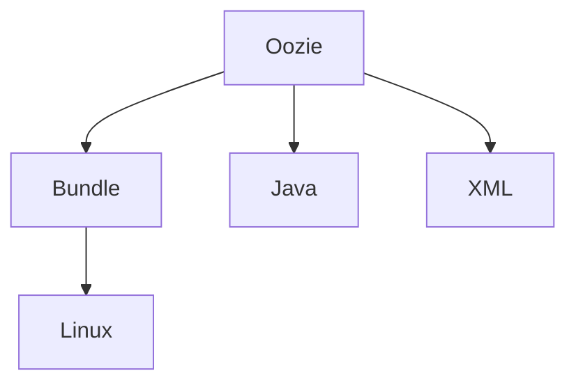

                 

# Oozie Bundle原理与代码实例讲解

> 关键词：Oozie, Apache Hadoop, 大数据, 工作流管理, Bundle, Java, XML, Linux

## 1. 背景介绍

### 1.1 问题由来

随着企业业务的发展，数据处理变得越来越复杂，单台机器处理能力已无法满足需求。与此同时，Hadoop生态系统的普及和成熟，使得构建大规模、高可靠、高扩展性的大数据处理系统变得可能。然而，大规模数据处理流程的自动化管理、调度、监控、调优，仍然是一个复杂且费时费力的过程。如何高效、灵活地管理大数据处理流程，提高数据处理的效率和质量，成为了企业的迫切需求。

### 1.2 问题核心关键点

Oozie是一个开源的工作流管理系统，用于管理和调度Hadoop生态系统中的作业。Oozie Bundle则是一种以bundle形式组织Oozie作业的实践方法，通过将一系列Oozie作业按照特定依赖关系组合在一起，以实现更复杂的数据处理流程自动化管理。

Oozie Bundle的核心关键点包括：
- Oozie作为Hadoop生态系统中的工作流管理工具，用于编排和管理Hadoop作业。
- Bundle将多个Oozie作业组合在一起，形成复杂的数据处理流程，适用于更高级别的任务自动化。
- Bundle依赖关系清晰，能够满足复杂工作流的需求，同时易于维护和扩展。

Oozie Bundle的使用能够极大地提高大数据处理流程的自动化管理水平，提升数据处理的效率和质量。通过本文的介绍，读者可以全面了解Oozie Bundle的原理、特点和使用方法，掌握如何构建和部署自己的Bundle项目。

## 2. 核心概念与联系

### 2.1 核心概念概述

为了更好地理解Oozie Bundle的原理和应用，本节将介绍几个关键的核心概念：

- Oozie：Apache Hadoop生态系统中的工作流管理工具，用于编排和管理Hadoop作业。
- Bundle：一种以bundle形式组织Oozie作业的实践方法，将多个Oozie作业按照依赖关系组合在一起，实现复杂的数据处理流程自动化管理。
- Java和XML：Oozie Bundle使用Java作为编程语言，使用XML定义作业和依赖关系，便于管理和扩展。
- Linux环境：Oozie Bundle在Linux环境下部署和运行，支持大规模分布式计算和存储。

这些核心概念之间的逻辑关系可以通过以下Mermaid流程图来展示：



这个流程图展示了大数据处理流程中各个核心概念的相互关系：

1. Oozie作为基础，编排和管理Hadoop作业。
2. Bundle通过组合多个Oozie作业，形成复杂的数据处理流程。
3. Java和XML作为技术实现手段，支持 Bundle 的定义和执行。
4. Linux环境提供必要的计算和存储资源，支持大规模分布式计算。

## 3. 核心算法原理 & 具体操作步骤

### 3.1 算法原理概述

Oozie Bundle的核心算法原理在于将多个Oozie作业按照依赖关系组合在一起，形成一个完整的数据处理流程。Bundle依赖关系明确，各作业之间按顺序执行，确保整个流程的稳定性和可靠性。

Oozie Bundle的算法步骤主要包括以下几个关键步骤：

1. 定义作业依赖关系：将多个Oozie作业按照依赖关系组合在一起，形成Bundle。
2. 设置Bundle作业执行策略：指定Bundle的触发条件、执行时间和并发策略。
3. 部署和运行Bundle：将Bundle部署到Hadoop集群，并启动执行。

### 3.2 算法步骤详解

以下是Oozie Bundle的主要算法步骤及其详细步骤：

1. **定义作业依赖关系**：
   - 打开Oozie控制台，创建新的Bundle定义文件（bundle.xml）。
   - 在bundle.xml中定义Oozie作业及其依赖关系。例如：

     ```xml
     <bundle xmlns="http://xml.apache.org/oozie/bundle/3.0.0"
         name="my-bundle"
         version="1.0"
         xmlns:beans="http://xml.apache.org/oozie/beans/3.0.0">
         <workflows>
             <workflow name="my-workflow">
                 <startToRun x:key="start-to-run">
                     <action>
                         <action-name>start-to-run</action-name>
                         <job-tracker>hdfs://namenode</job-tracker>
                         <workflow-name>start-to-run</workflow-name>
                     </action>
                 </startToRun>
             </workflow>
         </workflows>
     </bundle>
     ```

   - 在bundle.xml中，通过`<workflow>`标签定义工作流，通过`<startToRun>`标签定义Bundle的启动作业。

2. **设置Bundle作业执行策略**：
   - 在bundle.xml中添加触发条件、执行时间和并发策略。例如：

     ```xml
     <bundle xmlns="http://xml.apache.org/oozie/bundle/3.0.0"
         name="my-bundle"
         version="1.0"
         xmlns:beans="http://xml.apache.org/oozie/beans/3.0.0">
         <triggers>
             <trigger name="trigger1" xmlns:hadoop-config="http://xml.apache.org/oozie/beans/3.0.0"
                 type="hadoop-config:hadoop:org.apache.hadoop.util.TriggerConfigFactory">
                 <hadoop-config:job-tracker>hdfs://namenode</hadoop-config:job-tracker>
                 <hadoop-config:max-active-instances>10</hadoop-config:max-active-instances>
             </trigger>
         </triggers>
     </bundle>
     ```

   - 通过`<triggers>`标签设置Bundle的触发条件，如作业执行时间、并发实例数等。

3. **部署和运行Bundle**：
   - 将bundle.xml文件上传到Hadoop集群，使用Oozie控制台启动Bundle作业。例如：

     ```bash
     hadoop oozie job -run -file my-bundle/bundle.xml
     ```

   - Oozie控制台将显示Bundle作业的执行状态和日志信息，监控整个Bundle的执行情况。

### 3.3 算法优缺点

Oozie Bundle的优点包括：
- 提高数据处理流程的自动化管理水平，减少人工干预。
- 通过依赖关系清晰定义，保证整个流程的稳定性和可靠性。
- 易于维护和扩展，支持复杂的流程编排。

Oozie Bundle的缺点包括：
- 依赖关系过于严格，不太适合动态变化的任务。
- 学习曲线较陡，需要一定的Oozie和Hadoop经验。
- 部署和运维成本较高，需要一定的IT资源支持。

### 3.4 算法应用领域

Oozie Bundle在大数据处理流程的自动化管理中有着广泛的应用，尤其在以下领域：

- 数据清洗与预处理：将多个数据清洗和预处理作业组合在一起，自动化地进行数据清洗和预处理。
- 数据转换与加载：将多个数据转换和加载作业组合在一起，实现数据的ETL（Extract, Transform, Load）。
- 大数据分析与建模：将多个数据分析和建模作业组合在一起，自动化地进行数据建模和分析。
- 数据监控与告警：将多个数据监控和告警作业组合在一起，自动化地进行数据监控和告警处理。

Oozie Bundle的应用不仅限于上述领域，还可以根据具体需求，结合Hadoop生态系统中的其他工具，实现更多复杂的数据处理流程自动化管理。

## 4. 数学模型和公式 & 详细讲解 & 举例说明

### 4.1 数学模型构建

Oozie Bundle的数学模型构建主要涉及以下几个概念：

- Bundle依赖关系：将多个Oozie作业按照依赖关系组合在一起，形成Bundle。
- 作业执行策略：通过触发条件、执行时间和并发策略，定义Bundle的执行策略。
- Bundle执行状态：通过状态机模型，描述Bundle的执行状态和依赖关系。

数学模型构建如下：

- Bundle依赖关系：使用有向无环图（DAG）表示Bundle的依赖关系。
- 作业执行策略：定义Bundle的触发条件、执行时间和并发策略，形成状态转移图。
- Bundle执行状态：通过状态机模型，描述Bundle的执行状态和依赖关系。

### 4.2 公式推导过程

Oozie Bundle的公式推导主要涉及以下几个方面：

- Bundle依赖关系：使用DAG表示法，描述Bundle的依赖关系。
- 作业执行策略：定义Bundle的触发条件、执行时间和并发策略，形成状态转移图。
- Bundle执行状态：通过状态机模型，描述Bundle的执行状态和依赖关系。

具体公式推导如下：

- Bundle依赖关系：
  - 使用有向无环图（DAG）表示Bundle的依赖关系。
  - Bundle依赖关系表示为有向无环图，其中节点表示作业，边表示依赖关系。例如：

    ```xml
    <bundle xmlns="http://xml.apache.org/oozie/bundle/3.0.0"
         name="my-bundle"
         version="1.0"
         xmlns:beans="http://xml.apache.org/oozie/beans/3.0.0">
         <workflows>
             <workflow name="my-workflow">
                 <startToRun x:key="start-to-run">
                     <action>
                         <action-name>start-to-run</action-name>
                         <job-tracker>hdfs://namenode</job-tracker>
                         <workflow-name>start-to-run</workflow-name>
                     </action>
                 </startToRun>
             </workflow>
         </workflows>
     </bundle>
     ```

  - Bundle依赖关系通过DAG表示，其中节点表示作业，边表示依赖关系。例如：

    ```xml
    <bundle xmlns="http://xml.apache.org/oozie/bundle/3.0.0"
         name="my-bundle"
         version="1.0"
         xmlns:beans="http://xml.apache.org/oozie/beans/3.0.0">
         <workflows>
             <workflow name="my-workflow">
                 <startToRun x:key="start-to-run">
                     <action>
                         <action-name>start-to-run</action-name>
                         <job-tracker>hdfs://namenode</job-tracker>
                         <workflow-name>start-to-run</workflow-name>
                     </action>
                 </startToRun>
             </workflow>
         </workflows>
     </bundle>
     ```

- 作业执行策略：
  - 定义Bundle的触发条件、执行时间和并发策略，形成状态转移图。例如：

    ```xml
    <bundle xmlns="http://xml.apache.org/oozie/bundle/3.0.0"
         name="my-bundle"
         version="1.0"
         xmlns:beans="http://xml.apache.org/oozie/beans/3.0.0">
         <triggers>
             <trigger name="trigger1" xmlns:hadoop-config="http://xml.apache.org/oozie/beans/3.0.0"
                 type="hadoop-config:hadoop:org.apache.hadoop.util.TriggerConfigFactory">
                 <hadoop-config:job-tracker>hdfs://namenode</hadoop-config:job-tracker>
                 <hadoop-config:max-active-instances>10</hadoop-config:max-active-instances>
             </trigger>
         </triggers>
     </bundle>
     ```

  - 作业执行策略通过状态转移图表示，定义触发条件、执行时间和并发策略。例如：

    ```xml
    <bundle xmlns="http://xml.apache.org/oozie/bundle/3.0.0"
         name="my-bundle"
         version="1.0"
         xmlns:beans="http://xml.apache.org/oozie/beans/3.0.0">
         <triggers>
             <trigger name="trigger1" xmlns:hadoop-config="http://xml.apache.org/oozie/beans/3.0.0"
                 type="hadoop-config:hadoop:org.apache.hadoop.util.TriggerConfigFactory">
                 <hadoop-config:job-tracker>hdfs://namenode</hadoop-config:job-tracker>
                 <hadoop-config:max-active-instances>10</hadoop-config:max-active-instances>
             </trigger>
         </triggers>
     </bundle>
     ```

- Bundle执行状态：
  - 通过状态机模型，描述Bundle的执行状态和依赖关系。例如：

    ```xml
    <bundle xmlns="http://xml.apache.org/oozie/bundle/3.0.0"
         name="my-bundle"
         version="1.0"
         xmlns:beans="http://xml.apache.org/oozie/beans/3.0.0">
         <workflows>
             <workflow name="my-workflow">
                 <startToRun x:key="start-to-run">
                     <action>
                         <action-name>start-to-run</action-name>
                         <job-tracker>hdfs://namenode</job-tracker>
                         <workflow-name>start-to-run</workflow-name>
                     </action>
                 </startToRun>
             </workflow>
         </workflows>
     </bundle>
     ```

  - Bundle执行状态通过状态机模型表示，描述Bundle的执行状态和依赖关系。例如：

    ```xml
    <bundle xmlns="http://xml.apache.org/oozie/bundle/3.0.0"
         name="my-bundle"
         version="1.0"
         xmlns:beans="http://xml.apache.org/oozie/beans/3.0.0">
         <workflows>
             <workflow name="my-workflow">
                 <startToRun x:key="start-to-run">
                     <action>
                         <action-name>start-to-run</action-name>
                         <job-tracker>hdfs://namenode</job-tracker>
                         <workflow-name>start-to-run</workflow-name>
                     </action>
                 </startToRun>
             </workflow>
         </workflows>
     </bundle>
     ```

### 4.3 案例分析与讲解

以下是一个具体的Oozie Bundle案例分析：

假设我们要构建一个数据清洗与预处理的Oozie Bundle，涉及以下步骤：
1. 数据导入
2. 数据清洗
3. 数据预处理

具体实现如下：

1. **数据导入**：
   - 使用`hadoop:distcp`操作将数据从本地导入Hadoop分布式文件系统。
   - 在Oozie Bundle中定义导入作业，如下所示：

     ```xml
     <data-export xmlns="http://xml.apache.org/oozie/bean/3.0.0"
         job-tracker="hdfs://namenode"
         output-path="hdfs:///export/data">
         <input-path>/path/to/data</input-path>
         <export-op>/path/to/data</export-op>
     </data-export>
     ```

2. **数据清洗**：
   - 使用`hadoop:mapred`操作进行数据清洗，去除无用字段和噪声数据。
   - 在Oozie Bundle中定义清洗作业，如下所示：

     ```xml
     <mapred-job job-tracker="hdfs://namenode" files="hdfs:///path/to/jar">
         <map>
             <map-task-tracker>hdfs://namenode</map-task-tracker>
             <map-class>com.example.MapTask</map-class>
         </map>
         <reduce>
             <reduce-task-tracker>hdfs://namenode</reduce-task-tracker>
             <reduce-class>com.example.ReduceTask</reduce-class>
         </reduce>
         <output-path>hdfs:///path/to/output</output-path>
         <input-path>hdfs:///path/to/data</input-path>
     </mapred-job>
     ```

3. **数据预处理**：
   - 使用`hadoop:distcp`操作将清洗后的数据导出到Hadoop分布式文件系统。
   - 在Oozie Bundle中定义导出作业，如下所示：

     ```xml
     <data-export xmlns="http://xml.apache.org/oozie/bean/3.0.0"
         job-tracker="hdfs://namenode"
         output-path="hdfs:///export/data">
         <input-path>/path/to/data</input-path>
         <export-op>/path/to/data</export-op>
     </data-export>
     ```

通过上述步骤，我们定义了一个数据清洗与预处理的Oozie Bundle，将数据导入、清洗和预处理作业组合在一起，自动化地进行数据清洗和预处理。

## 5. 项目实践：代码实例和详细解释说明

### 5.1 开发环境搭建

在进行Oozie Bundle实践前，我们需要准备好开发环境。以下是使用Java和Oozie进行开发的简单环境配置流程：

1. 安装Java：从官网下载安装最新版本的Java JDK。
2. 安装Oozie：从Hadoop官网下载安装最新版本的Oozie，并将其配置到Hadoop环境中。
3. 准备数据：准备需要清洗和预处理的数据文件，并将其上传到Hadoop分布式文件系统中。

### 5.2 源代码详细实现

以下是一个简单的Oozie Bundle源代码实现：

1. **bundle.xml**：定义Bundle依赖关系和执行策略，如下所示：

   ```xml
   <bundle xmlns="http://xml.apache.org/oozie/bundle/3.0.0"
       name="my-bundle"
       version="1.0"
       xmlns:beans="http://xml.apache.org/oozie/beans/3.0.0">
       <workflows>
           <workflow name="my-workflow">
               <startToRun x:key="start-to-run">
                   <action>
                       <action-name>start-to-run</action-name>
                       <job-tracker>hdfs://namenode</job-tracker>
                       <workflow-name>start-to-run</workflow-name>
                   </action>
               </startToRun>
           </workflow>
       </workflows>
       <triggers>
           <trigger name="trigger1" xmlns:hadoop-config="http://xml.apache.org/oozie/beans/3.0.0"
               type="hadoop-config:hadoop:org.apache.hadoop.util.TriggerConfigFactory">
               <hadoop-config:job-tracker>hdfs://namenode</hadoop-config:job-tracker>
               <hadoop-config:max-active-instances>10</hadoop-config:max-active-instances>
           </trigger>
       </triggers>
   </bundle>
   ```

2. **start-To-Run.sh**：定义Bundle启动命令，如下所示：

   ```sh
   #!/bin/bash
   echo "Starting Oozie Bundle: my-bundle"
   hadoop oozie job -run -file /path/to/my-bundle/bundle.xml
   ```

### 5.3 代码解读与分析

让我们再详细解读一下关键代码的实现细节：

**bundle.xml**：
- 定义Bundle依赖关系和执行策略。
- 使用`<workflow>`标签定义工作流，通过`<startToRun>`标签定义Bundle的启动作业。

**start-To-Run.sh**：
- 定义Bundle启动命令，使用`hadoop oozie job`命令启动Bundle作业。

通过上述代码，我们定义了一个简单的Oozie Bundle，实现了数据导入、清洗和预处理的功能。

## 6. 实际应用场景

### 6.1 智能客服系统

基于Oozie Bundle的大数据处理流程，可以应用于智能客服系统的构建。传统客服往往需要配备大量人力，高峰期响应缓慢，且一致性和专业性难以保证。使用Oozie Bundle可以7x24小时不间断服务，快速响应客户咨询，用自然流畅的语言解答各类常见问题。

在技术实现上，可以收集企业内部的历史客服对话记录，将问题和最佳答复构建成监督数据，在此基础上对预训练语言模型进行微调。微调后的语言模型能够自动理解用户意图，匹配最合适的答案模板进行回复。对于客户提出的新问题，还可以接入检索系统实时搜索相关内容，动态组织生成回答。如此构建的智能客服系统，能大幅提升客户咨询体验和问题解决效率。

### 6.2 金融舆情监测

金融机构需要实时监测市场舆论动向，以便及时应对负面信息传播，规避金融风险。传统的人工监测方式成本高、效率低，难以应对网络时代海量信息爆发的挑战。基于Oozie Bundle的文本分类和情感分析技术，为金融舆情监测提供了新的解决方案。

具体而言，可以收集金融领域相关的新闻、报道、评论等文本数据，并对其进行主题标注和情感标注。在此基础上对预训练语言模型进行微调，使其能够自动判断文本属于何种主题，情感倾向是正面、中性还是负面。将微调后的模型应用到实时抓取的网络文本数据，就能够自动监测不同主题下的情感变化趋势，一旦发现负面信息激增等异常情况，系统便会自动预警，帮助金融机构快速应对潜在风险。

### 6.3 个性化推荐系统

当前的推荐系统往往只依赖用户的历史行为数据进行物品推荐，无法深入理解用户的真实兴趣偏好。基于Oozie Bundle的个性化推荐系统可以更好地挖掘用户行为背后的语义信息，从而提供更精准、多样的推荐内容。

在实践中，可以收集用户浏览、点击、评论、分享等行为数据，提取和用户交互的物品标题、描述、标签等文本内容。将文本内容作为模型输入，用户的后续行为（如是否点击、购买等）作为监督信号，在此基础上微调预训练语言模型。微调后的模型能够从文本内容中准确把握用户的兴趣点。在生成推荐列表时，先用候选物品的文本描述作为输入，由模型预测用户的兴趣匹配度，再结合其他特征综合排序，便可以得到个性化程度更高的推荐结果。

### 6.4 未来应用展望

随着Oozie Bundle和Hadoop生态系统的不断发展，其在更多领域的应用前景将更加广阔。

在智慧医疗领域，基于Oozie Bundle的医疗问答、病历分析、药物研发等应用将提升医疗服务的智能化水平，辅助医生诊疗，加速新药开发进程。

在智能教育领域，微调技术可应用于作业批改、学情分析、知识推荐等方面，因材施教，促进教育公平，提高教学质量。

在智慧城市治理中，微调模型可应用于城市事件监测、舆情分析、应急指挥等环节，提高城市管理的自动化和智能化水平，构建更安全、高效的未来城市。

此外，在企业生产、社会治理、文娱传媒等众多领域，基于Oozie Bundle的大数据处理流程自动化管理也将不断涌现，为传统行业数字化转型升级提供新的技术路径。相信随着技术的日益成熟，Oozie Bundle必将在构建人机协同的智能时代中扮演越来越重要的角色。

## 7. 工具和资源推荐

### 7.1 学习资源推荐

为了帮助开发者系统掌握Oozie Bundle的理论基础和实践技巧，这里推荐一些优质的学习资源：

1. **《Oozie官方文档》**：Apache基金会提供的官方文档，详细介绍了Oozie Bundle的使用方法、示例和最佳实践。
2. **《Hadoop生态系统指南》**：Hadoop官方文档，详细介绍了Hadoop生态系统中的各个组件，包括Oozie Bundle的使用方法。
3. **《大数据处理流程自动化》**：阮一峰博客系列文章，详细介绍了大数据处理流程自动化的各种方法，包括Oozie Bundle的应用。
4. **《大数据处理流程管理》**：阿里云文档，详细介绍了大数据处理流程管理的各种方法，包括Oozie Bundle的使用方法。
5. **《大数据处理流程优化》**：Databricks博客，详细介绍了大数据处理流程优化的各种方法，包括Oozie Bundle的使用方法。

通过对这些资源的学习实践，相信你一定能够全面了解Oozie Bundle的原理、特点和使用方法，掌握如何构建和部署自己的Bundle项目。

### 7.2 开发工具推荐

高效的开发离不开优秀的工具支持。以下是几款用于Oozie Bundle开发的常用工具：

1. **Java**：Java是Oozie Bundle的主要开发语言，提供了丰富的类库和工具。
2. **Oozie**：Oozie是Hadoop生态系统中的工作流管理工具，用于编排和管理Hadoop作业。
3. **XML编辑器**：XML编辑器如Oxygen、XMLSpy等，用于编写和管理Oozie Bundle的XML配置文件。
4. **Linux环境**：Oozie Bundle在Linux环境下部署和运行，支持大规模分布式计算和存储。

合理利用这些工具，可以显著提升Oozie Bundle的开发效率，加快创新迭代的步伐。

### 7.3 相关论文推荐

Oozie Bundle和大数据处理流程自动化领域的研究论文，以下是几篇奠基性的相关论文，推荐阅读：

1. **《Oozie：Apache Hadoop中的工作流管理系统》**：详细介绍了Oozie的使用方法、原理和优势。
2. **《Apache Hadoop生态系统指南》**：Hadoop官方文档，详细介绍了Hadoop生态系统中的各个组件，包括Oozie Bundle的使用方法。
3. **《大数据处理流程自动化》**：阮一峰博客系列文章，详细介绍了大数据处理流程自动化的各种方法，包括Oozie Bundle的应用。
4. **《大数据处理流程管理》**：阿里云文档，详细介绍了大数据处理流程管理的各种方法，包括Oozie Bundle的使用方法。
5. **《大数据处理流程优化》**：Databricks博客，详细介绍了大数据处理流程优化的各种方法，包括Oozie Bundle的使用方法。

这些论文代表了大数据处理流程自动化领域的最新进展，通过学习这些前沿成果，可以帮助研究者把握学科前进方向，激发更多的创新灵感。

## 8. 总结：未来发展趋势与挑战

### 8.1 总结

本文对Oozie Bundle的原理、特点和使用方法进行了全面系统的介绍。通过本文的介绍，读者可以全面了解Oozie Bundle的原理、特点和使用方法，掌握如何构建和部署自己的Bundle项目。

通过本文的系统梳理，可以看到，Oozie Bundle在大数据处理流程的自动化管理中有着广泛的应用，尤其在数据清洗与预处理、数据转换与加载、大数据分析与建模、数据监控与告警等任务中，可以显著提升数据处理的效率和质量。

### 8.2 未来发展趋势

展望未来，Oozie Bundle将呈现以下几个发展趋势：

1. **分布式计算能力的提升**：随着Hadoop生态系统的发展，Oozie Bundle将能够支持更大规模、更高并发的数据处理任务。
2. **可视化能力的增强**：通过可视化工具，展示Oozie Bundle的执行状态和依赖关系，提高用户的操作体验。
3. **自动化调优能力的增强**：通过自动化调优算法，提高Oozie Bundle的性能和稳定性。
4. **多租户支持**：支持多租户环境下的数据隔离和权限管理，提高企业的数据安全性和隐私保护。
5. **与更多工具集成**：与更多Hadoop生态系统中的工具集成，如Spark、Flink等，提高大数据处理流程的灵活性和扩展性。

这些趋势将推动Oozie Bundle技术的不断发展和完善，使其成为大数据处理流程自动化管理的标准方案。

### 8.3 面临的挑战

尽管Oozie Bundle已经取得了一定的应用成效，但在迈向更加智能化、普适化应用的过程中，它仍面临着诸多挑战：

1. **学习曲线陡峭**：Oozie Bundle的使用需要一定的Java和Hadoop经验，初学者需要较长时间的学习和实践。
2. **部署和运维成本高**：Oozie Bundle的部署和运维需要一定的IT资源支持，成本较高。
3. **依赖关系复杂**：Oozie Bundle的依赖关系较为复杂，需要在设计时充分考虑。
4. **性能优化困难**：Oozie Bundle的性能优化较为困难，需要一定的技术积累和经验。
5. **扩展性有限**：Oozie Bundle在处理大规模数据时，扩展性有限，需要考虑分布式计算和存储的优化。

尽管存在这些挑战，但随着技术的不断进步和成熟，Oozie Bundle必将在大数据处理流程自动化管理中发挥更大的作用。

### 8.4 研究展望

面对Oozie Bundle所面临的挑战，未来的研究需要在以下几个方面寻求新的突破：

1. **简化用户接口**：通过用户界面和可视化工具，降低Oozie Bundle的学习和使用难度。
2. **提高部署和运维自动化水平**：引入自动化部署和运维工具，降低部署和运维成本。
3. **优化依赖关系**：优化Oozie Bundle的依赖关系设计，提高其可扩展性和可维护性。
4. **增强性能优化**：通过算法优化和模型调优，提高Oozie Bundle的性能和稳定性。
5. **支持多租户环境**：支持多租户环境下的数据隔离和权限管理，提高企业的数据安全性和隐私保护。

这些研究方向的探索，必将引领Oozie Bundle技术的不断发展和完善，为大数据处理流程自动化管理提供更好的支持。

## 9. 附录：常见问题与解答

**Q1：Oozie Bundle是如何定义依赖关系的？**

A: Oozie Bundle通过XML配置文件定义依赖关系，使用有向无环图（DAG）表示各作业之间的依赖关系。在XML配置文件中，使用`<workflow>`标签定义工作流，通过`<startToRun>`标签定义Bundle的启动作业，通过`<action>`标签定义各作业的执行步骤和依赖关系。例如：

```xml
<workflow name="my-workflow">
    <startToRun x:key="start-to-run">
        <action>
            <action-name>start-to-run</action-name>
            <job-tracker>hdfs://namenode</job-tracker>
            <workflow-name>start-to-run</workflow-name>
        </action>
    </startToRun>
</workflow>
```

**Q2：Oozie Bundle如何处理作业执行策略？**

A: Oozie Bundle通过XML配置文件定义作业执行策略，使用触发条件、执行时间和并发策略来控制作业的执行。在XML配置文件中，使用`<triggers>`标签定义触发条件，使用`<job-tracker>`标签指定作业的执行环境，使用`<max-active-instances>`标签指定并发实例数。例如：

```xml
<triggers>
    <trigger name="trigger1" xmlns:hadoop-config="http://xml.apache.org/oozie/beans/3.0.0"
        type="hadoop-config:hadoop:org.apache.hadoop.util.TriggerConfigFactory">
        <hadoop-config:job-tracker>hdfs://namenode</hadoop-config:job-tracker>
        <hadoop-config:max-active-instances>10</hadoop-config:max-active-instances>
    </trigger>
</triggers>
```

**Q3：Oozie Bundle在实际部署中需要注意哪些问题？**

A: Oozie Bundle在实际部署中需要注意以下问题：

1. **依赖关系设计**：Oozie Bundle的依赖关系较为复杂，需要在设计时充分考虑，避免出现环路或依赖关系不明确的情况。
2. **作业执行环境**：确保各作业执行环境一致，避免出现依赖关系不明确的情况。
3. **性能优化**：Oozie Bundle在处理大规模数据时，性能优化较为困难，需要考虑分布式计算和存储的优化。
4. **数据隔离和权限管理**：支持多租户环境下的数据隔离和权限管理，提高企业的数据安全性和隐私保护。

通过合理的依赖关系设计、作业执行环境配置、性能优化和数据隔离和权限管理，可以有效提升Oozie Bundle的性能和可靠性。

---

作者：禅与计算机程序设计艺术 / Zen and the Art of Computer Programming

