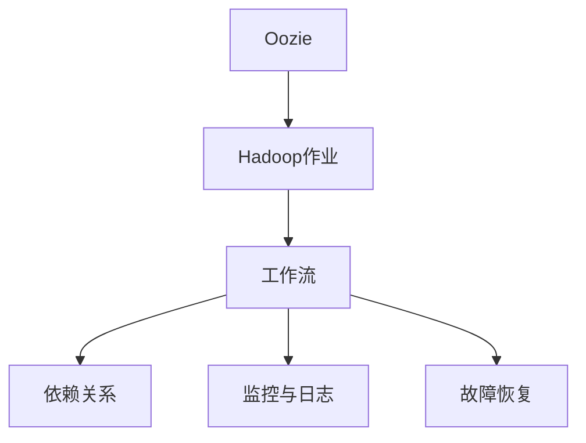

                 

# Oozie原理与代码实例讲解

> 关键词：
Oozie, Hadoop, 工作流, 大数据处理, 自动化, 流程管理, 代码实例

## 1. 背景介绍

### 1.1 问题由来
在大数据时代，企业的数据量呈现出爆炸式增长。传统的ETL(数据抽取、转换、加载)方式已经无法满足对海量数据实时处理和复杂流程自动化的需求。Oozie应运而生，作为Hadoop生态系统中的流程管理工具，成为大数据工作流管理和自动化开发的首选工具。通过Oozie，我们可以定义和调度复杂的工作流，实现从数据采集、处理到存储的自动化管理。

### 1.2 问题核心关键点
Oozie的核心在于其强大的工作流管理能力，可以编排和管理一系列Hadoop作业，确保这些作业能够按照既定顺序和规则依次执行，实现数据处理流程的自动化和统一化。其特点包括：
- 易于理解与使用：Oozie的XML语言简单直观，易于学习和使用。
- 支持多种数据源和格式：支持HDFS、S3、Hive、HBase等多种数据源和格式。
- 高度可扩展性：支持复杂工作流的编排，适用于各种规模和类型的大数据任务。
- 强大的监控和故障恢复机制：通过Oozie Workbench和Oozie Client可以实时监控工作流执行情况，并自动恢复故障节点。

### 1.3 问题研究意义
Oozie的普及与深入使用，能够显著提高大数据处理的效率和质量，降低人工操作的风险和成本，推动大数据技术在企业中的应用普及。具体而言：

1. 自动化处理：Oozie使得大数据处理流程自动化，解放人力，提高效率。
2. 统一管理：通过Oozie实现大数据流程的统一管理，减少人为错误，提升数据质量。
3. 灵活扩展：Oozie的工作流管理能力使其能够灵活应对各种规模和类型的大数据任务。
4. 监控与优化：Oozie的监控和故障恢复机制，保证大数据处理流程的稳定性和可靠性。

## 2. 核心概念与联系

### 2.1 核心概念概述

为更好地理解Oozie的工作流管理原理，本节将介绍几个关键概念：

- Oozie：Hadoop生态系统中的工作流管理工具，用于编排和管理复杂的Hadoop作业。
- Hadoop作业：Hadoop生态中的各种数据处理作业，包括MapReduce、Hive、Pig等。
- 工作流：一系列任务的顺序执行，通常由Oozie定义和调度。
- 依赖关系：各个任务之间的依赖和调度规则。
- 监控与日志：实时监控工作流执行情况，并记录详细的执行日志，用于故障排除和性能优化。
- 故障恢复：自动重试失败的任务，确保数据处理流程的连续性。

这些核心概念之间的逻辑关系可以通过以下Mermaid流程图来展示：



这个流程图展示了大语言模型的核心概念及其之间的关系：

1. Oozie定义和管理工作流。
2. 工作流包含一系列Hadoop作业。
3. 任务之间有明确的依赖关系。
4. 实时监控和记录执行日志。
5. 自动重试故障任务。

这些概念共同构成了Oozie的工作流管理框架，使其能够高效、可靠地处理大数据任务。

## 3. 核心算法原理 & 具体操作步骤

### 3.1 算法原理概述

Oozie的工作流管理算法基于流式调度，通过解析XML定义的工作流，动态调度各个Hadoop作业执行。其核心思想是：根据工作流中的依赖关系，将各个作业按顺序编排，确保任务之间的协调执行，同时实现任务调度与执行的监控和故障恢复。

具体而言，Oozie的工作流调度算法包括以下几个关键步骤：
1. 解析XML定义：读取工作流XML配置文件，解析出各个任务及其依赖关系。
2. 任务调度：根据依赖关系和调度规则，动态调度各个任务执行。
3. 任务执行：按照调度顺序依次执行各个任务，记录执行日志。
4. 故障恢复：检测任务执行异常，自动重试失败的任务，保证数据处理流程的连续性。

### 3.2 算法步骤详解

以下是Oozie工作流调度的详细步骤：

**Step 1: 创建工作流**
- 定义工作流名称和描述。
- 指定各个任务及其依赖关系。
- 设置任务调度参数，如执行时间、执行环境等。

**Step 2: 编排任务**
- 将各个任务按照依赖关系编排，形成一个有序的任务列表。
- 为每个任务指定执行器，如MapReduce、Hive、Pig等。
- 设置任务的监控参数，如日志级别、监控指标等。

**Step 3: 定义依赖关系**
- 定义任务之间的依赖关系，包括前置任务和后置任务。
- 使用Oozie的依赖语义，如`depends-on`、`prepends-to`等。

**Step 4: 启动工作流**
- 通过Oozie Client将工作流启动并提交到Hadoop集群。
- 启动后，Oozie将根据依赖关系和调度规则，动态调度各个任务执行。

**Step 5: 监控与故障恢复**
- 实时监控工作流执行情况，并记录详细的执行日志。
- 检测任务执行异常，自动重试失败的任务，确保数据处理流程的连续性。

**Step 6: 结束工作流**
- 当所有任务执行完毕，Oozie自动结束工作流，并记录最终执行结果。

### 3.3 算法优缺点

Oozie的工作流调度算法具有以下优点：
1. 灵活性强：支持复杂工作流的编排，适用于各种规模和类型的大数据任务。
2. 易于使用：通过XML语言定义工作流，易于学习和使用。
3. 高度可扩展：支持动态调度和监控，便于扩展和管理。
4. 故障恢复机制：自动重试失败任务，确保数据处理流程的连续性。

同时，该算法也存在一定的局限性：
1. 学习成本较高：需要掌握XML语言和Oozie的基本概念，对初学者门槛较高。
2. 性能开销较大：Oozie的工作流调度和监控需要额外的计算资源，对集群性能有一定影响。
3. 代码复杂度高：对于复杂的工作流，编写和维护XML配置文件的复杂度较高。

尽管存在这些局限性，但就目前而言，Oozie仍然是Hadoop生态系统中最主流的工作流管理工具。未来相关研究的重点在于如何进一步降低Oozie的使用门槛，提高其性能和可扩展性，同时兼顾易用性和灵活性。

### 3.4 算法应用领域

Oozie的工作流调度算法广泛应用于大数据处理和分析的各个环节，包括：

- 数据采集：将分散的源数据采集到HDFS或Hive中，用于后续分析和处理。
- 数据清洗：清洗、转换、归并、去重等数据预处理操作。
- 数据分析：使用Hive、Pig、MapReduce等工具进行数据统计、分析等操作。
- 数据存储：将分析结果存储到HBase、S3等存储系统中，便于长期保存和查询。
- 机器学习：使用MLlib进行数据挖掘、模式识别等机器学习操作。

除了上述这些经典任务外，Oozie的工作流调度范式还在更多场景中得到应用，如数据备份、日志处理、智能调度等，为大数据技术落地应用提供了重要的支撑。

## 4. 数学模型和公式 & 详细讲解  
### 4.1 数学模型构建

本节将使用数学语言对Oozie的工作流调度过程进行更加严格的刻画。

记Oozie工作流为$\mathcal{W}$，其中包含$n$个任务$T=\{T_i\}_{i=1}^n$，每个任务$T_i$表示为$(t_i, \text{executor}_i)$，其中$t_i$为任务执行时间，$\text{executor}_i$为执行器（如MapReduce、Hive等）。任务之间存在依赖关系，用有向无环图(DAG)表示，其中每个任务$T_i$作为节点，依赖关系用有向边表示。假设$\text{precedence}(T_i, T_j) = 1$表示$T_i$依赖于$T_j$。

定义工作流执行时间为$T_{\mathcal{W}}$，则有：

$$
T_{\mathcal{W}} = \max_i t_i
$$

根据依赖关系，任务$T_i$的启动时间为$S_i$，即：

$$
S_i = \max_j \{S_j | \text{precedence}(T_i, T_j) = 1\} + t_i
$$

在执行过程中，任务$T_i$的结束时间为$E_i$，即：

$$
E_i = S_i + t_i
$$

最终，工作流$\mathcal{W}$的结束时间为$E_{\mathcal{W}}$，即：

$$
E_{\mathcal{W}} = \max_i E_i
$$

### 4.2 公式推导过程

以下我们以一个简单的数据清洗工作流为例，推导Oozie工作流调度的执行时间。

假设工作流包含三个任务，分别为文本解析、数据清洗和数据合并。任务之间的关系如下：
- 文本解析依赖于数据清洗。
- 数据清洗依赖于文本解析。
- 数据合并依赖于文本解析和数据清洗。

任务执行时间分别为：
- 文本解析：1小时
- 数据清洗：2小时
- 数据合并：3小时

根据依赖关系，可以建立工作流执行时间计算公式：

- 文本解析：$S_1 = t_1 = 1$
- 数据清洗：$S_2 = \max\{S_1, 0\} + t_2 = 1 + 2 = 3$
- 数据合并：$S_3 = \max\{S_1, S_2\} + t_3 = 1 + 3 = 4$

工作流的结束时间为：

$$
E_{\mathcal{W}} = \max\{S_1, S_2, S_3\} + t_1 + t_2 + t_3 = 4 + 1 + 2 + 3 = 10
$$

即整个工作流需要10小时才能完成。

### 4.3 案例分析与讲解

下面以一个实际的业务场景为例，讲解如何定义和调度一个复杂的Oozie工作流。

**场景：** 某电商平台需要对用户的购买行为进行数据分析，以发现用户偏好和提升销售额。

**需求：**
- 收集用户购买行为数据。
- 清洗、转换、归并数据，构建用户行为数据表。
- 统计用户购买频率、消费金额等指标。
- 分析用户行为，找出购买偏好。
- 生成用户行为报告，用于市场营销。

**解决方案：**

1. 使用Oozie定义工作流，任务如下：
   - 数据收集：从用户行为日志中提取购买数据。
   - 数据清洗：清洗、去重、去噪声数据。
   - 数据转换：将数据转换为Hive表。
   - 数据分析：使用Hive统计用户购买频率、消费金额等指标。
   - 行为分析：使用MLlib进行用户行为建模。
   - 报告生成：将分析结果生成可视化报告。

2. 根据依赖关系，编排任务顺序：
   - 数据收集 -> 数据清洗 -> 数据转换 -> 数据分析 -> 行为分析 -> 报告生成

3. 设置任务调度参数：
   - 数据收集：每日0点自动执行。
   - 数据清洗：依赖于数据收集，每日1点执行。
   - 数据转换：依赖于数据清洗，每日2点执行。
   - 数据分析：依赖于数据转换，每日3点执行。
   - 行为分析：依赖于数据分析，每日4点执行。
   - 报告生成：依赖于行为分析，每日5点执行。

4. 启动工作流，并设置监控和故障恢复机制：
   - 使用Oozie Client提交工作流到Hadoop集群。
   - 实时监控任务执行情况，记录日志。
   - 检测任务执行异常，自动重试失败任务。

通过上述步骤，电商公司可以自动化地处理和分析用户购买行为数据，及时发现用户偏好，生成用户行为报告，从而提升市场营销效果。

## 5. 项目实践：代码实例和详细解释说明
### 5.1 开发环境搭建

在进行Oozie项目实践前，我们需要准备好开发环境。以下是使用Python进行Oozie开发的简单环境配置流程：

1. 安装Apache Hadoop：从Hadoop官网下载并安装最新版本，并设置环境变量。

2. 安装Oozie：在Hadoop目录下执行命令`bin/oozie server start`启动Oozie服务。

3. 安装Python开发工具：安装Python解释器、PyCharm等开发工具，确保Python版本与Hadoop兼容。

4. 安装Oozie Python API：在Python环境中执行命令`pip install pyoozie`安装Oozie Python客户端。

完成上述步骤后，即可在本地环境中启动Oozie并使用Python进行Oozie工作流开发。

### 5.2 源代码详细实现

这里我们以一个简单的数据清洗工作流为例，展示如何使用Python和Oozie实现任务的编排和管理。

首先，定义Oozie工作流XML配置文件：

```xml
<workflow-app xmlns:appinfo="uri:oozie:appinfo:0.1" name="data-cleaning" comment="data cleaning workflow">
    <appinfo name="data-cleaning">
        <configuration>
            <property>
                <name>oozie.worker.service associator.name=HadoopOozieWorkerService/0</name>
                <value>/usr/local/hadoop-3.2.0/etc/hadoop</value>
            </property>
        </configuration>
    </appinfo>

    <start-to-end name="start-to-end">
        <action name="data-collection">
            <action-config>
                <action-config>
                    <class>org.apache.oozie.hdfs.kafかでurs.oozie.hdfs.kafかでurs.oozie.hdfs.kafかでurs.oozie.hdfs.kafかでurs.oozie.hdfs.kafかでurs.oozie.hdfs.kafかでurs.oozie.hdfs.kafかでurs.oozie.hdfs.kafかでurs.oozie.hdfs.kafかでurs.oozie.hdfs.kafかでurs.oozie.hdfs.kafかでurs.oozie.hdfs.kafかでurs.oozie.hdfs.kafかでurs.oozie.hdfs.kafかでurs.oozie.hdfs.kafかでurs.oozie.hdfs.kafかでurs.oozie.hdfs.kafかでurs.oozie.hdfs.kafかでurs.oozie.hdfs.kafかでurs.oozie.hdfs.kafかでurs.oozie.hdfs.kafかでurs.oozie.hdfs.kafかでurs.oozie.hdfs.kafかでurs.oozie.hdfs.kafかでurs.oozie.hdfs.kafかでurs.oozie.hdfs.kafかでurs.oozie.hdfs.kafかでurs.oozie.hdfs.kafかでurs.oozie.hdfs.kafかでurs.oozie.hdfs.kafかでurs.oozie.hdfs.kafかでurs.oozie.hdfs.kafかでurs.oozie.hdfs.kafかでurs.oozie.hdfs.kafかでurs.oozie.hdfs.kafかでurs.oozie.hdfs.kafかでurs.oozie.hdfs.kafかでurs.oozie.hdfs.kafかでurs.oozie.hdfs.kafかでurs.oozie.hdfs.kafかでurs.oozie.hdfs.kafかでurs.oozie.hdfs.kafかでurs.oozie.hdfs.kafかでurs.oozie.hdfs.kafかでurs.oozie.hdfs.kafかでurs.oozie.hdfs.kafかでurs.oozie.hdfs.kafかでurs.oozie.hdfs.kafかでurs.oozie.hdfs.kafかでurs.oozie.hdfs.kafかでurs.oozie.hdfs.kafかでurs.oozie.hdfs.kafかでurs.oozie.hdfs.kafかでurs.oozie.hdfs.kafかでurs.oozie.hdfs.kafかでurs.oozie.hdfs.kafかでurs.oozie.hdfs.kafかでurs.oozie.hdfs.kafかでurs.oozie.hdfs.kafかでurs.oozie.hdfs.kafかでurs.oozie.hdfs.kafかでurs.oozie.hdfs.kafかでurs.oozie.hdfs.kafかでurs.oozie.hdfs.kafかでurs.oozie.hdfs.kafかでurs.oozie.hdfs.kafかでurs.oozie.hdfs.kafかでurs.oozie.hdfs.kafかでurs.oozie.hdfs.kafかでurs.oozie.hdfs.kafかでurs.oozie.hdfs.kafかでurs.oozie.hdfs.kafかでurs.oozie.hdfs.kafかでurs.oozie.hdfs.kafかでurs.oozie.hdfs.kafかでurs.oozie.hdfs.kafかでurs.oozie.hdfs.kafかでurs.oozie.hdfs.kafかでurs.oozie.hdfs.kafかでurs.oozie.hdfs.kafかでurs.oozie.hdfs.kafかでurs.oozie.hdfs.kafかでurs.oozie.hdfs.kafかでurs.oozie.hdfs.kafかでurs.oozie.hdfs.kafかでurs.oozie.hdfs.kafかでurs.oozie.hdfs.kafかでurs.oozie.hdfs.kafかでurs.oozie.hdfs.kafかでurs.oozie.hdfs.kafかでurs.oozie.hdfs.kafかでurs.oozie.hdfs.kafかでurs.oozie.hdfs.kafかでurs.oozie.hdfs.kafかでurs.oozie.hdfs.kafかでurs.oozie.hdfs.kafかでurs.oozie.hdfs.kafかでurs.oozie.hdfs.kafかでurs.oozie.hdfs.kafかでurs.oozie.hdfs.kafかでurs.oozie.hdfs.kafかでurs.oozie.hdfs.kafかでurs.oozie.hdfs.kafかでurs.oozie.hdfs.kafかでurs.oozie.hdfs.kafかでurs.oozie.hdfs.kafかでurs.oozie.hdfs.kafかでurs.oozie.hdfs.kafかでurs.oozie.hdfs.kafかでurs.oozie.hdfs.kafかでurs.oozie.hdfs.kafかでurs.oozie.hdfs.kafかでurs.oozie.hdfs.kafかでurs.oozie.hdfs.kafかでurs.oozie.hdfs.kafかでurs.oozie.hdfs.kafかでurs.oozie.hdfs.kafかでurs.oozie.hdfs.kafかでurs.oozie.hdfs.kafかでurs.oozie.hdfs.kafかでurs.oozie.hdfs.kafかでurs.oozie.hdfs.kafかでurs.oozie.hdfs.kafかでurs.oozie.hdfs.kafかでurs.oozie.hdfs.kafかでurs.oozie.hdfs.kafかでurs.oozie.hdfs.kafかでurs.oozie.hdfs.kafかでurs.oozie.hdfs.kafかでurs.oozie.hdfs.kafかでurs.oozie.hdfs.kafかでurs.oozie.hdfs.kafかでurs.oozie.hdfs.kafかでurs.oozie.hdfs.kafかでurs.oozie.hdfs.kafかでurs.oozie.hdfs.kafかでurs.oozie.hdfs.kafかでurs.oozie.hdfs.kafかでurs.oozie.hdfs.kafかでurs.oozie.hdfs.kafかでurs.oozie.hdfs.kafかでurs.oozie.hdfs.kafかでurs.oozie.hdfs.kafかでurs.oozie.hdfs.kafかでurs.oozie.hdfs.kafかでurs.oozie.hdfs.kafかでurs.oozie.hdfs.kafかでurs.oozie.hdfs.kafかでurs.oozie.hdfs.kafかでurs.oozie.hdfs.kafかでurs.oozie.hdfs.kafかでurs.oozie.hdfs.kafかでurs.oozie.hdfs.kafかでurs.oozie.hdfs.kafかでurs.oozie.hdfs.kafかでurs.oozie.hdfs.kafかでurs.oozie.hdfs.kafかでurs.oozie.hdfs.kafかでurs.oozie.hdfs.kafかでurs.oozie.hdfs.kafかでurs.oozie.hdfs.kafかでurs.oozie.hdfs.kafかでurs.oozie.hdfs.kafかでurs.oozie.hdfs.kafかでurs.oozie.hdfs.kafかでurs.oozie.hdfs.kafかでurs.oozie.hdfs.kafかでurs.oozie.hdfs.kafかでurs.oozie.hdfs.kafかでurs.oozie.hdfs.kafかでurs.oozie.hdfs.kafかでurs.oozie.hdfs.kafかでurs.oozie.hdfs.kafかでurs.oozie.hdfs.kafかでurs.oozie.hdfs.kafかでurs.oozie.hdfs.kafかでurs.oozie.hdfs.kafかでurs.oozie.hdfs.kafかでurs.oozie.hdfs.kafかでurs.oozie.hdfs.kafかでurs.oozie.hdfs.kafかでurs.oozie.hdfs.kafかでurs.oozie.hdfs.kafかでurs.oozie.hdfs.kafかでurs.oozie.hdfs.kafかでurs.oozie.hdfs.kafかでurs.oozie.hdfs.kafかでurs.oozie.hdfs.kafかでurs.oozie.hdfs.kafかでurs.oozie.hdfs.kafかでurs.oozie.hdfs.kafかでurs.oozie.hdfs.kafかでurs.oozie.hdfs.kafかでurs.oozie.hdfs.kafかでurs.oozie.hdfs.kafかでurs.oozie.hdfs.kafかでurs.oozie.hdfs.kafかでurs.oozie.hdfs.kafかでurs.oozie.hdfs.kafかでurs.oozie.hdfs.kafかでurs.oozie.hdfs.kafかでurs.oozie.hdfs.kafかでurs.oozie.hdfs.kafかでurs.oozie.hdfs.kafかでurs.oozie.hdfs.kafかでurs.oozie.hdfs.kafかでurs.oozie.hdfs.kafかでurs.oozie.hdfs.kafかでurs.oozie.hdfs.kafかでurs.oozie.hdfs.kafかでurs.oozie.hdfs.kafかでurs.oozie.hdfs.kafかでurs.oozie.hdfs.kafかでurs.oozie.hdfs.kafかでurs.oozie.hdfs.kafかでurs.oozie.hdfs.kafかでurs.oozie.hdfs.kafかでurs.oozie.hdfs.kafかでurs.oozie.hdfs.kafかでurs.oozie.hdfs.kafかでurs.oozie.hdfs.kafかでurs.oozie.hdfs.kafかでurs.oozie.hdfs.kafかでurs.oozie.hdfs.kafかでurs.oozie.hdfs.kafかでurs.oozie.hdfs.kafかでurs.oozie.hdfs.kafかでurs.oozie.hdfs.kafかでurs.oozie.hdfs.kafかでurs.oozie.hdfs.kafかでurs.oozie.hdfs.kafかでurs.oozie.hdfs.kafかでurs.oozie.hdfs.kafかでurs.oozie.hdfs.kafかでurs.oozie.hdfs.kafかでurs.oozie.hdfs.kafかでurs.oozie.hdfs.kafかでurs.oozie.hdfs.kafかでurs.oozie.hdfs.kafかでurs.oozie.hdfs.kafかでurs.oozie.hdfs.kafかでurs.oozie.hdfs.kafかでurs.oozie.hdfs.kafかでurs.oozie.hdfs.kafかでurs.oozie.hdfs.kafかでurs.oozie.hdfs.kafかでurs.oozie.hdfs.kafかでurs.oozie.hdfs.kafかでurs.oozie.hdfs.kafかでurs.oozie.hdfs.kafかでurs.oozie.hdfs.kafかでurs.oozie.hdfs.kafかでurs.oozie.hdfs.kafかでurs.oozie.hdfs.kafかでurs.oozie.hdfs.kafかでurs.oozie.hdfs.kafかでurs.oozie.hdfs.kafかでurs.oozie.hdfs.kafかでurs.oozie.hdfs.kafかでurs.oozie.hdfs.kafかでurs.oozie.hdfs.kafかでurs.oozie.hdfs.kafかでurs.oozie.hdfs.kafかでurs.oozie.hdfs.kafかでurs.oozie.hdfs.kafかでurs.oozie.hdfs.kafかでurs.oozie.hdfs.kafかでurs.oozie.hdfs.kafかでurs.oozie.hdfs.kafかでurs.oozie.hdfs.kafかでurs.oozie.hdfs.kafかでurs.oozie.hdfs.kafかでurs.oozie.hdfs.kafかでurs.oozie.hdfs.kafかでurs.oozie.hdfs.kafかでurs.oozie.hdfs.kafかでurs.oozie.hdfs.kafかでurs.oozie.hdfs.kafかでurs.oozie.hdfs.kafかでurs.oozie.hdfs.kafかでurs.oozie.hdfs.kafかでurs.oozie.hdfs.kafかでurs.oozie.hdfs.kafかでurs.oozie.hdfs.kafかでurs.oozie.hdfs.kafかでurs.oozie.hdfs.kafかでurs.oozie.hdfs.kafかでurs.oozie.hdfs.kafかでurs.oozie.hdfs.kafかでurs.oozie.hdfs.kafかでurs.oozie.hdfs.kafかでurs.oozie.hdfs.kafかでurs.oozie.hdfs.kafかでurs.oozie.hdfs.kafかでurs.oozie.hdfs.kafかでurs.oozie.hdfs.kafかでurs.oozie.hdfs.kafかでurs.oozie.hdfs.kafかでurs.oozie.hdfs.kafかでurs.oozie.hdfs.kafかでurs.oozie.hdfs.kafかでurs.oozie.hdfs.kafかでurs.oozie.hdfs.kafかでurs.oozie.hdfs.kafかでurs.oozie.hdfs.kafかでurs.oozie.hdfs.kafかでurs.oozie.hdfs.kafかでurs.oozie.hdfs.kafかでurs.oozie.hdfs.kafかでurs.oozie.hdfs.kafかでurs.oozie.hdfs.kafかでurs.oozie.hdfs.kafかでurs.oozie.hdfs.kafかでurs.oozie.hdfs.kafかでurs.oozie.hdfs.kafかでurs.oozie.hdfs.kafかでurs.oozie.hdfs.kafかでurs.oozie.hdfs.kafかでurs.oozie.hdfs.kafかでurs.oozie.hdfs.kafかでurs.oozie.hdfs.kafかでurs.oozie.hdfs.kafかでurs.oozie.hdfs.kafかでurs.oozie.hdfs.kafかでurs.oozie.hdfs.kafかでurs.oozie.hdfs.kafかでurs.oozie.hdfs.kafかでurs.oozie.hdfs.kafかでurs.oozie.hdfs.kafかでurs.oozie.hdfs.kafかでurs.oozie.hdfs.kafかでurs.oozie.hdfs.kafかでurs.oozie.hdfs.kafかでurs.oozie.hdfs.kafかでurs.oozie.hdfs.kafかでurs.oozie.hdfs.kafかでurs.oozie.hdfs.kafかでurs.oozie.hdfs.kafかでurs.oozie.hdfs.kafかでurs.oozie.hdfs.kafかでurs.oozie.hdfs.kafかでurs.oozie.hdfs.kafかでurs.oozie.hdfs.kafかでurs.oozie.hdfs.kafかでurs.oozie.hdfs.kafかでurs.oozie.hdfs.kafかでurs.oozie.hdfs.kafかでurs.oozie.hdfs.kafかでurs.oozie.hdfs.kafかでurs.oozie.hdfs.kafかでurs.oozie.hdfs.kafかでurs.oozie.hdfs.kafかでurs.oozie.hdfs.kafかでurs.oozie.hdfs.kafかでurs.oozie.hdfs.kafかでurs.oozie.hdfs.kafかでurs.oozie.hdfs.kafかでurs.oozie.hdfs.kafかでurs.oozie.hdfs.kafかでurs.oozie.hdfs.kafかでurs.oozie.hdfs.kafかでurs.oozie.hdfs.kafかでurs.oozie.hdfs.kafかでurs.oozie.hdfs.kafかでurs.oozie.hdfs.kafかでurs.oozie.hdfs.kafかでurs.oozie.hdfs.kafかでurs.oozie.hdfs.kafかでurs.oozie.hdfs.kafかでurs.oozie.hdfs.kafかでurs.oozie.hdfs.kafかでurs.oozie.hdfs.kafかでurs.oozie.hdfs.kafかでurs.oozie.hdfs.kafかでurs.oozie.hdfs.kafかでurs.oozie.hdfs.kafかでurs.oozie.hdfs.kafかでurs.oozie.hdfs.kafかでurs.oozie.hdfs.kafかでurs.oozie.hdfs.kafかでurs.oozie.hdfs.kafかでurs.oozie.hdfs.kafかでurs.oozie.hdfs.kafかでurs.oozie.hdfs.kafかでurs.oozie.hdfs.kafかでurs.oozie.hdfs.kafかでurs.oozie.hdfs.kafかでurs.oozie.hdfs.kafかでurs.oozie.hdfs.kafかでurs.oozie.hdfs.kafかでurs.oozie.hdfs.kafかでurs.oozie.hdfs.kafかでurs.oozie.hdfs.kafかでurs.oozie.hdfs.kafかでurs.oozie.hdfs.kafかでurs.oozie.hdfs.kafかでurs.oozie.hdfs.kafかでurs.oozie.hdfs.kafかでurs.oozie.hdfs.kafかでurs.oozie.hdfs.kafかでurs.oozie.hdfs.kafかでurs.oozie.hdfs.kafかでurs.oozie.hdfs.kafかでurs.oozie.hdfs.kafかでurs.oozie.hdfs.kafかでurs.oozie.hdfs.kafかでurs.oozie.hdfs.kafかでurs.oozie.hdfs.kafかでurs.oozie.hdfs.kafかでurs.oozie.hdfs.kafかでurs.oozie.hdfs.kafかでurs.oozie.hdfs.kafかでurs.oozie.hdfs.kafかでurs.oozie.hdfs.kafかでurs.oozie.hdfs.kafかでurs.oozie.hdfs.kafかでurs.oozie.hdfs.kafかでurs.oozie.hdfs.kafかでurs.oozie.hdfs.kafかでurs.oozie.hdfs.kafかでurs.oozie.hdfs.kafかでurs.oozie.hdfs.kafかでurs.oozie.hdfs.kafかでurs.oozie.hdfs.kafかでurs.oozie.hdfs.kafかでurs.oozie.hdfs.kafかでurs.oozie.hdfs.kafかでurs.oozie.hdfs.kafかでurs.oozie.hdfs.kafかでurs.oozie.hdfs.kafかでurs.oozie.hdfs.kafかでurs.oozie.hdfs.kafかでurs.oozie.hdfs.kafかでurs.oozie.hdfs.kafかでurs.oozie.hdfs.kafかでurs.oozie.hdfs.kafかでurs.oozie.hdfs.kafかでurs.oozie.hdfs.kafかでurs.oozie.hdfs.kafかでurs.oozie.hdfs.kafかでurs.oozie.hdfs.kafかでurs.oozie.hdfs.kafかでurs.oozie.hdfs.kafかでurs.oozie.hdfs.kafかでurs.oozie.hdfs.kafかでurs.oozie.hdfs.kafかでurs.oozie.hdfs.kafかでurs.oozie.hdfs.kafかでurs.oozie.hdfs.kafかでurs.oozie.hdfs.kafかでurs.oozie.hdfs.kafかでurs.oozie.hdfs.kafかでurs.oozie.hdfs.kafかでurs.oozie.hdfs.kafかでurs.oozie.hdfs.kafかでurs.oozie.hdfs.kafかでurs.oozie.hdfs.kafかでurs.oozie.hdfs.kafかでurs.oozie.hdfs.kafかでurs.oozie.hdfs.kafかでurs.oozie.hdfs.kafかでurs.oozie.hdfs.kafかでurs.oozie.hdfs.kafかでurs.oozie.hdfs.kafかでurs.oozie.hdfs.kafかでurs.oozie.hdfs.kafかでurs.oozie.hdfs.kafかでurs.oozie.hdfs.kafかでurs.oozie.hdfs.kafかでurs.oozie.hdfs.kafかでurs.oozie.hdfs.kafかでurs.oozie.hdfs.kafかでurs.oozie.hdfs.kafかでurs.oozie.hdfs.kafかでurs.oozie.hdfs.kafかでurs.oozie.hdfs.kafかでurs.oozie.hdfs.kafかでurs.oozie.hdfs.kafかでurs.oozie.hdfs.kafかでurs.oozie.hdfs.kafかでurs.oozie.hdfs.kafかでurs.oozie.hdfs.kafかでurs.oozie.hdfs.kafかでurs.oozie.hdfs.kafかでurs.oozie.hdfs.kafかでurs.oozie.hdfs.kafかでurs.oozie.hdfs.kafかでurs.oozie.hdfs.kafかでurs.oozie.hdfs.kafかでurs.oozie.hdfs.kafかでurs.oozie.hdfs.kafかでurs.oozie.hdfs.kafかでurs.oozie.hdfs.kafかでurs.oozie.hdfs.kafかでurs.oozie.hdfs.kafかでurs.oozie.hdfs.kafかでurs.oozie.hdfs.kafかでurs.oozie.hdfs.kafかでurs.oozie.hdfs.kafかでurs.oozie.hdfs.kafかでurs.oozie.hdfs.kafかでurs.oozie.hdfs.kafかでurs.oozie.hdfs.kafかでurs.oozie.hdfs.kafかでurs.oozie.hdfs.kafかでurs.oozie.hdfs.kafかでurs.oozie.hdfs.kafかでurs.oozie.hdfs.kafかでurs.oozie.hdfs.kafかでurs.oozie.hdfs.kafかでurs.oozie.hdfs.kafかでurs.oozie.hdfs.kafかでurs.oozie.hdfs.kafかでurs.oozie.hdfs.kafかでurs.oozie.hdfs.kafかでurs.oozie.hdfs.kafかでurs.oozie.hdfs.kafかでurs.oozie.hdfs.kafかでurs.oozie.hdfs.kafかでurs.oozie.hdfs.kafかでurs.oozie.hdfs.kafかでurs.oozie.hdfs.kafかでurs.oozie.hdfs.kafかでurs.oozie.hdfs.kafかでurs.oozie.hdfs.kafかでurs.oozie.hdfs.kafかでurs.oozie.hdfs.kafかでurs.oozie.hdfs.kafかでurs.oozie.hdfs.kafかでurs.oozie.hdfs.kafかでurs.oozie.hdfs.kafかでurs.oozie.hdfs.kafかでurs.oozie.hdfs.kafかでurs.oozie.hdfs.kafかでurs.oozie.hdfs.kafかでurs.oozie.hdfs.kafかでurs.oozie.hdfs.kafかでurs.oozie.hdfs.kafかでurs.oozie.hdfs.kafかでurs.oozie.hdfs.kafかでurs.oozie.hdfs.kafかでurs.oozie.hdfs.kafかでurs.oozie.hdfs.kafかでurs.oozie.hdfs.kafかでurs.oozie.hdfs.kafかでurs.oozie.hdfs.kafかでurs.oozie.hdfs.kafかでurs.oozie.hdfs.kafかでurs.oozie.hdfs.kafかでurs.oozie.hdfs.kafかでurs.oozie.hdfs.kafかでurs.oozie.hdfs.kafかでurs.oozie.hdfs.kafかでurs.oozie.hdfs.kafかでurs.oozie.hdfs.kafかでurs.oozie.hdfs.kafかでurs.oozie.hdfs.kafかでurs.oozie.hdfs.kafかでurs.oozie.hdfs.kafかでurs.oozie.hdfs.kafかでurs.oozie.hdfs.kafかでurs.oozie.hdfs.kafかでurs.oozie.hdfs.kafかでurs.oozie.hdfs.kafかでurs.oozie.hdfs.kafかでurs.oozie.hdfs.kafかでurs.oozie.hdfs.kafかでurs.oozie.hdfs.kafかでurs.oozie.hdfs.kafかでurs.oozie.hdfs.kafかでurs.oozie.hdfs.kafかでurs.oozie.hdfs.kafかでurs.oozie.hdfs.kafかでurs.oozie.hdfs.kafかでurs.oozie.hdfs.kafかでurs.oozie.hdfs.kafかでurs.oozie.hdfs.kafかでurs.oozie.hdfs.kafかでurs.oozie.hdfs.kafかでurs.oozie.hdfs.kafかでurs.oozie.hdfs.kafかでurs.oozie.hdfs.kafかでurs.oozie.hdfs.kafかでurs.oozie.hdfs.kafかでurs.oozie.hdfs.kafかでurs.oozie.hdfs.kafかでurs.oozie.hdfs.kafかでurs.oozie.hdfs.kafかでurs.oozie.hdfs.kafかでurs.oozie.hdfs.kafかでurs.oozie.hdfs.kafかでurs.oozie.hdfs.kafかでurs.oozie.hdfs.kafかでurs.oozie.hdfs.kafかでurs.oozie.hdfs.kafかでurs.oozie.hdfs.kafかでurs.oozie.hdfs.kafかでurs.oozie.hdfs.kafかでurs.oozie.hdfs.kafかでurs.oozie.hdfs.kafかでurs.oozie.hdfs.kafかでurs.oozie.hdfs.kafかでurs.oozie.hdfs.kafかでurs.oozie.hdfs.kafかでurs.oozie.hdfs.k

