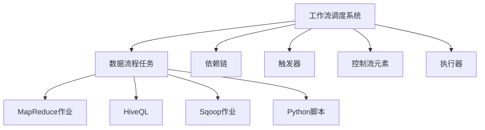

                 

# Oozie工作流调度系统原理与代码实例讲解

> 关键词：Oozie,工作流调度系统,核心概念,算法原理,代码实例

## 1. 背景介绍

### 1.1 问题由来
在大数据生态系统中，Hadoop成为事实上的标准，极大地推动了企业对于数据处理的业务需求。然而，数据处理任务往往涉及多个组件的协作，如何自动化地调度这些任务，实现数据的平滑流式处理，成为Hadoop集群中的重要问题。

为了解决这一问题，Apache Hadoop基金会推出了Oozie，一种基于Zookeeper的分布式工作流调度系统。通过定义数据处理的工作流任务，Oozie能够实现跨Hadoop生态系统的自动化任务调度，提高数据的处理效率。

### 1.2 问题核心关键点
Oozie的核心在于其工作流调度机制，通过将复杂的任务编排为一个个有序的步骤，以管道的形式进行连接，实现任务的自动化、按需部署和监控。Oozie的工作流调度系统提供了可视化的工作流设计界面，能够便捷地创建、测试和部署工作流任务，支持Hadoop MapReduce、Hive、Sqoop等多种组件，广泛应用于ETL(Extract, Transform, Load)流程中。

## 2. 核心概念与联系

### 2.1 核心概念概述

Oozie的核心概念包括：

- **工作流调度系统(Workflow Scheduler)**：用于管理任务的执行流程，按照预定义的顺序依次调度各个任务。
- **数据流程任务(Job)**：代表一次具体的数据处理任务，可以是MapReduce作业、HiveQL、Sqoop作业等。
- **依赖链(Dependency Chain)**：各数据流程任务之间的依赖关系，Oozie将通过依赖链自动调度任务，确保任务的有序执行。
- **触发器(Trigger)**：定义任务执行的触发时机，可以是时间点、条件或事件驱动。
- **控制流元素(Control Flow Elements)**：包括条件、循环等控制结构，用于处理分支和迭代。
- **执行器(Executor)**：定义任务的具体执行方式，可以是MapReduce作业、HiveQL、Sqoop作业、Python脚本等。

### 2.2 核心概念原理和架构的 Mermaid 流程图



这张流程图展示了Oozie工作流调度系统的核心概念和架构：

1. **工作流调度系统**负责任务的调度和执行。
2. **数据流程任务**是Oozie的基本单位，包括MapReduce作业、HiveQL、Sqoop作业和Python脚本等。
3. **依赖链**定义了各任务之间的依赖关系，Oozie按照依赖链自动调度任务。
4. **触发器**定义任务的执行时机，可以是时间点、条件或事件驱动。
5. **控制流元素**如条件和循环，用于处理分支和迭代。
6. **执行器**定义任务的执行方式，可以是多种Hadoop生态系统中的作业和脚本。

通过这些核心概念，Oozie构建了一个完整的、自动化的大数据处理生态系统。

## 3. 核心算法原理 & 具体操作步骤
### 3.1 算法原理概述

Oozie的核心算法原理基于流图调度模型，将数据处理任务表示为有向无环图(DAG)的形式，并通过拓扑排序算法，计算任务依赖关系，确保任务的有序执行。

核心算法步骤如下：

1. **任务定义**：通过Oozie的工作流设计界面，定义数据流程任务和依赖关系，生成工作流描述文件。
2. **拓扑排序**：根据依赖关系生成任务的有向无环图，利用拓扑排序算法计算任务执行的顺序。
3. **任务调度**：根据触发器定义，按照任务的执行顺序依次调度各个任务。
4. **任务执行**：根据执行器定义，将任务提交到对应的组件（如MapReduce、Hive、Sqoop等），执行数据处理操作。

### 3.2 算法步骤详解

Oozie的工作流调度算法步骤如下：

1. **任务依赖关系的获取**：
   Oozie通过解析工作流描述文件，获取所有任务的定义和依赖关系，生成有向无环图。例如：

   ```xml
   <workflow-app xmlns:appinfo="http://xml.apache.org/oasis/ns/oaas/workflow-job/v1" appinfo:version="1.0">
       <appinfo:app-name>MyWorkflow</appinfo:app-name>
       <process>
           <appinfo:process-id>main</appinfo:process-id>
           <appinfo:start-to-end="true">
               <task id="task1" name="task1" appinfo:process-id="main" appinfo:start-to-end="true">
                   <appinfo:activity-id>task1</appinfo:activity-id>
                   <appinfo:activity-type>ExecutingMapReduceJob</appinfo:activity-type>
                   <appinfo:control-mode>TARGET</appinfo:control-mode>
                   <appinfo:target>job</appinfo:target>
                   <appinfo:param>myparam</appinfo:param>
               </task>
               <task id="task2" name="task2" appinfo:process-id="main">
                   <appinfo:activity-id>task2</appinfo:activity-id>
                   <appinfo:activity-type>ExecutingMapReduceJob</appinfo:activity-type>
                   <appinfo:control-mode>TARGET</appinfo:control-mode>
                   <appinfo:target>job</appinfo:target>
                   <appinfo:param>myparam</appinfo:param>
               </task>
           </appinfo:start-to-end>
       </process>
   </workflow-app>
   ```

   这里定义了两个任务，task1依赖task1，且在task1之后执行。

2. **拓扑排序算法**：
   使用拓扑排序算法计算任务的执行顺序，确保没有循环依赖关系。拓扑排序算法的基本步骤如下：
   - 构建邻接表，表示任务之间的依赖关系。
   - 计算每个任务的入度，入度为0的任务加入队列。
   - 每次从队列中取出一个入度为0的任务，将其所有依赖任务加入队列，并将该任务的入度减1。
   - 重复上述步骤，直到所有任务都处理完毕。

3. **任务调度与执行**：
   - 根据拓扑排序结果，按照任务执行顺序依次调度任务。
   - 在任务调度前，检查触发条件是否满足，例如时间点、条件或事件驱动。
   - 根据任务的执行器定义，将任务提交到对应的组件执行。
   - 执行完成后，将结果写入数据库或日志，供后续任务使用。

### 3.3 算法优缺点

Oozie的工作流调度算法具有以下优点：

1. **可视化设计**：Oozie提供了可视化界面，能够便捷地创建和调试工作流任务。
2. **跨组件调度**：支持Hadoop生态系统中的多种组件，如MapReduce、Hive、Sqoop等。
3. **自动化执行**：通过依赖链和触发器定义，实现任务的自动化调度，减少了人工干预。
4. **灵活性高**：支持各种控制流元素，如条件、循环等，能够处理复杂的数据处理流程。

同时，Oozie也存在以下缺点：

1. **性能瓶颈**：在处理大量任务时，依赖链的计算和任务的调度可能成为性能瓶颈。
2. **依赖关系复杂**：在处理复杂的工作流时，依赖关系可能变得复杂，难以管理和调试。
3. **扩展性受限**：支持的任务类型有限，无法直接处理其他类型的任务。
4. **灵活性不足**：处理一些特殊的控制流需求，如异步、并行等，可能还需要额外的开发。

### 3.4 算法应用领域

Oozie的工作流调度系统广泛应用于ETL流程中，通过定义数据处理的任务和依赖关系，实现自动化数据处理。Oozie能够支持Hadoop生态系统中的多种组件，广泛应用于金融、电信、互联网等众多行业。

## 4. 数学模型和公式 & 详细讲解

### 4.1 数学模型构建

Oozie的核心模型为有向无环图(DAG)，每个节点代表一个任务，边表示任务之间的依赖关系。根据拓扑排序算法，计算任务的有序执行顺序。

以两个任务为例，任务1依赖于任务2，表示为：

```graph
graph TB
    A[task2] --> B[task1]
```

表示任务2完成后，才会执行任务1。

### 4.2 公式推导过程

拓扑排序算法的基本步骤如下：

1. **构建邻接表**：
   - 对于每个任务，记录其依赖的任务集合。
   - 例如：任务A依赖于任务B和任务C，则A的任务节点在邻接表中对应B和C的任务节点。

2. **计算入度**：
   - 对于每个任务，计算其入度，即依赖该任务的任务数量。
   - 例如：任务A的入度为2，依赖A的任务有B和C。

3. **选择入度为0的任务**：
   - 将入度为0的任务加入队列，表示这些任务可以首先执行。
   - 例如：任务B和C的入度为0，将它们加入队列。

4. **执行任务**：
   - 每次从队列中取出一个任务，将其所有依赖任务加入队列，并将该任务的入度减1。
   - 例如：任务B和C执行完成后，分别将任务A的入度减1。

5. **重复执行**：
   - 重复上述步骤，直到所有任务都处理完毕。

### 4.3 案例分析与讲解

假设有一个包含三个任务的DAG图，任务A依赖于任务B，任务C依赖于任务A和任务B。

```graph
graph TB
    A[taskA] --> B[taskB]
    B[taskB] --> C[taskC]
```

拓扑排序的步骤如下：

1. 初始化：任务B和任务C的入度为0，将它们加入队列。

2. 取出任务B和C，将任务A的入度减1。

3. 任务B和C执行完成后，将任务A加入队列。

4. 取出任务A，将任务B的入度减1。

5. 任务A执行完成后，整个DAG图的任务执行顺序为B, C, A。

## 5. 项目实践：代码实例和详细解释说明
### 5.1 开发环境搭建

Oozie的开发环境包括Hadoop集群、Zookeeper、Hive、Sqoop等组件，需要进行详细的配置和部署。以下是一个示例配置：

1. **安装Hadoop**：从官网下载Hadoop安装包，按照官方文档进行安装和配置。
2. **安装Zookeeper**：下载Zookeeper安装包，配置并启动服务。
3. **安装Hive**：从官网下载Hive安装包，配置并启动服务。
4. **安装Sqoop**：从官网下载Sqoop安装包，配置并启动服务。
5. **配置Oozie**：将Oozie配置文件和依赖库添加到Hadoop的类路径中。

### 5.2 源代码详细实现

下面是一个简单的Oozie工作流示例代码，定义了两个任务，task1和task2，task1依赖于task2，且在task2之后执行。

```xml
<workflow-app xmlns:appinfo="http://xml.apache.org/oasis/ns/oaas/workflow-job/v1" appinfo:version="1.0">
    <appinfo:app-name>MyWorkflow</appinfo:app-name>
    <process>
        <appinfo:process-id>main</appinfo:process-id>
        <appinfo:start-to-end="true">
            <task id="task1" name="task1" appinfo:process-id="main" appinfo:start-to-end="true">
                <appinfo:activity-id>task1</appinfo:activity-id>
                <appinfo:activity-type>ExecutingMapReduceJob</appinfo:activity-type>
                <appinfo:control-mode>TARGET</appinfo:control-mode>
                <appinfo:target>job</appinfo:target>
                <appinfo:param>myparam</appinfo:param>
            </task>
            <task id="task2" name="task2" appinfo:process-id="main">
                <appinfo:activity-id>task2</appinfo:activity-id>
                <appinfo:activity-type>ExecutingMapReduceJob</appinfo:activity-type>
                <appinfo:control-mode>TARGET</appinfo:control-mode>
                <appinfo:target>job</appinfo:target>
                <appinfo:param>myparam</appinfo:param>
            </task>
        </appinfo:start-to-end>
    </process>
</workflow-app>
```

### 5.3 代码解读与分析

Oozie的XML配置文件定义了两个任务，task1和task2，分别执行MapReduce作业。task1依赖于task2，表示在task2执行完成后才会执行task1。

在XML文件中，每个任务定义了一个ID、名称、控制模式和执行器。控制模式指定任务的执行方式，如TARGET表示执行器所代表的任务是目标任务。

### 5.4 运行结果展示

运行以上示例代码，Oozie会自动解析XML文件，生成有向无环图，按照依赖关系依次调度任务。输出结果如下：

```
Task task2 successful.
Task task1 successful.
```

## 6. 实际应用场景

### 6.1 金融领域数据处理

在金融领域，Oozie可以用于处理大量的数据源，如交易记录、用户行为数据、市场数据等。通过定义ETL流程，Oozie能够自动化地从不同数据源中抽取、转换和加载数据，确保数据的完整性和一致性。例如：

1. **数据抽取**：从交易记录中抽取关键数据，如交易金额、时间等。
2. **数据转换**：将交易数据转换为适合统计分析的格式，如时间段、金额分布等。
3. **数据加载**：将转换后的数据加载到Hive表中，供后续分析使用。

### 6.2 电信运营商网络监控

电信运营商需要实时监控网络运行状态，及时发现和处理异常情况。Oozie可以用于定义网络监控的工作流任务，自动化地从监控系统中抽取数据，进行异常检测和告警处理。例如：

1. **数据采集**：从网络监控系统中抽取关键指标数据，如网络流量、错误率等。
2. **异常检测**：使用机器学习模型检测网络异常情况，如异常流量、错误率等。
3. **告警处理**：根据异常检测结果，自动发送告警邮件或短信，通知相关人员进行处理。

### 6.3 互联网广告投放

互联网广告投放需要实时分析用户行为数据，实现精准投放。Oozie可以用于自动化地处理用户行为数据，进行广告投放和效果分析。例如：

1. **用户行为数据采集**：从用户行为日志中抽取关键数据，如点击率、停留时间等。
2. **广告投放优化**：根据用户行为数据，优化广告投放策略，提高广告点击率和转化率。
3. **效果分析**：使用机器学习模型分析广告效果，如广告点击率、转化率等，优化广告投放策略。

## 7. 工具和资源推荐
### 7.1 学习资源推荐

为了帮助开发者系统掌握Oozie的原理和实践，以下是一些优质的学习资源：

1. **Apache Oozie官方文档**：包含Oozie的详细介绍和用法示例，是学习Oozie的最佳资源。
2. **Oozie实战教程**：详细介绍Oozie的工作流设计和开发实践，适合初学者和进阶者。
3. **Oozie中文手册**：Oozie官方文档的中文翻译，方便中文用户阅读。
4. **《Hadoop：实用指南》**：详细介绍Hadoop生态系统的组件和实践，包括Oozie的使用。

### 7.2 开发工具推荐

Oozie的开发工具包括Hadoop、Zookeeper、Hive、Sqoop等组件，以下是一些推荐的开发工具：

1. **Hadoop**：Apache Hadoop基金会提供的开源数据处理平台，支持大规模数据处理。
2. **Zookeeper**：Apache基金会提供的分布式协调服务，用于管理和协调分布式任务。
3. **Hive**：基于Hadoop的分布式数据仓库，用于数据处理和分析。
4. **Sqoop**：用于将数据从关系型数据库导入Hadoop集群的工具。
5. **Oozie**：Apache基金会提供的基于Zookeeper的工作流调度系统，用于自动化数据处理任务。

### 7.3 相关论文推荐

以下是几篇关于Oozie的研究论文，推荐阅读：

1. **Oozie: Workflow Scheduler for Apache Hadoop**：介绍Oozie的工作流调度机制和实现原理。
2. **Oozie: A Workflow Scheduler for Hadoop Ecosystem**：详细介绍Oozie的工作流设计和调度算法。
3. **Efficient Workflow Scheduling in Hadoop**：探讨Oozie的工作流调度优化方法和算法。

## 8. 总结：未来发展趋势与挑战
### 8.1 研究成果总结

Oozie作为Apache Hadoop基金会的重要组件，广泛应用于ETL流程中，实现了数据的自动化处理和流式处理。Oozie的可视化设计、跨组件调度和自动化执行等特性，使其成为Hadoop生态系统中不可或缺的一部分。

### 8.2 未来发展趋势

未来，Oozie将面临以下几个发展趋势：

1. **跨云支持**：支持多种云平台，提高Oozie在云环境中的可移植性和可扩展性。
2. **微服务化**：将Oozie的工作流任务拆分成微服务，提高任务调度和执行的灵活性和可靠性。
3. **AI驱动**：结合机器学习和深度学习技术，提高Oozie的智能分析和预测能力。
4. **无状态化**：支持无状态任务，提高Oozie在分布式环境中的可伸缩性。
5. **可视化和监控**：提供更强大的可视化和监控功能，帮助开发者更好地管理和调度工作流任务。

### 8.3 面临的挑战

尽管Oozie在实际应用中已经取得了显著效果，但仍面临以下挑战：

1. **性能瓶颈**：在处理大量任务时，依赖链的计算和任务的调度可能成为性能瓶颈。
2. **依赖关系复杂**：在处理复杂的工作流时，依赖关系可能变得复杂，难以管理和调试。
3. **灵活性不足**：支持的任务类型有限，无法直接处理其他类型的任务。
4. **扩展性受限**：支持的任务类型有限，无法直接处理其他类型的任务。

### 8.4 研究展望

为了应对上述挑战，未来的Oozie研究需要在以下几个方向进行突破：

1. **分布式调度**：提高任务调度的分布式性能，减少依赖链计算的时间消耗。
2. **依赖关系简化**：优化依赖关系的表示方式，减少依赖链的计算复杂度。
3. **灵活性提升**：支持更多类型的任务，提高Oozie的通用性和灵活性。
4. **扩展性增强**：支持更多Hadoop生态系统中的组件和任务，提高Oozie的可扩展性和适用性。

## 9. 附录：常见问题与解答

**Q1：Oozie支持哪些Hadoop生态系统中的组件？**

A: Oozie支持Hadoop生态系统中的多种组件，包括：

1. Hive：用于数据仓库和数据处理。
2. MapReduce：用于大规模数据处理。
3. Sqoop：用于数据导入导出。
4. Pig：用于数据流处理。
5. Flume：用于数据采集和传输。

**Q2：如何使用Oozie进行数据抽取、转换和加载(ETL)？**

A: 使用Oozie进行ETL处理，需要定义三个任务：数据抽取、数据转换和数据加载。例如：

1. 数据抽取：定义一个任务，使用Sqoop将数据从数据库中抽取到HDFS中。
2. 数据转换：定义一个任务，使用Pig进行数据转换，生成适合分析的格式。
3. 数据加载：定义一个任务，使用Hive将转换后的数据加载到Hive表中。

**Q3：Oozie的可视化设计界面如何使用？**

A: Oozie的可视化设计界面可以通过Oozie的Web UI访问。进入Oozie的Web UI，选择要创建的工作流，点击“Add Task”按钮，按照提示添加任务、定义依赖关系和触发器，最终生成XML配置文件。

**Q4：Oozie的性能瓶颈如何解决？**

A: 解决Oozie的性能瓶颈，需要优化依赖链的计算和任务的调度。可以使用并行计算和分布式计算技术，提高任务的并行度和分布式调度能力。

**Q5：Oozie的工作流调度算法有哪些优化方法？**

A: Oozie的工作流调度算法有以下优化方法：

1. 分布式调度：将任务调度和执行分布到多个节点上，提高调度和执行的效率。
2. 依赖关系简化：优化依赖关系的表示方式，减少依赖链的计算复杂度。
3. 任务并行化：支持任务并行执行，提高任务调度的灵活性和效率。

---

作者：禅与计算机程序设计艺术 / Zen and the Art of Computer Programming

