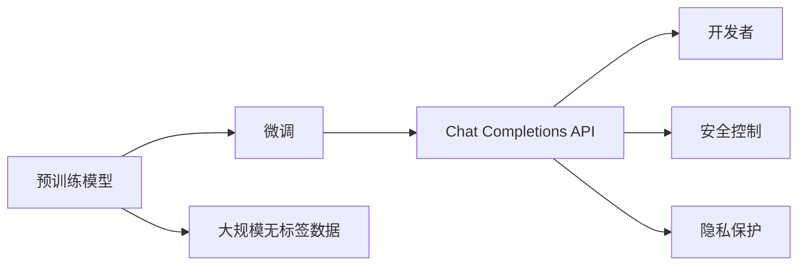

                 

# OpenAI Chat Completions API

> 关键词：OpenAI, Chatbot, Natural Language Processing, Generation, API, Customization, Integration, Scalability, Security

## 1. 背景介绍

### 1.1 问题由来

随着人工智能技术的迅猛发展，尤其是深度学习在自然语言处理（NLP）领域的突破，OpenAI等公司开发了一系列强大的语言模型，如GPT-3，以应对复杂的自然语言生成任务。这些模型通过大规模无监督学习，能够生成高质量的文本，但它们需要巨量的数据和计算资源进行预训练。为了更好地将这种能力应用于实际场景，OpenAI推出了Chat Completions API，允许开发者在已有模型基础上进行微调，以满足特定需求。

### 1.2 问题核心关键点

OpenAI Chat Completions API的核心在于它提供了一种简便的方式，让开发者可以通过简单的接口调用，对大模型进行微调，生成适合特定场景的文本。其特点包括：

- **简便性**：无需从头训练模型，通过API调用即可实现微调。
- **可定制性**：可以根据需求微调模型，生成特定风格的文本。
- **高效性**：API调用速度快，可实时生成文本。
- **安全性**：提供详细的安全控制和隐私保护机制。
- **广泛性**：适用于各种NLP任务，包括对话系统、文本生成、摘要等。

OpenAI Chat Completions API的出现，为开发者提供了强大的工具，使得NLP技术更加易于访问和使用，大大推动了NLP技术的实际应用。

## 2. 核心概念与联系

### 2.1 核心概念概述

OpenAI的Chat Completions API是一个基于深度学习的大语言模型接口，允许开发者对已有的预训练模型进行微调，以生成适合特定任务或风格的文本。

核心概念包括：

- **预训练模型**：如GPT-3，在大规模无标签数据上训练得到的通用语言模型。
- **微调**：在预训练模型的基础上，使用有标签数据进行进一步训练，调整模型参数以适应特定任务。
- **API**：提供了一种编程接口，允许开发者调用模型，执行特定任务。
- **自定义**：通过API参数，用户可以定制模型的行为，生成特定风格的文本。
- **安全**：API设计考虑了安全性，提供了数据隐私保护机制。

这些概念之间的联系可以概括为：预训练模型提供通用能力，微调使模型适应特定任务，API提供便捷的调用方式，自定义增加灵活性，而安全性确保了使用过程中的隐私保护。

### 2.2 核心概念原理和架构的 Mermaid 流程图



该图展示了预训练模型到微调再到API的流程，其中开发者可以通过API调用微调后的模型，同时API本身也具备安全性保护机制。

## 3. 核心算法原理 & 具体操作步骤

### 3.1 算法原理概述

OpenAI Chat Completions API的算法原理基于自回归语言模型。它使用Transformer结构，通过多层自注意力机制，捕捉输入文本中的上下文信息。在微调过程中，模型会根据特定任务的数据进行训练，调整模型的权重以更好地适应新任务。

### 3.2 算法步骤详解

1. **API接口准备**：在OpenAI官网注册账户，获取API密钥，然后在代码中引入相关库，如`openai`，以便调用API。

2. **初始化API**：使用API密钥初始化OpenAI的API接口。

3. **文本生成**：定义待生成的文本，通过API调用进行文本生成。API支持多种参数，如温度、最多生成数量、模型版本等，可以根据需要调整。

4. **结果处理**：API返回生成结果，根据需要进行后处理，如格式转换、内容过滤等。

5. **结果展示**：将生成的文本展示在应用界面或输出到文件。

### 3.3 算法优缺点

**优点**：

- **效率高**：API调用速度快，适合实时文本生成。
- **易用性**：API接口简单，易于上手。
- **灵活性**：可通过参数进行大量自定义，适应不同场景。
- **广泛适用**：适用于多种NLP任务，如问答、对话系统、文本生成等。

**缺点**：

- **依赖OpenAI**：模型训练和微调由OpenAI负责，用户对模型内部细节的控制有限。
- **费用较高**：调用次数过多会导致费用上升，且对大模型调用有限制。
- **数据隐私**：用户的输入数据可能被OpenAI收集，存在隐私泄露风险。
- **模型局限**：受模型预训练数据限制，可能无法适应所有场景。

### 3.4 算法应用领域

OpenAI Chat Completions API在以下几个领域具有重要应用：

- **对话系统**：生成自然流畅的对话文本，应用于客服机器人、虚拟助手等。
- **内容生成**：生成文章、评论、摘要等文本内容，应用于自动化写作、内容生产等。
- **问答系统**：根据用户提问，生成相关回答，应用于智能问答、教育辅助等。
- **数据分析**：从大量数据中提取关键信息，生成简洁摘要，应用于市场分析、新闻摘要等。
- **娱乐**：生成有趣、幽默的文本内容，应用于社交媒体、游戏等。

## 4. 数学模型和公式 & 详细讲解 & 举例说明

### 4.1 数学模型构建

OpenAI Chat Completions API的数学模型基于自回归语言模型，可以表示为：

$$
P(x_t | x_{<t}) = \frac{e^{(\theta x_{<t})^\top x_t}}{\sum_{x'_t} e^{(\theta x_{<t})^\top x'_t}}
$$

其中，$x_t$ 表示当前时间步的输出，$x_{<t}$ 表示前$t-1$个时间步的输入，$\theta$ 为模型参数，$e$ 为自然对数的底数。

### 4.2 公式推导过程

模型推导过程如下：

1. **概率计算**：计算当前时间步输出$x_t$的条件概率$P(x_t | x_{<t})$。
2. **优化目标**：最小化模型输出与真实输出之间的差异，即最大化似然函数$L(\theta)$。
3. **优化方法**：通过反向传播算法，更新模型参数$\theta$，以最小化损失函数。

### 4.3 案例分析与讲解

以对话系统为例，分析OpenAI Chat Completions API的数学模型推导过程。

- **输入**：前$t-1$个时间步的对话历史$x_{<t}$。
- **输出**：当前时间步的回复$x_t$。
- **损失函数**：交叉熵损失，衡量模型输出与真实回复之间的差异。
- **优化算法**：AdamW优化算法，迭代更新模型参数$\theta$。

通过不断的迭代优化，模型能够学习到生成符合上下文语境的回复的能力。

## 5. 项目实践：代码实例和详细解释说明

### 5.1 开发环境搭建

1. **环境安装**：安装Python 3.8及以上版本，安装OpenAI库。
2. **API密钥**：在OpenAI官网注册账户，获取API密钥。
3. **代码编写**：编写代码，调用API进行文本生成。

### 5.2 源代码详细实现

以下是一个使用OpenAI Chat Completions API生成对话的Python代码示例：

```python
import openai

openai.api_key = 'YOUR_API_KEY'

response = openai.Completion.create(
    engine='davinci-codex',
    prompt='''Hmm, what would you like to do?''',
    max_tokens=50,
    temperature=0.5,
    n=1
)

print(response.choices[0].text)
```

### 5.3 代码解读与分析

- **API密钥**：在代码中设置API密钥，确保可以调用API。
- **Prompt设置**：定义对话系统中的初始输入，这里设置为"您好，我可以帮您做什么？"
- **参数调整**：设置生成文本的最大长度、温度和数量。温度控制生成文本的随机性，温度越高越随机。
- **结果输出**：获取API返回的生成文本，并打印输出。

### 5.4 运行结果展示

运行上述代码，可以得到类似以下的输出：

```
你好，我可以帮你查询天气预报。
```

## 6. 实际应用场景

### 6.1 智能客服系统

OpenAI Chat Completions API可以应用于智能客服系统中，通过调用API生成回复，提升客户体验和满意度。例如，在客户提出问题时，系统自动生成回应，提供即时服务。

### 6.2 内容生成

OpenAI Chat Completions API适用于内容生成领域，如自动写作、内容创作等。通过API调用，可以快速生成高质量的文本内容，提高内容生产效率。

### 6.3 问答系统

在问答系统中，OpenAI Chat Completions API可以根据用户提出的问题，生成相关回答，提升系统的智能化水平。例如，在医疗问答应用中，用户询问健康问题，系统自动生成医疗建议。

### 6.4 未来应用展望

OpenAI Chat Completions API的未来应用展望包括：

- **多模态对话系统**：结合图像、视频等模态信息，提升对话系统的互动性和趣味性。
- **个性化推荐**：根据用户历史数据，生成个性化文本，提高推荐系统的精准度。
- **实时翻译**：支持多种语言，实现实时翻译和生成，提升跨语言交流效率。
- **教育辅助**：生成教学材料、辅助教学过程，提升教育质量。

## 7. 工具和资源推荐

### 7.1 学习资源推荐

1. **OpenAI官方文档**：提供API调用、参数设置、常见问题解答等详细信息。
2. **自然语言处理教程**：如《自然语言处理综论》、《深度学习与自然语言处理》等。
3. **机器学习库**：如TensorFlow、PyTorch等，用于模型训练和微调。
4. **GitHub项目**：如《OpenAI Chat Completions API 示例代码》等，提供丰富的代码实现和教程。

### 7.2 开发工具推荐

1. **Jupyter Notebook**：支持代码编写和实时展示，适合学习和调试。
2. **GitHub**：用于代码托管和版本控制，方便团队协作。
3. **AWS/Azure/GCP**：提供云服务，支持大规模模型训练和部署。
4. **Anaconda**：用于Python环境管理，方便快速搭建开发环境。

### 7.3 相关论文推荐

1. **《Understanding the Difficulty of Training Language Models》**：探讨了语言模型的训练难度。
2. **《Large Language Model Fine-tuning with Human Feedback》**：介绍了使用人类反馈进行语言模型微调的方法。
3. **《Generative Pre-trained Transformer》**：原文介绍了GPT-3模型，并提出了微调技术。
4. **《Integrating Pre-trained Language Models into Conversational AI Systems》**：探讨了将大模型应用于对话系统的技术。

## 8. 总结：未来发展趋势与挑战

### 8.1 研究成果总结

OpenAI Chat Completions API以其简便易用、高效灵活的优点，迅速成为NLP领域的重要工具。它通过API调用，使开发者可以轻松地对大模型进行微调，生成适合特定场景的文本，极大地推动了NLP技术的应用。

### 8.2 未来发展趋势

1. **技术进步**：随着模型训练和微调技术的进步，API调用将更加高效、灵活，生成文本的质量和多样性将进一步提升。
2. **应用拓展**：API将逐步应用于更多领域，如教育、娱乐、医疗等，推动人工智能技术在更多行业的应用。
3. **安全性增强**：随着隐私和安全问题日益重要，API将进一步加强数据隐私保护和安全性设计。
4. **模型优化**：通过不断优化模型结构和训练方法，API将提供更强大的语言理解和生成能力。
5. **多模态融合**：结合图像、视频等多模态信息，API将提供更全面的交互体验。

### 8.3 面临的挑战

1. **计算资源**：随着模型规模的增大，API调用和模型训练所需的计算资源将显著增加。
2. **数据隐私**：用户数据隐私保护是一个重要问题，需要在API设计和实施中予以充分考虑。
3. **费用问题**：API调用次数过多会导致费用上升，需要合理规划资源使用。
4. **模型鲁棒性**：模型面对恶意输入或对抗样本时，可能会产生不稳定输出，需要进一步研究鲁棒性提升。

### 8.4 研究展望

未来研究应关注以下几个方向：

1. **模型优化**：改进模型结构和训练方法，提升模型性能和效率。
2. **安全性设计**：增强API的安全性和隐私保护机制，确保数据安全。
3. **多模态融合**：结合图像、视频等多模态信息，提升交互体验。
4. **实时性优化**：优化模型推理速度，支持实时调用。
5. **人机协同**：结合人工干预和辅助技术，提升系统的智能化水平。

OpenAI Chat Completions API的不断发展将为NLP技术的应用提供更多可能，助力人工智能技术的广泛落地和应用。

## 9. 附录：常见问题与解答

**Q1: OpenAI Chat Completions API的调用频率限制是多少？**

A: OpenAI对API调用次数有限制，具体限制根据API密钥的使用类型和付费套餐有所不同。一般而言，免费套餐下的API调用次数较少，需要使用付费套餐以满足更高的调用需求。

**Q2: 如何处理生成的文本内容？**

A: 生成的文本内容需要根据实际需求进行处理。一般来说，需要进行文本清洗、格式转换、内容过滤等操作，以保证生成的文本符合应用场景的要求。

**Q3: 如何提高生成文本的质量？**

A: 提高生成文本质量的方法包括：
1. 调整参数设置，如温度、最大长度等，以控制生成文本的随机性和长度。
2. 使用更先进的预训练模型，提升模型的语言理解和生成能力。
3. 增加训练数据，提高模型的泛化能力。

**Q4: 如何避免生成内容中的偏见？**

A: 避免生成内容中的偏见可以采取以下措施：
1. 使用更广泛的数据集进行预训练，确保模型具有良好的多样性。
2. 在API调用中设置多轮推理，确保模型输出更符合公平性原则。
3. 在生成文本后进行人工审核，排除含有偏见的输出。

通过上述问题的解答，可以看到OpenAI Chat Completions API虽然功能强大，但也需结合实际需求和问题，进行合理应用和优化。

---

作者：禅与计算机程序设计艺术 / Zen and the Art of Computer Programming

