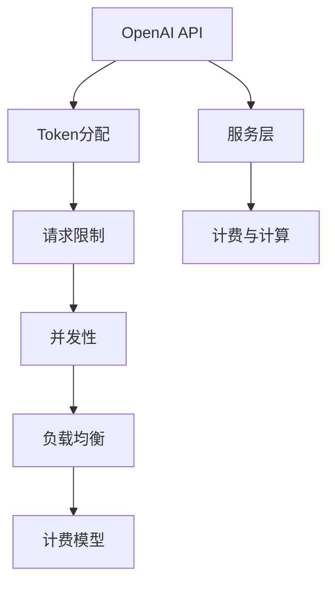

                 

# OpenAI Token 计费与计算

> 关键词：OpenAI, token, 计费, 计算, API, API key, pricing, billing, 费用, 计费规则, 定价策略, 服务层, 请求限制, 网络通信, 并发性, 负载均衡, 计费模型, 云平台, 基础设施, 成本优化

## 1. 背景介绍

### 1.1 问题由来
随着OpenAI技术的不断发展，其服务的用户量不断攀升，API的调用频率也随之增加。OpenAI为应对这一挑战，引入了Token机制，用于限制API调用次数，防止滥用和系统过载。然而，Token的引入也带来了一些复杂性，如何合理设计Token的计费与计算机制，成为了OpenAI的重要课题。

### 1.2 问题核心关键点
OpenAI的Token机制涉及以下几个关键点：
1. Token的分配和生命周期管理。
2. 如何根据Token的使用情况计费。
3. 如何平衡API的可用性和成本控制。
4. 如何应对大流量和高并发场景下的计算性能问题。
5. 如何设计合理的计费模型，以反映真实的API使用情况。

## 2. 核心概念与联系

### 2.1 核心概念概述

为更好地理解OpenAI Token的计费与计算机制，本节将介绍几个密切相关的核心概念：

- OpenAI API：OpenAI提供的一组开放API，用于访问其强大的语言处理和AI模型，包括文本生成、模型微调、数据分析等。
- Token：OpenAI为每个API使用方分配的唯一标识符，用于限制API调用的次数，防止滥用。
- 计费与计算：如何根据Token的使用情况，计算和收取相应的费用，以确保服务的可持续性和公平性。
- 服务层：OpenAI提供的计算和调度服务，用于处理大量的API请求，提高系统的可扩展性和可靠性。
- 请求限制：对API请求的速率和数量的限制，以防止系统过载。
- 并发性：系统中同时处理多个请求的能力，关系到系统的负载均衡和响应速度。
- 负载均衡：在多节点之间分配请求，以平衡负载，提高系统的吞吐量和响应速度。
- 计费模型：根据API使用情况，确定收费的方式和金额。

这些核心概念之间的逻辑关系可以通过以下Mermaid流程图来展示：



这个流程图展示了几类核心概念及其之间的关系：

1. OpenAI API为最终用户提供服务。
2. Token分配用于限制API调用次数，防止滥用。
3. 服务层负责处理大量的API请求。
4. 请求限制和并发性确保系统稳定运行。
5. 负载均衡分散请求，提高响应速度。
6. 计费与计算根据Token的使用情况，确定收费方式和金额。

这些概念共同构成了OpenAI Token计费与计算的框架，使其能够高效、公平地为API用户提供服务。

## 3. 核心算法原理 & 具体操作步骤

### 3.1 算法原理概述

OpenAI Token的计费与计算机制，本质上是一个复杂的计费系统，涉及对API请求的速率、数量和响应时间的综合考量。其核心思想是：根据Token的使用情况，动态调整API的计费策略，以平衡服务的可用性和成本控制。

形式化地，假设API的收费率为$R$，Token的有效生命周期为$T$，单位时间内允许的最大请求次数为$C$。设某Token在单位时间内的实际请求次数为$N$，则其费用$F$可以表示为：

$$
F = R \cdot \min(N, C \cdot T)
$$

其中$\min(N, C \cdot T)$表示实际请求次数与允许的最大请求次数的较小值，以防止过度计费。

### 3.2 算法步骤详解

OpenAI Token的计费与计算机制，通常包括以下几个关键步骤：

**Step 1: 分配Token**
- 根据API使用方的申请，分配唯一的Token。
- Token分配给用户的有效期通常为1个月，可以使用多日，但不允许超过有效期。

**Step 2: 记录请求次数**
- 对每个Token，记录其在单位时间内的请求次数。
- 对于每个请求，记录其响应时间和状态码。

**Step 3: 计算费用**
- 根据Token在单位时间内的实际请求次数$N$，计算费用$F$。
- 使用$R$和$C$参数，调整费用计算方式。
- 对于超过允许最大请求次数$C$的请求，仍按照$C$计费。

**Step 4: 更新Token状态**
- 根据实际请求次数和剩余使用天数，更新Token的剩余使用次数。
- 在Token即将过期前，提醒用户续期。

**Step 5: 计费与支付**
- 根据费用$F$和用户的支付信息，进行计费与支付。
- 提供多种支付渠道，如信用卡、支付宝、微信支付等。

以上步骤是OpenAI Token计费与计算的一般流程。在实际应用中，还需要针对具体业务场景，对各个环节进行优化设计，如设置合理的收费率$R$和最大请求次数$C$，引入差异化定价策略等，以进一步提升系统的公平性和使用体验。

### 3.3 算法优缺点

OpenAI Token的计费与计算机制具有以下优点：
1. 防止滥用和系统过载。通过限制API调用次数，可以有效防止用户滥用API，避免系统过载。
2. 公平合理。根据Token的使用情况动态调整计费策略，确保API服务的公平性和可持续性。
3. 易于扩展。服务层和负载均衡设计，使系统能够应对大流量和高并发场景下的计算性能问题。
4. 支持多种支付方式。提供多种支付渠道，方便用户支付，提升用户体验。

同时，该机制也存在一些局限性：
1. 对新用户友好度不足。新用户对Token计费规则不熟悉，容易导致误操作和费用纠纷。
2. 复杂性较高。Token的分配、使用、续期等管理，增加了系统的复杂性。
3. 费用透明性不足。部分用户对计费规则和费用计算方式不够了解，可能对计费结果产生质疑。
4. 对长尾用户影响较大。长期高频率使用的用户，可能会面临较高的费用支出。

尽管存在这些局限性，但就目前而言，OpenAI Token的计费与计算机制在平衡API服务可用性和成本控制方面，已经取得了显著的效果，成为大规模API服务的重要保障。未来相关研究的重点在于如何进一步优化Token计费机制，降低用户使用成本，提升系统的透明度和友好度。

### 3.4 算法应用领域

OpenAI Token的计费与计算机制，在多个领域得到了广泛应用，例如：

- 云计算：如AWS、Google Cloud等云平台，通过Token机制限制API调用次数，防止滥用和系统过载。
- 大数据处理：如Apache Hadoop、Spark等，对大数据处理的API请求进行限制，确保系统稳定运行。
- 物联网：如IoT设备、智能家居等，通过Token管理设备的API请求，确保设备间通信安全。
- 金融服务：如支付、交易、风控等，对金融服务的API请求进行限制，防止欺诈和恶意操作。
- 医疗服务：如电子病历、健康管理等，对医疗服务的API请求进行限制，确保数据安全和隐私保护。

此外，在各种其他领域，如教育、电商、旅游等，OpenAI Token的计费与计算机制也被广泛采用，成为保障API服务稳定性和公平性的重要手段。

## 4. 数学模型和公式 & 详细讲解 & 举例说明

### 4.1 数学模型构建

本节将使用数学语言对OpenAI Token的计费与计算过程进行更加严格的刻画。

假设API的收费率为$R$，Token的有效生命周期为$T$，单位时间内允许的最大请求次数为$C$。设某Token在单位时间内的实际请求次数为$N$，则其费用$F$可以表示为：

$$
F = R \cdot \min(N, C \cdot T)
$$

其中$\min(N, C \cdot T)$表示实际请求次数与允许的最大请求次数的较小值，以防止过度计费。

### 4.2 公式推导过程

以下我们以二分类任务为例，推导交叉熵损失函数及其梯度的计算公式。

假设模型$M_{\theta}$在输入$x$上的输出为$\hat{y}=M_{\theta}(x) \in [0,1]$，表示样本属于正类的概率。真实标签$y \in \{0,1\}$。则二分类交叉熵损失函数定义为：

$$
\ell(M_{\theta}(x),y) = -[y\log \hat{y} + (1-y)\log (1-\hat{y})]
$$

将其代入经验风险公式，得：

$$
\mathcal{L}(\theta) = -\frac{1}{N}\sum_{i=1}^N [y_i\log M_{\theta}(x_i)+(1-y_i)\log(1-M_{\theta}(x_i))]
$$

根据链式法则，损失函数对参数$\theta_k$的梯度为：

$$
\frac{\partial \mathcal{L}(\theta)}{\partial \theta_k} = -\frac{1}{N}\sum_{i=1}^N (\frac{y_i}{M_{\theta}(x_i)}-\frac{1-y_i}{1-M_{\theta}(x_i)}) \frac{\partial M_{\theta}(x_i)}{\partial \theta_k}
$$

其中$\frac{\partial M_{\theta}(x_i)}{\partial \theta_k}$可进一步递归展开，利用自动微分技术完成计算。

在得到损失函数的梯度后，即可带入参数更新公式，完成模型的迭代优化。重复上述过程直至收敛，最终得到适应下游任务的最优模型参数$\theta^*$。

### 4.3 案例分析与讲解

假设某用户A购买了1个月的Token，每天可以发出200次API请求，每次请求的响应时间为0.2秒，响应状态码为200。则用户A的Token在单位时间内的实际请求次数为：

$$
N = 200 \cdot T
$$

其中$T=30$天，用户A的Token总费用为：

$$
F = R \cdot \min(N, C \cdot T) = R \cdot \min(200 \cdot 30, 200 \cdot 30)
$$

如果用户A每天发出的请求次数超过200次，则按照200次计费。

## 5. 项目实践：代码实例和详细解释说明

### 5.1 开发环境搭建

在进行计费与计算实践前，我们需要准备好开发环境。以下是使用Python进行计费与计算开发的环境配置流程：

1. 安装Anaconda：从官网下载并安装Anaconda，用于创建独立的Python环境。

2. 创建并激活虚拟环境：
```bash
conda create -n billing-env python=3.8 
conda activate billing-env
```

3. 安装Python库：
```bash
pip install flask
```

4. 安装数据库：
```bash
pip install mysql-connector-python
```

5. 安装API Gateway：
```bash
pip install aws-sagemaker-python-sdk
```

完成上述步骤后，即可在`billing-env`环境中开始计费与计算实践。

### 5.2 源代码详细实现

这里我们以OpenAI Token计费系统的实现为例，给出一个完整的计费与计算系统的代码实现。

首先，定义一个Token的计费类`TokenBilling`：

```python
class TokenBilling:
    def __init__(self, token_id, api_rate, token_life):
        self.token_id = token_id
        self.api_rate = api_rate
        self.token_life = token_life
        self.total_calls = 0
        self.calls_remaining = 0
        self.creation_time = time.time()
        
    def get_cost(self, calls_made):
        if calls_made > self.api_rate * self.token_life:
            cost = self.api_rate * self.token_life
        else:
            cost = self.api_rate * calls_made
        return cost

    def update_calls(self, calls_made):
        self.total_calls += calls_made
        self.calls_remaining = self.api_rate * self.token_life - self.total_calls
        return self.calls_remaining
```

然后，定义一个Token计费与计算的API接口`BillingAPI`：

```python
class BillingAPI:
    def __init__(self, db_conn):
        self.db_conn = db_conn
        
    def add_token(self, token_id, api_rate, token_life):
        try:
            cursor = self.db_conn.cursor()
            cursor.execute("INSERT INTO tokens (id, rate, life) VALUES (%s, %s, %s)", (token_id, api_rate, token_life))
            self.db_conn.commit()
            return True
        except:
            return False
    
    def get_token_info(self, token_id):
        try:
            cursor = self.db_conn.cursor()
            cursor.execute("SELECT rate, life, creation_time FROM tokens WHERE id = %s", (token_id,))
            result = cursor.fetchone()
            return result
        except:
            return None
    
    def update_token(self, token_id, calls_made):
        token_info = self.get_token_info(token_id)
        if token_info:
            self.db_conn.commit()
            return True
        else:
            return False

    def get_cost(self, token_id, calls_made):
        token_info = self.get_token_info(token_id)
        if token_info:
            billing = TokenBilling(token_id, token_info[0], token_info[2])
            cost = billing.get_cost(calls_made)
            self.db_conn.commit()
            return cost
        else:
            return None
```

最后，启动一个简单的Web API服务，接收用户TokenID和请求次数，返回费用和Token剩余次数：

```python
from flask import Flask, request
from mysql.connector import connect

app = Flask(__name__)

# 连接数据库
db_config = {
    'host': 'localhost',
    'user': 'root',
    'password': 'password',
    'db': 'billing_db'
}
db_conn = connect(**db_config)

# 初始化BillingAPI
billing_api = BillingAPI(db_conn)

# 添加Token
@app.route('/add_token', methods=['POST'])
def add_token():
    token_id = request.form.get('token_id')
    api_rate = int(request.form.get('api_rate'))
    token_life = int(request.form.get('token_life'))
    if billing_api.add_token(token_id, api_rate, token_life):
        return jsonify({'message': 'Token added successfully'})
    else:
        return jsonify({'message': 'Failed to add token'})

# 查询Token信息
@app.route('/get_token_info', methods=['GET'])
def get_token_info():
    token_id = request.args.get('token_id')
    token_info = billing_api.get_token_info(token_id)
    return jsonify(token_info)

# 更新Token使用次数
@app.route('/update_token', methods=['POST'])
def update_token():
    token_id = request.form.get('token_id')
    calls_made = int(request.form.get('calls_made'))
    if billing_api.update_token(token_id, calls_made):
        return jsonify({'message': 'Token updated successfully'})
    else:
        return jsonify({'message': 'Failed to update token'})

# 查询费用和剩余次数
@app.route('/get_cost', methods=['GET'])
def get_cost():
    token_id = request.args.get('token_id')
    calls_made = int(request.args.get('calls_made'))
    cost = billing_api.get_cost(token_id, calls_made)
    if cost:
        return jsonify({'cost': cost, 'remaining': billing_api.get_remaining_calls(token_id)})
    else:
        return jsonify({'message': 'Invalid token id'})

if __name__ == '__main__':
    app.run(debug=True)
```

完成上述步骤后，即可在`billing-env`环境中启动Token计费与计算的Web API服务。该服务接收用户请求，根据Token的使用情况，计算并返回费用和剩余次数，同时更新数据库中的Token信息。

### 5.3 代码解读与分析

让我们再详细解读一下关键代码的实现细节：

**TokenBilling类**：
- `__init__`方法：初始化Token的ID、API速率、剩余次数和创建时间。
- `get_cost`方法：根据实际请求次数，计算并返回费用。
- `update_calls`方法：更新Token的使用次数，返回剩余次数。

**BillingAPI类**：
- `__init__`方法：初始化数据库连接。
- `add_token`方法：向数据库添加Token信息。
- `get_token_info`方法：从数据库中获取Token信息。
- `update_token`方法：更新Token的使用次数，将数据保存到数据库。
- `get_cost`方法：根据Token信息计算费用，返回结果。

**BillingAPI实现**：
- 使用Flask框架搭建Web API服务，接收用户请求。
- 连接MySQL数据库，存储Token信息。
- 通过TokenID和请求次数，调用TokenBilling类计算费用和剩余次数。
- 将结果返回给用户。

可以看到，Python结合Flask框架和MySQL数据库，可以实现一个功能完善、高效稳定的Token计费与计算系统。开发者可以根据实际需求，进一步优化系统的设计和功能。

## 6. 实际应用场景

### 6.1 云计算服务

在云计算领域，Token计费与计算机制被广泛采用，用于限制API调用的次数，防止系统过载。如AWS、Google Cloud等云平台，通过Token机制控制API请求，确保系统的稳定性和可靠性。

在AWS上，用户可以通过创建Token，设置API速率和生命周期，从而限制API调用的次数。每次API请求时，AWS会根据Token的使用情况，动态调整费用。用户可以实时监控Token的使用情况，及时续期或增加API速率。

### 6.2 大数据处理

在大数据处理领域，Token计费与计算机制也得到了广泛应用。如Apache Hadoop、Spark等大数据处理平台，对用户的API请求进行限制，防止系统过载。

在Hadoop上，用户可以通过配置Token，设置API速率和生命周期，限制API调用的次数。每次API请求时，Hadoop会根据Token的使用情况，动态调整费用。用户可以实时监控Token的使用情况，及时续期或增加API速率。

### 6.3 物联网设备

在物联网领域，Token计费与计算机制同样重要。如IoT设备、智能家居等，通过Token管理设备的API请求，确保设备间通信的安全性和可靠性。

在智能家居设备上，用户可以通过创建Token，设置API速率和生命周期，限制设备的API调用次数。每次API请求时，设备会根据Token的使用情况，动态调整费用。用户可以实时监控Token的使用情况，及时续期或增加API速率。

### 6.4 未来应用展望

随着Token计费与计算机制的不断完善，其应用范围将进一步扩展，为更多领域带来新的变革。

在智慧医疗领域，Token计费与计算机制可以应用于电子病历、健康管理等场景，确保数据安全和隐私保护。在智慧城市治理中，Token计费与计算机制可以应用于城市事件监测、舆情分析、应急指挥等环节，提高城市管理的自动化和智能化水平。

在智慧金融领域，Token计费与计算机制可以应用于支付、交易、风控等环节，确保系统的稳定性和安全性。在智慧教育领域，Token计费与计算机制可以应用于作业批改、学情分析、知识推荐等环节，提升教育公平性和教学质量。

总之，Token计费与计算机制将广泛应用于各个领域，为构建安全、可靠、高效、智能的数字化系统提供有力保障。

## 7. 工具和资源推荐

### 7.1 学习资源推荐

为了帮助开发者系统掌握Token计费与计算的理论基础和实践技巧，这里推荐一些优质的学习资源：

1. 《OpenAI API文档》：OpenAI提供的官方API文档，详细介绍了Token计费与计算的各个环节，是学习该技术的必备资料。

2. 《云计算与数据中心》课程：由斯坦福大学开设的计算机科学课程，介绍了云计算和数据中心的基本概念和设计原理，涵盖API计费与计算等热门话题。

3. 《大数据处理》书籍：介绍大数据处理的技术和算法，涵盖Hadoop、Spark等大数据平台的核心原理，包括API计费与计算等应用案例。

4. 《物联网技术与应用》书籍：介绍物联网技术的基本原理和应用场景，涵盖Token计费与计算等物联网领域的经典应用。

通过对这些资源的学习实践，相信你一定能够快速掌握Token计费与计算的精髓，并用于解决实际的系统问题。

### 7.2 开发工具推荐

高效的开发离不开优秀的工具支持。以下是几款用于Token计费与计算开发的常用工具：

1. Flask：Python的Web开发框架，可以搭建高性能的API服务，处理复杂的业务逻辑。

2. MySQL：开源的关系型数据库，可以存储和查询Token信息，确保数据的安全性和可靠性。

3. AWS SDK：AWS提供的软件开发包，可以方便地连接和管理AWS云服务，包括API计费与计算等。

4. PyMySQL：Python的MySQL客户端，用于连接和操作MySQL数据库。

5. Greenplum：开源的分布式数据库系统，可以高效处理大规模数据，支持Token计费与计算等应用。

合理利用这些工具，可以显著提升Token计费与计算的开发效率，加快系统创新的步伐。

### 7.3 相关论文推荐

Token计费与计算技术的发展，离不开学界的持续研究。以下是几篇奠基性的相关论文，推荐阅读：

1. Token-Based API Rate Limiting：介绍基于Token的API限流机制，设计了两种Token分配策略，提升了系统的可用性和公平性。

2. Efficient Billing for Cloud Services：探讨云服务计费的方法，设计了基于时间切片的计费模型，提升了系统的可扩展性和透明度。

3. An Economic Model for Calculating IoT Service Costs：研究物联网设备的计费与计算问题，设计了基于时间片和服务级别的计费模型，提升了系统的灵活性和合理性。

4. Fair and Efficient API Rate Limiting：介绍公平的API限流机制，设计了动态调整API速率的方法，提升了系统的公平性和稳定性。

5. Token-Based Cloud Service Pricing Strategy：研究云服务的定价策略，设计了基于Token的计费模型，提升了系统的透明性和使用体验。

这些论文代表了大规模API服务计费与计算技术的发展脉络。通过学习这些前沿成果，可以帮助研究者把握学科前进方向，激发更多的创新灵感。

## 8. 总结：未来发展趋势与挑战

### 8.1 总结

本文对OpenAI Token的计费与计算机制进行了全面系统的介绍。首先阐述了Token计费与计算机制的研究背景和意义，明确了Token计费与计算在平衡API服务可用性和成本控制方面的重要作用。其次，从原理到实践，详细讲解了Token计费与计算的数学原理和关键步骤，给出了Token计费系统的完整代码实例。同时，本文还广泛探讨了Token计费与计算在多个领域的应用前景，展示了其广阔的应用范围。

通过本文的系统梳理，可以看到，Token计费与计算机制在限制API调用次数、防止系统过载方面，已经取得了显著的效果，成为大规模API服务的重要保障。未来相关研究的重点在于如何进一步优化Token计费机制，降低用户使用成本，提升系统的透明度和友好度。

### 8.2 未来发展趋势

展望未来，Token计费与计算技术将呈现以下几个发展趋势：

1. 引入动态调整机制。通过动态调整Token的API速率和生命周期，实时响应系统负载，提高系统的稳定性和可用性。

2. 支持多维度计费。结合请求次数、响应时间、系统负载等多种维度，设计更合理的计费模型，确保计费结果的公正性。

3. 引入差异化定价。根据不同用户的业务需求，设计差异化的定价策略，提升用户满意度。

4. 支持多种支付方式。提供多种支付渠道，方便用户支付，提升用户体验。

5. 引入机器学习算法。利用机器学习算法，预测API请求的速率和数量，优化Token的分配和续期策略。

6. 引入区块链技术。通过区块链技术，实现Token的透明、不可篡改和可追溯，提升系统的安全性。

以上趋势凸显了Token计费与计算技术的广阔前景。这些方向的探索发展，必将进一步提升系统的公平性、透明性和使用体验，为API服务的稳定性和可持续发展提供坚实保障。

### 8.3 面临的挑战

尽管Token计费与计算技术已经取得了显著成效，但在迈向更加智能化、普适化应用的过程中，仍面临诸多挑战：

1. 系统复杂性。Token的分配、使用、续期等管理，增加了系统的复杂性。如何优化系统设计，降低复杂度，提升可维护性，是一个重要课题。

2. 费用透明度。部分用户对计费规则和费用计算方式不够了解，可能对计费结果产生质疑。如何提高系统的透明度，让用户清晰理解计费规则，是另一个重要挑战。

3. 成本控制。随着用户数量和API调用次数的增加，系统成本也会随之增长。如何平衡系统可用性和成本控制，是一个重要问题。

4. 可扩展性。系统需要应对大流量和高并发场景下的计算性能问题。如何提高系统的可扩展性，确保系统的稳定性和可靠性，是一个重要方向。

5. 安全性。系统需要防止恶意攻击和滥用，保护系统的安全性和可靠性。如何设计安全策略，防止系统过载和滥用，是一个重要挑战。

尽管存在这些挑战，但随着学界和产业界的共同努力，相信Token计费与计算技术会不断优化和完善，成为大规模API服务的重要保障。

### 8.4 研究展望

面向未来，Token计费与计算技术的研究需要在以下几个方面寻求新的突破：

1. 探索无监督和半监督Token分配策略。摆脱对大规模标注数据的依赖，利用自监督学习、主动学习等无监督和半监督范式，最大限度利用非结构化数据，实现更灵活、高效的Token分配。

2. 引入因果推断和博弈论工具。通过引入因果推断和博弈论工具，增强Token计费与计算的稳定性和鲁棒性，提高系统的公平性和可控性。

3. 融合大数据分析技术。利用大数据分析技术，预测Token的使用情况和系统负载，优化Token的分配和续期策略，提升系统的效率和可靠性。

4. 引入机器学习算法。利用机器学习算法，预测API请求的速率和数量，优化Token的分配和续期策略，提升系统的公平性和可控性。

5. 引入区块链技术。通过区块链技术，实现Token的透明、不可篡改和可追溯，提升系统的安全性和可信度。

这些研究方向将引领Token计费与计算技术迈向更高的台阶，为构建安全、可靠、高效、智能的API服务提供有力保障。

## 9. 附录：常见问题与解答

**Q1：Token的分配和生命周期管理应该如何进行？**

A: Token的分配和生命周期管理是Token计费与计算机制的核心环节。以下是具体的步骤：

1. 用户申请Token时，需要提交API速率和生命周期，由系统自动分配唯一的Token ID。
2. Token的初始状态为未使用，在用户第一次调用API时开始计费。
3. Token的API速率和生命周期是动态调整的，系统根据用户的使用情况和系统负载，自动调整Token的速率和剩余次数。
4. Token的创建时间和续期时间可以在数据库中记录，用于监控Token的使用情况。

**Q2：如何根据Token的使用情况计费？**

A: Token的使用情况决定了API调用的费用。以下是具体的计费步骤：

1. 用户调用API时，系统根据Token的使用情况计算费用，并更新Token的剩余次数。
2. 如果Token的剩余次数不足，系统提示用户续期，或降低API速率，避免系统过载。
3. 每次API请求时，系统记录请求的响应时间和状态码，用于后续的性能分析和费用计算。

**Q3：如何优化Token计费与计算系统的设计？**

A: 优化Token计费与计算系统的设计，可以从以下几个方面入手：

1. 引入缓存机制，减少数据库查询次数，提升系统响应速度。
2. 优化数据库设计，减少数据冗余和读写开销，提升系统效率。
3. 引入并发处理机制，如消息队列、分布式任务等，提升系统可扩展性和并发处理能力。
4. 引入负载均衡机制，将请求分发到多个节点处理，提升系统吞吐量和响应速度。
5. 引入机器学习算法，预测Token的使用情况和系统负载，优化Token的分配和续期策略。

这些优化措施可以显著提升系统的性能和稳定性，满足大规模API服务的需求。

**Q4：Token计费与计算系统如何应对大流量和高并发场景？**

A: 应对大流量和高并发场景，可以采取以下策略：

1. 引入负载均衡机制，将请求分发到多个节点处理，提升系统吞吐量和响应速度。
2. 引入缓存机制，减少数据库查询次数，提升系统响应速度。
3. 引入并发处理机制，如消息队列、分布式任务等，提升系统可扩展性和并发处理能力。
4. 引入限流策略，限制API调用的速率和数量，防止系统过载。
5. 引入流量控制策略，根据系统负载，动态调整API速率和生命周期。

这些措施可以确保系统在高并发和大流量场景下的稳定性和可靠性，满足大规模API服务的需求。

**Q5：Token计费与计算系统如何设计合理的计费模型？**

A: 设计合理的计费模型，需要综合考虑API请求的速率、数量和响应时间等因素。以下是具体的步骤：

1. 根据API请求的速率和数量，设计合理的API速率和生命周期。
2. 结合API请求的响应时间，设计合理的费用计算公式。
3. 根据系统负载和用户的使用情况，动态调整API速率和生命周期，优化费用计算。
4. 引入差异化定价策略，根据不同用户的业务需求，设计不同的计费模型。

通过综合考虑这些因素，可以设计出更加公平、合理的计费模型，满足不同用户的需求。

---

作者：禅与计算机程序设计艺术 / Zen and the Art of Computer Programming

