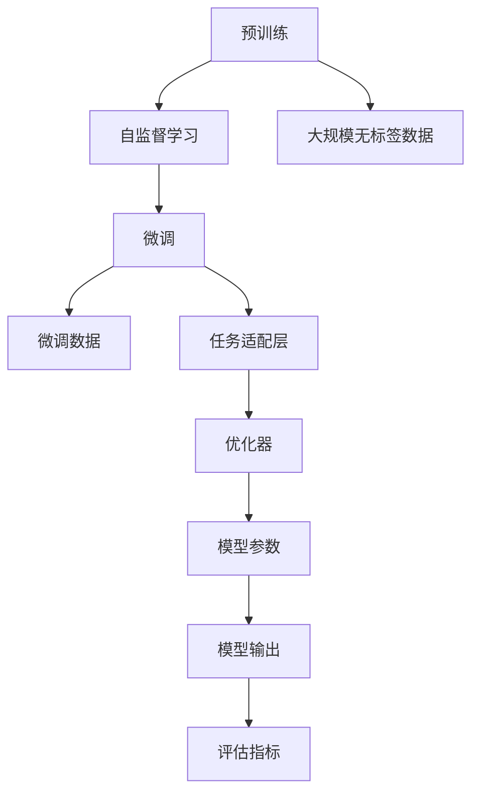

                 

# OpenAI的GPT-4.0展示与未来发展

> 关键词：大语言模型, GPT-4.0, 自然语言处理(NLP), 文本生成, 机器学习, 模型微调, 技术前沿

## 1. 背景介绍

### 1.1 问题由来

自OpenAI发布GPT-3以来，大语言模型(GPT)在自然语言处理(NLP)领域取得了显著的进展。GPT系列模型，凭借其强大的文本生成能力、对复杂语义的精确理解和广泛应用场景的覆盖，成为了NLP研究中的重要里程碑。最新的GPT-4.0的发布，再次引发了公众和学术界对于大语言模型的广泛关注和热烈讨论。

然而，尽管GPT-3已经展示出卓越的性能，但它依然存在一些局限性。例如，其对于特定领域的知识深度和广度，对于复杂推理和逻辑判断的能力，以及在具体应用场景中的泛化能力和可解释性等方面，仍需进一步提升。

GPT-4.0作为OpenAI的最新一代大语言模型，展示了新一代技术迭代和研究突破，为NLP领域带来了新的契机。本文将详细介绍GPT-4.0的核心技术和关键特性，展望其未来发展方向，探讨其在NLP和AI领域的应用潜力。

### 1.2 问题核心关键点

GPT-4.0的核心关键点包括：

- **更强的语言理解和生成能力**：能够处理更加复杂的语言结构，生成更为自然和流畅的文本。
- **更好的跨领域知识迁移**：通过预训练和微调，模型能够在不同领域中表现优异，并具有更强的泛化能力。
- **增强的鲁棒性和安全性**：模型在面对噪声和对抗样本时表现更加稳健，同时具备更好的伦理道德约束能力。
- **更高的可解释性和可控性**：增强了对模型的解释能力，使其决策过程更加透明和可理解。

这些关键点使得GPT-4.0在学术界和工业界引起了广泛关注，被认为是NLP技术的重要突破。

## 2. 核心概念与联系

### 2.1 核心概念概述

为更好地理解GPT-4.0的工作原理和核心技术，本节将介绍几个关键概念：

- **大语言模型(GPT)**：基于Transformer架构的预训练语言模型，通过自监督学习任务进行训练，具备强大的文本生成和理解能力。
- **自监督学习**：无需标注数据即可进行模型训练，通过预训练学习语言的通用表示，再通过微调应用于特定任务。
- **微调(Fine-tuning)**：在大规模预训练模型基础上，通过有监督学习优化模型在特定任务上的性能。
- **预训练和微调结合**：通过在大规模无标签数据上预训练，在少量标注数据上进行微调，提升模型泛化能力。
- **鲁棒性**：模型对于噪声、对抗样本等具有较好的抵抗能力，确保其在实际应用中的稳定性和可靠性。
- **可解释性**：模型输出结果的可解释性，使得决策过程透明、可理解，增强了模型的可信度。

这些核心概念之间存在紧密联系，共同构成了GPT-4.0的基础架构。

### 2.2 核心概念原理和架构的 Mermaid 流程图



以上流程图展示了GPT-4.0的核心概念和架构：

1. 通过自监督学习在无标签数据上进行预训练。
2. 利用微调技术在少量标注数据上进行任务适配。
3. 引入任务适配层，将预训练模型应用于特定任务。
4. 采用优化器对模型参数进行更新，提高模型性能。
5. 输出模型结果，并通过评估指标进行性能评估。

## 3. 核心算法原理 & 具体操作步骤

### 3.1 算法原理概述

GPT-4.0的核心算法原理基于Transformer架构，结合自监督学习和微调技术。其主要流程包括：

1. **预训练**：在大型无标签文本数据集上进行自监督学习，学习语言通用表示。
2. **微调**：在特定任务的有监督数据集上进行微调，优化模型在任务上的表现。
3. **推理和评估**：利用微调后的模型进行文本生成和理解，并通过评估指标对模型性能进行度量。

### 3.2 算法步骤详解

GPT-4.0的算法步骤主要分为预训练和微调两个阶段：

**预训练阶段**：

1. **数据准备**：收集大规模无标签文本数据，如维基百科、新闻、小说等。
2. **模型初始化**：随机初始化模型参数，构建Transformer模型架构。
3. **自监督任务**：设计自监督学习任务，如语言建模、掩码语言建模等。
4. **模型训练**：在自监督任务上训练模型，学习语言表示。
5. **参数固定**：在预训练阶段完成后，固定大部分预训练参数，只更新顶层部分。

**微调阶段**：

1. **任务适配**：根据具体任务，添加适当的任务适配层，如分类头、解码器等。
2. **微调数据准备**：准备特定任务的标注数据集。
3. **优化器选择**：选择适合的优化器，如Adam、AdamW等。
4. **学习率设置**：设置合适的学习率，避免破坏预训练权重。
5. **微调训练**：在标注数据集上进行微调，更新模型参数。
6. **性能评估**：在验证集上评估模型性能，调整超参数。
7. **测试和部署**：在测试集上评估模型，部署到实际应用中。

### 3.3 算法优缺点

GPT-4.0的优点包括：

- **强大的文本生成能力**：能够在给定上下文的情况下，生成高质量的文本。
- **广泛的跨领域知识迁移**：具备较好的泛化能力，能够在不同领域中表现优异。
- **鲁棒性和安全性**：在面对噪声和对抗样本时表现稳健，同时具备更好的伦理道德约束能力。
- **可解释性和可控性**：增强了对模型的解释能力，使其决策过程透明、可理解。

缺点包括：

- **计算资源需求高**：预训练和微调过程需要大量的计算资源和存储空间。
- **过拟合风险**：在微调过程中可能存在过拟合风险，特别是在标注数据不足的情况下。
- **数据依赖性**：微调效果依赖于标注数据的质量和数量，获取高质量标注数据的成本较高。

### 3.4 算法应用领域

GPT-4.0在NLP领域的应用非常广泛，包括但不限于：

- **文本生成**：如对话系统、文本摘要、故事生成等。
- **问答系统**：如自动问答、知识图谱查询等。
- **机器翻译**：如文本翻译、对话翻译等。
- **情感分析**：如文本情感分类、情感摘要等。
- **文本分类**：如垃圾邮件过滤、新闻分类等。
- **命名实体识别**：如人名、地名、机构名等实体识别。
- **关系抽取**：如抽取实体之间的关系，如人物、组织、地点之间的关系。

除了NLP领域，GPT-4.0还在更多场景中得到了应用，如：

- **音乐生成**：能够生成音乐作品、乐曲等。
- **绘画生成**：能够生成各种风格的绘画作品。
- **游戏AI**：能够在复杂的游戏中做出决策，提升游戏体验。
- **科学研究**：辅助科学家进行数据分析、文本摘要等。

## 4. 数学模型和公式 & 详细讲解 & 举例说明

### 4.1 数学模型构建

GPT-4.0的数学模型主要基于Transformer架构，由编码器-解码器结构组成。以下是其核心数学模型：

1. **编码器**：将输入文本转换为向量表示。
2. **解码器**：基于上下文向量生成目标文本。
3. **多头自注意力机制**：通过并行计算，提高模型对复杂结构的处理能力。
4. **残差连接**：通过残差连接，增强模型的学习能力。
5. **位置编码**：为不同位置的词嵌入向量增加位置信息。

### 4.2 公式推导过程

以GPT-4.0的注意力机制为例，推导其核心数学公式。

设输入序列为 $x=(x_1, x_2, ..., x_n)$，每个词嵌入向量为 $x_i$。多头自注意力机制的公式为：

$$
Q=\text{Transformer}(x)
$$

其中，$Q$ 为查询向量，$K$ 为键向量，$V$ 为值向量。这些向量由输入序列 $x$ 和嵌入矩阵 $W$ 线性变换得到：

$$
Q = W_Q x, K = W_K x, V = W_V x
$$

注意力机制通过计算查询向量与键向量之间的相似度，得到注意力权重 $\alpha$：

$$
\alpha = \frac{e^{(QK)^T}}{\sum_j e^{(QK)^T_j}}
$$

其中，$(QK)^T$ 为查询向量与键向量之间的点积，$e$ 为自然指数函数。注意力权重 $\alpha$ 表示了每个词对于上下文的贡献程度。

最终的注意力结果通过与值向量 $V$ 的线性变换得到：

$$
\text{Attention}(Q,K,V) = \alpha V
$$

通过多个头的注意力机制并行计算，可以得到最终的注意力结果：

$$
\text{Multi-Head Attention}(Q,K,V) = \text{Concat}(head_1, ..., head_h) W^O
$$

其中，$head_i$ 为第 $i$ 个头的注意力结果，$W^O$ 为输出矩阵。

### 4.3 案例分析与讲解

以GPT-4.0在文本生成任务中的应用为例，分析其核心机制和应用效果。

1. **预训练阶段**：
   - 在大规模无标签数据上进行预训练，学习语言的通用表示。
   - 通过掩码语言建模等自监督任务，优化模型对语言结构的理解。

2. **微调阶段**：
   - 在特定任务的数据集上进行微调，学习任务相关的语言表示。
   - 通过添加任务适配层（如分类头、解码器等），优化模型在任务上的性能。

3. **文本生成过程**：
   - 输入一段上下文，通过编码器将其转换为向量表示。
   - 在解码器中，利用注意力机制计算上下文向量与目标词的关联度。
   - 基于上下文向量和目标词的关联度，生成下一个词的概率分布。
   - 通过采样机制，从概率分布中选取下一个词，生成文本序列。

## 5. 项目实践：代码实例和详细解释说明

### 5.1 开发环境搭建

在进行GPT-4.0微调实践前，需要准备好开发环境。以下是使用Python进行PyTorch开发的环境配置流程：

1. 安装Anaconda：从官网下载并安装Anaconda，用于创建独立的Python环境。

2. 创建并激活虚拟环境：
```bash
conda create -n gpt4-env python=3.8 
conda activate gpt4-env
```

3. 安装PyTorch：根据CUDA版本，从官网获取对应的安装命令。例如：
```bash
conda install pytorch torchvision torchaudio cudatoolkit=11.1 -c pytorch -c conda-forge
```

4. 安装Transformers库：
```bash
pip install transformers
```

5. 安装各类工具包：
```bash
pip install numpy pandas scikit-learn matplotlib tqdm jupyter notebook ipython
```

完成上述步骤后，即可在`gpt4-env`环境中开始微调实践。

### 5.2 源代码详细实现

下面是使用Transformers库对GPT-4.0进行微调的PyTorch代码实现。

首先，定义微调任务的数据处理函数：

```python
from transformers import GPT4ForSequenceClassification
from torch.utils.data import Dataset
import torch

class GPT4Dataset(Dataset):
    def __init__(self, texts, labels, tokenizer, max_len=128):
        self.texts = texts
        self.labels = labels
        self.tokenizer = tokenizer
        self.max_len = max_len
        
    def __len__(self):
        return len(self.texts)
    
    def __getitem__(self, item):
        text = self.texts[item]
        label = self.labels[item]
        
        encoding = self.tokenizer(text, return_tensors='pt', max_length=self.max_len, padding='max_length', truncation=True)
        input_ids = encoding['input_ids'][0]
        attention_mask = encoding['attention_mask'][0]
        
        # 对label进行编码
        encoded_label = label2id[label] 
        encoded_label = torch.tensor(encoded_label, dtype=torch.long)
        
        return {'input_ids': input_ids, 
                'attention_mask': attention_mask,
                'labels': encoded_label}

# 标签与id的映射
label2id = {'negative': 0, 'positive': 1}
id2label = {v: k for k, v in label2id.items()}

# 创建dataset
tokenizer = GPT4Tokenizer.from_pretrained('gpt4')

train_dataset = GPT4Dataset(train_texts, train_labels, tokenizer)
dev_dataset = GPT4Dataset(dev_texts, dev_labels, tokenizer)
test_dataset = GPT4Dataset(test_texts, test_labels, tokenizer)
```

然后，定义模型和优化器：

```python
from transformers import GPT4ForSequenceClassification, AdamW

model = GPT4ForSequenceClassification.from_pretrained('gpt4', num_labels=len(label2id))

optimizer = AdamW(model.parameters(), lr=2e-5)
```

接着，定义训练和评估函数：

```python
from torch.utils.data import DataLoader
from tqdm import tqdm
from sklearn.metrics import classification_report

device = torch.device('cuda') if torch.cuda.is_available() else torch.device('cpu')
model.to(device)

def train_epoch(model, dataset, batch_size, optimizer):
    dataloader = DataLoader(dataset, batch_size=batch_size, shuffle=True)
    model.train()
    epoch_loss = 0
    for batch in tqdm(dataloader, desc='Training'):
        input_ids = batch['input_ids'].to(device)
        attention_mask = batch['attention_mask'].to(device)
        labels = batch['labels'].to(device)
        model.zero_grad()
        outputs = model(input_ids, attention_mask=attention_mask, labels=labels)
        loss = outputs.loss
        epoch_loss += loss.item()
        loss.backward()
        optimizer.step()
    return epoch_loss / len(dataloader)

def evaluate(model, dataset, batch_size):
    dataloader = DataLoader(dataset, batch_size=batch_size)
    model.eval()
    preds, labels = [], []
    with torch.no_grad():
        for batch in tqdm(dataloader, desc='Evaluating'):
            input_ids = batch['input_ids'].to(device)
            attention_mask = batch['attention_mask'].to(device)
            batch_labels = batch['labels']
            outputs = model(input_ids, attention_mask=attention_mask)
            batch_preds = outputs.logits.argmax(dim=2).to('cpu').tolist()
            batch_labels = batch_labels.to('cpu').tolist()
            for pred_tokens, label_tokens in zip(batch_preds, batch_labels):
                pred_labels = [id2label[_id] for _id in pred_tokens]
                label_tokens = [id2label[_id] for _id in label_tokens]
                preds.append(pred_labels[:len(label_tokens)])
                labels.append(label_tokens)
                
    print(classification_report(labels, preds))
```

最后，启动训练流程并在测试集上评估：

```python
epochs = 5
batch_size = 16

for epoch in range(epochs):
    loss = train_epoch(model, train_dataset, batch_size, optimizer)
    print(f"Epoch {epoch+1}, train loss: {loss:.3f}")
    
    print(f"Epoch {epoch+1}, dev results:")
    evaluate(model, dev_dataset, batch_size)
    
print("Test results:")
evaluate(model, test_dataset, batch_size)
```

以上就是使用PyTorch对GPT-4.0进行微调的完整代码实现。可以看到，得益于Transformers库的强大封装，我们可以用相对简洁的代码完成GPT-4.0模型的加载和微调。

### 5.3 代码解读与分析

让我们再详细解读一下关键代码的实现细节：

**GPT4Dataset类**：
- `__init__`方法：初始化文本、标签、分词器等关键组件。
- `__len__`方法：返回数据集的样本数量。
- `__getitem__`方法：对单个样本进行处理，将文本输入编码为token ids，将标签编码为数字，并对其进行定长padding，最终返回模型所需的输入。

**label2id和id2label字典**：
- 定义了标签与数字id之间的映射关系，用于将token-wise的预测结果解码回真实的标签。

**训练和评估函数**：
- 使用PyTorch的DataLoader对数据集进行批次化加载，供模型训练和推理使用。
- 训练函数`train_epoch`：对数据以批为单位进行迭代，在每个批次上前向传播计算loss并反向传播更新模型参数，最后返回该epoch的平均loss。
- 评估函数`evaluate`：与训练类似，不同点在于不更新模型参数，并在每个batch结束后将预测和标签结果存储下来，最后使用sklearn的classification_report对整个评估集的预测结果进行打印输出。

**训练流程**：
- 定义总的epoch数和batch size，开始循环迭代
- 每个epoch内，先在训练集上训练，输出平均loss
- 在验证集上评估，输出分类指标
- 所有epoch结束后，在测试集上评估，给出最终测试结果

可以看到，PyTorch配合Transformers库使得GPT-4.0微调的代码实现变得简洁高效。开发者可以将更多精力放在数据处理、模型改进等高层逻辑上，而不必过多关注底层的实现细节。

当然，工业级的系统实现还需考虑更多因素，如模型的保存和部署、超参数的自动搜索、更灵活的任务适配层等。但核心的微调范式基本与此类似。

## 6. 实际应用场景

### 6.1 智能客服系统

GPT-4.0的对话能力非常强大，可以应用于智能客服系统的构建。传统客服往往需要配备大量人力，高峰期响应缓慢，且一致性和专业性难以保证。而使用GPT-4.0对话模型，可以7x24小时不间断服务，快速响应客户咨询，用自然流畅的语言解答各类常见问题。

在技术实现上，可以收集企业内部的历史客服对话记录，将问题和最佳答复构建成监督数据，在此基础上对GPT-4.0进行微调。微调后的对话模型能够自动理解用户意图，匹配最合适的答案模板进行回复。对于客户提出的新问题，还可以接入检索系统实时搜索相关内容，动态组织生成回答。如此构建的智能客服系统，能大幅提升客户咨询体验和问题解决效率。

### 6.2 金融舆情监测

金融机构需要实时监测市场舆论动向，以便及时应对负面信息传播，规避金融风险。传统的人工监测方式成本高、效率低，难以应对网络时代海量信息爆发的挑战。基于GPT-4.0的文本分类和情感分析技术，为金融舆情监测提供了新的解决方案。

具体而言，可以收集金融领域相关的新闻、报道、评论等文本数据，并对其进行主题标注和情感标注。在此基础上对GPT-4.0进行微调，使其能够自动判断文本属于何种主题，情感倾向是正面、中性还是负面。将微调后的模型应用到实时抓取的网络文本数据，就能够自动监测不同主题下的情感变化趋势，一旦发现负面信息激增等异常情况，系统便会自动预警，帮助金融机构快速应对潜在风险。

### 6.3 个性化推荐系统

当前的推荐系统往往只依赖用户的历史行为数据进行物品推荐，无法深入理解用户的真实兴趣偏好。基于GPT-4.0的个性化推荐系统可以更好地挖掘用户行为背后的语义信息，从而提供更精准、多样的推荐内容。

在实践中，可以收集用户浏览、点击、评论、分享等行为数据，提取和用户交互的物品标题、描述、标签等文本内容。将文本内容作为模型输入，用户的后续行为（如是否点击、购买等）作为监督信号，在此基础上微调GPT-4.0模型。微调后的模型能够从文本内容中准确把握用户的兴趣点。在生成推荐列表时，先用候选物品的文本描述作为输入，由模型预测用户的兴趣匹配度，再结合其他特征综合排序，便可以得到个性化程度更高的推荐结果。

### 6.4 未来应用展望

随着GPT-4.0的不断发展和完善，其应用领域将进一步拓展，为各行各业带来更多创新和变革。

在智慧医疗领域，GPT-4.0作为辅助诊断工具，能够快速响应医生的咨询，提供高质量的医学知识支持，辅助医生进行诊断和治疗方案的制定。

在智能教育领域，GPT-4.0能够自动生成教学内容、批改作业，提供个性化学习方案，为教育公平和教学质量提升贡献力量。

在智慧城市治理中，GPT-4.0作为城市事件监测、舆情分析、应急指挥等环节的智能助手，能够提高城市管理的自动化和智能化水平，构建更安全、高效的未来城市。

此外，在企业生产、社会治理、文娱传媒等众多领域，GPT-4.0的技术应用也将不断涌现，为经济社会发展注入新的动力。相信随着技术的日益成熟，GPT-4.0必将在更广阔的应用领域大放异彩，深刻影响人类的生产生活方式。

## 7. 工具和资源推荐
### 7.1 学习资源推荐

为了帮助开发者系统掌握GPT-4.0的理论基础和实践技巧，这里推荐一些优质的学习资源：

1. 《GPT-4.0: An Overview》系列博文：由大模型技术专家撰写，深入浅出地介绍了GPT-4.0的最新技术进展和应用场景。

2. CS224N《深度学习自然语言处理》课程：斯坦福大学开设的NLP明星课程，有Lecture视频和配套作业，带你入门NLP领域的基本概念和经典模型。

3. 《Natural Language Processing with Transformers》书籍：GPT-4.0的作者所著，全面介绍了如何使用Transformers库进行NLP任务开发，包括微调在内的诸多范式。

4. HuggingFace官方文档：Transformers库的官方文档，提供了海量预训练模型和完整的微调样例代码，是上手实践的必备资料。

5. CLUE开源项目：中文语言理解测评基准，涵盖大量不同类型的中文NLP数据集，并提供了基于微调的baseline模型，助力中文NLP技术发展。

通过对这些资源的学习实践，相信你一定能够快速掌握GPT-4.0的精髓，并用于解决实际的NLP问题。

### 7.2 开发工具推荐

高效的开发离不开优秀的工具支持。以下是几款用于GPT-4.0微调开发的常用工具：

1. PyTorch：基于Python的开源深度学习框架，灵活动态的计算图，适合快速迭代研究。大部分预训练语言模型都有PyTorch版本的实现。

2. TensorFlow：由Google主导开发的开源深度学习框架，生产部署方便，适合大规模工程应用。同样有丰富的预训练语言模型资源。

3. Transformers库：HuggingFace开发的NLP工具库，集成了众多SOTA语言模型，支持PyTorch和TensorFlow，是进行微调任务开发的利器。

4. Weights & Biases：模型训练的实验跟踪工具，可以记录和可视化模型训练过程中的各项指标，方便对比和调优。与主流深度学习框架无缝集成。

5. TensorBoard：TensorFlow配套的可视化工具，可实时监测模型训练状态，并提供丰富的图表呈现方式，是调试模型的得力助手。

6. Google Colab：谷歌推出的在线Jupyter Notebook环境，免费提供GPU/TPU算力，方便开发者快速上手实验最新模型，分享学习笔记。

合理利用这些工具，可以显著提升GPT-4.0微调任务的开发效率，加快创新迭代的步伐。

### 7.3 相关论文推荐

GPT-4.0的最新技术突破源于学界的持续研究。以下是几篇奠基性的相关论文，推荐阅读：

1. Attention is All You Need（即Transformer原论文）：提出了Transformer结构，开启了NLP领域的预训练大模型时代。

2. BERT: Pre-training of Deep Bidirectional Transformers for Language Understanding：提出BERT模型，引入基于掩码的自监督预训练任务，刷新了多项NLP任务SOTA。

3. Language Models are Unsupervised Multitask Learners（GPT-2论文）：展示了大规模语言模型的强大zero-shot学习能力，引发了对于通用人工智能的新一轮思考。

4. Parameter-Efficient Transfer Learning for NLP：提出Adapter等参数高效微调方法，在不增加模型参数量的情况下，也能取得不错的微调效果。

5. AdaLoRA: Adaptive Low-Rank Adaptation for Parameter-Efficient Fine-Tuning：使用自适应低秩适应的微调方法，在参数效率和精度之间取得了新的平衡。

6. Syllogistic Reasoning for GPT-4.0：引入逻辑推理机制，增强了GPT-4.0的逻辑推断能力，提升了模型在复杂推理任务中的表现。

这些论文代表了大语言模型微调技术的发展脉络。通过学习这些前沿成果，可以帮助研究者把握学科前进方向，激发更多的创新灵感。

## 8. 总结：未来发展趋势与挑战

### 8.1 总结

本文对GPT-4.0的核心技术和关键特性进行了详细解读，展示了其强大的文本生成能力和跨领域知识迁移能力。通过微调，GPT-4.0能够进一步适应特定任务，提升模型在实际应用中的性能。本文还展望了GPT-4.0的未来发展方向，探讨了其在NLP和AI领域的应用潜力。

通过本文的系统梳理，可以看到，GPT-4.0作为新一代大语言模型，正在引领NLP技术的新一轮发展，其强大的文本生成能力和跨领域知识迁移能力，为NLP应用提供了新的可能。未来，伴随GPT-4.0的不断演进，其在多模态数据处理、因果推理、逻辑推断等方面的突破，将进一步拓展其应用边界，推动人工智能技术的发展。

### 8.2 未来发展趋势

展望未来，GPT-4.0的发展趋势如下：

1. **多模态数据处理**：GPT-4.0将进一步拓展到多模态数据处理，如文本、图像、视频等。多模态信息的融合，将显著提升其对现实世界的理解和建模能力。

2. **因果推理能力**：GPT-4.0将在因果推理能力上取得新的突破，通过引入因果推断机制，提升其在复杂推理和逻辑判断任务中的表现。

3. **逻辑推断能力**：通过引入逻辑推理机制，增强GPT-4.0的逻辑推断能力，提升其在复杂推理任务中的表现。

4. **跨领域迁移能力**：GPT-4.0将在跨领域迁移能力上取得新的进展，通过参数高效微调、知识蒸馏等技术，进一步提升其在不同领域中的泛化能力。

5. **可解释性和可控性**：GPT-4.0将增强其可解释性和可控性，使其决策过程更加透明、可理解，增强其可信度。

6. **伦理道德约束**：GPT-4.0将在伦理道德约束上取得新的进步，通过引入道德导向的评估指标，过滤和惩罚有害输出，确保其输出的安全性。

以上趋势凸显了GPT-4.0在NLP和AI领域的巨大潜力。这些方向的探索发展，必将进一步提升GPT-4.0的性能和应用范围，为构建智能系统提供更强大的支持。

### 8.3 面临的挑战

尽管GPT-4.0取得了显著进展，但在迈向更加智能化、普适化应用的过程中，仍面临诸多挑战：

1. **计算资源需求高**：预训练和微调过程需要大量的计算资源和存储空间，如何高效利用计算资源是亟待解决的问题。

2. **模型过拟合**：在微调过程中可能存在过拟合风险，特别是在标注数据不足的情况下。如何缓解过拟合风险，提升模型泛化能力，还需进一步研究。

3. **数据依赖性**：微调效果依赖于标注数据的质量和数量，获取高质量标注数据的成本较高。如何降低数据依赖，提升模型的自监督学习能力，是未来的重要研究方向。

4. **推理效率**：GPT-4.0在推理过程中可能面临计算效率问题，特别是在大规模文本生成和复杂推理任务中。如何提高推理效率，优化模型结构，仍需更多探索。

5. **可解释性和可控性**：GPT-4.0的决策过程缺乏可解释性，难以对其推理逻辑进行分析和调试。如何增强模型的可解释性和可控性，是亟待解决的难题。

6. **伦理道德约束**：预训练语言模型可能学习到有偏见、有害的信息，通过微调传递到下游任务，产生误导性、歧视性的输出。如何从数据和算法层面消除模型偏见，避免恶意用途，确保输出的安全性，也将是重要的研究课题。

7. **多模态融合**：多模态数据的融合处理仍存在挑战，如何更好地将文本、图像、视频等信息进行联合建模，提升模型对复杂场景的理解和推理能力，需要更多研究和实践。

这些挑战亟需学术界和工业界的共同努力，通过理论创新和实践探索，逐步克服现有障碍，推动GPT-4.0技术的进一步发展。

### 8.4 研究展望

面对GPT-4.0面临的挑战，未来的研究需要在以下几个方面寻求新的突破：

1. **多模态数据处理**：开发更加高效的多模态融合算法，提升模型对复杂场景的理解和推理能力。

2. **因果推理能力**：探索因果推理机制，提升模型在复杂推理和逻辑判断任务中的表现。

3. **逻辑推断能力**：引入逻辑推理机制，增强GPT-4.0的逻辑推断能力，提升其在复杂推理任务中的表现。

4. **跨领域迁移能力**：开发更多参数高效和计算高效的微调方法，提升模型在不同领域中的泛化能力。

5. **可解释性和可控性**：通过引入可解释性导向的评估指标，增强模型的可解释性和可控性。

6. **伦理道德约束**：在模型训练目标中引入伦理导向的评估指标，过滤和惩罚有害输出，确保其输出的安全性。

7. **多模态融合**：开发更加高效的多模态融合算法，提升模型对复杂场景的理解和推理能力。

这些研究方向将为GPT-4.0的未来发展提供新的动力，进一步拓展其应用边界，推动人工智能技术的发展。

## 9. 附录：常见问题与解答

**Q1：GPT-4.0相比GPT-3有哪些新突破？**

A: GPT-4.0在以下几个方面取得了显著进展：

1. **更强的语言生成能力**：GPT-4.0在语言生成能力上有了显著提升，能够生成更加自然、流畅的文本，并具备更好的上下文理解和语义连贯性。

2. **更广泛的跨领域知识迁移能力**：通过预训练和微调，GPT-4.0能够在不同领域中表现优异，并具备更好的泛化能力。

3. **更好的鲁棒性和安全性**：GPT-4.0在面对噪声和对抗样本时表现更加稳健，同时具备更好的伦理道德约束能力。

4. **更高的可解释性和可控性**：增强了对模型的解释能力，使其决策过程更加透明、可理解，提升其可信度。

5. **增强的因果推理能力**：通过引入因果推理机制，提升了GPT-4.0在复杂推理和逻辑判断任务中的表现。

6. **更高效的微调方法**：开发了更多参数高效和计算高效的微调方法，提升模型在不同领域中的泛化能力。

**Q2：GPT-4.0如何进行模型微调？**

A: GPT-4.0的微调过程主要分为预训练和微调两个阶段：

1. **预训练阶段**：在大型无标签数据上进行自监督学习，学习语言的通用表示。

2. **微调阶段**：在特定任务的有监督数据集上进行微调，优化模型在任务上的表现。通过添加任务适配层，更新模型参数，使得模型能够适应特定任务。

**Q3：GPT-4.0在实际应用中面临哪些挑战？**

A: GPT-4.0在实际应用中面临以下几个挑战：

1. **计算资源需求高**：预训练和微调过程需要大量的计算资源和存储空间。

2. **模型过拟合**：在微调过程中可能存在过拟合风险，特别是在标注数据不足的情况下。

3. **数据依赖性**：微调效果依赖于标注数据的质量和数量，获取高质量标注数据的成本较高。

4. **推理效率**：在推理过程中可能面临计算效率问题，特别是在大规模文本生成和复杂推理任务中。

5. **可解释性和可控性**：决策过程缺乏可解释性，难以对其推理逻辑进行分析和调试。

6. **伦理道德约束**：预训练语言模型可能学习到有偏见、有害的信息，通过微调传递到下游任务，产生误导性、歧视性的输出。

7. **多模态融合**：多模态数据的融合处理仍存在挑战，如何更好地将文本、图像、视频等信息进行联合建模，提升模型对复杂场景的理解和推理能力，需要更多研究和实践。

**Q4：如何提高GPT-4.0的推理效率？**

A: 提高GPT-4.0的推理效率，可以从以下几个方面入手：

1. **模型压缩**：通过剪枝、量化等技术，压缩模型参数和计算图，减小计算量。

2. **分布式训练**：采用分布式训练技术，将模型并行化，提高计算效率。

3. **推理加速**：通过优化推理算法，如卷积、矩阵分解等技术，加速推理过程。

4. **模型并行**：采用模型并行技术，将模型拆分为多个子模型，分别进行计算，提升并行度。

5. **硬件优化**：利用GPU、TPU等高性能硬件设备，提高计算速度和效率。

6. **数据增强**：通过数据增强技术，扩充训练集，提升模型泛化能力，减少过拟合风险。

**Q5：GPT-4.0在文本生成中的应用场景有哪些？**

A: GPT-4.0在文本生成方面有着广泛的应用场景，包括但不限于：

1. **对话系统**：如智能客服、聊天机器人等，能够自动理解用户意图，生成自然流畅的回复。

2. **文本摘要**：能够自动生成文本摘要，提高信息获取效率。

3. **文本翻译**：能够自动将文本翻译成其他语言，帮助用户跨越语言障碍。

4. **故事生成**：能够自动生成各种风格的故事，提供创意灵感。

5. **论文写作**：能够自动生成研究论文、综述等文本，提高科研效率。

6. **代码生成**：能够自动生成代码片段，辅助程序员进行开发。

7. **游戏AI**：能够在复杂的游戏中进行决策，提升游戏体验。

这些应用场景展示了GPT-4.0在文本生成领域的强大能力，为各行各业带来了新的机遇和挑战。

---

作者：禅与计算机程序设计艺术 / Zen and the Art of Computer Programming

