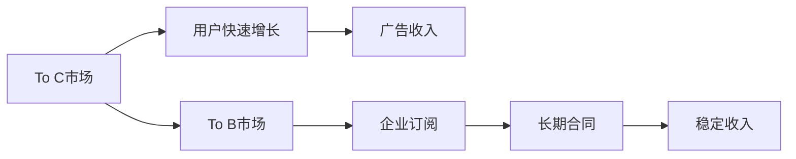

                 

# OpenAI的成功之道：贾扬清的分析，在To C和To B市场的平衡

## 1. 背景介绍

在过去十年间，人工智能（AI）技术取得了迅猛发展，特别是在自然语言处理（NLP）和深度学习领域。OpenAI作为其中的佼佼者，不仅推出了一系列革命性的模型，如GPT-3、DALL-E，还在商业化和市场推广上取得了显著成绩。本文将从贾扬清教授的角度，深入分析OpenAI的成功之道，探讨其在To C和To B市场的平衡策略，以及未来发展趋势。

## 2. 核心概念与联系

### 2.1 核心概念概述

To C和To B市场是指产品或服务面向消费用户和企业用户两种不同目标群体的商业模式。To C市场通常追求快速增长的用户规模，产品需要具备易用性、吸引力；To B市场则侧重于提供长期稳定的价值，产品需要具备可定制性、高效率。

OpenAI的成功在于其在这两个市场中找到了平衡，并成功实现了商业化。本文将探讨这一平衡策略的核心概念和实现方法。

### 2.2 核心概念原理和架构的 Mermaid 流程图



## 3. 核心算法原理 & 具体操作步骤

### 3.1 算法原理概述

OpenAI的商业化策略基于其在To C和To B市场的双重定位。To C市场通过打造易于使用且具有吸引力的产品来吸引大量用户，从而带来广告收入和品牌效应。To B市场则通过与企业客户签订长期订阅合同，提供定制化的AI解决方案，确保长期稳定的收入来源。

这种双重策略的实现，依赖于以下几个核心算法原理：

1. **深度学习模型的预训练与微调**：OpenAI采用自监督学习方式对深度学习模型进行预训练，然后通过微调适应特定任务。这不仅提高了模型性能，也减少了企业客户对定制化需求。

2. **API开放与定制服务**：OpenAI开放API接口，让开发者和企业用户能够快速接入其AI模型，同时也提供定制化的API开发服务，满足企业的特殊需求。

3. **社区与协作平台**：OpenAI构建了强大的社区和协作平台，通过开放API和代码库，促进开发者和研究者之间的交流合作，加速AI技术的创新和应用。

4. **数据隐私和安全**：OpenAI在商业化过程中，非常重视用户数据的隐私和安全，通过严格的隐私保护措施和技术手段，赢得了用户的信任。

### 3.2 算法步骤详解

#### 3.2.1 预训练与微调

1. **数据集准备**：收集大量无标签文本数据，用于模型的预训练。
2. **模型选择与初始化**：选择合适的深度学习模型，并进行预训练。
3. **微调步骤**：
   - 对模型进行微调，使其适应特定任务。
   - 使用验证集评估模型性能，调整超参数。
   - 在测试集上进行最终测试，确定模型表现。

#### 3.2.2 API开放与定制服务

1. **API设计**：设计易于使用的API接口，包括请求参数、返回结果等。
2. **定制化开发**：根据企业客户的需求，提供定制化的API开发服务，确保模型性能和易用性。
3. **用户文档与支持**：提供详细的使用文档和客户支持，帮助用户快速上手。

#### 3.2.3 社区与协作平台

1. **社区建设**：建立开发者和研究者社区，分享知识和研究成果。
2. **代码库与工具**：开放代码库和工具，促进协作和创新。
3. **会议与活动**：定期举办技术会议和活动，推动技术交流和应用落地。

#### 3.2.4 数据隐私与安全

1. **数据加密**：对用户数据进行加密处理，保护数据隐私。
2. **访问控制**：实现严格的访问控制机制，防止未经授权的访问。
3. **合规检查**：定期进行合规检查，确保符合相关法律法规。

### 3.3 算法优缺点

#### 3.3.1 优点

1. **双重市场策略**：同时覆盖To C和To B市场，获得广告收入和长期订阅收入，确保稳定增长。
2. **技术领先**：通过持续的深度学习模型创新，保持技术领先地位。
3. **广泛应用**：提供API和定制服务，使AI技术广泛应用到各个行业。

#### 3.3.2 缺点

1. **高昂成本**：深度学习模型的预训练和定制服务需要大量资源，成本较高。
2. **技术复杂**：深度学习模型的开发和应用复杂，需要专业人才。
3. **数据隐私问题**：用户数据隐私和安全需要严格保护，技术实现难度大。

### 3.4 算法应用领域

OpenAI的商业化策略在多个领域取得了成功应用，包括：

1. **自然语言处理**：通过GPT系列模型，提供文本生成、语言翻译、情感分析等服务。
2. **计算机视觉**：通过DALL-E等模型，实现图像生成、物体检测、人脸识别等功能。
3. **机器人与智能交互**：通过OpenAI Gym等工具，推动机器人技术和智能交互系统的发展。

## 4. 数学模型和公式 & 详细讲解 & 举例说明

### 4.1 数学模型构建

#### 4.1.1 预训练模型

设预训练模型为 $M_{\theta}$，其中 $\theta$ 为模型参数。假设数据集为 $D=\{(x_i,y_i)\}_{i=1}^N$，目标是最小化经验风险：

$$
\mathcal{L}(\theta) = \frac{1}{N} \sum_{i=1}^N \ell(M_{\theta}(x_i),y_i)
$$

其中 $\ell$ 为损失函数，如交叉熵损失。

#### 4.1.2 微调模型

在预训练模型基础上，通过有监督学习优化模型参数，以适应特定任务。假设微调后的模型为 $M_{\hat{\theta}}$，目标是最小化损失函数：

$$
\hat{\theta} = \mathop{\arg\min}_{\theta} \mathcal{L}(\theta,D')
$$

其中 $D'$ 为微调数据集。

### 4.2 公式推导过程

#### 4.2.1 预训练过程

以语言模型为例，假设模型 $M_{\theta}$ 在输入 $x$ 上的输出为 $\hat{y}=M_{\theta}(x)$，目标是最小化交叉熵损失：

$$
\ell(M_{\theta}(x),y) = -y\log \hat{y} - (1-y)\log (1-\hat{y})
$$

在数据集 $D$ 上进行预训练，目标是最小化经验风险：

$$
\mathcal{L}(\theta) = -\frac{1}{N}\sum_{i=1}^N y_i\log \hat{y}_i
$$

#### 4.2.2 微调过程

在预训练模型 $M_{\theta}$ 上进行微调，假设微调数据集为 $D'$，目标是最小化损失函数：

$$
\mathcal{L}(\theta) = \frac{1}{N}\sum_{i=1}^N \ell(M_{\theta}(x_i),y_i)
$$

根据链式法则，损失函数对参数 $\theta$ 的梯度为：

$$
\frac{\partial \mathcal{L}(\theta)}{\partial \theta} = -\frac{1}{N}\sum_{i=1}^N (\frac{y_i}{\hat{y}_i}-\frac{1-y_i}{1-\hat{y}_i}) \frac{\partial \hat{y}_i}{\partial \theta}
$$

其中 $\frac{\partial \hat{y}_i}{\partial \theta}$ 可通过反向传播算法计算。

### 4.3 案例分析与讲解

#### 4.3.1 语言模型微调

以GPT-3为例，假设训练数据集为 $D$，目标任务为文本生成。首先，将预训练模型 $M_{\theta}$ 输入训练数据 $D$，进行预训练。然后，通过微调数据集 $D'$ 进行微调：

1. **预训练**：在大量文本数据上进行自监督训练，学习语言表征。
2. **微调**：在特定任务数据集上进行有监督训练，优化模型参数。

#### 4.3.2 图像生成模型

以DALL-E为例，假设训练数据集为 $D$，目标任务为图像生成。首先，将预训练模型 $M_{\theta}$ 输入训练数据 $D$，进行预训练。然后，通过微调数据集 $D'$ 进行微调：

1. **预训练**：在大量文本数据和图像数据上进行联合训练，学习文本-图像映射。
2. **微调**：在特定图像生成任务数据集上进行有监督训练，优化模型参数。

## 5. 项目实践：代码实例和详细解释说明

### 5.1 开发环境搭建

#### 5.1.1 Python环境

1. 安装Python 3.8
2. 安装PyTorch、TensorFlow、Transformers等深度学习框架

#### 5.1.2 数据集准备

1. 收集并准备预训练数据集
2. 准备微调数据集

### 5.2 源代码详细实现

#### 5.2.1 预训练模型

1. 选择预训练模型，如BERT、GPT-3等。
2. 进行预训练，通常使用自监督学习任务。
3. 保存预训练模型参数。

#### 5.2.2 微调模型

1. 加载预训练模型参数。
2. 加载微调数据集。
3. 设计任务适配层，如分类器、解码器等。
4. 定义损失函数。
5. 使用优化器进行微调。

### 5.3 代码解读与分析

#### 5.3.1 预训练模型

```python
import torch
from transformers import BertTokenizer, BertModel

tokenizer = BertTokenizer.from_pretrained('bert-base-uncased')
model = BertModel.from_pretrained('bert-base-uncased')

inputs = tokenizer("Hello, my dog is cute", return_tensors='pt')
outputs = model(**inputs)
```

#### 5.3.2 微调模型

```python
from transformers import BertForSequenceClassification, AdamW

model = BertForSequenceClassification.from_pretrained('bert-base-uncased', num_labels=2)
optimizer = AdamW(model.parameters(), lr=2e-5)

inputs = tokenizer("This is a positive sentence.", return_tensors='pt')
labels = torch.tensor([1], dtype=torch.long)
model.zero_grad()

outputs = model(inputs)
loss = outputs.loss
loss.backward()
optimizer.step()

# 在微调数据集上进行训练
for batch in data_loader:
    inputs = batch['input_ids'].to(device)
    attention_mask = batch['attention_mask'].to(device)
    labels = batch['labels'].to(device)
    model.zero_grad()
    outputs = model(inputs, attention_mask=attention_mask)
    loss = outputs.loss
    loss.backward()
    optimizer.step()
```

### 5.4 运行结果展示

#### 5.4.1 预训练模型

使用预训练模型进行文本分类任务的演示：

```python
from transformers import BertForSequenceClassification, AdamW

model = BertForSequenceClassification.from_pretrained('bert-base-uncased', num_labels=2)
optimizer = AdamW(model.parameters(), lr=2e-5)

inputs = tokenizer("This is a positive sentence.", return_tensors='pt')
labels = torch.tensor([1], dtype=torch.long)
model.zero_grad()

outputs = model(inputs)
loss = outputs.loss
loss.backward()
optimizer.step()

# 在微调数据集上进行训练
for batch in data_loader:
    inputs = batch['input_ids'].to(device)
    attention_mask = batch['attention_mask'].to(device)
    labels = batch['labels'].to(device)
    model.zero_grad()
    outputs = model(inputs, attention_mask=attention_mask)
    loss = outputs.loss
    loss.backward()
    optimizer.step()

# 评估模型
test_loss = evaluate(model, test_data)
print("Test loss: ", test_loss)
```

## 6. 实际应用场景

### 6.1 自然语言处理

OpenAI通过GPT系列模型，推动了自然语言处理领域的革命性进展。GPT-3在文本生成、语言翻译、情感分析等方面表现优异，广泛应用于智能客服、聊天机器人、文本摘要等场景。

### 6.2 计算机视觉

OpenAI通过DALL-E模型，实现了图像生成、物体检测等功能。DALL-E在OpenAI社区中大受欢迎，开发了大量基于DALL-E的应用程序，如图像生成助手、视觉编辑工具等。

### 6.3 机器人与智能交互

OpenAI通过Gym等工具，推动了机器人技术和智能交互系统的发展。Gym是一个环境库，用于开发和测试强化学习算法，广泛应用于游戏AI、机器人控制等领域。

### 6.4 未来应用展望

未来，OpenAI将继续探索在To C和To B市场的平衡策略，推动AI技术的广泛应用和落地。其可能的未来发展方向包括：

1. **跨领域应用**：将AI技术应用于更多行业，如医疗、教育、金融等，解决实际问题。
2. **大规模预训练模型**：开发更大规模的预训练模型，提升模型性能和通用性。
3. **私有化与定制化服务**：提供更灵活的私有化服务和定制化解决方案，满足企业客户的特殊需求。
4. **伦理与隐私保护**：加强伦理与隐私保护，确保AI技术的透明性和安全性。

## 7. 工具和资源推荐

### 7.1 学习资源推荐

1. OpenAI官方文档：提供了丰富的API文档和模型介绍，是学习OpenAI技术的最佳资源。
2. Deep Learning Specialization：由Andrew Ng教授主持的深度学习课程，涵盖了从预训练到微调的全过程。
3. Coursera AI for Everyone课程：适合非专业背景的读者，介绍了AI技术的基本概念和应用。

### 7.2 开发工具推荐

1. Jupyter Notebook：免费、开源的交互式编程环境，非常适合数据科学和机器学习开发。
2. GitLab：代码托管平台，支持团队协作和版本控制。
3. Docker：容器化技术，方便在不同环境中部署模型。

### 7.3 相关论文推荐

1. "Attention is All You Need"（Transformer论文）：提出了Transformer结构，开启了预训练大模型时代。
2. "BERT: Pre-training of Deep Bidirectional Transformers for Language Understanding"：提出BERT模型，引入自监督预训练任务，提升了NLP任务的表现。
3. "GPT-3: Language Models are Unsupervised Multitask Learners"：展示了GPT-3的零样本学习能力，推动了通用人工智能的研究。

## 8. 总结：未来发展趋势与挑战

### 8.1 研究成果总结

OpenAI通过深度学习模型的预训练与微调，成功在To C和To B市场上取得了显著成绩。其成功的关键在于双重市场策略、技术创新和社区建设。

### 8.2 未来发展趋势

1. **技术不断演进**：深度学习模型的不断演进，将推动AI技术在更多领域的应用。
2. **跨领域融合**：AI技术与物联网、云计算等技术的融合，将推动更广泛的行业应用。
3. **伦理与隐私保护**：AI技术的伦理与隐私保护将成为重要课题，推动技术透明性和安全性。

### 8.3 面临的挑战

1. **高昂成本**：深度学习模型的开发和应用需要大量资源，成本较高。
2. **技术复杂**：深度学习模型的开发和应用复杂，需要专业人才。
3. **数据隐私问题**：用户数据隐私和安全需要严格保护，技术实现难度大。

### 8.4 研究展望

未来的研究需要在以下几个方面寻求新的突破：

1. **无监督和半监督学习**：摆脱对大规模标注数据的依赖，利用自监督学习、主动学习等方法，提升模型性能。
2. **参数高效微调**：开发更加参数高效的微调方法，提高微调效率，避免过拟合。
3. **模型解释性**：增强模型的可解释性，确保模型的透明性和可控性。
4. **跨模态学习**：融合多模态数据，提高模型的泛化能力和应用场景。

## 9. 附录：常见问题与解答

### 9.1 问题1：如何选择合适的预训练模型？

答：应根据具体任务需求选择合适的预训练模型。如文本生成任务可选用GPT系列模型，图像生成任务可选用DALL-E模型。

### 9.2 问题2：微调过程中的学习率如何选择？

答：通常建议从较小的值开始，逐步增加，直到模型在验证集上表现最佳。可以使用学习率调度器，如学习率衰减、warmup等。

### 9.3 问题3：预训练与微调的区别是什么？

答：预训练是在大规模无标签数据上进行自监督训练，学习通用语言表征；微调是在预训练基础上，使用少量标注数据进行有监督训练，优化特定任务性能。

### 9.4 问题4：OpenAI的成功之道有哪些关键因素？

答：双重市场策略、技术领先、社区建设是OpenAI成功的重要因素。

---

作者：禅与计算机程序设计艺术 / Zen and the Art of Computer Programming

