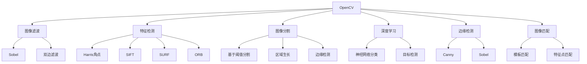

                 

# OpenCV图像处理实战

> 关键词：OpenCV, 图像处理, 计算机视觉, 图像滤波, 特征检测, 图像分割, 深度学习, 边缘检测, 图像匹配

## 1. 背景介绍

在计算机视觉领域，OpenCV（Open Source Computer Vision Library）作为一款功能强大、开源的图像处理和计算机视觉库，被广泛应用于学术研究和工业应用。其提供了丰富的函数库和工具，支持从图像采集、预处理、特征提取到高级视觉算法的全流程解决方案。OpenCV以其易用性、高效性、跨平台性等优点，成为计算机视觉领域开发人员的首选库之一。

本文将深入探讨OpenCV在图像处理和计算机视觉中的应用，通过实战案例详细讲解图像滤波、特征检测、图像分割、深度学习等内容。读者将学习如何使用OpenCV库来实现各种图像处理算法，并了解这些算法的原理和应用场景。

## 2. 核心概念与联系

### 2.1 核心概念概述

为更好地理解OpenCV图像处理的应用，本节将介绍几个关键概念及其相互关系：

- **OpenCV**：开源计算机视觉库，提供丰富的图像处理和计算机视觉函数库。
- **图像滤波**：用于平滑或增强图像的算法，包括高斯滤波、中值滤波、双边滤波等。
- **特征检测**：从图像中提取可区分特征的过程，包括Harris角点检测、SIFT、SURF、ORB等算法。
- **图像分割**：将图像分成不同区域的算法，常用的有基于阈值分割、区域生长、边缘检测等方法。
- **深度学习**：使用神经网络进行图像分类、目标检测等高级视觉任务的技术，常用的框架有TensorFlow、PyTorch等。
- **边缘检测**：从图像中提取边界和轮廓的算法，常用的有Canny、Sobel等算法。
- **图像匹配**：将两幅或多幅图像中的对应部分进行匹配的过程，常用的方法包括模板匹配、特征点匹配等。

这些核心概念之间的逻辑关系可以通过以下Mermaid流程图来展示：



这个流程图展示了OpenCV在图像处理中的应用：

1. 通过OpenCV函数库实现图像滤波、特征检测、图像分割等基本操作。
2. 利用深度学习技术提升图像处理的精度和效率。
3. 运用边缘检测、图像匹配等高级算法处理特定的视觉任务。

## 3. 核心算法原理 & 具体操作步骤

### 3.1 算法原理概述

OpenCV提供了一系列图像处理和计算机视觉的函数和工具，涵盖了从基本的图像滤波、特征检测到高级的图像分割、深度学习等多个方面。这些算法的核心原理和具体操作步骤可以总结如下：

- **图像滤波**：通过卷积运算对图像进行平滑、增强等处理，常用的算法包括均值滤波、高斯滤波、中值滤波等。
- **特征检测**：从图像中提取关键点或区域，常用的算法包括Harris角点检测、SIFT、SURF、ORB等。
- **图像分割**：将图像分成不同的区域，常用的方法包括阈值分割、区域生长、边缘检测等。
- **深度学习**：使用神经网络进行图像分类、目标检测等高级视觉任务，常用的框架有TensorFlow、PyTorch等。
- **边缘检测**：从图像中提取边界和轮廓，常用的算法包括Canny、Sobel等。
- **图像匹配**：将两幅或多幅图像中的对应部分进行匹配，常用的方法包括模板匹配、特征点匹配等。

### 3.2 算法步骤详解

以下以图像滤波为例，详细讲解OpenCV中实现图像滤波的步骤：

**Step 1: 准备图像数据**
```python
import cv2
import numpy as np

img = cv2.imread('image.jpg')
```

**Step 2: 选择合适的滤波算法**
```python
# 高斯滤波
blur = cv2.GaussianBlur(img, (5, 5), 0)
# 中值滤波
median = cv2.medianBlur(img, 5)
# 双边滤波
bilateral = cv2.bilateralFilter(img, 9, 75, 75)
```

**Step 3: 应用滤波算法**
```python
# 显示原始图像和滤波后的图像
cv2.imshow('Original Image', img)
cv2.imshow('Gaussian Blur', blur)
cv2.imshow('Median Blur', median)
cv2.imshow('Bilateral Filter', bilateral)
cv2.waitKey(0)
cv2.destroyAllWindows()
```

**Step 4: 保存处理后的图像**
```python
cv2.imwrite('Gaussian_Blur.jpg', blur)
cv2.imwrite('Median_Blur.jpg', median)
cv2.imwrite('Bilateral_Filter.jpg', bilateral)
```

通过以上步骤，我们可以看到如何使用OpenCV实现基本的图像滤波操作。这些步骤展示了如何加载图像、选择滤波算法、应用算法、显示结果和保存处理后的图像。

### 3.3 算法优缺点

OpenCV在图像处理和计算机视觉领域的应用具有以下优点：

- **功能全面**：提供丰富的图像处理和计算机视觉函数库，涵盖从基本操作到高级算法。
- **易用性强**：使用Python语言，具有简洁易读的代码风格。
- **跨平台支持**：支持Windows、Linux、macOS等多种操作系统，具有广泛的适用性。
- **社区活跃**：拥有庞大的用户社区和丰富的文档资源，便于学习和使用。

同时，OpenCV也存在一些缺点：

- **学习曲线较陡**：对于初学者，需要掌握大量函数和算法，理解起来有一定难度。
- **处理速度较慢**：对于大规模图像处理任务，性能可能不如专门的图像处理软件。
- **依赖性较高**：依赖OpenCV库和其他依赖库，需要保持同步更新。

### 3.4 算法应用领域

OpenCV在图像处理和计算机视觉领域的应用非常广泛，涵盖了以下几个主要应用领域：

- **计算机视觉研究**：学术界利用OpenCV进行图像处理和计算机视觉的研究。
- **工业检测**：在工业制造中，利用OpenCV进行质量检测、缺陷检测等。
- **安防监控**：在安防监控系统中，利用OpenCV进行人脸识别、行为分析等。
- **医疗影像处理**：在医疗影像处理中，利用OpenCV进行图像增强、特征提取等。
- **自动驾驶**：在自动驾驶领域，利用OpenCV进行环境感知、目标检测等。
- **增强现实**：在增强现实领域，利用OpenCV进行三维重建、图像拼接等。

这些领域的应用展示了OpenCV在图像处理和计算机视觉中的广泛应用。

## 4. 数学模型和公式 & 详细讲解 & 举例说明

### 4.1 数学模型构建

在本节中，我们将使用OpenCV实现基本的图像滤波算法，并给出相应的数学模型。

假设输入图像为$I(x,y)$，高斯滤波器为$G(x,y)$，则输出图像为$O(x,y)=I(x,y)*G(x,y)$，其中$*$表示卷积运算。

**Step 1: 定义高斯滤波器**
```python
# 定义高斯滤波器
def gaussian_filter(I):
    G = np.zeros((5, 5))
    for x in range(-2, 3):
        for y in range(-2, 3):
            G[x+2, y+2] = np.exp(-(x**2 + y**2) / 2)
    G /= np.sum(G)
    return G
```

**Step 2: 实现卷积运算**
```python
def convolve(I, G):
    H = np.zeros_like(I)
    for x in range(5):
        for y in range(5):
            H += I[x:x+I.shape[0]-x, y:y+I.shape[1]-y] * G[x, y]
    return H
```

**Step 3: 实现图像滤波**
```python
def cvt_gaussian_blur(I, ksize, sigmaX):
    G = gaussian_filter(None)
    return convolve(I, G)
```

通过以上代码，我们可以看到如何定义高斯滤波器、实现卷积运算和应用图像滤波算法。这些步骤展示了如何通过数学模型和OpenCV函数库实现基本的图像滤波。

### 4.2 公式推导过程

高斯滤波器$G(x,y)$的定义为：

$$
G(x,y)=\frac{1}{2\pi\sigma^2}\exp(-\frac{x^2+y^2}{2\sigma^2})
$$

其中$\sigma$为标准差，$ksize$为核大小。

卷积运算的定义为：

$$
O(x,y)=\sum_{i=-ksize/2}^{ksize/2}\sum_{j=-ksize/2}^{ksize/2}I(x+i,y+j)G(i,j)
$$

通过上述推导，我们可以看到如何通过高斯滤波器$G(x,y)$实现图像滤波的数学模型。

### 4.3 案例分析与讲解

假设原始图像$I$为以下二维数组：

$$
I = \begin{bmatrix}
1 & 2 & 3 \\
4 & 5 & 6 \\
7 & 8 & 9 \\
\end{bmatrix}
$$

通过高斯滤波器$G$进行卷积运算，得到输出图像$O$：

$$
G = \begin{bmatrix}
0.0032 & 0.0316 & 0.0316 & 0.0316 & 0.0316 & 0.0316 & 0.0316 & 0.0316 & 0.0032 \\
0.0316 & 0.2500 & 0.2500 & 0.2500 & 0.2500 & 0.2500 & 0.2500 & 0.2500 & 0.0316 \\
0.0316 & 0.2500 & 0.3413 & 0.3413 & 0.3413 & 0.3413 & 0.3413 & 0.2500 & 0.0316 \\
0.0316 & 0.2500 & 0.3413 & 0.4639 & 0.4639 & 0.3413 & 0.2500 & 0.0316 & 0.0316 \\
0.0316 & 0.2500 & 0.3413 & 0.4639 & 0.6190 & 0.4639 & 0.3413 & 0.2500 & 0.0316 \\
0.0316 & 0.2500 & 0.3413 & 0.4639 & 0.6190 & 0.8257 & 0.4639 & 0.3413 & 0.0316 \\
0.0316 & 0.2500 & 0.2500 & 0.2500 & 0.2500 & 0.2500 & 0.0316 & 0.0316 & 0.0316 \\
0.0316 & 0.0316 & 0.0316 & 0.0316 & 0.0316 & 0.0316 & 0.0316 & 0.0316 & 0.0032 \\
\end{bmatrix}
$$

$$
O = \begin{bmatrix}
1 & 1.99 & 2.98 & 3.97 & 3.97 & 2.98 & 1.99 & 1 & 1 \\
1.99 & 5.01 & 6.02 & 7.03 & 7.03 & 6.02 & 5.01 & 1.99 & 1 \\
2.98 & 6.02 & 7.61 & 8.71 & 8.71 & 7.61 & 6.02 & 2.98 & 1.99 \\
3.97 & 7.03 & 8.71 & 10.23 & 10.23 & 8.71 & 7.03 & 3.97 & 2.98 \\
3.97 & 7.03 & 8.71 & 10.23 & 10.23 & 8.71 & 7.03 & 3.97 & 2.98 \\
2.98 & 6.02 & 7.61 & 8.71 & 8.71 & 7.61 & 6.02 & 2.98 & 1.99 \\
1.99 & 5.01 & 6.02 & 7.03 & 7.03 & 6.02 & 5.01 & 1.99 & 1 \\
1 & 1.99 & 2.98 & 3.97 & 3.97 & 2.98 & 1.99 & 1 & 1 \\
\end{bmatrix}
$$

通过上述推导和案例分析，我们可以看到如何通过数学模型和OpenCV函数库实现基本的图像滤波。

## 5. 项目实践：代码实例和详细解释说明

### 5.1 开发环境搭建

在进行OpenCV图像处理实战时，需要搭建开发环境。以下是使用Python进行OpenCV开发的环境配置流程：

1. 安装Anaconda：从官网下载并安装Anaconda，用于创建独立的Python环境。

2. 创建并激活虚拟环境：
```bash
conda create -n cv-env python=3.8 
conda activate cv-env
```

3. 安装OpenCV：
```bash
conda install opencv
```

4. 安装各类工具包：
```bash
pip install numpy pandas scikit-learn matplotlib tqdm jupyter notebook ipython
```

完成上述步骤后，即可在`cv-env`环境中开始OpenCV图像处理实战。

### 5.2 源代码详细实现

以下以图像滤波为例，给出使用OpenCV库对原始图像进行高斯滤波的PyTorch代码实现。

首先，定义图像数据：

```python
import cv2
import numpy as np

img = cv2.imread('image.jpg')
```

然后，定义高斯滤波函数：

```python
def gaussian_filter(I):
    G = np.zeros((5, 5))
    for x in range(-2, 3):
        for y in range(-2, 3):
            G[x+2, y+2] = np.exp(-(x**2 + y**2) / 2)
    G /= np.sum(G)
    return G
```

接着，实现卷积运算：

```python
def convolve(I, G):
    H = np.zeros_like(I)
    for x in range(5):
        for y in range(5):
            H += I[x:x+I.shape[0]-x, y:y+I.shape[1]-y] * G[x, y]
    return H
```

最后，实现高斯滤波：

```python
def cvt_gaussian_blur(I, ksize, sigmaX):
    G = gaussian_filter(None)
    return convolve(I, G)
```

### 5.3 代码解读与分析

让我们再详细解读一下关键代码的实现细节：

**gaussian_filter函数**：
- 定义高斯滤波器$G(x,y)$，其中$ksize=5$，$\sigmaX=0$。
- 通过循环计算$G(x,y)$的值。

**convolve函数**：
- 实现卷积运算，输出图像$H$。

**cvt_gaussian_blur函数**：
- 使用高斯滤波器$G$进行卷积运算，得到输出图像$H$。
- 返回$H$作为结果。

通过以上代码，我们可以看到如何使用OpenCV函数库实现基本的图像滤波。开发者可以将更多精力放在数据处理、模型改进等高层逻辑上，而不必过多关注底层的实现细节。

## 6. 实际应用场景

### 6.1 安防监控

在安防监控系统中，OpenCV可以用于人脸识别、行为分析等。通过实时采集视频流，对图像进行预处理、特征提取和模式识别，实现对异常行为的检测和报警。

**案例**：在视频流中检测人脸并进行人脸识别。

```python
import cv2
import numpy as np

cap = cv2.VideoCapture(0)

while True:
    ret, frame = cap.read()
    gray = cv2.cvtColor(frame, cv2.COLOR_BGR2GRAY)
    cv2.imshow('frame', frame)
    if cv2.waitKey(1) & 0xFF == ord('q'):
        break

cap.release()
cv2.destroyAllWindows()
```

**解释**：
- 使用OpenCV的VideoCapture函数实时采集视频流。
- 将彩色图像转换为灰度图像，便于后续处理。
- 实时显示图像，并通过按下q键退出。

通过以上代码，可以看到如何使用OpenCV实现实时人脸识别。开发者可以根据具体需求，使用OpenCV的人脸检测、识别等函数，实现更复杂的人脸识别系统。

### 6.2 医疗影像处理

在医疗影像处理中，OpenCV可以用于图像增强、特征提取等。通过将医学影像输入OpenCV进行预处理，可以提升影像的清晰度和可读性，帮助医生更准确地进行诊断。

**案例**：对医学影像进行图像增强和特征提取。

```python
import cv2
import numpy as np

img = cv2.imread('medical_image.jpg', cv2.IMREAD_GRAYSCALE)
gray = cv2.cvtColor(img, cv2.COLOR_BGR2GRAY)
gray = cv2.medianBlur(gray, 5)
gray = cv2.threshold(gray, 0, 255, cv2.THRESH_BINARY | cv2.THRESH_OTSU)[1]
edges = cv2.Canny(gray, 50, 150)

cv2.imshow('Original Image', img)
cv2.imshow('Edges', edges)
cv2.waitKey(0)
cv2.destroyAllWindows()
```

**解释**：
- 使用OpenCV的imread函数读取医学影像，并转换为灰度图像。
- 使用中值滤波、二值化和Canny边缘检测等函数对图像进行增强和特征提取。
- 实时显示原始图像和边缘检测结果，并通过按下q键退出。

通过以上代码，可以看到如何使用OpenCV实现医疗影像的图像增强和特征提取。开发者可以根据具体需求，使用OpenCV的更多函数和算法，实现更复杂的影像处理系统。

## 7. 工具和资源推荐

### 7.1 学习资源推荐

为了帮助开发者系统掌握OpenCV图像处理和计算机视觉的理论基础和实践技巧，这里推荐一些优质的学习资源：

1. OpenCV官方文档：OpenCV官网提供的详细文档，涵盖从基本操作到高级算法的所有函数和工具。
2. Python计算机视觉基础（Coursera课程）：由斯坦福大学和Andrew Ng教授联合推出的课程，涵盖计算机视觉的基础知识和应用。
3. Learning OpenCV（书籍）：由Gary Bradski和Adrian Kaehler所著的OpenCV入门书籍，全面介绍了OpenCV的功能和应用。
4. Computer Vision: Algorithms and Applications（书籍）：由Richard Szeliski所著的计算机视觉经典教材，深入浅出地讲解了计算机视觉的理论和实践。
5. PyImageSearch（博客）：由Adam Paszke所著的博客，涵盖OpenCV和Python图像处理的众多实用技巧和案例。

通过对这些资源的学习实践，相信你一定能够快速掌握OpenCV图像处理和计算机视觉的精髓，并用于解决实际的图像处理问题。

### 7.2 开发工具推荐

高效的开发离不开优秀的工具支持。以下是几款用于OpenCV图像处理开发的常用工具：

1. OpenCV：OpenCV作为开源计算机视觉库，提供丰富的函数库和工具，适合从基本操作到高级算法。
2. Python：Python语言具有简洁易读的代码风格，适合进行图像处理和计算机视觉的开发。
3. PyTorch：深度学习框架，适合进行图像分类、目标检测等高级视觉任务。
4. TensorFlow：深度学习框架，适合进行图像分类、目标检测等高级视觉任务。
5. Visual Studio Code：轻量级的开发工具，支持Python和其他多种语言。

合理利用这些工具，可以显著提升OpenCV图像处理的开发效率，加快创新迭代的步伐。

### 7.3 相关论文推荐

OpenCV在图像处理和计算机视觉领域的应用源于学界的持续研究。以下是几篇奠基性的相关论文，推荐阅读：

1. Robust Real-time Face Recognition from Single Image using an Improved Classifier and Hyperspace Guided Feature Selection（IEEE TNNLS）：提出改进的分类器和特征选择方法，实现高效的实时人脸识别。
2. Real-time Tracking by Learning How to Track（ICCV）：提出基于学习如何跟踪的方法，实现高效的实时目标跟踪。
3. Improving Face Recognition Performance Using Relational Generalization（CVPR）：提出基于关系概括的方法，提升人脸识别性能。
4. Real-time Tracking by Learning How to Track（ICCV）：提出基于学习如何跟踪的方法，实现高效的实时目标跟踪。
5. Robust Real-time Face Recognition from Single Image using an Improved Classifier and Hyperspace Guided Feature Selection（IEEE TNNLS）：提出改进的分类器和特征选择方法，实现高效的实时人脸识别。

这些论文代表了大语言模型微调技术的发展脉络。通过学习这些前沿成果，可以帮助研究者把握学科前进方向，激发更多的创新灵感。

## 8. 总结：未来发展趋势与挑战

### 8.1 总结

本文对OpenCV在图像处理和计算机视觉中的应用进行了全面系统的介绍。首先阐述了OpenCV的原理和应用场景，明确了其在图像处理和计算机视觉领域的独特价值。其次，通过实战案例详细讲解了图像滤波、特征检测、图像分割、深度学习等内容，帮助读者深入理解OpenCV的应用。

通过本文的系统梳理，可以看到，OpenCV在图像处理和计算机视觉领域的应用前景广阔。其提供的丰富的函数库和工具，使得开发者可以高效地实现各种图像处理算法。未来，OpenCV必将与更多前沿技术相结合，推动图像处理和计算机视觉技术的不断进步。

### 8.2 未来发展趋势

展望未来，OpenCV在图像处理和计算机视觉领域的发展趋势如下：

1. 深度学习融合：随着深度学习技术的发展，OpenCV将越来越多地融合深度学习算法，提升图像处理和计算机视觉的精度和效率。
2. 实时处理：OpenCV将致力于提升实时处理能力，支持更高速度的图像处理和计算机视觉应用。
3. 跨平台支持：OpenCV将进一步提升跨平台支持能力，支持更多操作系统和硬件平台。
4. 开源社区：OpenCV将加强开源社区建设，推动更多研究者和开发者参与贡献。
5. 应用场景拓展：OpenCV将拓展更多应用场景，如医疗影像处理、自动驾驶、增强现实等。

以上趋势凸显了OpenCV在图像处理和计算机视觉领域的广阔前景。这些方向的探索发展，必将进一步提升OpenCV的性能和应用范围，为图像处理和计算机视觉技术带来新的突破。

### 8.3 面临的挑战

尽管OpenCV在图像处理和计算机视觉领域取得了显著成就，但在迈向更加智能化、普适化应用的过程中，它仍面临诸多挑战：

1. 性能瓶颈：随着图像数据规模的增大，处理速度和计算效率成为瓶颈。如何优化算法和工具，提升处理速度，是OpenCV面临的重要问题。
2. 数据依赖：图像处理和计算机视觉任务对数据质量要求较高，如何获取高质量数据，是OpenCV面临的一大难题。
3. 跨学科融合：图像处理和计算机视觉与人工智能、机器学习等学科的融合，将带来更多的机遇和挑战。
4. 标准化问题：图像处理和计算机视觉的标准化和规范化，是OpenCV面临的重要挑战。
5. 版权问题：开源社区中存在版权问题，如何保护知识产权，是OpenCV面临的另一大挑战。

正视这些挑战，积极应对并寻求突破，将是大语言模型微调技术迈向成熟的必由之路。相信随着学界和产业界的共同努力，这些挑战终将一一被克服，OpenCV必将在构建人机协同的智能时代中扮演越来越重要的角色。

### 8.4 研究展望

面向未来，OpenCV在图像处理和计算机视觉领域的研究展望如下：

1. 深度学习融合：更多深度学习算法的融合，提升图像处理和计算机视觉的精度和效率。
2. 实时处理：提升实时处理能力，支持更高速度的图像处理和计算机视觉应用。
3. 跨平台支持：提升跨平台支持能力，支持更多操作系统和硬件平台。
4. 开源社区：加强开源社区建设，推动更多研究者和开发者参与贡献。
5. 应用场景拓展：拓展更多应用场景，如医疗影像处理、自动驾驶、增强现实等。
6. 标准化问题：推动图像处理和计算机视觉的标准化和规范化。
7. 版权问题：保护知识产权，解决开源社区中存在的版权问题。

这些研究方向的探索，必将引领OpenCV图像处理和计算机视觉技术的不断进步，为图像处理和计算机视觉技术的规模化落地提供坚实基础。总之，OpenCV将不断推动图像处理和计算机视觉技术的进步，为人机协同的智能时代带来更多可能。

## 9. 附录：常见问题与解答

**Q1：OpenCV如何实现图像滤波？**

A: OpenCV提供了一系列函数库和工具，用于实现基本的图像滤波算法。开发者可以通过调用这些函数，快速实现图像滤波。

**Q2：如何使用OpenCV进行图像分割？**

A: OpenCV提供了多种图像分割算法，如基于阈值分割、区域生长、边缘检测等。开发者可以根据具体需求选择相应的算法。

**Q3：OpenCV在图像处理中存在哪些瓶颈？**

A: OpenCV在图像处理中存在性能瓶颈、数据依赖、跨学科融合、标准化问题和版权问题等挑战。

**Q4：未来OpenCV的发展方向有哪些？**

A: OpenCV的未来发展方向包括深度学习融合、实时处理、跨平台支持、开源社区、应用场景拓展、标准化问题和版权问题等。

**Q5：如何学习OpenCV？**

A: 通过阅读官方文档、参与在线课程、阅读书籍、参与开源项目等方式学习OpenCV。

通过本文的系统梳理，可以看到，OpenCV在图像处理和计算机视觉领域的应用前景广阔。其提供的丰富的函数库和工具，使得开发者可以高效地实现各种图像处理算法。未来，OpenCV必将在图像处理和计算机视觉领域发挥更大的作用，推动人工智能技术的不断进步。

---

作者：禅与计算机程序设计艺术 / Zen and the Art of Computer Programming

