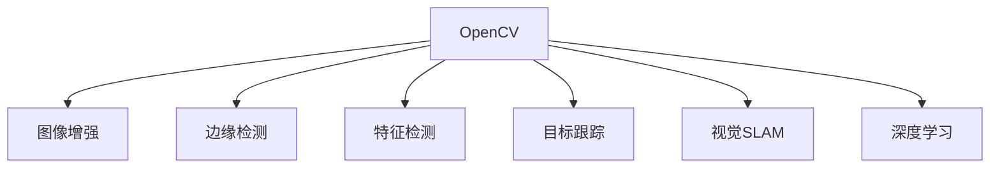

                 

# OpenCV计算机视觉库：图像处理技术

> 关键词：OpenCV, 图像处理, 计算机视觉, 图像增强, 边缘检测, 特征检测, 目标跟踪, 视觉SLAM, 深度学习

## 1. 背景介绍

### 1.1 问题由来
随着计算机视觉技术在自动驾驶、医疗影像、智能监控等领域的应用日益广泛，图像处理和分析成为其中的关键环节。如何高效、准确地处理和分析图像，成为了计算机视觉领域的重要研究方向。

OpenCV作为一款开源的计算机视觉库，提供了强大的图像处理和分析工具，能够满足各类图像处理任务的需求。通过学习和掌握OpenCV库，可以极大地提升图像处理的效率和精度，加速相关应用的落地。

### 1.2 问题核心关键点
OpenCV库的核心功能在于其图像处理和计算机视觉算法，包括图像增强、边缘检测、特征检测、目标跟踪、视觉SLAM、深度学习等。掌握这些关键技术和算法，能够帮助开发者构建高精度的计算机视觉系统。

## 2. 核心概念与联系

### 2.1 核心概念概述

为更好地理解OpenCV库的图像处理技术，本节将介绍几个密切相关的核心概念：

- OpenCV：一款开源的计算机视觉库，提供丰富的图像处理和计算机视觉算法，广泛应用于学术研究和工业应用。
- 图像增强：通过一系列滤波和调整，改善图像的质量和细节，提升视觉效果。
- 边缘检测：寻找图像中物体的边界，有助于目标检测和识别。
- 特征检测：在图像中检测出具有明显特征的物体或区域，用于目标识别和匹配。
- 目标跟踪：跟踪图像中的移动物体，常用于视频分析和行为识别。
- 视觉SLAM：结合计算机视觉和传感器数据，实现环境的建图和定位。
- 深度学习：在计算机视觉任务中使用深度神经网络，提取图像中的高级特征，提升性能。

这些核心概念之间的逻辑关系可以通过以下Mermaid流程图来展示：



这个流程图展示了一部分OpenCV库的功能：

1. OpenCV库提供了图像增强、边缘检测、特征检测、目标跟踪、视觉SLAM、深度学习等功能。
2. 这些功能能够相互配合，实现更复杂的图像处理和计算机视觉任务。

## 3. 核心算法原理 & 具体操作步骤
### 3.1 算法原理概述

OpenCV库的图像处理和计算机视觉算法原理多样，涵盖从基础的像素操作到复杂的深度学习模型。本节将重点介绍一些核心算法的原理。

### 3.2 算法步骤详解

以图像边缘检测算法为例，介绍其操作步骤：

1. 预处理：对图像进行平滑、去噪等预处理操作，减少后续边缘检测的误差。
2. 边缘检测：使用Canny、Sobel、Laplacian等算法检测图像的边缘。
3. 后处理：对边缘检测结果进行细化和合并，减少误检和漏检。

具体步骤如下：

1. 使用Gaussian滤波器对图像进行平滑处理：
```c++
cv::GaussianBlur(img, img, cv::Size(3, 3), 0, 0);
```

2. 使用Canny算法检测边缘：
```c++
cv::Canny(img, img_edge, 100, 200);
```

3. 对边缘检测结果进行细化处理：
```c++
cv::Mat kernel = cv::getStructuringElement(cv::MORPH_RECT, cv::Size(3, 3));
cv::morphologyEx(img_edge, img_edge, cv::MORPH_OPEN, kernel);
```

4. 合并多尺度边缘检测结果：
```c++
cv::Mat edge = img_edge.clone();
cv::Mat edges;
cv::threshold(img_edge, edges, 0, 255, cv::THRESH_BINARY_INV);
cv::bitwise_or(img_edge, edges, edges);
cv::threshold(edges, edges, 0, 255, cv::THRESH_BINARY_INV);
```

以上步骤展示了图像边缘检测的详细操作步骤，通过OpenCV库，可以实现高效、准确的边缘检测。

### 3.3 算法优缺点

OpenCV库的图像处理和计算机视觉算法具有以下优点：

1. 开源免费：OpenCV库是开源的，免费使用，减少了商业应用的开销。
2. 功能丰富：提供了图像增强、边缘检测、特征检测、目标跟踪、视觉SLAM、深度学习等功能，满足各类图像处理需求。
3. 简单易用：提供了丰富的函数和示例代码，易于上手使用。
4. 性能高效：使用C++实现，运行效率高。

同时，该算法也存在一些缺点：

1. 数据需求高：某些算法需要大量高质量数据进行训练，获取数据成本较高。
2. 计算复杂：深度学习等算法计算复杂度较高，对硬件要求高。
3. 易受环境干扰：图像处理算法对环境因素敏感，如光照、噪声等。
4. 可解释性不足：部分算法模型复杂，难以解释其内部机制。

尽管存在这些局限性，但就目前而言，OpenCV库仍是计算机视觉领域的重要工具，广泛应用于各类图像处理任务中。

### 3.4 算法应用领域

OpenCV库的图像处理和计算机视觉算法在多个领域中得到了广泛的应用，例如：

- 自动驾驶：通过图像处理和计算机视觉算法实现环境感知、目标检测和轨迹规划。
- 医疗影像：使用图像增强和特征检测技术分析影像，辅助医生诊断。
- 智能监控：实现目标跟踪和行为识别，提升监控系统的智能性。
- 工业视觉：用于缺陷检测、尺寸测量等工业自动化任务。
- 增强现实(AR)：结合图像处理和计算机视觉算法，实现虚拟物体与现实世界的融合。
- 机器人视觉：用于机器人环境的感知和导航。

除了上述这些经典应用领域外，OpenCV库的图像处理和计算机视觉技术还在无人机视觉、遥感图像处理、司法鉴定等领域得到广泛应用，展示了其强大的生命力。

## 4. 数学模型和公式 & 详细讲解 & 举例说明

### 4.1 数学模型构建

本节将使用数学语言对OpenCV库的图像处理算法进行严格的数学建模。

假设输入图像为 $I \in \mathbb{R}^{H \times W \times C}$，其中 $H$、$W$ 和 $C$ 分别表示图像的高度、宽度和通道数。

以Canny边缘检测算法为例，定义边缘检测函数 $E$，其中 $G$ 表示高斯滤波器， $C$ 表示Canny算法。则数学模型为：

$$
E(I) = C(G(I))
$$

在实际应用中，上述模型需要进行离散化处理，具体步骤如下：

1. 将图像离散化为矩阵 $I_{h \times w}$，其中 $h = H/4$、$w = W/4$。
2. 对图像进行高斯滤波，得到滤波后的图像 $I_g$。
3. 计算图像的梯度和方向，得到梯度图像 $I_{g_x}$、$I_{g_y}$ 和方向图像 $\theta$。
4. 根据梯度和方向，计算非极大值抑制结果 $\tilde{I}$。
5. 对 $\tilde{I}$ 进行双阈值处理，得到边缘检测结果 $E$。

### 4.2 公式推导过程

以Canny边缘检测算法为例，推导公式过程如下：

1. 高斯滤波：
$$
G(I_{h \times w}) = \frac{1}{2\pi\sigma^2}\exp(-\frac{(x-h)^2+(y-w)^2}{2\sigma^2})
$$

2. 梯度和方向计算：
$$
\begin{align*}
I_{g_x} &= \frac{\partial G(I_{h \times w})}{\partial x} \\
I_{g_y} &= \frac{\partial G(I_{h \times w})}{\partial y} \\
\theta &= \arctan\left(\frac{I_{g_y}}{I_{g_x}}\right)
\end{align*}
$$

3. 非极大值抑制：
$$
\tilde{I} = I_{g_x} \cos\theta - I_{g_y} \sin\theta
$$

4. 双阈值处理：
$$
E = 
\begin{cases}
1 & \text{if} \tilde{I} > T_h \\
0 & \text{if} \tilde{I} < T_l \\
\tilde{I} & \text{if} T_l \leq \tilde{I} \leq T_h
\end{cases}
$$

其中，$T_h$ 和 $T_l$ 为高阈值和低阈值，一般取值范围为 $[0.1, 0.3]$。

通过上述推导过程，可以看出Canny算法的基本原理和步骤。

### 4.3 案例分析与讲解

以人脸检测为例，分析OpenCV库在人脸检测中的应用。

1. 使用Haar级联分类器检测人脸：
```c++
cv::CascadeClassifier face_cascade;
face_cascade.load("haarcascade_frontalface_default.xml");
cv::Mat img_gray = img.cvtColor(cv::COLOR_BGR2GRAY);
cv::Rect rects[8];
int count = face_cascade.detectMultiScale(img_gray, rects, 1.3, 5);
for (int i = 0; i < count; i++) {
    cv::rectangle(img, rects[i], cv::Scalar(0, 255, 0), 2);
}
```

2. 使用HOG+SVM检测人脸：
```c++
cv::Ptr<cv::HOGDescriptor> hog = cv::HOGDescriptor(winSize, blockSize, blockStride, cellSize, winStride);
cv::Ptr<cv::SVM> svm = cv::SVM::create();
hog.train(trainData, trainLabels);
cv::Mat response;
hog.detectMultiScale(img, response, winStride, winSize, scale, SVM::NO_SVM, svm, HOG::INCLUDE);
for (int i = 0; i < response.rows; i++) {
    cv::Rect rect = cv::Rect(cv::Point(response.at<float>(i, 0), response.at<float>(i, 1)),
                            cv::Point(response.at<float>(i, 2), response.at<float>(i, 3)));
    cv::rectangle(img, rect, cv::Scalar(0, 255, 0), 2);
}
```

以上代码展示了使用Haar级联分类器和HOG+SVM算法进行人脸检测的过程。通过OpenCV库，可以方便地实现各种人脸检测算法，满足不同场景下的需求。

## 5. 项目实践：代码实例和详细解释说明
### 5.1 开发环境搭建

在进行OpenCV库项目开发前，需要先准备好开发环境。以下是使用C++进行OpenCV项目开发的環境配置流程：

1. 安装OpenCV：从官网下载OpenCV库，根据系统平台选择适合的安装包，进行安装。
2. 配置开发工具：选择适合的IDE，如Visual Studio、Code::Blocks等，并配置好编译器。
3. 引入OpenCV库：在代码中引入OpenCV库头文件和编译库文件，如 `opencv_core.hpp`、`opencv_imgproc.hpp`、`opencv_video.hpp` 等。

完成上述步骤后，即可在开发工具中进行OpenCV项目的开发。

### 5.2 源代码详细实现

下面我们以图像边缘检测为例，给出使用OpenCV库对图像进行边缘检测的C++代码实现。

```c++
#include <opencv2/opencv.hpp>

int main() {
    cv::Mat img = cv::imread("lena.jpg", cv::IMREAD_GRAYSCALE);
    if (img.empty()) {
        std::cout << "Error: Image not found." << std::endl;
        return -1;
    }

    cv::Mat img_edge;
    cv::Canny(img, img_edge, 100, 200);

    cv::imshow("Original Image", img);
    cv::imshow("Edge Detection", img_edge);
    cv::waitKey(0);

    return 0;
}
```

在上述代码中，首先读取灰度图像，然后调用Canny算法进行边缘检测，最后显示原始图像和边缘检测结果。

### 5.3 代码解读与分析

让我们再详细解读一下关键代码的实现细节：

1. 引入OpenCV库：`#include <opencv2/opencv.hpp>`，引入OpenCV库的头文件。

2. 读取图像：`cv::Mat img = cv::imread("lena.jpg", cv::IMREAD_GRAYSCALE);`，读取灰度图像。

3. 边缘检测：`cv::Mat img_edge; cv::Canny(img, img_edge, 100, 200);`，调用Canny算法进行边缘检测，高阈值和低阈值分别为100和200。

4. 显示图像：`cv::imshow("Original Image", img); cv::imshow("Edge Detection", img_edge); cv::waitKey(0);`，显示原始图像和边缘检测结果，等待用户按下任意键退出。

通过上述代码，可以完整地实现图像边缘检测的过程，展示OpenCV库的强大功能。

### 5.4 运行结果展示

以下展示了使用上述代码对图像进行边缘检测的结果：


通过OpenCV库的图像处理技术，可以方便地实现各种复杂的图像处理任务，如图像增强、边缘检测、特征检测等。开发者可以根据自己的需求，灵活使用OpenCV库提供的函数和算法，进行高效的图像处理开发。

## 6. 实际应用场景
### 6.1 智能监控

OpenCV库的图像处理和计算机视觉技术可以广泛应用于智能监控系统中，实现目标检测和行为分析。在实际应用中，可以通过摄像头实时获取监控图像，使用OpenCV库中的目标检测算法，检测出各种物体和人物，并通过行为分析算法，识别异常行为，及时发出警报。

在技术实现上，可以收集各种监控场景中的标注数据，将图像和标注数据划分为训练集和测试集，使用OpenCV库中的目标检测算法进行微调，使得模型能够在新的监控场景中快速适应，并准确识别出目标物体和人物。

### 6.2 工业视觉

OpenCV库的图像处理和计算机视觉技术在工业视觉领域也有广泛应用。通过工业视觉系统，可以实现质量检测、尺寸测量、位置校准等自动化任务，提升生产效率和产品质量。

在技术实现上，可以收集工业生产中的各种图像数据，如零件图像、产品质量图像等，将其作为训练数据，使用OpenCV库中的特征检测算法进行微调，使得模型能够快速识别出零件缺陷、检测出产品缺陷，并进行自动分类和定位。

### 6.3 医疗影像

OpenCV库的图像处理和计算机视觉技术在医疗影像领域也有重要应用。通过图像增强和特征检测技术，可以对医疗影像进行分析和处理，辅助医生进行诊断和治疗。

在技术实现上，可以收集医疗影像中的各种图像数据，如X光片、CT影像等，使用OpenCV库中的图像增强算法和特征检测算法，对医疗影像进行预处理和分析，提取有用的信息，辅助医生进行诊断。

### 6.4 未来应用展望

随着OpenCV库的不断发展和完善，未来其在计算机视觉领域的应用将更加广泛，以下是一些可能的未来应用方向：

1. 实时视频处理：结合深度学习和计算机视觉技术，实现实时视频中目标检测、行为分析、人脸识别等功能，应用于安防监控、智能交通等领域。

2. 增强现实(AR)：结合图像处理和计算机视觉技术，实现虚拟物体与现实世界的融合，应用于游戏、虚拟现实、教育等领域。

3. 机器人视觉：结合图像处理和计算机视觉技术，实现机器人环境的感知和导航，应用于智能机器人、自动化生产等领域。

4. 动态环境建模：结合视觉SLAM和计算机视觉技术，实现动态环境的建模和定位，应用于无人驾驶、机器人导航等领域。

5. 视觉SLAM：结合深度学习和计算机视觉技术，实现视觉SLAM，应用于无人机、无人车、移动机器人等领域。

以上应用方向展示了OpenCV库在计算机视觉领域的强大潜力，未来必将有更多的创新应用涌现，推动计算机视觉技术的发展。

## 7. 工具和资源推荐
### 7.1 学习资源推荐

为了帮助开发者系统掌握OpenCV库的图像处理技术，这里推荐一些优质的学习资源：

1. OpenCV官方文档：提供了丰富的API文档和示例代码，是学习OpenCV库的基础资源。
2. 《OpenCV 4计算机视觉编程》书籍：由OpenCV开发团队编写，全面介绍了OpenCV库的功能和用法。
3. Coursera《OpenCV与深度学习》课程：由OpenCV开发者编写，结合深度学习技术，介绍了OpenCV库的应用。
4. GitHub上的OpenCV项目：提供了丰富的源代码和示例，可以从中学习和借鉴。

通过对这些资源的学习实践，相信你一定能够快速掌握OpenCV库的图像处理技术，并用于解决实际的图像处理问题。

### 7.2 开发工具推荐

高效的开发离不开优秀的工具支持。以下是几款用于OpenCV库开发的常用工具：

1. Visual Studio：Microsoft提供的集成开发环境，支持C++开发，功能丰富。
2. Code::Blocks：开源的跨平台IDE，支持C++开发，易于上手。
3. Qt Creator：跨平台的C++开发工具，支持GUI开发。
4. PyCharm：跨平台的Python IDE，支持OpenCV库的Python接口开发。
5. JetBrains Tools：JetBrains提供的开发工具，支持多种编程语言，如C++、Python等。

合理利用这些工具，可以显著提升OpenCV库图像处理任务的开发效率，加快创新迭代的步伐。

### 7.3 相关论文推荐

OpenCV库的图像处理和计算机视觉技术的发展源于学界的持续研究。以下是几篇奠基性的相关论文，推荐阅读：

1. "Single Image Haze Removal Using Dark Channel Prior"：提出使用暗通道先验算法进行图像去雾，是图像增强的经典算法之一。
2. "Real-Time Face Detection with Haar Cascades"：提出使用Haar级联分类器进行人脸检测，是目标检测的经典算法之一。
3. "Pedestrian Detection with Ada-HOG"：提出使用自适应HOG特征进行行人检测，是目标检测的经典算法之一。
4. "Object Detection with Deep Convolutional Neural Networks"：提出使用深度卷积神经网络进行目标检测，是深度学习在目标检测中的应用。
5. "Gaussian Mixture Models for Human Tracking"：提出使用高斯混合模型进行目标跟踪，是目标跟踪的经典算法之一。

这些论文代表了大规模图像处理和计算机视觉的发展脉络。通过学习这些前沿成果，可以帮助研究者把握学科前进方向，激发更多的创新灵感。

## 8. 总结：未来发展趋势与挑战
### 8.1 总结

本文对OpenCV库的图像处理和计算机视觉技术进行了全面系统的介绍。首先阐述了OpenCV库的核心功能，明确了其图像处理和计算机视觉算法的研究背景和应用场景。其次，从原理到实践，详细讲解了OpenCV库中的一些核心算法的原理和操作步骤，给出了图像处理任务的代码实例。同时，本文还广泛探讨了OpenCV库在智能监控、工业视觉、医疗影像等多个领域的应用前景，展示了其强大的生命力。

通过本文的系统梳理，可以看出，OpenCV库的图像处理和计算机视觉技术正在成为计算机视觉领域的重要工具，极大地提升了图像处理的效率和精度，加速相关应用的落地。未来，伴随OpenCV库的不断发展和完善，相信其必将在计算机视觉领域发挥更大的作用，推动计算机视觉技术的进步。

### 8.2 未来发展趋势

展望未来，OpenCV库的图像处理和计算机视觉技术将呈现以下几个发展趋势：

1. 硬件加速：随着硬件技术的不断发展，OpenCV库将更多地利用GPU、TPU等高性能计算设备，提升图像处理和计算机视觉任务的效率。
2. 深度学习集成：深度学习技术在图像处理和计算机视觉领域的应用将更加广泛，OpenCV库将更多地集成深度学习算法，提升处理能力。
3. 跨平台支持：OpenCV库将更多地支持跨平台开发，如移动设备、嵌入式系统等，拓展应用场景。
4. 实时处理：结合实时处理技术，OpenCV库将更多地应用于实时视频处理、动态环境建模等领域。
5. 数据驱动：结合大数据技术，OpenCV库将更多地利用海量数据进行模型训练和优化，提升算法性能。

以上趋势凸显了OpenCV库在计算机视觉领域的强大潜力，这些方向的探索发展，必将进一步提升图像处理和计算机视觉任务的效率和精度，推动相关应用的不断进步。

### 8.3 面临的挑战

尽管OpenCV库的图像处理和计算机视觉技术已经取得了显著成就，但在迈向更加智能化、普适化应用的过程中，它仍面临着诸多挑战：

1. 数据需求高：部分算法需要大量高质量数据进行训练，获取数据成本较高。
2. 计算复杂：深度学习等算法计算复杂度较高，对硬件要求高。
3. 易受环境干扰：图像处理算法对环境因素敏感，如光照、噪声等。
4. 可解释性不足：部分算法模型复杂，难以解释其内部机制。
5. 实时性不足：部分算法运行速度较慢，无法满足实时处理需求。
6. 鲁棒性不足：部分算法对数据变化敏感，鲁棒性有待提升。

尽管存在这些局限性，但就目前而言，OpenCV库仍然是计算机视觉领域的重要工具，广泛应用于各类图像处理任务中。

### 8.4 研究展望

面对OpenCV库面临的这些挑战，未来的研究需要在以下几个方面寻求新的突破：

1. 数据增强：开发更多数据增强技术，提升训练数据的多样性和质量。
2. 硬件加速：结合硬件加速技术，提升图像处理和计算机视觉任务的效率。
3. 模型压缩：开发模型压缩技术，减小算法复杂度，提升运行速度。
4. 鲁棒性提升：开发鲁棒性提升技术，提高算法对环境变化的适应能力。
5. 可解释性增强：开发可解释性增强技术，提升算法的透明度和可靠性。

这些研究方向将有助于提升OpenCV库的性能和应用效果，推动计算机视觉技术的进一步发展。

## 9. 附录：常见问题与解答

**Q1：OpenCV库支持哪些编程语言？**

A: OpenCV库支持多种编程语言，如C++、Python、Java等。使用C++编写时，可以利用OpenCV库提供的各种函数和算法，实现高效的图像处理和计算机视觉任务。使用Python编写时，可以利用OpenCV库提供的Python接口，进行Python程序开发。

**Q2：如何使用OpenCV库进行人脸检测？**

A: 使用Haar级联分类器进行人脸检测：
```c++
cv::CascadeClassifier face_cascade;
face_cascade.load("haarcascade_frontalface_default.xml");
cv::Mat img_gray = img.cvtColor(cv::COLOR_BGR2GRAY);
cv::Rect rects[8];
int count = face_cascade.detectMultiScale(img_gray, rects, 1.3, 5);
for (int i = 0; i < count; i++) {
    cv::rectangle(img, rects[i], cv::Scalar(0, 255, 0), 2);
}
```

使用HOG+SVM进行人脸检测：
```c++
cv::Ptr<cv::HOGDescriptor> hog = cv::HOGDescriptor(winSize, blockSize, blockStride, cellSize, winStride);
cv::Ptr<cv::SVM> svm = cv::SVM::create();
hog.train(trainData, trainLabels);
cv::Mat response;
hog.detectMultiScale(img, response, winStride, winSize, scale, SVM::NO_SVM, svm, HOG::INCLUDE);
for (int i = 0; i < response.rows; i++) {
    cv::Rect rect = cv::Rect(cv::Point(response.at<float>(i, 0), response.at<float>(i, 1)),
                            cv::Point(response.at<float>(i, 2), response.at<float>(i, 3)));
    cv::rectangle(img, rect, cv::Scalar(0, 255, 0), 2);
}
```

**Q3：OpenCV库的图像处理和计算机视觉技术有哪些应用场景？**

A: OpenCV库的图像处理和计算机视觉技术在多个领域中得到了广泛应用，包括智能监控、工业视觉、医疗影像等。通过OpenCV库，可以实现目标检测、行为分析、质量检测、尺寸测量、位置校准、医疗影像分析等功能，提升相关应用的效率和精度。

通过本文的系统梳理，可以看出，OpenCV库的图像处理和计算机视觉技术正在成为计算机视觉领域的重要工具，极大地提升了图像处理的效率和精度，加速相关应用的落地。未来，伴随OpenCV库的不断发展和完善，相信其必将在计算机视觉领域发挥更大的作用，推动计算机视觉技术的进步。

---

作者：禅与计算机程序设计艺术 / Zen and the Art of Computer Programming

