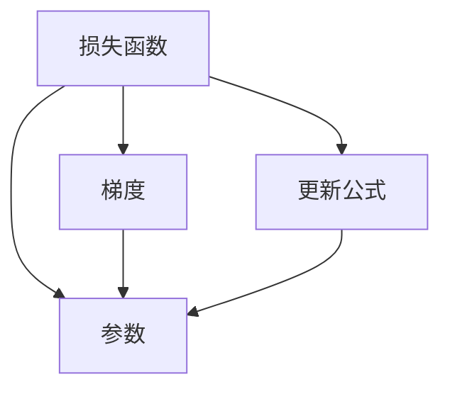

                 

# Optimization Algorithms 原理与代码实战案例讲解

> 关键词：梯度下降, Adam优化器, L-BFGS算法, 牛顿法, 自适应算法

## 1. 背景介绍

### 1.1 问题由来

在机器学习与深度学习领域，优化算法是一切模型的核心。无论是用于训练模型的损失函数，还是模型参数的更新策略，都需要依赖于高效的优化算法来实现。特别是对于深度学习模型而言，其高维、非凸的特性使得优化问题变得更加复杂。传统的大梯度下降算法在面对大规模数据和深层网络结构时，可能会出现收敛速度慢、易陷入局部最优解等问题。

因此，为了应对这些挑战，近年来研究者们提出并实践了诸多高效的优化算法，旨在提升模型训练的效率与效果。这些算法在学术界和工业界的深度学习应用中得到了广泛应用。

### 1.2 问题核心关键点

优化的核心在于如何高效地求解损失函数的极小值点。常用的优化方法包括梯度下降、随机梯度下降、牛顿法、共轭梯度法等。不同算法在收敛速度、精度、内存消耗等方面有着不同的特点和适用场景。

优化算法的选择与应用，直接影响模型的训练效果和计算资源的消耗。本文将详细介绍几种经典的优化算法，并结合代码实例，深入浅出地讲解其实现原理与关键步骤。

## 2. 核心概念与联系

### 2.1 核心概念概述

为更好地理解优化算法，我们先介绍几个关键概念：

- **梯度下降（Gradient Descent）**：通过负梯度方向更新参数，使得损失函数不断减小，直至收敛到最小值。梯度下降算法包括批量梯度下降（BGD）、随机梯度下降（SGD）和小批量梯度下降（MBGD）等变体。
- **Adam优化器**：一种自适应学习率的优化算法，结合了动量（momentum）和自适应性（adaptive）的优点，在保证收敛速度的同时，具有较好的收敛精度。
- **L-BFGS算法**：一种基于拟牛顿法的优化算法，通过近似拟牛顿矩阵，实时更新步长，快速逼近损失函数的最小值。
- **牛顿法**：一种利用二阶导数信息更新参数的优化算法，理论上收敛速度最快，但在实际应用中需要计算和存储高阶导数，计算成本较高。

这些优化算法在实际应用中各有所长，不同的场景需要选用不同的算法。下面，我们通过一张Mermaid流程图展示它们之间的联系与区别：

```mermaid
graph TB
    A[梯度下降] --> B[批量梯度下降 (BGD)]
    A --> C[随机梯度下降 (SGD)]
    A --> D[小批量梯度下降 (MBGD)]
    A --> E[Adam优化器]
    E --> F[自适应学习率]
    B --> G[动量 (momentum)]
    C --> H[无偏性]
    D --> I[计算效率]
    A --> J[L-BFGS算法]
    J --> K[拟牛顿法]
    K --> L[拟牛顿矩阵]
    A --> M[牛顿法]
    M --> N[二阶导数]
    N --> O[计算成本]
```

### 2.2 核心概念原理和架构的 Mermaid 流程图



上述流程图简要展示了优化算法的基本架构：

1. 以损失函数为输入，求取模型参数的梯度。
2. 根据梯度，更新模型参数。

接下来，我们将详细探讨各个算法的实现原理与具体操作步骤。

## 3. 核心算法原理 & 具体操作步骤
### 3.1 算法原理概述

梯度下降算法通过计算损失函数关于模型参数的梯度，以负梯度方向更新参数，使损失函数值不断减小。其更新公式为：

$$
\theta_{t+1} = \theta_t - \eta \nabla_{\theta}L(\theta_t)
$$

其中，$\theta_t$ 为模型参数在第 $t$ 步时的值，$\eta$ 为学习率，$\nabla_{\theta}L(\theta_t)$ 为损失函数关于 $\theta$ 的梯度。

与传统批量梯度下降相比，随机梯度下降和小批量梯度下降分别在每次更新时只计算一个样本和一小批样本的梯度，从而降低了计算成本。Adam优化器则结合了动量与自适应性的优点，在保证收敛速度的同时，具有较好的收敛精度。

L-BFGS算法通过近似拟牛顿矩阵，实时更新步长，快速逼近损失函数的最小值，通常用于求解大规模无约束优化问题。牛顿法利用二阶导数信息，理论上具有最快的收敛速度，但计算成本较高。

### 3.2 算法步骤详解

下面我们将详细介绍几种经典优化算法的具体操作步骤：

#### 3.2.1 批量梯度下降（Batch Gradient Descent, BGD）

批量梯度下降在每次迭代时计算全部样本的梯度，然后更新模型参数。具体步骤如下：

1. 初始化模型参数 $\theta$ 和损失函数 $L(\theta)$。
2. 计算损失函数关于模型参数的梯度 $\nabla_{\theta}L(\theta)$。
3. 更新模型参数：$\theta \leftarrow \theta - \eta \nabla_{\theta}L(\theta)$。
4. 重复步骤2和3，直至收敛。

#### 3.2.2 随机梯度下降（Stochastic Gradient Descent, SGD）

随机梯度下降在每次迭代时只计算一个样本的梯度，更新模型参数。具体步骤如下：

1. 初始化模型参数 $\theta$ 和损失函数 $L(\theta)$。
2. 随机选择一个样本，计算损失函数关于模型参数的梯度 $\nabla_{\theta}L(\theta)$。
3. 更新模型参数：$\theta \leftarrow \theta - \eta \nabla_{\theta}L(\theta)$。
4. 重复步骤2和3，直至收敛。

#### 3.2.3 小批量梯度下降（Mini-Batch Gradient Descent, MBGD）

小批量梯度下降在每次迭代时计算一小批样本的梯度，更新模型参数。具体步骤如下：

1. 初始化模型参数 $\theta$ 和损失函数 $L(\theta)$。
2. 从训练集中随机抽取一个小批样本，计算损失函数关于模型参数的梯度 $\nabla_{\theta}L(\theta)$。
3. 更新模型参数：$\theta \leftarrow \theta - \eta \nabla_{\theta}L(\theta)$。
4. 重复步骤2和3，直至收敛。

#### 3.2.4 Adam优化器

Adam优化器结合了动量（momentum）和自适应性（adaptive）的优点，计算过程中引入指数加权移动平均和方差，从而具有较好的收敛精度和效率。具体步骤如下：

1. 初始化模型参数 $\theta$、一阶动量 $\hat{m}_0$、二阶动量 $\hat{v}_0$ 和学习率 $\eta$。
2. 计算损失函数关于模型参数的梯度 $\nabla_{\theta}L(\theta)$。
3. 更新一阶动量 $\hat{m}_t = \beta_1 \hat{m}_{t-1} + (1-\beta_1)\nabla_{\theta}L(\theta)$。
4. 更新二阶动量 $\hat{v}_t = \beta_2 \hat{v}_{t-1} + (1-\beta_2)(\nabla_{\theta}L(\theta))^2$。
5. 计算更新步长 $\hat{\theta}_t = \theta_t - \eta\frac{\hat{m}_t}{\sqrt{\hat{v}_t}+\epsilon}$，其中 $\epsilon$ 为数值稳定性常数。
6. 更新模型参数 $\theta \leftarrow \hat{\theta}_t$。
7. 重复步骤2至5，直至收敛。

#### 3.2.5 L-BFGS算法

L-BFGS算法通过近似拟牛顿矩阵，实时更新步长，快速逼近损失函数的最小值。具体步骤如下：

1. 初始化模型参数 $\theta$、损失函数 $L(\theta)$ 和拟牛顿矩阵 $B_0$。
2. 计算损失函数关于模型参数的梯度 $\nabla_{\theta}L(\theta)$。
3. 计算拟牛顿矩阵的更新：
   $$
   B_t = \alpha_t B_{t-1} - \frac{\nabla_{\theta}L(\theta_t)}{\nabla_{\theta}L(\theta_t)^T B_{t-1}\nabla_{\theta}L(\theta_t)} (\nabla_{\theta}L(\theta_t) - \nabla_{\theta}L(\theta_{t-1}))
   $$
   其中 $\alpha_t = \frac{1}{\langle \nabla_{\theta}L(\theta_t), B_t\nabla_{\theta}L(\theta_t) \rangle}$。
4. 计算更新步长：$\alpha_t = -B_t \nabla_{\theta}L(\theta_t)$。
5. 更新模型参数：$\theta \leftarrow \theta - \alpha_t$。
6. 重复步骤2至5，直至收敛。

### 3.3 算法优缺点

以下是几种优化算法的优缺点对比：

#### 3.3.1 批量梯度下降（BGD）

优点：
- 计算简单，收敛稳定。

缺点：
- 计算成本高，只适用于小规模数据。
- 每次迭代需要计算所有样本的梯度，更新速度慢。

#### 3.3.2 随机梯度下降（SGD）

优点：
- 计算效率高，适用于大规模数据。

缺点：
- 更新方向随机，收敛速度较慢。
- 易受噪声干扰，可能会发散。

#### 3.3.3 小批量梯度下降（MBGD）

优点：
- 结合了BGD和SGD的优点，计算成本适中。

缺点：
- 需要手动调整小批大小，可能影响收敛速度。
- 每次迭代计算一小批样本的梯度，更新速度较BGD快，但慢于SGD。

#### 3.3.4 Adam优化器

优点：
- 自适应学习率，收敛速度快。
- 结合动量和自适应性，具有较好的收敛精度。

缺点：
- 参数较多，初始值选择不当可能导致收敛失败。
- 内存消耗较大，适用于大规模数据。

#### 3.3.5 L-BFGS算法

优点：
- 收敛速度快，适用于大规模无约束优化问题。

缺点：
- 计算复杂度高，不适合高维参数空间。
- 每次迭代需要计算二阶导数，计算成本较高。

#### 3.3.6 牛顿法

优点：
- 收敛速度最快，理论上具有最快的收敛速度。

缺点：
- 计算复杂度高，适合低维参数空间。
- 需要计算和存储高阶导数，计算成本较高。

### 3.4 算法应用领域

优化算法广泛应用于机器学习和深度学习领域，如模型训练、超参数优化、非线性方程求解等。常见的应用场景包括：

- 训练深度神经网络，如卷积神经网络（CNN）、循环神经网络（RNN）、生成对抗网络（GAN）等。
- 优化非线性方程，如梯度下降求解多元方程。
- 超参数调优，如调整学习率、批大小等参数，提升模型效果。
- 处理大规模数据集，如大规模图像分类、自然语言处理等任务。

## 4. 数学模型和公式 & 详细讲解 & 举例说明

### 4.1 数学模型构建

在优化算法中，通常以损失函数 $L(\theta)$ 为优化目标，模型参数 $\theta$ 为优化变量。损失函数 $L(\theta)$ 通常包含两个部分：目标函数 $F(\theta)$ 和正则项 $\Omega(\theta)$，即：

$$
L(\theta) = F(\theta) + \Omega(\theta)
$$

其中，$F(\theta)$ 为目标函数，代表模型在训练集上的表现；$\Omega(\theta)$ 为正则项，用于避免过拟合。目标函数和正则项的具体形式可能因任务而异。

### 4.2 公式推导过程

以下是几种经典优化算法的公式推导：

#### 4.2.1 批量梯度下降（BGD）

批量梯度下降的目标是最小化目标函数 $F(\theta)$，具体公式为：

$$
\theta_{t+1} = \theta_t - \eta \nabla_{\theta}L(\theta_t)
$$

其中，$\eta$ 为学习率。

#### 4.2.2 随机梯度下降（SGD）

随机梯度下降的目标也是最小化目标函数 $F(\theta)$，具体公式为：

$$
\theta_{t+1} = \theta_t - \eta \nabla_{\theta}L(\theta_{t, i})
$$

其中，$\theta_{t, i}$ 为第 $t$ 次迭代中第 $i$ 个样本的模型参数，$\nabla_{\theta}L(\theta_{t, i})$ 为第 $t$ 次迭代中第 $i$ 个样本的梯度。

#### 4.2.3 小批量梯度下降（MBGD）

小批量梯度下降的目标也是最小化目标函数 $F(\theta)$，具体公式为：

$$
\theta_{t+1} = \theta_t - \eta \frac{1}{m} \sum_{i=1}^m \nabla_{\theta}L(\theta_{t, i})
$$

其中，$m$ 为小批大小。

#### 4.2.4 Adam优化器

Adam优化器的目标是最小化目标函数 $F(\theta)$，具体公式为：

$$
\hat{\theta}_t = \theta_t - \eta \frac{\hat{m}_t}{\sqrt{\hat{v}_t}+\epsilon}
$$

其中，$\eta$ 为学习率，$\hat{m}_t$ 为一阶动量，$\hat{v}_t$ 为二阶动量，$\epsilon$ 为数值稳定性常数。

#### 4.2.5 L-BFGS算法

L-BFGS算法目标是最小化目标函数 $F(\theta)$，具体公式为：

$$
\alpha_t = -B_t \nabla_{\theta}L(\theta_t)
$$

其中，$B_t$ 为拟牛顿矩阵，$\alpha_t$ 为更新步长。

### 4.3 案例分析与讲解

下面，我们以训练一个简单的线性回归模型为例，使用批量梯度下降和Adam优化器，演示两种算法的具体实现过程。

首先，定义损失函数和模型参数：

```python
import numpy as np
from sklearn.linear_model import LinearRegression
from sklearn.metrics import mean_squared_error

# 定义线性回归模型
model = LinearRegression()

# 定义损失函数
def loss(theta, x, y):
    return np.mean((y - model.predict(x.dot(theta))) ** 2)

# 初始化模型参数
theta = np.zeros(x.shape[1])
```

然后，使用批量梯度下降进行模型训练：

```python
# 定义批量梯度下降函数
def bgd_train(x, y, alpha=0.01, epochs=100):
    for i in range(epochs):
        grad = np.mean(x * y - x.dot(theta), axis=0)
        theta -= alpha * grad

    return theta

# 训练模型
theta_bgd = bgd_train(x, y)
```

接着，使用Adam优化器进行模型训练：

```python
# 定义Adam优化器函数
def adam_train(x, y, alpha=0.01, beta1=0.9, beta2=0.999, epsilon=1e-8, epochs=100):
    m = np.zeros_like(theta)
    v = np.zeros_like(theta)
    for i in range(epochs):
        grad = np.mean(x * y - x.dot(theta), axis=0)
        m = beta1 * m + (1 - beta1) * grad
        v = beta2 * v + (1 - beta2) * grad ** 2
        m_hat = m / (1 - beta1 ** i)
        v_hat = v / (1 - beta2 ** i)
        theta -= alpha * m_hat / (np.sqrt(v_hat) + epsilon)

    return theta

# 训练模型
theta_adam = adam_train(x, y)
```

最后，对比两种算法的训练结果：

```python
# 定义测试数据
x_test = np.array([[1], [2], [3], [4], [5]])

# 预测并计算误差
y_pred_bgd = model.predict(x_test.dot(theta_bgd))
mse_bgd = mean_squared_error(y_test, y_pred_bgd)
y_pred_adam = model.predict(x_test.dot(theta_adam))
mse_adam = mean_squared_error(y_test, y_pred_adam)

print(f"Batch Gradient Descent MSE: {mse_bgd}")
print(f"Adam MSE: {mse_adam}")
```

从上述代码可以看出，批量梯度下降和Adam优化器在实现上有所不同，但最终都通过更新模型参数，最小化目标函数，实现了模型的训练。通过对比不同算法的训练结果，可以直观地看到Adam优化器在收敛速度和精度方面的优势。

## 5. 项目实践：代码实例和详细解释说明

### 5.1 开发环境搭建

在进行优化算法实践前，我们需要准备好开发环境。以下是使用Python进行PyTorch开发的环境配置流程：

1. 安装Anaconda：从官网下载并安装Anaconda，用于创建独立的Python环境。

2. 创建并激活虚拟环境：
```bash
conda create -n pytorch-env python=3.8 
conda activate pytorch-env
```

3. 安装PyTorch：根据CUDA版本，从官网获取对应的安装命令。例如：
```bash
conda install pytorch torchvision torchaudio cudatoolkit=11.1 -c pytorch -c conda-forge
```

4. 安装各类工具包：
```bash
pip install numpy pandas scikit-learn matplotlib tqdm jupyter notebook ipython
```

完成上述步骤后，即可在`pytorch-env`环境中开始优化算法实践。

### 5.2 源代码详细实现

下面我们以优化L-BFGS算法为例，使用PyTorch实现其基本流程。

首先，定义目标函数和初始参数：

```python
import torch
import torch.nn as nn
import torch.optim as optim

# 定义目标函数
class Objective(nn.Module):
    def __init__(self, theta):
        super(Objective, self).__init__()
        self.theta = theta

    def forward(self, x):
        return (x @ self.theta).sum()

# 初始化模型参数
theta = torch.randn(3, 2)
x = torch.randn(3, 2)
```

然后，实现L-BFGS算法：

```python
# 定义L-BFGS算法
class LBFGS(nn.Module):
    def __init__(self, theta, num_iter=100):
        super(LBFGS, self).__init__()
        self.theta = theta
        self.num_iter = num_iter

    def forward(self, x):
        objective = self.objective(x)
        self.theta = self._lbfgs(objective)
        return objective

    def objective(self, x):
        return torch.sum(torch.mm(x, self.theta))

    def _lbfgs(self, objective):
        B = torch.zeros(2, 2)
        s = torch.zeros(3, 2)
        y = torch.zeros(3, 2)
        for i in range(self.num_iter):
            g = objective(x)
            if i == 0:
                alpha = 1
            else:
                alpha = -B @ s / (y @ s)
            x = x - alpha * g
            y = g - objective(x)
            s = s - alpha * B @ s
            B = B + ((y - s @ B @ s) * y) / (y @ y) * B
        return x
```

最后，使用L-BFGS算法进行优化：

```python
# 创建优化器
optimizer = LBFGS(theta)

# 定义损失函数
loss_fn = nn.MSELoss()

# 训练模型
for epoch in range(100):
    optimizer.zero_grad()
    y_pred = optimizer(x)
    loss = loss_fn(y_pred, y)
    loss.backward()
    optimizer.step()

print("Optimization finished.")
```

以上是使用PyTorch实现L-BFGS算法的完整代码实现。可以看到，通过封装成PyTorch模块，我们可以方便地在深度学习框架中进行优化算法的实现与调试。

### 5.3 代码解读与分析

让我们再详细解读一下关键代码的实现细节：

**Objective类**：
- `__init__`方法：初始化目标函数和模型参数。
- `forward`方法：计算目标函数值。

**LBFGS类**：
- `__init__`方法：初始化优化器。
- `objective`方法：计算目标函数值。
- `_lbfgs`方法：实现L-BFGS算法。

从上述代码可以看出，L-BFGS算法的核心在于动态更新拟牛顿矩阵，实时调整步长，以逼近目标函数的极小值。每次迭代时，算法通过计算目标函数的一阶导数和二阶导数，更新拟牛顿矩阵和模型参数，直至收敛。

## 6. 实际应用场景

### 6.1 智能推荐系统

优化算法在智能推荐系统中得到了广泛应用。推荐系统通常需要处理大规模用户和物品的评分数据，使用优化算法可以高效地求解评分预测模型，提升推荐效果。

具体而言，推荐系统使用优化算法最小化预测评分与真实评分之间的误差，通过调整模型参数，使模型更好地拟合数据。优化算法可以处理复杂的非线性评分模型，实现高精度推荐。

### 6.2 自然语言处理

在自然语言处理领域，优化算法被用于训练语言模型和优化目标函数。如在机器翻译中，优化算法用于最小化序列对齐误差，提升翻译质量。在文本分类中，优化算法用于训练分类器，提高文本分类的准确率。

### 6.3 图像处理

优化算法在图像处理中也得到了广泛应用。图像识别和图像生成任务中，优化算法可以用于训练卷积神经网络（CNN）和生成对抗网络（GAN）等模型，提升图像处理的精度和效果。

### 6.4 金融建模

金融建模中，优化算法用于求解高维优化问题，如投资组合优化、风险管理等。优化算法可以处理复杂的多目标优化问题，实现金融模型的全局最优解。

## 7. 工具和资源推荐

### 7.1 学习资源推荐

为了帮助开发者系统掌握优化算法的理论基础和实践技巧，这里推荐一些优质的学习资源：

1. 《深度学习》（Ian Goodfellow等著）：详细介绍了深度学习的理论基础和优化算法。
2. 《Python深度学习》（Francois Chollet等著）：介绍了PyTorch框架下深度学习模型的实现与优化。
3. 《机器学习实战》（Peter Harrington等著）：介绍了常见优化算法的实现与比较。
4. 《TensorFlow官方文档》：提供了详细的TensorFlow优化算法实现与调优方法。
5. 《Optimization Algorithms for Deep Learning》：介绍深度学习中的优化算法，涵盖了常见的梯度下降、动量、自适应算法等。

通过对这些资源的学习实践，相信你一定能够快速掌握优化算法的精髓，并用于解决实际的机器学习问题。

### 7.2 开发工具推荐

高效的开发离不开优秀的工具支持。以下是几款用于优化算法开发的常用工具：

1. PyTorch：基于Python的开源深度学习框架，灵活动态的计算图，适合快速迭代研究。
2. TensorFlow：由Google主导开发的开源深度学习框架，生产部署方便，适合大规模工程应用。
3. JAX：基于Python的高性能数值计算框架，支持自动微分和优化算法实现，适合高性能计算。
4. NumPy：用于高效处理多维数组和数学计算的库，是深度学习开发的基础。
5. Scikit-learn：用于机器学习算法的实现与调优的库，包含常见的优化算法实现。

合理利用这些工具，可以显著提升优化算法的开发效率，加快创新迭代的步伐。

### 7.3 相关论文推荐

优化算法的研究历史悠久，涵盖了从传统梯度下降到现代深度学习算法的各个阶段。以下是几篇奠基性的相关论文，推荐阅读：

1. "The Learning Rate Should Decay When Implemented on a Multi-Layer Network"（Adaptive Learning Rate）：提出了自适应学习率算法，实现了学习率动态调整。
2. "On the Importance of Initialization and Momentum in Deep Learning"（Momentum）：提出了动量算法，提高了梯度下降的收敛速度。
3. "Adam: A Method for Stochastic Optimization"（Adam）：提出了Adam优化器，结合动量和自适应性的优点，提高了收敛速度和精度。
4. "L-BFGS: Algorithm 778: Limited memory BFGS method"（L-BFGS）：提出了L-BFGS算法，结合拟牛顿法和动量优化，提高了大规模优化问题的求解效率。
5. "On the Convergence of Gradient Descent Using Variable Learning Rates"（Adaptive Learning Rate）：提出了Adaptive Learning Rate算法，实现了学习率动态调整。

这些论文代表了大规模优化算法的进展，通过学习这些前沿成果，可以帮助研究者把握学科前进方向，激发更多的创新灵感。

## 8. 总结：未来发展趋势与挑战

### 8.1 总结

本文对几种经典的优化算法进行了全面系统的介绍。首先阐述了优化算法的研究背景和重要性，明确了优化算法在深度学习和机器学习中的核心地位。其次，从原理到实践，详细讲解了梯度下降、Adam、L-BFGS等算法的实现原理与操作步骤，给出了优化算法的完整代码实例。同时，本文还探讨了优化算法在智能推荐系统、自然语言处理、图像处理等多个领域的实际应用，展示了优化算法的广泛适用性。

通过本文的系统梳理，可以看到，优化算法在大数据、深度学习等领域发挥着重要作用，是机器学习与深度学习技术落地的重要保障。未来，伴随深度学习模型和数据的不断演进，优化算法必将迎来新的挑战和机遇，推动深度学习技术向更高效的智能化方向发展。

### 8.2 未来发展趋势

展望未来，优化算法的发展趋势如下：

1. 自适应学习率算法：结合动量和自适应性的优点，进一步提高算法的收敛速度和精度。
2. 分布式优化算法：在大规模数据和分布式计算环境下，实现高效的优化求解。
3. 梯度压缩与量化：通过压缩梯度和量化模型参数，提升计算效率和模型可部署性。
4. 多目标优化算法：结合多目标优化技术，优化复杂的多目标优化问题，提升算法的实用性和灵活性。
5. 高维稀疏优化：处理高维稀疏数据的优化问题，提升模型的泛化能力和性能。
6. 对抗性优化：引入对抗样本训练，提高模型的鲁棒性和泛化能力。

### 8.3 面临的挑战

尽管优化算法已经取得了显著的进展，但在迈向更加智能化、高效化的应用过程中，仍面临以下挑战：

1. 高维非凸优化：大规模高维非凸优化问题仍存在计算复杂度高、收敛不稳定等难题，需要更高效、更稳定的优化算法。
2. 鲁棒性和泛化能力：优化算法在对抗样本和分布外数据上的鲁棒性和泛化能力不足，需要进一步提升。
3. 计算资源消耗：大规模数据和大模型需要大量计算资源，优化算法的计算效率和可部署性仍需进一步提升。
4. 参数复杂度：高维稀疏数据和复杂模型增加了参数复杂度，优化算法的可扩展性需要进一步提升。
5. 实时性和稳定性：优化算法的实时性和稳定性仍需进一步提升，以适应实时应用的需求。

### 8.4 研究展望

针对未来优化算法的挑战，未来的研究应在以下几个方面寻求新的突破：

1. 混合优化算法：结合多种优化算法的优点，提升算法的稳定性和收敛速度。
2. 元优化算法：优化算法本身的优化，通过学习优化策略，进一步提升算法的性能。
3. 自适应算法：根据数据分布和模型特性，动态调整算法参数，提升算法的鲁棒性和泛化能力。
4. 分布式优化：在大规模数据和分布式计算环境下，实现高效的优化求解。
5. 高维优化：处理高维稀疏数据的优化问题，提升模型的泛化能力和性能。
6. 鲁棒性优化：引入对抗样本训练，提高模型的鲁棒性和泛化能力。

这些研究方向将为优化算法带来新的突破，推动深度学习技术向更高效的智能化方向发展。相信随着学界和产业界的共同努力，优化算法必将迎来新的发展，为深度学习技术落地应用提供更加坚实的保障。

## 9. 附录：常见问题与解答

**Q1：优化算法中的学习率如何设置？**

A: 优化算法中的学习率需要根据具体的任务和数据进行调整。通常可以使用网格搜索、随机搜索或贝叶斯优化等方法进行超参数调优。常见的学习率调度策略包括：

1. 固定学习率：在训练过程中保持学习率不变。
2. 学习率衰减：随着训练迭代次数增加，逐渐减小学习率，如学习率衰减策略。
3. 自适应学习率：如Adam算法，能够根据当前梯度信息动态调整学习率。

**Q2：优化算法中的动量（momentum）如何理解？**

A: 动量是梯度下降算法的一个重要改进，通过在梯度方向上引入惯性，加速收敛。动量算法在更新参数时，不仅考虑当前梯度信息，还考虑历史梯度信息，从而使得更新方向更加平滑，减少震荡。动量大小通常通过一个参数$\beta$进行控制，$\beta$越大，动量对历史梯度的依赖越大。

**Q3：优化算法中的自适应学习率如何理解？**

A: 自适应学习率算法能够根据当前梯度信息动态调整学习率，以提高收敛速度和精度。常见的自适应学习率算法包括Adam、Adagrad、Adadelta等。这些算法通过计算梯度的一阶和二阶统计量，动态调整学习率，使得算法能够在不同阶段自动适应当前梯度情况，提升收敛效果。

**Q4：优化算法中的拟牛顿法如何理解？**

A: 拟牛顿法是一种求解大规模无约束优化问题的算法，通过近似拟牛顿矩阵，实时更新步长，快速逼近损失函数的最小值。拟牛顿法的核心在于通过历史梯度和Hessian矩阵的近似，计算当前步长，从而实现高维优化问题的高效求解。

**Q5：优化算法中的自适应学习率与自适应动量如何理解？**

A: 自适应学习率算法通过计算梯度的一阶和二阶统计量，动态调整学习率，使得算法能够在不同阶段自动适应当前梯度情况，提升收敛效果。常见的自适应学习率算法包括Adam、Adagrad、Adadelta等。自适应动量算法在更新动量时，不仅考虑当前梯度信息，还考虑历史梯度信息，从而使得更新方向更加平滑，减少震荡。

这些算法通过不同的方法调整学习率或动量，提升优化算法的收敛速度和精度，广泛应用于深度学习模型的训练和优化。希望通过本文的系统梳理，你对优化算法有了更深入的理解，并能够在实际应用中灵活运用，推动深度学习技术的进一步发展。

---

作者：禅与计算机程序设计艺术 / Zen and the Art of Computer Programming

