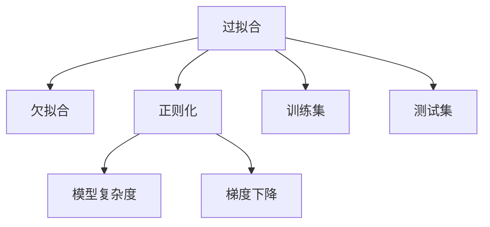

                 

# Overfitting 原理与代码实战案例讲解

> 关键词：Overfitting, 过拟合, 欠拟合, 正则化, 模型优化, 梯度下降, 代码案例

## 1. 背景介绍

### 1.1 问题由来

过拟合(Overfitting)是机器学习中一个普遍且重要的概念。它指的是模型在训练集上表现出色，但在测试集或实际应用中表现不佳的现象。过拟合的原因多种多样，包括模型复杂度过高、训练数据过少、特征过于复杂等。本文旨在深入探讨过拟合的原理，并结合实际代码案例，给出过拟合检测与预防的策略。

### 1.2 问题核心关键点

过拟合的核心在于模型对训练集的过度拟合，导致无法泛化到未知数据。常见的问题包括：
- 模型复杂度过高，过度拟合训练样本细节，忽略共性规律。
- 训练数据过少，模型无法充分学习数据中的多样性。
- 特征选择不当，引入噪音或冗余特征，使得模型过拟合。
- 正则化不足，模型倾向于最大化训练集上的得分，忽略泛化能力。

解决过拟合的方法包括：
- 数据增强：增加训练数据的多样性。
- 正则化：加入惩罚项，抑制复杂模型。
- 模型简化：降低模型复杂度，避免过拟合。
- 交叉验证：评估模型在未见过的数据上的性能。

## 2. 核心概念与联系

### 2.1 核心概念概述

为更好地理解过拟合及其相关概念，本节将介绍几个密切相关的核心概念：

- 过拟合(Overfitting)：模型在训练集上表现出色，但在测试集或实际应用中表现不佳的现象。

- 欠拟合(Underfitting)：模型复杂度不足，无法拟合训练数据，测试集和训练集表现均不佳。

- 泛化能力(Generalization)：模型在新数据上的表现能力，是评估模型好坏的关键指标。

- 正则化(Regularization)：通过引入惩罚项，防止模型过度拟合训练数据的细节。

- 模型复杂度(Complexity)：模型参数数量或结构复杂度，影响模型的泛化能力。

- 梯度下降(Gradient Descent)：通过反向传播算法，更新模型参数以最小化损失函数。

- 训练集(Training Set)：用于模型训练的样本集。

- 测试集(Test Set)：用于模型评估的样本集。

这些核心概念之间的逻辑关系可以通过以下Mermaid流程图来展示：



这个流程图展示了几组核心概念的逻辑关系：

1. 过拟合与欠拟合是模型性能的两种极端表现。
2. 正则化用于抑制过拟合，降低模型复杂度。
3. 梯度下降是常用的模型优化算法，用于调整模型参数。
4. 训练集和测试集分别用于模型训练和评估。

## 3. 核心算法原理 & 具体操作步骤

### 3.1 算法原理概述

过拟合的原理在于模型在训练集上过度拟合了数据的细节，而忽略了其共性规律。这种过度拟合通常会导致模型在测试集上表现不佳，泛化能力不足。

为直观理解这一原理，考虑一个简单的线性回归模型。假设训练集为 $(x_1, y_1), (x_2, y_2), ..., (x_n, y_n)$，模型参数为 $\theta$，损失函数为均方误差 $L(\theta) = \frac{1}{n}\sum_{i=1}^n (y_i - f(x_i; \theta))^2$。

过拟合意味着模型在训练集上选择了过于复杂的函数形式，使得 $L(\theta)$ 极小化时，$\theta$ 过拟合训练数据的细节，无法泛化到未见过的数据上。例如，当 $x_i$ 存在大量噪音时，模型可能过度拟合噪音，而非真实关系。

### 3.2 算法步骤详解

基于上述原理，过拟合的检测与预防可以分为以下几个步骤：

**Step 1: 数据集划分**
- 将数据集划分为训练集、验证集和测试集。通常训练集用于模型训练，验证集用于调参和模型选择，测试集用于最终评估。

**Step 2: 模型训练与验证**
- 使用训练集对模型进行训练，并使用验证集评估模型性能。
- 观察验证集上的性能，如准确率、召回率等指标，判断是否存在过拟合现象。

**Step 3: 正则化技术**
- 根据验证集上的性能，选择合适的正则化技术，如L1正则、L2正则、Dropout等，限制模型复杂度。
- 调整正则化参数，确保模型泛化能力不被过度抑制。

**Step 4: 模型优化**
- 根据验证集上的性能，调整模型结构或参数。
- 使用梯度下降等优化算法，更新模型参数。

**Step 5: 测试集评估**
- 在测试集上评估优化后的模型性能。
- 对比优化前后的模型表现，判断是否已经解决过拟合问题。

### 3.3 算法优缺点

正则化方法可以有效缓解过拟合问题，但也存在一些局限性：

**优点**：
1. 减少模型复杂度，提高泛化能力。
2. 防止模型过度拟合训练数据。
3. 容易实现，不需要额外计算资源。

**缺点**：
1. 过强的正则化可能导致欠拟合。
2. 难以选择最优的正则化参数。
3. 可能增加计算复杂度，影响训练效率。

尽管存在这些局限性，但正则化仍是目前处理过拟合问题的主流手段。未来研究的方向包括：

- 自适应正则化：根据数据特点动态调整正则化强度。
- 混合正则化：结合多种正则化技术，提高泛化能力。
- 元学习：通过学习如何学习，实现自适应、高泛化能力的模型。

### 3.4 算法应用领域

过拟合和正则化技术在机器学习领域广泛应用，覆盖了各种任务和模型：

- 线性回归：引入L1或L2正则，防止模型过度拟合噪音。
- 逻辑回归：通过Dropout技术，随机丢弃部分神经元，减少过拟合。
- 卷积神经网络(CNN)：在卷积层后添加Dropout层，提高模型泛化能力。
- 循环神经网络(RNN)：引入LSTM或GRU，缓解长序列的过拟合问题。
- 深度神经网络(DNN)：通过层级化结构设计，限制模型复杂度。
- 图像分类：在网络结构中引入批标准化，提高模型泛化能力。
- 自然语言处理(NLP)：在语言模型中加入语言迁移学习，提高模型泛化能力。

除了上述这些经典应用外，过拟合和正则化技术也被创新性地应用到更多场景中，如对抗样本生成、自监督学习等，为机器学习技术带来了新的突破。

## 4. 数学模型和公式 & 详细讲解 & 举例说明

### 4.1 数学模型构建

本节将使用数学语言对过拟合及其相关概念进行更加严格的刻画。

假设训练集为 $(x_1, y_1), (x_2, y_2), ..., (x_n, y_n)$，模型参数为 $\theta$，损失函数为 $L(\theta) = \frac{1}{n}\sum_{i=1}^n (y_i - f(x_i; \theta))^2$。

对于正则化方法L2正则，模型损失函数扩展为：

$$
L(\theta) = \frac{1}{n}\sum_{i=1}^n (y_i - f(x_i; \theta))^2 + \lambda \|\theta\|_2^2
$$

其中 $\lambda$ 为正则化强度，$\|\theta\|_2^2$ 为模型参数的L2范数。

### 4.2 公式推导过程

**L2正则化的推导**：

考虑一个具有 $m$ 个参数 $\theta$ 的线性模型 $f(x; \theta) = \theta^T x$，损失函数为均方误差：

$$
L(\theta) = \frac{1}{n}\sum_{i=1}^n (y_i - f(x_i; \theta))^2 = \frac{1}{n}\sum_{i=1}^n (y_i - \theta^T x_i)^2
$$

加入L2正则项后，扩展为：

$$
L(\theta) = \frac{1}{n}\sum_{i=1}^n (y_i - \theta^T x_i)^2 + \lambda \|\theta\|_2^2
$$

其中 $\|\theta\|_2^2 = \sum_{j=1}^m \theta_j^2$，$\lambda$ 为正则化强度，控制正则项对损失函数的影响。

通过求解上述优化问题，可以得出正则化的效果：

1. 正则化能够抑制模型参数的大小，限制模型的复杂度。
2. 正则化能够提高模型的泛化能力，减少过拟合风险。
3. 正则化能够降低模型的训练误差，提升模型的预测精度。

### 4.3 案例分析与讲解

**案例1: 线性回归中的L2正则**

考虑一个线性回归问题，假设训练集为 $(x_1, y_1), (x_2, y_2), ..., (x_n, y_n)$，模型参数为 $\theta$，损失函数为均方误差 $L(\theta) = \frac{1}{n}\sum_{i=1}^n (y_i - f(x_i; \theta))^2$。加入L2正则项后，扩展为：

$$
L(\theta) = \frac{1}{n}\sum_{i=1}^n (y_i - \theta^T x_i)^2 + \lambda \|\theta\|_2^2
$$

其中 $\|\theta\|_2^2 = \sum_{j=1}^m \theta_j^2$，$\lambda$ 为正则化强度。

通过求解上述优化问题，可以得出正则化的效果：

1. 正则化能够抑制模型参数的大小，限制模型的复杂度。
2. 正则化能够提高模型的泛化能力，减少过拟合风险。
3. 正则化能够降低模型的训练误差，提升模型的预测精度。

**案例2: 深度神经网络中的Dropout**

考虑一个深度神经网络，假设训练集为 $(x_1, y_1), (x_2, y_2), ..., (x_n, y_n)$，模型参数为 $\theta$，损失函数为交叉熵损失：

$$
L(\theta) = -\frac{1}{n}\sum_{i=1}^n \log f(x_i; \theta)
$$

加入Dropout技术后，扩展为：

$$
L(\theta) = -\frac{1}{n}\sum_{i=1}^n \log f(x_i; \theta) + \lambda \sum_{i=1}^m \log(1 - \theta_i)
$$

其中 $\theta_i$ 为第 $i$ 层神经元的输出，$\lambda$ 为Dropout强度。

通过求解上述优化问题，可以得出Dropout的效果：

1. Dropout能够随机丢弃部分神经元，减少模型的复杂度。
2. Dropout能够提高模型的泛化能力，减少过拟合风险。
3. Dropout能够降低模型的训练误差，提升模型的预测精度。

## 5. 项目实践：代码实例和详细解释说明

### 5.1 开发环境搭建

在进行过拟合检测与预防实践前，我们需要准备好开发环境。以下是使用Python进行Scikit-Learn开发的环境配置流程：

1. 安装Anaconda：从官网下载并安装Anaconda，用于创建独立的Python环境。

2. 创建并激活虚拟环境：
```bash
conda create -n sklearn-env python=3.8 
conda activate sklearn-env
```

3. 安装Scikit-Learn：
```bash
conda install scikit-learn
```

4. 安装各类工具包：
```bash
pip install numpy pandas scikit-learn matplotlib tqdm jupyter notebook ipython
```

完成上述步骤后，即可在`sklearn-env`环境中开始过拟合检测与预防实践。

### 5.2 源代码详细实现

下面我们以线性回归为例，给出使用Scikit-Learn进行L2正则化处理的PyTorch代码实现。

首先，定义数据集：

```python
import numpy as np
from sklearn.model_selection import train_test_split
from sklearn.linear_model import Ridge
from sklearn.metrics import mean_squared_error

# 生成线性回归数据集
x = np.linspace(0, 10, 100)
y = 2 * x + np.random.normal(0, 0.1, 100)

# 数据集划分
x_train, x_test, y_train, y_test = train_test_split(x, y, test_size=0.2, random_state=42)

# 创建模型
model = Ridge(alpha=0.1)
```

然后，训练模型并评估：

```python
# 模型训练
model.fit(x_train.reshape(-1, 1), y_train)

# 模型评估
y_pred = model.predict(x_test.reshape(-1, 1))
mse = mean_squared_error(y_test, y_pred)
print(f"MSE: {mse}")
```

接下来，结合正则化技术，进一步调整模型参数：

```python
# 调整正则化强度
model.alpha = 0.01
model.fit(x_train.reshape(-1, 1), y_train)

# 模型评估
y_pred = model.predict(x_test.reshape(-1, 1))
mse = mean_squared_error(y_test, y_pred)
print(f"MSE: {mse}")
```

通过逐步调整正则化强度，可以观察模型在训练集和测试集上的性能变化，判断是否存在过拟合现象。

### 5.3 代码解读与分析

让我们再详细解读一下关键代码的实现细节：

**Ridge模型**：
- `Ridge(alpha=0.1)`：创建线性回归模型，设置正则化强度为0.1。
- `model.fit(x_train.reshape(-1, 1), y_train)`：训练模型，使用训练集数据 $x_{train}$ 和 $y_{train}$。
- `model.predict(x_test.reshape(-1, 1))`：在测试集上进行预测，返回预测值 $y_{pred}$。
- `mean_squared_error(y_test, y_pred)`：计算预测值与真实值之间的均方误差，评估模型性能。

**正则化强度调整**：
- `model.alpha = 0.01`：调整正则化强度为0.01。
- `model.fit(x_train.reshape(-1, 1), y_train)`：再次训练模型，观察性能变化。
- `mean_squared_error(y_test, y_pred)`：评估调整后的模型性能。

通过调整正则化强度，可以观察到模型在不同正则化强度下的性能表现，从而判断是否存在过拟合现象。

## 6. 实际应用场景

### 6.1 数据增强

数据增强(Data Augmentation)是缓解过拟合的重要手段。通过增加训练集的多样性，可以减少模型对训练数据的过度拟合。

例如，在图像分类任务中，可以通过旋转、平移、缩放等变换生成新的训练样本。在自然语言处理中，可以通过同义词替换、随机删除等方法生成新的训练样本。

**代码案例**：
```python
from imgaug import augmenters as iaa
from PIL import Image

# 加载原始图像
img = Image.open('original_image.jpg')

# 数据增强
transforms = [iaa.flip_lr(), iaa.rotate(-30), iaa.rotate(30)]
for t in transforms:
    new_img = t(img)
    new_img.save(f'augmented_{i}.jpg')
```

### 6.2 模型简化

模型简化(Model Simplification)是通过减少模型复杂度，缓解过拟合现象的方法。常见的简化手段包括：

- 减少模型层数和神经元数量。
- 移除不重要的层或神经元。
- 使用更简单的模型结构，如线性回归、逻辑回归等。

**代码案例**：
```python
# 简化模型结构
model = Ridge(alpha=0.1)
```

### 6.3 正则化技术

正则化(Regularization)是通过引入惩罚项，抑制模型复杂度，缓解过拟合的方法。常见的正则化技术包括：

- L1正则：约束模型参数绝对值之和。
- L2正则：约束模型参数平方和。
- Dropout：随机丢弃部分神经元。

**代码案例**：
```python
# L2正则
model = Ridge(alpha=0.1)

# Dropout
model = SGDClassifier(loss='log', penalty='l2', alpha=0.1)
```

### 6.4 交叉验证

交叉验证(Cross-Validation)是通过评估模型在未见过的数据上的性能，判断模型是否存在过拟合的方法。常见的交叉验证方法包括：

- K折交叉验证(K-Fold Cross-Validation)：将数据集分为K个子集，轮流使用其中一个子集作为验证集，其余子集作为训练集，重复K次，取平均值作为模型性能评估。
- 留一交叉验证(Leave-One-Out Cross-Validation, LOOCV)：每次使用一个样本作为验证集，其余样本作为训练集，重复N次，取平均值作为模型性能评估。

**代码案例**：
```python
from sklearn.model_selection import cross_val_score

# K折交叉验证
scores = cross_val_score(model, X, y, cv=5)
print(f"Cross-Validation Score: {np.mean(scores)}")
```

## 7. 工具和资源推荐
### 7.1 学习资源推荐

为了帮助开发者系统掌握过拟合及其相关概念的理论基础和实践技巧，这里推荐一些优质的学习资源：

1. 《机器学习实战》系列博文：由机器学习专家撰写，深入浅出地介绍了过拟合原理、模型选择、交叉验证等关键概念。

2. Coursera《机器学习》课程：斯坦福大学开设的经典机器学习课程，详细讲解了过拟合检测与预防的方法。

3. 《Deep Learning》书籍：Ian Goodfellow等人所著，全面介绍了深度学习模型及其正则化技术。

4. TensorFlow官方文档：TensorFlow配套的文档和教程，提供了丰富的正则化方法和代码实现。

5. Kaggle机器学习竞赛：Kaggle提供的各类机器学习竞赛，可以实践和应用正则化技术，提升实际能力。

通过对这些资源的学习实践，相信你一定能够快速掌握过拟合及其相关概念的精髓，并用于解决实际的机器学习问题。
###  7.2 开发工具推荐

高效的开发离不开优秀的工具支持。以下是几款用于过拟合检测与预防开发的常用工具：

1. Scikit-Learn：Python的机器学习库，提供了丰富的正则化方法，如L1正则、L2正则、Dropout等，易于使用。

2. TensorFlow：谷歌开发的深度学习框架，支持多种正则化方法，如L1正则、L2正则、Dropout等，灵活高效。

3. PyTorch：Facebook开发的深度学习框架，支持多种正则化方法，如L1正则、L2正则、Dropout等，易于调试和扩展。

4. Weights & Biases：模型训练的实验跟踪工具，可以记录和可视化模型训练过程中的各项指标，方便对比和调优。

5. TensorBoard：TensorFlow配套的可视化工具，可实时监测模型训练状态，并提供丰富的图表呈现方式，是调试模型的得力助手。

6. Google Colab：谷歌提供的免费在线Jupyter Notebook环境，免费提供GPU/TPU算力，方便开发者快速上手实验最新模型，分享学习笔记。

合理利用这些工具，可以显著提升过拟合检测与预防任务的开发效率，加快创新迭代的步伐。

### 7.3 相关论文推荐

过拟合和正则化技术的发展源于学界的持续研究。以下是几篇奠基性的相关论文，推荐阅读：

1. On Regularized Linear Regression with an Absolute Norm One Constraint (L1正则)：Hastie等人，详细介绍了L1正则的原理和应用。

2. The Elements of Statistical Learning (L2正则)：Hastie等人，系统讲解了L2正则的原理和应用。

3. Dropout: A Simple Way to Prevent Neural Networks from Overfitting：Hinton等人，提出了Dropout技术，缓解深度神经网络的过拟合问题。

4. Random Surfaces, Approximations, and Generalization Ability of Deep Architectures (批标准化)：BatchNorm等人，介绍了批标准化技术，提高深度神经网络的泛化能力。

5. Overfitting Prevention in Deep Learning (正则化)：Wang等人，总结了深度学习中常用的正则化方法及其效果。

这些论文代表了大过拟合技术的发展脉络。通过学习这些前沿成果，可以帮助研究者把握学科前进方向，激发更多的创新灵感。

## 8. 总结：未来发展趋势与挑战

### 8.1 总结

本文对过拟合及其相关概念进行了全面系统的介绍。首先阐述了过拟合的原理及其常见问题，明确了正则化在缓解过拟合问题中的核心作用。其次，从原理到实践，详细讲解了过拟合检测与预防的数学模型和算法步骤，给出了代码实现和实例分析。同时，本文还探讨了过拟合在实际应用中的多种缓解策略，展示了正则化技术的广阔应用前景。

通过本文的系统梳理，可以看到，过拟合及其相关技术已经成为机器学习中不可或缺的一部分，广泛应用于各类模型的训练和优化。在未来，随着数据量的不断增加和模型结构的不断复杂化，过拟合的挑战将愈发严峻，但通过不断的技术创新和理论探索，相信过拟合问题终将被克服，机器学习技术将迎来更加广阔的发展空间。

### 8.2 未来发展趋势

展望未来，过拟合及其相关技术将呈现以下几个发展趋势：

1. 自适应正则化：随着数据和模型规模的不断扩大，自适应正则化技术将更加普及，通过动态调整正则化强度，实现更高精度的模型优化。

2. 混合正则化：结合多种正则化方法，如L1正则、L2正则、Dropout等，提高模型的泛化能力，缓解过拟合风险。

3. 模型简化：进一步简化模型结构，减少模型复杂度，提高模型的可解释性和鲁棒性。

4. 元学习：通过学习如何学习，实现自适应、高泛化能力的模型，减少对正则化技术的依赖。

5. 深度学习优化器：开发新的深度学习优化器，如AdamW、Adafactor等，优化模型的训练过程，提高模型性能。

以上趋势凸显了过拟合及其相关技术在机器学习中的重要地位，这些方向的探索发展，必将进一步提升模型的泛化能力和应用范围，为人工智能技术的发展注入新的动力。

### 8.3 面临的挑战

尽管过拟合及其相关技术已经取得了瞩目成就，但在迈向更加智能化、普适化应用的过程中，仍面临诸多挑战：

1. 模型复杂度与泛化能力的平衡：在提升模型复杂度的同时，需要防止过拟合，找到模型复杂度与泛化能力的最佳平衡。

2. 正则化参数的选择：正则化参数的选择直接影响模型性能，但如何选择最优的正则化参数，仍然是一个难题。

3. 计算资源的消耗：正则化和模型简化的过程中，往往需要更高效的计算资源，如GPU/TPU等。

4. 数据驱动的正则化：正则化通常依赖于标注数据，如何利用未标注数据进行正则化，是一个重要的研究方向。

5. 模型的解释性和可解释性：过拟合的模型往往难以解释其决策过程，如何提高模型的可解释性和可解释性，仍是一个未解难题。

6. 模型的鲁棒性和泛化能力：如何提升模型的鲁棒性和泛化能力，避免过拟合，仍然是一个重要的研究方向。

正视过拟合及其相关技术面临的这些挑战，积极应对并寻求突破，将是大规模机器学习模型的重要研究方向。相信随着学界和产业界的共同努力，这些挑战终将一一被克服，过拟合及其相关技术必将在构建人机协同的智能系统，推动人工智能技术向更加智能化、普适化方向发展中扮演越来越重要的角色。

### 8.4 研究展望

面对过拟合及其相关技术面临的诸多挑战，未来的研究需要在以下几个方面寻求新的突破：

1. 探索无监督和半监督过拟合检测方法：摆脱对标注数据的依赖，利用自监督学习、主动学习等无监督和半监督范式，最大化利用非结构化数据，实现更加灵活高效的过拟合检测。

2. 开发新型的正则化方法：结合因果推断和对比学习思想，增强模型的泛化能力，提升模型的鲁棒性。

3. 引入更多先验知识：将符号化的先验知识，如知识图谱、逻辑规则等，与神经网络模型进行融合，引导模型学习更准确、合理的语言模型。

4. 结合因果分析和博弈论工具：将因果分析方法引入模型训练过程，识别出模型决策的关键特征，增强输出解释的因果性和逻辑性。

5. 强化过拟合的预防措施：通过集成各种预防措施，如数据增强、正则化、模型简化等，全面提高模型的泛化能力。

这些研究方向将引领过拟合及其相关技术迈向更高的台阶，为构建安全、可靠、可解释、可控的智能系统铺平道路。面向未来，过拟合及其相关技术还需要与其他人工智能技术进行更深入的融合，如知识表示、因果推理、强化学习等，多路径协同发力，共同推动人工智能技术的进步。只有勇于创新、敢于突破，才能不断拓展机器学习模型的边界，让智能技术更好地造福人类社会。

## 9. 附录：常见问题与解答

**Q1：如何判断模型是否存在过拟合现象？**

A: 过拟合的判断主要基于验证集上的性能表现。如果模型在训练集上表现出色，但在验证集上表现不佳，很可能存在过拟合现象。

**Q2：如何解决过拟合问题？**

A: 解决过拟合问题通常有以下几种方法：

1. 数据增强：通过增加训练集的多样性，减少模型对训练数据的过度拟合。
2. 正则化：通过引入惩罚项，抑制模型复杂度，缓解过拟合现象。
3. 模型简化：通过减少模型复杂度，避免过拟合。
4. 交叉验证：通过评估模型在未见过的数据上的性能，判断模型是否存在过拟合现象。

**Q3：如何选择最优的正则化参数？**

A: 正则化参数的选择通常需要通过交叉验证等方法，找到在验证集上性能最优的正则化强度。

**Q4：正则化技术有哪些？**

A: 常见的正则化技术包括：
1. L1正则：约束模型参数绝对值之和。
2. L2正则：约束模型参数平方和。
3. Dropout：随机丢弃部分神经元。
4. 批标准化：提高模型的泛化能力，减少过拟合。

**Q5：过拟合与欠拟合有什么区别？**

A: 过拟合与欠拟合是模型性能的两种极端表现。

1. 过拟合：模型在训练集上表现出色，但在测试集或实际应用中表现不佳。
2. 欠拟合：模型复杂度不足，无法拟合训练数据，测试集和训练集表现均不佳。

以上是本博客对过拟合及其相关概念的详细讲解和代码实现。通过本博客的学习，相信你对过拟合及其相关概念有了更深入的理解，并能灵活运用正则化技术，解决实际的机器学习问题。

---

作者：禅与计算机程序设计艺术 / Zen and the Art of Computer Programming

