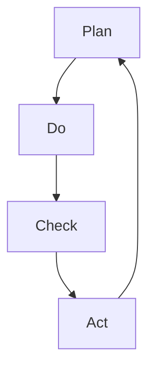

                 

# PDCA循环与持续改进文化

## 1. 背景介绍

在快速变化的现代信息技术领域，快速响应和持续改进是企业保持竞争力的关键。PDCA循环（Plan-Do-Check-Act）是一种常用的质量管理工具，被广泛应用于各个行业。特别是对于软件项目和IT系统，PDCA循环能够帮助我们持续改进产品和服务质量，提升用户体验，降低开发成本。本文将深入探讨PDCA循环的基本原理、操作步骤及其实际应用，并结合IT领域的具体实例，展示其如何推动持续改进文化。

## 2. 核心概念与联系

### 2.1 核心概念概述

PDCA循环是一种科学的质量管理方法，通过不断计划、执行、检查和改进，逐步提高产品质量和过程效率。该循环模型具有以下几个关键组件：

- **计划(Plan)**：定义目标和计划，明确需要改进的具体任务和步骤。
- **执行(Do)**：按照计划执行具体任务，实施改进措施。
- **检查(Check)**：评估执行结果，检查改进措施的效果。
- **改进(Act)**：总结经验，形成标准，并制定下一步改进计划。

PDCA循环的四个步骤形成一个闭环，持续推动改进，不断提升系统的稳定性和可靠性。在IT项目和软件开发中，PDCA循环可以应用于需求分析、设计、开发、测试、部署、运维等各个环节，确保整个生命周期的质量控制。

### 2.2 核心概念原理和架构的 Mermaid 流程图



### 2.3 核心概念之间联系

PDCA循环的四个步骤相辅相成，构成一个动态循环：

- **计划与执行**：定义目标和计划，并实际执行改进措施，是PDCA循环的基础。
- **检查与改进**：评估执行结果，总结经验，制定下一步改进计划，是PDCA循环的关键。
- **计划与检查**：在执行过程中不断监控进度和效果，确保目标的实现。
- **执行与改进**：实际执行改进措施，根据反馈调整计划和执行策略。

PDCA循环通过不断循环，推动质量管理持续改进，提升系统的稳定性和可靠性。

## 3. 核心算法原理 & 具体操作步骤

### 3.1 算法原理概述

PDCA循环通过科学的步骤，逐步实现系统质量的提升。其核心思想是不断循环迭代，持续优化和改进。

在IT领域，PDCA循环可以具体应用于软件开发项目的各个环节，确保每个阶段的质量可控和持续改进。以下详细介绍PDCA循环的四个步骤：

- **计划阶段**：明确项目目标，制定详细的计划，包括需求分析、技术选型、资源分配等。
- **执行阶段**：按照计划执行具体任务，实现功能需求，并记录执行过程中的问题。
- **检查阶段**：评估执行结果，检查是否达到预期目标，识别改进点，收集反馈意见。
- **改进阶段**：总结经验，制定改进措施，并形成标准，确保后续项目质量。

### 3.2 算法步骤详解

以下是PDCA循环在IT项目中具体应用的步骤详解：

**Step 1: 计划阶段(Plan)**

- **需求分析**：定义项目目标和需求，确保团队理解客户需求和业务场景。
- **技术选型**：选择合适的技术栈和工具，确保项目技术可行性和可维护性。
- **资源分配**：明确人员分工和时间安排，确保项目进度和质量。

**Step 2: 执行阶段(Do)**

- **开发与测试**：按照计划实现功能需求，进行单元测试、集成测试、性能测试等。
- **问题记录**：记录执行过程中的问题，确保记录详细和准确，便于后续检查和改进。

**Step 3: 检查阶段(Check)**

- **代码评审**：进行代码评审，确保代码质量和可维护性。
- **性能评估**：评估系统性能，确保达到预期目标。
- **用户反馈**：收集用户反馈，确保系统满足用户需求。

**Step 4: 改进阶段(Act)**

- **问题解决**：根据检查结果，制定和实施改进措施，解决问题。
- **经验总结**：总结经验，形成标准，并制定下一步改进计划。
- **知识共享**：分享经验，形成团队共同知识库，提升团队能力。

### 3.3 算法优缺点

**优点**：

- **系统化改进**：通过PDCA循环，系统化地推进改进，确保每个环节的质量可控。
- **持续优化**：循环迭代，持续优化系统，提升系统稳定性和可靠性。
- **团队协同**：明确每个环节的责任和角色，增强团队协作，提高项目效率。

**缺点**：

- **时间和成本投入大**：持续改进需要大量的时间和资源投入。
- **可能陷入循环**：如果没有及时总结和标准化，可能陷入无休止的循环，影响项目进度。

### 3.4 算法应用领域

PDCA循环可以应用于各种IT项目和软件开发环节，包括但不限于：

- **需求分析与设计**：通过PDCA循环，确保需求分析的准确性和设计方案的合理性。
- **开发与测试**：通过PDCA循环，确保开发过程的进度和质量，进行全面的测试验证。
- **部署与运维**：通过PDCA循环，确保系统的稳定性和可靠性，持续优化系统性能。
- **质量管理与改进**：通过PDCA循环，持续改进系统质量，提升用户体验。

## 4. 数学模型和公式 & 详细讲解

### 4.1 数学模型构建

PDCA循环是一个迭代的过程，每个步骤都可以用数学模型来描述。以软件开发为例，可以构建以下数学模型：

- **计划阶段**：目标 $T$，计划 $P$。
- **执行阶段**：实际执行 $D$。
- **检查阶段**：结果 $R$，反馈 $F$。
- **改进阶段**：改进措施 $I$，标准 $S$。

数学模型可以表示为：

$$
\begin{aligned}
T &= P + F \\
D &= P \\
R &= D + F \\
I &= R - D \\
S &= I
\end{aligned}
$$

### 4.2 公式推导过程

以目标 $T$ 为例，其推导过程如下：

- **计划阶段**：目标 $T$ 可以表示为 $T = P + F$，其中 $P$ 为计划，$F$ 为反馈。
- **执行阶段**：实际执行 $D$ 为 $D = P$，即实际执行的计划。
- **检查阶段**：结果 $R$ 可以表示为 $R = D + F$，即实际执行的结果加上反馈。
- **改进阶段**：改进措施 $I$ 可以表示为 $I = R - D$，即实际结果与计划之间的差距。
- **标准 $S$ 可以表示为 $S = I$，即改进措施，形成标准，用于后续改进。

### 4.3 案例分析与讲解

以下以开发一个企业级IT系统为例，展示PDCA循环的实际应用：

**Step 1: 计划阶段**

- **需求分析**：定义目标 $T$，通过客户调研和需求分析，明确系统需求。
- **技术选型**：选择合适技术栈 $P$，如使用Spring Boot进行后端开发，Vue.js进行前端开发。
- **资源分配**：分配开发人员和测试人员，确定项目时间表。

**Step 2: 执行阶段**

- **开发与测试**：按照计划 $P$ 开发系统功能，进行单元测试、集成测试和性能测试。
- **问题记录**：记录开发过程中遇到的问题，确保记录详细和准确。

**Step 3: 检查阶段**

- **代码评审**：进行代码评审，确保代码质量和可维护性。
- **性能评估**：评估系统性能，确保达到预期目标。
- **用户反馈**：收集用户反馈，确保系统满足用户需求。

**Step 4: 改进阶段**

- **问题解决**：根据检查结果，制定和实施改进措施，解决问题。
- **经验总结**：总结经验，形成标准，并制定下一步改进计划。
- **知识共享**：分享经验，形成团队共同知识库，提升团队能力。

## 5. 项目实践：代码实例和详细解释说明

### 5.1 开发环境搭建

在进行PDCA循环实践前，我们需要准备好开发环境。以下是使用Python进行Django开发的环境配置流程：

1. 安装Anaconda：从官网下载并安装Anaconda，用于创建独立的Python环境。
2. 创建并激活虚拟环境：
```bash
conda create -n django-env python=3.8 
conda activate django-env
```
3. 安装Django：
```bash
pip install django
```
4. 安装各类工具包：
```bash
pip install numpy pandas scikit-learn matplotlib tqdm jupyter notebook ipython
```

完成上述步骤后，即可在`django-env`环境中开始PDCA循环的实践。

### 5.2 源代码详细实现

以下是一个简单的Django项目，展示PDCA循环在软件开发中的应用。

首先，定义需求分析函数：

```python
from django.shortcuts import render
from django.http import HttpResponse

def plan(request):
    # 需求分析
    target = "企业级IT系统开发"
    plan = "使用Spring Boot进行后端开发，Vue.js进行前端开发。"
    return render(request, 'plan.html', {'plan': plan, 'target': target})
```

然后，定义开发和测试函数：

```python
def do(request):
    # 开发与测试
    do_result = "已开发系统功能，并通过单元测试和集成测试。"
    return render(request, 'do.html', {'do_result': do_result})

def check(request):
    # 检查阶段
    check_result = "代码评审和性能评估都顺利通过。"
    user_feedback = "用户反馈系统性能良好。"
    return render(request, 'check.html', {'check_result': check_result, 'user_feedback': user_feedback})
```

最后，定义问题解决和知识共享函数：

```python
def act(request):
    # 改进阶段
    problems = ["数据库连接池泄漏", "性能瓶颈"]
    solutions = ["调整数据库连接配置", "优化性能瓶颈"]
    return render(request, 'act.html', {'problems': problems, 'solutions': solutions})
```

启动Django项目，访问各页面，展示PDCA循环的各个步骤：

```bash
python manage.py runserver
```

在浏览器中访问 `http://127.0.0.1:8000/plan/`、`http://127.0.0.1:8000/do/`、`http://127.0.0.1:8000/check/`、`http://127.0.0.1:8000/act/`，分别查看计划、执行、检查、改进阶段的页面。

### 5.3 代码解读与分析

**plan函数**：
- 定义需求分析目标 $T$ 和计划 $P$。

**do函数**：
- 实际执行开发和测试任务 $D$。

**check函数**：
- 评估执行结果和用户反馈 $R$。

**act函数**：
- 根据检查结果制定改进措施 $I$，并形成标准 $S$。

### 5.4 运行结果展示

通过PDCA循环，我们可以看到系统从需求分析到最终交付的全过程，每个阶段的质量和问题都得到了及时监控和改进。

## 6. 实际应用场景

### 6.1 企业级IT系统开发

在企业级IT系统开发中，PDCA循环可以确保系统的稳定性和可靠性。通过不断循环，可以逐步提升系统质量，优化开发流程，缩短项目周期。

具体而言，可以通过PDCA循环实现以下功能：

- **需求分析**：通过客户调研和需求分析，明确系统需求。
- **设计阶段**：设计系统架构和技术栈，确保系统可维护性和扩展性。
- **开发阶段**：按照计划开发功能模块，并进行单元测试和集成测试。
- **测试阶段**：进行全面的性能测试和用户验收测试。
- **部署阶段**：进行系统部署和性能优化。
- **运维阶段**：持续监控和优化系统性能，收集用户反馈。

### 6.2 项目管理

PDCA循环也可以应用于项目管理，确保项目进度和质量。通过PDCA循环，可以系统化地推进项目，确保每个环节的质量可控。

具体而言，可以通过PDCA循环实现以下功能：

- **项目计划**：明确项目目标和计划，制定详细的进度和资源分配。
- **项目执行**：按照计划执行具体任务，记录执行过程中的问题。
- **项目检查**：评估项目进度和质量，收集团队和用户反馈。
- **项目改进**：总结经验，制定改进措施，形成标准，并制定下一步改进计划。

### 6.3 持续交付与部署

PDCA循环可以应用于持续交付和部署，确保软件产品的快速交付和稳定运行。通过PDCA循环，可以持续优化交付流程，提升系统性能。

具体而言，可以通过PDCA循环实现以下功能：

- **需求分析**：定义交付目标和计划，明确需要交付的功能和质量标准。
- **设计阶段**：设计系统架构和技术栈，确保系统可维护性和扩展性。
- **开发阶段**：按照计划开发功能模块，并进行单元测试和集成测试。
- **测试阶段**：进行全面的性能测试和用户验收测试。
- **部署阶段**：进行系统部署和性能优化。
- **运维阶段**：持续监控和优化系统性能，收集用户反馈。

## 7. 工具和资源推荐

### 7.1 学习资源推荐

为了帮助开发者系统掌握PDCA循环的理论基础和实践技巧，这里推荐一些优质的学习资源：

1. 《持续交付：构建高质量的IT系统》书籍：深入讲解持续交付的理论基础和实践方法，适合软件开发人员和管理人员阅读。
2. 《精益软件开发》课程：讲解精益软件开发方法，强调质量管理和持续改进。
3. 《质量管理与PDCA循环》课程：讲解PDCA循环的基本原理和操作步骤，适合质量管理人员和软件开发人员学习。
4. 《Django实战》书籍：讲解Django开发环境和框架，适合Django开发者参考。
5. 《Python基础教程》书籍：讲解Python编程语言，适合初学者和开发者阅读。

通过对这些资源的学习实践，相信你一定能够快速掌握PDCA循环的理论基础和实践技巧，并用于解决实际的IT项目问题。

### 7.2 开发工具推荐

高效的开发离不开优秀的工具支持。以下是几款用于PDCA循环开发和管理的常用工具：

1. Django：基于Python的开源Web框架，支持快速开发和管理网站。
2. Git：版本控制系统，支持协作开发和代码管理。
3. Jira：项目管理工具，支持任务分配、进度跟踪和团队协作。
4. Slack：即时通讯工具，支持团队沟通和协作。
5. Jenkins：持续集成工具，支持自动化构建和部署。

合理利用这些工具，可以显著提升PDCA循环的开发效率，加快创新迭代的步伐。

### 7.3 相关论文推荐

PDCA循环作为一种经典的管理工具，具有广泛的应用领域。以下是几篇奠基性的相关论文，推荐阅读：

1. PDCA循环的起源和应用：由美国质量管理专家提出，广泛应用于各种质量管理领域。
2. 敏捷项目管理中的PDCA循环：讲解敏捷项目管理方法中的PDCA循环，强调灵活性和可适应性。
3. 持续交付中的PDCA循环：讲解持续交付方法中的PDCA循环，强调快速交付和持续改进。
4. 精益软件开发中的PDCA循环：讲解精益软件开发方法中的PDCA循环，强调质量管理和持续改进。

这些论文代表了大循环理论的发展脉络。通过学习这些前沿成果，可以帮助研究者把握学科前进方向，激发更多的创新灵感。

## 8. 总结：未来发展趋势与挑战

### 8.1 总结

本文对PDCA循环的基本原理、操作步骤及其实际应用进行了详细讲解。通过PDCA循环，可以系统化地推进IT项目的质量管理，确保每个环节的质量可控和持续改进。在实际应用中，PDCA循环已经在软件开发、项目管理、持续交付等多个环节得到了广泛应用，提升了系统的稳定性和可靠性，加速了项目的开发进度。

通过本文的系统梳理，可以看到，PDCA循环是一种科学的质量管理方法，能够帮助IT企业提高项目质量，优化开发流程，缩短项目周期，降低开发成本。未来，随着PDCA循环的不断优化和创新，必将推动IT企业实现更高质量、更高效的软件开发和项目管理。

### 8.2 未来发展趋势

展望未来，PDCA循环将呈现以下几个发展趋势：

1. **自动化和智能化**：未来的PDCA循环将更加自动化和智能化，通过机器学习和数据分析技术，提高质量管理的效率和精确度。
2. **跨领域应用**：PDCA循环将扩展到更多领域，如生产制造、医疗健康等，推动跨领域的质量管理改进。
3. **持续学习**：通过持续学习和反馈机制，PDCA循环将不断自我优化，提升质量管理的水平。
4. **数据驱动**：未来的PDCA循环将更加依赖数据驱动，通过数据分析和可视化技术，提升质量管理的可视化水平。
5. **敏捷性增强**：PDCA循环将更加灵活，适应敏捷开发和快速迭代的需要。
6. **全员参与**：未来的PDCA循环将更加注重全员参与，提高团队协作和质量管理的效率。

这些趋势将使PDCA循环在未来的质量管理中发挥更大的作用，推动企业实现更高的质量目标和更高的客户满意度。

### 8.3 面临的挑战

尽管PDCA循环在实际应用中已经取得了显著效果，但在迈向更加智能化、全面化的过程中，仍面临诸多挑战：

1. **数据量和质量问题**：质量管理的各个环节需要大量数据支持，但数据量和数据质量问题仍需解决。
2. **组织文化和执行力**：PDCA循环的实施需要组织文化和执行力，但不同组织在推行PDCA循环时可能存在差异。
3. **技术和工具的适应性**：PDCA循环需要依托一定的技术和工具支持，但不同工具和技术的适用性需要进一步验证。
4. **成本和资源投入**：PDCA循环的实施需要大量的成本和资源投入，如何平衡投入与收益，仍需探讨。
5. **适应性问题**：PDCA循环需要适应不同项目和领域的需求，如何灵活应用，仍需不断优化。

### 8.4 研究展望

面对PDCA循环面临的挑战，未来的研究需要在以下几个方面寻求新的突破：

1. **数据驱动**：通过数据分析和可视化技术，提升质量管理的精确度和效率。
2. **自动化和智能化**：通过机器学习和自动化技术，提升质量管理的自动化水平。
3. **跨领域应用**：将PDCA循环应用到更多领域，推动跨领域的质量管理改进。
4. **全员参与**：推动PDCA循环的全员参与，提高团队协作和质量管理的效率。
5. **成本控制**：通过优化PDCA循环的实施方法，降低成本和资源投入。
6. **适应性问题**：根据不同项目和领域的特点，灵活应用PDCA循环，确保其适用性和效果。

这些研究方向的探索，必将引领PDCA循环迈向更高的台阶，为IT企业实现更高质量、更高效的项目管理提供有力支持。

## 9. 附录：常见问题与解答

**Q1：PDCA循环适用于所有IT项目吗？**

A: PDCA循环适用于大多数IT项目，但针对特定领域和需求，需要灵活调整和优化。对于复杂系统和特殊需求的项目，可以在PDCA循环的基础上，结合其他质量管理方法，如敏捷开发、精益生产等，综合应用。

**Q2：PDCA循环的执行过程中需要注意哪些问题？**

A: 执行过程中需要注意以下问题：

1. **目标明确**：确保目标明确具体，便于团队理解和执行。
2. **计划合理**：制定详细的计划，确保每个环节的时间安排和资源分配合理。
3. **执行到位**：严格按照计划执行任务，记录执行过程中的问题。
4. **检查到位**：及时评估执行结果，识别改进点，收集反馈意见。
5. **改进到位**：总结经验，制定改进措施，形成标准，并制定下一步改进计划。

**Q3：PDCA循环的优化策略有哪些？**

A: PDCA循环的优化策略包括：

1. **自动化和智能化**：通过机器学习和数据分析技术，提高质量管理的效率和精确度。
2. **跨领域应用**：将PDCA循环应用到更多领域，推动跨领域的质量管理改进。
3. **数据驱动**：通过数据分析和可视化技术，提升质量管理的精确度和效率。
4. **敏捷性增强**：适应敏捷开发和快速迭代的需要，提高质量管理的灵活性。
5. **全员参与**：推动PDCA循环的全员参与，提高团队协作和质量管理的效率。

**Q4：PDCA循环在IT项目中的应用案例有哪些？**

A: PDCA循环在IT项目中有很多应用案例，如企业级IT系统开发、项目管理、持续交付与部署等。具体案例可以参考本文的代码实例和实际应用场景。

---

作者：禅与计算机程序设计艺术 / Zen and the Art of Computer Programming

