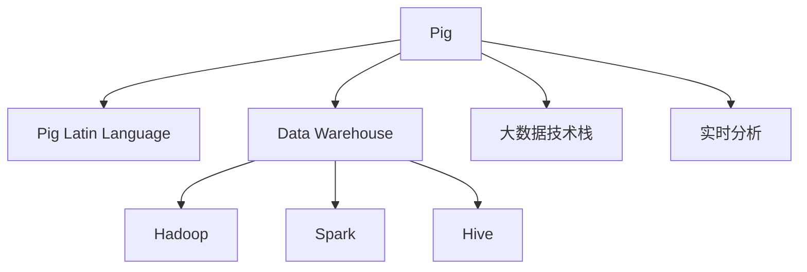

                 

# Pig优化策略原理与代码实例讲解

> 关键词：Pig优化策略, SQL优化, 数据仓库, 大数据, 实时分析

## 1. 背景介绍

### 1.1 问题由来
在大数据时代，企业和组织面临海量数据源和复杂的数据分析需求，对于如何高效存储和处理这些数据，Pig是最为重要的工具之一。Pig能够灵活地处理大规模数据集，并提供了丰富的数据处理和分析功能，但其性能的优化依然是一个值得深入探讨的问题。

随着Pig的应用场景不断扩展，对数据处理速度和分析精度的要求也越来越高。为了保证Pig的性能，需要了解和掌握其优化策略，并应用于实际的开发和部署过程中。

### 1.2 问题核心关键点
Pig优化策略的优化目标是提高Pig的运行效率和响应速度，具体关键点包括：
- 内存管理：优化内存使用，避免内存溢出和效率下降。
- 多任务并发：提高任务并行度，充分利用CPU和GPU资源。
- 数据传输：优化数据传输路径，减少网络开销。
- 查询优化：通过优化查询语句，提升查询效率和准确性。
- 日志管理：合理管理日志文件，减少日志文件大小和写入时间。

这些关键点紧密相关，互相影响，共同决定Pig的运行性能。

### 1.3 问题研究意义
优化Pig性能可以显著提升数据处理和分析的速度和精度，降低资源消耗，提升用户体验。这对于企业和组织，特别是那些处理大规模数据和高频数据任务的用户，尤为重要。

通过了解Pig的优化策略，可以更好地指导和实现大规模数据的处理与分析，加快数据分析的进程，提高企业决策效率。

## 2. 核心概念与联系

### 2.1 核心概念概述

为更好地理解Pig优化策略，下面简要介绍几个核心概念：

- **Pig**：一个用于大规模数据处理的平台，使用类似SQL的语言进行数据分析和处理。Pig提供了丰富的数据处理和分析功能，能够高效处理大规模数据集。
- **Pig拉丁语**：Pig使用的查询语言，是一种类似于SQL的脚本语言。通过Pig Latin语法的编程，可以执行复杂的数据处理任务。
- **Data仓库**：用于存储和管理大量结构化数据的系统。数据仓库能够支持复杂的数据查询和分析，是企业数据管理的重要组成部分。
- **大数据技术栈**：包括Hadoop、Spark、Hive等，用于处理大规模数据的技术和工具。Pig可以与这些大数据技术无缝集成，实现大数据分析。
- **实时分析**：对于海量数据进行实时的数据流处理和分析，能够快速响应业务需求。

这些核心概念之间的逻辑关系可以通过以下Mermaid流程图来展示：



这个流程图展示了Pig与其他核心概念的关系：

1. Pig利用Pig Latin语言进行数据处理。
2. Pig可以与数据仓库系统集成，用于存储和管理数据。
3. Pig能够与Hadoop、Spark、Hive等大数据技术无缝集成，实现数据处理和分析。
4. Pig支持实时分析，能够快速响应业务需求。

## 3. 核心算法原理 & 具体操作步骤

### 3.1 算法原理概述

Pig的优化策略可以分为内存管理、并发任务、数据传输、查询优化和日志管理五大方面。这些优化策略共同作用，提升Pig的性能，提高其处理大规模数据的能力。

#### 3.1.1 内存管理
内存管理是Pig优化策略中最重要的部分。Pig在处理大规模数据集时，需要大量内存进行临时数据存储和计算，内存使用不合理容易导致内存溢出和性能下降。

内存管理包括两个主要部分：
- 内存优化：优化内存使用，避免内存溢出和效率下降。
- 数据分块：将大规模数据集划分为多个小块，每个小块独立处理，减少内存占用。

#### 3.1.2 并发任务
并发任务处理是提高Pig性能的重要手段。Pig支持多任务并发执行，可以通过分治策略将一个大任务划分为多个小任务，并行执行，提高任务处理速度。

并发任务处理主要包括以下几个方面：
- 任务划分：将大任务划分为多个子任务，每个子任务独立执行。
- 任务调度和调度器：合理调度各个子任务，充分利用CPU和GPU资源。
- 任务并行：利用多核CPU和GPU并行处理子任务，提升处理速度。

#### 3.1.3 数据传输
数据传输是Pig优化策略中不可忽视的一部分。Pig需要在不同节点之间进行数据传输，网络传输路径的优化可以显著提升数据处理速度。

数据传输优化包括以下几个方面：
- 数据传输路径优化：优化数据传输路径，减少网络开销。
- 数据压缩：使用压缩算法压缩传输数据，减少传输带宽。
- 数据缓存：在节点之间缓存数据，减少重复传输。

#### 3.1.4 查询优化
查询优化是Pig优化策略中提升查询效率和准确性的重要手段。Pig提供了丰富的优化工具和策略，能够优化查询语句，提升查询效率。

查询优化包括以下几个方面：
- 查询重写：优化查询语句，提升查询效率和准确性。
- 查询并行：利用多核CPU和GPU并行执行查询任务，提高查询速度。
- 索引优化：优化索引结构，提升查询效率。

#### 3.1.5 日志管理
日志管理是Pig优化策略中减少日志文件大小和写入时间的关键部分。Pig在处理大规模数据时，会产生大量的日志文件，合理管理日志文件可以减少日志文件大小和写入时间。

日志管理包括以下几个方面：
- 日志文件压缩：使用压缩算法压缩日志文件，减少日志文件大小。
- 日志文件缓存：在节点之间缓存日志文件，减少日志文件写入时间。
- 日志文件合并：合并多个日志文件，减少日志文件写入次数。

### 3.2 算法步骤详解

#### 3.2.1 内存优化
内存优化是Pig优化策略中最重要的部分。Pig在处理大规模数据集时，需要大量内存进行临时数据存储和计算，内存使用不合理容易导致内存溢出和性能下降。

内存优化主要包括以下几个方面：

**步骤1：评估内存使用情况**
使用Pig的内存分析工具，评估内存使用情况，找出内存使用不合理的地方。

**步骤2：调整内存使用策略**
根据内存使用情况，调整内存使用策略，优化内存使用。

**步骤3：使用数据分块**
将大规模数据集划分为多个小块，每个小块独立处理，减少内存占用。

**步骤4：优化数据存储**
使用HDFS等高效存储方式，减少数据存储成本和延迟。

**步骤5：优化数据访问**
优化数据访问方式，减少数据访问延迟。

#### 3.2.2 并发任务
并发任务处理是提高Pig性能的重要手段。Pig支持多任务并发执行，可以通过分治策略将一个大任务划分为多个小任务，并行执行，提高任务处理速度。

并发任务处理主要包括以下几个方面：

**步骤1：任务划分**
将大任务划分为多个子任务，每个子任务独立执行。

**步骤2：任务调度和调度器**
合理调度各个子任务，充分利用CPU和GPU资源。

**步骤3：任务并行**
利用多核CPU和GPU并行处理子任务，提升处理速度。

**步骤4：任务优化**
优化任务执行过程，减少任务执行时间。

#### 3.2.3 数据传输
数据传输是Pig优化策略中不可忽视的一部分。Pig需要在不同节点之间进行数据传输，网络传输路径的优化可以显著提升数据处理速度。

数据传输优化包括以下几个方面：

**步骤1：优化数据传输路径**
优化数据传输路径，减少网络开销。

**步骤2：使用数据压缩**
使用压缩算法压缩传输数据，减少传输带宽。

**步骤3：使用数据缓存**
在节点之间缓存数据，减少重复传输。

#### 3.2.4 查询优化
查询优化是Pig优化策略中提升查询效率和准确性的重要手段。Pig提供了丰富的优化工具和策略，能够优化查询语句，提升查询效率。

查询优化包括以下几个方面：

**步骤1：查询重写**
优化查询语句，提升查询效率和准确性。

**步骤2：查询并行**
利用多核CPU和GPU并行执行查询任务，提高查询速度。

**步骤3：索引优化**
优化索引结构，提升查询效率。

#### 3.2.5 日志管理
日志管理是Pig优化策略中减少日志文件大小和写入时间的关键部分。Pig在处理大规模数据时，会产生大量的日志文件，合理管理日志文件可以减少日志文件大小和写入时间。

日志管理包括以下几个方面：

**步骤1：日志文件压缩**
使用压缩算法压缩日志文件，减少日志文件大小。

**步骤2：日志文件缓存**
在节点之间缓存日志文件，减少日志文件写入时间。

**步骤3：日志文件合并**
合并多个日志文件，减少日志文件写入次数。

### 3.3 算法优缺点

Pig优化策略在提升Pig性能方面具有以下优点：
- 优化内存使用，避免内存溢出和效率下降。
- 提高任务并行度，充分利用CPU和GPU资源。
- 优化数据传输路径，减少网络开销。
- 提升查询效率和准确性。
- 减少日志文件大小和写入时间。

Pig优化策略也存在一些缺点：
- 优化策略的实现需要一定的技术积累，需要深入理解Pig的内部机制。
- 优化策略的实施可能增加系统的复杂度，需要仔细评估和权衡。
- 优化策略的实施需要合理配置资源，过度优化可能导致资源浪费。

尽管存在这些局限性，但就目前而言，Pig优化策略依然是大数据处理和分析中不可或缺的一部分，通过合理应用这些策略，可以显著提升Pig的性能和稳定性。

### 3.4 算法应用领域

Pig优化策略在多个领域都有广泛的应用，以下是几个典型应用场景：

- **数据仓库**：用于处理和分析海量结构化数据，提升数据处理和分析的速度和精度。
- **大数据分析**：与Hadoop、Spark、Hive等大数据技术无缝集成，实现大规模数据处理和分析。
- **实时分析**：对于海量数据进行实时的数据流处理和分析，能够快速响应业务需求。
- **云计算平台**：优化云计算平台中的数据处理和分析过程，提升资源利用率和计算效率。
- **大数据平台**：应用于大数据平台，提升平台的处理能力和响应速度。

## 4. 数学模型和公式 & 详细讲解  
### 4.1 数学模型构建

在Pig中，可以使用Pig Latin语言进行数据处理和分析，Pig Latin语言是基于SQL的一种查询语言。Pig Latin查询语句的基本形式为：

$$
\text{query语句}
$$

其中，`query语句`是Pig Latin语言的查询语句，用于描述数据处理和分析的任务。

在Pig中，可以通过`STORE`关键字将查询结果存储到HDFS等存储系统中，存储格式可以是文本文件、序列化文件等。存储过程的基本形式为：

$$
\text{STORE}(\text{查询语句})\text{INTO}\text{HDFS路径}
$$

其中，`HDFS路径`是数据存储的路径。

### 4.2 公式推导过程

Pig优化策略中的查询优化和索引优化是提升查询效率的重要手段。以下是查询优化和索引优化的数学模型构建和公式推导过程。

**查询优化**

假设有一个包含$n$个记录的表，需要查询其中符合条件的记录。原始查询语句为：

$$
\text{SELECT} * \text{FROM} \text{表名} \text{WHERE} \text{条件}
$$

其中，`表名`是数据表的名称，`条件`是查询条件。

为了提升查询效率，可以使用`GROUP BY`和`ORDER BY`等操作对查询结果进行分组和排序，查询语句变为：

$$
\text{SELECT} * \text{FROM} \text{表名} \text{WHERE} \text{条件} \text{GROUP BY} \text{分组条件} \text{ORDER BY} \text{排序条件}
$$

其中，`分组条件`和`排序条件`是查询结果的分组和排序条件。

**索引优化**

索引优化是提升查询效率的另一种重要手段。假设有一个包含$n$个记录的表，其中有一个字段`key`作为主键。查询语句为：

$$
\text{SELECT} * \text{FROM} \text{表名} \text{WHERE} \text{key} = \text{value}
$$

其中，`value`是查询条件。

为了提升查询效率，可以在`key`字段上建立索引，查询语句变为：

$$
\text{SELECT} * \text{FROM} \text{表名} \text{WHERE} \text{key} = \text{value} \text{INDEX BY} \text{key}
$$

其中，`INDEX BY key`表示在`key`字段上建立索引。

### 4.3 案例分析与讲解

**案例1：数据仓库优化**

数据仓库中存储了大量结构化数据，需要定期进行数据清洗、转换和加载。数据仓库中的数据处理过程可以使用Pig进行优化。

优化过程包括以下几个步骤：

**步骤1：数据清洗**

数据清洗是指去除数据中的噪声和异常值，保证数据的准确性和完整性。可以使用Pig的`FILTER`操作进行数据清洗，查询语句为：

$$
\text{FILTER}(\text{表名} * \text{WHERE} \text{条件})
$$

其中，`条件`是数据清洗条件。

**步骤2：数据转换**

数据转换是指将数据从一种格式转换为另一种格式，满足后续分析的需求。可以使用Pig的`JOIN`操作进行数据转换，查询语句为：

$$
\text{JOIN}(\text{表名1}, \text{表名2} \text{ON} \text{条件}) \text{GROUP BY} \text{分组条件} \text{ORDER BY} \text{排序条件}
$$

其中，`条件`是数据转换条件，`分组条件`和`排序条件`是数据转换后进行分组和排序的条件。

**步骤3：数据加载**

数据加载是指将数据从临时文件或中间表加载到最终目标表中。可以使用Pig的`STORE`操作进行数据加载，查询语句为：

$$
\text{STORE}(\text{查询语句})\text{INTO}\text{HDFS路径}
$$

其中，`HDFS路径`是数据加载的目标路径。

**案例2：大数据分析优化**

大数据分析是指对大规模数据进行分析和处理，得出有价值的结论和建议。大数据分析中的数据处理过程可以使用Pig进行优化。

优化过程包括以下几个步骤：

**步骤1：数据清洗**

数据清洗是指去除数据中的噪声和异常值，保证数据的准确性和完整性。可以使用Pig的`FILTER`操作进行数据清洗，查询语句为：

$$
\text{FILTER}(\text{表名} * \text{WHERE} \text{条件})
$$

其中，`条件`是数据清洗条件。

**步骤2：数据转换**

数据转换是指将数据从一种格式转换为另一种格式，满足后续分析的需求。可以使用Pig的`JOIN`操作进行数据转换，查询语句为：

$$
\text{JOIN}(\text{表名1}, \text{表名2} \text{ON} \text{条件}) \text{GROUP BY} \text{分组条件} \text{ORDER BY} \text{排序条件}
$$

其中，`条件`是数据转换条件，`分组条件`和`排序条件`是数据转换后进行分组和排序的条件。

**步骤3：数据加载**

数据加载是指将数据从临时文件或中间表加载到最终目标表中。可以使用Pig的`STORE`操作进行数据加载，查询语句为：

$$
\text{STORE}(\text{查询语句})\text{INTO}\text{HDFS路径}
$$

其中，`HDFS路径`是数据加载的目标路径。

## 5. 项目实践：代码实例和详细解释说明

### 5.1 开发环境搭建

在开发Pig优化策略时，需要先搭建开发环境。以下是使用Python进行Pig开发的环境配置流程：

1. 安装Pig：从官网下载并安装Pig，安装完成后即可在本地运行Pig。

2. 创建Pig脚本：使用文本编辑器创建Pig脚本文件，编写Pig Latin查询语句。

3. 运行Pig脚本：使用Pig命令行工具运行Pig脚本，查询数据并输出结果。

4. 测试和调试：根据输出结果，调整查询语句和参数，进行测试和调试。

### 5.2 源代码详细实现

以下是一个简单的Pig Latin查询语句的示例，用于处理和分析数据：

```pig
-- 数据清洗
FILTER data by condition;
-- 数据转换
JOIN data1, data2 by condition;
GROUP BY group_condition;
ORDER BY sort_condition;
-- 数据加载
STORE result into hdfs_path;
```

在上述查询语句中，`FILTER`操作用于数据清洗，`JOIN`操作用于数据转换，`GROUP BY`和`ORDER BY`操作用于分组和排序，`STORE`操作用于数据加载。

### 5.3 代码解读与分析

**代码解读**

- `FILTER`操作：用于数据清洗，去除噪声和异常值，保证数据的准确性和完整性。
- `JOIN`操作：用于数据转换，将数据从一种格式转换为另一种格式，满足后续分析的需求。
- `GROUP BY`和`ORDER BY`操作：用于分组和排序，提升查询效率。
- `STORE`操作：用于数据加载，将数据从临时文件或中间表加载到最终目标表中。

**代码分析**

在上述Pig Latin查询语句中，`FILTER`操作和`JOIN`操作用于数据清洗和数据转换，保证数据的准确性和完整性，满足后续分析的需求。`GROUP BY`和`ORDER BY`操作用于分组和排序，提升查询效率。最后，`STORE`操作用于数据加载，将数据从临时文件或中间表加载到最终目标表中。

## 6. 实际应用场景

### 6.1 智能推荐系统

智能推荐系统是Pig优化策略的重要应用场景之一。智能推荐系统需要处理和分析大量的用户行为数据，以便为用户推荐个性化的商品或内容。

在智能推荐系统中，可以使用Pig进行数据清洗、数据转换和数据加载，提升数据处理和分析的速度和精度。

### 6.2 金融数据分析

金融数据分析是指对金融市场数据进行分析和处理，得出有价值的结论和建议。金融数据分析中的数据处理过程可以使用Pig进行优化。

在金融数据分析中，可以使用Pig进行数据清洗、数据转换和数据加载，提升数据处理和分析的速度和精度。

### 6.3 物流管理

物流管理是指对物流过程中的数据进行管理和分析，以便优化物流流程，提升物流效率。物流管理中的数据处理过程可以使用Pig进行优化。

在物流管理中，可以使用Pig进行数据清洗、数据转换和数据加载，提升数据处理和分析的速度和精度。

### 6.4 未来应用展望

随着Pig优化策略的不断完善，其在更多领域的应用前景将更加广阔。未来，Pig优化策略将应用于更多的数据处理和分析任务中，提升数据处理和分析的速度和精度，提高企业的决策效率和竞争力。

## 7. 工具和资源推荐

### 7.1 学习资源推荐

为了帮助开发者系统掌握Pig优化策略的理论基础和实践技巧，这里推荐一些优质的学习资源：

1. 《Pig Optimization Strategies》书籍：介绍了Pig优化策略的原理和实践技巧，适合初学者和中级开发者阅读。

2. 《Pig Data Processing》课程：由Pig官方提供的课程，详细讲解了Pig的各个功能和优化策略，适合有一定编程基础的开发者学习。

3. 《Pig Optimization Techniques》论文：介绍了Pig优化策略的最新研究成果，适合高级开发者和研究人员阅读。

4. 《Pig User Guide》文档：Pig官方提供的用户手册，详细介绍了Pig的各个功能和优化策略，适合开发者参考。

5. Pig社区：Pig官方社区提供了丰富的教程、文档和资源，适合开发者交流和学习。

通过对这些资源的学习实践，相信你一定能够快速掌握Pig优化策略的精髓，并应用于实际的开发和部署过程中。

### 7.2 开发工具推荐

Pig优化策略的开发需要依赖一些工具和框架，以下是几款常用的工具和框架：

1. Pig Latin Language：Pig使用的查询语言，是Pig优化策略的核心工具。

2. Hadoop：Pig可以与Hadoop无缝集成，用于大规模数据处理和存储。

3. Spark：Spark可以与Pig无缝集成，用于分布式数据处理和分析。

4. Hive：Hive可以与Pig无缝集成，用于结构化数据处理和分析。

5. Zeppelin：Pig可以在Zeppelin上进行可视化开发和调试，提升开发效率。

6. Jupyter Notebook：Pig可以在Jupyter Notebook上进行可视化开发和调试，适合快速原型开发。

### 7.3 相关论文推荐

Pig优化策略的研究始于学界，以下是几篇奠基性的相关论文，推荐阅读：

1. "Optimizing Pig Queries for Performance"：介绍了Pig优化策略的基本原理和实现方法。

2. "Enhancing Pig's Performance through Index Optimization"：介绍了Pig索引优化的基本原理和实现方法。

3. "Real-time Data Processing with Pig"：介绍了Pig在实时数据处理中的应用。

4. "Scalable and Efficient Data Processing with Pig"：介绍了Pig在大规模数据处理中的应用。

5. "Pig Optimization Techniques for Large-scale Data Processing"：介绍了Pig在大规模数据处理中的优化策略。

这些论文代表了大规模数据处理和分析的研究方向，通过学习这些前沿成果，可以帮助研究者掌握Pig优化策略的最新进展。

## 8. 总结：未来发展趋势与挑战

### 8.1 研究成果总结

Pig优化策略在提高Pig性能方面取得了显著进展，特别是在内存管理、并发任务、数据传输、查询优化和日志管理等方面，提出了许多有效的优化方法和技术。这些优化策略已经被广泛应用于大数据处理和分析中，显著提升了Pig的性能和稳定性。

### 8.2 未来发展趋势

未来，Pig优化策略将继续朝着更高的性能和更广泛的应用方向发展。具体趋势包括：

1. 内存管理将更加精细化，使用更加高效的数据结构和算法。

2. 并发任务处理将更加智能化，使用更加灵活的调度策略和并行算法。

3. 数据传输将更加高效化，使用更加优化的网络传输路径和数据压缩算法。

4. 查询优化将更加智能化，使用更加高效的查询重写和索引优化算法。

5. 日志管理将更加精细化，使用更加高效的数据压缩和缓存策略。

### 8.3 面临的挑战

尽管Pig优化策略已经取得了显著进展，但在实际应用中仍然面临一些挑战：

1. 优化策略的实现需要一定的技术积累，需要深入理解Pig的内部机制。

2. 优化策略的实施可能增加系统的复杂度，需要仔细评估和权衡。

3. 优化策略的实施需要合理配置资源，过度优化可能导致资源浪费。

4. 优化策略的实施需要考虑数据安全性和隐私保护，防止数据泄露和滥用。

5. 优化策略的实施需要考虑系统的可扩展性和容错性，防止系统崩溃和数据丢失。

### 8.4 研究展望

未来，Pig优化策略的研究需要在以下几个方面进行进一步探索：

1. 优化策略的自动化：开发更加自动化的优化工具，减少人工干预和优化成本。

2. 优化策略的智能化：引入机器学习和人工智能技术，提升优化策略的智能化水平。

3. 优化策略的可扩展性：开发更加可扩展的优化策略，支持更加复杂和多样的数据处理和分析任务。

4. 优化策略的安全性：引入安全性和隐私保护技术，提升系统的安全性和可靠性。

5. 优化策略的易用性：提升优化策略的易用性，降低使用门槛，加速Pig的普及和应用。

总之，Pig优化策略的研究方向和应用前景十分广阔，通过不断探索和优化，可以进一步提升Pig的性能和稳定性，更好地支持大规模数据处理和分析的需求。

## 9. 附录：常见问题与解答

**Q1：Pig优化策略的实现需要哪些技术基础？**

A: Pig优化策略的实现需要以下技术基础：

1. 熟悉Pig Latin语言，能够编写Pig Latin查询语句。

2. 掌握大数据处理和分析的基本原理和工具，如Hadoop、Spark、Hive等。

3. 了解内存管理、并发任务、数据传输、查询优化和日志管理的基本原理和实现方法。

4. 具备一定的编程和算法基础，能够使用Python、Java等编程语言进行开发和调试。

**Q2：Pig优化策略的优化效果如何？**

A: Pig优化策略的优化效果取决于具体的优化策略和数据处理场景。一般而言，Pig优化策略可以显著提升Pig的性能和稳定性，减少数据处理和分析的时间成本。

通过优化内存使用、提升并发任务处理能力、优化数据传输路径、提升查询效率和精度、减少日志文件大小和写入时间等措施，Pig优化策略可以提升Pig的处理速度和响应速度，满足大规模数据处理和分析的需求。

**Q3：Pig优化策略的实施过程中需要注意哪些问题？**

A: Pig优化策略的实施过程中需要注意以下几个问题：

1. 优化策略的实现需要一定的技术积累，需要深入理解Pig的内部机制。

2. 优化策略的实施可能增加系统的复杂度，需要仔细评估和权衡。

3. 优化策略的实施需要合理配置资源，过度优化可能导致资源浪费。

4. 优化策略的实施需要考虑数据安全性和隐私保护，防止数据泄露和滥用。

5. 优化策略的实施需要考虑系统的可扩展性和容错性，防止系统崩溃和数据丢失。

总之，Pig优化策略的实施需要全面考虑数据处理和分析的需求，合理选择和实施优化策略，以达到最佳的优化效果。

**Q4：Pig优化策略在实际应用中如何评估效果？**

A: Pig优化策略在实际应用中可以通过以下几个步骤进行效果评估：

1. 评估优化前后的Pig性能指标，如处理速度、内存使用、响应时间等。

2. 对比优化前后的数据处理和分析结果，确保优化后结果的准确性和一致性。

3. 评估优化后的系统稳定性和可靠性，确保系统能够稳定运行。

4. 评估优化后的数据安全性和隐私保护，确保数据不被泄露和滥用。

5. 评估优化后的系统扩展性和容错性，确保系统能够应对高并发和故障情况。

通过这些评估方法，可以全面评估Pig优化策略的效果，确保优化后系统能够满足业务需求。

**Q5：Pig优化策略的应用场景有哪些？**

A: Pig优化策略适用于多种数据处理和分析场景，包括：

1. 数据仓库：用于处理和分析海量结构化数据，提升数据处理和分析的速度和精度。

2. 大数据分析：与Hadoop、Spark、Hive等大数据技术无缝集成，实现大规模数据处理和分析。

3. 实时分析：对于海量数据进行实时的数据流处理和分析，能够快速响应业务需求。

4. 智能推荐系统：用于处理和分析用户行为数据，提升推荐系统的个性化和准确性。

5. 金融数据分析：用于处理和分析金融市场数据，得出有价值的结论和建议。

6. 物流管理：用于处理和分析物流过程中的数据，提升物流效率和成本控制。

通过合理应用Pig优化策略，可以在多个领域提升数据处理和分析的效率和精度，提升业务决策效率和竞争力。

---

作者：禅与计算机程序设计艺术 / Zen and the Art of Computer Programming

