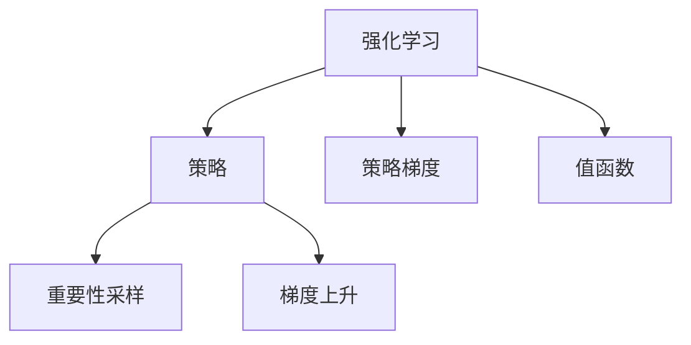

                 

# Policy Gradients原理与代码实例讲解

> 关键词：Policy Gradients, 强化学习, 深度学习, 神经网络, 梯度上升, 连续动作空间

## 1. 背景介绍

### 1.1 问题由来
强化学习（Reinforcement Learning, RL）是一种通过试错和反馈不断改进策略的学习方式。其核心思想是：一个智能体（agent）在特定环境中，通过执行一系列动作，最大化某种累积奖励（cumulative reward）。在RL中，智能体需要不断探索环境，学习最优策略，实现目标。

传统的RL方法通常使用Q-learning等基于值（value-based）的方法。但这些方法只能处理离散动作空间，难以处理高维连续动作空间。为了克服这一局限，研究者提出了一种基于策略（policy-based）的RL方法，即策略梯度方法（Policy Gradient Methods）。

### 1.2 问题核心关键点
政策梯度方法通过直接优化策略函数，而非值函数，能够处理连续动作空间。其核心思想是通过对策略函数的梯度上升，找到最优策略。在实际应用中，Policy Gradient方法广泛应用于机器人控制、自动驾驶、游戏AI等高维动作空间的任务。

Policy Gradient方法的主要难点在于如何估计策略函数的梯度。传统的梯度估计方法（如REINFORCE）直接通过逆传播计算梯度，时间复杂度高，难以扩展到大规模问题。为了解决这一问题，研究者引入了重要性采样（importance sampling）等技巧，进一步优化了梯度估计方法。

## 2. 核心概念与联系

### 2.1 核心概念概述

为更好地理解Policy Gradient方法，本节将介绍几个密切相关的核心概念：

- 强化学习（Reinforcement Learning, RL）：智能体在环境中通过执行一系列动作，最大化累积奖励的学习方式。
- 策略（Policy）：描述智能体在特定状态下，选择动作的概率分布。
- 策略梯度（Policy Gradient）：通过优化策略函数，找到最优策略的方法。
- 值函数（Value Function）：估计当前状态下，采取某种策略后的累积奖励。
- 重要性采样（Importance Sampling）：通过对采样数据进行加权，提升样本质量，降低估计偏差。
- 梯度上升（Gradient Ascent）：通过梯度信息指导策略更新，最大化累积奖励。

这些核心概念之间的逻辑关系可以通过以下Mermaid流程图来展示：



这个流程图展示了他强化学习、策略、策略梯度、值函数、重要性采样和梯度上升之间的联系：

1. 强化学习是策略梯度的基础，通过探索环境，累积奖励。
2. 策略描述智能体在特定状态下的动作选择。
3. 策略梯度是优化策略的方法，通过梯度信息指导策略更新。
4. 值函数用于估计累积奖励，指导策略更新。
5. 重要性采样通过对采样数据加权，提升样本质量。
6. 梯度上升通过梯度信息，指导策略更新。

这些概念共同构成了强化学习的基本框架，为策略梯度方法的应用提供了理论基础。

## 3. 核心算法原理 & 具体操作步骤
### 3.1 算法原理概述

Policy Gradient方法的核心思想是，通过直接优化策略函数，找到最优策略。其核心公式为：

$$
\theta^* = \mathop{\arg\max}_{\theta} \mathbb{E}_{(s_t, a_t) \sim \pi_{\theta}} [ \sum_{t=0}^T \gamma^t r_t ]
$$

其中 $\theta$ 为策略函数的参数，$\pi_{\theta}$ 为当前策略，$(s_t, a_t)$ 为当前状态和动作，$r_t$ 为当前奖励，$\gamma$ 为折扣因子。$\mathbb{E}$ 表示对策略 $\pi_{\theta}$ 下，所有可能的状态和动作序列的期望。

Policy Gradient方法的具体实现步骤如下：

1. 初始化策略函数参数 $\theta$。
2. 在当前策略 $\pi_{\theta}$ 下，执行一系列动作，并累积奖励。
3. 根据累积奖励和重要性采样权重，计算策略梯度 $g_{\theta}$。
4. 使用梯度上升算法，更新策略函数参数 $\theta$，使累积奖励最大化。

### 3.2 算法步骤详解

以连续动作空间的Policy Gradient方法为例，详细介绍其实现步骤：

**Step 1: 初始化策略函数参数**
- 选择合适的策略函数，如线性策略、神经网络策略等。
- 随机初始化策略函数的参数 $\theta$。

**Step 2: 累积奖励和采样**
- 执行模拟或真实环境中的动作序列，并计算累积奖励。
- 使用重要性采样技术，估算策略梯度的方差。

**Step 3: 计算策略梯度**
- 根据累积奖励和重要性采样权重，计算策略函数的梯度。
- 使用梯度上升算法，更新策略函数的参数。

**Step 4: 迭代优化**
- 重复上述步骤，直到达到预设的迭代次数或累积奖励不再提升。

### 3.3 算法优缺点

Policy Gradient方法的优点：

1. 直接优化策略，适合处理连续动作空间。
2. 能够处理多种奖励函数，适用于复杂决策问题。
3. 理论上能够得到最优策略，具有良好的收敛性。

其缺点：

1. 方差较大，计算成本高。
2. 对策略函数的选取敏感，需要精心设计。
3. 需要大量的训练数据，难以保证泛化性能。

### 3.4 算法应用领域

Policy Gradient方法广泛应用于强化学习中的高维动作空间问题，包括机器人控制、自动驾驶、游戏AI等。其优点在于能够处理复杂决策问题，实现智能体的自主决策。

在工业应用中，Policy Gradient方法也被用于优化生产流程、优化供应链、优化营销策略等，通过自动学习和优化，提升企业的运营效率和盈利能力。

## 4. 数学模型和公式 & 详细讲解 & 举例说明

### 4.1 数学模型构建

Policy Gradient方法的核心模型是策略函数 $\pi_{\theta}$，通常使用神经网络等函数逼近。其输入为状态 $s_t$，输出为动作 $a_t$ 的概率分布，形式如下：

$$
\pi_{\theta}(a_t | s_t) = \frac{\exp(\theta^T f(s_t))}{\sum_{a \in A} \exp(\theta^T f(s_t))}
$$

其中 $f(s_t)$ 为状态特征函数，$A$ 为动作空间。策略函数的参数 $\theta$ 需要通过梯度上升优化。

### 4.2 公式推导过程

在Policy Gradient方法中，我们通常使用蒙特卡洛方法（Monte Carlo）或重要性采样（Importance Sampling）来估算策略梯度。以蒙特卡洛方法为例，其策略梯度估计公式如下：

$$
g_{\theta} = \mathbb{E}_{(s_t, a_t) \sim \pi_{\theta}} [ \nabla_{\theta} \log \pi_{\theta}(a_t | s_t) r_t ]
$$

其中 $\nabla_{\theta} \log \pi_{\theta}(a_t | s_t)$ 为策略函数的log概率梯度，$r_t$ 为当前奖励。该公式表示，策略梯度等于累积奖励与log概率梯度的期望。

在实际计算中，我们使用梯度上升算法（如Adam）来更新策略函数的参数。具体来说，我们将策略梯度 $g_{\theta}$ 作为梯度上升的更新方向，从而优化策略函数 $\pi_{\theta}$。

### 4.3 案例分析与讲解

以最简单的线性策略为例，其形式如下：

$$
\pi_{\theta}(a_t | s_t) = \sigma(\theta^T s_t)
$$

其中 $\sigma(\cdot)$ 为sigmoid函数，$\theta$ 为策略参数。假设状态 $s_t$ 为一个一维向量，其形式为：

$$
s_t = [x_t, y_t]
$$

其中 $x_t$ 和 $y_t$ 分别为状态变量，如位置、速度等。

假设动作 $a_t$ 为一个连续的动作，如车子的转向角度。我们希望在特定的状态下，使车子能够最大化累积奖励。例如，在一个导航任务中，我们需要让车子沿着给定的路径行驶，避免碰撞障碍物。

我们可以将状态 $s_t$ 输入策略函数 $\pi_{\theta}$，输出动作 $a_t$ 的概率分布。然后通过蒙特卡洛方法或重要性采样技术，估算策略梯度 $g_{\theta}$，并使用梯度上升算法更新参数 $\theta$。通过反复迭代，逐步优化策略函数，使累积奖励最大化。

## 5. 项目实践：代码实例和详细解释说明
### 5.1 开发环境搭建

在进行Policy Gradient方法开发前，我们需要准备好开发环境。以下是使用Python进行TensorFlow开发的环境配置流程：

1. 安装Anaconda：从官网下载并安装Anaconda，用于创建独立的Python环境。

2. 创建并激活虚拟环境：
```bash
conda create -n tf-env python=3.8 
conda activate tf-env
```

3. 安装TensorFlow：根据CUDA版本，从官网获取对应的安装命令。例如：
```bash
conda install tensorflow tensorflow-gpu=2.6 -c tf
```

4. 安装相关库：
```bash
pip install gym matplotlib numpy gym-simulator
```

完成上述步骤后，即可在`tf-env`环境中开始Policy Gradient方法的开发。

### 5.2 源代码详细实现

下面我们以CartPole问题为例，给出使用TensorFlow进行Policy Gradient方法的代码实现。

首先，定义状态和动作空间：

```python
import tensorflow as tf
import numpy as np
import gym

env = gym.make('CartPole-v1')
state_dim = env.observation_space.shape[0]
action_dim = env.action_space.shape[0]
```

然后，定义策略函数：

```python
class Policy:
    def __init__(self, state_dim, action_dim, learning_rate=0.01):
        self.state_dim = state_dim
        self.action_dim = action_dim
        self.learning_rate = learning_rate
        self.theta = tf.Variable(tf.random.normal([state_dim, action_dim]))
    
    def log_prob(self, state):
        linear = tf.matmul(state, self.theta)
        return tf.nn.sigmoid(linear)
    
    def sample(self, state):
        linear = tf.matmul(state, self.theta)
        return tf.squeeze(tf.random.categorical(linear, num_samples=1))
```

接下来，定义Policy Gradient算法的训练函数：

```python
def train_policy(policy, max_episodes=500, max_steps_per_episode=100):
    for episode in range(max_episodes):
        state = env.reset()
        done = False
        rewards = []
        while not done:
            action = policy.sample(state)
            state, reward, done, _ = env.step(action)
            rewards.append(reward)
            policy.train(state, action, reward)
        print(f"Episode {episode+1}, reward: {sum(rewards)}")
```

最后，定义训练函数：

```python
def train(state, action, reward):
    log_prob = policy.log_prob(state)
    g = tf.gradients(tf.reduce_mean(log_prob * reward), policy.theta)[0]
    policy.theta.assign_add(policy.learning_rate * g)
```

### 5.3 代码解读与分析

让我们再详细解读一下关键代码的实现细节：

**Policy类**：
- `__init__`方法：初始化策略函数的参数 $\theta$，并设置学习率。
- `log_prob`方法：根据状态 $s_t$，计算动作 $a_t$ 的概率分布。
- `sample`方法：根据概率分布，随机采样一个动作。

**train_policy函数**：
- 循环执行多轮训练，模拟环境中的动作序列。
- 在每个时间步，根据状态 $s_t$ 和动作 $a_t$，计算累积奖励，并更新策略函数 $\theta$。
- 打印每轮训练的累积奖励。

**train函数**：
- 根据当前状态 $s_t$ 和动作 $a_t$，计算策略函数的梯度 $g_{\theta}$。
- 使用梯度上升算法更新策略函数的参数 $\theta$。

可以看到，Policy Gradient方法的核心在于策略函数的优化，通过累积奖励和策略梯度的结合，逐步提升策略函数的性能。开发者可以通过修改策略函数、调整学习率等超参数，来优化模型效果。

当然，工业级的系统实现还需考虑更多因素，如模型的保存和部署、超参数的自动搜索、更灵活的任务适配层等。但核心的Policy Gradient范式基本与此类似。

## 6. 实际应用场景
### 6.1 游戏AI

基于Policy Gradient方法的游戏AI，已经在游戏领域取得了显著成绩。例如，AlphaGo的胜利很大程度上得益于其Policy Gradient方法。AlphaGo通过深度强化学习，在围棋这一复杂策略游戏中，取得了超越人类的水平。

在具体实现中，AlphaGo通过神经网络逼近策略函数，并在大量围棋对局中不断优化策略。通过Policy Gradient方法，AlphaGo在复杂的围棋环境中，逐步学习到最优的落子策略，实现了从弱到强、自我提升的过程。

### 6.2 机器人控制

Policy Gradient方法在机器人控制领域也有广泛应用。例如，机器人需要通过执行一系列动作，最大化累积奖励。例如，在导航任务中，需要让机器人沿直线行走，避免碰到障碍物。

在实际应用中，可以通过机器人传感器获取当前状态，并输入到Policy Gradient模型中，输出一个动作概率分布。通过不断迭代优化，使机器人能够在复杂环境中，逐步学习到最优的行动策略，实现自主导航。

### 6.3 供应链优化

在供应链优化领域，Policy Gradient方法也被用于优化生产流程、降低成本、提高效率。例如，在物流配送中，需要考虑运输成本、时间等因素，找到最优的运输方案。

通过定义状态和动作，可以使用Policy Gradient方法，优化运输方案，最大化累积奖励。具体来说，状态可以包括当前货物的数量、位置等信息，动作可以包括运输方向、速度等。通过优化策略函数，逐步学习到最优的运输方案，实现供应链优化。

## 7. 工具和资源推荐
### 7.1 学习资源推荐

为了帮助开发者系统掌握Policy Gradient方法的理论基础和实践技巧，这里推荐一些优质的学习资源：

1. 《深度学习》书籍：Ian Goodfellow所著，全面介绍了深度学习的基本概念和算法，包括强化学习的内容。
2. 《强化学习》课程：斯坦福大学开设的CS234课程，由Richard Sutton和Andrew Ng主讲，深入浅出地介绍了强化学习的基本原理和算法。
3. 《Python深度学习》书籍：François Chollet所著，详细介绍了如何使用TensorFlow和Keras进行深度学习开发，包括Policy Gradient方法的应用。
4. 《强化学习：算法、框架与实践》书籍：Omar Syed Anwar所著，介绍了强化学习的主要算法和工具，并提供了丰富的代码实例。
5. 《Deep Reinforcement Learning for Agents》课程：DeepMind组织的在线课程，涵盖强化学习的主要算法和技术，适合深度学习从业者学习。

通过对这些资源的学习实践，相信你一定能够快速掌握Policy Gradient方法的核心思想和实现细节。

### 7.2 开发工具推荐

高效的开发离不开优秀的工具支持。以下是几款用于Policy Gradient方法开发的常用工具：

1. TensorFlow：由Google主导开发的深度学习框架，支持大规模工程应用，适合分布式训练和部署。
2. Keras：基于TensorFlow的高层API，提供了简洁易用的接口，适合快速迭代研究。
3. OpenAI Gym：开源的强化学习环境库，包含大量游戏和模拟环境，适合进行模型测试和评估。
4. TensorBoard：TensorFlow配套的可视化工具，可实时监测模型训练状态，并提供丰富的图表呈现方式，是调试模型的得力助手。
5. Weights & Biases：模型训练的实验跟踪工具，可以记录和可视化模型训练过程中的各项指标，方便对比和调优。

合理利用这些工具，可以显著提升Policy Gradient方法的开发效率，加快创新迭代的步伐。

### 7.3 相关论文推荐

Policy Gradient方法的研究历史悠久，近年来也有许多重要的论文。以下是几篇奠基性的相关论文，推荐阅读：

1. Introduction to Reinforcement Learning（Sutton & Barto）：深度介绍了强化学习的基本概念和算法，包括Policy Gradient方法。
2. Policy Gradient Methods for Reinforcement Learning with Function Approximation（Williams）：首次提出了Policy Gradient方法，并给出了详细的数学推导。
3. Deep Reinforcement Learning using Neural Networks（Sukhbaatar et al.）：详细介绍了使用深度神经网络进行Policy Gradient方法的应用，取得了多项SOTA。
4. Trust Region Policy Optimization（Schmidhuber & Wang）：提出了Trust Region Policy Optimization（TRPO）算法，进一步提升了Policy Gradient方法的稳定性和收敛性。
5. Proximal Policy Optimization（Schmidhuber & Wang）：提出了Proximal Policy Optimization（PPO）算法，进一步提升了Policy Gradient方法的效率和稳定性。

这些论文代表了大语言模型微调技术的发展脉络。通过学习这些前沿成果，可以帮助研究者把握学科前进方向，激发更多的创新灵感。

## 8. 总结：未来发展趋势与挑战

### 8.1 总结

本文对Policy Gradient方法进行了全面系统的介绍。首先阐述了Policy Gradient方法在强化学习中的重要地位，明确了其在处理高维连续动作空间中的优势。其次，从原理到实践，详细讲解了Policy Gradient方法的数学模型和实现细节，给出了Policy Gradient方法在实际应用中的完整代码实例。同时，本文还广泛探讨了Policy Gradient方法在游戏AI、机器人控制、供应链优化等众多领域的应用前景，展示了其巨大的潜力。此外，本文精选了Policy Gradient方法的各类学习资源，力求为读者提供全方位的技术指引。

通过本文的系统梳理，可以看到，Policy Gradient方法在强化学习中的应用已经十分广泛，能够处理复杂决策问题，实现智能体的自主决策。Policy Gradient方法不仅在游戏AI中取得了卓越的成绩，还逐渐被应用于机器人控制、供应链优化等多个领域，展现了其强大的应用潜力。未来，随着技术的发展，Policy Gradient方法将会有更多的创新应用，为人工智能技术的落地带来新的突破。

### 8.2 未来发展趋势

展望未来，Policy Gradient方法将呈现以下几个发展趋势：

1. 深度学习与强化学习的融合。通过引入深度神经网络，Policy Gradient方法能够更好地处理高维连续动作空间，提升智能体的决策能力。
2. 分布式训练和加速。随着模型规模的扩大，单机的训练效率逐渐成为瓶颈。分布式训练和加速技术的应用，将使Policy Gradient方法在大规模问题上更高效、更稳定。
3. 多代理系统的应用。通过构建多代理系统，Policy Gradient方法能够更好地处理分布式决策问题，提升系统的协作和协调能力。
4. 多任务学习的应用。通过多任务学习，Policy Gradient方法能够更好地优化策略，提升智能体的泛化性能。
5. 与环境模型结合。通过引入环境模型，Policy Gradient方法能够更好地优化策略，提升智能体的鲁棒性和可靠性。

以上趋势凸显了Policy Gradient方法在强化学习中的广阔前景。这些方向的探索发展，必将进一步提升强化学习系统的性能和应用范围，为人工智能技术的落地带来新的突破。

### 8.3 面临的挑战

尽管Policy Gradient方法已经取得了瞩目成就，但在迈向更加智能化、普适化应用的过程中，它仍面临着诸多挑战：

1. 计算成本高昂。模型规模的扩大，导致训练和推理成本急剧增加。如何在保持高精度的同时，提高计算效率，是一个亟待解决的问题。
2. 模型稳定性不足。在面对复杂、动态的环境时，模型容易发生不稳定和崩溃。如何提高模型的鲁棒性，确保其在各种环境中的稳定性，还需要更多的研究。
3. 可解释性不足。Policy Gradient方法通常被视为"黑盒"系统，难以解释其内部工作机制和决策逻辑。如何赋予模型更强的可解释性，将是亟待解决的问题。
4. 泛化能力受限。当前的政策方法通常在特定任务上效果显著，但在新任务上的泛化能力较弱。如何提高模型在不同任务上的泛化能力，还需要更多的研究。
5. 数据获取困难。在复杂的决策问题中，高质量的数据获取成本较高。如何降低数据获取的难度，提高数据的可获取性，还需要更多的创新。

这些挑战凸显了Policy Gradient方法在应用中的局限性。未来需要更多的研究，探索新的算法和模型结构，以克服这些挑战，推动Policy Gradient方法在实际应用中的进一步发展。

### 8.4 研究展望

面对Policy Gradient方法面临的种种挑战，未来的研究需要在以下几个方面寻求新的突破：

1. 探索新的深度强化学习方法。通过引入深度神经网络，提升Policy Gradient方法的处理能力和泛化性能。
2. 研究新的分布式训练技术。通过分布式训练和加速技术，提升模型在大规模问题上的效率和稳定性。
3. 引入环境模型和约束条件。通过引入环境模型和约束条件，提高模型的鲁棒性和可靠性。
4. 探索多任务学习的方法。通过多任务学习，提升模型的泛化能力和可解释性。
5. 引入模型压缩和稀疏化技术。通过模型压缩和稀疏化技术，提升模型的计算效率和可扩展性。

这些研究方向的探索，必将引领Policy Gradient方法在强化学习中的应用走向更高的台阶，为人工智能技术的落地带来新的突破。只有勇于创新、敢于突破，才能不断拓展强化学习模型的边界，让智能技术更好地造福人类社会。

## 9. 附录：常见问题与解答

**Q1：Policy Gradient方法是否适用于所有强化学习任务？**

A: Policy Gradient方法通常适用于高维连续动作空间的任务，如游戏AI、机器人控制等。但对于一些离散动作空间的任务，如棋类游戏，其效果可能不如基于值的方法。此外，对于动态环境、不确定性较高的任务，其效果也较差。

**Q2：如何选择状态特征函数？**

A: 选择状态特征函数需要根据具体任务和环境特点进行设计。通常使用经验方法，如提取关键状态变量、使用卷积神经网络等。例如，在导航任务中，状态特征函数可以包括位置、速度、角度等。

**Q3：如何提高模型的可解释性？**

A: 提高模型的可解释性可以通过多种方式，如使用简单的策略函数、增加模型透明度等。例如，在简单的线性策略中，可以手动分析策略函数的输出，理解模型决策过程。此外，使用可解释的模型结构，如决策树、线性回归等，也能提升模型的可解释性。

**Q4：如何解决模型的不稳定性？**

A: 解决模型的不稳定性需要从多个方面入手。例如，使用正则化技术、优化算法等。此外，可以通过分布式训练、模型压缩等技术，提升模型的鲁棒性和可靠性。在实际应用中，需要根据具体情况进行优化。

**Q5：如何处理高维连续动作空间？**

A: 处理高维连续动作空间是Policy Gradient方法的一大挑战。一种常用方法是使用深度神经网络逼近策略函数。此外，使用基于分布式优化的算法，如TRPO、PPO等，也可以提升模型在复杂环境中的稳定性和收敛性。

这些解答为读者提供了一些实际的指导，帮助他们更好地理解Policy Gradient方法的应用。在实际应用中，开发者需要根据具体任务和环境，灵活应用这些方法，以实现最优的策略优化。

---

作者：禅与计算机程序设计艺术 / Zen and the Art of Computer Programming

