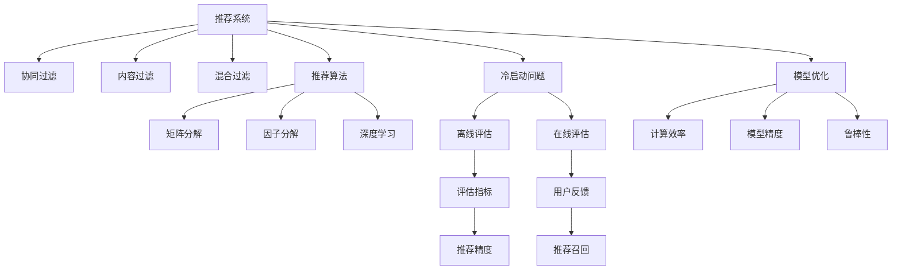

                 

# Python机器学习实战：推荐系统的原理与实现方法

> 关键词：推荐系统,协同过滤,内容过滤,混合过滤,冷启动问题,模型评估,算法优化

## 1. 背景介绍

### 1.1 问题由来
在信息爆炸的互联网时代，面对海量的内容，如何为用户推荐其感兴趣的信息，成为各行各业亟待解决的问题。推荐系统正是为了解决这个问题而产生，通过分析用户的喜好和行为，帮助用户在海量数据中快速找到所需内容，提升用户体验。

随着大数据和深度学习技术的发展，推荐系统从传统的基于规则的推荐，逐步转向了基于机器学习的推荐，并涌现出协同过滤、内容过滤、混合过滤等多种先进的推荐算法。

### 1.2 问题核心关键点
推荐系统的主要任务是从大量数据中预测用户对特定内容的评分或偏好，从而实现个性化推荐。其核心包括以下几个关键点：
1. 用户行为数据：包括浏览历史、购买历史、评分记录等。
2. 物品特征数据：包括标题、描述、标签等。
3. 推荐算法：从用户行为和物品特征中学习用户和物品的相似性，计算用户对物品的评分预测，并选择推荐物品。
4. 系统评估：通过离线实验和在线评估，评估推荐系统的效果，调整模型参数。

### 1.3 问题研究意义
推荐系统的研究，对于提升用户体验、优化资源配置、推动信息传播具有重要意义：

1. 提升用户体验：精准推荐系统能够根据用户的个性化需求，快速推送相关内容，提高用户满意度和忠诚度。
2. 优化资源配置：推荐系统能够合理分配有限的带宽、广告位等资源，最大化广告收益。
3. 推动信息传播：精准推荐系统能够迅速传播优质内容，减少内容生产者的时间成本，提升信息传播效率。

## 2. 核心概念与联系

### 2.1 核心概念概述

为更好地理解推荐系统的核心算法，本节将介绍几个密切相关的核心概念：

- 推荐系统(Recommender System)：基于用户和物品数据，通过模型预测用户对物品的评分，推荐给用户感兴趣的内容的系统。
- 协同过滤(Collaborative Filtering)：通过分析用户之间的相似性、物品之间的相似性，推荐与用户/物品相似的其他用户/物品。
- 内容过滤(Content-Based Filtering)：通过分析物品的属性、特征，找到与用户兴趣相似的物品进行推荐。
- 混合过滤(Hybrid Filtering)：结合协同过滤和内容过滤，综合利用用户行为数据和物品特征数据进行推荐。
- 推荐算法(Recommendation Algorithms)：具体实现推荐系统的算法，包括矩阵分解、因子分解、深度学习等。
- 冷启动问题(Cold Start Problem)：新用户/物品加入系统时，由于缺乏足够的历史数据，推荐系统难以推荐。
- 模型评估(Model Evaluation)：评估推荐系统性能的指标，如准确率、召回率、覆盖率等。
- 算法优化(Algorithm Optimization)：针对特定问题进行算法优化，如计算效率、模型精度、鲁棒性等。

这些概念之间的逻辑关系可以通过以下Mermaid流程图来展示：



这个流程图展示推荐系统的核心概念及其之间的关系：

1. 推荐系统通过协同过滤、内容过滤、混合过滤等多种方式进行推荐。
2. 推荐算法包括矩阵分解、因子分解、深度学习等，用于实现推荐逻辑。
3. 冷启动问题需要通过离线评估和在线评估来改进推荐模型。
4. 模型评估通过准确率、召回率、覆盖率等指标来衡量推荐系统性能。
5. 算法优化涉及计算效率、模型精度和鲁棒性等多个方面。

这些概念共同构成了推荐系统的学习和应用框架，使其能够为不同的应用场景提供个性化的信息推荐。通过理解这些核心概念，我们可以更好地把握推荐系统的原理和优化方向。

## 3. 核心算法原理 & 具体操作步骤
### 3.1 算法原理概述

推荐系统的核心思想是，通过用户和物品的评分矩阵，学习用户和物品的相似性，计算用户对物品的评分预测，从而实现个性化推荐。

形式化地，假设用户-物品评分矩阵为 $M_{U \times I}$，用户集合为 $U$，物品集合为 $I$。推荐系统通过模型 $F$ 对用户 $u$ 对物品 $i$ 的评分 $M_{ui}$ 进行预测，即 $F(u,i)$，然后根据预测评分进行排序，推荐给用户 $u$ 的前 $k$ 个物品。

推荐系统的算法流程如下：
1. 收集用户和物品的数据。
2. 构建用户-物品评分矩阵 $M$。
3. 选择推荐算法 $F$，计算预测评分。
4. 对预测评分进行排序，选择推荐物品。
5. 评估推荐系统性能，优化模型参数。

### 3.2 算法步骤详解

推荐系统的算法实现，包括数据准备、模型训练、推荐计算和系统评估等步骤。

**Step 1: 数据准备**
- 收集用户和物品数据，包括用户ID、物品ID、评分等。
- 进行数据清洗和预处理，包括缺失值填充、特征工程等。

**Step 2: 模型训练**
- 选择合适的推荐算法 $F$，如矩阵分解、因子分解、深度学习等。
- 根据评分矩阵 $M$，训练模型 $F$，得到预测评分模型。
- 使用交叉验证等技术，评估模型性能。

**Step 3: 推荐计算**
- 根据用户 $u$ 的历史行为，输入预测评分模型 $F$，计算用户对物品的预测评分。
- 根据预测评分排序，选择推荐物品。

**Step 4: 系统评估**
- 在验证集和测试集上评估推荐系统的性能，计算准确率、召回率、覆盖率等指标。
- 根据评估结果，调整模型参数，优化推荐系统。

### 3.3 算法优缺点

推荐系统的推荐算法具有以下优点：
1. 个性化推荐：基于用户历史行为，提供个性化推荐，提升用户体验。
2. 自动化推荐：推荐系统能够自动化、实时化地进行推荐，减少人工干预。
3. 效率高：基于计算模型，推荐过程快速，适合大规模应用。

同时，推荐系统也存在一定的局限性：
1. 数据质量要求高：推荐系统的效果高度依赖于数据质量和完整性。
2. 冷启动问题：新用户/物品加入系统时，缺乏足够的历史数据，推荐效果不佳。
3. 鲁棒性差：推荐模型容易受到异常数据、噪音数据的影响，导致推荐结果偏差。
4. 可解释性不足：推荐系统的推荐逻辑难以解释，用户难以理解推荐原因。

尽管存在这些局限性，但就目前而言，推荐系统已成为个性化推荐的重要手段，广泛应用于电子商务、社交网络、新闻阅读等领域。

### 3.4 算法应用领域

推荐系统的推荐算法已经被广泛应用于各个领域：

- 电子商务：如亚马逊、淘宝等电商平台，通过推荐系统推荐商品，提升用户体验和销售量。
- 社交网络：如Facebook、Twitter等，通过推荐系统推荐内容，增加用户黏性和活跃度。
- 新闻阅读：如今日头条、澎湃新闻等，通过推荐系统推荐新闻，提高新闻阅读量和用户满意度。
- 视频平台：如YouTube、Netflix等，通过推荐系统推荐视频内容，提升用户观看体验和平台留存率。
- 音乐平台：如Spotify、网易云音乐等，通过推荐系统推荐音乐，增加音乐播放量和用户黏性。

除了以上常见场景外，推荐系统还在新闻订阅、金融投资、旅游出行等领域有广泛应用。

## 4. 数学模型和公式 & 详细讲解 & 举例说明

### 4.1 数学模型构建

本节将使用数学语言对推荐系统的核心算法进行更加严格的刻画。

假设推荐系统有 $U$ 个用户，$I$ 个物品，用户对物品的评分矩阵为 $M_{U \times I}$。设用户 $u$ 对物品 $i$ 的预测评分模型为 $F(u,i)$，其中 $F$ 为推荐算法。

推荐系统的目标是最小化预测评分与实际评分之间的误差，即：

$$
\min_{F} \sum_{u,i} (M_{ui}-F(u,i))^2
$$

根据矩阵分解算法，可以将评分矩阵 $M$ 分解为两个低维矩阵的乘积，即：

$$
M = \hat{P} \hat{Q}
$$

其中 $\hat{P} \in \mathbb{R}^{U \times k}$ 和 $\hat{Q} \in \mathbb{R}^{k \times I}$ 分别为用户特征矩阵和物品特征矩阵。

### 4.2 公式推导过程

以下我们以矩阵分解为例，推导推荐系统的评分预测公式。

设用户特征矩阵为 $\hat{P}$，物品特征矩阵为 $\hat{Q}$，则用户 $u$ 对物品 $i$ 的预测评分 $F(u,i)$ 为：

$$
F(u,i) = \hat{P}_u \hat{Q}_i = \sum_{k=1}^{k} \hat{P}_{uk} \hat{Q}_{ik}
$$

其中 $\hat{P}_u$ 表示用户特征矩阵的第 $u$ 行向量，$\hat{Q}_i$ 表示物品特征矩阵的第 $i$ 列向量。

假设预测评分 $F(u,i)$ 与实际评分 $M_{ui}$ 的误差为 $e(u,i)$，则推荐系统的目标函数为：

$$
\min_{\hat{P},\hat{Q}} \sum_{u,i} (M_{ui}-F(u,i))^2 = \min_{\hat{P},\hat{Q}} \sum_{u,i} (M_{ui}-\sum_{k=1}^{k} \hat{P}_{uk} \hat{Q}_{ik})^2
$$

通过矩阵乘法展开，并简化得到：

$$
\min_{\hat{P},\hat{Q}} \sum_{u,i} (M_{ui}-\hat{P}_u \hat{Q}_i)^2 = \min_{\hat{P},\hat{Q}} \text{tr}((M-\hat{P} \hat{Q})^T (M-\hat{P} \hat{Q}))
$$

根据矩阵分解的性质，上述优化问题可以进一步转化为奇异值分解(SVD)的求解过程，从而得到用户特征矩阵 $\hat{P}$ 和物品特征矩阵 $\hat{Q}$。

## 5. 项目实践：代码实例和详细解释说明
### 5.1 开发环境搭建

在进行推荐系统开发前，我们需要准备好开发环境。以下是使用Python进行Scikit-learn开发的环境配置流程：

1. 安装Anaconda：从官网下载并安装Anaconda，用于创建独立的Python环境。

2. 创建并激活虚拟环境：
```bash
conda create -n recommender-env python=3.8 
conda activate recommender-env
```

3. 安装Scikit-learn：
```bash
pip install scikit-learn
```

4. 安装NumPy和Pandas：
```bash
pip install numpy pandas
```

5. 安装TensorBoard：
```bash
pip install tensorboard
```

6. 安装PyTorch：
```bash
pip install torch torchvision torchaudio
```

完成上述步骤后，即可在`recommender-env`环境中开始推荐系统开发。

### 5.2 源代码详细实现

下面我们以协同过滤为例，给出使用Scikit-learn进行推荐系统开发的PyTorch代码实现。

首先，定义推荐系统的数据处理函数：

```python
import pandas as pd
from scipy.sparse import csr_matrix

def load_data(file_path):
    data = pd.read_csv(file_path, sep='\t')
    return data.pivot_table(index='user', columns='item', values='rating', fill_value=0).to_coo()

def save_matrix(file_path, matrix):
    matrix.tofile(file_path)
```

然后，定义推荐模型的训练和评估函数：

```python
from sklearn.metrics import accuracy_score, precision_score, recall_score, f1_score
from sklearn.decomposition import TruncatedSVD
from sklearn.model_selection import train_test_split
from sklearn.preprocessing import Normalizer
from sklearn.metrics.pairwise import cosine_similarity

def train_model(X, y, num_factors):
    X = TruncatedSVD(n_components=num_factors, random_state=42).fit_transform(X)
    X = Normalizer().fit_transform(X)
    Y = cosine_similarity(X, y)
    return X, Y

def evaluate_model(X, Y, test_X):
    Y_pred = cosine_similarity(X, test_X)
    accuracy = accuracy_score(y_true, Y_pred)
    precision = precision_score(y_true, Y_pred)
    recall = recall_score(y_true, Y_pred)
    f1 = f1_score(y_true, Y_pred)
    return accuracy, precision, recall, f1

def predict_item(X, Y, item):
    Y_pred = cosine_similarity(X, Y[:, item])
    return Y_pred
```

接着，启动训练流程并在测试集上评估：

```python
num_factors = 20

# 加载数据
data = load_data('ratings.csv')
X = data.values

# 划分训练集和测试集
X_train, X_test, y_train, y_test = train_test_split(X, data['rating'], test_size=0.2, random_state=42)

# 训练模型
X_train, Y_train = train_model(X_train, y_train, num_factors)
X_test, Y_test = train_model(X_test, y_test, num_factors)

# 评估模型
accuracy, precision, recall, f1 = evaluate_model(X_train, Y_train, X_test)

# 预测物品评分
item = 1
Y_pred = predict_item(X_train, Y_train, item)

print(f"Accuracy: {accuracy:.3f}")
print(f"Precision: {precision:.3f}")
print(f"Recall: {recall:.3f}")
print(f"F1 Score: {f1:.3f}")
print(f"Item {item} Predictions: {Y_pred}")
```

以上就是使用Scikit-learn进行协同过滤推荐系统开发的完整代码实现。可以看到，Scikit-learn提供了丰富的推荐算法和评估指标，使得推荐系统的开发和评估变得简单易行。

### 5.3 代码解读与分析

让我们再详细解读一下关键代码的实现细节：

**load_data函数**：
- 加载评分数据文件，使用Pandas进行数据处理，生成稀疏矩阵。

**train_model函数**：
- 使用TruncatedSVD进行矩阵分解，得到用户特征矩阵 $X$ 和物品特征矩阵 $Y$。
- 对特征矩阵进行归一化，计算用户和物品之间的余弦相似度矩阵 $Y$。

**evaluate_model函数**：
- 计算推荐系统在不同指标上的表现，返回准确率、精度、召回率和F1分数。

**predict_item函数**：
- 计算测试集上指定物品的预测评分，返回预测结果。

**train流程**：
- 划分训练集和测试集。
- 训练模型，生成用户特征矩阵 $X$ 和物品特征矩阵 $Y$。
- 在测试集上评估模型性能，输出评估结果。
- 预测指定物品的评分。

可以看到，Scikit-learn提供的推荐算法简单易用，适合快速原型开发和系统验证。

## 6. 实际应用场景
### 6.1 推荐广告

推荐广告是推荐系统的重要应用场景之一。广告主通过投放精准的广告，吸引目标用户点击和转化。推荐系统能够根据用户历史行为和兴趣，推荐用户可能感兴趣的广告，提高广告点击率和转化率。

在技术实现上，可以收集用户的浏览历史、点击历史、购买历史等数据，训练推荐模型，根据模型预测用户对各个广告的评分，选择评分最高的广告进行展示。同时，可以通过A/B测试等方法，不断优化广告推荐策略，提升广告效果。

### 6.2 新闻推荐

新闻推荐系统通过分析用户的历史阅读记录和评分，推荐用户感兴趣的新闻内容，增加用户的阅读量和留存率。新闻平台通过推荐系统，能够将优质新闻内容精准推送给用户，提高新闻的曝光率和点击率。

在技术实现上，可以收集用户的阅读历史、评分数据，训练推荐模型，根据模型预测用户对不同新闻的评分，选择评分最高的新闻进行推荐。同时，可以通过实时监控用户反馈，不断优化推荐策略，提升用户满意度。

### 6.3 商品推荐

商品推荐系统是电商平台的核心功能之一，通过推荐系统，电商平台能够精准推荐商品，提高用户购买率和销售量。

在技术实现上，可以收集用户的浏览历史、购买历史、评分数据，训练推荐模型，根据模型预测用户对不同商品的评分，选择评分最高的商品进行推荐。同时，可以通过A/B测试等方法，不断优化推荐策略，提升用户购买转化率。

### 6.4 未来应用展望

随着推荐系统的发展，未来将有更多创新应用场景涌现，以下是几个值得关注的方向：

1. 跨领域推荐：推荐系统不仅能在同一领域内进行推荐，还能跨领域进行推荐，如电商、新闻、视频等。通过多领域数据融合，推荐系统能够提供更加全面、多样化的推荐内容。

2. 实时推荐：推荐系统能够实时处理用户数据，动态更新推荐内容。通过流式计算、缓存技术等手段，推荐系统能够实现低延迟、高效率的推荐。

3. 联邦推荐：推荐系统通过联邦学习技术，能够在不暴露用户隐私的前提下，联合多个数据源进行推荐。联邦学习在保护隐私的同时，也能够提升推荐系统的性能。

4. 基于深度学习的推荐：深度学习技术在推荐系统中得到了广泛应用，未来将继续探索更加高效、鲁棒的深度学习推荐算法。

5. 集成推荐：推荐系统能够集成多种推荐算法，如协同过滤、内容过滤、混合过滤等，综合利用不同算法的优势，提升推荐效果。

## 7. 工具和资源推荐
### 7.1 学习资源推荐

为了帮助开发者系统掌握推荐系统的理论基础和实践技巧，这里推荐一些优质的学习资源：

1. 《推荐系统实践》书籍：介绍推荐系统的基本概念和实现方法，适合初学者入门。

2. 《深度学习推荐系统》课程：由清华大学开设的推荐系统课程，涵盖推荐系统基础和前沿技术。

3. 《TensorFlow推荐系统》书籍：介绍TensorFlow在推荐系统中的应用，包括模型训练、评估和优化。

4. 《推荐系统算法与实践》博客：系统讲解推荐系统的算法实现，适合进阶学习者。

5. Kaggle推荐系统竞赛：参与Kaggle推荐系统竞赛，实战练习推荐算法，积累项目经验。

通过对这些资源的学习实践，相信你一定能够快速掌握推荐系统的精髓，并用于解决实际的推荐问题。

### 7.2 开发工具推荐

高效的开发离不开优秀的工具支持。以下是几款用于推荐系统开发的常用工具：

1. Scikit-learn：Python的机器学习库，提供丰富的推荐算法和评估指标，适合快速原型开发。

2. TensorFlow：由Google主导的深度学习框架，支持大规模分布式训练，适合复杂模型开发。

3. PyTorch：由Facebook主导的深度学习框架，灵活高效，适合动态图开发。

4. Jupyter Notebook：Python的数据分析环境，支持代码和文档的交互式开发，适合快速迭代。

5. H2O.ai：开源的机器学习平台，支持推荐系统的快速搭建和部署。

合理利用这些工具，可以显著提升推荐系统的开发效率，加快创新迭代的步伐。

### 7.3 相关论文推荐

推荐系统的研究源于学界的持续研究。以下是几篇奠基性的相关论文，推荐阅读：

1. The Bellkamp-LeCun Algorithm：提出基于协同过滤的推荐算法，为推荐系统奠定了基础。

2. Fast Matrix Factorization Techniques for Recommender Systems：提出矩阵分解算法，提高推荐系统的计算效率。

3. A Factorization Approach for Matrix Data：提出因子分解算法，提升推荐系统的模型精度。

4. Music Recommendation with Transfer Matrix Factorization：提出转移矩阵分解算法，解决冷启动问题。

5. Deep Collaborative Filtering：提出深度学习推荐算法，提高推荐系统的鲁棒性和泛化能力。

这些论文代表了大推荐系统的发展脉络。通过学习这些前沿成果，可以帮助研究者把握学科前进方向，激发更多的创新灵感。

## 8. 总结：未来发展趋势与挑战

### 8.1 总结

本文对推荐系统的核心算法进行了全面系统的介绍。首先阐述了推荐系统的研究背景和意义，明确了推荐系统在个性化推荐、资源优化、信息传播等方面的重要作用。其次，从原理到实践，详细讲解了推荐系统的数学模型和算法流程，给出了推荐系统开发的完整代码实例。同时，本文还广泛探讨了推荐系统在推荐广告、新闻推荐、商品推荐等多个行业领域的应用前景，展示了推荐系统的广泛应用价值。此外，本文精选了推荐系统的各类学习资源，力求为读者提供全方位的技术指引。

通过本文的系统梳理，可以看到，推荐系统在数据驱动的互联网时代，具有重要的应用价值，正逐步成为各行各业标配的推荐引擎。未来，伴随推荐算法的发展和应用场景的拓展，推荐系统必将在更多领域得到应用，为社会经济发展带来更强的推动力。

### 8.2 未来发展趋势

展望未来，推荐系统的研究将呈现以下几个发展趋势：

1. 深度学习推荐：基于深度神经网络，推荐系统能够更好地捕捉用户行为和物品特征，提升推荐效果。

2. 联邦推荐：通过联邦学习技术，推荐系统能够在不暴露用户隐私的前提下，联合多个数据源进行推荐，提升推荐性能。

3. 跨领域推荐：推荐系统能够跨领域进行推荐，如电商、新闻、视频等，为用户提供更加全面、多样化的推荐内容。

4. 实时推荐：推荐系统能够实时处理用户数据，动态更新推荐内容，提高推荐效率。

5. 集成推荐：推荐系统能够集成多种推荐算法，综合利用不同算法的优势，提升推荐效果。

6. 安全性与隐私保护：推荐系统需要重视用户隐私保护，避免数据泄露和滥用。

这些趋势凸显了推荐系统的广阔前景，预示着推荐系统在智能化、个性化、跨领域推荐等方面的发展潜力。

### 8.3 面临的挑战

尽管推荐系统取得了显著的成果，但在迈向更加智能化、普适化应用的过程中，它仍面临着诸多挑战：

1. 数据质量与数据量：推荐系统的性能高度依赖于数据质量和数据量，数据收集和清洗过程繁琐，数据不完整或噪音数据会影响推荐效果。

2. 冷启动问题：新用户/物品加入系统时，缺乏足够的历史数据，推荐系统难以推荐。

3. 模型鲁棒性：推荐模型容易受到异常数据、噪音数据的影响，导致推荐结果偏差。

4. 系统效率：推荐系统需要处理大规模数据，计算资源消耗较大，推荐效率有待提高。

5. 用户隐私：推荐系统需要收集用户数据，如何在保护用户隐私的前提下进行推荐，成为重要挑战。

6. 可解释性：推荐系统的推荐逻辑难以解释，用户难以理解推荐原因。

这些挑战需要未来的研究进一步探索和突破，才能推动推荐系统的成熟与发展。

### 8.4 研究展望

面对推荐系统所面临的挑战，未来的研究需要在以下几个方面寻求新的突破：

1. 探索更加高效、鲁棒的推荐算法：如深度学习、联邦学习等，提高推荐系统的模型精度和泛化能力。

2. 解决冷启动问题：如基于用户行为、物品属性的推荐方法，提升新用户/物品的推荐效果。

3. 提升系统效率：如模型剪枝、量化加速等技术，减少计算资源消耗，提升推荐效率。

4. 保护用户隐私：如差分隐私技术，保护用户数据隐私，避免数据泄露和滥用。

5. 提升推荐可解释性：如基于因果推断、逻辑回归等技术，提高推荐系统的可解释性，增强用户信任。

这些研究方向的探索，必将引领推荐系统走向更高的台阶，为构建智能化、个性化、可信的推荐系统铺平道路。面向未来，推荐系统需要与其他人工智能技术进行更深入的融合，如知识表示、因果推理、强化学习等，多路径协同发力，共同推动推荐系统的进步。只有勇于创新、敢于突破，才能不断拓展推荐系统的边界，让推荐系统更好地服务于社会和用户。

## 9. 附录：常见问题与解答

**Q1：推荐系统是否可以用于所有业务场景？**

A: 推荐系统在数据驱动的互联网时代，具有重要的应用价值，适用于大多数业务场景。但需要根据具体业务需求，选择合适的推荐算法和评估指标。

**Q2：如何衡量推荐系统的性能？**

A: 推荐系统的性能评估通常使用准确率、召回率、覆盖率、F1分数等指标。通过离线实验和在线评估，可以全面评估推荐系统的性能，调整模型参数。

**Q3：推荐系统如何应对数据质量问题？**

A: 推荐系统的性能高度依赖于数据质量和数据量，数据收集和清洗过程繁琐。建议进行数据预处理，如缺失值填充、异常值检测、特征工程等，提高数据质量。

**Q4：推荐系统如何解决冷启动问题？**

A: 推荐系统可以通过基于用户行为、物品属性的推荐方法，解决新用户/物品的推荐问题。如基于协同过滤的推荐方法，可以利用用户相似性和物品相似性进行推荐。

**Q5：推荐系统如何保护用户隐私？**

A: 推荐系统需要重视用户隐私保护，采用差分隐私技术，保护用户数据隐私，避免数据泄露和滥用。同时，需要设置合理的权限控制，确保数据使用的合规性。

综上所述，推荐系统在互联网时代的个性化推荐、资源优化、信息传播等方面具有重要应用价值，通过选择合适的算法和评估指标，可以有效提升推荐效果。未来，伴随推荐算法的发展和应用场景的拓展，推荐系统必将在更多领域得到应用，为社会经济发展带来更强的推动力。

作者：禅与计算机程序设计艺术 / Zen and the Art of Computer Programming

