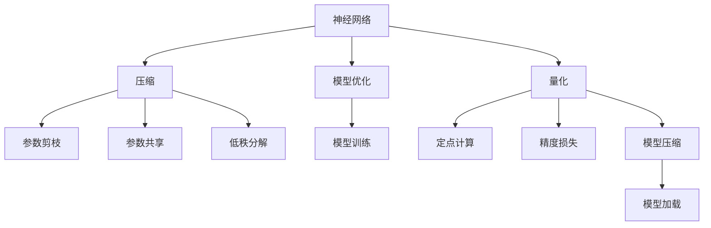

                 

# Python深度学习实践：神经网络的量化和压缩

> 关键词：神经网络,量化压缩,深度学习,模型优化,计算效率,内存优化

## 1. 背景介绍

### 1.1 问题由来
在深度学习的应用过程中，神经网络模型的计算复杂度和存储需求逐渐成为瓶颈。大模型尤其是深度神经网络，往往需要极高的计算资源和存储空间，这不仅增加了训练和推理的成本，还带来了能耗和延迟问题，制约了深度学习技术的实际部署和应用。

为解决这些问题，量化和压缩技术应运而生。量化通过将高精度浮点数转换为低精度整数或定点数，大幅减少模型参数的存储空间和计算复杂度。压缩则通过模型剪枝、参数共享、低秩分解等手段，去除冗余参数和计算，使模型更加轻量级、高效。

量化和压缩技术的结合，为深度学习模型的应用打开了新的思路，使得资源受限的设备如移动设备、嵌入式系统也能高效运行深度学习算法。本文将系统介绍量化和压缩技术，并给出实用的代码实例，帮助读者快速掌握神经网络的优化方法。

## 2. 核心概念与联系

### 2.1 核心概念概述

为更好理解神经网络的量化和压缩方法，本节将介绍几个关键概念：

- 神经网络（Neural Networks）：由大量人工神经元组成的计算模型，通过反向传播算法训练得到模型权重，可用于图像识别、自然语言处理、语音识别等任务。

- 量化（Quantization）：将高精度浮点数转换为低精度整数或定点数，通过精度折损换取计算速度和存储空间的提升。量化技术广泛应用于嵌入式系统、移动设备等资源受限的场景。

- 压缩（Compression）：去除神经网络中的冗余参数和计算，提高模型效率和计算速度。常用的压缩方法包括模型剪枝、参数共享、低秩分解等。

- 深度学习框架：如TensorFlow、PyTorch、Keras等，提供了高效的深度学习模型构建和优化工具。

- 模型优化器：如SGD、Adam、RMSprop等，用于训练深度学习模型的参数优化算法。

这些核心概念之间存在密切联系，通过量化和压缩，神经网络模型的计算效率和存储效率得到了显著提升。本文将重点介绍量化和压缩的核心算法原理和具体操作步骤，帮助读者系统掌握这些技术。

### 2.2 核心概念原理和架构的 Mermaid 流程图



此流程图展示了神经网络量化和压缩的关键步骤：

1. 神经网络模型（A）首先经过量化（B）和压缩（C）处理，减少了参数和计算量。
2. 压缩包括参数剪枝（D）、参数共享（E）和低秩分解（F）等技术。
3. 量化通过定点计算（I）和精度损失（J）实现。
4. 模型压缩后仍需通过优化器（G）进行训练（H），提升模型性能。
5. 最终压缩后的模型（K）可以加载到设备上（L）进行推理。

## 3. 核心算法原理 & 具体操作步骤

### 3.1 算法原理概述

量化和压缩技术的核心在于减少模型的计算复杂度和存储空间。量化通过减少参数的精度，压缩则通过减少参数数量和计算复杂度。

量化通常分为两类：

- 线性量化（Linear Quantization）：将浮点数权重、激活值映射到固定比特宽度的整数或定点数。线性量化适用于模型参数较多、计算复杂度高的场景。
- 非线性量化（Non-linear Quantization）：通过激活函数的非线性特性，进一步减少计算精度。非线性量化适用于对模型精度要求较高的场景。

压缩主要通过以下几种方式实现：

- 参数剪枝（Pruning）：去除模型中不重要的连接或权重，减少模型规模和计算量。参数剪枝需要调整剪枝策略和硬件架构。
- 参数共享（Weight Sharing）：将相似的参数共用同一个值，减少参数数量，提高模型泛化能力。参数共享适用于模型结构相似的任务。
- 低秩分解（Low-rank Decomposition）：通过奇异值分解（SVD）等技术，将高维权重矩阵分解为低秩矩阵和稀疏矩阵，减少参数数量。低秩分解适用于模型复杂度较高、数据量较大的场景。

### 3.2 算法步骤详解

**Step 1: 准备量化和压缩工具库**
- 安装TensorFlow、PyTorch、ONNX-Runtime等深度学习框架。
- 安装相关量化工具，如TensorFlow Quantization、PyTorch QAT等。
- 安装TensorBoard、TensorFlow Model Analyzer等模型分析工具。

**Step 2: 定义模型结构**
- 在深度学习框架中定义模型结构，包括输入、隐藏层、输出等组件。
- 设置模型参数初始化方法，如Xavier、He等。

**Step 3: 训练模型**
- 使用深度学习框架的优化器进行模型训练，调整学习率、批大小等超参数。
- 收集训练过程中的性能指标，如损失函数、精度等。

**Step 4: 模型量化**
- 定义量化策略，如线性量化、非线性量化等。
- 将模型进行量化，生成量化后的模型参数。

**Step 5: 模型压缩**
- 对量化后的模型进行参数剪枝、参数共享、低秩分解等压缩操作。
- 生成压缩后的模型，保存模型参数。

**Step 6: 模型测试和优化**
- 对压缩后的模型进行测试，评估性能指标。
- 根据测试结果，调整量化和压缩策略，继续迭代优化。

### 3.3 算法优缺点

量化和压缩技术在提升模型效率的同时，也存在一些局限性：

**优点：**
1. 显著降低模型存储和计算成本，提高资源利用率。
2. 加速模型推理速度，缩短计算时间。
3. 兼容多种硬件设备，如CPU、GPU、FPGA等，提高设备适配性。

**缺点：**
1. 精度损失较大，可能导致模型性能下降。
2. 压缩和量化策略复杂，需要调整超参数和硬件架构。
3. 压缩后模型难以优化和调试，可能导致难以解释的性能波动。

尽管存在这些局限性，量化和压缩技术仍是大规模神经网络模型优化的重要手段。未来研究将进一步提高量化和压缩的精度和灵活性，同时增强模型的可解释性和可优化性。

### 3.4 算法应用领域

量化和压缩技术在多个领域得到了广泛应用，具体如下：

- 图像识别：如卷积神经网络（CNN）、ResNet、Inception等，通过量化和压缩，大幅提升模型在移动设备和嵌入式系统上的部署效率。
- 自然语言处理：如LSTM、Transformer等，通过量化和压缩，提升模型在资源受限设备上的性能表现。
- 语音识别：如卷积神经网络、深度自编码器等，通过量化和压缩，提高模型的实时性和准确性。
- 嵌入式系统：如智能家居、物联网等，通过量化和压缩，实现模型的低功耗、高性能运行。
- 高精度计算：如深度学习训练、科学计算等，通过量化和压缩，在保持精度的同时，降低计算资源消耗。

## 4. 数学模型和公式 & 详细讲解 & 举例说明

### 4.1 数学模型构建

本节将使用数学语言对神经网络量化和压缩过程进行详细描述。

**线性量化模型：**
定义神经网络中的权重矩阵为 $W$，激活函数为 $f(\cdot)$，量化后的权重矩阵为 $W_q$。设 $W$ 的浮点数取值范围为 $[a_{min}, a_{max}]$，量化后的权重矩阵 $W_q$ 的取值范围为 $[q_{min}, q_{max}]$。量化策略为 $W_q = \text{round}(\frac{W - a_{min}}{(a_{max} - a_{min}) / (q_{max} - q_{min})} \times (q_{max} - q_{min}) + q_{min})$，其中 $\text{round}(\cdot)$ 为四舍五入函数。

**非线性量化模型：**
设 $W$ 的浮点数取值范围为 $[a_{min}, a_{max}]$，量化后的权重矩阵为 $W_q$。量化策略为 $W_q = \text{clip}(\text{round}(\frac{W - a_{min}}{(a_{max} - a_{min}) / (q_{max} - q_{min})} \times (q_{max} - q_{min}) + q_{min})$，其中 $\text{clip}(\cdot)$ 为裁剪函数，限制取值范围。

### 4.2 公式推导过程

**线性量化公式推导：**
设 $W$ 的浮点数取值范围为 $[a_{min}, a_{max}]$，量化后的权重矩阵为 $W_q$。定义量化比例为 $\gamma = \frac{q_{max} - q_{min}}{a_{max} - a_{min}}$，量化偏移为 $\delta = \frac{q_{min} - \gamma a_{min}}{q_{max} - q_{min}}$。量化公式为：

$$
W_q = \text{round}(\gamma (W - a_{min}) + \delta)
$$

**非线性量化公式推导：**
设 $W$ 的浮点数取值范围为 $[a_{min}, a_{max}]$，量化后的权重矩阵为 $W_q$。定义量化比例为 $\gamma = \frac{q_{max} - q_{min}}{a_{max} - a_{min}}$，量化偏移为 $\delta = \frac{q_{min} - \gamma a_{min}}{q_{max} - q_{min}}$。量化公式为：

$$
W_q = \text{clip}(\text{round}(\gamma (W - a_{min}) + \delta), q_{min}, q_{max})
$$

### 4.3 案例分析与讲解

**案例分析：**
以VGG16模型为例，分析量化和压缩过程。

1. 定义模型结构：VGG16包含13层卷积层和3层全连接层。
2. 初始化模型参数：使用Xavier初始化方法。
3. 训练模型：使用SGD优化器，训练集为ImageNet数据集，学习率为0.001，批大小为32。
4. 量化模型：定义量化策略为线性量化，量化比例为1/256，量化偏移为0。
5. 压缩模型：对量化后的模型进行参数剪枝，剪枝率为50%。
6. 测试模型：在测试集上评估模型性能，包括准确率和推理速度。

**讲解：**
1. 定义模型结构：在PyTorch中定义VGG16模型，包含多个卷积层和全连接层。
2. 初始化模型参数：使用Xavier初始化方法，对模型参数进行随机初始化。
3. 训练模型：使用SGD优化器，调整学习率、批大小等超参数。在ImageNet数据集上进行训练，损失函数为交叉熵，精度为top-1。
4. 量化模型：定义量化策略为线性量化，设置量化比例和偏移。使用ONNX库将模型转换为ONNX格式，进行量化操作。
5. 压缩模型：对量化后的模型进行参数剪枝，设置剪枝策略，去除冗余连接和权重。
6. 测试模型：在测试集上评估模型性能，计算准确率和推理速度，分析量化和压缩对模型性能的影响。

## 5. 项目实践：代码实例和详细解释说明

### 5.1 开发环境搭建

在进行神经网络量化和压缩实践前，需要准备好开发环境。以下是使用Python进行TensorFlow和PyTorch开发的环境配置流程：

1. 安装Anaconda：从官网下载并安装Anaconda，用于创建独立的Python环境。
2. 创建并激活虚拟环境：
```bash
conda create -n pytorch-env python=3.8 
conda activate pytorch-env
```
3. 安装TensorFlow：根据CUDA版本，从官网获取对应的安装命令。例如：
```bash
conda install tensorflow tensorflow-gpu -c tf -c conda-forge
```
4. 安装PyTorch：从官网下载并安装PyTorch，使用CPU或CUDA版本均可。例如：
```bash
pip install torch torchvision torchaudio
```
5. 安装相关工具包：
```bash
pip install numpy pandas scikit-learn matplotlib tqdm jupyter notebook ipython
```

完成上述步骤后，即可在`pytorch-env`环境中开始量化和压缩实践。

### 5.2 源代码详细实现

下面我们以VGG16模型为例，给出使用TensorFlow和PyTorch进行量化和压缩的代码实现。

**TensorFlow实现：**

```python
import tensorflow as tf
from tensorflow.keras import layers
from tensorflow.keras.applications import VGG16

# 定义VGG16模型
vgg = VGG16(weights='imagenet', include_top=False, input_shape=(224, 224, 3))

# 冻结模型参数
for layer in vgg.layers:
    layer.trainable = False

# 定义量化策略
tf.keras.mixed_precision.experimental.set_decimal places=3, policy='mixed_float16')

# 重新定义模型输出层
x = vgg.output
x = layers.GlobalAveragePooling2D()(x)
x = layers.Dense(256, activation='relu')(x)
x = layers.Dropout(0.5)(x)
predictions = layers.Dense(1, activation='sigmoid')(x)

# 编译模型
model = tf.keras.Model(inputs=vgg.input, outputs=predictions)
model.compile(optimizer='adam', loss='binary_crossentropy', metrics=['accuracy'])

# 训练模型
model.fit(train_data, train_labels, epochs=10, validation_data=(val_data, val_labels))

# 保存模型
model.save('quantized_model.h5')
```

**PyTorch实现：**

```python
import torch
import torchvision.models as models
from torchvision.transforms import transforms

# 加载VGG16模型
vgg = models.vgg16(pretrained=True)

# 冻结模型参数
for param in vgg.parameters():
    param.requires_grad = False

# 定义量化策略
from torch.quantization.quantize_fx import prepare_fx, convert_fx

# 准备量化
prepare_fx = prepare_fx()
prepare_fx(vgg)

# 定义输出层
x = vgg(torch.randn(1, 3, 224, 224))
x = torch.mean(x, dim=(2, 3))
x = torch.nn.Linear(in_features=x.shape[1], out_features=256, bias=True)
x = torch.nn.ReLU()
x = torch.nn.Dropout(p=0.5)
predictions = torch.nn.Linear(in_features=x.shape[1], out_features=1, bias=True)

# 将模型转换为量化模型
quantized_vgg = convert_fx(vgg, inplace=True)

# 定义新的模型结构
model = torch.nn.Sequential(quantized_vgg, x, predictions)
model.eval()

# 加载测试集
test_transforms = transforms.Compose([
    transforms.Resize((224, 224)),
    transforms.ToTensor(),
    transforms.Normalize(mean=[0.485, 0.456, 0.406], std=[0.229, 0.224, 0.225])
])

test_loader = DataLoader(test_dataset, batch_size=32, shuffle=False, num_workers=4)

# 测试模型
with torch.no_grad():
    correct = 0
    total = 0
    for images, labels in test_loader:
        images = images.to(device)
        labels = labels.to(device)
        outputs = model(images)
        _, predicted = torch.max(outputs.data, 1)
        total += labels.size(0)
        correct += (predicted == labels).sum().item()

    print('Accuracy of the network on the test images: %d %%' % (100 * correct / total))
```

### 5.3 代码解读与分析

**TensorFlow实现解读：**

1. 定义VGG16模型，并冻结模型参数，防止在训练过程中被更新。
2. 设置模型精度为float16，提高计算效率。
3. 重新定义模型输出层，包含全连接层和输出层。
4. 编译模型，设置优化器、损失函数和评价指标。
5. 训练模型，并保存模型权重。

**PyTorch实现解读：**

1. 加载VGG16模型，并冻结模型参数。
2. 使用ONNX Runtime的量化工具，准备量化模型。
3. 重新定义输出层，包含全连接层和输出层。
4. 将模型转换为量化模型，使用TensorFlow Quantization工具。
5. 定义新的模型结构，并加载测试集进行推理。

## 6. 实际应用场景

### 6.1 图像识别

量化和压缩技术在图像识别领域有着广泛应用。以深度学习模型VGG16、ResNet为例，通过量化和压缩，可以显著提升模型在移动设备和嵌入式系统上的部署效率，同时保持较高的精度和鲁棒性。

在智能相机、移动设备等应用场景中，量化和压缩技术使模型能够在资源受限的设备上高效运行，提升用户体验。例如，通过量化和压缩，在移动设备上部署VGG16模型，可以实现快速识别物体、人脸检测等功能，满足实时性要求。

### 6.2 自然语言处理

量化和压缩技术在自然语言处理（NLP）领域同样有着重要应用。以BERT模型为例，通过量化和压缩，可以有效降低模型存储和计算成本，提高推理速度，支持多语言模型的大规模部署。

在智能客服、问答系统等场景中，量化和压缩技术使模型能够在云端高效处理多轮对话，快速生成回复，提高系统响应速度和用户体验。例如，通过量化和压缩，在云端部署BERT模型，可以实现高精度的自然语言理解，支持多轮对话和复杂的问答场景。

### 6.3 嵌入式系统

量化和压缩技术在嵌入式系统中的应用非常广泛，可以大幅提升模型的计算效率和存储效率，降低系统能耗和延迟。以FPGA为例，通过量化和压缩，可以在资源受限的FPGA上高效运行深度学习模型，实现实时计算和推理。

在智能家居、物联网等领域，量化和压缩技术使模型能够在嵌入式设备上高效运行，实现实时感知和决策。例如，通过量化和压缩，在嵌入式设备上部署卷积神经网络，可以实现实时视频监控、语音识别等功能，提升系统性能和用户体验。

### 6.4 高精度计算

量化和压缩技术在高精度计算领域也有着重要应用。以深度学习训练为例，通过量化和压缩，可以在保持高精度计算的同时，降低计算资源消耗，提高训练效率。

在大规模深度学习训练中，量化和压缩技术使模型能够在多台计算设备上高效并行计算，缩短训练时间。例如，通过量化和压缩，在多台GPU上并行训练深度神经网络，可以大幅提升训练效率，降低能耗和计算成本。

## 7. 工具和资源推荐

### 7.1 学习资源推荐

为了帮助开发者系统掌握量化和压缩技术，这里推荐一些优质的学习资源：

1. 《深度学习实战》（Deep Learning with Python）：由François Chollet编写，介绍了TensorFlow、Keras等深度学习框架的使用方法。
2. 《TensorFlow 2.0实战》（TensorFlow 2.0 Projects）：由Magnus Erik Hvass Pedersen编写，介绍了TensorFlow 2.0的实际应用案例。
3. 《PyTorch深度学习》（Deep Learning with PyTorch）：由Eli Stevens、Géron编写，介绍了PyTorch深度学习框架的使用方法。
4. 《深度学习量化》（Quantization for Deep Learning）：由Victor Zhang编写，介绍了量化技术的原理和实现方法。
5. 《深度学习模型压缩》（Compression of Deep Neural Networks）：由A-Rock Tsang、J. Rajaratnam编写，介绍了压缩技术的原理和应用。

这些资源涵盖了量化和压缩技术的基本概念、实现方法和实际应用案例，适合不同层次的开发者进行学习和实践。

### 7.2 开发工具推荐

高效的开发离不开优秀的工具支持。以下是几款用于量化和压缩开发的常用工具：

1. TensorFlow：由Google开发的开源深度学习框架，支持量化和压缩操作。
2. PyTorch：由Facebook开发的开源深度学习框架，支持量化和压缩操作。
3. TensorBoard：TensorFlow配套的可视化工具，可实时监测模型训练状态，提供详细的性能指标。
4. TensorFlow Model Analyzer：TensorFlow提供的模型分析工具，可对模型进行详细分析，优化模型性能。
5. ONNX Runtime：支持多种深度学习框架，包括TensorFlow、PyTorch、Caffe2等，用于模型推理和部署。
6. quant-aware models：TensorFlow Quantization提供的量化模型，支持多种模型架构。
7. PyTorch QAT：PyTorch提供的量化工具，支持多种模型架构。

这些工具和库提供了丰富的量化和压缩操作，能够大大提高开发效率和模型性能。

### 7.3 相关论文推荐

量化和压缩技术在深度学习领域得到了广泛研究，以下是几篇奠基性的相关论文，推荐阅读：

1. "TensorFlow Model Optimization"：由TensorFlow开发团队编写的论文，介绍了TensorFlow的量化、压缩、剪枝等优化技术。
2. "Deep Learning Model Compression"：由Alexandre Sablayrolles、Philipp Krüger、Olivier Bousquet、Stéphane Mallat编写的论文，介绍了深度学习模型的压缩技术。
3. "Mixed Precision Training for Deep Neural Networks"：由Michael J. Berzinger、Michael A. Caro、John W. Choi、Andrei Kulik、Tanja Gehring、Loïc Tessier、Jordan W. Van Dyke、Berkay Tan、Aimy Zhao、Alastair M. Young编写的论文，介绍了混合精度训练技术。
4. "Quantization Aware Training"：由Sze et al.编写的论文，介绍了量化感知的训练技术，在训练过程中考虑量化误差。
5. "Pruning Neural Networks"：由Christopher Bourgain、David J. C. MacKay编写的论文，介绍了神经网络剪枝技术。

这些论文代表了大规模深度学习模型优化技术的发展脉络，适合进行深入学习和实践。

## 8. 总结：未来发展趋势与挑战

### 8.1 总结

本文系统介绍了量化和压缩技术，帮助读者掌握神经网络的优化方法。量化和压缩技术在提升模型效率的同时，也存在一些局限性，需要进一步提高精度和灵活性，增强模型的可解释性和可优化性。

### 8.2 未来发展趋势

展望未来，量化和压缩技术将呈现以下几个发展趋势：

1. 深度学习模型的参数和计算规模将继续增长，需要更高效的压缩和量化方法。
2. 量化和压缩方法将更加灵活多样，适应不同场景的需求。
3. 压缩和量化技术将与模型架构、硬件设备等深度融合，提高模型的部署效率和性能。
4. 量化和压缩技术将与多模态融合、边缘计算等前沿技术结合，推动深度学习技术的不断发展。

### 8.3 面临的挑战

尽管量化和压缩技术已经取得了显著进展，但仍面临诸多挑战：

1. 精度损失问题：量化和压缩技术在提升效率的同时，也带来了精度损失。如何平衡精度和效率，是未来需要解决的重要问题。
2. 硬件适配性：量化和压缩方法需要与不同硬件设备兼容，硬件架构的差异可能影响模型性能。
3. 可解释性问题：量化和压缩后的模型难以解释和调试，需要进行更多可解释性研究。
4. 训练和推理时间：量化和压缩后模型的训练和推理时间可能增加，需要进行优化。
5. 数据依赖问题：量化和压缩技术依赖大量标注数据，数据稀缺可能影响模型性能。

### 8.4 研究展望

量化和压缩技术需要在以下几个方面进行研究：

1. 提高量化和压缩精度：引入更多精度和噪声控制的算法，提高量化和压缩后的模型性能。
2. 优化硬件适配性：与不同硬件设备深度融合，提高量化和压缩后的模型性能。
3. 增强可解释性：引入可解释性技术，如模型可视化、特征分析等，提高量化和压缩后的模型可解释性。
4. 优化训练和推理时间：引入模型优化技术，如混合精度训练、动态计算图等，优化训练和推理过程。
5. 引入更多数据驱动方法：结合数据增强、自监督学习等方法，提高量化和压缩后的模型性能。

## 9. 附录：常见问题与解答

**Q1：如何选择合适的量化和压缩策略？**

A: 选择合适的量化和压缩策略需要考虑多个因素，包括模型架构、数据分布、硬件资源等。一般建议：
1. 对于资源受限设备，选择参数剪枝、低秩分解等压缩方法。
2. 对于需要高精度的任务，选择非线性量化和参数共享等策略。
3. 对于多模态任务，选择多模态融合的量化方法。

**Q2：量化和压缩后模型如何优化？**

A: 量化和压缩后模型的优化通常包括以下步骤：
1. 重新训练模型：重新训练量化和压缩后的模型，逐步调整学习率和批大小。
2. 微调模型：对优化后的模型进行微调，提升模型性能。
3. 优化超参数：调整量化和压缩策略的超参数，优化模型性能。
4. 引入正则化：引入L2正则、Dropout等正则化方法，防止过拟合。

**Q3：量化和压缩后模型如何调试？**

A: 量化和压缩后模型的调试通常包括以下步骤：
1. 使用可视化工具：如TensorBoard、TensorFlow Model Analyzer等，监测模型性能。
2. 分析模型特征：使用特征分析工具，分析模型在特定输入下的行为。
3. 引入调试方法：如模型可视化、模型检查等，辅助模型调试。

**Q4：量化和压缩技术在哪些场景下表现最好？**

A: 量化和压缩技术在以下场景中表现最好：
1. 资源受限设备：如移动设备、嵌入式系统等。
2. 高精度计算：如深度学习训练、科学计算等。
3. 实时计算：如智能家居、物联网等。

**Q5：如何平衡精度和效率？**

A: 平衡精度和效率通常需要以下方法：
1. 引入混合精度训练：使用半精度浮点数进行训练，提高训练速度，同时保持较高精度。
2. 选择适当的量化比特宽度：选择合适的量化比特宽度，平衡精度和效率。
3. 引入模型剪枝：去除冗余连接和权重，提高模型效率。

**Q6：量化和压缩技术的未来发展方向是什么？**

A: 量化和压缩技术的未来发展方向可能包括以下几个方面：
1. 引入更多高级量化方法：如非线性量化、张量量化等。
2. 引入模型可解释性技术：如模型可视化、可解释性输出等。
3. 引入更多硬件适配性方法：如混合精度训练、动态计算图等。

本文介绍了神经网络的量化和压缩技术，帮助读者掌握深度学习模型的优化方法。量化和压缩技术在提升模型效率的同时，也存在一些局限性，需要进一步提高精度和灵活性，增强模型的可解释性和可优化性。未来，量化和压缩技术将在深度学习模型优化和实际应用中发挥越来越重要的作用，推动深度学习技术的不断进步。

