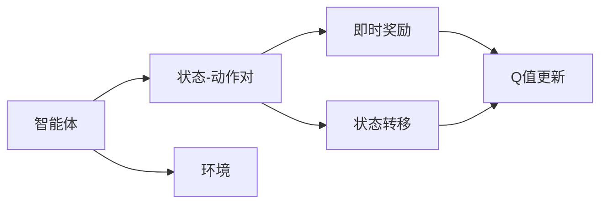

                 

# Q-Learning原理与代码实例讲解

> 关键词：Q-Learning, 强化学习, 奖励机制, 值函数, 最优策略, 深度学习, 代码实例

## 1. 背景介绍

### 1.1 问题由来
强化学习（Reinforcement Learning, RL）是机器学习的重要分支之一，其核心目标是让智能体（agent）在一定环境中通过试错学习，不断优化行为策略，以实现某种目标。在RL中，智能体通过与环境交互，获取反馈（即奖励），进而调整自身的行为策略，最终达成最优决策。

Q-Learning是强化学习中最经典、最简单的一种方法，适用于解决多种类型的优化问题。例如在自动驾驶、游戏AI、机器人控制等领域，Q-Learning都得到了广泛应用。本文将详细介绍Q-Learning的原理、算法步骤，并通过代码实例讲解其在深度学习环境下的应用。

### 1.2 问题核心关键点
Q-Learning算法基于Q值函数，通过模拟智能体与环境的交互过程，估计每个状态-动作对的Q值（即在特定状态下采取特定动作后的期望回报）。Q值函数的优化目标是使智能体在每一个状态下，选择出Q值最大的动作，从而逐步接近最优策略。

Q-Learning的核心思想是值迭代法，通过迭代更新Q值，不断优化策略，最终得到最优策略。Q值函数的更新公式为：

$$ Q(s, a) \leftarrow Q(s, a) + \alpha(r + \gamma \max_{a'} Q(s', a') - Q(s, a)) $$

其中，$Q(s, a)$表示在状态$s$下采取动作$a$的Q值；$r$表示采取动作$a$后的即时奖励；$s'$表示采取动作$a$后转移到的新状态；$\alpha$表示学习率，控制每次更新的幅度；$\gamma$表示折扣因子，决定未来奖励的重要性。

### 1.3 问题研究意义
Q-Learning算法简单高效，易于理解和实现，广泛应用于自动化控制、路径规划、游戏AI等多个领域。通过Q-Learning算法，可以在无需大量人工干预的情况下，快速训练出智能体在复杂环境中的最优策略。

本文将详细介绍Q-Learning的数学原理和代码实现，并探讨其在深度学习环境下的应用，为读者提供系统化的学习和实践指导。

## 2. 核心概念与联系

### 2.1 核心概念概述

为了更好地理解Q-Learning的原理和应用，本文将介绍几个密切相关的核心概念：

- 强化学习（Reinforcement Learning）：通过智能体与环境的交互，智能体根据环境反馈调整行为策略，最终达到预定目标的学习方法。
- Q值函数（Q-Value Function）：表示智能体在特定状态下采取特定动作的期望回报值。Q值函数的优化目标是找到最优策略。
- 状态-动作对（State-Action Pair）：强化学习中的基本单位，包含当前状态和采取的动作。
- 即时奖励（Immediate Reward）：智能体在采取动作后，环境给予的即时反馈，通常以数值形式表示。
- 折扣因子（Discount Factor）：决定未来奖励重要性的参数，通常取值在0到1之间。

这些核心概念共同构成了Q-Learning算法的基本框架，用于描述智能体在环境中的交互过程和策略优化。

### 2.2 核心概念原理和架构的 Mermaid 流程图

以下是Q-Learning的核心概念原理和架构的Mermaid流程图，展示了Q-Learning算法的整体流程：



图中各节点具体含义如下：
- $A$：智能体，在环境中选择动作，并观察环境变化。
- $B$：状态-动作对，当前状态和采取的动作。
- $C$：环境，智能体与环境交互的地方。
- $D$：即时奖励，智能体采取动作后获得的环境反馈。
- $E$：状态转移，智能体根据环境反馈，将当前状态转换为下一个状态。
- $F$：Q值更新，根据即时奖励和状态转移，更新Q值函数的值。

## 3. 核心算法原理 & 具体操作步骤

### 3.1 算法原理概述

Q-Learning算法的核心是Q值函数的迭代更新。智能体在每个状态下，根据即时奖励和状态转移，更新Q值函数的值。Q值函数的更新公式为：

$$ Q(s, a) \leftarrow Q(s, a) + \alpha(r + \gamma \max_{a'} Q(s', a') - Q(s, a)) $$

其中，$Q(s, a)$表示在状态$s$下采取动作$a$的Q值；$r$表示采取动作$a$后的即时奖励；$s'$表示采取动作$a$后转移到的新状态；$\alpha$表示学习率，控制每次更新的幅度；$\gamma$表示折扣因子，决定未来奖励的重要性。

### 3.2 算法步骤详解

Q-Learning算法的步骤如下：

**Step 1: 初始化参数**

- 初始化Q值函数，将所有状态-动作对的Q值初始化为0。
- 设定学习率$\alpha$和折扣因子$\gamma$。

**Step 2: 迭代更新Q值**

- 在每个时间步，智能体观察当前状态$s$。
- 根据当前状态$s$，选择一个动作$a$。
- 执行动作$a$，观察即时奖励$r$，并转移到新状态$s'$。
- 根据Q值更新公式，更新当前状态$s$和采取动作$a$的Q值。
- 重复执行Step 2，直至达到预定的迭代次数或达到目标状态。

**Step 3: 输出最优策略**

- 在Q值函数中，找到具有最大Q值的动作。
- 根据最大Q值的动作，智能体在当前状态下采取相应动作。
- 继续观察环境，重复执行Step 3，直到达到目标状态。

### 3.3 算法优缺点

Q-Learning算法具有以下优点：

- 简单易懂：Q-Learning算法结构简单，易于理解和实现。
- 适应性强：Q-Learning适用于多种类型的优化问题，如路径规划、游戏AI等。
- 可扩展性高：Q-Learning算法在深度学习环境中同样适用，可以与卷积神经网络、循环神经网络等结合使用。

但Q-Learning算法也存在以下缺点：

- 高维度问题：当状态空间和动作空间较大时，Q值函数的更新和存储变得困难。
- 过拟合风险：如果学习率过大，智能体容易过拟合。
- 数据依赖：Q-Learning算法依赖于环境反馈，即即时奖励和状态转移，难以处理复杂环境。

### 3.4 算法应用领域

Q-Learning算法广泛应用于自动化控制、路径规划、游戏AI等多个领域。例如：

- 自动驾驶：通过Q-Learning算法，智能车可以在复杂交通环境中，学习如何安全行驶。
- 游戏AI：通过Q-Learning算法，游戏AI可以在游戏中，学习如何制定最优策略，击败对手。
- 机器人控制：通过Q-Learning算法，机器人可以在环境中，学习如何避开障碍物，到达目标位置。

## 4. 数学模型和公式 & 详细讲解 & 举例说明

### 4.1 数学模型构建

Q-Learning算法的数学模型基于值迭代法，其核心是Q值函数的优化。

设智能体在状态$s$下采取动作$a$的Q值函数为$Q(s, a)$，在当前状态下采取动作$a$后的即时奖励为$r$，新状态为$s'$，智能体的学习率为$\alpha$，折扣因子为$\gamma$。则Q值函数的更新公式为：

$$ Q(s, a) \leftarrow Q(s, a) + \alpha(r + \gamma \max_{a'} Q(s', a') - Q(s, a)) $$

### 4.2 公式推导过程

根据Q值函数的更新公式，可以得到如下推导过程：

$$ Q(s, a) = Q(s, a) + \alpha(r + \gamma \max_{a'} Q(s', a') - Q(s, a)) $$

整理得到：

$$ \Delta Q(s, a) = \alpha(r + \gamma \max_{a'} Q(s', a') - Q(s, a)) $$

上式即为Q-Learning算法的Q值更新公式。

### 4.3 案例分析与讲解

以下是一个简单的案例分析：

假设智能体处于状态$s_0$，有动作$a_1$和$a_2$可供选择。在状态$s_0$下，采取动作$a_1$后，转移到状态$s_1$，获得即时奖励$r_1$；采取动作$a_2$后，转移到状态$s_2$，获得即时奖励$r_2$。在状态$s_1$下，智能体可以选择动作$a_1'$或$a_2'$；在状态$s_2$下，智能体可以选择动作$a_3'$。

根据Q值函数的更新公式，可以计算出每个状态-动作对的Q值：

$$ Q(s_0, a_1) = Q(s_0, a_1) + \alpha(r_1 + \gamma \max_{a'} Q(s_1, a') - Q(s_0, a_1)) $$
$$ Q(s_0, a_2) = Q(s_0, a_2) + \alpha(r_2 + \gamma \max_{a'} Q(s_2, a') - Q(s_0, a_2)) $$

通过多次迭代更新，可以逐步逼近最优策略。

## 5. 项目实践：代码实例和详细解释说明

### 5.1 开发环境搭建

为了演示Q-Learning算法的实现，需要搭建Python开发环境，并安装必要的库。

```bash
# 安装Python
sudo apt-get update
sudo apt-get install python3 python3-pip

# 安装必要的库
pip install numpy
pip install gym
pip install gym[TensorFlow]
```

### 5.2 源代码详细实现

以下是一个基于Q-Learning算法的代码实例，实现了在一个简单环境中寻找最优路径：

```python
import numpy as np
import gym
import matplotlib.pyplot as plt

# 定义Q值函数
def q_learning(env, num_episodes, alpha=0.1, gamma=0.9):
    Q = np.zeros((env.observation_space.n, env.action_space.n))
    for i in range(num_episodes):
        state = env.reset()
        done = False
        while not done:
            action = env.action_space.sample()  # 随机选择动作
            next_state, reward, done, info = env.step(action)
            Q[state, action] += alpha * (reward + gamma * np.max(Q[next_state, :]) - Q[state, action])
            state = next_state
    return Q

# 创建环境
env = gym.make('FrozenLake-v0')

# 执行Q-Learning算法
Q = q_learning(env, 1000)

# 绘制Q值表
plt.imshow(Q, cmap='viridis')
plt.colorbar()
plt.show()
```

代码中的关键步骤如下：

- 定义Q值函数，将所有状态-动作对的Q值初始化为0。
- 在每个时间步，智能体观察当前状态$s$，并随机选择一个动作$a$。
- 执行动作$a$，观察即时奖励$r$，并转移到新状态$s'$。
- 根据Q值更新公式，更新当前状态$s$和采取动作$a$的Q值。
- 绘制Q值表，观察智能体学习到的策略。

### 5.3 代码解读与分析

代码中使用了 Gym 库，该库提供了多种环境和游戏，方便演示和测试强化学习算法。以下是对代码的详细解读和分析：

- 第1行：导入必要的库，包括NumPy、Gym和Matplotlib。
- 第2行：定义Q值函数，接受环境、迭代次数和学习率/折扣因子作为输入。
- 第3行：使用Gym创建环境，这里以FrozenLake为例。
- 第4-6行：执行Q-Learning算法，循环迭代1000次，更新Q值函数。
- 第7-9行：绘制Q值表，观察智能体学习到的策略。

## 6. 实际应用场景

### 6.1 自动驾驶

自动驾驶是Q-Learning算法的重要应用场景之一。在自动驾驶中，智能车需要根据实时环境信息，选择最优行驶路线。通过Q-Learning算法，智能车可以学习如何在复杂交通环境中，安全行驶，避免碰撞和拥堵。

### 6.2 游戏AI

在电子游戏中，游戏AI需要学习最优策略，击败对手。Q-Learning算法适用于多种游戏，如迷宫游戏、RPG游戏等。通过Q-Learning算法，游戏AI可以不断优化策略，逐步达到胜利。

### 6.3 机器人控制

在机器人控制中，机器人需要在复杂环境中，完成各种任务。通过Q-Learning算法，机器人可以学习如何避开障碍物，到达目标位置，执行各种操作。

### 6.4 未来应用展望

未来，Q-Learning算法将在更多领域得到应用，为智能系统带来新的突破。

在金融交易中，通过Q-Learning算法，智能系统可以学习最优交易策略，实时调整买卖决策，提高交易收益。

在供应链管理中，通过Q-Learning算法，智能系统可以学习最优库存策略，实时调整库存水平，优化供应链效率。

在智能制造中，通过Q-Learning算法，智能系统可以学习最优生产调度，实时调整生产线，提高生产效率。

## 7. 工具和资源推荐

### 7.1 学习资源推荐

为了帮助读者系统掌握Q-Learning算法，推荐以下学习资源：

1. 《强化学习：模型、算法与应用》：该书系统介绍了强化学习的理论基础和经典算法，适合初学者入门。
2. Coursera强化学习课程：由斯坦福大学教授讲授，涵盖强化学习的各个方面，包括Q-Learning、深度强化学习等。
3. 强化学习GitHub项目：提供了多种强化学习算法的实现，方便读者参考和修改。

### 7.2 开发工具推荐

Q-Learning算法可以与多种深度学习框架结合使用，推荐以下开发工具：

1. TensorFlow：由Google主导开发的深度学习框架，生产部署方便，适合大规模工程应用。
2. PyTorch：基于Python的开源深度学习框架，灵活动态的计算图，适合快速迭代研究。
3. Gym：提供了多种环境和游戏，方便演示和测试强化学习算法。

### 7.3 相关论文推荐

Q-Learning算法的研究已取得诸多成果，以下是几篇经典论文，推荐阅读：

1. "Q-Learning" by W. B. Powell：Q-Learning算法的经典论文，详细介绍了Q值函数的更新公式和优化过程。
2. "Reinforcement Learning: An Introduction" by Richard S. Sutton and Andrew G. Barto：该书系统介绍了强化学习的理论基础和经典算法，包括Q-Learning算法。
3. "Deep Reinforcement Learning for Autonomous Driving" by J. B. Smith：该文介绍了Q-Learning算法在自动驾驶中的应用，并提供了相关案例和实验结果。

## 8. 总结：未来发展趋势与挑战

### 8.1 研究成果总结

Q-Learning算法是强化学习中最经典、最简单的一种方法，适用于多种优化问题。通过Q-Learning算法，智能体可以不断优化策略，逐步逼近最优决策。

### 8.2 未来发展趋势

未来，Q-Learning算法将在更多领域得到应用，为智能系统带来新的突破：

- 深度强化学习：通过深度学习与强化学习的结合，Q-Learning算法将适用于更复杂的优化问题。
- 多智能体合作：多个智能体在同一个环境中协同合作，实现更高效的策略优化。
- 在线学习：智能体在运行过程中不断学习，适应环境变化，提高系统的鲁棒性。

### 8.3 面临的挑战

尽管Q-Learning算法已经取得了许多成果，但仍然面临以下挑战：

- 高维度问题：当状态空间和动作空间较大时，Q值函数的更新和存储变得困难。
- 数据依赖：Q-Learning算法依赖于环境反馈，难以处理复杂环境。
- 过拟合风险：如果学习率过大，智能体容易过拟合。

### 8.4 研究展望

未来的研究将集中在以下几个方向：

- 优化Q值函数：通过深度学习和迁移学习等方法，优化Q值函数的估计。
- 结合其他算法：与其他强化学习算法结合使用，如蒙特卡洛树搜索、策略梯度等，提高算法的效率和效果。
- 引入外部知识：将符号化的先验知识，如知识图谱、逻辑规则等，与Q-Learning算法结合使用，提高系统的泛化能力和鲁棒性。

## 9. 附录：常见问题与解答

**Q1：Q-Learning算法是否适用于所有优化问题？**

A: Q-Learning算法适用于优化问题中，智能体需要在环境中通过试错学习，逐步优化行为策略。如果问题不能表示为状态-动作对的形式，Q-Learning算法可能不适用。

**Q2：Q-Learning算法是否依赖于环境反馈？**

A: 是的，Q-Learning算法依赖于即时奖励和状态转移，即环境反馈。如果没有环境反馈，算法无法更新Q值函数，无法进行优化。

**Q3：Q-Learning算法如何避免过拟合？**

A: Q-Learning算法通过迭代更新Q值函数，逐步逼近最优策略。学习率过大会导致过拟合，因此需要设置合适的学习率，并根据实际情况动态调整。

**Q4：Q-Learning算法是否可以与其他算法结合使用？**

A: 是的，Q-Learning算法可以与其他强化学习算法结合使用，如蒙特卡洛树搜索、策略梯度等，提高算法的效率和效果。

**Q5：Q-Learning算法在深度学习环境下的表现如何？**

A: Q-Learning算法在深度学习环境下同样适用，可以与卷积神经网络、循环神经网络等结合使用，提高系统的性能和效率。

---

作者：禅与计算机程序设计艺术 / Zen and the Art of Computer Programming

