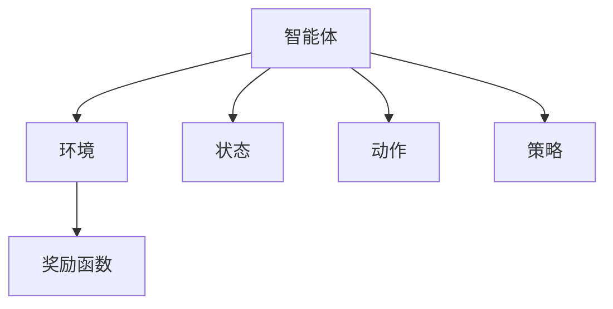

                 

# Reinforcement Learning

> 关键词：强化学习, 智能体, 环境, 奖励函数, Q-learning, SARSA, 深度强化学习, 多智能体系统, 应用案例

## 1. 背景介绍

### 1.1 问题由来

强化学习（Reinforcement Learning, RL）是人工智能领域的一个重要分支，其核心思想是通过智能体与环境交互，通过不断尝试和反馈，学习最优策略来实现目标。在计算机视觉、自然语言处理、自动驾驶、机器人控制等众多领域，强化学习都已经展现了巨大的应用潜力。

然而，尽管强化学习在理论研究和实际应用上都有显著进展，但其复杂性和挑战性仍不容小觑。对于初学者来说，如何在庞大的理论体系中快速掌握核心概念，了解实际应用的技巧和经验，是一大难点。

### 1.2 问题核心关键点

本文旨在从理论到实践，深入浅出地讲解强化学习的核心概念、算法原理和实际应用，希望能帮助读者快速入门并掌握强化学习的精髓。具体来说，我们将在以下几方面展开深入探讨：

- 强化学习的核心概念：智能体、环境、状态、动作、奖励函数、策略。
- 强化学习的基本算法：Q-learning、SARSA、Deep Q Network、Actor-Critic 等。
- 强化学习的应用实例：自动驾驶、机器人控制、游戏AI、金融投资等。

### 1.3 问题研究意义

强化学习之所以重要，是因为它提供了一种无需大量标注数据，就能从环境中学习最优策略的方法。相比于传统的监督学习和无监督学习，强化学习在复杂决策问题中表现出更强的适应性和灵活性。通过研究强化学习，我们不仅可以更好地理解机器在面对不确定性时的决策机制，还可以发现其应用于更广阔领域的可能性。

## 2. 核心概念与联系

### 2.1 核心概念概述

为了更好地理解强化学习，我们需要先掌握以下几个核心概念：

- **智能体（Agent）**：指在环境中采取行动以获得奖励的实体。智能体可以是任何具备感知和决策能力的实体，如机器人、自动驾驶汽车、游戏AI等。
- **环境（Environment）**：指智能体所处的交互空间，通常包括状态空间、动作空间和奖励函数。环境为智能体提供状态反馈和奖励信号。
- **状态（State）**：指环境中的具体状况，智能体通过观察状态来感知环境。状态可以是连续的或离散的，用于描述环境的当前状态。
- **动作（Action）**：指智能体可以采取的行动，通常有离散和连续两种类型。动作是智能体与环境交互的关键因素。
- **奖励函数（Reward Function）**：指环境对智能体动作的评价标准，通常用于评估动作的好坏。奖励函数为智能体提供即时反馈，驱动智能体学习最优策略。
- **策略（Policy）**：指智能体选择动作的概率分布，用于指导智能体的行动。策略可以分为值函数型策略（如Q-learning）和策略型策略（如Actor-Critic）。

这些核心概念之间存在着紧密的联系，构成了强化学习的基础框架。以下是一个简化的强化学习流程图，展示了这些概念的联系：



这个流程图展示了智能体如何通过动作与环境交互，并根据奖励函数调整策略，以最大化累积奖励。

## 3. 核心算法原理 & 具体操作步骤

### 3.1 算法原理概述

强化学习的核心思想是通过智能体与环境的交互，学习最优策略来实现目标。其基本过程包括：

1. **观察**：智能体观察当前状态。
2. **决策**：智能体选择动作。
3. **执行**：智能体执行动作，环境根据动作产生新状态和新奖励。
4. **反馈**：智能体接收到新状态和新奖励。
5. **学习**：智能体根据奖励更新策略。

强化学习的目标是最小化累积奖励的方差，即学习最优的策略 $\pi$，使得对任意状态 $s$ 和动作 $a$，有 $Q^\pi(s,a) = \max_a Q^\pi(s,a)$。这里 $Q^\pi(s,a)$ 是策略 $\pi$ 在状态 $s$ 和动作 $a$ 下的Q值，表示在状态 $s$ 下采取动作 $a$ 后的长期累积奖励。

### 3.2 算法步骤详解

强化学习的核心算法包括以下步骤：

**Step 1: 定义状态空间和动作空间**

- 确定环境的状态空间 $\mathcal{S}$ 和动作空间 $\mathcal{A}$。状态空间可以是离散的，也可以是连续的，动作空间也可以是离散的或连续的。

**Step 2: 定义奖励函数**

- 确定环境对智能体动作的奖励函数 $r: \mathcal{S} \times \mathcal{A} \rightarrow \mathbb{R}$。奖励函数通常用于指导智能体的行为，使得智能体趋向于选择能够获得高奖励的动作。

**Step 3: 初始化智能体**

- 初始化智能体的策略 $\pi$。策略可以是固定的，也可以是动态调整的。

**Step 4: 循环迭代**

- 在每个时间步 $t$，智能体观察当前状态 $s_t$，选择动作 $a_t$，执行动作，观察新状态 $s_{t+1}$，并接收奖励 $r_{t+1}$。
- 根据新状态和新奖励，智能体根据学习算法（如Q-learning、SARSA等）更新策略 $\pi$。
- 重复上述过程直至达到终止条件。

**Step 5: 评估策略**

- 在完成迭代后，评估策略 $\pi$ 的性能。通常使用蒙特卡洛方法、时序差分方法等估计策略的Q值或策略价值函数。

### 3.3 算法优缺点

强化学习的优点包括：

1. **无需标注数据**：强化学习通过与环境的交互学习，不需要大量的标注数据，适用于数据稀缺的情况。
2. **通用性强**：强化学习可以应用于各种决策问题，包括游戏AI、自动驾驶、机器人控制等。
3. **自我学习**：强化学习模型具有自我学习能力，能够在不断的交互中优化策略。

然而，强化学习也存在一些缺点：

1. **探索与利用矛盾**：智能体需要平衡探索新动作和利用已有知识之间的矛盾，这是一个复杂的问题。
2. **高维度状态空间**：高维度状态空间使得强化学习算法复杂度增加，容易陷入局部最优。
3. **奖励函数设计困难**：设计一个合理的奖励函数是强化学习成功的关键，但往往难以定义。
4. **计算复杂度高**：强化学习算法通常计算复杂度高，需要大量的计算资源。

### 3.4 算法应用领域

强化学习的应用领域广泛，包括但不限于以下几个方面：

- **游戏AI**：通过与游戏环境交互，智能体可以学习最优策略，实现游戏中的自动化决策。
- **机器人控制**：在机器人控制中，强化学习可以帮助机器人学习如何避障、抓取物体等任务。
- **自动驾驶**：在自动驾驶中，强化学习可以学习最优的驾驶策略，避免交通违规和事故。
- **金融投资**：在金融投资中，强化学习可以学习如何最大化投资收益，规避风险。
- **自然语言处理**：在自然语言处理中，强化学习可以用于生成对话、机器翻译等任务。

这些应用案例展示了强化学习在不同领域的强大潜力，为智能系统的决策制定提供了新的思路。

## 4. 数学模型和公式 & 详细讲解 & 举例说明

### 4.1 数学模型构建

强化学习的数学模型可以概括为智能体与环境的交互过程。设环境状态空间为 $\mathcal{S}$，动作空间为 $\mathcal{A}$，奖励函数为 $r: \mathcal{S} \times \mathcal{A} \rightarrow \mathbb{R}$。智能体的策略为 $\pi(a|s) = P(a|s,\pi)$，其中 $\pi$ 是策略参数。

在每个时间步 $t$，智能体观察状态 $s_t \in \mathcal{S}$，选择动作 $a_t \in \mathcal{A}$，执行动作后观察新状态 $s_{t+1} \in \mathcal{S}$，并接收奖励 $r_{t+1} \in \mathbb{R}$。根据上述过程，强化学习模型可以表示为：

$$
\begin{aligned}
s_t &\sim P(s) \\
a_t &\sim \pi(a|s_t) \\
r_{t+1} &\sim r(s_t,a_t) \\
s_{t+1} &\sim P(s_{t+1}|s_t,a_t)
\end{aligned}
$$

### 4.2 公式推导过程

强化学习的核心目标是通过学习策略 $\pi$，最大化期望累积奖励。假设智能体的策略为 $\pi$，则其期望累积奖励为：

$$
J(\pi) = \mathbb{E}_{\pi}\left[\sum_{t=0}^{\infty} \gamma^t r_{t+1}\right]
$$

其中 $\gamma$ 是折扣因子，用于减少未来奖励的权重。Q值函数 $Q(s,a)$ 定义为智能体在状态 $s$ 下采取动作 $a$ 的长期累积奖励：

$$
Q(s,a) = \mathbb{E}_{\pi}\left[\sum_{t=0}^{\infty} \gamma^t r_{t+1}\right]
$$

Q值函数可以通过贝尔曼方程进行推导：

$$
Q(s,a) = r + \gamma \max_{a'} Q(s',a')
$$

这里的 $\max_{a'} Q(s',a')$ 表示在状态 $s'$ 下，采取动作 $a'$ 的期望累积奖励。

### 4.3 案例分析与讲解

假设我们有一个简单的强化学习环境，智能体需要学习如何从起点到达终点。环境状态空间为 $\mathcal{S} = \{start, middle, end\}$，动作空间为 $\mathcal{A} = \{up, down\}$，奖励函数为 $r: \mathcal{S} \times \mathcal{A} \rightarrow \mathbb{R}$，定义如下：

- 在起点和终点，奖励为 $0$。
- 在中间位置，奖励为 $1$。
- 向上移动时，奖励为 $-0.1$。
- 向下移动时，奖励为 $-0.1$。

智能体的策略为 $\pi(a|s) = 0.5$，即在每个状态下，以0.5的概率向上移动，以0.5的概率向下移动。

**Step 1: 定义状态空间和动作空间**

- 状态空间 $\mathcal{S} = \{start, middle, end\}$
- 动作空间 $\mathcal{A} = \{up, down\}$

**Step 2: 定义奖励函数**

- $r: \mathcal{S} \times \mathcal{A} \rightarrow \mathbb{R}$，定义如下：
  - $r(start,up) = -0.1$
  - $r(start,down) = -0.1$
  - $r(middle,up) = -0.1$
  - $r(middle,down) = -0.1$
  - $r(end,up) = 0$
  - $r(end,down) = 0$

**Step 3: 初始化智能体**

- 智能体的策略为 $\pi(a|s) = 0.5$

**Step 4: 循环迭代**

- 在每个时间步 $t$，智能体观察当前状态 $s_t$，选择动作 $a_t$，执行动作，观察新状态 $s_{t+1}$，并接收奖励 $r_{t+1}$。

**Step 5: 评估策略**

- 在完成迭代后，评估策略 $\pi$ 的性能。可以使用蒙特卡洛方法或时序差分方法估计Q值或策略价值函数。

假设智能体在某个时间步 $t$ 观察到状态 $s_t = middle$，采取动作 $a_t = up$，执行动作后观察到新状态 $s_{t+1} = end$，并接收奖励 $r_{t+1} = 0$。根据贝尔曼方程，智能体在状态 $s_t = middle$ 下采取动作 $a_t = up$ 的Q值为：

$$
Q(middle,up) = -0.1 + \gamma \max_{a'} Q(end,a') = 0
$$

因此，智能体在状态 $middle$ 下采取动作 $up$ 的Q值为 $0$。

## 5. 项目实践：代码实例和详细解释说明

### 5.1 开发环境搭建

在进行强化学习项目实践前，我们需要准备好开发环境。以下是使用Python进行Reinforcement Learning开发的典型环境配置流程：

1. 安装Anaconda：从官网下载并安装Anaconda，用于创建独立的Python环境。

2. 创建并激活虚拟环境：
```bash
conda create -n reinforcement-env python=3.8 
conda activate reinforcement-env
```

3. 安装必要的库：
```bash
pip install gym gym-super-mario numpy matplotlib gym-envs numpy
```

4. 安装OpenAI Gym：
```bash
pip install gym[atari]
```

5. 安装其他需要的库：
```bash
pip install torch torchvision
```

完成上述步骤后，即可在`reinforcement-env`环境中开始强化学习实践。

### 5.2 源代码详细实现

下面我们以OpenAI Gym中的Super Mario游戏为例，给出使用PyTorch实现Q-learning算法的代码实现。

首先，定义Q值函数：

```python
import torch
import torch.nn as nn
import torch.optim as optim

class QNetwork(nn.Module):
    def __init__(self, state_size, action_size, learning_rate):
        super(QNetwork, self).__init__()
        self.learning_rate = learning_rate
        self.qlinear = nn.Linear(state_size, action_size)
        self.optimizer = optim.Adam(self.qlinear.parameters(), lr=learning_rate)
        
    def forward(self, state):
        Q_values = self.qlinear(state)
        return Q_values
```

然后，定义训练函数：

```python
def train(env, qnetwork, num_episodes, discount_factor=0.95, epsilon=1.0, epsilon_decay=0.995):
    for i in range(num_episodes):
        state = env.reset()
        state = torch.FloatTensor([state])
        done = False
        total_reward = 0
        while not done:
            if np.random.rand() < epsilon:
                action = env.action_space.sample()
            else:
                with torch.no_grad():
                    Q_values = qnetwork(state)
                    action = torch.argmax(Q_values, dim=1).item()
            next_state, reward, done, _ = env.step(action)
            next_state = torch.FloatTensor([next_state])
            if not done:
                q_next = qnetwork(next_state)
                Q_values = qnetwork(state)
                Q_values[:, action] = reward + discount_factor * torch.max(q_next)
            else:
                q_next = torch.zeros(env.observation_space.shape[0], device=qnetwork.qlinear.weight.device)
                Q_values = qnetwork(state)
                Q_values[:, action] = reward
            target = Q_values
            loss = (target - qnetwork(state)).pow(2).mean()
            optimizer.zero_grad()
            loss.backward()
            optimizer.step()
            total_reward += reward
        print('Episode', i, 'Reward:', total_reward)
```

最后，启动训练流程：

```python
env = gym.make('SuperMario-Bot-v1')
qnetwork = QNetwork(env.observation_space.shape[0], env.action_space.n, learning_rate=0.001)
train(env, qnetwork, num_episodes=100)
```

以上就是使用PyTorch对Super Mario游戏进行Q-learning算法的代码实现。可以看到，通过使用PyTorch的Tensor操作和优化器，我们可以高效地实现强化学习算法。

### 5.3 代码解读与分析

让我们再详细解读一下关键代码的实现细节：

**QNetwork类**：
- `__init__`方法：初始化Q值网络，包括参数、优化器和损失函数。
- `forward`方法：前向传播计算Q值，返回Q值向量。

**train函数**：
- 在每个时间步，智能体观察当前状态，选择动作，执行动作，观察新状态和奖励。
- 根据当前状态和动作，使用Q值函数计算Q值。
- 根据贝尔曼方程，更新Q值。
- 使用优化器更新Q值网络，最小化损失函数。
- 计算奖励，并记录总奖励。

**启动训练流程**：
- 创建Super Mario游戏环境。
- 初始化Q值网络。
- 启动训练过程，在指定次数内对环境进行模拟训练。

在实际应用中，我们还需要进行更多的优化和调整，如引入奖励衰减、策略衰减等，以提升算法的性能。

## 6. 实际应用场景

### 6.1 智能机器人控制

强化学习在机器人控制中的应用非常广泛。智能机器人需要学习如何在复杂环境中执行任务，如导航、抓取、避障等。通过与环境的交互，强化学习算法可以自动学习最优的行动策略，使得机器人能够高效地完成各项任务。

在实践中，可以使用Gym等环境库设计机器人控制任务，如Pendulum摆动、MountainCar等。通过优化奖励函数和策略，机器人可以学习如何保持平衡、爬坡等复杂动作。

### 6.2 自动驾驶

在自动驾驶中，强化学习可以用于学习最优的驾驶策略，规避交通违规和事故。通过与虚拟交通环境的交互，智能体可以学习如何在不同的交通情况下做出最优的决策，如停止、加速、转向等。

在实践中，可以使用Gym中的CarRacing环境，设计自动驾驶任务。通过优化奖励函数和策略，自动驾驶系统可以学习如何在复杂交通场景中安全行驶。

### 6.3 金融投资

在金融投资中，强化学习可以用于学习如何最大化投资收益，规避风险。通过与金融市场的交互，智能体可以学习如何选择合适的股票、债券等资产，以及何时买入或卖出。

在实践中，可以使用Gym中的Financial Environment环境，设计金融投资任务。通过优化奖励函数和策略，智能体可以学习如何在不同的市场环境中做出最优的投资决策。

### 6.4 未来应用展望

随着强化学习算法的不断进步，其在更多领域的应用前景将更加广阔。

在智慧医疗领域，强化学习可以用于学习最优的诊断和治疗策略，提高医疗服务的质量和效率。在教育领域，强化学习可以用于个性化的学习推荐和课程设计，提升学生的学习效果。

在工业制造领域，强化学习可以用于优化生产流程和设备维护，提高生产效率和设备寿命。在环境保护领域，强化学习可以用于设计最优的资源分配策略，促进可持续发展。

总之，强化学习的应用领域将不断拓展，其潜力将逐步释放。未来，随着技术的不断进步，强化学习将在更多领域带来革命性的变革。

## 7. 工具和资源推荐

### 7.1 学习资源推荐

为了帮助开发者系统掌握强化学习的理论基础和实践技巧，这里推荐一些优质的学习资源：

1. **《强化学习》书籍**：由Richard Sutton和Andrew Barto合著的经典教材，全面介绍了强化学习的基本概念、算法原理和应用案例。
2. **《Deep Q-Learning with PyTorch》教程**：详细讲解了使用PyTorch实现Q-learning算法的步骤和技巧。
3. **OpenAI Gym官方文档**：提供了大量环境库和算法的示例代码，是强化学习入门的必备资源。
4. **Reinforcement Learning From the Ground Up课程**：由Udacity提供的免费在线课程，涵盖强化学习的核心概念和算法。
5. **Reinforcement Learning Basics博客**：由Reinforcement Learning专家撰写的系列博文，深入浅出地讲解强化学习的各种算法和技巧。

通过对这些资源的学习实践，相信你一定能够快速掌握强化学习的精髓，并用于解决实际的强化学习问题。

### 7.2 开发工具推荐

高效的开发离不开优秀的工具支持。以下是几款用于强化学习开发的常用工具：

1. **PyTorch**：基于Python的开源深度学习框架，灵活动态的计算图，适合快速迭代研究。
2. **OpenAI Gym**：提供了大量环境库和算法示例，方便开发者快速上手实验。
3. **TensorBoard**：TensorFlow配套的可视化工具，可实时监测模型训练状态，并提供丰富的图表呈现方式。
4. **Weights & Biases**：模型训练的实验跟踪工具，可以记录和可视化模型训练过程中的各项指标。
5. **Jupyter Notebook**：交互式Python开发环境，适合快速编写和调试代码。

合理利用这些工具，可以显著提升强化学习的开发效率，加快创新迭代的步伐。

### 7.3 相关论文推荐

强化学习的发展离不开学界的持续研究。以下是几篇奠基性的相关论文，推荐阅读：

1. **《Reinforcement Learning: An Introduction》**：由Richard Sutton和Andrew Barto合著的入门级书籍，涵盖了强化学习的基本概念和算法。
2. **《Playing Atari with Deep Reinforcement Learning》**：使用深度Q网络在Atari游戏中取得突破性成绩的经典论文。
3. **《Human-level Control Through Deep Reinforcement Learning》**：使用深度强化学习实现人机博弈的经典论文。
4. **《Continuous Control with Deep Reinforcement Learning》**：使用深度Q网络实现连续控制任务的经典论文。
5. **《Actor-Critic Methods》**：介绍了Actor-Critic算法的原理和应用，是强化学习的重要研究方向之一。

这些论文代表了大强化学习的发展脉络。通过学习这些前沿成果，可以帮助研究者把握学科前进方向，激发更多的创新灵感。

## 8. 总结：未来发展趋势与挑战

### 8.1 总结

本文从理论到实践，深入浅出地讲解了强化学习的核心概念、算法原理和实际应用。首先阐述了强化学习的基本框架和核心概念，包括智能体、环境、状态、动作、奖励函数、策略。其次，详细讲解了强化学习的基本算法，如Q-learning、SARSA、Deep Q Network、Actor-Critic等。最后，探讨了强化学习在多个领域的应用实例，展示了其强大的应用潜力。

通过本文的系统梳理，可以看到，强化学习为机器学习领域提供了新的视角和方法，通过智能体与环境的交互，学习最优策略。在复杂决策问题中，强化学习展现出更强的适应性和灵活性。未来，随着技术的不断进步，强化学习将在更多领域带来革命性的变革。

### 8.2 未来发展趋势

展望未来，强化学习将呈现以下几个发展趋势：

1. **多智能体系统**：多智能体系统是强化学习的重要研究方向之一。通过学习多个智能体之间的协作和竞争，可以解决更加复杂的决策问题。
2. **深度强化学习**：深度强化学习可以处理更加复杂的状态空间和动作空间，提升算法的性能和可扩展性。
3. **强化学习与传统机器学习结合**：强化学习与传统机器学习（如监督学习、无监督学习）结合，可以解决更加复杂的问题。
4. **强化学习与多模态数据结合**：强化学习可以处理多模态数据，如文本、图像、语音等，提升算法的表现力。
5. **强化学习与AI伦理结合**：强化学习需要考虑伦理和道德问题，如公平性、安全性、可解释性等，未来需要加强对这些问题的研究。

这些趋势展示了强化学习未来的发展方向，为机器学习领域带来新的突破。

### 8.3 面临的挑战

尽管强化学习已经取得了显著进展，但在实际应用中也面临诸多挑战：

1. **探索与利用矛盾**：智能体需要在探索新动作和利用已有知识之间找到平衡，这是一个复杂的问题。
2. **高维度状态空间**：高维度状态空间使得强化学习算法复杂度增加，容易陷入局部最优。
3. **奖励函数设计困难**：设计一个合理的奖励函数是强化学习成功的关键，但往往难以定义。
4. **计算复杂度高**：强化学习算法通常计算复杂度高，需要大量的计算资源。
5. **可解释性不足**：强化学习模型通常缺乏可解释性，难以理解其内部工作机制和决策逻辑。

### 8.4 研究展望

面对强化学习面临的挑战，未来的研究需要在以下几个方面寻求新的突破：

1. **探索与利用平衡**：设计更好的探索与利用策略，使得智能体能够更高效地学习。
2. **高维度状态空间处理**：发展新的算法和技术，处理高维度状态空间，提升算法的泛化能力。
3. **奖励函数设计**：设计更合理的奖励函数，指导智能体的行为，提升算法的性能。
4. **计算效率优化**：优化算法的计算效率，提升算法的可扩展性和实用性。
5. **可解释性增强**：研究增强算法可解释性的方法，使其更透明、可理解。

这些研究方向将引领强化学习技术的发展，为构建更加智能、可靠、可解释的系统提供新的思路。

## 9. 附录：常见问题与解答

**Q1：强化学习与监督学习和无监督学习的区别是什么？**

A: 强化学习与监督学习和无监督学习的主要区别在于数据获取方式和模型训练目标。在监督学习中，模型通过标注数据进行训练，目标是最大化预测准确率。在无监督学习中，模型通过未标注数据进行训练，目标是发现数据的内在结构。而在强化学习中，模型通过与环境的交互进行训练，目标是最大化累积奖励。

**Q2：强化学习中的奖励函数设计有什么技巧？**

A: 设计合理的奖励函数是强化学习成功的关键。以下是一些设计技巧：
1. **稀疏奖励设计**：奖励信号应尽可能稀疏，避免智能体通过重复动作获得奖励，陷入局部最优。
2. **多层次奖励设计**：设计多层次奖励函数，逐步提升奖励的难度，引导智能体逐步学习。
3. **正负奖励设计**：设计正负奖励函数，避免智能体过于追求短期奖励，忽略长期目标。

**Q3：强化学习中的探索与利用策略有哪些？**

A: 探索与利用是强化学习中的核心问题之一。以下是一些常见的探索与利用策略：
1. $\epsilon$-贪心策略：以$\epsilon$的概率随机选择动作，以$1-\epsilon$的概率选择贪心策略。
2. UCB策略：使用上界估计来选择动作，在探索和利用之间找到平衡。
3. Thompson Sampling策略：基于贝叶斯推断，随机选择动作，同时利用样本的反馈信息。

这些策略可以帮助智能体在探索与利用之间找到平衡，提升学习效率。

**Q4：如何评估强化学习算法的性能？**

A: 强化学习算法的性能评估通常使用以下指标：
1. **累积奖励**：评估智能体在特定环境下的累积奖励，目标是最大化累积奖励。
2. **平均累积奖励**：评估智能体在多次运行下的平均累积奖励，目标是最小化平均奖励方差。
3. **学习曲线**：绘制智能体的学习曲线，观察其学习速度和稳定性。
4. **策略评估**：使用蒙特卡洛方法、时序差分方法等估计策略的价值函数，评估策略的优劣。

这些指标可以帮助评估强化学习算法的性能，指导算法的优化和改进。

---

作者：禅与计算机程序设计艺术 / Zen and the Art of Computer Programming

