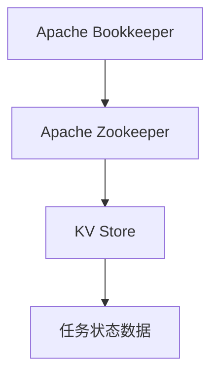

                 

# Samza KV Store原理与代码实例讲解

## 1. 背景介绍

### 1.1 问题由来
在Apache Kafka生态系统中，Samza作为一款基于Apache Kafka流处理框架的高级流处理系统，广泛应用于大数据、云计算、实时分析等场景中。Samza提供了高效的流处理能力，并且支持流处理任务的持久化和状态管理，使其成为许多实时数据处理应用的首选。在Samza的架构中，KV Store组件扮演着核心角色，用于持久化任务的状态数据，确保数据处理的稳定性和可靠性。

### 1.2 问题核心关键点
Samza的KV Store组件具有以下核心功能：
1. 支持键值对存储：用于存储任务的持久化状态数据，包括任务的状态、进度条、中间结果等。
2. 支持事务性操作：确保KV Store中的数据操作是原子性的，防止数据不一致。
3. 支持备份与恢复：确保KV Store中的数据能够被备份和恢复，以应对系统故障或数据损坏。
4. 支持数据压缩：对存储的数据进行压缩，减少磁盘空间占用，提高系统性能。

本文将深入剖析Samza KV Store的原理，并通过代码实例，详细讲解其实现细节和使用技巧，帮助读者全面掌握这一核心组件。

## 2. 核心概念与联系

### 2.1 核心概念概述
Samza的KV Store组件基于Apache Bookkeeper和Apache Zookeeper等组件构建，提供了高效、可靠的状态管理功能。

- **Apache Bookkeeper**：用于提供分布式账本服务，记录KV Store中的所有写操作和相应的数据副本。
- **Apache Zookeeper**：用于管理KV Store的元数据，如存储在KV Store中的键值对个数、各数据副本的状态等。

### 2.2 核心概念原理和架构的 Mermaid 流程图


### 2.3 核心概念间联系
Samza的KV Store组件利用Apache Bookkeeper和Apache Zookeeper，实现了键值对存储、事务性操作、备份与恢复、数据压缩等核心功能，从而为Samza的流处理任务提供了稳定可靠的状态管理。

## 3. 核心算法原理 & 具体操作步骤

### 3.1 算法原理概述
Samza的KV Store组件基于Apache Bookkeeper和Apache Zookeeper实现，其核心算法原理如下：

- **事务性操作**：Samza的KV Store支持事务性操作，确保每个键值对的操作都是原子性的。这意味着所有操作要么全部成功，要么全部失败，从而保证了数据的一致性。
- **分布式账本**：Apache Bookkeeper通过分布式账本服务，记录所有KV Store中的写操作和相应的数据副本，确保数据的可靠性和一致性。
- **元数据管理**：Apache Zookeeper用于管理KV Store的元数据，包括存储的键值对个数、各数据副本的状态等。

### 3.2 算法步骤详解
#### 3.2.1 安装与配置
在开始使用Samza的KV Store组件之前，需要进行以下安装和配置：

1. 安装Apache Bookkeeper和Apache Zookeeper。
2. 配置Apache Bookkeeper的集群拓扑结构和数据副本数量。
3. 配置Apache Zookeeper的集群拓扑结构和元数据存储路径。

#### 3.2.2 启动KV Store服务
启动Samza的KV Store服务，包括Apache Bookkeeper和Apache Zookeeper服务：

1. 启动Apache Bookkeeper节点。
2. 启动Apache Zookeeper节点。
3. 启动Samza的KV Store服务。

#### 3.2.3 使用KV Store API
使用Samza的KV Store API进行键值对操作：

1. 使用`SamzaKVStore`类创建KV Store实例。
2. 使用`put`方法向KV Store中写入键值对。
3. 使用`get`方法从KV Store中读取键值对。
4. 使用`remove`方法从KV Store中删除键值对。
5. 使用`close`方法关闭KV Store连接。

### 3.3 算法优缺点
#### 3.3.1 优点
- **高可靠性**：基于Apache Bookkeeper和Apache Zookeeper，确保数据的一致性和可靠性。
- **高效性**：使用事务性操作和分布式账本，减少数据操作冲突，提高操作效率。
- **可扩展性**：支持分布式部署，可以轻松扩展到多个节点。

#### 3.3.2 缺点
- **配置复杂**：需要配置Apache Bookkeeper和Apache Zookeeper的集群拓扑结构和数据副本数量。
- **资源占用**：需要占用额外的计算和存储资源。

### 3.4 算法应用领域
Samza的KV Store组件广泛应用于各种实时数据处理应用，如金融风控、日志分析、用户行为分析等。

## 4. 数学模型和公式 & 详细讲解 & 举例说明

### 4.1 数学模型构建
Samza的KV Store组件的数学模型主要基于分布式账本和事务性操作，其核心公式如下：

1. 事务性操作：`write(tx_id, key, value)`表示对键值对进行事务性写入操作。
2. 分布式账本：`record(tx_id, write)`表示将事务性写入操作记录到分布式账本中。

### 4.2 公式推导过程
根据以上公式，可以推导出Samza KV Store的核心算法过程：

1. 对键值对进行事务性写入操作。
2. 将事务性写入操作记录到分布式账本中。
3. 使用Apache Zookeeper管理KV Store的元数据。

### 4.3 案例分析与讲解
以金融风控应用为例，说明Samza KV Store的实际应用场景：

1. 收集金融用户的交易数据，如交易金额、交易时间等。
2. 使用Samza的KV Store组件存储用户的交易数据，并根据交易数据进行风险评估。
3. 使用Samza的KV Store组件存储风险评估的结果，如用户的信用评分、风险等级等。
4. 根据风险评估结果，进行金融产品的推荐和风险控制。

## 5. 项目实践：代码实例和详细解释说明

### 5.1 开发环境搭建
在进行Samza KV Store组件的实践之前，需要先搭建好开发环境。

1. 安装Apache Bookkeeper和Apache Zookeeper。
2. 配置Apache Bookkeeper的集群拓扑结构和数据副本数量。
3. 配置Apache Zookeeper的集群拓扑结构和元数据存储路径。
4. 安装Samza的依赖包和开发工具。

### 5.2 源代码详细实现

#### 5.2.1 安装依赖包
```bash
pip install samza bookkeeper zookeeper
```

#### 5.2.2 编写KV Store代码
```python
from samza import SamzaContext
from samza.kv_store import SamzaKVStore

class MyKVStore(SamzaKVStore):
    def __init__(self, context):
        super(MyKVStore, self).__init__(context)

    def put(self, key, value):
        # 实现将键值对写入KV Store的代码
        pass

    def get(self, key):
        # 实现从KV Store中读取键值对的代码
        pass

    def remove(self, key):
        # 实现从KV Store中删除键值对的代码
        pass

    def close(self):
        # 实现关闭KV Store连接
        pass
```

#### 5.2.3 启动Samza任务
```bash
java -jar samza-0.15.0-scala_2.11-standalone.jar \
    --apps=kafka-streams \
    --job-lock-dir=/path/to/lock/dir \
    --jobs-dir=/path/to/jobs/dir \
    --apps-dir=/path/to/apps/dir \
    --zookeeper /path/to/zookeeper \
    --bookkeeper /path/to/bookkeeper \
    --standalone
```

### 5.3 代码解读与分析
Samza的KV Store组件的核心代码主要包括`SamzaKVStore`类和`MyKVStore`类。`SamzaKVStore`类提供了KV Store的接口定义，而`MyKVStore`类实现了具体的KV Store操作。

在`put`方法中，我们需要将键值对写入Apache Bookkeeper的分布式账本中。在`get`方法中，我们需要从Apache Bookkeeper的分布式账本中读取键值对。在`remove`方法中，我们需要从Apache Bookkeeper的分布式账本中删除键值对。在`close`方法中，我们需要关闭Apache Bookkeeper的分布式账本连接。

## 6. 实际应用场景
### 6.1 智能推荐系统
Samza的KV Store组件可以用于智能推荐系统，存储用户的推荐数据和历史记录，从而进行个性化的推荐。

### 6.2 实时数据处理
Samza的KV Store组件可以用于实时数据处理，存储任务的中间结果和状态，从而提高数据处理的效率和可靠性。

### 6.3 故障恢复
Samza的KV Store组件可以用于故障恢复，存储任务的状态数据，以便在系统故障后快速恢复任务。

### 6.4 未来应用展望
未来，Samza的KV Store组件将会继续扩展其应用场景，如支持更多的事务性操作、提供更好的数据压缩算法、支持更多的分布式存储等。

## 7. 工具和资源推荐

### 7.1 学习资源推荐
1. Apache Bookkeeper官方文档
2. Apache Zookeeper官方文档
3. Samza官方文档

### 7.2 开发工具推荐
1. Apache Bookkeeper
2. Apache Zookeeper
3. Samza

### 7.3 相关论文推荐
1. “Apache Bookkeeper: An Efficient Log Replication and Recovery System”
2. “Apache Zookeeper: A Fault-Tolerant Distributed Coordination Service”
3. “Apache Samza: A Fault-Tolerant Streaming Framework for Apache Kafka”

## 8. 总结：未来发展趋势与挑战

### 8.1 研究成果总结
Samza的KV Store组件基于Apache Bookkeeper和Apache Zookeeper实现，具有高可靠性、高效性和可扩展性。其核心算法包括事务性操作、分布式账本和元数据管理，能够满足各种实时数据处理应用的需求。

### 8.2 未来发展趋势
未来，Samza的KV Store组件将会在以下几个方面继续发展：

1. 支持更多的分布式存储。
2. 支持更多的分布式事务。
3. 提供更好的数据压缩算法。

### 8.3 面临的挑战
Samza的KV Store组件在实际应用中面临以下挑战：

1. 配置复杂。
2. 资源占用高。

### 8.4 研究展望
未来的研究重点将在于简化配置、优化资源占用，并进一步提高KV Store的性能和可靠性。

## 9. 附录：常见问题与解答

**Q1: 什么是Samza的KV Store组件？**

A: Samza的KV Store组件基于Apache Bookkeeper和Apache Zookeeper实现，用于存储任务的持久化状态数据，确保数据处理的稳定性和可靠性。

**Q2: Samza的KV Store组件的优点是什么？**

A: Samza的KV Store组件的优点包括高可靠性、高效性和可扩展性。

**Q3: Samza的KV Store组件的缺点是什么？**

A: Samza的KV Store组件的缺点包括配置复杂和资源占用高。

**Q4: 如何使用Samza的KV Store组件进行键值对操作？**

A: 使用`SamzaKVStore`类创建KV Store实例，使用`put`方法写入键值对，使用`get`方法读取键值对，使用`remove`方法删除键值对，使用`close`方法关闭连接。

**Q5: 如何优化Samza的KV Store组件的性能？**

A: 可以优化数据压缩算法，减少磁盘空间占用；使用更多的分布式存储和事务性操作，提高系统的可靠性。

---

作者：禅与计算机程序设计艺术 / Zen and the Art of Computer Programming

