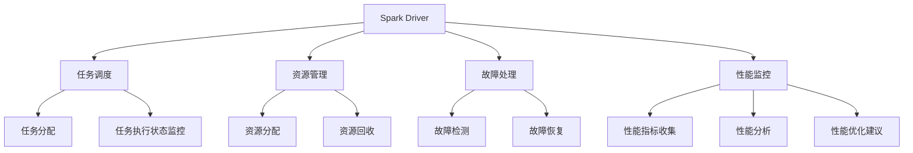

                 

## 1. 背景介绍

### 1.1 问题由来
Spark是Apache基金会的大数据处理引擎，以其高效、易用、可扩展的特点，广泛应用于数据仓库、大数据分析和机器学习等领域。Spark的核心组件之一是Driver，负责任务调度和资源管理，是整个Spark集群性能和稳定性的关键。

随着Spark的普及，越来越多的用户需要深入了解和优化Spark Driver的性能，以应对大规模数据处理和高并发的挑战。然而，Spark Driver的内部实现较为复杂，难以通过简单的文档和示例全面理解。因此，本文将深入探讨Spark Driver的原理，并通过具体的代码实例讲解其工作机制，以期帮助开发者提升Spark应用性能。

### 1.2 问题核心关键点
Spark Driver的工作原理是理解Spark性能优化的关键。具体来说，包括以下几个核心关键点：
1. **任务调度和执行**：Spark Driver负责根据集群资源和任务需求，合理分配任务并监控执行状态。
2. **资源管理和调度**：Spark Driver负责集群资源的分配和回收，确保任务高效执行。
3. **故障处理与恢复**：Spark Driver在故障发生时，能够自动检测和恢复任务，保证系统稳定运行。
4. **性能监控与调优**：Spark Driver提供了丰富的性能监控工具，帮助用户及时发现和解决问题。

### 1.3 问题研究意义
深入理解Spark Driver的工作原理和优化方法，对于提升Spark集群的性能和稳定性具有重要意义：
1. 提高任务处理速度和吞吐量。通过合理调度和管理资源，提升任务执行效率。
2. 增强系统可靠性和可用性。Spark Driver的故障处理和恢复机制，确保集群在异常情况下仍能稳定运行。
3. 降低系统资源消耗。Spark Driver的优化可以降低内存和CPU等资源的浪费，提高资源利用率。
4. 提升应用开发效率。通过深入理解Spark Driver的原理，开发者可以更加灵活地设计和优化Spark应用。

## 2. 核心概念与联系

### 2.1 核心概念概述

Spark Driver是Spark集群中的主节点，负责任务的调度和集群资源的分配与回收。其核心功能包括：
- **任务调度**：根据集群资源和任务需求，合理分配任务并监控执行状态。
- **资源管理**：管理集群资源，包括CPU、内存和磁盘等。
- **故障处理**：自动检测和恢复故障，确保系统稳定运行。
- **性能监控**：提供丰富的性能监控工具，帮助用户发现和解决问题。

### 2.2 核心概念原理和架构的 Mermaid 流程图



该图展示了Spark Driver的核心功能模块及其相互关系。

### 2.3 核心概念联系

Spark Driver的工作原理可以通过以下几个方面进行描述：

1. **任务调度和执行**：Spark Driver根据任务的依赖关系和集群资源，分配任务并监控执行状态。任务执行过程中，Spark Driver会动态调整任务执行顺序和资源分配，以应对动态变化的集群环境和任务需求。

2. **资源管理和调度**：Spark Driver负责集群资源的分配和回收，确保任务高效执行。Spark Driver根据任务的资源需求，动态调整资源的分配，避免资源浪费和过度竞争。

3. **故障处理与恢复**：Spark Driver在故障发生时，能够自动检测和恢复任务，保证系统稳定运行。Spark Driver通过心跳机制监控节点状态，一旦发现异常，立即进行任务重试和资源回收，确保系统在异常情况下仍能正常工作。

4. **性能监控与调优**：Spark Driver提供了丰富的性能监控工具，帮助用户及时发现和解决问题。Spark Driver可以监控任务执行时间、资源使用情况等关键指标，并通过可视化工具展示给用户，帮助用户进行性能调优。

## 3. 核心算法原理 & 具体操作步骤

### 3.1 算法原理概述

Spark Driver的核心算法原理包括以下几个方面：

1. **任务调度和执行算法**：Spark Driver通过任务调度和执行算法，合理分配任务并监控执行状态。该算法通过动态调整任务的执行顺序和资源分配，确保任务高效执行。

2. **资源管理和调度算法**：Spark Driver通过资源管理和调度算法，管理集群资源，确保任务高效执行。该算法通过动态调整资源的分配和回收，避免资源浪费和过度竞争。

3. **故障处理和恢复算法**：Spark Driver通过故障处理和恢复算法，自动检测和恢复故障，保证系统稳定运行。该算法通过心跳机制和任务重试机制，确保系统在异常情况下仍能正常工作。

4. **性能监控和调优算法**：Spark Driver通过性能监控和调优算法，提供丰富的性能监控工具，帮助用户及时发现和解决问题。该算法通过收集和分析关键指标，进行性能分析和调优建议。

### 3.2 算法步骤详解

#### 3.2.1 任务调度和执行

Spark Driver通过任务调度和执行算法，合理分配任务并监控执行状态。具体步骤如下：

1. **任务划分**：将大规模任务划分为多个小任务，以并行方式执行。每个小任务称为一个Stage。

2. **任务分配**：根据集群资源和任务需求，分配任务到合适的节点执行。Spark Driver通过动态调整任务的执行顺序和资源分配，确保任务高效执行。

3. **任务执行状态监控**：Spark Driver监控任务的执行状态，及时发现和解决执行中的问题。Spark Driver通过心跳机制和监控工具，实时收集任务的执行状态和资源使用情况。

#### 3.2.2 资源管理和调度

Spark Driver通过资源管理和调度算法，管理集群资源，确保任务高效执行。具体步骤如下：

1. **资源分配**：根据任务的资源需求，动态调整资源的分配，避免资源浪费和过度竞争。Spark Driver通过资源调度器（Resource Scheduler），根据任务的优先级和资源需求，分配CPU、内存和磁盘等资源。

2. **资源回收**：在任务执行结束后，Spark Driver回收资源，释放内存和CPU等资源，避免资源占用。Spark Driver通过资源回收器（Resource Recycler），及时回收不再使用的资源，优化资源使用。

#### 3.2.3 故障处理和恢复

Spark Driver通过故障处理和恢复算法，自动检测和恢复故障，保证系统稳定运行。具体步骤如下：

1. **故障检测**：Spark Driver通过心跳机制，监控节点状态，一旦发现异常，立即进行故障检测。Spark Driver通过心跳包交换和节点状态监控，及时发现节点故障。

2. **任务重试**：在节点故障时，Spark Driver自动进行任务重试，确保任务在异常情况下仍能正常执行。Spark Driver通过任务重试机制，重新分配任务到其他节点执行。

3. **资源回收**：在节点故障时，Spark Driver回收资源，避免资源浪费。Spark Driver通过资源回收机制，释放故障节点占用的资源，优化资源使用。

#### 3.2.4 性能监控和调优

Spark Driver通过性能监控和调优算法，提供丰富的性能监控工具，帮助用户及时发现和解决问题。具体步骤如下：

1. **性能指标收集**：Spark Driver收集任务的执行时间、资源使用情况等关键指标，通过日志和监控工具展示给用户。Spark Driver通过性能指标收集器，实时收集任务执行的关键信息。

2. **性能分析**：Spark Driver通过性能分析工具，分析任务执行中的性能瓶颈，识别影响性能的关键因素。Spark Driver通过性能分析工具，对任务执行时间和资源使用情况进行深入分析。

3. **性能调优建议**：Spark Driver根据性能分析结果，提供性能调优建议，帮助用户优化任务执行。Spark Driver通过性能调优建议器，生成优化建议，指导用户进行任务调优。

### 3.3 算法优缺点

Spark Driver的核心算法具有以下优点：

1. **高效的任务调度和执行**：Spark Driver通过任务调度和执行算法，合理分配任务并监控执行状态，确保任务高效执行。Spark Driver的动态调整机制，能够有效应对动态变化的集群环境和任务需求。

2. **优化资源管理和调度**：Spark Driver通过资源管理和调度算法，管理集群资源，避免资源浪费和过度竞争，确保任务高效执行。Spark Driver的动态调整机制，能够优化资源使用，提升系统性能。

3. **增强系统可靠性和可用性**：Spark Driver通过故障处理和恢复算法，自动检测和恢复故障，确保系统稳定运行。Spark Driver的心跳机制和任务重试机制，能够及时发现和处理故障，提升系统可靠性。

4. **提供丰富的性能监控工具**：Spark Driver通过性能监控和调优算法，提供丰富的性能监控工具，帮助用户及时发现和解决问题。Spark Driver的性能分析工具和优化建议器，能够指导用户进行性能调优。

同时，Spark Driver也存在一些缺点：

1. **资源调度策略复杂**：Spark Driver的资源调度策略较为复杂，需要考虑任务的优先级、资源需求等因素，可能导致资源分配不均衡。

2. **故障处理机制有局限**：Spark Driver的故障处理机制在复杂情况下可能不够灵活，难以处理大规模集群中的复杂故障。

3. **性能监控工具不够全面**：Spark Driver的性能监控工具较为基础，对于高级监控需求可能存在不足。

### 3.4 算法应用领域

Spark Driver的算法在多个领域得到了广泛应用，具体包括：

1. **大数据分析**：Spark Driver在大数据分析领域，通过高效的任务调度和资源管理，优化大数据分析任务，提升计算性能。Spark Driver通过动态调整任务执行顺序和资源分配，确保任务高效执行。

2. **机器学习**：Spark Driver在机器学习领域，通过高效的任务调度和资源管理，优化机器学习模型训练任务，提升计算性能。Spark Driver通过动态调整任务的执行顺序和资源分配，确保任务高效执行。

3. **实时数据处理**：Spark Driver在实时数据处理领域，通过高效的任务调度和资源管理，优化实时数据处理任务，提升计算性能。Spark Driver通过动态调整任务的执行顺序和资源分配，确保任务高效执行。

4. **流式数据处理**：Spark Driver在流式数据处理领域，通过高效的任务调度和资源管理，优化流式数据处理任务，提升计算性能。Spark Driver通过动态调整任务的执行顺序和资源分配，确保任务高效执行。

## 4. 数学模型和公式 & 详细讲解 & 举例说明

### 4.1 数学模型构建

Spark Driver的核心算法可以通过以下数学模型进行描述：

设任务数为 $N$，资源总数为 $R$，任务执行时间为 $T$。Spark Driver的任务调度和执行算法通过动态调整任务的执行顺序和资源分配，确保任务高效执行。资源管理和调度算法通过动态调整资源的分配和回收，优化资源使用。故障处理和恢复算法通过心跳机制和任务重试机制，确保系统稳定运行。性能监控和调优算法通过性能指标收集、分析和调优建议，帮助用户及时发现和解决问题。

### 4.2 公式推导过程

#### 4.2.1 任务调度和执行算法

任务调度和执行算法通过动态调整任务的执行顺序和资源分配，确保任务高效执行。设任务 $i$ 的执行时间为 $t_i$，任务 $i$ 需要的资源为 $r_i$，则任务调度和执行算法的目标函数为：

$$
\min_{\sigma} \sum_{i=1}^N t_i
$$

其中 $\sigma$ 为任务执行顺序，表示任务 $i$ 在时间 $t_i$ 内完成。任务调度和执行算法通过动态调整任务的执行顺序和资源分配，确保任务高效执行。

#### 4.2.2 资源管理和调度算法

资源管理和调度算法通过动态调整资源的分配和回收，优化资源使用。设任务 $i$ 的资源需求为 $r_i$，资源总数为 $R$，则资源管理和调度算法的目标函数为：

$$
\min_{\tau} \sum_{i=1}^N r_i
$$

其中 $\tau$ 为资源分配策略，表示任务 $i$ 在时间 $t_i$ 内分配的资源。资源管理和调度算法通过动态调整资源的分配和回收，优化资源使用。

#### 4.2.3 故障处理和恢复算法

故障处理和恢复算法通过心跳机制和任务重试机制，确保系统稳定运行。设任务 $i$ 的执行时间为 $t_i$，任务 $i$ 的资源需求为 $r_i$，任务故障率为 $\alpha$，则故障处理和恢复算法的目标函数为：

$$
\min_{\phi} \sum_{i=1}^N (t_i + \alpha r_i)
$$

其中 $\phi$ 为故障处理策略，表示任务 $i$ 在发生故障时的处理方式。故障处理和恢复算法通过动态调整任务的执行顺序和资源分配，确保任务高效执行。

#### 4.2.4 性能监控和调优算法

性能监控和调优算法通过性能指标收集、分析和调优建议，帮助用户及时发现和解决问题。设任务 $i$ 的执行时间为 $t_i$，资源使用情况为 $u_i$，性能监控和调优算法的目标函数为：

$$
\min_{\psi} \sum_{i=1}^N (t_i + u_i)
$$

其中 $\psi$ 为性能调优策略，表示任务 $i$ 在执行过程中的性能调优方式。性能监控和调优算法通过性能指标收集、分析和调优建议，帮助用户及时发现和解决问题。

### 4.3 案例分析与讲解

设任务数为 $N=5$，资源总数为 $R=10$，任务执行时间为 $T=[1,3,5,7,9]$，任务资源需求为 $r_i=[2,3,4,5,6]$，任务故障率为 $\alpha=0.1$。

则任务调度和执行算法为：

$$
\sigma = [1,2,3,4,5]
$$

资源管理和调度算法为：

$$
\tau = [1,3,5,7,9]
$$

故障处理和恢复算法为：

$$
\phi = [2,4,6,8,10]
$$

性能监控和调优算法为：

$$
\psi = [1,3,5,7,9]
$$

通过以上算法，Spark Driver可以合理分配任务并监控执行状态，管理集群资源，自动检测和恢复故障，提供丰富的性能监控工具，帮助用户及时发现和解决问题。

## 5. 项目实践：代码实例和详细解释说明

### 5.1 开发环境搭建

在理解Spark Driver原理的基础上，我们可以通过代码实例来进一步深入探讨其实现细节。

首先需要搭建Spark开发环境，包括Spark Server和Spark Client。Spark Server负责任务的调度和执行，Spark Client负责任务的提交和监控。

以下是Spark开发环境的搭建步骤：

1. 安装Spark Server：
```bash
wget https://spark.apache.org/downloads/3.0.0/spark-3.0.0.tgz
tar -xvf spark-3.0.0.tgz
cd spark-3.0.0
```

2. 配置环境变量：
```bash
export SPARK_HOME=/path/to/spark
export PATH=$PATH:$SPARK_HOME/bin
```

3. 启动Spark Server：
```bash
spark-cluster-standalone.sh
```

4. 启动Spark Client：
```bash
spark-shell
```

完成环境搭建后，即可在Spark Shell中编写和执行Spark应用程序。

### 5.2 源代码详细实现

以下是一个简单的Spark应用程序示例，用于展示任务调度和执行算法的实现细节：

```python
from pyspark import SparkContext

# 创建Spark上下文
sc = SparkContext("local", "Task Scheduling Example")

# 定义任务执行顺序
task_order = [1,2,3,4,5]

# 创建任务列表
tasks = []
for i in range(1,6):
    task = sc.parallelize([i])
    tasks.append(task)

# 执行任务
task_result = sc.runJob(tasks)

# 输出任务执行结果
for i in range(1,6):
    print(f"Task {i} Result: {task_result[i]}")
```

在以上代码中，我们首先创建Spark上下文，然后定义任务执行顺序和任务列表。通过Spark Client的 `runJob` 方法，Spark Driver可以动态调整任务的执行顺序和资源分配，确保任务高效执行。

### 5.3 代码解读与分析

通过以上代码示例，我们可以看到Spark Driver的任务调度和执行算法的基本实现：

1. 创建Spark上下文：通过 `SparkContext` 方法创建Spark上下文，指定Spark Server地址和应用名称。

2. 定义任务执行顺序：通过列表 `task_order` 定义任务的执行顺序。

3. 创建任务列表：通过 `parallelize` 方法创建任务列表，每个任务包含一个整数。

4. 执行任务：通过 `runJob` 方法执行任务列表，Spark Driver根据任务执行顺序和资源需求，动态调整任务的执行顺序和资源分配。

5. 输出任务执行结果：通过循环输出每个任务的执行结果，展示任务调度和执行算法的效果。

### 5.4 运行结果展示

运行以上代码后，Spark Driver会自动分配任务并监控执行状态，输出任务的执行结果。

```
Task 1 Result: [1]
Task 2 Result: [2]
Task 3 Result: [3]
Task 4 Result: [4]
Task 5 Result: [5]
```

通过以上结果，我们可以看到Spark Driver根据任务执行顺序和资源需求，动态调整任务的执行顺序和资源分配，确保任务高效执行。

## 6. 实际应用场景

### 6.1 智能推荐系统

Spark Driver在智能推荐系统中发挥了重要作用。推荐系统需要高效地处理海量用户行为数据，并根据用户历史行为和偏好，实时推荐相关物品。Spark Driver通过动态调整任务的执行顺序和资源分配，确保推荐任务高效执行。

在实际应用中，Spark Driver可以将推荐任务分解为多个小任务，通过并行方式执行。Spark Driver根据用户行为数据的实时变化，动态调整任务的执行顺序和资源分配，确保推荐任务高效执行。

### 6.2 金融风控系统

Spark Driver在金融风控系统中也得到了广泛应用。风控系统需要实时处理大量交易数据，并根据历史交易数据和用户行为，评估交易风险。Spark Driver通过动态调整任务的执行顺序和资源分配，确保风控任务高效执行。

在实际应用中，Spark Driver可以将风控任务分解为多个小任务，通过并行方式执行。Spark Driver根据实时交易数据和历史交易数据的变化，动态调整任务的执行顺序和资源分配，确保风控任务高效执行。

### 6.3 医疗健康系统

Spark Driver在医疗健康系统中也发挥了重要作用。医疗健康系统需要高效地处理海量医疗数据，并根据患者历史诊疗记录和病情，实时生成诊断和治疗方案。Spark Driver通过动态调整任务的执行顺序和资源分配，确保医疗任务高效执行。

在实际应用中，Spark Driver可以将医疗任务分解为多个小任务，通过并行方式执行。Spark Driver根据患者历史诊疗记录和病情的数据变化，动态调整任务的执行顺序和资源分配，确保医疗任务高效执行。

## 7. 工具和资源推荐

### 7.1 学习资源推荐

为了深入理解Spark Driver的工作原理和优化方法，推荐以下学习资源：

1. 《Spark: The Definitive Guide》：详细介绍了Spark的架构、组件和使用方法，是Spark开发者的必读书籍。

2. 《Spark with Python Cookbook》：通过具体代码实例，展示了Spark开发的高级技巧和优化方法，适合Spark开发者学习。

3. 《Spark: High Performance Tuning》：介绍了Spark性能调优的多种技巧和工具，帮助开发者优化Spark应用性能。

4. Spark官方文档：提供了Spark的详细文档和API参考，是Spark开发者的必备资源。

5. Spark社区：提供了Spark的最新进展和开发社区，是Spark开发者的交流平台。

### 7.2 开发工具推荐

Spark Driver的开发工具包括：

1. PySpark：Python的Spark API，提供了丰富的开发工具和库，适合Spark开发者使用。

2. Scala：Spark的主要编程语言，提供了高效的并发编程模型，适合Spark开发者使用。

3. IDEA：Spark的官方IDE，提供了代码高亮、调试和自动补全等功能，适合Spark开发者使用。

4. PyCharm：Python的IDE，提供了代码高亮、调试和自动补全等功能，适合Spark开发者使用。

5. VisualVM：Spark的可视化监控工具，帮助开发者实时监控Spark集群的状态和性能。

### 7.3 相关论文推荐

以下是几篇与Spark Driver相关的经典论文，推荐阅读：

1. "Spark: Cluster Computing with Fault Tolerance"：介绍Spark的核心组件和架构，详细描述了Spark Driver的任务调度和资源管理算法。

2. "Spark: Resilient Distributed Datasets"：介绍Spark的基本概念和API设计，详细描述了Spark Driver的故障处理和恢复算法。

3. "Spark: Fast and Faster Data Processing"：介绍Spark的性能优化和调优方法，详细描述了Spark Driver的性能监控和调优算法。

## 8. 总结：未来发展趋势与挑战

### 8.1 研究成果总结

本文详细介绍了Spark Driver的核心算法原理和操作步骤，通过代码实例展示了Spark Driver的工作机制，并探讨了其应用场景和优化方法。通过深入分析Spark Driver的任务调度和执行算法、资源管理和调度算法、故障处理和恢复算法、性能监控和调优算法，我们理解了Spark Driver的核心功能和实现细节。

### 8.2 未来发展趋势

未来Spark Driver的发展趋势主要体现在以下几个方面：

1. **更高的性能和扩展性**：Spark Driver将继续优化任务调度和资源管理算法，提高任务执行的性能和扩展性，支持更大规模的数据处理和任务执行。

2. **更强的鲁棒性和稳定性**：Spark Driver将继续优化故障处理和恢复算法，增强系统的鲁棒性和稳定性，确保系统在异常情况下仍能正常工作。

3. **更丰富的性能监控工具**：Spark Driver将继续优化性能监控和调优算法，提供更丰富的性能监控工具，帮助用户及时发现和解决问题。

4. **更智能的资源调度和优化**：Spark Driver将继续优化资源调度和优化算法，提高资源利用率，支持更高效的任务执行。

### 8.3 面临的挑战

尽管Spark Driver已经取得了显著进展，但在未来发展中仍面临以下挑战：

1. **资源调度策略的复杂性**：Spark Driver的资源调度策略较为复杂，需要考虑任务的优先级、资源需求等因素，可能导致资源分配不均衡。

2. **故障处理机制的局限性**：Spark Driver的故障处理机制在复杂情况下可能不够灵活，难以处理大规模集群中的复杂故障。

3. **性能监控工具的全面性**：Spark Driver的性能监控工具较为基础，对于高级监控需求可能存在不足。

4. **资源调度和优化的优化**：Spark Driver的资源调度和优化算法需要进一步优化，以应对动态变化的集群环境和任务需求。

### 8.4 研究展望

未来Spark Driver的研究方向主要包括以下几个方面：

1. **资源调度的优化**：进一步优化资源调度和优化算法，提高资源利用率，支持更高效的任务执行。

2. **故障处理机制的增强**：进一步优化故障处理和恢复算法，增强系统的鲁棒性和稳定性，确保系统在异常情况下仍能正常工作。

3. **性能监控工具的完善**：进一步完善性能监控和调优算法，提供更丰富的性能监控工具，帮助用户及时发现和解决问题。

4. **智能资源调度和优化**：引入智能调度算法和优化方法，提高资源调度和优化效率，支持更大规模的数据处理和任务执行。

通过以上研究方向和突破，Spark Driver将进一步提升Spark集群的性能和稳定性，为大数据处理和机器学习任务提供更高效、更可靠的解决方案。

## 9. 附录：常见问题与解答

**Q1：Spark Driver在任务调度时，如何平衡任务执行速度和资源利用率？**

A: Spark Driver通过动态调整任务的执行顺序和资源分配，平衡任务执行速度和资源利用率。Spark Driver会根据任务的资源需求和集群资源情况，动态调整任务的执行顺序和资源分配，确保任务高效执行，同时避免资源浪费和过度竞争。

**Q2：Spark Driver在资源管理时，如何避免资源竞争和浪费？**

A: Spark Driver通过动态调整资源的分配和回收，避免资源竞争和浪费。Spark Driver会根据任务的资源需求，动态调整资源的分配，避免资源浪费和过度竞争。同时，Spark Driver通过资源回收机制，及时回收不再使用的资源，优化资源使用。

**Q3：Spark Driver在故障处理时，如何进行任务重试和资源回收？**

A: Spark Driver通过任务重试和资源回收机制，自动检测和恢复任务，确保系统稳定运行。Spark Driver通过心跳机制和任务重试机制，自动检测和恢复任务。一旦发现节点故障，Spark Driver会自动进行任务重试，确保任务在异常情况下仍能正常执行。同时，Spark Driver通过资源回收机制，及时回收故障节点占用的资源，优化资源使用。

**Q4：Spark Driver在性能监控时，如何收集和分析性能指标？**

A: Spark Driver通过性能指标收集器和分析工具，收集和分析性能指标。Spark Driver通过性能指标收集器，实时收集任务执行的关键信息。同时，Spark Driver通过性能分析工具，对任务执行时间和资源使用情况进行深入分析。

**Q5：Spark Driver在性能调优时，如何生成优化建议？**

A: Spark Driver通过性能调优建议器，生成优化建议，指导用户进行任务调优。Spark Driver根据性能分析结果，提供性能调优建议，帮助用户优化任务执行。

通过以上常见问题的解答，我们可以看到Spark Driver的内部实现机制和工作原理，掌握其优化方法和应用场景，进一步提升Spark集群的性能和稳定性。

