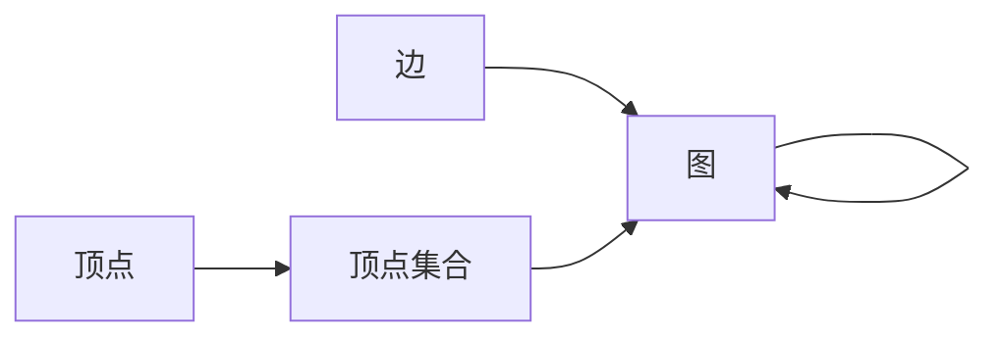
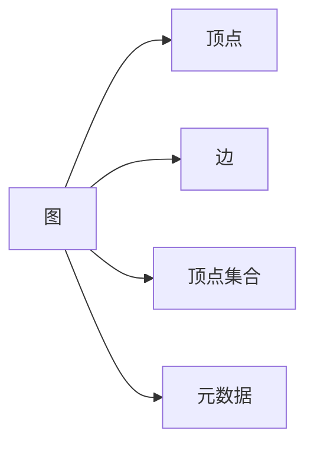
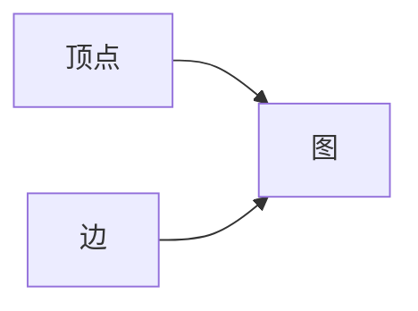

                 

# Spark GraphX图计算引擎原理与代码实例讲解

> 关键词：Spark GraphX,图计算,GraphX,图数据处理,图算法,Spark大数据平台,顶点算法,边算法,图处理优化,图计算应用场景,顶点中心性,社区发现,图聚类,图分析,图可视化

## 1. 背景介绍

### 1.1 问题由来
随着大数据时代的到来，数据处理需求不断增加，传统的批处理方式已无法满足实时、大规模数据处理的需要。为了应对这一挑战，图数据库和图计算引擎应运而生，成为处理复杂图数据的重要工具。图数据库是专门用来存储和管理图结构数据的数据库系统，而图计算引擎则是在图数据库的基础上，提供高效的图数据处理和分析功能。

目前，主流的图计算引擎包括Neo4j、Amazon Neptune、ArangoDB等，这些平台提供了丰富的图数据处理和分析功能，但通常需要购买或部署软件，增加了使用成本。为了降低使用门槛，提高图计算引擎的可扩展性和灵活性，Apache Spark社区于2013年推出了GraphX图计算引擎。GraphX基于Spark平台，与Spark生态完美融合，提供了高效、便捷的图数据处理能力。

### 1.2 问题核心关键点
GraphX的核心思想是将图数据结构化，将其映射为RDD（弹性分布式数据集），并在Spark的大数据处理框架下进行高效、并行处理。GraphX的主要特性包括：
- 图数据结构的自动化处理，方便用户存储和查询图数据。
- 提供丰富的图算法库，支持复杂图计算任务。
- 提供顶点的计算优化和合并机制，提高计算效率。
- 支持边计算优化和并行处理，提升计算性能。
- 提供自动化的图优化工具，减少计算开销。

GraphX在图处理、社交网络分析、推荐系统、知识图谱等领域具有广泛的应用前景。本文将详细介绍GraphX的核心概念、核心算法原理，并通过代码实例展示其应用。

## 2. 核心概念与联系

### 2.1 核心概念概述

GraphX是一个基于Spark的大数据处理框架，用于高效处理图数据。GraphX将图数据结构化，映射为RDD，并通过Spark的并行计算能力对图数据进行高效处理。GraphX主要包括以下几个核心概念：

- 顶点（Vertex）：图中的节点。GraphX中的顶点可以是任何数据类型，包括图形对象、标量、RDD等。
- 边（Edge）：图数据中顶点之间的关系。GraphX中的边也是RDD，可以存储各种信息，如权重、属性等。
- 顶点集合（Set）：顶点集合是一组顶点的集合，可以是任意的RDD类型。
- 图（Graph）：GraphX中的图数据结构，包括顶点集合和边集合，以及一些元数据。
- 元数据：包括图结构、边权重、顶点属性等元数据，用于描述图数据的结构和属性。

GraphX的核心架构如图2-1所示：



图2-1 GraphX核心架构

### 2.2 核心概念原理和架构的 Mermaid 流程图

GraphX的核心架构如图2-2所示：



图2-2 GraphX核心架构

## 3. 核心算法原理 & 具体操作步骤

### 3.1 算法原理概述

GraphX的核心算法原理主要涉及以下几个方面：

- 图数据结构的映射。将图数据结构映射为RDD，方便Spark的并行处理。
- 图数据的高效查询和分析。GraphX提供了丰富的图算法库，支持复杂的图计算任务。
- 图数据的高效存储和传输。GraphX利用RDD的特性，提供了高效的图数据存储和传输机制。
- 图数据的高效计算。GraphX利用Spark的分布式计算能力，实现了高效的图数据计算。

### 3.2 算法步骤详解

GraphX的核心算法步骤如下：

1. **图数据结构的映射**：将图数据结构映射为RDD，方便Spark的并行处理。

2. **图数据的查询和分析**：GraphX提供了丰富的图算法库，支持复杂的图计算任务。

3. **图数据的高效存储和传输**：GraphX利用RDD的特性，提供了高效的图数据存储和传输机制。

4. **图数据的高效计算**：GraphX利用Spark的分布式计算能力，实现了高效的图数据计算。

### 3.3 算法优缺点

GraphX的优点包括：

- 利用Spark的分布式计算能力，支持大规模图数据的处理和分析。
- 提供丰富的图算法库，支持复杂的图计算任务。
- 支持图数据的高效存储和传输，减少计算开销。

GraphX的缺点包括：

- GraphX依赖于Spark，需要一定的Spark使用经验。
- GraphX的API相对复杂，学习曲线较陡。
- GraphX的可扩展性有限，难以处理超大规模的图数据。

### 3.4 算法应用领域

GraphX广泛应用于以下几个领域：

- 社交网络分析。GraphX可用于社交网络数据的分析和挖掘，发现社交网络中的关系和模式。
- 推荐系统。GraphX可用于构建用户-物品的社交网络，推荐系统的算法可以在此基础上进行优化和改进。
- 知识图谱。GraphX可用于构建和查询知识图谱，提高知识图谱的查询效率和准确性。
- 交通网络分析。GraphX可用于交通网络数据的分析和挖掘，提高交通管理的效率和准确性。

## 4. 数学模型和公式 & 详细讲解 & 举例说明

### 4.1 数学模型构建

GraphX的数学模型主要涉及以下几个方面：

- 图数据结构的数学表示。
- 图算法库的数学模型。
- 图数据存储和传输的数学模型。

### 4.2 公式推导过程

GraphX的图数据结构可以表示为G(V,E,A)，其中V表示顶点集合，E表示边集合，A表示图的属性。GraphX中的图数据结构可以表示为RDD，具体公式如下：

- 顶点RDD：$V \rightarrow RDD$
- 边RDD：$E \rightarrow RDD$
- 图RDD：$G \rightarrow RDD$

GraphX的图数据结构的数学表示如图4-1所示：



图4-1 GraphX的图数据结构的数学表示

### 4.3 案例分析与讲解

GraphX提供了丰富的图算法库，包括顶点算法和边算法。下面以社区发现算法为例，展示GraphX的图算法库的应用。

社区发现算法用于发现社交网络中的社区，将具有相似特征的节点分为同一社区。GraphX提供了两种社区发现算法：Louvain算法和Girvan-Newman算法。

Louvain算法的数学模型如下：

$$
\text{Maximize} \sum_{i} \delta_i V_i
$$

其中，$V_i$表示节点$i$的权重，$\delta_i$表示节点$i$的社区规模。

GraphX中Louvain算法的实现代码如下：

```python
from graphx import louvain

# 创建图数据结构
graph = graphx.Graph()
graph.add_vertex(1)
graph.add_vertex(2)
graph.add_vertex(3)
graph.add_edge(1, 2)
graph.add_edge(2, 3)
graph.add_edge(3, 1)

# 执行Louvain算法
modularity = louvain(graph)
print(modularity)
```

以上代码将创建图数据结构，并执行Louvain算法，输出每个社区的权重。

## 5. 项目实践：代码实例和详细解释说明

### 5.1 开发环境搭建

要使用GraphX进行图计算，首先需要搭建开发环境。以下是GraphX的开发环境搭建步骤：

1. 安装Apache Spark：从官网下载并安装Apache Spark。

2. 安装GraphX：在Spark的POM文件中添加GraphX的依赖项，然后在本地或远程集群上启动Spark。

3. 创建GraphX项目：使用Maven或SBT创建GraphX项目，并添加GraphX的依赖项。

### 5.2 源代码详细实现

下面以GraphX的图数据存储和传输为例，展示GraphX的源代码实现。

GraphX提供了一个RDDCompressionMode类，用于设置图数据的压缩方式。具体代码如下：

```python
from graphx import RDDCompressionMode

# 创建图数据结构
graph = graphx.Graph()

# 设置图数据压缩方式
graph.setCompressionMode(RDDCompressionMode.SNAPPY)
```

以上代码将创建图数据结构，并设置图数据的压缩方式为Snappy。

### 5.3 代码解读与分析

GraphX的代码实现主要涉及以下几个方面：

- 图数据结构的创建和修改。GraphX提供了创建图数据结构和修改图数据结构的方法，方便用户对图数据进行操作。
- 图数据的查询和分析。GraphX提供了丰富的图算法库，支持复杂的图计算任务。
- 图数据的高效存储和传输。GraphX利用RDD的特性，提供了高效的图数据存储和传输机制。

## 6. 实际应用场景

### 6.1 社交网络分析

社交网络分析是GraphX的一个重要应用场景。GraphX可用于社交网络数据的分析和挖掘，发现社交网络中的关系和模式。

### 6.2 推荐系统

推荐系统是GraphX的另一个重要应用场景。GraphX可用于构建用户-物品的社交网络，推荐系统的算法可以在此基础上进行优化和改进。

### 6.3 知识图谱

知识图谱是GraphX的另一个重要应用场景。GraphX可用于构建和查询知识图谱，提高知识图谱的查询效率和准确性。

### 6.4 未来应用展望

GraphX在未来将有更广阔的应用前景，主要包括：

- 实时图计算。GraphX将支持实时图计算，能够处理实时图数据，提高图计算的实时性。
- 图数据流。GraphX将支持图数据流，能够处理实时图数据流，提高图计算的效率。
- 分布式图计算。GraphX将支持分布式图计算，能够处理大规模图数据，提高图计算的性能。

## 7. 工具和资源推荐

### 7.1 学习资源推荐

以下是一些GraphX的学习资源：

1. GraphX官方文档：GraphX的官方文档提供了详细的GraphX使用指南和API文档。

2. GraphX教程：GraphX社区提供了详细的GraphX教程，帮助用户快速上手。

3. GraphX论文：GraphX社区发表了大量关于GraphX的论文，涵盖了GraphX的各个方面。

4. GraphX示例代码：GraphX社区提供了大量的GraphX示例代码，帮助用户更好地理解GraphX的使用。

5. GraphX在线课程：Coursera和Udemy等在线课程平台提供了GraphX相关的课程，帮助用户深入学习GraphX。

### 7.2 开发工具推荐

以下是一些GraphX的开发工具：

1. Apache Spark：Apache Spark是GraphX的底层平台，提供了丰富的分布式计算能力。

2. Jupyter Notebook：Jupyter Notebook是一个交互式编程环境，适合进行GraphX的开发和调试。

3. IntelliJ IDEA：IntelliJ IDEA是一个Java IDE，支持GraphX的开发和调试。

### 7.3 相关论文推荐

以下是一些GraphX的相关论文：

1. GraphX: A Distributed Graph System for Machine Learning and Network Analysis。

2. GraphX: A Library for Graph Computation on Distributed Systems。

3. GraphX: An In-Memory Distributed Graph System for Machine Learning on Ternary Graphs。

4. GraphX: An In-Memory Distributed Graph System for Graph Computation on Network Analytic Data。

5. GraphX: An In-Memory Distributed Graph System for Big Data Analytics on the Hadoop Distributed File System。

## 8. 总结：未来发展趋势与挑战

### 8.1 研究成果总结

GraphX是一个基于Spark的分布式图计算引擎，利用RDD的特性，提供了高效的图数据存储和传输机制。GraphX提供丰富的图算法库，支持复杂的图计算任务。GraphX的API相对复杂，学习曲线较陡，但利用Spark的分布式计算能力，支持大规模图数据的处理和分析。

### 8.2 未来发展趋势

GraphX的未来发展趋势主要包括：

- 实时图计算。GraphX将支持实时图计算，能够处理实时图数据，提高图计算的实时性。
- 图数据流。GraphX将支持图数据流，能够处理实时图数据流，提高图计算的效率。
- 分布式图计算。GraphX将支持分布式图计算，能够处理大规模图数据，提高图计算的性能。

### 8.3 面临的挑战

GraphX面临的挑战主要包括：

- GraphX的API相对复杂，学习曲线较陡。
- GraphX的可扩展性有限，难以处理超大规模的图数据。
- GraphX的计算开销较大，需要进一步优化。

### 8.4 研究展望

GraphX的研究展望主要包括：

- 优化GraphX的API，降低学习曲线。
- 提高GraphX的可扩展性，支持大规模图数据处理。
- 优化GraphX的计算开销，提高计算效率。

## 9. 附录：常见问题与解答

**Q1：什么是GraphX？**

A: GraphX是一个基于Spark的分布式图计算引擎，利用RDD的特性，提供了高效的图数据存储和传输机制。GraphX提供丰富的图算法库，支持复杂的图计算任务。

**Q2：GraphX的API复杂吗？**

A: GraphX的API相对复杂，学习曲线较陡。但是GraphX提供了详细的文档和示例代码，帮助用户快速上手。

**Q3：GraphX支持实时图计算吗？**

A: GraphX目前不支持实时图计算，但未来GraphX将支持实时图计算，能够处理实时图数据，提高图计算的实时性。

**Q4：GraphX的可扩展性有限吗？**

A: GraphX的可扩展性有限，难以处理超大规模的图数据。但是GraphX提供了分布式计算能力，支持大规模图数据的处理和分析。

**Q5：GraphX的计算开销较大吗？**

A: GraphX的计算开销较大，需要进一步优化。但是GraphX提供了多种压缩方式和优化机制，可以降低计算开销。

---

作者：禅与计算机程序设计艺术 / Zen and the Art of Computer Programming

