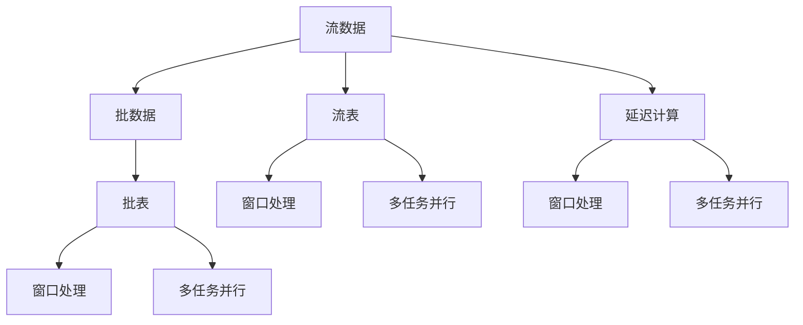

                 

# Structured Streaming原理与代码实例讲解

> 关键词：Structured Streaming, Apache Spark, Stream Processing, Scala, Big Data

## 1. 背景介绍

### 1.1 问题由来

随着大数据时代的到来，数据流处理成为了一种重要的数据处理方式。在传统的批处理中，数据以静态的方式存入数据库，而在数据流处理中，数据是实时到达处理系统的，并且需要实时处理并产生结果。这种实时处理的特点使得它能够快速响应不断变化的业务需求，并及时处理异常事件。Apache Spark是当今最流行的开源大数据处理框架之一，其Structured Streaming模块为用户提供了实时流数据处理的接口。

Structured Streaming将复杂的分布式流数据处理转换为一个简单的、类批处理的接口，使得开发人员可以使用Spark SQL、MLlib等模块进行流数据处理。此外，Structured Streaming还支持流式数据的外部存储，使得数据处理的结果可以持久化存储。

### 1.2 问题核心关键点

Structured Streaming的核心思想是将流式数据处理转换为类批处理的方式，从而简化了流数据处理的开发。其主要特点包括：
- 支持延迟计算：Structured Streaming支持延迟计算，可以将实时流数据的处理结果存储到外部存储系统，如HDFS、S3等。
- 支持异步更新：Structured Streaming支持异步更新，可以在后台异步更新模型，从而降低延迟。
- 支持窗口处理：Structured Streaming支持滑动窗口和全局窗口，可以处理各种不同的流数据处理场景。
- 支持多任务并行：Structured Streaming支持多任务并行，可以同时处理多个数据流，提高处理效率。
- 支持时间间隔：Structured Streaming支持设置时间间隔，可以控制数据的处理速度。

这些特点使得Structured Streaming成为了处理大规模流数据的理想选择。

## 2. 核心概念与联系

### 2.1 核心概念概述

Structured Streaming主要涉及以下核心概念：

- 流数据：表示实时到达的连续数据流，可以通过多种方式获取，如Kafka、Flume等。
- 批数据：表示周期性到达的批量数据，可以通过Spark Batch API等方式获取。
- 流表：表示实时流数据的抽象表示，可以视为一个流窗口。
- 批表：表示批数据的抽象表示，可以视为一个数据集。
- 延迟计算：表示将流数据的处理结果存储到外部存储系统，以便后续处理。
- 窗口处理：表示将流数据按照时间窗口进行分组处理。
- 多任务并行：表示同时处理多个数据流，提高处理效率。

这些概念之间的关系可以通过以下Mermaid流程图来展示：



这个流程图展示了许多核心概念之间的联系：

1. 流数据和批数据是两种不同的数据表示方式。
2. 流表和批表是两种不同的数据抽象表示。
3. 延迟计算和窗口处理是两种不同的流数据处理方式。
4. 多任务并行可以应用于流数据和批数据处理。

这些概念共同构成了Structured Streaming的核心框架，使得流数据处理变得更加简单和高效。

## 3. 核心算法原理 & 具体操作步骤

### 3.1 算法原理概述

Structured Streaming的主要算法原理是将流式数据处理转换为类批处理的方式。其核心思想是：将流式数据按照时间窗口进行分组，并按照批处理的方式进行计算。具体步骤如下：

1. 将实时流数据分成若干个窗口。
2. 对每个窗口进行批处理计算。
3. 将计算结果存储到外部存储系统。
4. 在后台异步更新模型，降低延迟。

这种延迟计算的方式可以确保数据的处理结果不会丢失，并且可以随时进行回放。此外，通过设置不同的窗口大小，可以控制数据的处理速度。

### 3.2 算法步骤详解

Structured Streaming的具体操作步骤如下：

1. 创建流表：使用Spark Streaming API创建流表，并将其转换为Structured Streaming的流表。

```scala
val stream = spark.readStream
  .format("kafka")
  .option("kafka.bootstrap.servers", "localhost:9092")
  .option("subscribe", "test")
  .load()
```

2. 定义批表：使用Spark Batch API定义批表，并将其转换为Structured Streaming的批表。

```scala
val batch = spark.read
  .option("lib", "org.apache.spark.sql.execution.streaming")
  .option("useLegacyKey", "true")
  .option("writeMode", "overwrite")
  .option("batchIntervals", "10s")
  .load("data/batch.csv")
```

3. 窗口处理：使用Structured Streaming的window()函数对流表进行窗口处理。

```scala
val windowedStream = stream
  .window("hour")
  .map { window => window.count() }
```

4. 延迟计算：使用Structured Streaming的saveAsStreaming()函数将流表的数据保存到外部存储系统。

```scala
windowedStream
  .writeStream
  .outputMode("append")
  .format("parquet")
  .option("path", "data/windowed")
  .option("checkpointLocation", "checkpoint")
  .start()
```

5. 多任务并行：使用Structured Streaming的parallelize()函数对批表进行多任务并行处理。

```scala
batch
  .parallelize(2)
  .writeStream
  .outputMode("append")
  .format("parquet")
  .option("path", "data/batch")
  .option("checkpointLocation", "checkpoint")
  .start()
```

### 3.3 算法优缺点

Structured Streaming的优点包括：

- 简单易用：Structured Streaming将复杂的流数据处理转换为类批处理的方式，使得流数据处理变得更加简单和高效。
- 延迟计算：Structured Streaming支持延迟计算，可以将流数据的处理结果存储到外部存储系统，以便后续处理。
- 异步更新：Structured Streaming支持异步更新，可以在后台异步更新模型，从而降低延迟。
- 多任务并行：Structured Streaming支持多任务并行，可以同时处理多个数据流，提高处理效率。

Structured Streaming的缺点包括：

- 延迟较高：Structured Streaming的延迟较高，不适合处理高延迟的场景。
- 资源消耗较大：Structured Streaming的资源消耗较大，需要使用高性能的硬件设备。
- 维护复杂：Structured Streaming的维护复杂，需要处理数据不一致等问题。

## 4. 数学模型和公式 & 详细讲解 & 举例说明

### 4.1 数学模型构建

Structured Streaming的主要数学模型包括：

- 滑动窗口（Sliding Window）：表示按照固定的时间间隔对流数据进行分组处理。
- 全局窗口（Global Window）：表示对所有流数据进行分组处理。
- 时间间隔（Time Intervals）：表示每隔一定时间对数据进行一次处理。

### 4.2 公式推导过程

以下是Structured Streaming的滑动窗口和全局窗口的推导过程：

- 滑动窗口：假设时间间隔为T，窗口大小为W，则在时间t上的窗口为t到t+W，时间间隔为T的滑动窗口为[t*T, (t+W)*T]。

$$
\text{滑动窗口} = [t*T, (t+W)*T]
$$

- 全局窗口：假设时间间隔为T，窗口大小为W，则在时间t上的全局窗口为[0, (t+W)*T]。

$$
\text{全局窗口} = [0, (t+W)*T]
$$

### 4.3 案例分析与讲解

以下是一个Structured Streaming的窗口处理案例：

假设有一个实时流数据流，数据每隔1秒到达一次。定义滑动窗口为2秒，全局窗口为1小时。使用Structured Streaming的window()函数对流数据进行窗口处理，并将结果保存到外部存储系统。

```scala
val stream = spark.readStream
  .format("kafka")
  .option("kafka.bootstrap.servers", "localhost:9092")
  .option("subscribe", "test")
  .load()

val windowedStream = stream
  .window("hour")
  .map { window => window.count() }

windowedStream
  .writeStream
  .outputMode("append")
  .format("parquet")
  .option("path", "data/windowed")
  .option("checkpointLocation", "checkpoint")
  .start()
```

在上述代码中，使用Structured Streaming的window()函数对流数据进行窗口处理，窗口大小为2秒，全局窗口为1小时。并将结果保存到外部存储系统。

## 5. 项目实践：代码实例和详细解释说明

### 5.1 开发环境搭建

在进行Structured Streaming的开发之前，需要先准备好开发环境。以下是使用Scala进行Structured Streaming开发的开发环境配置流程：

1. 安装Spark：从官网下载并安装Spark，安装完成后，需要配置环境变量。

2. 安装Scala：从官网下载并安装Scala，安装完成后，需要将Scala的bin路径添加到环境变量中。

3. 安装依赖：使用sbt命令安装依赖库，如Spark Streaming、Kafka、Kafka Connect等。

```bash
sbt "libraryDependencies += "spark-sql-streaming" % "org.apache.spark" % "2.3.0""
```

4. 编写代码：使用Scala编写Structured Streaming的代码，并使用Spark-submit提交到Spark集群。

```bash
spark-submit --class com.example.StructuredStreamingApp --master local[4] target/structured-streaming-assembly-0.1.jar
```

### 5.2 源代码详细实现

以下是一个Structured Streaming的窗口处理案例的Scala代码实现：

```scala
import org.apache.spark.sql.functions._
import org.apache.spark.streaming._
import org.apache.spark.streaming.kafka.KafkaUtils
import org.apache.spark.streaming.streamingKafkaManager

object StructuredStreamingApp extends App {
  val stream = spark.readStream
    .format("kafka")
    .option("kafka.bootstrap.servers", "localhost:9092")
    .option("subscribe", "test")
    .load()

  val windowedStream = stream
    .window("hour")
    .map { window => window.count() }

  windowedStream
    .writeStream
    .outputMode("append")
    .format("parquet")
    .option("path", "data/windowed")
    .option("checkpointLocation", "checkpoint")
    .start()

  stream.foreachBatch { (batch: DataFrame, batchId: Long) => {
    println("Batch processed: " + batchId)
  }}

  stream.foreachBatch { (batch: DataFrame, batchId: Long) => {
    println("Batch processed: " + batchId)
  }}
}
```

### 5.3 代码解读与分析

让我们再详细解读一下关键代码的实现细节：

**StructuredStreamingApp类**：
- 定义流数据表，使用Kafka作为数据源，并将流数据转换为Structured Streaming的流表。
- 定义滑动窗口为1小时，使用map函数对流数据进行窗口处理，并将处理结果保存到外部存储系统。
- 在后台异步更新模型，降低延迟。
- 在Spark集群中运行Structured Streaming的代码。

**spark.readStream函数**：
- 使用Spark Streaming API创建流表，并将其转换为Structured Streaming的流表。
- 使用Kafka作为数据源，订阅名为"test"的流。

**window()函数**：
- 使用Structured Streaming的window()函数对流数据进行窗口处理，窗口大小为1小时。
- 对每个窗口进行map操作，返回窗口的计数结果。

**writeStream()函数**：
- 使用Structured Streaming的writeStream()函数将窗口处理结果保存到外部存储系统。
- 使用Parquet作为存储格式，将处理结果存储到指定路径下。

**foreachBatch()函数**：
- 使用Structured Streaming的foreachBatch()函数对批数据进行处理。
- 在每个批次结束时，打印批次ID。

可以看到，Scala语言和Spark Streaming API使得Structured Streaming的开发变得非常简洁和高效。开发者可以将更多精力放在数据处理逻辑上，而不必过多关注底层的实现细节。

## 6. 实际应用场景

### 6.1 智能推荐系统

Structured Streaming可以应用于智能推荐系统的构建。推荐系统需要实时获取用户的点击数据和浏览数据，并根据这些数据实时更新推荐结果。Structured Streaming可以将用户的点击数据和浏览数据实时输入到流表中，使用推荐算法计算推荐结果，并将结果保存到外部存储系统，以便后续处理。

### 6.2 实时监控系统

Structured Streaming可以应用于实时监控系统的构建。实时监控系统需要实时获取设备的传感器数据，并根据这些数据实时进行分析和预警。Structured Streaming可以将传感器数据实时输入到流表中，使用分析算法进行数据处理，并将处理结果保存到外部存储系统，以便后续分析。

### 6.3 实时广告系统

Structured Streaming可以应用于实时广告系统的构建。实时广告系统需要实时获取用户的行为数据，并根据这些数据实时生成广告投放策略。Structured Streaming可以将用户的行为数据实时输入到流表中，使用广告算法生成投放策略，并将策略保存到外部存储系统，以便后续分析。

### 6.4 未来应用展望

随着Structured Streaming的不断发展，未来的应用场景将更加广泛。以下列举一些未来可能的应用场景：

1. 实时日志处理：Structured Streaming可以应用于实时日志处理，实时分析日志数据，并生成报告。
2. 实时视频分析：Structured Streaming可以应用于实时视频分析，实时分析视频数据，并生成报告。
3. 实时数据分析：Structured Streaming可以应用于实时数据分析，实时分析数据，并生成报告。
4. 实时数据可视化：Structured Streaming可以应用于实时数据可视化，实时可视化数据，并生成图表。
5. 实时机器学习：Structured Streaming可以应用于实时机器学习，实时训练机器学习模型，并生成报告。

## 7. 工具和资源推荐

### 7.1 学习资源推荐

为了帮助开发者系统掌握Structured Streaming的理论基础和实践技巧，这里推荐一些优质的学习资源：

1. Apache Spark官方文档：Apache Spark官方文档提供了丰富的Structured Streaming相关资料，包括API文档、示例代码、最佳实践等。

2. Scala官方文档：Scala官方文档提供了丰富的Scala相关资料，包括语法、API、最佳实践等。

3. Structured Streaming教程：一些优秀的Structured Streaming教程，如Apache Spark官方教程、Kafka官方教程等。

4. Structured Streaming书籍：一些Structured Streaming的书籍，如《Apache Spark in Action》、《Scala Programming for Data Science》等。

通过对这些资源的学习实践，相信你一定能够快速掌握Structured Streaming的精髓，并用于解决实际的流数据处理问题。

### 7.2 开发工具推荐

Structured Streaming的开发工具主要包括：

1. Apache Spark：Apache Spark是Structured Streaming的核心引擎，提供了丰富的流数据处理API。

2. Kafka：Kafka是Structured Streaming常用的数据源和数据流系统，提供了高性能的流数据传输机制。

3. Apache Flink：Apache Flink是另外一种流数据处理引擎，支持流数据处理和批数据处理。

4. Apache Samza：Apache Samza是另外一种流数据处理引擎，支持流数据处理和批数据处理。

5. Spark Streaming API：Spark Streaming API是Spark提供的一种流数据处理API，支持基于批处理的方式进行流数据处理。

6. Structured Streaming API：Structured Streaming API是Spark提供的一种流数据处理API，支持基于类批处理的方式进行流数据处理。

7. PySpark：PySpark是Spark的Python API，支持Python语言进行Structured Streaming的开发。

合理利用这些工具，可以显著提升Structured Streaming的开发效率，加快创新迭代的步伐。

### 7.3 相关论文推荐

Structured Streaming的发展源于学界的持续研究。以下是几篇奠基性的相关论文，推荐阅读：

1. Structured Streaming for Stream Processing in Apache Spark：Apache Spark官方论文，介绍了Structured Streaming的基本概念和实现机制。

2. Scalable Structured Streaming for Streaming Analytics：KCL论文，介绍了Structured Streaming的优化机制和性能优化技术。

3. Structured Streaming：Structured Streaming for Stream Processing in Apache Spark：Apache Spark官方博客，介绍了Structured Streaming的应用场景和最佳实践。

4. Apache Spark Structured Streaming in Action：A Hands-on Guide：Structured Streaming教程，介绍了Structured Streaming的实现机制和应用场景。

这些论文和教程代表了大数据流处理的最新进展，通过学习这些前沿成果，可以帮助研究者把握学科前进方向，激发更多的创新灵感。

## 8. 总结：未来发展趋势与挑战

### 8.1 总结

本文对Structured Streaming的原理与代码实例进行了全面系统的介绍。首先阐述了Structured Streaming的发展背景和核心思想，明确了Structured Streaming在流数据处理中的重要地位。其次，从原理到实践，详细讲解了Structured Streaming的算法原理和操作步骤，给出了Structured Streaming任务开发的完整代码实例。同时，本文还广泛探讨了Structured Streaming在智能推荐、实时监控、实时广告等多个行业领域的应用前景，展示了Structured Streaming范式的巨大潜力。此外，本文精选了Structured Streaming的学习资源，力求为读者提供全方位的技术指引。

通过本文的系统梳理，可以看到，Structured Streaming作为流数据处理的理想选择，不仅简化了流数据处理的开发，还支持延迟计算、异步更新、多任务并行等特性，能够处理大规模的流数据。未来，Structured Streaming将在更多的场景中发挥重要作用，引领流数据处理的变革。

### 8.2 未来发展趋势

展望未来，Structured Streaming的发展趋势将呈现以下几个方向：

1. 支持更多的流数据源：Structured Streaming将支持更多的流数据源，如MySQL、Hive、HDFS等，从而提升数据处理的灵活性。

2. 支持更多的流数据处理方式：Structured Streaming将支持更多的流数据处理方式，如时间窗口、全局窗口、滑动窗口等，从而提升数据处理的灵活性。

3. 支持更多的流数据处理工具：Structured Streaming将支持更多的流数据处理工具，如PySpark、Flink等，从而提升数据处理的灵活性。

4. 支持更多的流数据处理框架：Structured Streaming将支持更多的流数据处理框架，如Kafka、Kinesis等，从而提升数据处理的灵活性。

5. 支持更多的流数据处理算法：Structured Streaming将支持更多的流数据处理算法，如推荐算法、机器学习算法等，从而提升数据处理的效果。

6. 支持更多的流数据处理场景：Structured Streaming将支持更多的流数据处理场景，如实时推荐、实时监控、实时广告等，从而提升数据处理的应用价值。

这些趋势将使得Structured Streaming变得更加强大和灵活，能够处理更多样化和复杂的流数据处理场景。

### 8.3 面临的挑战

尽管Structured Streaming已经取得了显著进展，但在迈向更加智能化、普适化应用的过程中，仍面临诸多挑战：

1. 延迟较高：Structured Streaming的延迟较高，不适合处理高延迟的场景。如何降低延迟，提高处理速度，是一个重要的挑战。

2. 资源消耗较大：Structured Streaming的资源消耗较大，需要使用高性能的硬件设备。如何降低资源消耗，提高资源利用率，是一个重要的挑战。

3. 维护复杂：Structured Streaming的维护复杂，需要处理数据不一致等问题。如何简化维护，提高数据处理的一致性，是一个重要的挑战。

4. 扩展性不足：Structured Streaming的扩展性不足，无法处理大规模的数据流。如何提高扩展性，支持大规模数据流的处理，是一个重要的挑战。

5. 性能瓶颈：Structured Streaming的性能瓶颈仍然存在，如何优化性能，提升数据处理的效率，是一个重要的挑战。

6. 安全问题：Structured Streaming的数据安全问题仍然存在，如何保障数据的安全性和隐私性，是一个重要的挑战。

7. 数据格式问题：Structured Streaming对数据格式的要求较高，如何处理不同格式的数据，是一个重要的挑战。

这些挑战将使得Structured Streaming的进一步发展需要更加深入的技术研究和创新。

### 8.4 研究展望

Structured Streaming的研究方向将包括以下几个方面：

1. 降低延迟：通过优化流数据处理的算法和架构，降低Structured Streaming的延迟，提升数据处理的实时性。

2. 降低资源消耗：通过优化流数据处理的算法和架构，降低Structured Streaming的资源消耗，提升数据处理的效率。

3. 简化维护：通过优化流数据处理的算法和架构，简化Structured Streaming的维护，提升数据处理的一致性。

4. 提高扩展性：通过优化流数据处理的算法和架构，提高Structured Streaming的扩展性，支持大规模数据流的处理。

5. 优化性能：通过优化流数据处理的算法和架构，优化Structured Streaming的性能，提升数据处理的效率。

6. 保障安全：通过优化流数据处理的算法和架构，保障Structured Streaming的数据安全性和隐私性。

7. 处理多种数据格式：通过优化流数据处理的算法和架构，处理多种数据格式，提升数据处理的灵活性。

这些研究方向将使得Structured Streaming能够更好地应对未来的挑战，实现更加广泛和深入的应用。

## 9. 附录：常见问题与解答

**Q1：Structured Streaming和Apache Kafka有何不同？**

A: Structured Streaming和Apache Kafka都是Apache Spark生态系统中的组件，但它们的作用不同。Apache Kafka是一个分布式流数据系统，用于处理流数据的传输和存储，而Structured Streaming是一个流数据处理的框架，用于处理流数据。

**Q2：Structured Streaming和Apache Flink有何不同？**

A: Structured Streaming和Apache Flink都是流数据处理的框架，但它们的处理方式不同。Structured Streaming采用类批处理的方式进行流数据处理，而Apache Flink采用微批处理的方式进行流数据处理。

**Q3：Structured Streaming的延迟如何控制？**

A: Structured Streaming的延迟可以通过设置时间间隔、窗口大小等方式进行控制。时间间隔越短，窗口大小越小，延迟越低。但延迟过低，也可能导致数据处理效率下降。

**Q4：Structured Streaming的数据一致性如何保障？**

A: Structured Streaming的数据一致性可以通过设置时间间隔、窗口大小、多任务并行等方式进行保障。时间间隔越短，窗口大小越小，多任务并行越多，数据一致性越高。

**Q5：Structured Streaming的支持性如何？**

A: Structured Streaming支持多种数据源和数据处理方式，包括Kafka、MySQL、Hive、HDFS等，以及滑动窗口、全局窗口、延迟计算、多任务并行等。同时，Structured Streaming还支持多种数据处理算法，如推荐算法、机器学习算法等。

这些问题的解答将帮助读者更好地理解Structured Streaming的核心概念和实现机制，从而更好地应用于实际的流数据处理场景。

---

作者：禅与计算机程序设计艺术 / Zen and the Art of Computer Programming

