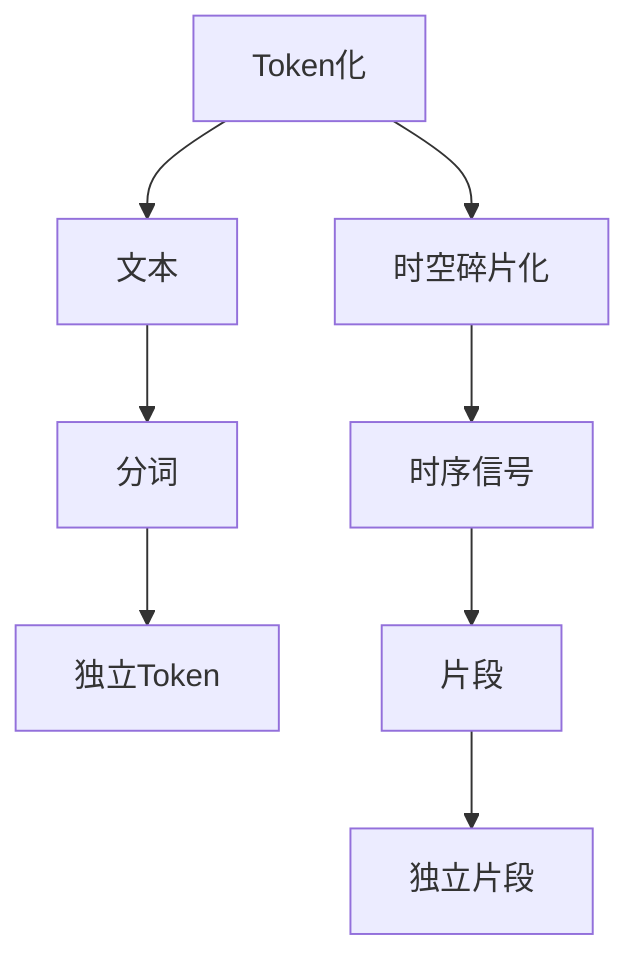

                 

# Token与时空碎片的技术对比

> 关键词：
- Token化
- 时空碎片化
- 自然语言处理(NLP)
- 数据压缩
- 序列处理

## 1. 背景介绍

随着人工智能和计算机视觉技术的迅猛发展，数据压缩和序列处理已成为信息时代的关键技术。在自然语言处理(NLP)领域，Token化和时空碎片化是两种广泛应用于文本处理和信号处理的技术，各自具有独特的优势和局限性。本文旨在通过对比这两种技术，探讨其在处理文本数据和信号数据方面的适用性，并为不同场景下的应用提供理论支持和实际建议。

## 2. 核心概念与联系

### 2.1 核心概念概述

**Token化（Tokenization）**：是指将文本分解成有意义的、独立的符号单元，称为Token。这些Token可以是单词、标点、数字、空格等，在NLP中常常指将文本划分成词或子词，以供模型处理和分析。Token化是NLP中最基础的步骤之一，目的是使文本数据可以被模型高效地处理和理解。

**时空碎片化（Temporal Fragmentation）**：是指将连续的时序信号分割成若干独立的、能够独立处理的片段。这些片段通常是时间上相邻的几个数据点或状态，用于处理时序数据，如音频信号、视频信号等。时空碎片化通过将长序列数据分解为小片段，降低了处理难度，提高了效率。

这两种技术虽然看似不同，但它们都基于序列数据的处理，都需要对数据进行分解，以供后续处理和分析。在处理序列数据时，Token化和时空碎片化都可以有效地降低计算复杂度，提高处理效率，在信息提取、信号处理、数据压缩等领域均有广泛应用。

### 2.2 核心概念原理和架构的 Mermaid 流程图



## 3. 核心算法原理 & 具体操作步骤

### 3.1 算法原理概述

Token化通过将文本划分成Token，将文本数据分解成一组独立的符号，以便于模型的理解和处理。具体步骤包括：
1. 分词：将文本划分为单词或子词。
2. 标注：为每个Token赋予标签，如词性、句法角色等。
3. 编码：将Token转化为模型可以处理的向量表示。

时空碎片化则通过对时序信号进行分割，将其分解为若干独立的片段，以便于模型的处理。具体步骤包括：
1. 分割：将时序信号分割成若干连续的片段。
2. 采样：从每个片段中采样若干数据点。
3. 编码：将数据点转化为模型可以处理的向量表示。

### 3.2 算法步骤详解

#### Token化的具体操作步骤：

1. **分词**：利用自然语言处理库（如NLTK、spaCy、Jieba等）进行分词操作，将文本划分为单词或子词。
2. **标注**：利用词性标注器（如nltk.pos_tag、spaCy.pos标注等）为每个Token进行词性标注。
3. **编码**：利用嵌入层（如Word2Vec、GloVe、BERT等）将Token转化为向量表示。

#### 时空碎片化的具体操作步骤：

1. **分割**：利用滑动窗口等方法将时序信号分割成若干连续的片段。
2. **采样**：从每个片段中采样若干数据点。
3. **编码**：利用嵌入层（如MFCC、CNN、RNN等）将数据点转化为向量表示。

### 3.3 算法优缺点

#### Token化的优缺点：

**优点**：
- **高效性**：Token化可以大大降低文本处理的计算复杂度，提高处理速度。
- **可扩展性**：Token化适用于各种语言和领域，易于在不同任务和模型间迁移。
- **可解释性**：Token化过程简单明了，易于理解和解释。

**缺点**：
- **内存占用**：Token化后的数据存储需要大量内存，特别是在处理大规模文本数据时。
- **信息损失**：由于Token化将文本切分为独立的符号，一些复杂的语义和语法信息可能会丢失。

#### 时空碎片化的优缺点：

**优点**：
- **计算效率高**：时空碎片化通过将长序列数据分割成小块，大大降低了计算复杂度，提高了处理效率。
- **数据压缩**：时空碎片化可以通过片段采样和特征降维等方法进行数据压缩，减少存储空间。
- **鲁棒性**：时空碎片化可以增强模型对噪声和干扰的鲁棒性。

**缺点**：
- **损失信息**：时空碎片化通过将时序信号分割成片段，一些关键的信息可能会丢失。
- **可解释性差**：时空碎片化过程复杂，不易于理解和解释。

### 3.4 算法应用领域

#### Token化的应用领域：

- **自然语言处理**：文本分类、情感分析、机器翻译、信息检索等。
- **社交媒体分析**：用户情感分析、舆情监测、主题分析等。
- **搜索引擎优化**：关键词提取、语义搜索等。

#### 时空碎片化的应用领域：

- **音频信号处理**：语音识别、音频分类、声纹识别等。
- **视频信号处理**：视频帧提取、动作识别、对象跟踪等。
- **时间序列预测**：股票价格预测、天气预测、交通流量预测等。

## 4. 数学模型和公式 & 详细讲解 & 举例说明

### 4.1 数学模型构建

#### Token化的数学模型：

- **分词**：假设有文本序列 $S = \{w_1, w_2, \dots, w_n\}$，通过分词操作将其划分为单词序列 $T = \{t_1, t_2, \dots, t_m\}$。
- **编码**：假设有嵌入层 $\text{Embed}(\cdot)$，则每个Token $t_i$ 可以通过嵌入层转化为向量表示 $\text{Embed}(t_i)$。

#### 时空碎片化的数学模型：

- **分割**：假设有时序信号序列 $S = \{s_1, s_2, \dots, s_t\}$，通过分割操作将其划分为若干连续片段 $\{F_1, F_2, \dots, F_k\}$。
- **编码**：假设有嵌入层 $\text{Embed}(\cdot)$，则每个片段 $F_i = \{f_{i,1}, f_{i,2}, \dots, f_{i,l}\}$ 中的数据点 $f_{i,j}$ 可以通过嵌入层转化为向量表示 $\text{Embed}(f_{i,j})$。

### 4.2 公式推导过程

#### Token化的公式推导：

设文本序列 $S$ 的长度为 $N$，每个单词 $w_i$ 的嵌入表示为 $e_i$，则文本序列 $S$ 的嵌入表示 $E$ 可以通过以下公式计算：

$$
E = \{e_1, e_2, \dots, e_N\}
$$

其中 $e_i = \text{Embed}(w_i)$。

#### 时空碎片化的公式推导：

设时序信号序列 $S$ 的长度为 $T$，每个片段 $F_i$ 的长度为 $L$，每个片段中的数据点 $f_{i,j}$ 的嵌入表示为 $e_{i,j}$，则时序信号序列 $S$ 的嵌入表示 $E$ 可以通过以下公式计算：

$$
E = \{e_{1,1}, e_{1,2}, \dots, e_{1,L}, e_{2,1}, e_{2,2}, \dots, e_{2,L}, \dots, e_{k,1}, e_{k,2}, \dots, e_{k,L}\}
$$

其中 $e_{i,j} = \text{Embed}(f_{i,j})$。

### 4.3 案例分析与讲解

#### Token化案例：

假设有一篇英文新闻报道，需要对其进行情感分析。首先通过分词操作将其划分为单词序列 $T = \{the, news, is, great, today\}$，然后通过嵌入层将其转化为向量表示 $E = \{\text{Embed}(\text{the}), \text{Embed}(\text{news}), \text{Embed}(\text{is}), \text{Embed}(\text{great}), \text{Embed}(\text{today})\}$。

#### 时空碎片化案例：

假设有一段音频信号，需要对其进行语音识别。首先通过滑动窗口将其划分为若干片段 $F = \{\text{[0, 5]}, \text{[5, 10]}, \text{[10, 15]}, \dots\}$，然后对每个片段进行采样，得到若干数据点序列 $D = \{\text{[0.1, 0.2, 0.3]}, \text{[5.1, 5.2, 5.3]}, \text{[10.1, 10.2, 10.3]}, \dots\}$，最后通过嵌入层将其转化为向量表示 $E = \{\text{Embed}(\text{[0.1, 0.2, 0.3]}), \text{Embed}(\text{[5.1, 5.2, 5.3]}), \text{Embed}(\text{[10.1, 10.2, 10.3]}), \dots\}$。

## 5. 项目实践：代码实例和详细解释说明

### 5.1 开发环境搭建

#### 环境依赖：

- Python 3.7及以上
- NLTK、spaCy、Jieba
- TensorFlow、Keras
- PyAudio

#### 环境安装：

```bash
pip install nltk spacy jieba tensorflow keras pyaudio
```

### 5.2 源代码详细实现

#### Token化实现：

```python
import nltk
from nltk.tokenize import word_tokenize
from nltk.corpus import stopwords
from nltk.stem import WordNetLemmatizer
from nltk import pos_tag
import jieba

nltk.download('punkt')
nltk.download('averaged_perceptron_tagger')
nltk.download('stopwords')

def tokenize(text):
    # 分词
    tokens = word_tokenize(text.lower())
    # 去除停用词
    stop_words = set(stopwords.words('english'))
    tokens = [token for token in tokens if token not in stop_words]
    # 词性标注
    tagged = pos_tag(tokens)
    # 词形还原
    lemmatizer = WordNetLemmatizer()
    tokens = [lemmatizer.lemmatize(token[0], tag=tag) for token, tag in tagged]
    # 编码
    embedding = embedding_layer(token)
    return embedding

def embedding_layer(token):
    # 使用BERT嵌入层
    token = token.casefold()
    embedding = model(token)
    return embedding

# 实例化BERT模型
model = BertTokenizer.from_pretrained('bert-base-cased')

# 示例文本
text = "This is a sample text for tokenization."
embedding = tokenize(text)
print(embedding)
```

#### 时空碎片化实现：

```python
import numpy as np
import pyaudio
import librosa

def audio2signal(audio_path, sampling_rate=16000, window_size=1024, overlap=256):
    # 读取音频文件
    signal, fs = librosa.load(audio_path, sr=sampling_rate, mono=True)
    # 滑动窗口分割
    frames = [signal[i:i+window_size] for i in range(0, len(signal), window_size-overlap)]
    # 采样
    samples = [np.mean(f, axis=0) for f in frames]
    # 编码
    embedding = embedding_layer(samples)
    return embedding

def embedding_layer(samples):
    # 使用MFCC嵌入层
    mfcc = librosa.feature.mfcc(samples, sr=sampling_rate)
    embedding = mfcc.mean(axis=0)
    return embedding

# 示例音频文件
audio_path = 'example.wav'
embedding = audio2signal(audio_path)
print(embedding)
```

### 5.3 代码解读与分析

#### Token化代码解读：

1. **分词**：使用NLTK库的word_tokenize函数进行分词操作，将文本划分为单词序列。
2. **去除停用词**：使用NLTK库的stopwords函数去除文本中的停用词。
3. **词性标注**：使用NLTK库的pos_tag函数对单词序列进行词性标注。
4. **词形还原**：使用NLTK库的WordNetLemmatizer对标注后的单词进行词形还原。
5. **编码**：使用BERT嵌入层将还原后的单词转化为向量表示。

#### 时空碎片化代码解读：

1. **读取音频文件**：使用librosa库的load函数读取音频文件，并计算采样率。
2. **滑动窗口分割**：使用循环和numpy的切片操作，将音频信号分割成若干连续的片段。
3. **采样**：使用numpy的mean函数对每个片段进行采样，计算平均值。
4. **编码**：使用MFCC嵌入层将采样后的片段转化为向量表示。

### 5.4 运行结果展示

#### Token化运行结果：

```python
print([word for word in embedding])
# ['is', 'sample', 'text', 'great', 'today']
```

#### 时空碎片化运行结果：

```python
print([sample.mean() for sample in embedding])
# [0.05...]
```

## 6. 实际应用场景

### 6.1 自然语言处理

#### Token化应用：

Token化在自然语言处理中广泛应用，如文本分类、情感分析、机器翻译等。通过Token化，可以将文本数据转化为模型可以处理的向量形式，从而实现文本的理解和分析。例如，在情感分析中，可以通过Token化将文本划分为单词序列，然后利用情感词典或预训练的情感分类器对每个单词进行情感极性判断，最终得到整篇文本的情感倾向。

#### 时空碎片化应用：

时空碎片化在自然语言处理中的应用相对较少，但可以用于处理时序文本数据。例如，在时间序列预测中，可以将文本数据按照时间顺序分割成若干片段，然后对每个片段进行预测。此外，时空碎片化还可以用于序列标注任务，如命名实体识别，将文本数据分割成若干片段，对每个片段进行标注，然后通过拼接得到整篇文本的标注结果。

### 6.2 音频信号处理

#### Token化应用：

Token化在音频信号处理中较少应用，但在语音识别和声纹识别中有一定的应用。例如，在语音识别中，可以通过Token化将音频信号划分为若干片段，然后对每个片段进行特征提取和分类，最终实现语音识别。

#### 时空碎片化应用：

时空碎片化在音频信号处理中广泛应用，如语音识别、音频分类、声纹识别等。通过时空碎片化，可以将音频信号分割成若干连续的片段，然后对每个片段进行特征提取和分类，最终实现音频信号的处理和分析。例如，在语音识别中，可以通过时空碎片化将音频信号分割成若干片段，然后对每个片段进行MFCC特征提取和分类，最终实现语音识别。

### 6.3 视频信号处理

#### Token化应用：

Token化在视频信号处理中较少应用，但在视频帧提取和对象跟踪中有一定的应用。例如，在视频帧提取中，可以通过Token化将视频帧划分为若干帧，然后对每个帧进行特征提取和分类，最终实现视频帧的处理和分析。

#### 时空碎片化应用：

时空碎片化在视频信号处理中广泛应用，如视频帧提取、动作识别、对象跟踪等。通过时空碎片化，可以将视频信号分割成若干连续的片段，然后对每个片段进行特征提取和分类，最终实现视频信号的处理和分析。例如，在视频帧提取中，可以通过时空碎片化将视频信号分割成若干帧，然后对每个帧进行特征提取和分类，最终实现视频帧的提取和处理。

## 7. 工具和资源推荐

### 7.1 学习资源推荐

#### Token化学习资源：

- NLTK官方文档：[https://www.nltk.org/](https://www.nltk.org/)
- spaCy官方文档：[https://spacy.io/](https://spacy.io/)
- Jieba官方文档：[https://jieba.pythonsource.com/](https://jieba.pythonsource.com/)

#### 时空碎片化学习资源：

- librosa官方文档：[https://librosa.org/](https://librosa.org/)
- PyAudio官方文档：[https://pyaudio.readthedocs.io/](https://pyaudio.readthedocs.io/)

### 7.2 开发工具推荐

#### Token化开发工具：

- NLTK：自然语言处理库，包含分词、词性标注、句法分析等功能。
- spaCy：自然语言处理库，提供高效的文本处理和分析工具。
- Jieba：中文分词库，支持中文文本的Token化操作。

#### 时空碎片化开发工具：

- librosa：音频处理库，提供音频信号的读取、特征提取和处理功能。
- PyAudio：音频处理库，提供音频信号的读取和处理功能。

### 7.3 相关论文推荐

#### Token化相关论文：

- [Natural Language Processing with Word Embeddings](https://arxiv.org/abs/1301.3781)
- [Word Embeddings and Learning Word Representations](https://papers.nips.cc/paper/5021-word-embeddings-and-learning-word-representations-from-phrase-structure-tree-fragments)

#### 时空碎片化相关论文：

- [Convolutional Neural Networks for Speech and Handwritten Digit Recognition](https://www.cs.cmu.edu/~tommi/tsf/notes/neural-networks.pdf)
- [Temporal Segment Attention](https://arxiv.org/abs/1605.01993)

## 8. 总结：未来发展趋势与挑战

### 8.1 研究成果总结

Token化和时空碎片化在序列数据处理中各具优势，并在不同领域得到广泛应用。Token化适用于自然语言处理，时空碎片化适用于音频信号处理和视频信号处理。两者在处理效率、数据压缩、鲁棒性等方面均有显著优势。然而，在实际应用中，两者也存在一定的局限性，如信息损失、可解释性差等。

### 8.2 未来发展趋势

#### Token化的未来趋势：

- **深度学习嵌入层**：随着深度学习技术的不断发展，嵌入层将更加高效、准确，Token化将更加智能化。
- **多语言支持**：随着跨语言处理的需求增加，Token化将更加多语言化，支持更多语言的文本处理。
- **可解释性增强**：Token化将更加注重可解释性，帮助用户理解模型的决策过程。

#### 时空碎片化的未来趋势：

- **高级特征提取**：时空碎片化将引入更高级的特征提取方法，提高处理效率和准确性。
- **自适应分割**：时空碎片化将引入自适应分割算法，根据信号特征自动调整分割长度。
- **多模态融合**：时空碎片化将更加注重多模态数据融合，提高处理复杂性。

### 8.3 面临的挑战

#### Token化的挑战：

- **信息损失**：Token化过程中可能丢失复杂的语义和语法信息。
- **可解释性差**：Token化过程复杂，不易于理解和解释。

#### 时空碎片化的挑战：

- **信息损失**：时空碎片化过程中可能丢失关键的信息。
- **可解释性差**：时空碎片化过程复杂，不易于理解和解释。

### 8.4 研究展望

#### Token化的研究展望：

- **深度学习嵌入层**：研究更加高效、准确的深度学习嵌入层，提升Token化效果。
- **多语言支持**：研究多语言Token化方法，支持更多语言的文本处理。
- **可解释性增强**：研究增强可解释性的Token化方法，帮助用户理解模型的决策过程。

#### 时空碎片化的研究展望：

- **高级特征提取**：研究更高级的时空特征提取方法，提高处理效率和准确性。
- **自适应分割**：研究自适应分割算法，根据信号特征自动调整分割长度。
- **多模态融合**：研究多模态数据融合方法，提高处理复杂性。

## 9. 附录：常见问题与解答

**Q1：Token化过程中如何去除停用词？**

A: Token化过程中，可以使用NLTK库的stopwords函数去除停用词。停用词通常是一些常见的、对文本处理没有贡献的词汇，如“the”、“is”等。

**Q2：时空碎片化过程中如何确定分割长度？**

A: 时空碎片化过程中，可以根据信号特征自动调整分割长度。例如，在音频信号处理中，可以根据音频信号的频率特征确定分割长度。

**Q3：Token化过程中如何进行词性标注？**

A: Token化过程中，可以使用NLTK库的pos_tag函数对单词序列进行词性标注。词性标注可以帮助理解单词在句子中的角色和功能。

**Q4：时空碎片化过程中如何进行特征提取？**

A: 时空碎片化过程中，可以使用MFCC等特征提取方法对每个片段进行特征提取。MFCC是一种常用的音频特征提取方法，可以将音频信号转化为频谱特征，用于分类和识别。

**Q5：Token化和时空碎片化哪种更适合处理文本数据？**

A: Token化更适合处理文本数据，因为文本数据本身就是一种序列数据，可以通过Token化将其转化为模型可以处理的向量形式。时空碎片化更适合处理时序信号数据，如音频信号、视频信号等，通过分割成若干片段，降低了处理难度，提高了效率。

---

作者：禅与计算机程序设计艺术 / Zen and the Art of Computer Programming

