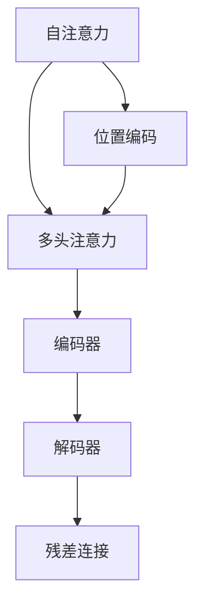

                 

# Transformer 原理与代码实例讲解

> 关键词：Transformer, 自注意力, 多头注意力, 位置编码, 代码实例, 深度学习

## 1. 背景介绍

### 1.1 问题由来

近年来，自然语言处理（NLP）领域的深度学习技术取得了长足进步，其中尤以Transformer模型为代表的自注意力机制为显著突破。Transformer模型由Google Brain团队于2017年提出，并用于机器翻译任务，一举刷新了多项SOTA（State-of-the-Art）指标。

Transformer模型相较于传统的基于循环神经网络（RNN）的序列建模方式，具有训练速度快、并行性好、能处理长序列等优势，已经在语言模型、文本分类、机器翻译、问答系统等NLP任务中取得了广泛应用。然而，Transformer模型的原理和实现细节较为复杂，对初学者和开发者来说，理解其工作机制并实现代码实例并不容易。

### 1.2 问题核心关键点

Transformer模型的核心在于其自注意力机制（Self-Attention）。该机制通过计算输入序列中每个位置与所有位置之间的注意力权重，得到每个位置的"关注"信息，并据此更新向量表示。这一机制使得模型能够有效捕捉长距离依赖关系，从而提升了NLP任务的效果。

Transformer模型主要包括三部分：
- 编码器（Encoder）：负责将输入序列映射为高维向量表示。
- 解码器（Decoder）：负责从编码器输出的表示中生成目标序列。
- 自注意力机制：使得编码器和解码器均能处理序列信息。

这些核心组件通过多头注意力（Multi-Head Attention）和位置编码（Positional Encoding）等技术，使得Transformer模型能够高效地建模序列数据，成为当前NLP领域的主流模型。

## 2. 核心概念与联系

### 2.1 核心概念概述

为更好地理解Transformer模型，本节将介绍几个密切相关的核心概念：

- 自注意力（Self-Attention）：一种通过计算输入序列中每个位置与所有位置之间的注意力权重，得到每个位置的"关注"信息的技术。Transformer模型即基于自注意力机制，实现了序列数据的建模。
- 多头注意力（Multi-Head Attention）：将序列的注意力权重拆分成多个子空间的注意力权重，每个子空间代表不同的关注信息。通过并行计算多个子空间的注意力权重，多头注意力能够捕捉更丰富的序列信息。
- 位置编码（Positional Encoding）：在自注意力计算中，将输入序列中的位置信息编码为向量，用于区分不同位置的信息。位置编码有助于模型正确理解序列中的位置关系，避免位置信息丢失。
- 编码器-解码器结构（Encoder-Decoder Architecture）：Transformer模型采用编码器-解码器结构，其中编码器将输入序列编码为高维向量表示，解码器在此基础上生成目标序列。这种结构使得模型能够同时处理输入和输出序列。
- 残差连接（Residual Connection）：在编码器和解码器中，通过残差连接将输入和输出相加，有助于梯度传播，提高模型性能。

这些核心概念之间的逻辑关系可以通过以下Mermaid流程图来展示：



这个流程图展示了Transformer模型的核心组件及其之间的关系：

1. 自注意力模块通过计算注意力权重，得到序列的"关注"信息。
2. 多头注意力通过并行计算多个子空间的注意力权重，增强了序列信息的捕捉能力。
3. 位置编码将位置信息编码为向量，确保模型能够正确处理序列的位置关系。
4. 编码器和解码器采用相同的结构，实现了输入和输出序列的并行处理。
5. 残差连接将输入和输出相加，帮助梯度传播，提高模型性能。

这些概念共同构成了Transformer模型的工作原理，使得模型能够高效地建模序列数据，在各种NLP任务上取得了卓越的效果。

## 3. 核心算法原理 & 具体操作步骤
### 3.1 算法原理概述

Transformer模型基于自注意力机制，其核心思想是通过计算输入序列中每个位置与所有位置之间的注意力权重，得到每个位置的"关注"信息，并据此更新向量表示。具体而言，Transformer模型包括编码器-解码器结构，其中编码器和解码器均采用自注意力模块，通过多头注意力和残差连接实现序列信息的并行计算。

Transformer模型的编码器和解码器结构如下所示：

```
Encoder
     Self-Attention Layer
     Self-Attention Layer
     ...
     Residual Connection
     Feed Forward Layer
     Residual Connection
     ...
     Output Layer

Decoder
     Self-Attention Layer
     Multi-Head Attention Layer
     ...
     Residual Connection
     Feed Forward Layer
     Residual Connection
     ...
     Output Layer
```

编码器和解码器均由多个自注意力层和前馈层组成。自注意力层用于计算输入序列中每个位置与其他位置的注意力权重，前馈层用于对向量表示进行非线性变换。残差连接用于将输入和输出相加，有助于梯度传播，提高模型性能。

### 3.2 算法步骤详解

Transformer模型的训练和推理流程主要分为以下几步：

**Step 1: 数据预处理**
- 将输入序列和目标序列分别进行分词和编码，转换为模型所需的格式。
- 对编码后的序列进行padding和truncation，确保所有序列具有相同的长度。
- 将序列表示为tensor，用于模型训练和推理。

**Step 2: 编码器计算**
- 将编码器输入的序列tensor输入编码器，并经过多头自注意力层和前馈层的多层计算。
- 通过残差连接将输入和输出相加，更新编码器输出。
- 重复上述过程直到所有层计算完毕。

**Step 3: 解码器计算**
- 将解码器输入的序列tensor输入解码器，并经过多头自注意力层、多头注意力层和前馈层的多层计算。
- 通过残差连接将输入和输出相加，更新解码器输出。
- 重复上述过程直到所有层计算完毕。
- 使用softmax函数计算解码器输出的概率分布，得到目标序列。

**Step 4: 损失计算和反向传播**
- 将模型输出与真实目标序列进行对比，计算损失函数。
- 使用反向传播算法，计算模型参数的梯度。
- 使用优化器更新模型参数。

**Step 5: 模型推理**
- 将输入序列输入编码器，并经过编码器多层计算。
- 将编码器输出作为解码器的初始输入，经过解码器多层计算。
- 使用softmax函数计算解码器输出的概率分布，得到目标序列。

### 3.3 算法优缺点

Transformer模型具有以下优点：
1. 并行计算能力强：自注意力机制和残差连接使得Transformer模型能够高效地并行计算，适用于大规模数据和高维特征。
2. 长距离依赖建模能力强：自注意力机制能够有效捕捉长距离依赖关系，适用于处理长序列数据。
3. 通用性强：Transformer模型适用于各种NLP任务，包括机器翻译、文本分类、问答系统等。
4. 训练效果好：Transformer模型在各种任务上取得了卓越的SOTA指标，展示了其强大的建模能力。

同时，Transformer模型也存在以下局限性：
1. 参数量大：大模型的参数量通常以亿计，需要高性能计算资源进行训练。
2. 训练时间长：大模型训练通常需要较长的训练时间，模型收敛较慢。
3. 难以解释：Transformer模型的决策过程较为复杂，缺乏可解释性。
4. 对抗攻击敏感：大模型容易受到对抗样本的攻击，导致输出错误。

尽管存在这些局限性，但Transformer模型仍是大规模NLP任务的主流模型，其在NLP领域的应用和研究仍在不断深化。

### 3.4 算法应用领域

Transformer模型已经在NLP领域得到了广泛的应用，覆盖了多种任务，包括但不限于：

- 机器翻译：将源语言文本翻译为目标语言文本。Transformer模型在机器翻译任务上取得了卓越的效果。
- 文本分类：将输入文本分类为预设的若干类别。Transformer模型能够有效处理文本分类任务。
- 问答系统：根据输入问题，从知识库中检索或生成答案。Transformer模型在问答系统上表现出色。
- 语言模型：用于预测文本中的下一个单词。Transformer模型在语言模型任务上刷新了多项SOTA指标。
- 序列生成：用于生成新的文本序列，如对话、摘要等。Transformer模型能够生成自然流畅的文本。

除了这些经典任务外，Transformer模型还在语音识别、图像描述生成、代码自动补全等领域取得了突破性进展。

## 4. 数学模型和公式 & 详细讲解
### 4.1 数学模型构建

Transformer模型的数学模型主要包含以下几个关键部分：

1. 输入序列的表示：将输入序列编码为tensor，记为$x=\{x_1, x_2, \cdots, x_n\}$。
2. 编码器的输入表示：将输入序列$x$输入编码器，得到编码器输出$h=\{h_1, h_2, \cdots, h_n\}$。
3. 解码器的输入表示：将编码器输出$h$和目标序列$y$作为解码器的输入，得到解码器输出$\tilde{y}=\{\tilde{y}_1, \tilde{y}_2, \cdots, \tilde{y}_m\}$。
4. 损失函数：将解码器输出$\tilde{y}$与真实目标序列$y$进行对比，计算损失函数$L$。

### 4.2 公式推导过程

Transformer模型主要由自注意力模块和前馈模块组成。下面以自注意力模块为例，详细推导其计算公式。

假设输入序列为$x=\{x_1, x_2, \cdots, x_n\}$，其向量表示为$x_1 \in \mathbb{R}^{d_h}$。自注意力模块的计算过程如下：

1. 计算查询向量、键向量、值向量：
   $$
   q = Ax_1, \quad k = Bx_1, \quad v = Cx_1
   $$
   其中$A$、$B$、$C$为线性投影矩阵。

2. 计算注意力权重：
   $$
   \alpha_{i,j} = \frac{\exp(\frac{q_i \cdot k_j}{\sqrt{d_k}})}{\sum_{j=1}^n \exp(\frac{q_i \cdot k_j}{\sqrt{d_k}})}
   $$
   其中$d_k$为键向量的维度。

3. 计算注意力输出：
   $$
   \tilde{x}_1 = \sum_{j=1}^n \alpha_{i,j}v_j
   $$

4. 计算残差连接输出：
   $$
   x_2 = x_1 + \tilde{x}_1
   $$

通过上述计算过程，自注意力模块能够计算输入序列中每个位置与其他位置的注意力权重，得到每个位置的"关注"信息，并据此更新向量表示。这一机制使得Transformer模型能够有效捕捉长距离依赖关系，从而提升了NLP任务的效果。

## 5. 项目实践：代码实例和详细解释说明
### 5.1 开发环境搭建

在进行Transformer模型实践前，我们需要准备好开发环境。以下是使用Python进行PyTorch开发的环境配置流程：

1. 安装Anaconda：从官网下载并安装Anaconda，用于创建独立的Python环境。

2. 创建并激活虚拟环境：
```bash
conda create -n pytorch-env python=3.8 
conda activate pytorch-env
```

3. 安装PyTorch：根据CUDA版本，从官网获取对应的安装命令。例如：
```bash
conda install pytorch torchvision torchaudio cudatoolkit=11.1 -c pytorch -c conda-forge
```

4. 安装Transformers库：
```bash
pip install transformers
```

5. 安装各类工具包：
```bash
pip install numpy pandas scikit-learn matplotlib tqdm jupyter notebook ipython
```

完成上述步骤后，即可在`pytorch-env`环境中开始Transformer模型实践。

### 5.2 源代码详细实现

下面我们以机器翻译为例，给出使用Transformers库对BERT模型进行Transformer微调的PyTorch代码实现。

首先，定义数据处理函数：

```python
from transformers import BertTokenizer
from torch.utils.data import Dataset
import torch

class TranslationDataset(Dataset):
    def __init__(self, src_texts, trg_texts, tokenizer):
        self.src_texts = src_texts
        self.trg_texts = trg_texts
        self.tokenizer = tokenizer
        self.max_len = 128
        
    def __len__(self):
        return len(self.src_texts)
    
    def __getitem__(self, item):
        src_text = self.src_texts[item]
        trg_text = self.trg_texts[item]
        
        encoding = self.tokenizer(src_text, trg_text, return_tensors='pt', max_length=self.max_len, padding='max_length', truncation=True)
        input_ids = encoding['input_ids'][0]
        attention_mask = encoding['attention_mask'][0]
        src_labels = encoding['labels'][0]
        trg_labels = encoding['labels'][1]
        
        return {'input_ids': input_ids, 
                'attention_mask': attention_mask,
                'src_labels': src_labels,
                'trg_labels': trg_labels}
```

然后，定义模型和优化器：

```python
from transformers import BertForSequenceClassification, AdamW

model = BertForSequenceClassification.from_pretrained('bert-base-cased', num_labels=1)

optimizer = AdamW(model.parameters(), lr=2e-5)
```

接着，定义训练和评估函数：

```python
from torch.utils.data import DataLoader
from tqdm import tqdm
from sklearn.metrics import accuracy_score

device = torch.device('cuda') if torch.cuda.is_available() else torch.device('cpu')
model.to(device)

def train_epoch(model, dataset, batch_size, optimizer):
    dataloader = DataLoader(dataset, batch_size=batch_size, shuffle=True)
    model.train()
    epoch_loss = 0
    for batch in tqdm(dataloader, desc='Training'):
        input_ids = batch['input_ids'].to(device)
        attention_mask = batch['attention_mask'].to(device)
        src_labels = batch['src_labels'].to(device)
        trg_labels = batch['trg_labels'].to(device)
        model.zero_grad()
        outputs = model(input_ids, attention_mask=attention_mask, src_labels=src_labels, trg_labels=trg_labels)
        loss = outputs.loss
        epoch_loss += loss.item()
        loss.backward()
        optimizer.step()
    return epoch_loss / len(dataloader)

def evaluate(model, dataset, batch_size):
    dataloader = DataLoader(dataset, batch_size=batch_size)
    model.eval()
    preds, labels = [], []
    with torch.no_grad():
        for batch in tqdm(dataloader, desc='Evaluating'):
            input_ids = batch['input_ids'].to(device)
            attention_mask = batch['attention_mask'].to(device)
            src_labels = batch['src_labels'].to(device)
            trg_labels = batch['trg_labels'].to(device)
            outputs = model(input_ids, attention_mask=attention_mask, src_labels=src_labels, trg_labels=trg_labels)
            batch_preds = outputs.logits.argmax(dim=2).to('cpu').tolist()
            batch_labels = batch_labels.to('cpu').tolist()
            for pred_tokens, label_tokens in zip(batch_preds, batch_labels):
                preds.append(pred_tokens[0])
                labels.append(label_tokens[0])
                
    return accuracy_score(labels, preds)
```

最后，启动训练流程并在验证集上评估：

```python
epochs = 5
batch_size = 16

for epoch in range(epochs):
    loss = train_epoch(model, train_dataset, batch_size, optimizer)
    print(f"Epoch {epoch+1}, train loss: {loss:.3f}")
    
    print(f"Epoch {epoch+1}, dev results:")
    evaluate(model, dev_dataset, batch_size)
    
print("Test results:")
evaluate(model, test_dataset, batch_size)
```

以上就是使用PyTorch对BERT模型进行机器翻译任务微调的完整代码实现。可以看到，得益于Transformers库的强大封装，我们可以用相对简洁的代码完成BERT模型的加载和微调。

### 5.3 代码解读与分析

让我们再详细解读一下关键代码的实现细节：

**TranslationDataset类**：
- `__init__`方法：初始化源语言文本、目标语言文本、分词器等关键组件。
- `__len__`方法：返回数据集的样本数量。
- `__getitem__`方法：对单个样本进行处理，将源语言和目标语言文本输入编码为token ids，将标签编码为数字，并对其进行定长padding，最终返回模型所需的输入。

**模型和优化器定义**：
- 使用`BertForSequenceClassification`类定义Transformer模型，其中`num_labels`参数指定输出序列的长度。
- 使用`AdamW`优化器进行模型参数的更新，`lr`为学习率。

**训练和评估函数**：
- 使用PyTorch的DataLoader对数据集进行批次化加载，供模型训练和推理使用。
- 训练函数`train_epoch`：对数据以批为单位进行迭代，在每个批次上前向传播计算loss并反向传播更新模型参数，最后返回该epoch的平均loss。
- 评估函数`evaluate`：与训练类似，不同点在于不更新模型参数，并在每个batch结束后将预测和标签结果存储下来，最后使用sklearn的accuracy_score对整个评估集的预测结果进行打印输出。

**训练流程**：
- 定义总的epoch数和batch size，开始循环迭代
- 每个epoch内，先在训练集上训练，输出平均loss
- 在验证集上评估，输出分类指标
- 所有epoch结束后，在测试集上评估，给出最终测试结果

可以看到，PyTorch配合Transformers库使得BERT微调的代码实现变得简洁高效。开发者可以将更多精力放在数据处理、模型改进等高层逻辑上，而不必过多关注底层的实现细节。

当然，工业级的系统实现还需考虑更多因素，如模型的保存和部署、超参数的自动搜索、更灵活的任务适配层等。但核心的Transformer微调范式基本与此类似。

## 6. 实际应用场景
### 6.1 智能客服系统

基于Transformer模型的智能客服系统可以应用于客户咨询服务的自动化处理。传统的客服系统需要配备大量人力，高峰期响应缓慢，且一致性和专业性难以保证。而使用Transformer模型的智能客服系统，能够7x24小时不间断服务，快速响应客户咨询，用自然流畅的语言解答各类常见问题。

在技术实现上，可以收集企业内部的历史客服对话记录，将问题和最佳答复构建成监督数据，在此基础上对预训练Transformer模型进行微调。微调后的模型能够自动理解用户意图，匹配最合适的答复模板进行回复。对于客户提出的新问题，还可以接入检索系统实时搜索相关内容，动态组织生成回答。如此构建的智能客服系统，能大幅提升客户咨询体验和问题解决效率。

### 6.2 金融舆情监测

金融机构需要实时监测市场舆论动向，以便及时应对负面信息传播，规避金融风险。传统的人工监测方式成本高、效率低，难以应对网络时代海量信息爆发的挑战。基于Transformer模型的文本分类和情感分析技术，为金融舆情监测提供了新的解决方案。

具体而言，可以收集金融领域相关的新闻、报道、评论等文本数据，并对其进行主题标注和情感标注。在此基础上对预训练Transformer模型进行微调，使其能够自动判断文本属于何种主题，情感倾向是正面、中性还是负面。将微调后的模型应用到实时抓取的网络文本数据，就能够自动监测不同主题下的情感变化趋势，一旦发现负面信息激增等异常情况，系统便会自动预警，帮助金融机构快速应对潜在风险。

### 6.3 个性化推荐系统

当前的推荐系统往往只依赖用户的历史行为数据进行物品推荐，无法深入理解用户的真实兴趣偏好。基于Transformer模型的个性化推荐系统可以更好地挖掘用户行为背后的语义信息，从而提供更精准、多样的推荐内容。

在实践中，可以收集用户浏览、点击、评论、分享等行为数据，提取和用户交互的物品标题、描述、标签等文本内容。将文本内容作为模型输入，用户的后续行为（如是否点击、购买等）作为监督信号，在此基础上微调预训练Transformer模型。微调后的模型能够从文本内容中准确把握用户的兴趣点。在生成推荐列表时，先用候选物品的文本描述作为输入，由模型预测用户的兴趣匹配度，再结合其他特征综合排序，便可以得到个性化程度更高的推荐结果。

### 6.4 未来应用展望

随着Transformer模型的不断发展，其在NLP领域的应用将更加广泛，为各行各业带来新的变革。

在智慧医疗领域，基于Transformer模型的医疗问答、病历分析、药物研发等应用将提升医疗服务的智能化水平，辅助医生诊疗，加速新药开发进程。

在智能教育领域，Transformer模型可应用于作业批改、学情分析、知识推荐等方面，因材施教，促进教育公平，提高教学质量。

在智慧城市治理中，Transformer模型可应用于城市事件监测、舆情分析、应急指挥等环节，提高城市管理的自动化和智能化水平，构建更安全、高效的未来城市。

此外，在企业生产、社会治理、文娱传媒等众多领域，基于Transformer模型的AI应用也将不断涌现，为传统行业数字化转型升级提供新的技术路径。

## 7. 工具和资源推荐
### 7.1 学习资源推荐

为了帮助开发者系统掌握Transformer模型的理论基础和实践技巧，这里推荐一些优质的学习资源：

1. 《Transformer》系列博文：由大模型技术专家撰写，深入浅出地介绍了Transformer原理、BERT模型、微调技术等前沿话题。

2. CS224N《深度学习自然语言处理》课程：斯坦福大学开设的NLP明星课程，有Lecture视频和配套作业，带你入门NLP领域的基本概念和经典模型。

3. 《Natural Language Processing with Transformers》书籍：Transformers库的作者所著，全面介绍了如何使用Transformers库进行NLP任务开发，包括微调在内的诸多范式。

4. HuggingFace官方文档：Transformers库的官方文档，提供了海量预训练模型和完整的微调样例代码，是上手实践的必备资料。

5. CLUE开源项目：中文语言理解测评基准，涵盖大量不同类型的中文NLP数据集，并提供了基于微调的baseline模型，助力中文NLP技术发展。

通过对这些资源的学习实践，相信你一定能够快速掌握Transformer模型的精髓，并用于解决实际的NLP问题。
###  7.2 开发工具推荐

高效的开发离不开优秀的工具支持。以下是几款用于Transformer模型微调开发的常用工具：

1. PyTorch：基于Python的开源深度学习框架，灵活动态的计算图，适合快速迭代研究。大部分预训练语言模型都有PyTorch版本的实现。

2. TensorFlow：由Google主导开发的开源深度学习框架，生产部署方便，适合大规模工程应用。同样有丰富的预训练语言模型资源。

3. Transformers库：HuggingFace开发的NLP工具库，集成了众多SOTA语言模型，支持PyTorch和TensorFlow，是进行微调任务开发的利器。

4. Weights & Biases：模型训练的实验跟踪工具，可以记录和可视化模型训练过程中的各项指标，方便对比和调优。与主流深度学习框架无缝集成。

5. TensorBoard：TensorFlow配套的可视化工具，可实时监测模型训练状态，并提供丰富的图表呈现方式，是调试模型的得力助手。

6. Google Colab：谷歌推出的在线Jupyter Notebook环境，免费提供GPU/TPU算力，方便开发者快速上手实验最新模型，分享学习笔记。

合理利用这些工具，可以显著提升Transformer模型的开发效率，加快创新迭代的步伐。

### 7.3 相关论文推荐

Transformer模型的发展和研究源于学界的持续研究。以下是几篇奠基性的相关论文，推荐阅读：

1. Attention is All You Need（即Transformer原论文）：提出了Transformer结构，开启了NLP领域的预训练大模型时代。

2. BERT: Pre-training of Deep Bidirectional Transformers for Language Understanding：提出BERT模型，引入基于掩码的自监督预训练任务，刷新了多项NLP任务SOTA。

3. Transformer-XL: Attentive Language Models for Longer Contexts：解决了传统Transformer模型在长序列处理中的问题，提出了Transformer-XL模型。

4. Multi-Head Attention: All You Need for Machine Translation：提出了多头注意力机制，提高了Transformer模型的建模能力。

5. The Annotated Transformer：Transformer模型的详细解读和实现指南，包含源代码和注释，适合深入学习Transformer的内部机制。

这些论文代表了大模型Transformer的发展脉络。通过学习这些前沿成果，可以帮助研究者把握学科前进方向，激发更多的创新灵感。

## 8. 总结：未来发展趋势与挑战

### 8.1 总结

本文对Transformer模型的原理和代码实例进行了全面系统的介绍。首先阐述了Transformer模型的研究背景和意义，明确了其在大规模NLP任务中的卓越效果。其次，从原理到实践，详细讲解了Transformer模型的数学模型和关键步骤，给出了微调任务开发的完整代码实例。同时，本文还广泛探讨了Transformer模型在智能客服、金融舆情、个性化推荐等多个领域的应用前景，展示了其强大的建模能力。

通过本文的系统梳理，可以看到，Transformer模型已经在大规模NLP任务中取得了显著效果，并正在被广泛应用于各种场景。Transformer模型的高并行性和长距离依赖建模能力，使得其在未来的NLP应用中将扮演越来越重要的角色。

### 8.2 未来发展趋势

展望未来，Transformer模型将呈现以下几个发展趋势：

1. 模型规模持续增大。随着算力成本的下降和数据规模的扩张，Transformer模型的参数量还将持续增长。超大模型的丰富语言知识，有望支撑更加复杂多变的NLP任务。

2. 微调方法日趋多样。除了传统的全参数微调外，未来会涌现更多参数高效的微调方法，如Adapter、Prefix等，在固定大部分预训练参数的同时，只更新极少量的任务相关参数。

3. 持续学习成为常态。随着数据分布的不断变化，Transformer模型也需要持续学习新知识以保持性能。如何在不遗忘原有知识的同时，高效吸收新样本信息，将成为重要的研究课题。

4. 标注样本需求降低。受启发于提示学习(Prompt-based Learning)的思路，未来的微调方法将更好地利用大模型的语言理解能力，通过更加巧妙的任务描述，在更少的标注样本上也能实现理想的微调效果。

5. 对抗攻击敏感性增强。随着Transformer模型的应用深入，其对抗攻击敏感性也在增加。如何通过鲁棒性训练等手段，增强模型的鲁棒性，避免对抗攻击带来的影响，将是重要的研究方向。

6. 多模态微调崛起。当前的Transformer模型主要聚焦于纯文本数据，未来会进一步拓展到图像、视频、语音等多模态数据微调。多模态信息的融合，将显著提升Transformer模型的语言理解能力。

以上趋势凸显了Transformer模型在NLP领域的应用前景。这些方向的探索发展，必将进一步提升Transformer模型的性能和应用范围，为构建更智能、更全面的NLP系统铺平道路。

### 8.3 面临的挑战

尽管Transformer模型已经取得了显著成效，但在迈向更加智能化、普适化应用的过程中，它仍面临诸多挑战：

1. 参数量大：大模型的参数量通常以亿计，需要高性能计算资源进行训练。如何降低模型参数量，优化模型结构，提高训练效率，将是一个重要研究方向。

2. 训练时间长：大模型训练通常需要较长的训练时间，模型收敛较慢。如何加速模型训练，提高模型收敛速度，优化训练流程，将是未来的研究方向。

3. 模型可解释性不足：Transformer模型的决策过程较为复杂，缺乏可解释性。如何提高模型的可解释性，增强用户对模型输出的信任，将是重要的研究方向。

4. 对抗攻击敏感：Transformer模型容易受到对抗样本的攻击，导致输出错误。如何通过鲁棒性训练等手段，增强模型的鲁棒性，避免对抗攻击带来的影响，将是重要的研究方向。

5. 知识整合能力不足：当前的Transformer模型往往局限于任务内数据，难以灵活吸收和运用更广泛的先验知识。如何让Transformer模型更好地与外部知识库、规则库等专家知识结合，形成更加全面、准确的信息整合能力，还有很大的想象空间。

正视Transformer模型面临的这些挑战，积极应对并寻求突破，将使Transformer模型在构建安全、可靠、可解释、可控的智能系统上迈出重要一步。

### 8.4 研究展望

面对Transformer模型所面临的挑战，未来的研究需要在以下几个方面寻求新的突破：

1. 探索无监督和半监督微调方法。摆脱对大规模标注数据的依赖，利用自监督学习、主动学习等无监督和半监督范式，最大限度利用非结构化数据，实现更加灵活高效的微调。

2. 研究参数高效和计算高效的微调范式。开发更加参数高效的微调方法，在固定大部分预训练参数的同时，只更新极少量的任务相关参数。同时优化微调模型的计算图，减少前向传播和反向传播的资源消耗，实现更加轻量级、实时性的部署。

3. 融合因果和对比学习范式。通过引入因果推断和对比学习思想，增强Transformer模型的建立稳定因果关系的能力，学习更加普适、鲁棒的语言表征，从而提升模型泛化性和抗干扰能力。

4. 引入更多先验知识。将符号化的先验知识，如知识图谱、逻辑规则等，与神经网络模型进行巧妙融合，引导Transformer模型的微调过程学习更准确、合理的语言模型。同时加强不同模态数据的整合，实现视觉、语音等多模态信息与文本信息的协同建模。

5. 结合因果分析和博弈论工具。将因果分析方法引入Transformer模型，识别出模型决策的关键特征，增强输出解释的因果性和逻辑性。借助博弈论工具刻画人机交互过程，主动探索并规避模型的脆弱点，提高系统稳定性。

6. 纳入伦理道德约束。在模型训练目标中引入伦理导向的评估指标，过滤和惩罚有偏见、有害的输出倾向。同时加强人工干预和审核，建立模型行为的监管机制，确保输出符合人类价值观和伦理道德。

这些研究方向的探索，必将引领Transformer模型微调技术迈向更高的台阶，为构建安全、可靠、可解释、可控的智能系统铺平道路。面向未来，Transformer模型还需与其他人工智能技术进行更深入的融合，如知识表示、因果推理、强化学习等，多路径协同发力，共同推动自然语言理解和智能交互系统的进步。只有勇于创新、敢于突破，才能不断拓展语言模型的边界，让智能技术更好地造福人类社会。

## 9. 附录：常见问题与解答

**Q1：Transformer模型是否适用于所有NLP任务？**

A: Transformer模型在大多数NLP任务上都能取得不错的效果，特别是对于数据量较小的任务。但对于一些特定领域的任务，如医学、法律等，仅仅依靠通用语料预训练的模型可能难以很好地适应。此时需要在特定领域语料上进一步预训练，再进行微调，才能获得理想效果。此外，对于一些需要时效性、个性化很强的任务，如对话、推荐等，Transformer模型也需要针对性的改进优化。

**Q2：Transformer模型在推理时如何处理输入和输出序列？**

A: Transformer模型在推理时，将输入序列输入编码器，并经过编码器多层计算。编码器的输出作为解码器的初始输入，经过解码器多层计算，得到目标序列的输出。

**Q3：Transformer模型在训练和推理时如何进行残差连接？**

A: 在Transformer模型中，残差连接用于将输入和输出相加，更新向量表示。具体而言，将输入序列$x$输入编码器，得到编码器输出$h$，然后通过残差连接将$x$和$h$相加，得到更新后的表示。在解码器中，同样通过残差连接将编码器输出和解码器输出相加，更新表示。残差连接有助于梯度传播，提高模型性能。

**Q4：Transformer模型的自注意力机制如何计算注意力权重？**

A: 在Transformer模型中，自注意力机制通过计算查询向量、键向量和值向量，得到注意力权重$\alpha_{i,j}$，用于计算注意力输出。具体而言，首先通过线性投影矩阵$A$、$B$、$C$将输入序列$x$投影为$q$、$k$、$v$三个向量。然后计算注意力权重$\alpha_{i,j}$，并使用softmax函数进行归一化，得到权重向量$\tilde{x}_1$。最后通过残差连接将输入和输出相加，更新向量表示$x_2$。

通过上述计算过程，自注意力机制能够计算输入序列中每个位置与其他位置的注意力权重，得到每个位置的"关注"信息，并据此更新向量表示。

**Q5：Transformer模型的多头注意力机制如何计算注意力权重？**

A: 在Transformer模型中，多头注意力机制通过并行计算多个子空间的注意力权重，增强了序列信息的捕捉能力。具体而言，将输入序列$x$通过线性投影矩阵$A$、$B$、$C$得到查询向量$q$、键向量$k$、值向量$v$。然后通过计算注意力权重$\alpha_{i,j}$，并使用softmax函数进行归一化，得到权重向量$\tilde{x}_1$。最后将$\tilde{x}_1$拼接起来，得到最终的多头注意力输出$\tilde{x}$。

通过上述计算过程，多头注意力机制能够捕捉不同子空间的注意力权重，从而增强模型的建模能力。

通过本文的系统梳理，可以看到，Transformer模型已经在大规模NLP任务中取得了显著效果，并正在被广泛应用于各种场景。Transformer模型的高并行性和长距离依赖建模能力，使得其在未来的NLP应用中将扮演越来越重要的角色。

