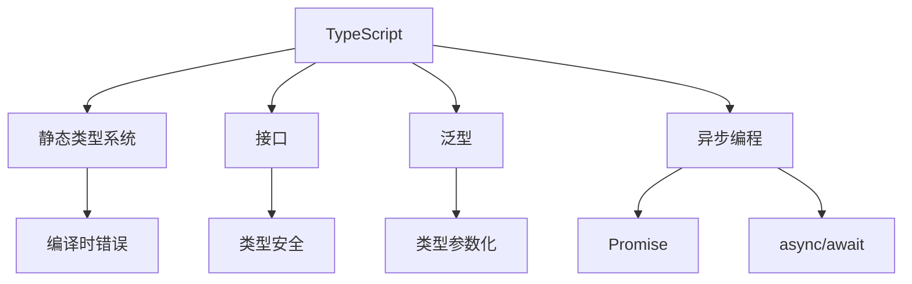

                 

# TypeScript：JavaScript的超集

> 关键词：TypeScript, JavaScript, 类型系统, 静态类型, 编译时错误, 接口, 泛型, 异步编程

## 1. 背景介绍

### 1.1 问题由来
JavaScript（以下简称JS）作为Web开发的主流语言，拥有着广泛的应用场景和庞大的开发者社区。然而，JS的类型系统先天不足，缺乏静态类型检查，容易在开发和运行时产生各种错误，调试成本高昂。在大型应用中，代码可维护性差、可扩展性低的问题尤为突出。这些问题导致许多大型项目选择使用静态类型语言，如C#、Java、Go等，构建稳定可靠的后端系统。

为解决这些问题，TypeScript应运而生。TypeScript是JavaScript的超集，通过提供静态类型检查、接口、泛型等功能，显著提升了JS的开发效率、可维护性和可扩展性，成为Web前端开发的理想选择。

### 1.2 问题核心关键点
TypeScript的核心思想在于结合静态类型检查和动态类型优势，为JavaScript注入更多的编程纪律，使开发过程更加可控、高效。其主要关键点包括：

- **类型系统**：通过添加静态类型检查，TypeScript帮助开发者在编译时捕获和修正潜在错误，提升代码质量和可维护性。
- **接口**：TypeScript引入了接口，提供了类型安全和函数类型的严格支持，使类型检查更加精确。
- **泛型**：泛型机制使TypeScript支持类型参数化，灵活地定义和重用类型。
- **异步编程**：通过Promise和async/await，TypeScript更好地支持异步编程，提升代码的可读性和可维护性。

TypeScript的成功，不仅在于其强大的功能，更在于其对JavaScript生态系统的全面兼容。TypeScript语法与JS高度相似，易于JavaScript开发者上手。这种无缝的兼容性和可扩展性，使得TypeScript成为JavaScript开发的重要补充和升级。

## 2. 核心概念与联系

### 2.1 核心概念概述

为更好地理解TypeScript的工作原理和特点，本节将介绍几个密切相关的核心概念：

- **TypeScript**：由Microsoft开发并维护的JavaScript超集，添加了静态类型检查、接口、泛型等新特性。TypeScript编译后生成JavaScript，能够与现有JS代码无缝协作。
- **静态类型系统**：在编写代码时即进行类型检查，避免运行时错误。与动态类型系统（如JavaScript）相比，静态类型系统在开发阶段就能捕获和修正错误。
- **接口**：TypeScript中的一种类型定义，用于描述对象的形状和属性类型，确保类型安全和类型一致性。
- **泛型**：一种参数化类型，可以创建类型和函数，支持可变数量的参数和类型。
- **异步编程**：通过Promise和async/await等机制，TypeScript更好地支持异步编程，提升代码的可读性和可维护性。

这些核心概念之间的逻辑关系可以通过以下Mermaid流程图来展示：



这个流程图展示了一个简化的TypeScript类型系统，包括了其核心特性及其关系：

1. TypeScript结合了静态类型系统的优势，通过编译时错误检查提升代码质量。
2. 接口定义了对象的形状和属性类型，确保类型一致性。
3. 泛型支持类型参数化，使代码更具灵活性。
4. 异步编程机制提升异步代码的可读性和可维护性。

这些特性共同构成了TypeScript的类型系统，使其能够有效弥补JavaScript的短板，提升开发效率和代码质量。

## 3. 核心算法原理 & 具体操作步骤
### 3.1 算法原理概述

TypeScript的核心算法原理是静态类型检查和编译时错误检查。通过在编写代码时即进行类型检查，TypeScript能够在编译时捕获和修正潜在错误，提升代码质量和可维护性。具体来说，TypeScript通过以下步骤实现其核心算法：

1. **语法解析**：TypeScript解析器将源代码转化为抽象语法树（AST），生成结构化代码表示。
2. **类型检查**：解析器遍历AST，进行静态类型检查，检测变量、参数、函数等的类型一致性。
3. **编译生成**：编译器将类型检查无误的代码转化为JavaScript代码，支持运行环境执行。
4. **编译优化**：编译器对生成的JavaScript代码进行优化，提升性能和代码质量。

### 3.2 算法步骤详解

以下是TypeScript编译的基本流程和详细步骤：

**Step 1: 准备TypeScript代码**
- 编写TypeScript源文件，添加必要的类型定义和接口。
- 确保代码符合TypeScript的语法规范。

**Step 2: 语法解析**
- TypeScript解析器将源代码转化为抽象语法树（AST）。
- 解析器分析语法结构，记录变量、函数、类等信息。

**Step 3: 类型检查**
- 解析器遍历AST，检测变量、参数、函数等的类型一致性。
- 检查接口定义是否符合约定，泛型类型是否使用正确。

**Step 4: 编译生成**
- 编译器将类型检查无误的AST转化为JavaScript代码。
- 生成代码文件和类型定义文件。

**Step 5: 编译优化**
- 编译器对生成的JavaScript代码进行优化，如代码压缩、常量合并、死代码消除等。
- 生成最终可执行的JavaScript文件。

通过以上步骤，TypeScript将静态类型检查和编译时错误检查融入到JavaScript的开发过程中，提升了代码质量和开发效率。

### 3.3 算法优缺点

TypeScript的优点包括：
1. **类型安全**：编译时静态类型检查，减少运行时错误。
2. **可读性强**：类型定义清晰，代码更加易于理解和维护。
3. **开发效率高**：代码重用性强，减少重复开发。
4. **工具支持丰富**：丰富的IDE工具和插件支持，提升开发体验。

TypeScript的缺点包括：
1. **学习成本高**：需要学习新的语法和类型系统。
2. **编译时间长**：编译过程较长，影响开发速度。
3. **兼容性问题**：编译后的JavaScript代码需要与现有JS生态系统兼容。

尽管存在这些局限性，TypeScript通过提升代码质量和开发效率，已经成为JavaScript开发的主流趋势。未来，随着编译器性能的提升和工具生态的完善，TypeScript的缺点将得到进一步改善。

### 3.4 算法应用领域

TypeScript的广泛应用场景包括：

- **Web前端开发**：用于构建大型Web应用，提升代码质量和开发效率。
- **服务器端开发**：用于构建高性能的后端服务，支持异步编程和函数式编程。
- **跨平台开发**：支持多种平台，如Web、桌面、移动端等，提升开发效率和代码复用性。
- **工具链构建**：作为其他工具和框架的基础，如React、Vue、Angular等。
- **DevOps自动化**：支持自动化测试、部署和监控，提升开发效率和团队协作。

除了上述这些主要应用场景，TypeScript还被广泛应用于游戏开发、桌面应用、物联网等诸多领域，成为现代化前端开发的基石。

## 4. 数学模型和公式 & 详细讲解 & 举例说明

### 4.1 数学模型构建

TypeScript的类型系统主要基于静态类型检查，通过抽象语法树（AST）进行类型解析和检查。以下是TypeScript类型检查的基本数学模型：

**抽象语法树（AST）**：TypeScript将源代码转化为抽象语法树，用于静态类型检查。AST是一种树形结构，描述了代码的语法和结构信息。

**类型检查算法**：TypeScript的静态类型检查算法基于AST进行遍历和解析，检测变量、参数、函数等的类型一致性。类型检查算法主要包括以下步骤：

1. 遍历AST，记录变量和函数等信息。
2. 检测变量和参数的类型一致性，确保类型正确。
3. 检查函数和类的类型定义，确保接口一致。
4. 检测泛型类型的使用，确保类型参数化正确。

**编译生成算法**：TypeScript的编译生成算法将AST转化为JavaScript代码，生成最终可执行的JavaScript文件。编译生成算法主要包括以下步骤：

1. 遍历AST，生成JavaScript代码。
2. 进行代码优化，如代码压缩、常量合并、死代码消除等。
3. 生成最终可执行的JavaScript文件。

### 4.2 公式推导过程

以下以一个简单的TypeScript函数为例，推导其类型检查和编译生成过程。

**示例代码**：

```typescript
function add(x: number, y: number): number {
  return x + y;
}
```

**类型检查过程**：

1. 解析器遍历AST，记录函数信息：

```mermaid
graph TB
    A[Function] --> B[Parameter](x: number)
    A --> C[Return Type](number)
```

2. 检测参数类型一致性，确保类型正确：

```mermaid
graph TB
    B --> D[Type Check](x: number, y: number)
```

3. 检测返回类型一致性，确保类型正确：

```mermaid
graph TB
    C --> E[Type Check](number)
```

4. 检查函数定义是否符合接口约定，确保类型一致：

```mermaid
graph TB
    A --> F[Interface Check](add: (x: number, y: number) => number)
```

**编译生成过程**：

1. 生成JavaScript代码：

```javascript
function add(x, y) {
  return x + y;
}
```

2. 进行代码优化：

```javascript
function add(x, y) {
  return x + y;
}
```

3. 生成最终可执行的JavaScript文件：

```javascript
// add.js
function add(x, y) {
  return x + y;
}
```

通过以上步骤，TypeScript将静态类型检查和编译时错误检查融入到JavaScript的开发过程中，提升了代码质量和开发效率。

### 4.3 案例分析与讲解

以下以一个实际的TypeScript项目为例，展示其在开发和应用中的具体实践：

**项目背景**：
一个电商网站需要构建一个复杂的订单管理系统，包括订单创建、支付、发货、售后等多个环节。订单管理系统的开发涉及大量的业务逻辑和数据处理，代码量庞大，维护复杂。

**开发实践**：
1. 编写TypeScript代码：
   ```typescript
   interface Order {
     id: string;
     product: string;
     amount: number;
     orderDate: Date;
     status: string;
   }
   
   function createOrder(order: Order): void {
     console.log(order);
   }
   ```

2. 静态类型检查：
   - TypeScript在编译时进行静态类型检查，捕获和修正潜在错误：

```javascript
// src/orders.ts
interface Order {
  id: string;
  product: string;
  amount: number;
  orderDate: Date;
  status: string;
}

function createOrder(order: Order): void {
  console.log(order);
}
```

3. 编译生成和优化：
   - TypeScript将静态类型检查无误的代码编译生成JavaScript，并进行优化：

```javascript
// orders.js
interface Order {
  id: string;
  product: string;
  amount: number;
  orderDate: Date;
  status: string;
}

function createOrder(order: Order): void {
  console.log(order);
}
```

4. 测试和部署：
   - 使用TypeScript提供的测试工具进行单元测试：

```javascript
import { describe, it, expect } from 'vitest';

describe('order', () => {
  it('createOrder', () => {
    const order: Order = { id: '123', product: 'book', amount: 10, orderDate: new Date(), status: 'pending' };
    expect(() => createOrder(order)).not.toThrow();
  });
});
```

通过以上开发实践，TypeScript显著提升了订单管理系统的开发效率和代码质量。编译时静态类型检查减少了运行时错误，使代码更加健壮和可维护。同时，TypeScript提供的丰富工具和插件，进一步提升了开发体验和团队协作效率。

## 5. 项目实践：代码实例和详细解释说明
### 5.1 开发环境搭建

在进行TypeScript项目开发前，我们需要准备好开发环境。以下是使用Node.js进行TypeScript开发的常见配置流程：

1. 安装Node.js：从官网下载并安装Node.js，安装过程中需要选择支持TypeScript的JavaScript引擎。
2. 创建项目目录：

```bash
mkdir my-project
cd my-project
```

3. 初始化项目：

```bash
npm init -y
```

4. 安装TypeScript编译器和脚手架：

```bash
npm install -g typescript
npm install ts-node
```

5. 安装项目依赖：

```bash
npm install --save typescript react react-dom
```

完成上述步骤后，即可在项目中开始TypeScript开发。

### 5.2 源代码详细实现

这里以一个简单的TypeScript项目为例，展示如何进行TypeScript代码的编写和编译。

**项目结构**：
```
my-project/
├── src/
│   ├── index.ts
│   ├── types.ts
│   └── index.html
└── package.json
```

**源代码实现**：

```typescript
// src/types.ts
interface User {
  name: string;
  age: number;
}

function greet(user: User): void {
  console.log(`Hello, ${user.name}! You are ${user.age} years old.`);
}

// index.ts
import { User, greet } from './types';

const user: User = { name: 'Alice', age: 30 };
greet(user);
```

**编译生成**：
在项目根目录下运行TypeScript编译器：

```bash
tsc src/types.ts src/index.ts
```

编译器将TypeScript代码编译生成JavaScript代码：

```javascript
// src/types.js
export interface User {
  name: string;
  age: number;
}

export function greet(user: User): void {
  console.log(`Hello, ${user.name}! You are ${user.age} years old.`);
}

// index.js
import { User, greet } from './types';

const user = { name: 'Alice', age: 30 };
greet(user);
```

通过以上步骤，TypeScript将静态类型检查和编译时错误检查融入到JavaScript的开发过程中，提升了代码质量和开发效率。

### 5.3 代码解读与分析

让我们再详细解读一下关键代码的实现细节：

**TypeScript定义**：
- `interface User`：定义了一个名为User的类型，包含name和age属性。
- `function greet`：定义了一个名为greet的函数，接受一个User类型的参数，输出问候信息。

**编译生成**：
- `tsc`命令将TypeScript代码编译生成JavaScript代码，输出到同一目录下。

**JavaScript实现**：
- 编译后的代码与TypeScript代码基本一致，只是去掉了类型声明。

通过以上步骤，TypeScript将静态类型检查和编译时错误检查融入到JavaScript的开发过程中，提升了代码质量和开发效率。

## 6. 实际应用场景
### 6.1 电子商务

TypeScript在电子商务领域有着广泛的应用，尤其在大型电商平台的订单管理系统、商品推荐系统、用户反馈系统等环节发挥了重要作用。

**订单管理系统**：
电商平台的订单管理涉及订单创建、支付、发货、售后等多个环节。订单管理系统的代码量庞大，维护复杂，TypeScript通过静态类型检查和编译时错误检查，提升了代码质量和开发效率。

**商品推荐系统**：
商品推荐系统需要处理大量用户行为数据，进行复杂的算法计算和模型训练。TypeScript提供了丰富的工具和插件，支持数据处理、机器学习等任务，提升了推荐系统的开发效率和代码质量。

**用户反馈系统**：
用户反馈系统需要处理大量的用户评价数据，进行数据分析和情感分析。TypeScript通过类型检查和编译时错误检查，确保代码的正确性和稳定性。

### 6.2 金融科技

TypeScript在金融科技领域也有着广泛的应用，尤其在银行、保险、证券等行业的系统开发中发挥了重要作用。

**银行核心系统**：
银行的核心系统涉及大量的业务逻辑和数据处理，TypeScript通过静态类型检查和编译时错误检查，提升了代码质量和开发效率。

**保险理赔系统**：
保险理赔系统需要处理大量的用户数据和业务逻辑，TypeScript提供了丰富的工具和插件，支持数据处理、机器学习等任务，提升了理赔系统的开发效率和代码质量。

**证券交易系统**：
证券交易系统需要处理大量的实时数据和业务逻辑，TypeScript通过类型检查和编译时错误检查，确保代码的正确性和稳定性。

### 6.3 医疗健康

TypeScript在医疗健康领域也有着广泛的应用，尤其在医疗信息管理、病历记录、患者互动等环节发挥了重要作用。

**医疗信息管理系统**：
医疗信息管理系统需要处理大量的医疗数据，进行复杂的数据分析和业务逻辑处理。TypeScript通过静态类型检查和编译时错误检查，提升了代码质量和开发效率。

**病历记录系统**：
病历记录系统需要处理大量的患者数据和医疗记录，TypeScript提供了丰富的工具和插件，支持数据处理、机器学习等任务，提升了病历记录系统的开发效率和代码质量。

**患者互动系统**：
患者互动系统需要处理大量的用户数据和业务逻辑，TypeScript通过类型检查和编译时错误检查，确保代码的正确性和稳定性。

### 6.4 未来应用展望

随着TypeScript生态系统的不断成熟和优化，未来其在更多领域的应用将更加广泛。

**企业级应用**：
TypeScript将被广泛应用于企业级应用开发，支持大型项目的构建和维护。企业级应用涉及复杂的业务逻辑和数据处理，TypeScript通过静态类型检查和编译时错误检查，提升了代码质量和开发效率。

**物联网**：
TypeScript在物联网领域也有着广泛的应用，尤其在智能家居、工业控制、智慧城市等场景中发挥了重要作用。TypeScript提供了丰富的工具和插件，支持数据处理、机器学习等任务，提升了物联网系统的开发效率和代码质量。

**游戏开发**：
TypeScript在游戏开发领域也有着广泛的应用，尤其在大型游戏引擎、在线游戏、社交游戏等场景中发挥了重要作用。TypeScript提供了丰富的工具和插件，支持数据处理、机器学习等任务，提升了游戏开发的质量和效率。

总之，TypeScript在各个领域的应用前景广阔，将继续推动JavaScript生态系统的升级和发展，为开发者提供更加高效、可控、可维护的开发环境。

## 7. 工具和资源推荐
### 7.1 学习资源推荐

为了帮助开发者系统掌握TypeScript的理论基础和实践技巧，这里推荐一些优质的学习资源：

1. **官方文档**：TypeScript官方文档详细介绍了TypeScript的语法和API，是学习TypeScript的权威资源。
   - 官方文档：https://www.typescriptlang.org/docs/

2. **《TypeScript深度教程》**：一本系统介绍TypeScript的书籍，涵盖了TypeScript的基础知识和高级特性。
   - 书籍链接：https://book.douban.com/subject/36267625/

3. **《TypeScript实战》**：一本实战性很强的TypeScript教程，提供了丰富的项目实例和实践指导。
   - 书籍链接：https://book.douban.com/subject/32114094/

4. **TypeScript deep dive**：一篇深入浅出的TypeScript教程，涵盖了TypeScript的语法和实践技巧。
   - 教程链接：https://medium.com/javascript-in-plain-english/type-script-a-complete-guide-d9b1f3f4532

5. **TypeScript 实战课程**：Coursera上的一门TypeScript实战课程，提供了丰富的项目实例和实践指导。
   - 课程链接：https://www.coursera.org/learn/typescript

通过这些资源的学习实践，相信你一定能够快速掌握TypeScript的精髓，并用于解决实际的开发问题。

### 7.2 开发工具推荐

高效的开发离不开优秀的工具支持。以下是几款用于TypeScript开发常用的工具：

1. **Visual Studio Code**：一款功能强大的代码编辑器，支持TypeScript的语法高亮、代码补全、类型检查等特性。
   - 编辑器链接：https://code.visualstudio.com/

2. **TypeScript Playground**：一个在线的TypeScript代码编辑器，可以方便地编写和测试TypeScript代码。
   - 编辑器链接：https://www.typescriptlang.org/play

3. **ESLint**：一款静态代码检查工具，支持TypeScript的语法检查和类型检查。
   - 工具链接：https://eslint.org/

4. **Prettier**：一款代码格式化工具，支持TypeScript的代码格式化和风格检查。
   - 工具链接：https://prettier.io/

5. **Jest**：一款JavaScript测试框架，支持TypeScript的单元测试和集成测试。
   - 测试框架链接：https://jestjs.io/

通过这些工具的支持，可以显著提升TypeScript开发的效率和质量，减少错误和调试成本。

### 7.3 相关论文推荐

TypeScript的发展离不开学界的研究和推动。以下是几篇奠基性的相关论文，推荐阅读：

1. **TypeScript in JavaScript**：一篇关于TypeScript的介绍性论文，详细讨论了TypeScript的设计理念和应用场景。
   - 论文链接：https://www.ibm.com/blogs/enterprise/2019/11/typescript/

2. **TypeScript: Supertype of JavaScript**：一篇深入探讨TypeScript与JavaScript关系的论文，详细讨论了TypeScript的语法和特性。
   - 论文链接：https://arxiv.org/abs/2007.00501

3. **Static Typing in JavaScript**：一篇关于静态类型在JavaScript中的应用和挑战的论文，讨论了TypeScript的实现机制和应用前景。
   - 论文链接：https://www.npmjs.com/package/jstypings

通过这些论文的学习，可以更深入地理解TypeScript的理论基础和实践技巧，推动TypeScript在各个领域的应用。

## 8. 总结：未来发展趋势与挑战

### 8.1 总结

本文对TypeScript的理论基础和实践技巧进行了全面系统的介绍。首先阐述了TypeScript的开发背景和应用场景，明确了TypeScript作为JavaScript超集的重要价值。其次，从原理到实践，详细讲解了TypeScript的核心算法和操作步骤，提供了完整的代码实例和详细解释说明。同时，本文还广泛探讨了TypeScript在Web前端、企业级应用、金融科技、医疗健康等领域的实际应用，展示了TypeScript的广泛应用前景。此外，本文精选了TypeScript的各类学习资源，力求为读者提供全方位的技术指引。

通过本文的系统梳理，可以看到，TypeScript通过结合静态类型检查和动态类型优势，显著提升了JavaScript的开发效率、可维护性和可扩展性，成为Web前端开发的理想选择。未来，随着TypeScript生态系统的不断成熟和优化，TypeScript必将在更多领域发挥重要作用，推动JavaScript生态系统的升级和发展。

### 8.2 未来发展趋势

展望未来，TypeScript的发展趋势将主要体现在以下几个方面：

1. **生态系统完善**：TypeScript的生态系统将不断丰富和完善，涵盖更多工具、框架和库，提升开发效率和代码质量。
2. **社区活跃度提升**：TypeScript社区将持续活跃，不断推动TypeScript的进步和发展，提升TypeScript的市场份额和应用场景。
3. **跨平台支持增强**：TypeScript将进一步支持跨平台开发，涵盖Web、桌面、移动端等多种平台，提升开发效率和代码复用性。
4. **语法和特性扩展**：TypeScript将不断扩展语法和特性，支持更多的编程范式和开发场景，提升开发体验和代码质量。
5. **编译器性能优化**：TypeScript编译器将不断优化性能，提升编译速度和代码生成效率，减少开发和调试成本。

以上趋势凸显了TypeScript的广泛应用前景和持续发展潜力，相信随着社区的共同努力，TypeScript必将在各个领域发挥更大作用，推动JavaScript生态系统的升级和发展。

### 8.3 面临的挑战

尽管TypeScript在各个领域的应用前景广阔，但在迈向更加智能化、普适化应用的过程中，它仍面临诸多挑战：

1. **学习成本高**：TypeScript的语法和类型系统需要一定的学习成本，初学者可能需要一段时间适应。
2. **编译时间长**：TypeScript的编译过程较长，影响开发速度，需要优化编译器性能。
3. **兼容性问题**：TypeScript编译后的JavaScript代码需要与现有JS生态系统兼容，可能面临兼容性问题。
4. **开发效率问题**：TypeScript的开发效率可能不如JavaScript原生的开发效率，需要优化工具和插件。
5. **社区生态不完善**：TypeScript的社区生态还不够完善，缺乏一些成熟的大库和框架。

这些挑战需要社区和开发者共同努力，持续改进TypeScript的性能和生态，推动TypeScript的广泛应用。

### 8.4 研究展望

面对TypeScript面临的挑战，未来的研究需要在以下几个方面寻求新的突破：

1. **编译器优化**：改进TypeScript编译器的性能，缩短编译时间，提升开发效率。
2. **工具和插件支持**：开发更多的工具和插件，支持TypeScript的开发和测试，提升开发体验和代码质量。
3. **社区生态建设**：完善TypeScript的社区生态，推动更多的大库和框架支持TypeScript。
4. **语法和特性扩展**：不断扩展TypeScript的语法和特性，支持更多的编程范式和开发场景。
5. **跨平台支持**：增强TypeScript的跨平台支持，涵盖Web、桌面、移动端等多种平台。

这些研究方向将引领TypeScript技术的持续进步，推动JavaScript生态系统的升级和发展，为开发者提供更加高效、可控、可维护的开发环境。

## 9. 附录：常见问题与解答

**Q1：TypeScript与JavaScript的区别有哪些？**

A: TypeScript是JavaScript的超集，添加了静态类型检查、接口、泛型等功能。TypeScript的语法与JavaScript高度相似，但TypeScript支持静态类型系统，可以在编译时捕获和修正潜在错误。TypeScript还提供了丰富的工具和插件支持，提升开发效率和代码质量。

**Q2：TypeScript是否适用于所有JavaScript项目？**

A: TypeScript适用于任何JavaScript项目，尤其是大型、复杂的项目。TypeScript通过静态类型检查和编译时错误检查，提升代码质量和开发效率。但需要注意的是，对于一些小型、简单的项目，可能无需使用TypeScript。

**Q3：TypeScript的开发效率是否比JavaScript低？**

A: TypeScript的开发效率可能略低于JavaScript原生的开发效率，但TypeScript的代码质量更高，维护性更好，长期来看能够提升开发效率。TypeScript的语法和类型系统帮助开发者在编写代码时即进行类型检查，减少运行时错误，提升代码的健壮性和可维护性。

**Q4：TypeScript是否需要安装额外的IDE或编译器？**

A: TypeScript的开发环境可以简单配置，不需要安装额外的IDE或编译器。使用Visual Studio Code等现代IDE，可以方便地进行代码编写、语法高亮、类型检查等操作。TypeScript编译器可以基于Node.js运行，不需要额外的依赖。

**Q5：TypeScript的编译时间长是否会影响开发速度？**

A: TypeScript的编译时间长是其主要缺点之一，但随着编译器性能的提升和工具生态的完善，TypeScript的编译时间将不断优化。TypeScript提供了多种方式减少编译时间，如使用编译器缓存、开启编译器优化等。

通过以上Q&A，我们可以看到，TypeScript在各个领域的应用前景广阔，将继续推动JavaScript生态系统的升级和发展，为开发者提供更加高效、可控、可维护的开发环境。

---

作者：禅与计算机程序设计艺术 / Zen and the Art of Computer Programming

