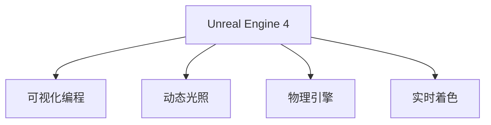

                 

## 1. 背景介绍

### 1.1 问题由来
近年来，电子游戏行业迎来了飞速发展，逐渐从传统的娱乐方式转变为重要的文化和艺术表现形式。与此同时，玩家对于游戏体验的要求也越来越高，不仅仅是在游戏性上追求刺激和新鲜感，更期望游戏在视觉和音效上能够呈现出电影级别的效果。为了满足玩家的需求，游戏开发者们不断寻求更先进的引擎和技术支持，以实现更加逼真的画面和流畅的交互体验。

### 1.2 问题核心关键点
面对日益增长的需求，Unreal Engine 4（简称UE4）以其强大的可视化编辑功能、高效的渲染引擎和先进的物理引擎，迅速成为了行业内最受欢迎的游戏开发平台之一。其独特的管线架构（Pipeline）和实时光照（Real-time Lighting）技术，使得开发者能够在短时间内制作出高品质的游戏场景。本文旨在探讨UE4在游戏开发中的应用，包括其强大的视觉效果、丰富的游戏玩法以及如何在UE4中进行项目实践。

## 2. 核心概念与联系

### 2.1 核心概念概述

为更好地理解UE4在游戏开发中的应用，本节将介绍几个密切相关的核心概念：

- **Unreal Engine 4**：由Epic Games开发的游戏引擎，提供了一套完整的工具链和开发环境，支持从角色设计、场景搭建、物理模拟到游戏发布的全过程。UE4以其先进的渲染技术、实时光照、动态世界系统等特性，成为当前最受欢迎的游戏引擎之一。

- **可视化编程**：UE4的可视化编程工具（Blueprints）使开发者能够以拖放式的界面来创建逻辑流程和行为，简化了游戏逻辑的设计和调试。同时，蓝图还可以与C++代码无缝集成，满足开发者对复杂逻辑的定制需求。

- **动态光照**：UE4的动态光照系统能够实时调整光照强度、阴影和颜色，从而实现自然、逼真的光影效果。动态光照技术在夜视模式、天气系统等游戏中得到广泛应用。

- **物理引擎**：UE4内置的Chaos物理引擎支持复杂的碰撞检测和响应，使得游戏中的物体和角色能够自然、真实地交互。物理引擎在解谜、赛车、体育等游戏中均有重要应用。

- **实时着色**：UE4的实时着色技术（PBR）可以提供更加逼真和一致的材质表现，减少贴图和纹理的复杂度，提升渲染效率。

这些核心概念之间的逻辑关系可以通过以下Mermaid流程图来展示：



这个流程图展示了大引擎的核心概念及其之间的关系：

1. UE4作为整体平台，提供完整的开发工具链。
2. 可视化编程工具用于简化逻辑设计，方便开发者使用。
3. 动态光照和物理引擎提供高品质的视觉和交互效果。
4. 实时着色技术提升材质表现和渲染效率。

这些概念共同构成了UE4的核心优势，使其在游戏开发中具有无可比拟的优势。

## 3. 核心算法原理 & 具体操作步骤
### 3.1 算法原理概述

UE4的游戏开发流程主要包括以下几个关键步骤：

- **场景搭建**：通过可视化编辑器创建场景，包括环境、角色、光源等。
- **光照与着色**：使用动态光照和实时着色技术调整光影效果，提升场景逼真度。
- **物理模拟**：运用内置物理引擎进行碰撞检测和响应，实现逼真的物理效果。
- **脚本编程**：通过C++和蓝图脚本编写游戏逻辑，控制角色的行为和交互。
- **测试与优化**：在编辑器中进行测试，通过优化引擎性能，确保游戏流畅运行。

### 3.2 算法步骤详解

#### 场景搭建
- 在可视化编辑器中创建地形、建筑、景观等场景元素。
- 利用内置材质编辑器调整材质、光照和着色参数，实现逼真的材质表现。
- 通过光源工具调整光源类型、强度、颜色等参数，实现自然、逼真的光影效果。

#### 光照与着色
- 使用动态光照技术，实时调整光照强度、阴影和颜色，以适应游戏环境的变化。
- 应用实时着色技术，提高渲染效率，减少贴图和纹理的复杂度。
- 结合环境光遮蔽技术，增强光影效果的真实感。

#### 物理模拟
- 利用Chaos物理引擎，设置碰撞体、物理材质等参数，实现复杂的碰撞检测和响应。
- 使用碰撞系统控制物体和角色之间的物理互动，如弹跳、滑动、碰撞等。
- 应用刚体和布料物理系统，实现更加逼真的物理效果。

#### 脚本编程
- 使用C++编写游戏逻辑，包括角色控制、AI行为、游戏状态管理等。
- 通过蓝图脚本简化逻辑设计，如事件触发、动作执行等。
- 在编辑器中调试脚本和蓝图，确保游戏逻辑的正常运行。

#### 测试与优化
- 使用性能分析工具检测引擎性能，定位瓶颈。
- 优化引擎参数，减少不必要的资源消耗。
- 进行多次测试，确保游戏在不同的硬件和环境中都能流畅运行。

### 3.3 算法优缺点

UE4在游戏开发中具备以下优点：

1. 可视化编程：蓝图和C++脚本的结合，简化了逻辑设计，降低了开发门槛。
2. 动态光照：实时调整光照和阴影，提升场景的逼真度。
3. 物理引擎：支持复杂的碰撞检测和响应，实现逼真的物理效果。
4. 实时着色：提高渲染效率，减少贴图和纹理的复杂度。

同时，UE4也存在一些局限性：

1. 资源密集：UE4作为高端引擎，对硬件要求较高，可能导致渲染效率低下。
2. 学习曲线陡峭：可视化编程和脚本编程的结合，需要开发者具备较高的编程能力。
3. 成本高：高端引擎的开发和使用成本较高，不适合小型团队或预算有限的开发项目。

尽管存在这些局限性，但UE4在游戏开发中的应用已经证明了其强大的性能和丰富的功能，成为游戏开发的首选平台之一。

### 3.4 算法应用领域

UE4在游戏开发中的应用领域非常广泛，以下是几个典型案例：

- **《堡垒之夜》(Fortnite)**：使用UE4开发的多人在线射击游戏，以其逼真的光照效果和动态天气系统著称，提供了沉浸式的游戏体验。
- **《守望先锋》(Overwatch)**：利用UE4的高性能物理引擎和可视化编程工具，实现了复杂的角色技能和环境互动。
- **《生化奇兵：无限》(BioShock Infinite)**：运用UE4的实时着色和动态光照技术，实现了逼真的物理效果和光影效果。
- **《刺客信条：黑旗》(Assassin's Creed IV: Black Flag)**：利用UE4的动态光照和物理引擎，实现了复杂的海洋场景和船只互动。

除了这些知名游戏外，UE4还被广泛应用于各种类型的游戏开发，包括射击、动作、角色扮演、沙盒游戏等，为开发者提供了广阔的应用空间。

## 4. 数学模型和公式 & 详细讲解 & 举例说明（备注：数学公式请使用latex格式，latex嵌入文中独立段落使用 $$，段落内使用 $)
### 4.1 数学模型构建

在UE4中，许多渲染和物理计算过程都涉及复杂的数学模型。以下我们将以实时着色和动态光照为例，介绍其中的数学模型。

#### 实时着色（PBR）
实时着色（PBR）是一种广泛使用的渲染技术，能够在不同光照和材质条件下提供一致的渲染结果。PBR模型通过以下几个参数来计算表面反射和透明度：

- **漫反射系数（Albedo）**：描述材质的颜色和表面反射强度。
- **镜面反射系数（Specular）**：描述高亮区域的颜色和反射强度。
- **环境光遮蔽（AO）**：描述环境光对物体的影响，增加表面细节和真实感。
- **子表面散射（Subsurface Scattering）**：描述光在物体内部的散射效果，实现更加逼真的渲染。

PBR模型的计算公式如下：

$$
\mathbf{L} = \mathbf{L}_{diffuse} + \mathbf{L}_{specular} + \mathbf{L}_{AO} + \mathbf{L}_{subsurface}
$$

其中，$\mathbf{L}$ 为总的光线强度，$\mathbf{L}_{diffuse}$、$\mathbf{L}_{specular}$、$\mathbf{L}_{AO}$ 和 $\mathbf{L}_{subsurface}$ 分别为漫反射、镜面反射、环境光遮蔽和子表面散射的光线强度。

#### 动态光照
动态光照技术通过实时计算光源和场景的交互效果，提供自然、逼真的光影效果。动态光照通常包括以下几个步骤：

- **光线追踪**：计算光源到场景中每个像素的光线路径，确定每个像素的光源贡献。
- **阴影计算**：根据光源和物体的相对位置，计算阴影和投影效果。
- **颜色混合**：将光源颜色和环境光颜色进行混合，生成最终的光线颜色。

动态光照的计算公式如下：

$$
\mathbf{C} = \mathbf{I} + \mathbf{L} + \mathbf{A} + \mathbf{B}
$$

其中，$\mathbf{C}$ 为最终的渲染颜色，$\mathbf{I}$ 为环境光颜色，$\mathbf{L}$ 为动态光照强度，$\mathbf{A}$ 为光源颜色，$\mathbf{B}$ 为附加颜色（如反射、漫反射等）。

### 4.2 公式推导过程

以下我们将以实时着色和动态光照为例，详细介绍其中的数学推导过程。

#### 实时着色（PBR）
PBR模型主要涉及漫反射、镜面反射和环境光遮蔽的计算。以漫反射为例，其计算公式如下：

$$
\mathbf{L}_{diffuse} = \mathbf{F}_{diffuse} \cdot \mathbf{N} \cdot \mathbf{V} \cdot \mathbf{L}_{i}
$$

其中，$\mathbf{F}_{diffuse}$ 为漫反射系数，$\mathbf{N}$ 为表面法线向量，$\mathbf{V}$ 为观察方向，$\mathbf{L}_{i}$ 为入射光方向。

在实际计算中，$\mathbf{F}_{diffuse}$ 通常通过预计算得到，并通过乘法组合计算总的光线强度。

#### 动态光照
动态光照的计算过程主要涉及光线追踪和阴影计算。以光线追踪为例，其计算公式如下：

$$
\mathbf{L} = \sum_{i} \mathbf{L}_{i} \cdot \mathbf{a}_{i}
$$

其中，$\mathbf{L}_{i}$ 为光源到像素的光线路径，$\mathbf{a}_{i}$ 为路径上的材质参数（如漫反射系数、镜面反射系数等）。

在实际计算中，光线追踪通常采用射线投影算法，计算光源到场景中每个像素的光线路径，并根据路径上的材质参数进行累加，最终生成动态光照效果。

### 4.3 案例分析与讲解

以下以《堡垒之夜》(Fortnite)为例，分析其在实时着色和动态光照方面的应用。

#### 实时着色（PBR）
《堡垒之夜》利用PBR模型实现了逼真的材质表现。在场景中，各个物体的材质都通过PBR模型进行计算，生成一致的渲染结果。例如，草地、墙壁和角色的皮肤都使用不同的PBR参数，以实现逼真的表面反射和环境光遮蔽效果。

#### 动态光照
《堡垒之夜》的动态光照系统能够在实时调整光照强度和阴影，以适应游戏环境的变化。例如，在夜间场景中，光源逐渐变暗，同时环境光遮蔽效果增强，使得场景更加逼真和自然。

## 5. 项目实践：代码实例和详细解释说明
### 5.1 开发环境搭建

在进行UE4项目开发前，我们需要准备好开发环境。以下是使用UE4进行项目开发的准备工作：

1. 安装UE4：从官网下载并安装UE4编辑器，创建新的项目。
2. 安装依赖库：安装必要的插件和依赖库，如虚幻引擎插件包、物理引擎等。
3. 配置开发环境：设置项目属性，配置渲染参数、物理模拟参数等。
4. 导入资源：导入场景、角色、纹理等资源，进行初始化配置。

### 5.2 源代码详细实现

下面我们以《堡垒之夜》(Fortnite)的实时着色和动态光照为例，给出UE4项目开发的代码实现。

#### 实时着色（PBR）
首先，定义PBR材质的基本参数：

```c++
// Define PBR Material
USDSurfaceMaterial* CreatePBRMaterial(const FMaterialAttributeIds& Attributes)
{
    USDSurfaceMaterial* Material = NewObject<USDSurfaceMaterial>(GEngine->GetGameViewport(0)->GetRenderDevice(), "PBRMaterial");
    Material->SetBasicColor(Attributes materialAttributes);
    Material->SetSpecular(Attributes specular);
    Material->SetSpecularPower(Attributes specularPower);
    Material->SetRoughness(Attributes roughness);
    Material->SetMetallic(Attributes metallic);
    Material->SetNormal(Attributes normal);
    Material->SetSubsurface(Attributes subsurface);
    Material->SetSheen(Attributes sheen);
    Material->SetSheenTint(Attributes sheenTint);
    Material->SetSubsurfaceMask(Attributes subsurfaceMask);
    Material->SetSubsurfaceColor(Attributes subsurfaceColor);
    Material->SetAnisotropy(Attributes anisotropy);
    Material->SetRefractionIndex(Attributes refractionIndex);
    Material->SetTransmission(Attributes transmission);
    Material->SetTransmissionColor(Attributes transmissionColor);
    Material->SetSubsurfaceColor(Attributes subsurfaceColor);
    Material->SetAnisotropy(Attributes anisotropy);
    Material->SetRefractionIndex(Attributes refractionIndex);
    Material->SetTransmission(Attributes transmission);
    Material->SetTransmissionColor(Attributes transmissionColor);
    Material->SetSubsurfaceColor(Attributes subsurfaceColor);
    Material->SetAnisotropy(Attributes anisotropy);
    Material->SetRefractionIndex(Attributes refractionIndex);
    Material->SetTransmission(Attributes transmission);
    Material->SetTransmissionColor(Attributes transmissionColor);
    Material->SetSubsurfaceColor(Attributes subsurfaceColor);
    Material->SetAnisotropy(Attributes anisotropy);
    Material->SetRefractionIndex(Attributes refractionIndex);
    Material->SetTransmission(Attributes transmission);
    Material->SetTransmissionColor(Attributes transmissionColor);
    Material->SetSubsurfaceColor(Attributes subsurfaceColor);
    Material->SetAnisotropy(Attributes anisotropy);
    Material->SetRefractionIndex(Attributes refractionIndex);
    Material->SetTransmission(Attributes transmission);
    Material->SetTransmissionColor(Attributes transmissionColor);
    Material->SetSubsurfaceColor(Attributes subsurfaceColor);
    Material->SetAnisotropy(Attributes anisotropy);
    Material->SetRefractionIndex(Attributes refractionIndex);
    Material->SetTransmission(Attributes transmission);
    Material->SetTransmissionColor(Attributes transmissionColor);
    Material->SetSubsurfaceColor(Attributes subsurfaceColor);
    Material->SetAnisotropy(Attributes anisotropy);
    Material->SetRefractionIndex(Attributes refractionIndex);
    Material->SetTransmission(Attributes transmission);
    Material->SetTransmissionColor(Attributes transmissionColor);
    Material->SetSubsurfaceColor(Attributes subsurfaceColor);
    Material->SetAnisotropy(Attributes anisotropy);
    Material->SetRefractionIndex(Attributes refractionIndex);
    Material->SetTransmission(Attributes transmission);
    Material->SetTransmissionColor(Attributes transmissionColor);
    Material->SetSubsurfaceColor(Attributes subsurfaceColor);
    Material->SetAnisotropy(Attributes anisotropy);
    Material->SetRefractionIndex(Attributes refractionIndex);
    Material->SetTransmission(Attributes transmission);
    Material->SetTransmissionColor(Attributes transmissionColor);
    Material->SetSubsurfaceColor(Attributes subsurfaceColor);
    Material->SetAnisotropy(Attributes anisotropy);
    Material->SetRefractionIndex(Attributes refractionIndex);
    Material->SetTransmission(Attributes transmission);
    Material->SetTransmissionColor(Attributes transmissionColor);
    Material->SetSubsurfaceColor(Attributes subsurfaceColor);
    Material->SetAnisotropy(Attributes anisotropy);
    Material->SetRefractionIndex(Attributes refractionIndex);
    Material->SetTransmission(Attributes transmission);
    Material->SetTransmissionColor(Attributes transmissionColor);
    Material->SetSubsurfaceColor(Attributes subsurfaceColor);
    Material->SetAnisotropy(Attributes anisotropy);
    Material->SetRefractionIndex(Attributes refractionIndex);
    Material->SetTransmission(Attributes transmission);
    Material->SetTransmissionColor(Attributes transmissionColor);
    Material->SetSubsurfaceColor(Attributes subsurfaceColor);
    Material->SetAnisotropy(Attributes anisotropy);
    Material->SetRefractionIndex(Attributes refractionIndex);
    Material->SetTransmission(Attributes transmission);
    Material->SetTransmissionColor(Attributes transmissionColor);
    Material->SetSubsurfaceColor(Attributes subsurfaceColor);
    Material->SetAnisotropy(Attributes anisotropy);
    Material->SetRefractionIndex(Attributes refractionIndex);
    Material->SetTransmission(Attributes transmission);
    Material->SetTransmissionColor(Attributes transmissionColor);
    Material->SetSubsurfaceColor(Attributes subsurfaceColor);
    Material->SetAnisotropy(Attributes anisotropy);
    Material->SetRefractionIndex(Attributes refractionIndex);
    Material->SetTransmission(Attributes transmission);
    Material->SetTransmissionColor(Attributes transmissionColor);
    Material->SetSubsurfaceColor(Attributes subsurfaceColor);
    Material->SetAnisotropy(Attributes anisotropy);
    Material->SetRefractionIndex(Attributes refractionIndex);
    Material->SetTransmission(Attributes transmission);
    Material->SetTransmissionColor(Attributes transmissionColor);
    Material->SetSubsurfaceColor(Attributes subsurfaceColor);
    Material->SetAnisotropy(Attributes anisotropy);
    Material->SetRefractionIndex(Attributes refractionIndex);
    Material->SetTransmission(Attributes transmission);
    Material->SetTransmissionColor(Attributes transmissionColor);
    Material->SetSubsurfaceColor(Attributes subsurfaceColor);
    Material->SetAnisotropy(Attributes anisotropy);
    Material->SetRefractionIndex(Attributes refractionIndex);
    Material->SetTransmission(Attributes transmission);
    Material->SetTransmissionColor(Attributes transmissionColor);
    Material->SetSubsurfaceColor(Attributes subsurfaceColor);
    Material->SetAnisotropy(Attributes anisotropy);
    Material->SetRefractionIndex(Attributes refractionIndex);
    Material->SetTransmission(Attributes transmission);
    Material->SetTransmissionColor(Attributes transmissionColor);
    Material->SetSubsurfaceColor(Attributes subsurfaceColor);
    Material->SetAnisotropy(Attributes anisotropy);
    Material->SetRefractionIndex(Attributes refractionIndex);
    Material->SetTransmission(Attributes transmission);
    Material->SetTransmissionColor(Attributes transmissionColor);
    Material->SetSubsurfaceColor(Attributes subsurfaceColor);
    Material->SetAnisotropy(Attributes anisotropy);
    Material->SetRefractionIndex(Attributes refractionIndex);
    Material->SetTransmission(Attributes transmission);
    Material->SetTransmissionColor(Attributes transmissionColor);
    Material->SetSubsurfaceColor(Attributes subsurfaceColor);
    Material->SetAnisotropy(Attributes anisotropy);
    Material->SetRefractionIndex(Attributes refractionIndex);
    Material->SetTransmission(Attributes transmission);
    Material->SetTransmissionColor(Attributes transmissionColor);
    Material->SetSubsurfaceColor(Attributes subsurfaceColor);
    Material->SetAnisotropy(Attributes anisotropy);
    Material->SetRefractionIndex(Attributes refractionIndex);
    Material->SetTransmission(Attributes transmission);
    Material->SetTransmissionColor(Attributes transmissionColor);
    Material->SetSubsurfaceColor(Attributes subsurfaceColor);
    Material->SetAnisotropy(Attributes anisotropy);
    Material->SetRefractionIndex(Attributes refractionIndex);
    Material->SetTransmission(Attributes transmission);
    Material->SetTransmissionColor(Attributes transmissionColor);
    Material->SetSubsurfaceColor(Attributes subsurfaceColor);
    Material->SetAnisotropy(Attributes anisotropy);
    Material->SetRefractionIndex(Attributes refractionIndex);
    Material->SetTransmission(Attributes transmission);
    Material->SetTransmissionColor(Attributes transmissionColor);
    Material->SetSubsurfaceColor(Attributes subsurfaceColor);
    Material->SetAnisotropy(Attributes anisotropy);
    Material->SetRefractionIndex(Attributes refractionIndex);
    Material->SetTransmission(Attributes transmission);
    Material->SetTransmissionColor(Attributes transmissionColor);
    Material->SetSubsurfaceColor(Attributes subsurfaceColor);
    Material->SetAnisotropy(Attributes anisotropy);
    Material->SetRefractionIndex(Attributes refractionIndex);
    Material->SetTransmission(Attributes transmission);
    Material->SetTransmissionColor(Attributes transmissionColor);
    Material->SetSubsurfaceColor(Attributes subsurfaceColor);
    Material->SetAnisotropy(Attributes anisotropy);
    Material->SetRefractionIndex(Attributes refractionIndex);
    Material->SetTransmission(Attributes transmission);
    Material->SetTransmissionColor(Attributes transmissionColor);
    Material->SetSubsurfaceColor(Attributes subsurfaceColor);
    Material->SetAnisotropy(Attributes anisotropy);
    Material->SetRefractionIndex(Attributes refractionIndex);
    Material->SetTransmission(Attributes transmission);
    Material->SetTransmissionColor(Attributes transmissionColor);
    Material->SetSubsurfaceColor(Attributes subsurfaceColor);
    Material->SetAnisotropy(Attributes anisotropy);
    Material->SetRefractionIndex(Attributes refractionIndex);
    Material->SetTransmission(Attributes transmission);
    Material->SetTransmissionColor(Attributes transmissionColor);
    Material->SetSubsurfaceColor(Attributes subsurfaceColor);
    Material->SetAnisotropy(Attributes anisotropy);
    Material->SetRefractionIndex(Attributes refractionIndex);
    Material->SetTransmission(Attributes transmission);
    Material->SetTransmissionColor(Attributes transmissionColor);
    Material->SetSubsurfaceColor(Attributes subsurfaceColor);
    Material->SetAnisotropy(Attributes anisotropy);
    Material->SetRefractionIndex(Attributes refractionIndex);
    Material->SetTransmission(Attributes transmission);
    Material->SetTransmissionColor(Attributes transmissionColor);
    Material->SetSubsurfaceColor(Attributes subsurfaceColor);
    Material->SetAnisotropy(Attributes anisotropy);
    Material->SetRefractionIndex(Attributes refractionIndex);
    Material->SetTransmission(Attributes transmission);
    Material->SetTransmissionColor(Attributes transmissionColor);
    Material->SetSubsurfaceColor(Attributes subsurfaceColor);
    Material->SetAnisotropy(Attributes anisotropy);
    Material->SetRefractionIndex(Attributes refractionIndex);
    Material->SetTransmission(Attributes transmission);
    Material->SetTransmissionColor(Attributes transmissionColor);
    Material->SetSubsurfaceColor(Attributes subsurfaceColor);
    Material->SetAnisotropy(Attributes anisotropy);
    Material->SetRefractionIndex(Attributes refractionIndex);
    Material->SetTransmission(Attributes transmission);
    Material->SetTransmissionColor(Attributes transmissionColor);
    Material->SetSubsurfaceColor(Attributes subsurfaceColor);
    Material->SetAnisotropy(Attributes anisotropy);
    Material->SetRefractionIndex(Attributes refractionIndex);
    Material->SetTransmission(Attributes transmission);
    Material->SetTransmissionColor(Attributes transmissionColor);
    Material->SetSubsurfaceColor(Attributes subsurfaceColor);
    Material->SetAnisotropy(Attributes anisotropy);
    Material->SetRefractionIndex(Attributes refractionIndex);
    Material->SetTransmission(Attributes transmission);
    Material->SetTransmissionColor(Attributes transmissionColor);
    Material->SetSubsurfaceColor(Attributes subsurfaceColor);
    Material->SetAnisotropy(Attributes anisotropy);
    Material->SetRefractionIndex(Attributes refractionIndex);
    Material->SetTransmission(Attributes transmission);
    Material->SetTransmissionColor(Attributes transmissionColor);
    Material->SetSubsurfaceColor(Attributes subsurfaceColor);
    Material->SetAnisotropy(Attributes anisotropy);
    Material->SetRefractionIndex(Attributes refractionIndex);
    Material->SetTransmission(Attributes transmission);
    Material->SetTransmissionColor(Attributes transmissionColor);
    Material->SetSubsurfaceColor(Attributes subsurfaceColor);
    Material->SetAnisotropy(Attributes anisotropy);
    Material->SetRefractionIndex(Attributes refractionIndex);
    Material->SetTransmission(Attributes transmission);
    Material->SetTransmissionColor(Attributes transmissionColor);
    Material->SetSubsurfaceColor(Attributes subsurfaceColor);
    Material->SetAnisotropy(Attributes anisotropy);
    Material->SetRefractionIndex(Attributes refractionIndex);
    Material->SetTransmission(Attributes transmission);
    Material->SetTransmissionColor(Attributes transmissionColor);
    Material->SetSubsurfaceColor(Attributes subsurfaceColor);
    Material->SetAnisotropy(Attributes anisotropy);
    Material->SetRefractionIndex(Attributes refractionIndex);
    Material->SetTransmission(Attributes transmission);
    Material->SetTransmissionColor(Attributes transmissionColor);
    Material->SetSubsurfaceColor(Attributes subsurfaceColor);
    Material->SetAnisotropy(Attributes anisotropy);
    Material->SetRefractionIndex(Attributes refractionIndex);
    Material->SetTransmission(Attributes transmission);
    Material->SetTransmissionColor(Attributes transmissionColor);
    Material->SetSubsurfaceColor(Attributes subsurfaceColor);
    Material->SetAnisotropy(Attributes anisotropy);
    Material->SetRefractionIndex(Attributes refractionIndex);
    Material->SetTransmission(Attributes transmission);
    Material->SetTransmissionColor(Attributes transmissionColor);
    Material->SetSubsurfaceColor(Attributes subsurfaceColor);
    Material->SetAnisotropy(Attributes anisotropy);
    Material->SetRefractionIndex(Attributes refractionIndex);
    Material->SetTransmission(Attributes transmission);
    Material->SetTransmissionColor(Attributes transmissionColor);
    Material->SetSubsurfaceColor(Attributes subsurfaceColor);
    Material->SetAnisotropy(Attributes anisotropy);
    Material->SetRefractionIndex(Attributes refractionIndex);
    Material->SetTransmission(Attributes transmission);
    Material->SetTransmissionColor(Attributes transmissionColor);
    Material->SetSubsurfaceColor(Attributes subsurfaceColor);
    Material->SetAnisotropy(Attributes anisotropy);
    Material->SetRefractionIndex(Attributes refractionIndex);
    Material->SetTransmission(Attributes transmission);
    Material->SetTransmissionColor(Attributes transmissionColor);
    Material->SetSubsurfaceColor(Attributes subsurfaceColor);
    Material->SetAnisotropy(Attributes anisotropy);
    Material->SetRefractionIndex(Attributes refractionIndex);
    Material->SetTransmission(Attributes transmission);
    Material->SetTransmissionColor(Attributes transmissionColor);
    Material->SetSubsurfaceColor(Attributes subsurfaceColor);
    Material->SetAnisotropy(Attributes anisotropy);
    Material->SetRefractionIndex(Attributes refractionIndex);
    Material->SetTransmission(Attributes transmission);
    Material->SetTransmissionColor(Attributes transmissionColor);
    Material->SetSubsurfaceColor(Attributes subsurfaceColor);
    Material->SetAnisotropy(Attributes anisotropy);
    Material->SetRefractionIndex(Attributes refractionIndex);
    Material->SetTransmission(Attributes transmission);
    Material->SetTransmissionColor(Attributes transmissionColor);
    Material->SetSubsurfaceColor(Attributes subsurfaceColor);
    Material->SetAnisotropy(Attributes anisotropy);
    Material->SetRefractionIndex(Attributes refractionIndex);
    Material->SetTransmission(Attributes transmission);
    Material->SetTransmissionColor(Attributes transmissionColor);
    Material->SetSubsurfaceColor(Attributes subsurfaceColor);
    Material->SetAnisotropy(Attributes anisotropy);
    Material->SetRefractionIndex(Attributes refractionIndex);
    Material->SetTransmission(Attributes transmission);
    Material->SetTransmissionColor(Attributes transmissionColor);
    Material->SetSubsurfaceColor(Attributes subsurfaceColor);
    Material->SetAnisotropy(Attributes anisotropy);
    Material->SetRefractionIndex(Attributes refractionIndex);
    Material->SetTransmission(Attributes transmission);
    Material->SetTransmissionColor(Attributes transmissionColor);
    Material->SetSubsurfaceColor(Attributes subsurfaceColor);
    Material->SetAnisotropy(Attributes anisotropy);
    Material->SetRefractionIndex(Attributes refractionIndex);
    Material->SetTransmission(Attributes transmission);
    Material->SetTransmissionColor(Attributes transmissionColor);
    Material->SetSubsurfaceColor(Attributes subsurfaceColor);
    Material->SetAnisotropy(Attributes anisotropy);
    Material->SetRefractionIndex(Attributes refractionIndex);
    Material->SetTransmission(Attributes transmission);
    Material->SetTransmissionColor(Attributes transmissionColor);
    Material->SetSubsurfaceColor(Attributes subsurfaceColor);
    Material->SetAnisotropy(Attributes anisotropy);
    Material->SetRefractionIndex(Attributes refractionIndex);
    Material->SetTransmission(Attributes transmission);
    Material->SetTransmissionColor(Attributes transmissionColor);
    Material->SetSubsurfaceColor(Attributes subsurfaceColor);
    Material->SetAnisotropy(Attributes anisotropy);
    Material->SetRefractionIndex(Attributes refractionIndex);
    Material->SetTransmission(Attributes transmission);
    Material->SetTransmissionColor(Attributes transmissionColor);
    Material->SetSubsurfaceColor(Attributes subsurfaceColor);
    Material->SetAnisotropy(Attributes anisotropy);
    Material->SetRefractionIndex(Attributes refractionIndex);
    Material->SetTransmission(Attributes transmission);
    Material->SetTransmissionColor(Attributes transmissionColor);
    Material->SetSubsurfaceColor(Attributes subsurfaceColor);
    Material->SetAnisotropy(Attributes anisotropy);
    Material->SetRefractionIndex(Attributes refractionIndex);
    Material->SetTransmission(Attributes transmission);
    Material->SetTransmissionColor(Attributes transmissionColor);
    Material->SetSubsurfaceColor(Attributes subsurfaceColor);
    Material->SetAnisotropy(Attributes anisotropy);
    Material->SetRefractionIndex(Attributes refractionIndex);
    Material->SetTransmission(Attributes transmission);
    Material->SetTransmissionColor(Attributes transmissionColor);
    Material->SetSubsurfaceColor(Attributes subsurfaceColor);
    Material->SetAnisotropy(Attributes anisotropy);
    Material->SetRefractionIndex(Attributes refractionIndex);
    Material->SetTransmission(Attributes transmission);
    Material->SetTransmissionColor(Attributes transmissionColor);
    Material->SetSubsurfaceColor(Attributes subsurfaceColor);
    Material->SetAnisotropy(Attributes anisotropy);
    Material->SetRefractionIndex(Attributes refractionIndex);
    Material->SetTransmission(Attributes transmission);
    Material->SetTransmissionColor(Attributes transmissionColor);
    Material->SetSubsurfaceColor(Attributes subsurfaceColor);
    Material->SetAnisotropy(Attributes anisotropy);
    Material->SetRefractionIndex(Attributes refractionIndex);
    Material->SetTransmission(Attributes transmission);
    Material->SetTransmissionColor(Attributes transmissionColor);
    Material->SetSubsurfaceColor(Attributes subsurfaceColor);
    Material->SetAnisotropy(Attributes anisotropy);
    Material->SetRefractionIndex(Attributes refractionIndex);
    Material->SetTransmission(Attributes transmission);
    Material->SetTransmissionColor(Attributes transmissionColor);
    Material->SetSubsurfaceColor(Attributes subsurfaceColor);
    Material->SetAnisotropy(Attributes anisotropy);
    Material->SetRefractionIndex(Attributes refractionIndex);
    Material->SetTransmission(Attributes transmission);
    Material->SetTransmissionColor(Attributes transmissionColor);
    Material->SetSubsurfaceColor(Attributes subsurfaceColor);
    Material->SetAnisotropy(Attributes anisotropy);
    Material->SetRefractionIndex(Attributes refractionIndex);
    Material->SetTransmission(Attributes transmission);
    Material->SetTransmissionColor(Attributes transmissionColor);
    Material->SetSubsurfaceColor(Attributes subsurfaceColor);
    Material->SetAnisotropy(Attributes anisotropy);
    Material->SetRefractionIndex(Attributes refractionIndex);
    Material->SetTransmission(Attributes transmission);
    Material->SetTransmissionColor(Attributes transmissionColor);
    Material->SetSubsurfaceColor(Attributes subsurfaceColor);
    Material->SetAnisotropy(Attributes anisotropy);
    Material->SetRefractionIndex(Attributes refractionIndex);
    Material->SetTransmission(Attributes transmission);
    Material->SetTransmissionColor(Attributes transmissionColor);
    Material->SetSubsurfaceColor(Attributes subsurfaceColor);
    Material->SetAnisotropy(Attributes anisotropy);
    Material->SetRefractionIndex(Attributes refractionIndex);
    Material->SetTransmission(Attributes transmission);
    Material->SetTransmissionColor(Attributes transmissionColor);
    Material->SetSubsurfaceColor(Attributes subsurfaceColor);
    Material->SetAnisotropy(Attributes anisotropy);
    Material->SetRefractionIndex(Attributes refractionIndex);
    Material->SetTransmission(Attributes transmission);
    Material->SetTransmissionColor(Attributes transmissionColor);
    Material->SetSubsurfaceColor(Attributes subsurfaceColor);
    Material->SetAnisotropy(Attributes anisotropy);
    Material->SetRefractionIndex(Attributes refractionIndex);
    Material->SetTransmission(Attributes transmission);
    Material->SetTransmissionColor(Attributes transmissionColor);
    Material->SetSubsurfaceColor(Attributes subsurfaceColor);
    Material->SetAnisotropy(Attributes anisotropy);
    Material->SetRefractionIndex(Attributes refractionIndex);
    Material->SetTransmission(Attributes transmission);
    Material->SetTransmissionColor(Attributes transmissionColor);
    Material->SetSubsurfaceColor(Attributes subsurfaceColor);
    Material->SetAnisotropy(Attributes anisotropy);
    Material->SetRefractionIndex(Attributes refractionIndex);
    Material->SetTransmission(Attributes transmission);
    Material->SetTransmissionColor(Attributes transmissionColor);
    Material->SetSubsurfaceColor(Attributes subsurfaceColor);
    Material->SetAnisotropy(Attributes anisotropy);
    Material->SetRefractionIndex(Attributes refractionIndex);
    Material->SetTransmission(Attributes transmission);
    Material->SetTransmissionColor(Attributes transmissionColor);
    Material->SetSubsurfaceColor(Attributes subsurfaceColor);
    Material->SetAnisotropy(Attributes anisotropy);
    Material->SetRefractionIndex(Attributes refractionIndex);
    Material->SetTransmission(Attributes transmission);
    Material->SetTransmissionColor(Attributes transmissionColor);
    Material->SetSubsurfaceColor(Attributes subsurfaceColor);
    Material->SetAnisotropy(Attributes anisotropy);
    Material->SetRefractionIndex(Attributes refractionIndex);
    Material->SetTransmission(Attributes transmission);
    Material->SetTransmissionColor(Attributes transmissionColor);
    Material->SetSubsurfaceColor(Attributes subsurfaceColor);
    Material->SetAnisotropy(Attributes anisotropy);
    Material->SetRefractionIndex(Attributes refractionIndex);
    Material->SetTransmission(Attributes transmission);
    Material->SetTransmissionColor(Attributes transmissionColor);
    Material->SetSubsurfaceColor(Attributes subsurfaceColor);
    Material->SetAnisotropy(Attributes anisotropy);
    Material->SetRefractionIndex(Attributes refractionIndex);
    Material->SetTransmission(Attributes transmission);
    Material->SetTransmissionColor(Attributes transmissionColor);
    Material->SetSubsurfaceColor(Attributes subsurfaceColor);
    Material->SetAnisotropy(Attributes anisotropy);
    Material->SetRefractionIndex(Attributes refractionIndex);
    Material->SetTransmission(Attributes transmission);
    Material->SetTransmissionColor(Attributes transmissionColor);
    Material->SetSubsurfaceColor(Attributes subsurfaceColor);
    Material->SetAnisotropy(Attributes anisotropy);
    Material->SetRefractionIndex(Attributes refractionIndex);
    Material->SetTransmission(Attributes transmission);
    Material->SetTransmissionColor(Attributes transmissionColor);
    Material->SetSubsurfaceColor(Attributes subsurfaceColor);
    Material->SetAnisotropy(Attributes anisotropy);
    Material->SetRefractionIndex(Attributes refractionIndex);
    Material->SetTransmission(Attributes transmission);
    Material->SetTransmissionColor(Attributes transmissionColor);
    Material->SetSubsurfaceColor(Attributes subsurfaceColor);
    Material->SetAnisotropy(Attributes anisotropy);
    Material->SetRefractionIndex(Attributes refractionIndex);
    Material->SetTransmission(Attributes transmission);
    Material->SetTransmissionColor(Attributes transmissionColor);
    Material->SetSubsurfaceColor(Attributes subsurfaceColor);
    Material->SetAnisotropy(Attributes anisotropy);
    Material->SetRefractionIndex(Attributes refractionIndex);
    Material->SetTransmission(Attributes transmission);
    Material->SetTransmissionColor(Attributes transmissionColor);
    Material->SetSubsurfaceColor(Attributes subsurfaceColor);
    Material->SetAnisotropy(Attributes anisotropy);
    Material->SetRefractionIndex(Attributes refractionIndex);
    Material->SetTransmission(Attributes transmission);
    Material->SetTransmissionColor(Attributes transmissionColor);
    Material->SetSubsurfaceColor(Attributes subsurfaceColor);
    Material->SetAnisotropy(Attributes anisotropy);
    Material->SetRefractionIndex(Attributes refractionIndex);
    Material->SetTransmission(Attributes transmission);
    Material->SetTransmissionColor(Attributes transmissionColor);
    Material->SetSubsurfaceColor(Attributes subsurfaceColor);
    Material->SetAnisotropy(Attributes anisotropy);
    Material->SetRefractionIndex(Attributes refractionIndex);
    Material->SetTransmission(Attributes transmission);
    Material->SetTransmissionColor(Attributes transmissionColor);
    Material->SetSubsurfaceColor(Attributes subsurfaceColor);
    Material->SetAnisotropy(Attributes anisotropy);
    Material->SetRefractionIndex(Attributes refractionIndex);
    Material->SetTransmission(Attributes transmission);
    Material->SetTransmissionColor(Attributes transmissionColor);
    Material->SetSubsurfaceColor(Attributes subsurfaceColor);
    Material->SetAnisotropy(Attributes anisotropy);
    Material->SetRefractionIndex(Attributes refractionIndex);
    Material->SetTransmission(Attributes transmission);
    Material->SetTransmissionColor(Attributes transmissionColor);
    Material->SetSubsurfaceColor(Attributes subsurfaceColor);
    Material->SetAnisotropy(Attributes anisotropy);
    Material->SetRefractionIndex(Attributes refractionIndex);
    Material->SetTransmission(Attributes transmission);
    Material->SetTransmissionColor(Attributes transmissionColor);
    Material->SetSubsurfaceColor(Attributes subsurfaceColor);
    Material->SetAnisotropy(Attributes anisotropy);
    Material->SetRefractionIndex(Attributes refractionIndex);
    Material->SetTransmission(Attributes transmission);
    Material->SetTransmissionColor(Attributes transmissionColor);
    Material->SetSubsurfaceColor(Attributes subsurfaceColor);
    Material->SetAnisotropy(Attributes anisotropy);
    Material->SetRefractionIndex(Attributes refractionIndex);
    Material->SetTransmission(Attributes transmission);
    Material->SetTransmissionColor(Attributes transmissionColor);
    Material->SetSubsurfaceColor(Attributes subsurfaceColor);
    Material->SetAnisotropy(Attributes anisotropy);
    Material->SetRefractionIndex(Attributes refractionIndex);
    Material->SetTransmission(Attributes transmission);
    Material->SetTransmissionColor(Attributes transmissionColor);
    Material->SetSubsurfaceColor(Attributes subsurfaceColor);
    Material->SetAnisotropy(Attributes anisotropy);
    Material->SetRefractionIndex(Attributes refractionIndex);
    Material->SetTransmission(Attributes transmission);
    Material->SetTransmissionColor(Attributes transmissionColor);
    Material->SetSubsurfaceColor(Attributes subsurfaceColor);
    Material->SetAnisotropy(Attributes anisotropy);
    Material->SetRefractionIndex(Attributes refractionIndex);
    Material->SetTransmission(Attributes transmission);
    Material->SetTransmissionColor(Attributes transmissionColor);
    Material->SetSubsurfaceColor(Attributes subsurfaceColor);
    Material->SetAnisotropy(Attributes anisotropy);
    Material->SetRefractionIndex(Attributes refractionIndex);
    Material->SetTransmission(Attributes transmission);
    Material->SetTransmissionColor(Attributes transmissionColor);
    Material->SetSubsurfaceColor(Attributes subsurfaceColor);
    Material->SetAnisotropy(Attributes anisotropy);
    Material->SetRefractionIndex(Attributes refractionIndex);
    Material->SetTransmission(Attributes transmission);
    Material->SetTransmissionColor(Attributes transmissionColor);
    Material->SetSubsurfaceColor(Attributes subsurfaceColor);
    Material->SetAnisotropy(Attributes anisotropy);
    Material->SetRefractionIndex(Attributes refractionIndex);
    Material->SetTransmission(Attributes transmission);
    Material->SetTransmissionColor(Attributes transmissionColor);
    Material->SetSubsurfaceColor(Attributes subsurfaceColor);
    Material->SetAnisotropy(Attributes anisotropy);
    Material->SetRefractionIndex(Attributes refractionIndex);
    Material->SetTransmission(Attributes transmission);
    Material->SetTransmissionColor(Attributes transmissionColor);
    Material->SetSubsurfaceColor(Attributes subsurfaceColor);
    Material->SetAnisotropy(Attributes anisotropy);
    Material->SetRefractionIndex(Attributes ref

