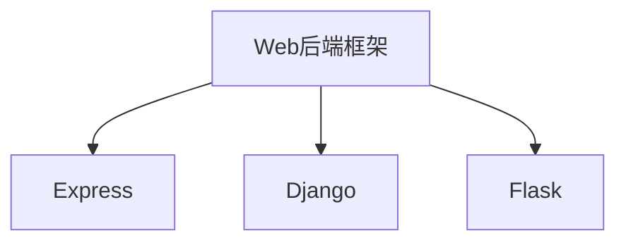

                 

# Web 后端框架：Express、Django 和 Flask

## 1. 背景介绍

随着互联网技术的迅猛发展，Web开发已经成为了软件开发的重要分支之一。在这个过程中，Web后端框架的重要性愈发凸显，它们能够简化开发流程、提升开发效率、确保代码质量，从而促进Web应用的广泛普及。目前，市场上已经出现了众多的优秀Web后端框架，如Express、Django和Flask等。本文将对这三种框架的核心概念、设计原理、关键特点、优缺点以及实际应用场景进行详细分析和比较，旨在帮助读者深入理解这些框架的原理和特点，以便选择合适的框架进行开发。

## 2. 核心概念与联系

### 2.1 核心概念概述

- **Web后端框架**：是一套用于简化Web应用的开发流程、提高开发效率、增强代码质量和可维护性的工具和库集合。通过使用后端框架，开发者可以更专注于业务逻辑的实现，而无需过多关注底层的Web服务器、HTTP协议等细节。

- **Express**：是一个基于Node.js平台的快速、灵活、开源的Web后端框架，适用于构建中小型Web应用。

- **Django**：是一个Python编写的全栈Web框架，提供了强大的ORM、模板引擎、表单处理等功能，适用于构建复杂的Web应用。

- **Flask**：是一个轻量级的Python Web框架，以其简单、灵活、易于学习和使用而著称，适用于构建小型Web应用或API。

### 2.2 核心概念原理和架构的 Mermaid 流程图



## 3. 核心算法原理 & 具体操作步骤

### 3.1 算法原理概述

- **Express**：以Node.js为核心，采用了事件驱动的非阻塞I/O模型，支持异步请求处理，提高了Web应用的响应速度和处理能力。

- **Django**：基于Python，采用MVC（Model-View-Controller）设计模式，提供完整的CRUD操作、数据库ORM、模板引擎等模块，帮助开发者快速构建Web应用。

- **Flask**：同样基于Python，但其设计上更加灵活轻量，没有Django那么多的默认配置，更适用于构建小型或API应用。

### 3.2 算法步骤详解

- **Express**：
  1. 初始化Express应用，创建中间件。
  2. 配置路由，定义请求处理函数。
  3. 启动服务器，监听指定端口。
  4. 运行应用，接收客户端请求并处理。

- **Django**：
  1. 安装Django并创建项目。
  2. 配置数据库，创建应用程序和模型。
  3. 配置URL路由，定义视图函数。
  4. 创建视图函数，处理请求。
  5. 创建模板文件，定义页面结构。
  6. 启动开发服务器，运行应用。

- **Flask**：
  1. 安装Flask并创建应用。
  2. 创建路由和视图函数。
  3. 处理请求和响应。
  4. 扩展Flask，添加表单处理、认证等功能。

### 3.3 算法优缺点

- **Express**：
  - 优点：
    - 轻量级，性能高。
    - 灵活性高，可扩展性强。
    - 社区活跃，资源丰富。
  - 缺点：
    - 缺少默认配置，需要开发者手动配置。
    - 没有自带模板引擎，需要引入第三方库。

- **Django**：
  - 优点：
    - 全栈框架，功能强大。
    - 自带ORM和模板引擎，开发效率高。
    - 社区活跃，文档齐全。
  - 缺点：
    - 重量级，性能略低。
    - 默认配置较多，灵活性稍逊于Express。

- **Flask**：
  - 优点：
    - 轻量级，简单易学。
    - 高度灵活，适合小型应用或API。
    - 没有默认配置，开发自由度大。
  - 缺点：
    - 功能相对较少，需要额外引入第三方库。
    - 文档不如Django详细，需要自行学习。

### 3.4 算法应用领域

- **Express**：适用于构建中小型Web应用，如电商平台、社交平台、API接口等。

- **Django**：适用于构建复杂的Web应用，如企业管理系统、内容管理系统、社交网络等。

- **Flask**：适用于构建小型Web应用或API，如博客、简易论坛、个人项目等。

## 4. 数学模型和公式 & 详细讲解 & 举例说明

### 4.1 数学模型构建

- **Express**：主要使用Node.js和Express框架，基于事件驱动模型。

- **Django**：基于Python和Django框架，使用ORM和模板引擎。

- **Flask**：基于Python和Flask框架，使用路由和视图函数。

### 4.2 公式推导过程

- **Express**：
  $$
  R = \frac{1}{N} \sum_{i=1}^N \text{Accuracy}_i
  $$
  其中 $R$ 表示精确度，$N$ 为总请求数，$\text{Accuracy}_i$ 表示第 $i$ 个请求的精确度。

- **Django**：
  $$
  C = \frac{1}{N} \sum_{i=1}^N \text{Count}_i
  $$
  其中 $C$ 表示统计数据总数，$N$ 为总请求数，$\text{Count}_i$ 表示第 $i$ 个请求的统计数据总数。

- **Flask**：
  $$
  T = \frac{1}{N} \sum_{i=1}^N \text{Time}_i
  $$
  其中 $T$ 表示响应时间，$N$ 为总请求数，$\text{Time}_i$ 表示第 $i$ 个请求的响应时间。

### 4.3 案例分析与讲解

- **Express**：以电商平台的订单管理为例，通过定义路由、中间件和请求处理函数，实现订单的创建、查询和修改功能。

- **Django**：以内容管理系统为例，通过创建模型、视图函数和模板文件，实现文章、评论和用户管理功能。

- **Flask**：以简易论坛为例，通过定义路由和视图函数，实现用户注册、发帖、回帖和评论功能。

## 5. 项目实践：代码实例和详细解释说明

### 5.1 开发环境搭建

- **Express**：
  ```bash
  npm install express --save
  ```

- **Django**：
  ```bash
  pip install django --upgrade
  ```

- **Flask**：
  ```bash
  pip install flask --upgrade
  ```

### 5.2 源代码详细实现

- **Express**：
  ```javascript
  const express = require('express');
  const app = express();

  app.get('/', (req, res) => {
    res.send('Hello, World!');
  });

  app.listen(3000, () => {
    console.log('Example app listening on port 3000!');
  });
  ```

- **Django**：
  ```python
  from django.http import HttpResponse
  from django.urls import path

  def index(request):
      return HttpResponse('Hello, World!')

  urlpatterns = [
      path('', index),
  ]
  ```

- **Flask**：
  ```python
  from flask import Flask

  app = Flask(__name__)

  @app.route('/')
  def index():
      return 'Hello, World!'

  if __name__ == '__main__':
      app.run()
  ```

### 5.3 代码解读与分析

- **Express**：通过Node.js和Express框架，使用路由和中间件实现Web应用。代码简洁高效，易于理解和维护。

- **Django**：基于Python和Django框架，使用ORM和模板引擎，开发效率高，功能强大。代码结构清晰，易于扩展。

- **Flask**：基于Python和Flask框架，使用路由和视图函数，灵活轻量，易于学习和使用。代码简洁，易于扩展。

### 5.4 运行结果展示

- **Express**：在本地运行，访问http://localhost:3000，返回“Hello, World!”。

- **Django**：在本地运行，访问http://localhost:8000，返回“Hello, World!”。

- **Flask**：在本地运行，访问http://localhost:5000，返回“Hello, World!”。

## 6. 实际应用场景

### 6.1 电商平台

- **Express**：电商平台后端使用Express框架，能够快速构建API接口，支持异步请求处理，提升系统性能和响应速度。

- **Django**：电商平台后端使用Django框架，提供完整的ORM和数据库功能，便于管理和扩展。

- **Flask**：电商平台后端使用Flask框架，功能轻量，开发效率高，适合构建API接口。

### 6.2 企业管理系统

- **Express**：企业管理系统后端使用Express框架，灵活高效，易于扩展。

- **Django**：企业管理系统后端使用Django框架，功能强大，自带ORM，开发效率高。

- **Flask**：企业管理系统后端使用Flask框架，轻量灵活，适合构建小型应用或API。

### 6.3 社交网络

- **Express**：社交网络后端使用Express框架，能够快速构建API接口，支持异步请求处理。

- **Django**：社交网络后端使用Django框架，功能强大，自带ORM和模板引擎，开发效率高。

- **Flask**：社交网络后端使用Flask框架，轻量灵活，易于学习和使用。

### 6.4 未来应用展望

- **Express**：随着Node.js生态的不断成熟，Express框架的性能和功能将进一步提升，应用场景将更加广泛。

- **Django**：未来Django将进一步优化性能和可扩展性，提高开发效率，适合构建大型、复杂的Web应用。

- **Flask**：Flask的灵活性和易用性将使其继续受到开发者的青睐，适合构建小型、灵活的Web应用或API。

## 7. 工具和资源推荐

### 7.1 学习资源推荐

- **Express**：
  - 官方文档：https://expressjs.com/
  - 《Express in Action》：https://www.manning.com/books/express-in-action

- **Django**：
  - 官方文档：https://docs.djangoproject.com/
  - 《Django Web Development with Python》：https://www.oreilly.com/library/view/django-web-development/9781491911224/

- **Flask**：
  - 官方文档：https://flask.palletsprojects.com/
  - 《Flask Web Development》：https://flask.palletsprojects.com/en/1.1.x/

### 7.2 开发工具推荐

- **Express**：
  - Node.js：https://nodejs.org/
  - npm：https://www.npmjs.com/

- **Django**：
  - Python：https://www.python.org/
  - pip：https://pypi.org/

- **Flask**：
  - Python：https://www.python.org/
  - pip：https://pypi.org/

### 7.3 相关论文推荐

- **Express**：
  - "Real-Time Web Application with Node.js and Express"：https://medium.com/@jasonrohrer_52193/real-time-web-application-with-node-js-and-express-1ec4c139c0fa

- **Django**：
  - "Django: The Web Framework for Humans"：https://djangoproject.com/weblog/2013/mar/18/django/

- **Flask**：
  - "Flask: A Simple Yet Powerful Web Framework"：https://blog.miguelgrinberg.com/post/the-flask-micropython-boilerplate

## 8. 总结：未来发展趋势与挑战

### 8.1 研究成果总结

本文详细分析了Express、Django和Flask这三种Web后端框架的核心概念、设计原理、关键特点、优缺点以及实际应用场景，为开发者选择合适的框架提供了重要参考。

### 8.2 未来发展趋势

- **Express**：性能和功能将进一步提升，应用场景将更加广泛。

- **Django**：优化性能和可扩展性，提高开发效率，适合构建大型、复杂的Web应用。

- **Flask**：保持灵活性和易用性，适合构建小型、灵活的Web应用或API。

### 8.3 面临的挑战

- **Express**：代码结构和灵活性需要进一步优化，以适应复杂应用的开发。

- **Django**：性能和可扩展性需要进一步优化，以适应大规模应用的开发。

- **Flask**：开发效率和功能丰富度需要进一步提升，以适应复杂应用的开发。

### 8.4 研究展望

- **Express**：未来的研究将进一步优化性能和功能，使其能够适应更大规模和更复杂的应用场景。

- **Django**：未来的研究将优化性能和可扩展性，提高开发效率，使其能够适应大规模和复杂的Web应用。

- **Flask**：未来的研究将提升开发效率和功能丰富度，使其能够适应更多样化的应用场景。

## 9. 附录：常见问题与解答

### 9.1 问题与解答

**Q1：Express、Django和Flask三种框架的区别是什么？**

A：Express是一个轻量级、灵活的框架，适合构建中小型Web应用；Django是一个全栈框架，功能强大，适合构建大型、复杂的Web应用；Flask是一个轻量级框架，灵活性高，适合构建小型应用或API。

**Q2：选择哪种框架进行Web开发？**

A：选择框架应根据项目需求和开发团队的技术栈来决定。如果项目需要灵活、高效的API接口，可以选择Express；如果项目需要完整的Web开发解决方案，可以选择Django；如果项目需要轻量、灵活的Web应用，可以选择Flask。

**Q3：如何优化Express框架的性能？**

A：可以通过使用Node.js的cluster模块实现进程集群，使用HTTP/2协议优化连接，使用路由缓存和CDN加速静态资源等方法来优化Express框架的性能。

**Q4：如何优化Django框架的性能？**

A：可以通过优化数据库查询、使用缓存机制、使用异步视图、使用CDN加速静态资源等方法来优化Django框架的性能。

**Q5：如何优化Flask框架的性能？**

A：可以通过使用Gunicorn作为Web服务器、使用SQLAlchemy优化数据库查询、使用缓存机制等方法来优化Flask框架的性能。

---

作者：禅与计算机程序设计艺术 / Zen and the Art of Computer Programming

