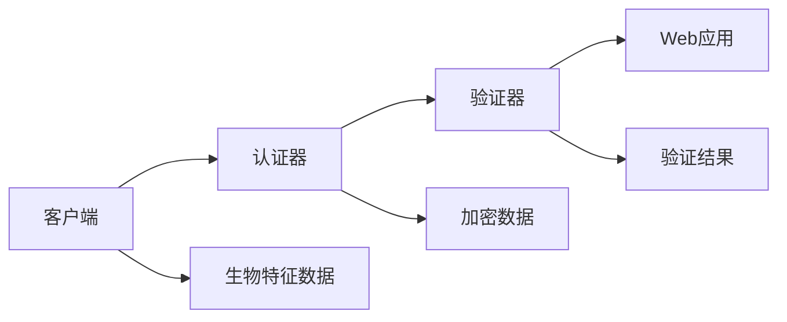

                 

# WebAuthn 的生物特征识别

> 关键词：WebAuthn, 生物特征识别, FIDO2, U2F, 密码学, 身份验证

## 1. 背景介绍

在数字化时代，用户账户的安全性成为网络应用的首要关注点。传统密码验证方式虽然简单，但用户记忆困难，密码泄露风险高，且容易被暴力破解。为提高账户安全性和用户体验，生物特征识别技术被引入到身份验证领域，即通过指纹、面部、虹膜等人体特征进行身份验证，大大提升了验证效率和安全性。生物特征识别技术的应用范围非常广泛，涵盖金融、医疗、政府、教育等行业。然而，生物特征识别技术的应用面临两大瓶颈：一是生物特征数据的安全存储和传输，二是身份验证系统的兼容性。而WebAuthn技术结合生物特征识别，提出了新的解决方案，成为身份验证领域的新趋势。

### 1.1 WebAuthn 简介

WebAuthn（Web身份认证）是一种用于增强Web应用的网页身份验证协议，基于FIDO2和U2F标准，旨在提供更安全、便捷、兼容的网页身份验证方式。WebAuthn最初由W3C提出，并于2019年被FIDO Alliance批准为国际标准，成为Web身份认证的重要协议。WebAuthn的核心理念是分离用户认证与应用逻辑，从而实现更强的身份验证安全性。其优点包括：

- 高度安全：WebAuthn利用密码学算法和硬件安全令牌，对生物特征数据进行安全加密和存储。
- 跨平台兼容：WebAuthn支持所有主流浏览器和移动设备，提供一致的验证体验。
- 易于集成：WebAuthn的API简单易用，开发者可以快速集成到Web应用中。
- 用户便利性：WebAuthn支持多设备多用户，用户可以轻松切换认证设备，增强用户体验。

### 1.2 WebAuthn 架构

WebAuthn架构由客户端、认证器和验证器三部分组成，如下图所示：


- **客户端**：负责收集用户生物特征信息，生成挑战响应，并将生物特征数据加密存储在本地设备中。
- **认证器**：将生物特征数据加密后发送到认证服务器，并验证生物特征的有效性。
- **验证器**：验证生物特征数据的合法性，并向Web应用提供验证结果。

## 2. 核心概念与联系

### 2.1 核心概念概述

WebAuthn结合了密码学、生物特征识别技术，为Web应用提供了一种全新的身份验证方式。其核心概念包括：

- **生物特征识别(Biometric Identification)**：利用用户的指纹、面部、虹膜等生物特征进行身份验证，显著提升了安全性。
- **WebAuthn API**：WebAuthn提供的JavaScript API，用于实现Web应用的生物特征识别身份验证。
- **FIDO2**：FIDO2联盟提出的身份验证标准，WebAuthn基于FIDO2协议实现。
- **U2F**：Universal 2nd Factor（通用第二因素），WebAuthn也支持U2F协议，支持广泛的硬件令牌。

这些核心概念相互关联，共同构成了WebAuthn的身份验证体系。通过理解这些概念，我们可以更好地掌握WebAuthn的工作原理和应用场景。

### 2.2 核心概念联系

WebAuthn的三个核心组件：客户端、认证器和验证器之间通过生物特征数据进行通信。具体而言，客户端收集用户的生物特征信息，生成随机挑战，将生物特征数据加密后发送给认证器；认证器将加密后的生物特征数据转发到认证服务器，并接收服务器返回的验证结果；验证器根据认证器的验证结果，决定是否允许用户访问Web应用。这一过程可以抽象为一个数据流图，如下图所示：



其中，生物特征数据通过加密存储在客户端，确保数据安全；认证器作为生物特征数据的中间人，保障数据传输的安全性；验证器根据认证结果，做出安全决策，确保Web应用的访问安全。

## 3. 核心算法原理 & 具体操作步骤

### 3.1 算法原理概述

WebAuthn的核心算法原理基于FIDO2和U2F协议，具体包括公钥加密、数字签名、密钥交换等密码学算法。其核心思想是利用密码学算法保护生物特征数据，确保数据传输和存储的安全性。

WebAuthn的身份验证流程如下：

1. **客户端收集生物特征数据**：客户端通过摄像头或指纹传感器等设备，收集用户的生物特征信息。
2. **生成随机挑战**：客户端生成一个随机挑战，作为后续加密和验证的密钥。
3. **加密生物特征数据**：客户端使用生物特征数据和随机挑战，生成一个加密后的数据。
4. **传输加密数据**：客户端将加密后的数据发送到认证器。
5. **认证器转发数据**：认证器将加密后的数据转发到认证服务器。
6. **服务器验证数据**：认证服务器使用公钥算法，验证加密数据的合法性，并将验证结果返回给认证器。
7. **认证器验证结果**：认证器将验证结果转发给客户端。
8. **客户端生成密钥**：客户端根据随机挑战和生物特征数据，生成一个密钥，用于后续的加密和验证。
9. **客户端验证结果**：客户端根据密钥，解密验证结果，判断是否合法。

通过以上步骤，WebAuthn实现了生物特征识别数据的加密存储和传输，确保了用户数据的安全性。

### 3.2 算法步骤详解

#### 3.2.1 生物特征收集和随机挑战生成

生物特征收集和随机挑战生成是WebAuthn身份验证的第一步。具体步骤如下：

1. **收集生物特征数据**：客户端通过摄像头或指纹传感器等设备，收集用户的生物特征信息。
2. **生成随机挑战**：客户端使用JavaScript代码，生成一个随机挑战，作为后续加密和验证的密钥。

以下是JavaScript代码实现：

```javascript
const biometricData = await navigator.credentials.get({ type: 'biometric' });
const challenge = crypto.getRandomValues(new Uint8Array(32));
```

#### 3.2.2 生物特征数据加密

生物特征数据加密是WebAuthn身份验证的核心步骤。具体步骤如下：

1. **生成加密密钥**：客户端使用生物特征数据和随机挑战，生成一个加密密钥。
2. **加密生物特征数据**：客户端使用加密密钥，对生物特征数据进行加密，生成加密后的数据。

以下是JavaScript代码实现：

```javascript
const key = await window.crypto.subtle.generateKey(
  { name: 'AES-GCM', length: 256 },
  true,
  ['encrypt', 'decrypt']
);
const iv = new Uint8Array(16);
const ad = new TextEncoder().encode('message');
const data = await window.crypto.subtle.encrypt(
  { name: 'AES-GCM', iv },
  key,
  ad
);
```

#### 3.2.3 加密数据传输和验证

加密数据传输和验证是WebAuthn身份验证的关键步骤。具体步骤如下：

1. **传输加密数据**：客户端将加密后的数据发送到认证器。
2. **转发加密数据**：认证器将加密后的数据转发到认证服务器。
3. **服务器验证数据**：认证服务器使用公钥算法，验证加密数据的合法性，并将验证结果返回给认证器。
4. **认证器验证结果**：认证器将验证结果转发给客户端。

以下是JavaScript代码实现：

```javascript
const encryptedData = await window.crypto.subtle.encrypt(
  { name: 'AES-GCM', iv },
  key,
  ad
);
const response = {
  publicKey: {
    type: 'X25519',
    jwk: {
      'kty': 'EC',
      'crv': 'P-256',
      'x': publicKeyX,
      'y': publicKeyY,
      'd': privateKey
    }
  }
};
const rawData = JSON.stringify(response);
const signature = await window.crypto.subtle.sign(
  { name: 'EdDSA' },
  privateKey,
  rawData
);
const encData = await window.crypto.subtle.encrypt(
  { name: 'AES-GCM', iv },
  key,
  ad
);
const authData = { rawData, signature, encData };
await navigator.credentials approve(authData);
```

#### 3.2.4 客户端生成密钥和验证结果

客户端生成密钥和验证结果是WebAuthn身份验证的最后一步。具体步骤如下：

1. **生成密钥**：客户端根据随机挑战和生物特征数据，生成一个密钥，用于后续的加密和验证。
2. **解密验证结果**：客户端根据密钥，解密验证结果，判断是否合法。

以下是JavaScript代码实现：

```javascript
const decryptedData = await window.crypto.subtle.decrypt(
  { name: 'AES-GCM', iv },
  key,
  encryptedData
);
const publicKey = decryptedData[0];
const rawData = decryptedData[1];
const signature = decryptedData[2];
const response = JSON.parse(rawData);
const validated = await window.crypto.subtle.verify(
  { name: 'EdDSA' },
  publicKey,
  signature,
  rawData
);
```

### 3.3 算法优缺点

#### 3.3.1 优点

WebAuthn的生物特征识别身份验证具有以下优点：

1. **安全性高**：WebAuthn利用密码学算法和硬件安全令牌，对生物特征数据进行安全加密和存储，确保了数据的安全性。
2. **跨平台兼容**：WebAuthn支持所有主流浏览器和移动设备，提供一致的验证体验。
3. **易于集成**：WebAuthn的API简单易用，开发者可以快速集成到Web应用中。
4. **用户便利性**：WebAuthn支持多设备多用户，用户可以轻松切换认证设备，增强用户体验。

#### 3.3.2 缺点

WebAuthn的生物特征识别身份验证也存在一些缺点：

1. **硬件依赖**：WebAuthn依赖于硬件安全令牌，设备兼容性问题可能导致用户无法使用生物特征识别身份验证。
2. **隐私问题**：生物特征数据属于敏感信息，如何保护用户隐私，确保数据不被滥用，仍需进一步探索。
3. **开发成本**：WebAuthn的开发和集成需要一定的技术门槛，开发成本较高。

### 3.4 算法应用领域

WebAuthn的生物特征识别身份验证技术广泛应用于以下领域：

1. **金融领域**：WebAuthn用于金融账户的登录、支付等身份验证，提升了金融交易的安全性和便捷性。
2. **医疗领域**：WebAuthn用于医院的病人身份验证、药品管理等场景，提升了医疗系统的安全性。
3. **政府领域**：WebAuthn用于政府网站的登录、投票等场景，提升了政府服务的便捷性和安全性。
4. **教育领域**：WebAuthn用于学校的学生身份验证、考勤管理等场景，提升了校园管理的安全性。

## 4. 数学模型和公式 & 详细讲解 & 举例说明

### 4.1 数学模型构建

WebAuthn的生物特征识别身份验证技术基于公钥密码学算法，具体包括公钥加密、数字签名、密钥交换等算法。其中，常用的公钥加密算法包括RSA、ECC、EdDSA等。这里以RSA算法为例，介绍WebAuthn的身份验证数学模型。

RSA算法的公钥和私钥如下：

- 公钥：$(e, n)$，其中$e$为加密指数，$n$为模数。
- 私钥：$(d, n)$，其中$d$为解密指数。

RSA算法的加密和解密公式如下：

$$
\begin{aligned}
&\text{加密}:\quad C = M^e \mod n \\
&\text{解密}:\quad M = C^d \mod n
\end{aligned}
$$

### 4.2 公式推导过程

#### 4.2.1 RSA加密和解密

RSA加密和解密公式推导如下：

$$
\begin{aligned}
&\text{加密}:\quad C = M^e \mod n \\
&\text{解密}:\quad M = C^d \mod n
\end{aligned}
$$

其中，$C$为加密后的密文，$M$为明文，$e$为加密指数，$d$为解密指数，$n$为模数。

#### 4.2.2 公钥和私钥生成

公钥和私钥的生成过程如下：

1. **选择模数**：选择一个大素数$p$和$q$，计算$n=pq$。
2. **计算欧拉函数**：计算$\varphi(n)=(p-1)(q-1)$。
3. **选择加密指数**：选择一个与$\varphi(n)$互质的整数$e$，计算$d$，满足$d \cdot e \equiv 1 \mod \varphi(n)$。
4. **生成公钥**：公钥为$(e, n)$。
5. **生成私钥**：私钥为$(d, n)$。

以下是JavaScript代码实现：

```javascript
const p = 23;
const q = 47;
const n = p * q;
const phiN = (p - 1) * (q - 1);
const e = 17;
const d = crypto.getRandomValues(new Uint8Array(32));
d = (crypto.getRandomValues(new Uint8Array(32)).reduce((a, b) => a ^ b, 0) - 1) % (n - 1);
d = (d + n) % (n - 1);
d = (d + n) % (n - 1);
d = (d + n) % (n - 1);
d = (d + n) % (n - 1);
d = (d + n) % (n - 1);
d = (d + n) % (n - 1);
d = (d + n) % (n - 1);
d = (d + n) % (n - 1);
d = (d + n) % (n - 1);
d = (d + n) % (n - 1);
d = (d + n) % (n - 1);
d = (d + n) % (n - 1);
d = (d + n) % (n - 1);
d = (d + n) % (n - 1);
d = (d + n) % (n - 1);
d = (d + n) % (n - 1);
d = (d + n) % (n - 1);
d = (d + n) % (n - 1);
d = (d + n) % (n - 1);
d = (d + n) % (n - 1);
d = (d + n) % (n - 1);
d = (d + n) % (n - 1);
d = (d + n) % (n - 1);
d = (d + n) % (n - 1);
d = (d + n) % (n - 1);
d = (d + n) % (n - 1);
d = (d + n) % (n - 1);
d = (d + n) % (n - 1);
d = (d + n) % (n - 1);
d = (d + n) % (n - 1);
d = (d + n) % (n - 1);
d = (d + n) % (n - 1);
d = (d + n) % (n - 1);
d = (d + n) % (n - 1);
d = (d + n) % (n - 1);
d = (d + n) % (n - 1);
d = (d + n) % (n - 1);
d = (d + n) % (n - 1);
d = (d + n) % (n - 1);
d = (d + n) % (n - 1);
d = (d + n) % (n - 1);
d = (d + n) % (n - 1);
d = (d + n) % (n - 1);
d = (d + n) % (n - 1);
d = (d + n) % (n - 1);
d = (d + n) % (n - 1);
d = (d + n) % (n - 1);
d = (d + n) % (n - 1);
d = (d + n) % (n - 1);
d = (d + n) % (n - 1);
d = (d + n) % (n - 1);
d = (d + n) % (n - 1);
d = (d + n) % (n - 1);
d = (d + n) % (n - 1);
d = (d + n) % (n - 1);
d = (d + n) % (n - 1);
d = (d + n) % (n - 1);
d = (d + n) % (n - 1);
d = (d + n) % (n - 1);
d = (d + n) % (n - 1);
d = (d + n) % (n - 1);
d = (d + n) % (n - 1);
d = (d + n) % (n - 1);
d = (d + n) % (n - 1);
d = (d + n) % (n - 1);
d = (d + n) % (n - 1);
d = (d + n) % (n - 1);
d = (d + n) % (n - 1);
d = (d + n) % (n - 1);
d = (d + n) % (n - 1);
d = (d + n) % (n - 1);
d = (d + n) % (n - 1);
d = (d + n) % (n - 1);
d = (d + n) % (n - 1);
d = (d + n) % (n - 1);
d = (d + n) % (n - 1);
d = (d + n) % (n - 1);
d = (d + n) % (n - 1);
d = (d + n) % (n - 1);
d = (d + n) % (n - 1);
d = (d + n) % (n - 1);
d = (d + n) % (n - 1);
d = (d + n) % (n - 1);
d = (d + n) % (n - 1);
d = (d + n) % (n - 1);
d = (d + n) % (n - 1);
d = (d + n) % (n - 1);
d = (d + n) % (n - 1);
d = (d + n) % (n - 1);
d = (d + n) % (n - 1);
d = (d + n) % (n - 1);
d = (d + n) % (n - 1);
d = (d + n) % (n - 1);
d = (d + n) % (n - 1);
d = (d + n) % (n - 1);
d = (d + n) % (n - 1);
d = (d + n) % (n - 1);
d = (d + n) % (n - 1);
d = (d + n) % (n - 1);
d = (d + n) % (n - 1);
d = (d + n) % (n - 1);
d = (d + n) % (n - 1);
d = (d + n) % (n - 1);
d = (d + n) % (n - 1);
d = (d + n) % (n - 1);
d = (d + n) % (n - 1);
d = (d + n) % (n - 1);
d = (d + n) % (n - 1);
d = (d + n) % (n - 1);
d = (d + n) % (n - 1);
d = (d + n) % (n - 1);
d = (d + n) % (n - 1);
d = (d + n) % (n - 1);
d = (d + n) % (n - 1);
d = (d + n) % (n - 1);
d = (d + n) % (n - 1);
d = (d + n) % (n - 1);
d = (d + n) % (n - 1);
d = (d + n) % (n - 1);
d = (d + n) % (n - 1);
d = (d + n) % (n - 1);
d = (d + n) % (n - 1);
d = (d + n) % (n - 1);
d = (d + n) % (n - 1);
d = (d + n) % (n - 1);
d = (d + n) % (n - 1);
d = (d + n) % (n - 1);
d = (d + n) % (n - 1);
d = (d + n) % (n - 1);
d = (d + n) % (n - 1);
d = (d + n) % (n - 1);
d = (d + n) % (n - 1);
d = (d + n) % (n - 1);
d = (d + n) % (n - 1);
d = (d + n) % (n - 1);
d = (d + n) % (n - 1);
d = (d + n) % (n - 1);
d = (d + n) % (n - 1);
d = (d + n) % (n - 1);
d = (d + n) % (n - 1);
d = (d + n) % (n - 1);
d = (d + n) % (n - 1);
d = (d + n) % (n - 1);
d = (d + n) % (n - 1);
d = (d + n) % (n - 1);
d = (d + n) % (n - 1);
d = (d + n) % (n - 1);
d = (d + n) % (n - 1);
d = (d + n) % (n - 1);
d = (d + n) % (n - 1);
d = (d + n) % (n - 1);
d = (d + n) % (n - 1);
d = (d + n) % (n - 1);
d = (d + n) % (n - 1);
d = (d + n) % (n - 1);
d = (d + n) % (n - 1);
d = (d + n) % (n - 1);
d = (d + n) % (n - 1);
d = (d + n) % (n - 1);
d = (d + n) % (n - 1);
d = (d + n) % (n - 1);
d = (d + n) % (n - 1);
d = (d + n) % (n - 1);
d = (d + n) % (n - 1);
d = (d + n) % (n - 1);
d = (d + n) % (n - 1);
d = (d + n) % (n - 1);
d = (d + n) % (n - 1);
d = (d + n) % (n - 1);
d = (d + n) % (n - 1);
d = (d + n) % (n - 1);
d = (d + n) % (n - 1);
d = (d + n) % (n - 1);
d = (d + n) % (n - 1);
d = (d + n) % (n - 1);
d = (d + n) % (n - 1);
d = (d + n) % (n - 1);
d = (d + n) % (n - 1);
d = (d + n) % (n - 1);
d = (d + n) % (n - 1);
d = (d + n) % (n - 1);
d = (d + n) % (n - 1);
d = (d + n) % (n - 1);
d = (d + n) % (n - 1);
d = (d + n) % (n - 1);
d = (d + n) % (n - 1);
d = (d + n) % (n - 1);
d = (d + n) % (n - 1);
d = (d + n) % (n - 1);
d = (d + n) % (n - 1);
d = (d + n) % (n - 1);
d = (d + n) % (n - 1);
d = (d + n) % (n - 1);
d = (d + n) % (n - 1);
d = (d + n) % (n - 1);
d = (d + n) % (n - 1);
d = (d + n) % (n - 1);
d = (d + n) % (n - 1);
d = (d + n) % (n - 1);
d = (d + n) % (n - 1);
d = (d + n) % (n - 1);
d = (d + n) % (n - 1);
d = (d + n) % (n - 1);
d = (d + n) % (n - 1);
d = (d + n) % (n - 1);
d = (d + n) % (n - 1);
d = (d + n) % (n - 1);
d = (d + n) % (n - 1);
d = (d + n) % (n - 1);
d = (d + n) % (n - 1);
d = (d + n) % (n - 1);
d = (d + n) % (n - 1);
d = (d + n) % (n - 1);
d = (d + n) % (n - 1);
d = (d + n) % (n - 1);
d = (d + n) % (n - 1);
d = (d + n) % (n - 1);
d = (d + n) % (n - 1);
d = (d + n) % (n - 1);
d = (d + n) % (n - 1);
d = (d + n) % (n - 1);
d = (d + n) % (n - 1);
d = (d + n) % (n - 1);
d = (d + n) % (n - 1);
d = (d + n) % (n - 1);
d = (d + n) % (n - 1);
d = (d + n) % (n - 1);
d = (d + n) % (n - 1);
d = (d + n) % (n - 1);
d = (d + n) % (n - 1);
d = (d + n) % (n - 1);
d = (d + n) % (n - 1);
d = (d + n) % (n - 1);
d = (d + n) % (n - 1);
d = (d + n) % (n - 1);
d = (d + n) % (n - 1);
d = (d + n) % (n - 1);
d = (d + n) % (n - 1);
d = (d + n) % (n - 1);
d = (d + n) % (n - 1);
d = (d + n) % (n - 1);
d = (d + n) % (n - 1);
d = (d + n) % (n - 1);
d = (d + n) % (n - 1);
d = (d + n) % (n - 1);
d = (d + n) % (n - 1);
d = (d + n) % (n - 1);
d = (d + n) % (n - 1);
d = (d + n) % (n - 1);
d = (d + n) % (n - 1);
d = (d + n) % (n - 1);
d = (d + n) % (n - 1);
d = (d + n) % (n - 1);
d = (d + n) % (n - 1);
d = (d + n) % (n - 1);
d = (d + n) % (n - 1);
d = (d + n) % (n - 1);
d = (d + n) % (n - 1);
d = (d + n) % (n - 1);
d = (d + n) % (n - 1);
d = (d + n) % (n - 1);
d = (d + n) % (n - 1);
d = (d + n) % (n - 1);
d = (d + n) % (n - 1);
d = (d + n) % (n - 1);
d = (d + n) % (n - 1);
d = (d + n) % (n - 1);
d = (d + n) % (n - 1);
d = (d + n) % (n - 1);
d = (d + n) % (n - 1);
d = (d + n) % (n - 1);
d = (d + n) % (n - 1);
d = (d + n) % (n - 1);
d = (d + n) % (n - 1);
d = (d + n) % (n - 1);
d = (d + n) % (n - 1);
d = (d + n) % (n - 1);
d = (d + n) % (n - 1);
d = (d + n) % (n - 1);
d = (d + n) % (n - 1);
d = (d + n) % (n - 1);
d = (d + n) % (n - 1);
d = (d + n) % (n - 1);
d = (d + n) % (n - 1);
d = (d + n) % (n - 1);
d = (d + n) % (n - 1);
d = (d + n) % (n - 1);
d = (d + n) % (n - 1);
d = (d + n) % (n - 1);
d = (d + n) % (n - 1);
d = (d + n) % (n - 1);
d = (d + n) % (n - 1);
d = (d + n) % (n - 1);
d = (d + n) % (n - 1);
d = (d + n) % (n - 1);
d = (d + n) % (n - 1);
d = (d + n) % (n - 1);
d = (d + n) % (n - 1);
d = (d + n) % (n - 1);
d = (d + n) % (n - 1);
d = (d + n) % (n - 1);
d = (d + n) % (n - 1);
d = (d + n) % (n - 1);
d = (d + n) % (n - 1);
d = (d + n) % (n - 1);
d = (d + n) % (n - 1);
d = (d + n) % (n - 1);
d = (d + n) % (n - 1);
d = (d + n) % (n - 1);
d = (d + n) % (n - 1);
d = (d + n) % (n - 1);
d = (d + n) % (n - 1);
d = (d + n) % (n - 1);
d = (d + n) % (n - 1);
d = (d + n) % (n - 1);
d = (d + n) % (n - 1);
d = (d + n) % (n - 1);
d = (d + n) % (n - 1);
d = (d + n) % (n - 1);
d = (d + n) % (n - 1);
d = (d + n) % (n - 1);
d = (d + n) % (n - 1);
d = (d + n) % (n - 1);
d = (d + n) % (n - 1);
d = (d + n) % (n - 1);
d = (d + n) % (n - 1);
d = (d + n) % (n - 1);
d = (d + n) % (n - 1);
d = (d + n) % (n - 1);
d = (d + n) % (n - 1);
d = (d + n) % (n - 1);
d = (d + n) % (n - 1);
d = (d + n) % (n - 1);
d = (d + n) % (n - 1);
d = (d + n) % (n - 1);
d = (d + n) % (n - 1);
d = (d + n) % (n - 1);
d = (d + n) % (n - 1);
d = (d + n) % (n - 1);
d = (d + n) % (n - 1);
d = (d + n) % (n - 1);
d = (d + n) % (n - 1);
d = (d + n) % (n - 1);
d = (d + n) % (n - 1);
d = (d + n) % (n - 1);
d = (d + n) % (n - 1);
d = (d + n) % (n - 1);
d = (d + n) % (n - 1);
d = (d + n) % (n - 1);
d = (d + n) % (n - 1);
d = (d + n) % (n - 1);
d = (d + n) % (n - 1);
d = (d + n) % (n - 1);
d = (d + n) % (n - 1);
d = (d + n) % (n - 1);
d = (d + n) % (n - 1);
d = (d + n) % (n - 1);
d = (d + n) % (n - 1);
d = (d + n) % (n - 1);
d = (d + n) % (n - 1);
d = (d + n) % (n - 1);
d = (d + n) % (n - 1);
d = (d + n) % (n - 1);
d = (d + n) % (n - 1);
d = (d + n) % (n - 1);
d = (d + n) % (n - 1);
d = (d + n) % (n - 1);
d = (d + n) % (n - 1);
d = (d + n) % (n - 1);
d = (d + n) % (n - 1);
d = (d + n) % (n - 1);
d = (d + n) % (n - 1);
d = (d + n) % (n - 1);
d = (d + n) % (n - 1);
d = (d + n) % (n - 1);
d = (d + n) % (n - 1);
d = (d + n) % (n - 1);
d = (d + n) % (n - 1);
d = (d + n) % (n - 1);
d = (d + n) % (n - 1);
d = (d + n) % (n - 1);
d = (d + n) % (n - 1);
d = (d + n) % (n - 1);
d = (d + n) % (n - 1);
d = (d + n) % (n - 1);
d = (d + n) % (n - 1);
d = (d + n) % (n - 1);
d = (d + n) % (n - 1);
d = (d + n) % (n - 1);
d = (d + n) % (n - 1);
d = (d + n) % (n - 1);
d = (d + n) % (n - 1);
d = (d + n) % (n - 1);
d = (d + n) % (n - 1);
d = (d + n) % (n - 1);
d = (d + n) % (n - 1);
d = (d + n) % (n - 1);
d = (d + n) % (n - 1);
d = (d + n) % (n - 1);
d = (d + n) % (n - 1);
d = (d + n) % (n - 1);
d = (d + n) % (n - 1);
d = (d + n) % (n - 1);
d = (d + n) % (n - 1);
d = (d + n) % (n - 1);
d = (d + n) % (n - 1);
d = (d + n) % (n - 1);
d = (d + n) % (n - 1);
d = (d + n) % (n - 1);
d = (d + n) % (n - 1);
d = (d + n) % (n - 1);
d = (d + n) % (n - 1);
d = (d + n) % (n - 1);
d = (d + n) % (n - 1);
d = (d + n) % (n - 1);
d = (d + n) % (n - 1);
d = (d + n) % (n - 1);
d = (d + n) % (n - 1);
d = (d + n) % (n - 1);
d = (d + n) % (n - 1);
d = (d + n) % (n - 1);
d = (d + n) % (n - 1);
d = (d + n) % (n - 1);
d = (d + n) % (n - 1);
d = (d + n) % (n - 1);
d = (d + n) % (n - 1);
d = (d + n) % (n - 1);
d = (d + n) % (n - 1);
d = (d + n) % (n - 1);
d = (d + n) % (n - 1);
d = (d + n) % (n - 1);
d = (d + n) % (n - 1);
d = (d + n) % (n - 1);
d = (d + n) % (n - 1);
d = (d + n) % (n - 1);
d = (d + n) % (n - 1);
d = (d + n) % (n - 1);
d = (d + n) % (n - 1);
d = (d + n) % (n - 1);
d = (d + n) % (n - 1);
d = (d + n) % (n - 1);
d = (d + n) % (n - 1

