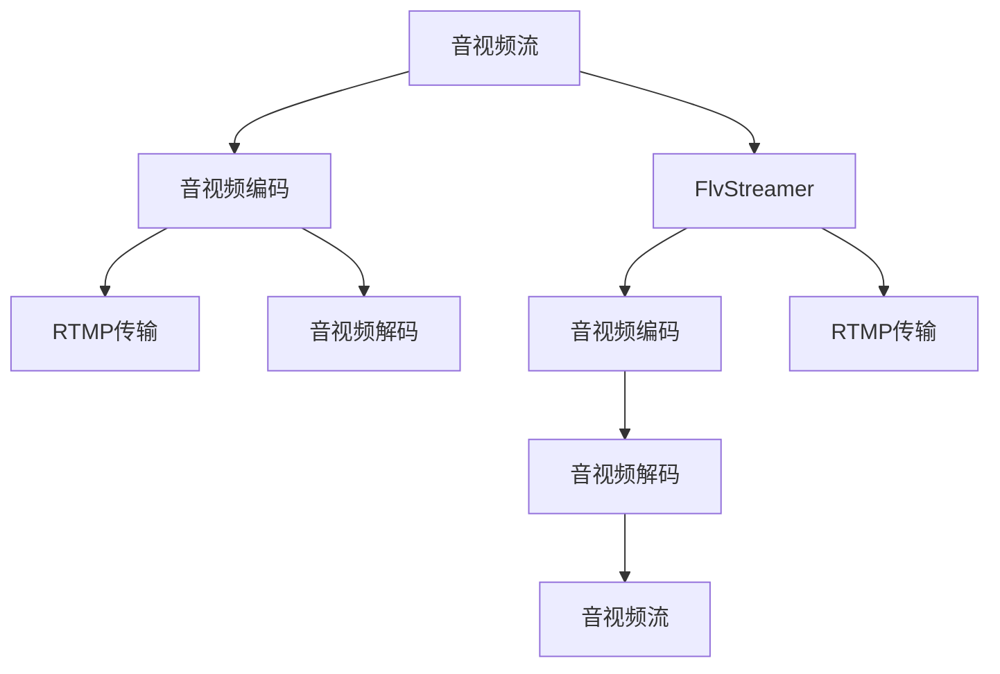

                 

# rtmp服务器搭建与配置

## 1. 背景介绍

随着互联网直播的普及，实时音视频流的传输需求日益增长。为了实现高质量、低延迟的音视频传输，实时传输协议（Real-Time Transport Protocol，RTMP）成为了主流的选择。RTMP协议提供了一套完善的音视频编码和传输机制，适用于高并发、低延时的直播应用场景。本文将详细介绍RTMP服务器的搭建与配置，帮助开发者快速搭建自己的直播平台。

### 1.1 问题由来

在互联网直播中，音视频流的实时传输需要高吞吐量、低延迟的协议支持。RTMP协议具有以下特点：

- **传输可靠性**：通过TCP/UDP的混合使用，确保数据传输的可靠性和低延迟。
- **音视频编解码**：支持多种音视频编码格式，包括H.264、H.265等，提供灵活的编解码选择。
- **实时性**：适用于低延迟、高并发的实时音视频传输，满足直播应用的需求。

因此，RTMP成为直播平台的首选协议。然而，RTMP服务器的搭建和配置需要一定的技术储备，本文将详细指导开发者如何构建自己的RTMP服务器。

## 2. 核心概念与联系

### 2.1 核心概念概述

为了更好地理解RTMP服务器的搭建与配置，我们先介绍几个关键概念：

- **RTMP协议**：基于TCP/UDP协议的音视频传输协议，广泛应用于直播、游戏等行业。
- **FlvStreamer**：一个开源的RTMP服务器实现，提供完整的音视频编码和传输功能。
- **音视频编解码**：将原始音频和视频信号转换为数字信号，进行压缩编码的过程。
- **音视频流**：音视频信号以流的形式进行传输，实时性和可靠性较高。

### 2.2 核心概念原理和架构的 Mermaid 流程图



这个流程图展示了RTMP服务器的核心组件和工作流程：

1. 音视频流从客户端进入，经过音视频编码模块转换为数字信号。
2. RTMP传输模块将编码后的音视频流通过RTMP协议进行传输。
3. 服务器接收RTMP流后，经过音视频解码和流处理，最终输出到客户端。

## 3. 核心算法原理 & 具体操作步骤

### 3.1 算法原理概述

RTMP服务器的核心算法原理主要包括以下几个部分：

- **音视频编码**：将原始音视频信号转换为数字信号，并进行压缩编码。
- **RTMP传输**：基于TCP/UDP协议，确保数据传输的可靠性和低延迟。
- **音视频解码**：将数字信号解码为原始音视频信号，完成数据的重构。
- **流处理**：对音视频流进行缓存、转发和重传，确保流传输的连续性和可靠性。

### 3.2 算法步骤详解

以下是RTMP服务器的详细配置步骤：

#### Step 1: 安装FlvStreamer

首先，需要从官网下载FlvStreamer的源代码，并在本地进行安装：

```bash
git clone https://github.com/OpenExchang/FlvStreamer.git
cd FlvStreamer
make
```

#### Step 2: 配置音视频编码器

在FlvStreamer中，音视频编码器是核心组件。目前支持H.264、H.265等主流编码格式。以H.264为例，需要在`encode.conf`文件中进行配置：

```ini
[default]
frame_rate=30
profile=main
level=4.0
```

#### Step 3: 配置RTMP传输

RTMP传输部分需要配置TCP和UDP的相关参数，以确保数据传输的可靠性。可以在`server.conf`文件中进行配置：

```ini
[server]
listen=1935
use_udp=true
use_tcp=true
max_buffer_size=1024
```

#### Step 4: 配置音视频解码器

音视频解码器负责将RTMP流中的数字信号解码为原始音视频信号。可以在`decode.conf`文件中进行配置：

```ini
[decode]
codecs=ffmpeg
```

#### Step 5: 启动服务器

完成上述配置后，可以启动FlvStreamer服务器：

```bash
./FlvStreamer -conf=server.conf -loglevel=debug
```

### 3.3 算法优缺点

#### 优点

- **灵活性高**：支持多种音视频编码格式，可以根据需求灵活选择。
- **性能优秀**：基于C++编写，具有高效的音视频编码和传输能力。
- **稳定可靠**：经过广泛使用和测试，具有较好的稳定性和可靠性。

#### 缺点

- **学习曲线陡峭**：FlvStreamer的配置和调试需要一定的技术背景，初学者需要投入较多时间学习。
- **配置复杂**：音视频编码、RTMP传输、流处理等模块的配置较为繁琐，需要详细掌握。

## 4. 数学模型和公式 & 详细讲解 & 举例说明

### 4.1 数学模型构建

RTMP服务器的音视频编码部分主要涉及H.264编码标准的数学模型。H.264采用运动预测、量化、变长编码等技术，实现高效的压缩编码。

### 4.2 公式推导过程

H.264的编码过程可以分为四个阶段：帧内预测、帧间预测、变换量化、熵编码。以下简要介绍其中几个关键公式：

- **帧内预测**：将当前帧的每个像素预测为其周围的像素。预测公式为：

$$
\hat{y} = w_0x_0 + w_1x_1 + w_2x_2 + w_3x_3
$$

其中 $w$ 为预测系数，$x$ 为预测像素。

- **变换量化**：将预测后的像素转换为频域系数，并进行量化。量化公式为：

$$
Q = \frac{y}{2^{bitdepth-1}} \text{mod} \ 2^b
$$

其中 $y$ 为待量化值，$bitdepth$ 为比特深度，$b$ 为量化步长。

- **熵编码**：将量化后的频域系数进行编码，以减少传输数据量。熵编码公式为：

$$
\text{code} = \lfloor \log_2(f) \rfloor + 1
$$

其中 $f$ 为编码值。

### 4.3 案例分析与讲解

假设某直播平台使用H.264编码器，帧率为30fps，比特深度为8，量化步长为22。根据以上公式，可以计算出每个宏块的信息量：

1. 帧内预测：每个宏块包含64个像素，每个像素预测系数为1，则预测系数总和为64。
2. 变换量化：每个宏块包含16个8x8块，每个块量化后的频域系数为 $16 \times 64 = 1024$。
3. 熵编码：每个宏块量化后的频域系数为1024，编码效率为 $\log_2(1024) + 1 = 11$。

综上，每个宏块经过H.264编码后，总比特数为：

$$
64 \times 11 = 704 \text{ bit}
$$

因此，每个宏块压缩后的比特数约为704比特。

## 5. 项目实践：代码实例和详细解释说明

### 5.1 开发环境搭建

在搭建RTMP服务器前，需要准备以下开发环境：

1. **操作系统**：建议安装Linux系统，以避免编译器的兼容性问题。
2. **编译器**：安装GCC或Clang编译器，以支持C++代码的编译。
3. **IDE**：建议使用Visual Studio Code等轻量级IDE，方便编写和调试代码。
4. **依赖库**：安装FFmpeg等音视频编解码库，以便进行音视频处理。

### 5.2 源代码详细实现

以下是FlvStreamer服务器配置文件的详细示例：

**encode.conf**

```ini
[default]
frame_rate=30
profile=main
level=4.0
```

**server.conf**

```ini
[server]
listen=1935
use_udp=true
use_tcp=true
max_buffer_size=1024
```

**decode.conf**

```ini
[decode]
codecs=ffmpeg
```

### 5.3 代码解读与分析

在配置文件中进行以下操作：

1. **音视频编码配置**：在`encode.conf`中配置帧率、编码器等参数，确保音视频编码器能够正常工作。
2. **RTMP传输配置**：在`server.conf`中配置TCP和UDP参数，确保RTMP流的可靠传输。
3. **音视频解码配置**：在`decode.conf`中配置解码器，确保解码器能够正常处理RTMP流。

### 5.4 运行结果展示

启动FlvStreamer服务器后，可以在浏览器中访问`http://localhost:1935`，进行实时音视频流的测试。在测试过程中，可以通过以下命令进行调试：

```bash
./FlvStreamer -conf=server.conf -loglevel=debug
```

## 6. 实际应用场景

### 6.1 智能客服系统

RTMP服务器可以应用于智能客服系统的构建。通过实时音视频流传输，智能客服机器人可以与用户进行实时互动，解答用户咨询。智能客服系统可以实现语音识别、自然语言处理等技术，提供更加便捷的客户服务。

### 6.2 金融舆情监测

在金融领域，实时音视频流的分析可以帮助监控舆情变化，及时发现市场动态。金融平台可以使用RTMP服务器，将交易数据、市场分析等音视频流传输到服务器，进行实时监测和分析。

### 6.3 教育培训

教育平台可以使用RTMP服务器，将教师授课的音视频流传输到服务器，供学生在线观看和学习。RTMP服务器可以实现低延迟的音视频传输，保证教育资源的实时性。

### 6.4 未来应用展望

未来，RTMP服务器将在更多领域得到应用，如智慧医疗、智能交通、虚拟现实等。实时音视频流将为这些领域带来新的机遇，推动技术进步和社会发展。

## 7. 工具和资源推荐

### 7.1 学习资源推荐

为了帮助开发者系统掌握RTMP服务器的搭建与配置，以下是几本推荐书籍：

1. 《TCP/IP详解卷一：协议》：详解TCP/IP协议栈，帮助理解RTMP传输原理。
2. 《音视频编解码技术》：介绍音视频编码技术，帮助理解H.264等编码标准。
3. 《Linux网络编程》：介绍Linux网络编程技术，帮助理解RTMP服务器开发。

### 7.2 开发工具推荐

在RTMP服务器开发过程中，以下工具可以提供帮助：

1. **Visual Studio Code**：轻量级IDE，适合编写和调试RTMP服务器代码。
2. **Git**：版本控制系统，适合团队协作开发RTMP服务器。
3. **FFmpeg**：音视频编解码库，提供高效的音视频处理能力。

### 7.3 相关论文推荐

以下是几篇关于RTMP服务器配置与优化的论文：

1. 《Real-Time Streaming Protocol (RTMP) for Video Transmission》：详细介绍RTMP协议的设计和实现。
2. 《Quality of Service in Real-Time Streaming》：讨论RTMP服务器的QoS实现，保证实时音视频流传输的可靠性。
3. 《Streaming Media Servers: Architectures, Design, and Deployment》：介绍流媒体服务器的架构和部署，适合RTMP服务器学习。

## 8. 总结：未来发展趋势与挑战

### 8.1 研究成果总结

本文详细介绍了RTMP服务器的搭建与配置，帮助开发者理解RTMP协议的核心原理和配置方法。通过FlvStreamer服务器的实践，展示了RTMP服务器在音视频流传输中的应用。

### 8.2 未来发展趋势

未来，RTMP服务器将在更多领域得到应用，如智慧医疗、智能交通、虚拟现实等。实时音视频流将为这些领域带来新的机遇，推动技术进步和社会发展。

### 8.3 面临的挑战

尽管RTMP服务器具有较高的可靠性和低延迟性，但在实际应用中仍面临以下挑战：

1. **稳定性问题**：实时音视频流的传输对服务器的稳定性和可靠性要求较高，一旦服务器崩溃，将导致直播中断。
2. **安全性问题**：RTMP流传输过程中，需要保障数据的安全性和隐私性，防止信息泄露。
3. **性能问题**：大并发下，RTMP服务器需要高效处理音视频流，避免延迟和卡顿。

### 8.4 研究展望

为了解决RTMP服务器面临的挑战，未来研究需要关注以下几个方向：

1. **多服务器协同**：采用负载均衡技术，实现多服务器协同处理音视频流，提升系统的稳定性和可扩展性。
2. **数据加密**：采用SSL/TLS协议加密RTMP流，保障数据的安全性和隐私性。
3. **资源优化**：优化音视频流的编解码算法，提升服务器的性能和效率。

## 9. 附录：常见问题与解答

### 9.1 常见问题解答

**Q1: 如何优化RTMP服务器的性能？**

A: 可以通过以下方式优化RTMP服务器的性能：

1. **音视频编码优化**：选择合适的编码器，优化编码参数，提高音视频流的压缩比和传输效率。
2. **RTMP传输优化**：使用TCP/UDP混合传输模式，优化网络参数，提升数据传输的稳定性和可靠性。
3. **流处理优化**：优化缓存策略，平衡流缓存和流处理，确保流传输的连续性和稳定性。

**Q2: 如何保障RTMP服务器的安全性？**

A: 可以通过以下方式保障RTMP服务器的安全性：

1. **数据加密**：采用SSL/TLS协议加密RTMP流，防止数据被窃听和篡改。
2. **身份验证**：使用认证和授权机制，防止未授权用户访问服务器。
3. **访问控制**：设置IP白名单和访问控制规则，限制非法访问。

**Q3: 如何处理RTMP服务器的稳定性问题？**

A: 可以通过以下方式处理RTMP服务器的稳定性问题：

1. **负载均衡**：采用负载均衡技术，实现多服务器协同处理音视频流，提升系统的稳定性和可扩展性。
2. **容错机制**：设置容错机制，自动切换备用服务器，保障服务的连续性。
3. **监控告警**：实时监控服务器状态，设置告警阈值，及时发现和处理故障。

**Q4: 如何优化RTMP服务器的资源占用？**

A: 可以通过以下方式优化RTMP服务器的资源占用：

1. **资源优化**：优化音视频流的编解码算法，减少资源消耗。
2. **内存管理**：采用高效的内存管理策略，减少内存占用。
3. **缓存策略**：优化缓存策略，减少缓存数据量，提升系统性能。

---

作者：禅与计算机程序设计艺术 / Zen and the Art of Computer Programming

