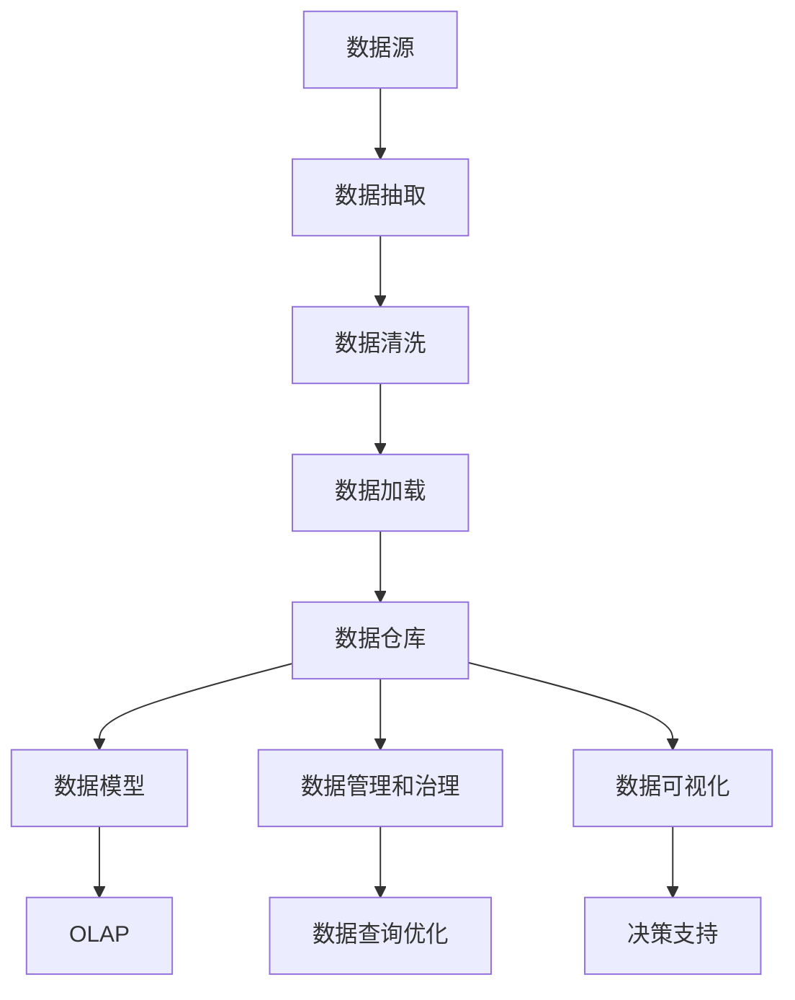

                 

# 【AI大数据计算原理与代码实例讲解】数据仓库

> 关键词：数据仓库, 大数据, 数据湖, 数据模型, 数据管理和治理, 数据仓库架构, 数据查询优化

## 1. 背景介绍

数据仓库（Data Warehouse）是大数据应用的核心组件之一，它不仅集中了海量的结构化和半结构化数据，还通过高效的数据管理和分析手段，支撑企业决策支持、运营优化等关键业务。近年来，随着互联网、物联网等技术的快速发展，数据生成量呈指数级增长，对数据仓库的存储和处理能力提出了更高的要求。

本文章将深入解析数据仓库的核心概念和技术原理，并通过实际代码实例，展示如何在大数据场景中构建高效的数据仓库，以及如何利用数据仓库进行高效的数据分析和查询优化。希望通过本文的学习，读者能够深入理解数据仓库的设计思想、实现原理以及应用场景，并掌握其实际的开发和应用方法。

## 2. 核心概念与联系

### 2.1 核心概念概述

数据仓库是一个专门用于数据存储和查询的设施，它通过从不同的数据源中集成数据，构建一个集中的、统一的数据视图。与传统的关系型数据库（RDBMS）不同，数据仓库能够处理大规模、复杂的数据集，同时具备良好的扩展性和灵活性。

以下是数据仓库的核心概念：

- **数据仓库（Data Warehouse）**：集中存储业务数据的仓库，用于支持数据分析和决策支持。
- **数据湖（Data Lake）**：一个不进行结构化处理的大规模数据存储库，用于存储任意类型的数据。
- **数据模型（Data Model）**：定义数据仓库中数据的逻辑结构，包括关系型数据模型、多维数据模型（OLAP）和数据流模型等。
- **数据管理和治理（Data Management and Governance）**：包括数据质量管理、数据安全和隐私保护、数据生命周期管理等。
- **数据仓库架构（Data Warehouse Architecture）**：数据仓库的总体设计框架，包括数据抽取、存储、处理、访问等环节。
- **数据查询优化（Data Query Optimization）**：通过对数据结构和查询算法进行优化，提升数据查询效率和响应速度。

### 2.2 核心概念原理和架构的 Mermaid 流程图



以上流程图展示了数据仓库的核心流程和架构，具体解释如下：

1. **数据源（Data Source）**：来自不同业务系统的数据，包括关系型数据、半结构化数据和无结构化数据。
2. **数据抽取（Data Extraction）**：从不同数据源中抽取数据，填充到数据仓库中。
3. **数据清洗（Data Cleaning）**：对抽取的数据进行去重、去噪、转换等预处理操作，确保数据质量。
4. **数据加载（Data Loading）**：将清洗后的数据加载到数据仓库中，构建数据模型。
5. **数据仓库（Data Warehouse）**：集中存储处理后的数据，支持多维数据模型和关系型数据模型。
6. **数据模型（Data Model）**：定义数据的逻辑结构，支持OLAP和OLTP等不同类型的数据处理。
7. **数据管理和治理（Data Management and Governance）**：确保数据的质量、安全、隐私等。
8. **数据查询优化（Data Query Optimization）**：通过优化查询算法和数据结构，提升查询效率。
9. **数据可视化（Data Visualization）**：将数据转化为图表、报表等可视化形式，支持决策支持。
10. **决策支持（Decision Support）**：利用数据仓库的数据分析和查询结果，辅助企业进行决策。

## 3. 核心算法原理 & 具体操作步骤

### 3.1 算法原理概述

数据仓库的核心算法主要围绕数据的抽取、存储、处理、查询等环节进行。其中，数据抽取和存储是数据仓库的基石，数据处理是提升数据质量的关键，而数据查询则是数据仓库应用的直接体现。

- **数据抽取（Data Extraction）**：从不同数据源中抽取数据，填充到数据仓库中。
- **数据存储（Data Storage）**：集中存储处理后的数据，支持高效的数据查询和分析。
- **数据处理（Data Processing）**：对抽取的数据进行清洗、转换、聚合等处理操作，提升数据质量。
- **数据查询（Data Query）**：利用数据模型和查询优化算法，快速获取数据查询结果，支持多维数据分析。

### 3.2 算法步骤详解

#### 3.2.1 数据抽取

数据抽取是数据仓库构建的第一步，其主要任务是从不同的数据源中抽取数据，并将其填充到数据仓库中。具体步骤如下：

1. **确定数据源**：根据业务需求，确定需要抽取的数据源，包括关系型数据库、NoSQL数据库、文件系统等。
2. **制定抽取策略**：根据数据源的特性，制定相应的数据抽取策略，包括全量抽取和增量抽取。
3. **数据抽取工具**：选择合适的数据抽取工具，如Apache NiFi、Talend等，实现数据的抽取和传输。
4. **数据清洗**：对抽取的数据进行去重、去噪、转换等预处理操作，确保数据质量。

#### 3.2.2 数据存储

数据存储是数据仓库的核心环节，其主要任务是集中存储处理后的数据，支持高效的数据查询和分析。具体步骤如下：

1. **选择合适的存储技术**：根据数据类型和业务需求，选择合适的存储技术，如关系型数据库、NoSQL数据库、数据湖等。
2. **数据加载**：将清洗后的数据加载到数据仓库中，构建数据模型。
3. **数据压缩和索引**：对存储的数据进行压缩和索引，提高数据存储和查询效率。

#### 3.2.3 数据处理

数据处理是提升数据质量的关键环节，其主要任务是对抽取的数据进行清洗、转换、聚合等处理操作，提升数据质量。具体步骤如下：

1. **数据清洗**：对抽取的数据进行去重、去噪、转换等预处理操作，确保数据质量。
2. **数据转换**：将不同格式的数据进行转换，统一为数据仓库中的标准格式。
3. **数据聚合**：对数据进行聚合操作，生成多维数据模型和OLAP数据模型，提升数据查询效率。

#### 3.2.4 数据查询

数据查询是数据仓库应用的直接体现，其主要任务是利用数据模型和查询优化算法，快速获取数据查询结果，支持多维数据分析。具体步骤如下：

1. **数据建模**：根据业务需求，设计合适的数据模型，包括关系型数据模型、多维数据模型（OLAP）和数据流模型等。
2. **查询优化**：通过优化查询算法和数据结构，提升数据查询效率和响应速度。
3. **查询执行**：利用查询优化后的查询语句，从数据仓库中获取数据查询结果，支持多维数据分析和决策支持。

### 3.3 算法优缺点

#### 3.3.1 数据抽取

- **优点**：
  - 支持从不同数据源中抽取数据，实现数据的集中存储。
  - 通过数据清洗和转换，提升数据质量。
- **缺点**：
  - 数据抽取过程复杂，需要处理多种数据源的特性。
  - 数据抽取工具的选择和配置较为复杂。

#### 3.3.2 数据存储

- **优点**：
  - 集中存储处理后的数据，支持高效的数据查询和分析。
  - 通过数据压缩和索引，提高数据存储和查询效率。
- **缺点**：
  - 数据存储技术的选择和配置较为复杂。
  - 数据存储和查询效率受数据模型设计的影响较大。

#### 3.3.3 数据处理

- **优点**：
  - 通过数据清洗、转换和聚合，提升数据质量。
  - 数据处理过程可与其他业务系统协同进行。
- **缺点**：
  - 数据处理过程复杂，需要处理多种数据源的特性。
  - 数据处理过程容易产生数据不一致问题。

#### 3.3.4 数据查询

- **优点**：
  - 利用数据模型和查询优化算法，快速获取数据查询结果，支持多维数据分析。
  - 数据查询过程支持实时数据处理和分析。
- **缺点**：
  - 数据查询过程受数据模型设计的影响较大。
  - 数据查询效率受数据模型和查询优化算法的影响较大。

### 3.4 算法应用领域

数据仓库的核心算法广泛应用于各种业务场景，包括但不限于以下几个方面：

- **企业决策支持**：通过数据分析和查询结果，支持企业决策和战略规划。
- **运营优化**：通过数据分析和查询结果，优化业务流程和资源配置。
- **客户关系管理**：通过数据分析和查询结果，提升客户满意度和忠诚度。
- **产品设计和研发**：通过数据分析和查询结果，指导产品设计和研发。
- **供应链管理**：通过数据分析和查询结果，优化供应链管理和运营。

## 4. 数学模型和公式 & 详细讲解 & 举例说明

### 4.1 数学模型构建

数据仓库的数学模型主要围绕数据的处理和查询进行，其核心是构建多维数据模型和关系型数据模型。这里以多维数据模型（OLAP）为例，进行详细讲解。

#### 4.1.1 多维数据模型

多维数据模型（OLAP）是数据仓库中常用的数据模型之一，其主要特点是将数据按照维度进行组织，支持多维数据分析和查询。假设有一个销售数据表，包含以下字段：

- `Region`：地区
- `Product`：产品
- `Date`：日期
- `Sales`：销售额

可以将这些字段按照以下维度进行组织：

- **维度（Dimension）**：
  - `Region`：地区
  - `Product`：产品
  - `Date`：日期
- **度量（Measure）**：
  - `Sales`：销售额

#### 4.1.2 关系型数据模型

关系型数据模型（OLTP）是数据仓库中常用的另一种数据模型，其主要特点是通过关系表存储数据，支持事务处理。假设有一个订单表，包含以下字段：

- `OrderID`：订单ID
- `CustomerID`：客户ID
- `OrderDate`：订单日期
- `OrderAmount`：订单金额

可以将这些字段按照以下维度进行组织：

- **主键（Primary Key）**：`OrderID`
- **外键（Foreign Key）**：`CustomerID`

### 4.2 公式推导过程

#### 4.2.1 多维数据模型

以销售数据为例，构建多维数据模型的关键在于理解维度和度量的概念，以及如何通过维度和度量进行多维数据分析。假设有一个销售数据表，包含以下字段：

- `Region`：地区
- `Product`：产品
- `Date`：日期
- `Sales`：销售额

可以将其转换为以下多维数据模型：

- **维度（Dimension）**：
  - `Region`：地区
  - `Product`：产品
  - `Date`：日期
- **度量（Measure）**：
  - `Sales`：销售额

### 4.3 案例分析与讲解

#### 4.3.1 销售数据分析

以销售数据分析为例，假设有一家公司的销售数据表，包含以下字段：

- `Region`：地区
- `Product`：产品
- `Date`：日期
- `Sales`：销售额

可以将其转换为以下多维数据模型：

- **维度（Dimension）**：
  - `Region`：地区
  - `Product`：产品
  - `Date`：日期
- **度量（Measure）**：
  - `Sales`：销售额

通过以上多维数据模型，可以进行以下多维数据分析：

1. **地区销售额分析**：
   - `Region`：地区
   - `Sales`：销售额
   - 结果：按地区统计销售额，分析不同地区的销售情况。
   
2. **产品销售额分析**：
   - `Product`：产品
   - `Sales`：销售额
   - 结果：按产品统计销售额，分析不同产品的销售情况。
   
3. **日期销售额分析**：
   - `Date`：日期
   - `Sales`：销售额
   - 结果：按日期统计销售额，分析不同日期的销售情况。

## 5. 项目实践：代码实例和详细解释说明

### 5.1 开发环境搭建

在进行数据仓库实践前，我们需要准备好开发环境。以下是使用Python进行Presto开发的环境配置流程：

1. 安装Presto：从官网下载并安装Presto，可以参考官方文档进行安装。
2. 创建数据仓库：在Presto中创建一个新的数据仓库，指定存储位置和访问权限。
3. 安装依赖包：安装必要的依赖包，如Kafka、Hadoop等，以满足数据仓库的存储和处理需求。
4. 配置数据源：配置各种数据源的连接信息和访问权限，包括关系型数据库、NoSQL数据库、文件系统等。
5. 设计数据模型：设计合适的数据模型，包括关系型数据模型和多维数据模型（OLAP）。

### 5.2 源代码详细实现

这里以Presto为例，展示如何构建一个简单的数据仓库，并进行数据查询和分析。

```python
# 导入Presto模块
from presto import connect, query

# 创建数据仓库连接
conn = connect('localhost', 8080, 'root', 'password')

# 创建数据仓库
conn.execute("CREATE WAREHOUSE 'sales' "
             "LOCATION '/path/to/storage' "
             "QUERY-THROTTLE '50mb' "
             "COMPRESSION 'gzip' "
             "QUERY-THROTTLE '500mb'")

# 设计数据模型
conn.execute("CREATE TABLE 'sales' "
             "('Region' STRING, "
             "'Product' STRING, "
             "'Date' STRING, "
             "'Sales' FLOAT)")

# 插入数据
conn.execute("INSERT INTO 'sales' "
             "VALUES "
             "('Region1', 'ProductA', '2021-01-01', 100.0), "
             "('Region2', 'ProductB', '2021-01-01', 200.0), "
             "('Region1', 'ProductA', '2021-01-02', 150.0), "
             "('Region2', 'ProductB', '2021-01-02', 250.0), "
             "('Region1', 'ProductA', '2021-01-03', 120.0), "
             "('Region2', 'ProductB', '2021-01-03', 300.0)")

# 进行数据查询
result = query(conn, "SELECT Region, SUM(Sales) as TotalSales FROM sales GROUP BY Region")

# 输出结果
for row in result:
    print(row)
```

以上是使用Presto构建一个简单的数据仓库，并进行数据查询和分析的完整代码实现。可以看到，Presto的API非常简单，易于使用。通过以上代码，读者可以轻松地构建数据仓库，并进行数据查询和分析。

### 5.3 代码解读与分析

让我们再详细解读一下关键代码的实现细节：

**数据仓库连接**：
- `connect()`函数用于创建Presto连接，包括主机地址、端口号、用户名和密码等。

**数据仓库创建**：
- `CREATE WAREHOUSE`语句用于创建数据仓库，包括仓库名称、存储位置、查询限制和压缩方式等。

**数据模型设计**：
- `CREATE TABLE`语句用于设计数据模型，包括表名称和字段类型等。

**数据插入**：
- `INSERT INTO`语句用于插入数据，包括数据字段的值。

**数据查询**：
- `SELECT`语句用于进行数据查询，包括查询字段和聚合函数等。

**结果输出**：
- 使用`for`循环遍历查询结果，输出每行的字段值。

**总结**：
- 通过以上代码，读者可以了解如何使用Presto构建数据仓库，并进行数据查询和分析。

## 6. 实际应用场景

### 6.1 企业决策支持

数据仓库在企业决策支持中发挥着重要作用。通过数据分析和查询结果，企业可以及时了解业务状况，制定合理的决策方案。例如，一家电商公司可以通过数据仓库分析不同地区的销售数据，优化库存和配送策略，提升客户满意度和销售额。

### 6.2 运营优化

数据仓库在运营优化中也有广泛应用。通过数据分析和查询结果，企业可以优化业务流程和资源配置，提升运营效率。例如，一家制造企业可以通过数据仓库分析生产线上的数据，优化生产计划和物料采购，降低成本和提升生产效率。

### 6.3 客户关系管理

数据仓库在客户关系管理中同样发挥着重要作用。通过数据分析和查询结果，企业可以提升客户满意度和忠诚度，增加客户留存率和客户转化率。例如，一家金融公司可以通过数据仓库分析客户的交易数据，提供个性化的金融产品和服务，提升客户满意度。

### 6.4 未来应用展望

随着技术的不断发展，数据仓库的应用将更加广泛和深入。未来，数据仓库将结合更多前沿技术，如大数据、人工智能、区块链等，提升数据处理和分析能力，为企业的数字化转型提供更加强大的支持。

## 7. 工具和资源推荐

### 7.1 学习资源推荐

为了帮助开发者系统掌握数据仓库的核心概念和技术原理，这里推荐一些优质的学习资源：

1. 《数据仓库设计与实践》：这是一本经典的书籍，涵盖了数据仓库的设计、实现和应用。书中详细介绍了数据仓库的核心概念和实际案例。
2. 《大数据技术与架构》：这是一门关于大数据技术和架构的课程，由知名数据科学家讲授，涵盖了大数据技术的应用和实践。
3. 《Presto官方文档》：Presto的官方文档详细介绍了Presto的架构和应用，是学习和使用Presto的重要参考。
4. 《Apache Hadoop官方文档》：Hadoop的官方文档详细介绍了Hadoop的架构和应用，是学习和使用Hadoop的重要参考。
5. 《Apache Kafka官方文档》：Kafka的官方文档详细介绍了Kafka的架构和应用，是学习和使用Kafka的重要参考。

通过这些资源的学习实践，相信读者可以深入理解数据仓库的设计思想、实现原理以及应用场景，并掌握其实际的开发和应用方法。

### 7.2 开发工具推荐

高效的数据仓库开发离不开优秀的工具支持。以下是几款用于数据仓库开发常用的工具：

1. Presto：基于内存的分布式SQL查询引擎，支持多种数据源和复杂查询。
2. Hadoop：开源的分布式数据处理平台，支持大规模数据存储和处理。
3. Kafka：开源的消息队列系统，支持数据流处理和分布式数据采集。
4. Spark：开源的大数据处理框架，支持分布式数据处理和计算。
5. Cassandra：开源的分布式数据库系统，支持大规模数据存储和查询。

合理利用这些工具，可以显著提升数据仓库开发和应用效率，加快创新迭代的步伐。

### 7.3 相关论文推荐

数据仓库的核心技术源于学界的持续研究。以下是几篇奠基性的相关论文，推荐阅读：

1. "A New Architecture for Data Warehousing"：提出了数据仓库的基本架构和设计思想，奠定了数据仓库技术的基础。
2. "Data Warehousing for Business Intelligence"：介绍了数据仓库在业务智能中的应用，强调了数据仓库的重要性和价值。
3. "The Data Warehouse Toolkit"：介绍了数据仓库的构建和管理方法，提供了详细的案例和实践指南。
4. "Towards a Holistic Understanding of Data Warehousing"：提出了数据仓库的综合理解模型，分析了数据仓库的各个组成部分。
5. "Big Data Analytics with Data Warehousing"：介绍了大数据和数据仓库的结合应用，强调了数据仓库在大数据场景中的重要性。

这些论文代表了大数据仓库技术的发展脉络。通过学习这些前沿成果，可以帮助研究者把握数据仓库的前进方向，激发更多的创新灵感。

## 8. 总结：未来发展趋势与挑战

### 8.1 研究成果总结

本文对数据仓库的核心概念和技术原理进行了全面系统的介绍，重点解析了数据抽取、数据存储、数据处理和数据查询等关键环节，并通过实际代码实例，展示了如何在大数据场景中构建高效的数据仓库，以及如何利用数据仓库进行高效的数据分析和查询优化。通过本文的学习，读者可以深入理解数据仓库的设计思想、实现原理以及应用场景，并掌握其实际的开发和应用方法。

### 8.2 未来发展趋势

展望未来，数据仓库技术将呈现以下几个发展趋势：

1. 数据湖与数据仓库结合：数据湖与数据仓库的结合，将支持更多类型的数据存储和处理，提升数据处理的灵活性和扩展性。
2. 实时数据处理：通过流计算和实时数据处理技术，支持数据的实时分析和查询，提升数据处理的效率和响应速度。
3. 人工智能与数据仓库结合：结合人工智能技术，提升数据分析和查询的准确性和智能化水平。
4. 区块链与数据仓库结合：结合区块链技术，提升数据的安全性和可信度，保障数据的隐私和安全。
5. 大数据与数据仓库结合：结合大数据技术，支持更大规模的数据存储和处理，提升数据处理的效率和能力。

以上趋势凸显了数据仓库技术的发展前景，将进一步推动数据仓库技术的创新和应用，为企业的数字化转型提供更加强大的支持。

### 8.3 面临的挑战

尽管数据仓库技术已经取得了瞩目成就，但在迈向更加智能化、普适化应用的过程中，它仍面临诸多挑战：

1. 数据存储和处理效率：随着数据量的快速增长，数据仓库的存储和处理效率亟需提升，以满足业务需求的快速变化。
2. 数据安全与隐私保护：数据仓库中的数据涉及隐私和敏感信息，如何保障数据安全与隐私保护，将是未来的重要挑战。
3. 数据质量和一致性：如何保证数据的准确性和一致性，是数据仓库技术需要解决的另一大挑战。
4. 数据处理复杂度：随着数据仓库规模的扩大，数据处理和管理的复杂度也在增加，需要更加先进的技术来支撑。
5. 技术更新与迭代：数据仓库技术的快速发展，要求开发者不断学习和更新知识，以保持技术的先进性和竞争力。

### 8.4 研究展望

面对数据仓库面临的这些挑战，未来的研究需要在以下几个方面寻求新的突破：

1. 优化数据存储和处理技术：通过流计算、分布式计算等技术，提升数据存储和处理的效率和能力。
2. 加强数据安全与隐私保护：结合区块链和加密技术，提升数据安全与隐私保护，保障数据的隐私和安全。
3. 提高数据质量和一致性：通过数据清洗、去重、去噪等技术，提升数据的准确性和一致性。
4. 优化数据处理复杂度：通过自动化和智能化的数据处理技术，提升数据处理的效率和管理能力。
5. 结合先进技术：结合大数据、人工智能、区块链等技术，提升数据仓库的智能化水平和应用范围。

这些研究方向的探索，将引领数据仓库技术迈向更高的台阶，为企业的数字化转型提供更加强大的支持。面向未来，数据仓库技术还需要与其他人工智能技术进行更深入的融合，如知识表示、因果推理、强化学习等，多路径协同发力，共同推动数据仓库技术的进步。只有勇于创新、敢于突破，才能不断拓展数据仓库技术的边界，让数据仓库更好地服务于企业的数字化转型。

## 9. 附录：常见问题与解答

**Q1：数据仓库和数据湖有什么区别？**

A: 数据仓库和数据湖是两种不同的数据存储和处理方式。数据仓库主要存储结构化数据，通过复杂的数据模型和查询工具，支持多维数据分析和决策支持。数据湖则主要存储非结构化数据，支持任意类型的数据存储和处理，但需要更多的数据治理和处理工作。

**Q2：如何选择适合的数据仓库技术？**

A: 选择适合的数据仓库技术需要考虑以下几个因素：
1. 数据类型：如果主要存储结构化数据，可以选择关系型数据库（如Hive、MySQL等）；如果主要存储非结构化数据，可以选择数据湖（如Hadoop、S3等）。
2. 数据量：如果数据量较小，可以选择小型数据仓库（如Presto、Spark等）；如果数据量较大，可以选择分布式数据仓库（如Hadoop、Hive等）。
3. 数据处理需求：如果需要进行复杂的数据分析和查询，可以选择支持复杂查询的数据仓库（如Presto、Spark等）；如果需要进行实时数据处理，可以选择支持流计算的数据仓库（如Apache Flink等）。

**Q3：如何提高数据仓库的查询效率？**

A: 提高数据仓库的查询效率需要从以下几个方面进行优化：
1. 数据模型设计：合理设计数据模型，减少数据冗余和重复查询。
2. 索引和分区：使用索引和分区技术，提升数据查询效率。
3. 查询优化：优化查询语句和查询计划，减少不必要的计算和I/O操作。
4. 缓存技术：使用缓存技术，减少重复查询和数据缓存，提升查询效率。

**Q4：如何进行数据质量管理？**

A: 数据质量管理是数据仓库的核心工作之一，主要包括以下几个方面：
1. 数据清洗：对数据进行去重、去噪、转换等预处理操作，提升数据质量。
2. 数据校验：通过数据校验规则，检查数据的一致性和完整性。
3. 数据治理：制定数据治理策略，确保数据的质量和安全。
4. 数据备份和恢复：进行数据备份和恢复操作，保障数据的完整性和可靠性。

通过以上问题与解答，读者可以更加全面地了解数据仓库的核心概念、技术原理和实际应用，并掌握其实际的开发和应用方法。希望本文对读者在数据仓库的开发和应用中有所帮助。

---

作者：禅与计算机程序设计艺术 / Zen and the Art of Computer Programming

