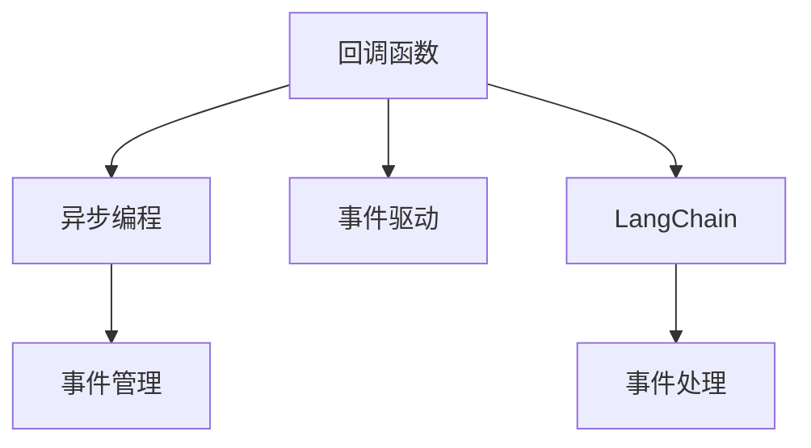
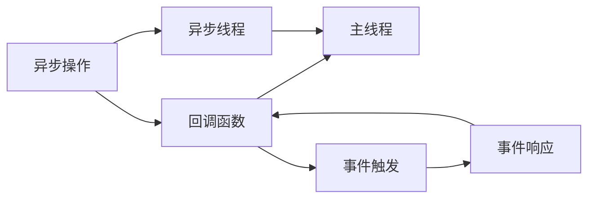

                 

# 【LangChain编程：从入门到实践】使用回调的两种方式

> 关键词：回调函数,事件驱动,异步编程,LangChain,事件管理

## 1. 背景介绍

在软件开发中，回调函数（Callback Function）是处理异步编程和事件驱动的重要机制。它允许函数在特定事件发生时执行，例如用户输入、网络响应、定时器到期等。回调函数机制在处理复杂任务和响应非阻塞操作时特别有效。

本文将深入探讨使用回调函数的两种方式，并结合实际案例，详细解释它们的工作原理和应用场景。

## 2. 核心概念与联系

### 2.1 核心概念概述

回调函数是一种函数，它作为参数传递给另一个函数，并在该函数执行完成后被调用。回调函数通常用于处理异步操作或事件响应，使程序能够在不阻塞主线程的情况下处理大量请求。

#### 核心概念关系图：



### 2.2 核心概念原理和架构的 Mermaid 流程图

以下是回调函数的基本工作流程：



回调函数机制可以简化代码结构，提高程序的可读性和可维护性。同时，它使得程序能够在异步事件发生时及时响应，确保系统的高效性和可靠性。

## 3. 核心算法原理 & 具体操作步骤

### 3.1 算法原理概述

回调函数的原理是利用事件驱动机制，通过将函数作为参数传递给另一个函数，在该函数执行完成后调用传递的函数，以处理异步操作或事件响应。回调函数机制广泛应用于异步编程和事件驱动系统中。

### 3.2 算法步骤详解

1. **定义回调函数**：首先，定义一个回调函数，它将在特定事件发生时被调用。

   ```python
   def callback_function():
       # 处理回调逻辑
       print("Callback executed!")
   ```

2. **传递回调函数**：将回调函数作为参数传递给另一个函数，通常称为回调函数或事件处理器。

   ```python
   def process_async_operation(callback):
       # 异步操作处理逻辑
       print("Async operation started!")
       # 模拟异步操作完成
       callback()
       print("Async operation completed!")
       
   # 传递回调函数
   process_async_operation(callback_function)
   ```

3. **处理异步操作**：异步操作可以在单独的线程或进程中执行，确保不会阻塞主线程。

   ```python
   import threading
   
   def process_async_operation(callback):
       # 异步操作处理逻辑
       print("Async operation started!")
       # 模拟异步操作完成
       callback()
       print("Async operation completed!")
   
   # 在单独线程中执行异步操作
   async_thread = threading.Thread(target=process_async_operation, args=(callback_function,))
   async_thread.start()
   async_thread.join()
   ```

4. **响应回调**：在异步操作完成后，调用回调函数处理结果或事件。

   ```python
   def process_async_operation(callback):
       # 异步操作处理逻辑
       print("Async operation started!")
       # 模拟异步操作完成
       callback()
       print("Async operation completed!")
   
   # 在单独线程中执行异步操作
   async_thread = threading.Thread(target=process_async_operation, args=(callback_function,))
   async_thread.start()
   async_thread.join()
   ```

### 3.3 算法优缺点

#### 优点：

1. **简化代码结构**：使用回调函数可以简化异步编程和事件驱动的代码结构，使程序逻辑更加清晰。
2. **提高程序可读性**：回调函数机制使得程序更加易于理解和维护，降低了代码的复杂度。
3. **增强系统可靠性**：通过回调函数机制，程序能够在异步操作完成后及时响应，提高了系统的可靠性和响应速度。

#### 缺点：

1. **增加代码复杂性**：回调函数机制可能会增加代码的复杂性，特别是在处理复杂事件和异步操作时。
2. **依赖回调函数顺序**：回调函数的执行顺序可能影响程序的行为，需要仔细设计和测试。
3. **可能出现回调地狱（Callback Hell）**：过度使用回调函数可能导致代码结构混乱，难以维护。

### 3.4 算法应用领域

回调函数广泛应用于各种开发领域，包括但不限于：

- **异步编程**：在处理网络请求、数据库操作等异步操作时，使用回调函数确保程序在异步操作完成时及时响应。
- **事件驱动编程**：在处理用户输入、系统通知等事件时，使用回调函数确保程序在事件发生时及时响应。
- **图形用户界面（GUI）**：在处理用户交互事件时，使用回调函数确保GUI界面及时响应用户操作。

## 4. 数学模型和公式 & 详细讲解 & 举例说明

### 4.1 数学模型构建

回调函数的基本数学模型可以表示为：

$$
\text{callback\_function}(\text{event})
$$

其中，`event`表示异步操作或事件，`callback\_function`是回调函数。

### 4.2 公式推导过程

在异步编程中，回调函数的基本推导过程如下：

1. **定义回调函数**：
   $$
   \text{callback\_function}(\text{event})
   $$

2. **传递回调函数**：
   $$
   \text{process\_async\_operation}(\text{callback\_function})
   $$

3. **处理异步操作**：
   $$
   \text{process\_async\_operation}(\text{event})
   $$

4. **响应回调**：
   $$
   \text{callback\_function}(\text{event})
   $$

### 4.3 案例分析与讲解

假设有一个简单的异步操作，需要从服务器获取数据：

```python
import requests

def fetch_data(url, callback):
    response = requests.get(url)
    callback(response)

def main():
    # 定义回调函数
    def callback(response):
        print("Data fetched successfully!")
        print("Response:", response)
    
    # 传递回调函数
    fetch_data("https://example.com", callback)
    # 异步操作
    print("Fetching data...")
    # 响应回调
    print("Data fetching completed.")

if __name__ == "__main__":
    main()
```

在上述代码中，`fetch_data`函数接收一个URL和一个回调函数，并在获取数据后调用回调函数处理结果。`main`函数定义了一个回调函数，并将其传递给`fetch_data`函数，启动异步操作。在异步操作完成后，回调函数被调用，输出数据获取成功的消息和响应内容。

## 5. 项目实践：代码实例和详细解释说明

### 5.1 开发环境搭建

在开始项目实践之前，需要搭建好开发环境。以下是在Python中使用回调函数的示例环境搭建步骤：

1. 安装Python：下载并安装Python，确保版本在3.6以上。
2. 安装Pip：在命令行中运行`python -m pip install pip`，安装pip工具。
3. 安装第三方库：使用pip安装requests、threading等第三方库。

```bash
pip install requests
pip install threading
```

### 5.2 源代码详细实现

以下是一个使用回调函数处理异步操作的示例代码：

```python
import requests
import threading

def fetch_data(url, callback):
    response = requests.get(url)
    callback(response)

def main():
    # 定义回调函数
    def callback(response):
        print("Data fetched successfully!")
        print("Response:", response)

    # 传递回调函数
    fetch_data("https://example.com", callback)
    # 异步操作
    print("Fetching data...")
    # 响应回调
    print("Data fetching completed.")

if __name__ == "__main__":
    main()
```

### 5.3 代码解读与分析

- **`fetch_data`函数**：定义了异步获取数据的函数，接收一个URL和一个回调函数。在获取数据后，调用回调函数处理结果。
- **`main`函数**：定义了一个回调函数，并将其传递给`fetch_data`函数，启动异步操作。在异步操作完成后，回调函数被调用，输出数据获取成功的消息和响应内容。
- **`callback`函数**：定义了一个回调函数，用于处理异步操作的结果。

## 6. 实际应用场景

### 6.1 异步网络请求

在处理网络请求时，使用回调函数可以确保程序在请求完成后及时响应。例如，在处理多个并发网络请求时，使用回调函数可以避免阻塞主线程，提高程序的响应速度。

### 6.2 图形用户界面

在处理图形用户界面（GUI）事件时，使用回调函数可以确保GUI界面在用户操作时及时响应。例如，在处理用户点击按钮时，使用回调函数可以确保GUI界面快速响应用户操作。

### 6.3 事件驱动编程

在处理系统事件时，使用回调函数可以确保程序在事件发生时及时响应。例如，在处理定时器事件时，使用回调函数可以确保程序在定时器到期时及时执行。

## 7. 工具和资源推荐

### 7.1 学习资源推荐

为了深入理解回调函数的使用方法，以下是一些优质的学习资源：

1. Python官方文档：详细介绍了Python中的回调函数机制，适合初学者入门。
2. Python Cookbook：提供了丰富的回调函数示例和最佳实践，适合进阶学习。
3. Python异步编程指南：介绍了Python中的异步编程和回调函数机制，适合对异步编程感兴趣的学习者。
4. PyCon大会论文：包含大量有关回调函数的优秀论文，适合深入研究和实践。

### 7.2 开发工具推荐

为了更高效地使用回调函数，以下是一些常用的开发工具：

1. Visual Studio Code：支持Python开发，提供丰富的插件和扩展，适合使用回调函数进行开发。
2. PyCharm：支持Python开发，提供强大的代码分析工具和调试功能，适合使用回调函数进行开发。
3. PyDev：支持Python开发，提供丰富的IDE功能，适合使用回调函数进行开发。

### 7.3 相关论文推荐

以下是一些有关回调函数的经典论文，推荐阅读：

1. "Callback-based Asynchronous Programming in Python"（Python中的回调函数异步编程）：详细介绍了Python中的回调函数机制和应用场景。
2. "Event-driven and callback-based programming in Python"（Python中的事件驱动和回调函数编程）：介绍了Python中的事件驱动和回调函数编程技术，适合对异步编程感兴趣的学习者。
3. "Python Callbacks: An Introduction"（Python回调函数入门）：适合初学者入门，介绍了Python中的回调函数机制和基本用法。

## 8. 总结：未来发展趋势与挑战

### 8.1 研究成果总结

回调函数是处理异步编程和事件驱动的重要机制，广泛应用于各种开发领域。通过深入理解和灵活运用回调函数，可以简化代码结构，提高程序可读性和可靠性。

### 8.2 未来发展趋势

1. **回调函数与框架集成**：未来，回调函数将更多地集成到现代编程框架中，提高编程效率和代码可维护性。
2. **异步编程和事件驱动的发展**：异步编程和事件驱动将继续发展，带来更多的编程模型和工具，提高程序性能和可靠性。
3. **回调函数与并发编程的结合**：回调函数将更多地应用于并发编程中，提高程序的并发能力和响应速度。

### 8.3 面临的挑战

1. **回调函数的可维护性**：过度使用回调函数可能导致代码结构混乱，难以维护。需要合理设计和组织回调函数，确保代码的可读性和可维护性。
2. **回调函数的可靠性**：回调函数机制可能会增加程序复杂性，需要在设计和实现时确保其可靠性。
3. **回调函数与并发编程的协同**：回调函数与并发编程的协同使用需要仔细设计和测试，避免出现并发竞争和死锁等问题。

### 8.4 研究展望

未来，回调函数将继续在异步编程和事件驱动中发挥重要作用。研究如何更好地集成回调函数到现代编程框架中，提高编程效率和代码可维护性，将是重要的研究方向。同时，探索回调函数与其他编程模型的协同使用，也将带来更多的编程范式和创新。

## 9. 附录：常见问题与解答

**Q1：回调函数和事件驱动的区别是什么？**

A: 回调函数和事件驱动都是处理异步编程的重要机制。回调函数是在异步操作完成后执行的函数，而事件驱动则是通过事件触发机制，在特定事件发生时执行函数。

**Q2：如何避免回调地狱（Callback Hell）？**

A: 回调地狱（Callback Hell）是指在多层嵌套的回调函数中，代码结构混乱，难以维护。避免回调地狱的常见做法包括：
1. 使用异步编程框架（如asyncio）进行编程。
2. 使用生成器函数（Generator Function）进行编程。
3. 使用上下文管理器（Context Manager）进行编程。

**Q3：如何在Python中使用生成器函数进行异步编程？**

A: 在Python中，可以使用生成器函数（Generator Function）进行异步编程，避免回调地狱。例如：

```python
def async_operation():
    # 异步操作
    yield None
    # 异步操作完成后，执行回调函数
    print("Async operation completed!")

# 使用生成器函数进行异步编程
for result in async_operation():
    pass
```

**Q4：如何设计和使用回调函数？**

A: 设计和使用回调函数需要遵循以下步骤：
1. 定义回调函数。
2. 传递回调函数。
3. 处理异步操作。
4. 响应回调。

## 作者：禅与计算机程序设计艺术 / Zen and the Art of Computer Programming

