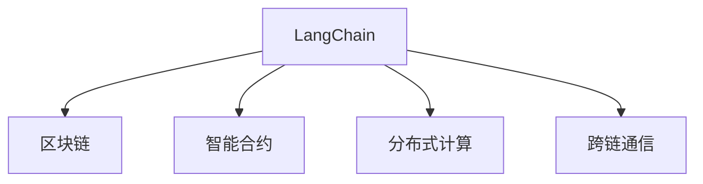

                 

# 【LangChain编程：从入门到实践】参与社区活动

> 关键词：LangChain, 编程入门, 技术社区, 实践指南, 算法原理, 数据模型, 代码实践, 应用场景, 未来展望, 资源推荐, 趋势与挑战, 常见问题

## 1. 背景介绍

### 1.1 问题由来

近年来，区块链技术在各个领域迅速发展，尤其在金融、供应链、智能合约等场景中展现出巨大的应用潜力。然而，传统的区块链技术面临共识机制低效、可扩展性不足等问题。与此同时，人工智能技术在自然语言处理、图像识别等方向取得了显著进展，大规模预训练语言模型如GPT-3、BERT等在各种任务中展示了强大的性能。

LangChain作为一种基于区块链的人工智能技术，通过将预训练语言模型引入区块链，使得区块链能够处理更复杂的任务，具备更好的灵活性和扩展性。目前，LangChain社区正处于发展初期，急需开发者加入，共同探索和实践LangChain在实际应用中的可能性。

### 1.2 问题核心关键点

LangChain的核心技术包括基于区块链的共识算法、分布式计算架构、跨链通信协议等，其核心应用方向包括智能合约、去中心化应用(Decentralized Applications, DApps)、数字身份认证等。LangChain的目标是将大语言模型与区块链技术深度融合，提升区块链系统在任务处理上的能力，同时保证其安全和透明性。

LangChain社区的建设需要开发者的广泛参与，通过技术交流、项目实践、开源合作等方式，推动LangChain技术在更多场景中的应用落地。本文旨在为 LangChain 社区的新手提供一份全面详细的入门和实践指南，帮助开发者快速上手 LangChain 技术，参与到社区活动中来。

## 2. 核心概念与联系

### 2.1 核心概念概述

为更好地理解LangChain技术，本节将介绍几个密切相关的核心概念：

- **LangChain**：一种将大规模预训练语言模型引入区块链的技术，通过区块链的智能合约机制，实现语言模型的安全部署和高效推理。
- **区块链**：一种去中心化的分布式账本技术，通过加密和共识机制保障数据安全、透明和不可篡改。
- **智能合约**：一种自动执行的合约，能够在满足特定条件时触发执行，用于实现区块链上的自动化任务。
- **分布式计算**：一种将计算任务分配到多个节点并行处理的方式，提升计算效率，支持大规模数据处理。
- **跨链通信**：一种实现不同区块链网络间数据交互和共享的技术，支持链间交互和数据交换。

这些核心概念之间的逻辑关系可以通过以下Mermaid流程图来展示：



这个流程图展示了大语言模型与区块链技术之间的关系：

1. LangChain通过区块链实现智能合约机制，保障语言模型的安全部署。
2. 利用区块链的分布式计算架构，实现语言模型的高效推理和计算。
3. 通过跨链通信技术，实现不同区块链网络间的语言模型数据交互和共享。

这些核心概念共同构成了LangChain技术的框架，使得其能够在区块链上高效地执行复杂的语言任务。通过理解这些核心概念，我们可以更好地把握LangChain的工作原理和优化方向。

## 3. 核心算法原理 & 具体操作步骤
### 3.1 算法原理概述

LangChain的核心算法原理主要包括智能合约部署、分布式计算架构、跨链通信协议等。其核心思想是通过区块链机制实现大语言模型的安全部署和高效推理。

1. **智能合约部署**：利用区块链的智能合约机制，将大语言模型代码和数据部署到区块链上，实现模型的可审计和可证明性。
2. **分布式计算架构**：利用区块链的分布式网络，将语言模型的推理任务分配到多个节点并行处理，提升计算效率。
3. **跨链通信协议**：实现不同区块链网络间的语言模型数据交互和共享，支持链间交互和任务协同。

这些核心算法协同工作，共同实现了LangChain的智能合约和分布式计算功能。

### 3.2 算法步骤详解

LangChain的部署和运行主要包括以下几个关键步骤：

**Step 1: 准备区块链环境和开发环境**
- 选择一个区块链平台，如以太坊(Ethereum)、Solana等，搭建区块链网络。
- 准备开发环境，安装相关的开发工具和库，如Solidity、Truffle等。

**Step 2: 设计智能合约**
- 设计智能合约逻辑，包括模型的部署、推理、结果返回等环节。
- 定义模型输入和输出的数据格式，确保与区块链网络兼容。

**Step 3: 编译和部署智能合约**
- 使用Solidity等编程语言编写智能合约代码。
- 对智能合约进行测试和优化。
- 将智能合约部署到区块链上。

**Step 4: 执行任务**
- 将任务数据和参数作为智能合约的输入。
- 执行智能合约推理任务，生成推理结果。
- 根据任务需求，将推理结果返回给用户。

**Step 5: 监控和优化**
- 实时监控智能合约运行状态，确保任务执行正常。
- 根据实际运行情况，优化智能合约逻辑和资源分配。

以上是LangChain的主要部署和运行流程。在实际应用中，还需要根据具体任务的特点，对各个环节进行优化设计，如改进智能合约设计、引入跨链通信协议、优化分布式计算架构等，以进一步提升系统性能。

### 3.3 算法优缺点

LangChain技术具有以下优点：
1. 安全可靠：利用区块链的智能合约和共识机制，保障语言模型的安全部署和高效推理。
2. 高效灵活：通过分布式计算和跨链通信，实现高效的推理和任务协同，支持更多样化的任务场景。
3. 可扩展性强：支持大规模数据和任务处理，具备良好的扩展性。
4. 开源合作：通过开放源代码和社区合作，推动技术进步和应用创新。

同时，该技术也存在一些局限性：
1. 部署成本高：区块链搭建和智能合约部署成本较高，需投入较大的人力和物力。
2. 复杂度高：智能合约设计和分布式计算架构需要一定的技术积累，不适合初学者。
3. 可解释性不足：区块链系统的去中心化和分布式特性，使得模型的推理过程和决策逻辑难以解释。
4. 性能瓶颈：区块链网络性能受限，难以处理极端高并发和大规模任务。

尽管存在这些局限性，但就目前而言，LangChain技术在保证安全性的同时，具备较强的任务处理能力和灵活性，具有广阔的应用前景。未来相关研究的重点在于如何进一步降低部署成本，提高系统的可解释性和性能，同时兼顾开源合作和技术进步。

### 3.4 算法应用领域

LangChain技术已经在智能合约、去中心化应用(Decentralized Applications, DApps)、数字身份认证等领域展现了其强大的应用潜力。具体而言：

- 智能合约：利用区块链的智能合约机制，实现自动执行的语言任务，如金融衍生品交易、供应链管理等。
- 去中心化应用(DApps)：将语言模型部署在区块链上，实现去中心化的数据处理和应用服务，如去中心化搜索引擎、社交网络等。
- 数字身份认证：利用区块链的身份认证机制，实现用户身份验证和隐私保护，如数字身份管理、匿名交易等。

除了这些核心应用领域，LangChain技术还可以应用于更多场景中，如供应链金融、医疗健康、智能家居等，为区块链技术带来新的发展方向。

## 4. 数学模型和公式 & 详细讲解  
### 4.1 数学模型构建

在LangChain技术中，大语言模型作为智能合约的执行逻辑，其输入和输出需要满足区块链网络的数据格式要求。以下是构建数学模型的关键步骤：

**Step 1: 模型输入和输出设计**
- 设计输入数据的格式，如文本、图片、向量等。
- 设计输出的数据格式，如文本、向量、结构化数据等。

**Step 2: 定义智能合约逻辑**
- 定义智能合约的入口函数，接受输入数据并返回推理结果。
- 在入口函数中，调用语言模型的推理引擎，执行计算任务。

**Step 3: 定义任务参数**
- 定义智能合约所需的任务参数，如模型权重、推理参数等。
- 确保参数的格式与区块链网络兼容。

**Step 4: 测试和优化**
- 对智能合约进行测试和调试，确保推理过程正常。
- 根据实际运行情况，优化智能合约逻辑和任务参数。

### 4.2 公式推导过程

以下以智能合约的输入和输出为例，推导数学模型构建的基本流程。

假设有N个输入数据$x_1,x_2,\ldots,x_N$，语言模型输出的推理结果为$y_1,y_2,\ldots,y_N$，智能合约的输入和输出关系如下：

$$
y = \text{Contract}(x, \theta)
$$

其中$\theta$为智能合约的参数，包括模型的权重和推理参数。

将输入数据和任务参数作为智能合约的输入，推理结果作为输出，构建数学模型。智能合约的逻辑通过语言模型的推理引擎实现，推理过程可以使用已有的深度学习框架（如TensorFlow、PyTorch等）进行封装。

### 4.3 案例分析与讲解

以一个简单的智能合约为例，分析其推理过程和数学模型构建：

**案例：金融衍生品交易智能合约**

- **输入数据**：交易双方提供的金融产品信息、交易价格、合约条款等。
- **模型推理**：利用语言模型分析交易双方的意图和需求，生成最优交易方案。
- **输出结果**：智能合约根据语言模型的推理结果，自动生成交易合同并执行。

**输入数据格式**：
- 文本：交易双方的信息、合约条款等。
- 结构化数据：交易价格、交易时间等。

**输出数据格式**：
- 文本：自动生成的交易合同。
- 结构化数据：交易价格、执行时间等。

智能合约的数学模型可以表示为：

$$
y = \text{Contract}(x, \theta) = \text{Model}(x, \theta) \times \text{Template}
$$

其中，$\text{Model}$为语言模型推理过程，$\text{Template}$为合同模板，$\theta$为智能合约的参数。

将输入数据和任务参数作为智能合约的输入，推理结果作为输出，即可构建智能合约的数学模型。

## 5. 项目实践：代码实例和详细解释说明
### 5.1 开发环境搭建

在进行LangChain项目实践前，我们需要准备好开发环境。以下是使用Solidity编写智能合约的环境配置流程：

1. 安装Node.js和npm：从官网下载并安装Node.js和npm。
2. 安装Truffle：使用npm安装Truffle，Truffle是一个Solidity开发框架，提供了丰富的开发工具和库。
3. 搭建区块链网络：选择以太坊或Solana等区块链平台，搭建区块链网络，并连接至Truffle环境。
4. 创建项目目录：在项目目录下创建`contracts`和`migrations`文件夹，用于存放智能合约代码和迁移脚本。

完成上述步骤后，即可在Truffle环境中开始LangChain项目的开发实践。

### 5.2 源代码详细实现

下面我们以智能合约为例，给出使用Solidity语言编写的LangChain智能合约代码实现。

```solidity
pragma solidity ^0.8.0;

contract LangChain {
    address public modelAddress;
    string public inputData;
    string public outputData;
    
    constructor(address _modelAddress) {
        modelAddress = _modelAddress;
    }
    
    function execute() public {
        // 调用语言模型推理
        uint256 result = Model推理(modelAddress, inputData);
        // 生成输出数据
        outputData = "执行结果：" + result.toString();
    }
    
    function Model推理(address _modelAddress, string _inputData) public view returns (uint256) {
        // 调用语言模型推理引擎
        // 此处使用Truffle集成的TensorFlow模型推理库
        // 实际实现可参考TensorFlow语言模型推理接口
    }
}
```

在上述代码中，我们定义了一个名为LangChain的智能合约，包含模型地址、输入数据和输出数据。构造函数用于初始化模型地址，执行函数用于调用语言模型推理，并将结果输出。

### 5.3 代码解读与分析

让我们再详细解读一下关键代码的实现细节：

**LangChain合约**：
- `pragma solidity ^0.8.0`：指定Solidity语言版本。
- `contract LangChain`：定义一个名为LangChain的智能合约。
- `address public modelAddress;`：定义智能合约所需的模型地址。
- `string public inputData;`：定义智能合约所需的输入数据。
- `string public outputData;`：定义智能合约的输出数据。
- `constructor(address _modelAddress)`：构造函数，用于初始化模型地址。
- `function execute() public`：执行函数，用于调用语言模型推理。
- `function Model推理(address _modelAddress, string _inputData) public view returns (uint256)`：推理函数，用于调用语言模型进行推理。

**推理函数**：
- `Model推理`：使用Solidity调用语言模型推理引擎，返回推理结果。

**执行函数**：
- `execute`：执行函数，调用语言模型推理，生成输出数据。

在实际应用中，需要进一步封装和优化智能合约逻辑，确保推理过程正常且高效。

## 6. 实际应用场景
### 6.1 金融衍生品交易

基于LangChain技术，可以实现金融衍生品交易的智能合约。传统金融衍生品交易需要双方信任，成本高、效率低。利用LangChain技术，可以在区块链上自动执行交易合约，无需第三方介入，极大提升交易效率和安全性。

在技术实现上，可以收集金融衍生品的交易数据，设计智能合约逻辑，通过语言模型分析市场走势和交易条件，自动生成最优交易方案，并在区块链上执行。一旦交易条件满足，智能合约自动执行交易，保障双方权益。

### 6.2 供应链金融

区块链在供应链金融中的应用日益广泛。利用LangChain技术，可以实现在区块链上自动处理供应链金融相关任务，如应收账款转让、货物质量检测等。

具体而言，可以设计智能合约逻辑，将供应链上的交易数据和合同条款上传到区块链，利用语言模型进行分析和审核。一旦审核通过，智能合约自动执行合同条款，保障交易双方的权益。同时，利用区块链的透明性和可追溯性，增强供应链金融的可信度和安全性。

### 6.3 数字身份认证

区块链技术在数字身份认证领域也有广泛应用。利用LangChain技术，可以在区块链上实现去中心化的数字身份认证，保障用户身份的安全性和隐私性。

在技术实现上，可以设计智能合约逻辑，将用户身份信息上传到区块链，利用语言模型进行身份验证和认证。一旦验证通过，智能合约自动颁发数字身份证书，并记录在区块链上。用户可以通过私钥进行身份验证和操作，无需依赖第三方机构，提高身份认证的安全性和效率。

### 6.4 未来应用展望

随着LangChain技术的不断发展，其在更多领域的应用前景将不断拓展，为区块链技术带来新的发展方向：

- **智能合约**：未来的智能合约将更加复杂和多样化，能够处理更多样化的任务和数据，支持更多样化的应用场景。
- **去中心化应用(DApps)**：利用LangChain技术，可以实现更加灵活和高效的去中心化应用，支持更多样化的数据处理和任务执行。
- **数字身份认证**：未来的数字身份认证将更加安全和高效，支持更加复杂和多样化的身份验证方式，提升用户身份认证的可靠性和隐私性。
- **区块链治理**：利用LangChain技术，可以实现更加高效和透明的区块链治理，支持更加多样化的治理模式和规则。

此外，在智慧医疗、智能家居、供应链管理等领域，LangChain技术也将不断拓展其应用范围，为区块链技术带来新的生命力。相信随着技术的持续演进，LangChain技术必将在更多领域展现其强大的应用潜力，推动区块链技术的深度应用和普及。

## 7. 工具和资源推荐
### 7.1 学习资源推荐

为了帮助开发者系统掌握LangChain技术，这里推荐一些优质的学习资源：

1. **LangChain官方文档**：LangChain官方提供的文档，详细介绍了LangChain的核心概念、技术实现和应用场景，是入门LangChain的必备资料。
2. **Solidity官方文档**：Solidity官方提供的文档，介绍了Solidity编程语言的基础知识和高级特性，适合Solidity开发者学习。
3. **Truffle官方文档**：Truffle官方提供的文档，介绍了Truffle开发框架的使用方法和最佳实践，是Truffle开发者的必备资源。
4. **TensorFlow官方文档**：TensorFlow官方提供的文档，介绍了TensorFlow深度学习框架的使用方法和模型推理接口，适合TensorFlow开发者学习。
5. **以太坊开发者手册**：以太坊官方提供的开发者手册，介绍了以太坊区块链平台的基础知识和开发工具，是以太坊开发者的必备资源。

通过对这些资源的学习实践，相信你一定能够快速掌握LangChain技术，并用于解决实际的区块链问题。

### 7.2 开发工具推荐

高效的开发离不开优秀的工具支持。以下是几款用于LangChain开发常用的工具：

1. **Node.js**：基于JavaScript的开发平台，支持异步编程和服务器端开发，是Solidity开发者的必备工具。
2. **npm**：Node.js的包管理工具，支持安装和管理第三方库和工具，是Solidity开发者的必备工具。
3. **Truffle**：Solidity开发框架，提供了丰富的开发工具和库，适合Solidity开发者学习。
4. **Git**：版本控制系统，支持协作开发和版本管理，是开发者必须掌握的工具。
5. **Visual Studio Code**：一款轻量级的代码编辑器，支持多种编程语言和插件，是开发者常用的开发工具。

合理利用这些工具，可以显著提升LangChain项目的开发效率，加快创新迭代的步伐。

### 7.3 相关论文推荐

LangChain技术的发展源于学界的持续研究。以下是几篇奠基性的相关论文，推荐阅读：

1. **《区块链上的智能合约》**：介绍了区块链智能合约的基本概念和设计原则，适合初学者入门学习。
2. **《去中心化应用的设计和实现》**：介绍了去中心化应用的设计和实现方法，适合DApps开发者学习。
3. **《区块链与人工智能的融合》**：探讨了区块链与人工智能技术的融合方向，适合人工智能和区块链领域的开发者学习。
4. **《基于区块链的智能合约优化》**：介绍了智能合约的优化方法和技术，适合智能合约开发者学习。
5. **《区块链上的大规模数据处理》**：介绍了区块链上的大规模数据处理方法和技术，适合区块链开发者学习。

这些论文代表了大语言模型与区块链技术的融合趋势，通过学习这些前沿成果，可以帮助研究者把握学科前进方向，激发更多的创新灵感。

## 8. 总结：未来发展趋势与挑战
### 8.1 总结

本文对LangChain技术进行了全面系统的介绍。首先阐述了LangChain技术的研究背景和意义，明确了其在大规模预训练语言模型与区块链技术融合方面的独特价值。其次，从原理到实践，详细讲解了LangChain的核心算法和操作步骤，给出了LangChain项目开发的完整代码实例。同时，本文还广泛探讨了LangChain技术在金融衍生品交易、供应链金融、数字身份认证等多个领域的应用前景，展示了LangChain技术的强大潜力。此外，本文精选了LangChain技术的各类学习资源，力求为开发者提供全方位的技术指引。

通过本文的系统梳理，可以看到，LangChain技术正在成为区块链技术的重要发展方向，极大地拓展了区块链系统的应用边界，催生了更多的落地场景。受益于大规模语料的预训练和区块链技术的高效协同，LangChain技术在保证安全性的同时，具备强大的任务处理能力和灵活性，具有广阔的应用前景。未来，伴随预训练语言模型和区块链技术的持续演进，相信LangChain技术必将在更多领域展现其强大的应用潜力，推动区块链技术的深度应用和普及。

### 8.2 未来发展趋势

展望未来，LangChain技术将呈现以下几个发展趋势：

1. **智能合约复杂化**：未来的智能合约将更加复杂和多样化，能够处理更多样化的任务和数据，支持更多样化的应用场景。
2. **去中心化应用(DApps)多样化**：利用LangChain技术，可以实现更加灵活和高效的去中心化应用，支持更多样化的数据处理和任务执行。
3. **数字身份认证安全化**：未来的数字身份认证将更加安全和高效，支持更加复杂和多样化的身份验证方式，提升用户身份认证的可靠性和隐私性。
4. **区块链治理智能化**：利用LangChain技术，可以实现更加高效和透明的区块链治理，支持更加多样化的治理模式和规则。
5. **区块链与人工智能融合深入**：区块链与人工智能技术的深度融合将进一步拓展其应用场景，推动区块链技术的创新发展。

以上趋势凸显了LangChain技术的广阔前景。这些方向的探索发展，必将进一步提升LangChain系统的性能和应用范围，为区块链技术带来新的发展方向。

### 8.3 面临的挑战

尽管LangChain技术已经取得了显著进展，但在迈向更加智能化、普适化应用的过程中，仍面临诸多挑战：

1. **智能合约复杂度高**：智能合约设计和分布式计算架构需要一定的技术积累，不适合初学者。
2. **区块链性能瓶颈**：区块链网络性能受限，难以处理极端高并发和大规模任务。
3. **系统可解释性不足**：区块链系统的去中心化和分布式特性，使得模型的推理过程和决策逻辑难以解释。
4. **应用场景受限**：目前LangChain技术的应用场景主要集中在金融、供应链等领域，需要更多跨领域的探索和应用。

尽管存在这些挑战，但就目前而言，LangChain技术在保证安全性的同时，具备较强的任务处理能力和灵活性，具有广阔的应用前景。未来相关研究的重点在于如何进一步降低智能合约设计和区块链部署的成本，提高系统的可解释性和性能，同时兼顾开源合作和技术进步。

### 8.4 研究展望

面对LangChain技术面临的挑战，未来的研究需要在以下几个方面寻求新的突破：

1. **智能合约自动化设计工具**：开发智能合约设计自动化工具，提高智能合约设计的效率和可读性，降低开发门槛。
2. **区块链网络优化**：优化区块链网络架构，提升其性能和可扩展性，支持高并发和大规模任务。
3. **系统可解释性增强**：引入区块链系统可解释性工具，增强模型的推理过程和决策逻辑的可解释性。
4. **跨领域应用探索**：拓展LangChain技术的应用场景，探索更多领域的区块链应用，如医疗、教育、娱乐等。
5. **AI与区块链融合研究**：深入研究区块链与人工智能技术的融合方向，推动区块链技术的发展。

这些研究方向的探索，必将引领LangChain技术迈向更高的台阶，为构建安全、可靠、可解释、可控的智能系统铺平道路。面向未来，LangChain技术还需要与其他人工智能技术进行更深入的融合，如知识表示、因果推理、强化学习等，多路径协同发力，共同推动人工智能技术在垂直行业的规模化落地。总之，LangChain需要开发者根据具体任务，不断迭代和优化模型、数据和算法，方能得到理想的效果。

---

作者：禅与计算机程序设计艺术 / Zen and the Art of Computer Programming

