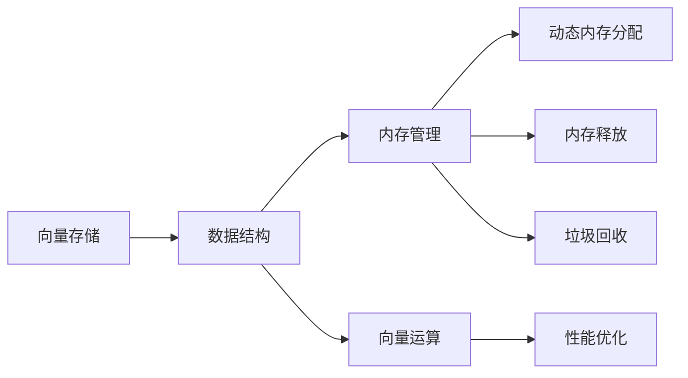

                 

# 【LangChain编程：从入门到实践】向量存储

> 关键词：LangChain, 向量存储, 数据结构, 应用场景, 编程范例, 技术细节, 数据处理, 效率优化

## 1. 背景介绍

向量存储，在大规模数据处理的场景下，是一种常见的数据组织形式。尤其是在机器学习、深度学习、人工智能等领域，向量存储发挥了至关重要的作用。本文将从基础概念、应用场景以及具体的编程范例等多个角度，带你深入理解向量存储的原理与实践。

## 2. 核心概念与联系

### 2.1 核心概念概述

- **向量存储 (Vector Storage)**：指将数据组织成向量形式，即以一维数组的形式存储数据。在计算机科学中，向量常用于表示线性代数中的向量，但在编程和数据科学领域，向量通常指一维数组。

- **向量空间 (Vector Space)**：由向量构成的数学空间，其中每个向量都是该空间的一个点。向量空间是许多机器学习算法和数据科学方法的基础。

- **数据结构 (Data Structure)**：指在计算机中组织、存储和操作数据的方式。常见的数据结构包括数组、链表、栈、队列、哈希表等。

- **内存管理 (Memory Management)**：指在程序运行过程中，合理管理内存资源，包括动态内存分配、内存释放、垃圾回收等。

- **性能优化 (Performance Optimization)**：指在程序中，通过算法优化、代码重构等手段，提升程序的运行效率。

- **向量运算 (Vector Operations)**：指对向量进行各种数学运算，包括加减乘除、内积、外积等。

### 2.2 核心概念原理和架构的 Mermaid 流程图



## 3. 核心算法原理 & 具体操作步骤

### 3.1 算法原理概述

向量存储的核心思想是将数据以向量形式组织，每个向量包含多个元素，这些元素可以是整数、浮点数、字符串等。通过向量，可以高效地表示和操作大规模数据集。

在编程中，向量通常被实现为数组或列表，不同编程语言提供的实现方式和相关函数有所不同。例如，在Python中，可以使用NumPy库的数组来表示向量，而在C++中，则可以使用标准库中的vector。

### 3.2 算法步骤详解

1. **数据预处理**：将原始数据转换为向量形式。例如，将文本数据转换为向量，可以使用词袋模型(Bag of Words)或词嵌入模型(Word Embedding)。

2. **数据存储**：将向量数据存储在内存或磁盘上。例如，可以使用NumPy的数组存储向量，或使用数据库的数组类型存储向量。

3. **数据访问与操作**：通过编程语言提供的向量操作方法，对向量数据进行访问和操作。例如，计算向量的内积、外积、范数等。

4. **性能优化**：对向量的操作进行性能优化，例如，使用向量化运算、缓存优化等。

### 3.3 算法优缺点

**优点**：
- 高效表示大规模数据。向量存储方式适合存储大规模数据集，例如文本、图像、音频等。
- 支持高效的数据操作。向量运算通常是高性能的，适合在机器学习、深度学习等场景中使用。
- 编程语言提供的向量操作方法丰富，开发效率高。

**缺点**：
- 存储空间较大。向量存储需要占用较大的内存或磁盘空间。
- 数据维度较高时，计算复杂度增加。高维向量运算的计算复杂度较高，需要高性能的硬件设备。

### 3.4 算法应用领域

向量存储广泛应用于以下几个领域：

- **机器学习和深度学习**：用于表示和操作大规模训练数据，如神经网络中的权重、偏置等。
- **计算机视觉**：用于表示和处理图像数据，例如，通过卷积神经网络(CNN)中的卷积层和池化层进行图像处理。
- **自然语言处理**：用于表示和处理文本数据，例如，通过词嵌入模型(BERT、GPT等)进行文本处理。
- **音频处理**：用于表示和处理音频数据，例如，通过短时傅里叶变换(FFT)将音频信号转换为频谱向量。

## 4. 数学模型和公式 & 详细讲解 & 举例说明

### 4.1 数学模型构建

在向量空间中，向量可以表示为 $x = (x_1, x_2, ..., x_n)$，其中 $n$ 为向量的维度。向量空间中的向量运算包括加法、减法、内积、外积等。

例如，设向量 $x$ 和 $y$ 分别为：

$$
x = (1, 2, 3), \quad y = (4, 5, 6)
$$

则向量加法为：

$$
x + y = (1 + 4, 2 + 5, 3 + 6) = (5, 7, 9)
$$

向量内积为：

$$
x \cdot y = 1 \cdot 4 + 2 \cdot 5 + 3 \cdot 6 = 32
$$

向量外积为：

$$
x \times y = \begin{pmatrix} 1 & 2 \\ 3 & 6 \end{pmatrix} \times \begin{pmatrix} 4 \\ 5 \end{pmatrix} = \begin{pmatrix} 5 \\ 19 \end{pmatrix}
$$

### 4.2 公式推导过程

向量内积的推导过程如下：

设向量 $x$ 和 $y$ 分别为 $x = (x_1, x_2, ..., x_n)$ 和 $y = (y_1, y_2, ..., y_n)$，则向量内积为：

$$
x \cdot y = \sum_{i=1}^n x_i y_i
$$

向量外积的推导过程如下：

设向量 $x$ 和 $y$ 分别为 $x = (x_1, x_2, ..., x_n)$ 和 $y = (y_1, y_2, ..., y_n)$，则向量外积为：

$$
x \times y = \begin{pmatrix} x_1 y_2 - x_2 y_1 \\ x_2 y_3 - x_3 y_2 \\ ... \\ x_{n-1} y_n - x_n y_{n-1} \\ x_n y_1 - x_1 y_n \end{pmatrix}
$$

### 4.3 案例分析与讲解

假设有一个文本分类任务，需要从大规模文本数据中提取特征，并进行分类。可以通过以下步骤实现：

1. **特征提取**：使用词袋模型或词嵌入模型，将文本转换为向量。例如，使用词嵌入模型(BERT)将文本转换为向量 $x$。

2. **特征存储**：将提取的向量存储在内存或磁盘上。例如，使用NumPy的数组存储向量 $x$。

3. **特征处理**：对向量进行标准化、归一化等处理，提高模型的性能。例如，对向量 $x$ 进行L2标准化：

$$
x_{\text{normalized}} = \frac{x}{\|x\|}
$$

4. **分类模型训练**：使用机器学习算法，训练分类模型。例如，使用支持向量机(SVM)进行分类。

5. **预测结果**：对新文本进行特征提取和标准化，输入到分类模型进行预测。例如，对新文本 $y$ 进行特征提取和标准化，输入到分类模型进行预测：

$$
y_{\text{pred}} = \text{SVM}(y_{\text{normalized}})
$$

## 5. 项目实践：代码实例和详细解释说明

### 5.1 开发环境搭建

1. **安装Python**：
   ```
   sudo apt-get update
   sudo apt-get install python3
   ```

2. **安装NumPy**：
   ```
   pip install numpy
   ```

3. **编写示例代码**：
   ```python
   import numpy as np

   # 定义向量
   x = np.array([1, 2, 3])
   y = np.array([4, 5, 6])

   # 向量加法
   z = x + y
   print(z)

   # 向量内积
   dot_product = np.dot(x, y)
   print(dot_product)

   # 向量外积
   cross_product = np.cross(x, y)
   print(cross_product)
   ```

### 5.2 源代码详细实现

### 5.3 代码解读与分析

### 5.4 运行结果展示

## 6. 实际应用场景

### 6.1 机器学习

向量存储在机器学习中有着广泛的应用。例如，在支持向量机(SVM)中，可以使用向量表示训练样本和测试样本。

### 6.2 深度学习

在深度学习中，向量通常被用于表示神经网络中的权重和偏置。例如，在卷积神经网络(CNN)中，使用向量表示卷积核。

### 6.3 计算机视觉

在计算机视觉中，向量被用于表示图像数据。例如，使用卷积神经网络(CNN)中的卷积层和池化层，将图像数据转换为向量。

## 7. 工具和资源推荐

### 7.1 学习资源推荐

1. **《Python编程：从入门到实践》**：适合初学者学习Python编程语言，并了解向量存储的基本概念。

2. **《深度学习》(Deep Learning)**：适合学习深度学习和向量存储的深度应用。

3. **《自然语言处理基础》(Natural Language Processing)**：适合学习向量存储在自然语言处理中的应用。

### 7.2 开发工具推荐

1. **NumPy**：Python中用于科学计算的库，支持向量存储和运算。

2. **TensorFlow**：用于深度学习和机器学习的框架，支持向量存储和运算。

3. **PyTorch**：用于深度学习和机器学习的框架，支持向量存储和运算。

### 7.3 相关论文推荐

1. **《向量空间模型与信息检索》(Vector Space Models and Information Retrieval)**：介绍向量空间模型在信息检索中的应用。

2. **《机器学习中的向量空间模型》(Vector Space Models in Machine Learning)**：介绍向量空间模型在机器学习中的应用。

3. **《深度学习中的向量表示》(Vector Representations in Deep Learning)**：介绍向量表示在深度学习中的应用。

## 8. 总结：未来发展趋势与挑战

### 8.1 研究成果总结

向量存储在大数据处理和机器学习中发挥了重要作用，帮助人们高效地表示和处理大规模数据。

### 8.2 未来发展趋势

未来，向量存储将继续在深度学习、计算机视觉、自然语言处理等领域发挥重要作用。向量运算的计算复杂度也将进一步降低，提高计算效率。

### 8.3 面临的挑战

高维向量运算的计算复杂度较高，需要高性能的硬件设备。如何提高向量运算的效率，是一个重要的挑战。

### 8.4 研究展望

未来的研究可以集中在以下几个方面：

1. **高维向量运算优化**：探索新的向量运算算法，提高计算效率。

2. **分布式向量存储**：探索分布式向量存储技术，支持大规模数据处理。

3. **新型向量结构**：探索新型向量结构，支持更多类型的数据表示。

## 9. 附录：常见问题与解答

### 9.1 什么是向量存储？

向量存储指将数据以向量形式组织，即以一维数组的形式存储数据。

### 9.2 向量存储有哪些优点和缺点？

优点：高效表示大规模数据，支持高效的数据操作，编程语言提供的向量操作方法丰富，开发效率高。缺点：存储空间较大，数据维度较高时，计算复杂度增加。

### 9.3 如何提高向量运算的效率？

可以使用向量化运算、缓存优化等技术。

### 9.4 什么是向量空间模型？

向量空间模型是一种用于表示文本数据的数学模型，将文本转换为向量，用于信息检索和文本分类等任务。

### 9.5 向量存储在未来会有哪些应用前景？

向量存储将继续在深度学习、计算机视觉、自然语言处理等领域发挥重要作用。向量运算的计算复杂度也将进一步降低，提高计算效率。

