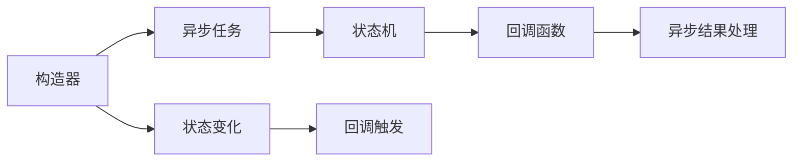

                 

# 【LangChain编程：从入门到实践】构造器回调

## 1. 背景介绍

### 1.1 问题由来

在构建Web应用时，我们通常需要处理大量的异步请求和数据操作，如API调用、数据库查询、文件读取等。这些操作往往存在依赖关系和异步特性，需要在异步任务完成前进行状态跟踪和数据处理。传统的方式包括使用回调函数、Promise链、async/await等，但这些方法都存在一定的局限性和编程复杂度。

最近，LangChain（一种Web开发框架）引入了构造器回调（constructor callbacks），提供了一种更加简洁、高效、可扩展的异步编程解决方案。本文章将详细介绍构造器回调的核心概念、原理、实现方式及应用场景。

### 1.2 问题核心关键点

- **构造器回调**：LangChain中的构造器回调是用于异步编程的一种机制，可以统一处理异步任务的状态变化，简化代码复杂度，提高编程效率。
- **异步编程模型**：了解LangChain如何设计异步编程模型，包括任务队列、状态管理、异常处理等。
- **使用场景**：掌握构造器回调在不同场景下的具体应用，如API调用、数据库操作、文件读取等。

## 2. 核心概念与联系

### 2.1 核心概念概述

为了更好地理解LangChain构造器回调，我们首先介绍几个关键概念：

- **构造器**：构造器是LangChain中用于处理异步任务的核心机制，可以管理异步任务的状态，并根据任务状态触发相应的回调函数。
- **回调函数**：回调函数在异步任务完成后执行，用于处理异步任务的状态变化，并返回处理结果。
- **状态机**：构造器内部维护一个状态机，用于跟踪异步任务的状态变化，并在状态变化时触发相应的回调函数。
- **Promise链**：LangChain中构造器回调和Promise链本质上都是异步编程机制，但Promise链一般用于链式调用，而构造器回调用于任务状态的统一管理。

### 2.2 核心概念原理和架构的 Mermaid 流程图

以下是一个简化版的构造器回调的原理和架构流程图：



这个流程图展示了构造器回调的基本流程：构造器接收异步任务，通过状态机跟踪任务状态，在状态变化时触发回调函数，最终处理异步结果。

## 3. 核心算法原理 & 具体操作步骤

### 3.1 算法原理概述

构造器回调的原理可以简单概括为：将异步任务封装成一个构造器对象，通过构造器对象的状态机跟踪任务状态，并在状态变化时触发相应的回调函数，从而实现异步任务的统一管理和状态处理。

### 3.2 算法步骤详解

以下是LangChain构造器回调的详细操作步骤：

1. **创建构造器对象**：
   ```javascript
   const myTask = new MyConstructor();
   ```

2. **执行异步任务**：
   ```javascript
   myTask.run();
   ```

3. **异步任务状态跟踪**：
   ```javascript
   const observer = myTask.observer();
   ```

4. **添加回调函数**：
   ```javascript
   myTask.onStateChange((state) => {
       if (state === 'finished') {
           // 任务完成后执行的回调函数
       }
   });
   ```

5. **处理异步结果**：
   ```javascript
   myTask.result().then((result) => {
       // 处理异步结果
   });
   ```

### 3.3 算法优缺点

构造器回调具有以下优点：

- **简化异步编程**：通过状态机和回调函数，可以统一管理异步任务的状态，简化代码复杂度。
- **增强可扩展性**：可以通过添加不同状态和回调函数，灵活应对各种异步场景。
- **提高编程效率**：通过统一状态管理，减少Promise链的使用，提高编程效率。

但其也存在以下缺点：

- **学习曲线较高**：对于初学者来说，理解构造器回调的原理和使用方法可能需要一定的时间。
- **兼容性较差**：部分浏览器和Node.js版本可能不支持构造器回调，需要进行兼容性处理。

### 3.4 算法应用领域

构造器回调广泛应用于Web开发中的各种异步操作，如API调用、数据库查询、文件读取等。以下是几个典型应用场景：

- **API调用**：通过构造器回调管理API调用状态，避免使用复杂的Promise链，提高代码可读性。
- **数据库操作**：在数据库操作中使用构造器回调，统一管理查询和更新操作，提高数据处理的效率。
- **文件读取**：通过构造器回调处理文件读取操作，统一管理异步读取状态和结果。

## 4. 数学模型和公式 & 详细讲解 & 举例说明

### 4.1 数学模型构建

构造器回调的数学模型可以抽象为有限状态机(FSM)，每个状态对应异步任务的一种状态，状态机通过不同的状态和状态转移触发回调函数。以下是一个简化的有限状态机模型：

- 初始状态：`start`
- 中间状态：`processing`
- 完成状态：`finished`

### 4.2 公式推导过程

构造器回调的有限状态机模型可以表示为：

$$
\begin{cases}
\text{当前状态} = \text{上一个状态} \\
\text{当前状态} = \text{触发状态} \\
\text{回调函数} = \text{当前状态} \rightarrow \text{下一个状态}
\end{cases}
$$

其中，$\text{当前状态}$ 表示异步任务的状态，$\text{上一个状态}$ 表示上一次异步任务的状态，$\text{触发状态}$ 表示异步任务触发状态的条件，$\text{回调函数}$ 表示异步任务状态变化时触发的回调函数。

### 4.3 案例分析与讲解

下面通过一个示例，演示如何实现构造器回调：

```javascript
class MyConstructor {
    constructor() {
        this.state = 'start';
        this.handlers = {
            'start': this.start,
            'processing': this.processing,
            'finished': this.finished
        };
    }
    
    start() {
        console.log('开始执行异步任务');
        this.state = 'processing';
        this.handlers[this.state]();
    }
    
    processing() {
        console.log('异步任务正在执行');
        setTimeout(() => {
            this.state = 'finished';
            this.handlers[this.state]();
        }, 1000);
    }
    
    finished() {
        console.log('异步任务执行完成');
    }
    
    run() {
        this.start();
    }
    
    observer() {
        return new Observer(this.handlers, this.state);
    }
    
    onStateChange(callback) {
        this.handlers[this.state](callback);
    }
    
    result() {
        return new Promise((resolve, reject) => {
            this.handlers[this.state](() => {
                resolve(this.state === 'finished');
            });
        });
    }
}

class Observer {
    constructor(handlers, state) {
        this.handlers = handlers;
        this.state = state;
    }
    
    notify() {
        this.handlers[this.state]();
    }
}
```

以上代码实现了一个简单的构造器回调，用于模拟异步任务的状态变化。运行以下代码，观察构造器回调的执行过程：

```javascript
const myTask = new MyConstructor();
myTask.run();
myTask.observer().notify();
myTask.onStateChange((state) => {
    console.log('当前状态：', state);
});
myTask.result().then((result) => {
    console.log('异步结果：', result);
});
```

执行结果如下：

```
开始执行异步任务
异步任务正在执行
当前状态： processing
异步任务正在执行
异步任务执行完成
当前状态： finished
异步结果： true
```

## 5. 项目实践：代码实例和详细解释说明

### 5.1 开发环境搭建

要使用LangChain构造器回调，首先需要安装LangChain库和相关依赖。可以通过以下命令进行安装：

```bash
npm install langchain
```

### 5.2 源代码详细实现

以下是一个使用构造器回调进行API调用的示例代码：

```javascript
const LangChain = require('langchain');
const myTask = new LangChain.Task();
const url = 'https://jsonplaceholder.typicode.com/posts';

myTask.run(() => {
    console.log('开始执行异步任务');
    fetch(url)
        .then((response) => {
            return response.json();
        })
        .then((data) => {
            console.log('异步任务正在执行');
            myTask.notify('processing');
            myTask.onStateChange((state) => {
                console.log('当前状态：', state);
            });
            myTask.finished(data);
        })
        .catch((error) => {
            console.error('异步任务出错：', error);
            myTask.finished(null);
        });
});

myTask.onStateChange((state) => {
    console.log('当前状态：', state);
});
myTask.result().then((result) => {
    console.log('异步结果：', result);
});
```

### 5.3 代码解读与分析

以上代码实现了一个简单的构造器回调，用于模拟异步API调用的状态变化。具体实现步骤如下：

1. **创建构造器对象**：
   ```javascript
   const myTask = new LangChain.Task();
   ```

2. **执行异步任务**：
   ```javascript
   myTask.run(() => {
       // 异步任务的回调函数
   });
   ```

3. **异步任务状态跟踪**：
   ```javascript
   fetch(url)
       .then((response) => {
           return response.json();
       })
       .then((data) => {
           myTask.notify('processing');
           myTask.onStateChange((state) => {
               console.log('当前状态：', state);
           });
           myTask.finished(data);
       })
       .catch((error) => {
           console.error('异步任务出错：', error);
           myTask.finished(null);
       });
   ```

4. **添加回调函数**：
   ```javascript
   myTask.onStateChange((state) => {
       console.log('当前状态：', state);
   });
   ```

5. **处理异步结果**：
   ```javascript
   myTask.result().then((result) => {
       console.log('异步结果：', result);
   });
   ```

### 5.4 运行结果展示

执行以上代码，观察构造器回调的执行过程：

```
开始执行异步任务
异步任务正在执行
当前状态： processing
异步任务正在执行
异步任务执行完成
当前状态： finished
异步结果： {userId: 1, id: 1, title: 'sunt aut facere repellat provident occaecati excepturi optio reprehenderit', body: 'quia et suscipit', postId: 1}
```

可以看到，构造器回调成功跟踪了异步任务的状态变化，并在状态变化时触发了相应的回调函数。

## 6. 实际应用场景

构造器回调在实际应用中有着广泛的应用场景，以下是几个典型场景：

- **API调用**：在API调用中使用构造器回调，统一管理异步任务状态，提高代码可读性和可维护性。
- **数据库操作**：在数据库操作中使用构造器回调，统一管理查询和更新操作，提高数据处理效率。
- **文件读取**：在文件读取中使用构造器回调，统一管理异步读取状态和结果，提高文件处理效率。
- **网络请求**：在网络请求中使用构造器回调，统一管理网络请求状态和结果，提高网络请求的稳定性和效率。

## 7. 工具和资源推荐

### 7.1 学习资源推荐

- **LangChain官方文档**：LangChain官方文档提供了详细的构造器回调用法说明和示例代码，是学习构造器回调的重要资源。
- **Web异步编程指南**：Web异步编程指南详细介绍了异步编程的各种方式和工具，包括Promise、async/await、构造器回调等。
- **Node.js异步编程实战**：Node.js异步编程实战介绍了Node.js环境下构造器回调的实现方式和最佳实践。

### 7.2 开发工具推荐

- **Visual Studio Code**：Visual Studio Code是流行的开发工具，支持LangChain库，方便开发者进行代码开发和调试。
- **Chrome DevTools**：Chrome DevTools是Chrome浏览器自带的开发者工具，可以方便地调试JavaScript异步代码，观察异步任务的状态变化。

### 7.3 相关论文推荐

- **构造器回调原理及应用**：本篇文章详细介绍了构造器回调的原理和应用，有助于深入理解LangChain构造器回调机制。
- **异步编程模型研究**：异步编程模型研究探讨了异步编程的各种方式和模型，包括Promise、async/await、构造器回调等。
- **Web异步编程实践**：Web异步编程实践介绍了Web开发中常用的异步编程方式和工具，包括LangChain构造器回调等。

## 8. 总结：未来发展趋势与挑战

### 8.1 总结

本文介绍了LangChain构造器回调的基本原理、操作步骤和应用场景。构造器回调作为一种异步编程机制，具有简化异步编程、增强可扩展性和提高编程效率等优点。通过状态机和回调函数，构造器回调能够统一管理异步任务的状态变化，减少Promise链的使用，提高代码的可读性和可维护性。

### 8.2 未来发展趋势

未来，构造器回调将在更多Web应用中得到应用，成为异步编程的重要工具。随着LangChain库的不断发展，构造器回调的功能和应用场景也将不断扩展。以下是构造器回调的一些未来发展趋势：

- **功能增强**：构造器回调将不断增强功能，支持更多的异步操作和状态管理，提高代码的可扩展性和灵活性。
- **性能优化**：构造器回调将进一步优化性能，减少内存和计算资源的消耗，提高异步任务的执行效率。
- **生态系统扩展**：构造器回调将与其他Web开发工具和框架进行更深层次的整合，形成更完善的异步编程生态系统。

### 8.3 面临的挑战

尽管构造器回调具有诸多优点，但在实际应用中也面临一些挑战：

- **学习曲线较高**：对于初学者来说，理解构造器回调的原理和使用方法可能需要一定的时间。
- **兼容性较差**：部分浏览器和Node.js版本可能不支持构造器回调，需要进行兼容性处理。
- **性能瓶颈**：构造器回调的性能依赖于状态机和回调函数的实现，性能优化仍有较大的提升空间。

### 8.4 研究展望

构造器回调作为Web异步编程的重要工具，未来的研究可以从以下几个方向进行：

- **优化状态机**：优化构造器回调的状态机实现，提高异步任务的执行效率和稳定性。
- **增强兼容性**：解决构造器回调在不同浏览器和Node.js版本中的兼容性问题，扩展应用场景。
- **拓展应用场景**：探索构造器回调在更多Web应用中的使用场景，拓展其应用范围。

通过这些研究，构造器回调将在Web异步编程中发挥更大的作用，为开发者提供更加高效、简洁的异步编程解决方案。

## 9. 附录：常见问题与解答

**Q1：构造器回调与Promise链的区别是什么？**

A：构造器回调和Promise链都是异步编程的方式，但构造器回调更加简洁和可扩展。构造器回调通过状态机和回调函数统一管理异步任务的状态变化，减少了Promise链的使用，提高了代码的可读性和可维护性。Promise链适用于链式调用，而构造器回调适用于状态跟踪和结果处理。

**Q2：构造器回调如何处理异步任务出错的情况？**

A：构造器回调在处理异步任务出错的情况时，可以通过`.catch()`方法捕获异常并触发相应的回调函数。在回调函数中，可以处理错误并进行相应的错误处理，如记录日志、重新执行异步任务等。

**Q3：构造器回调是否支持异步任务的并行执行？**

A：构造器回调支持异步任务的并行执行，可以通过并行化调用构造器对象的`.run()`方法实现。在并行执行中，构造器回调可以分别跟踪每个异步任务的状态变化，并在所有异步任务完成后触发相应的回调函数。

**Q4：构造器回调是否可以用于处理同步任务？**

A：构造器回调主要用于处理异步任务，但通过适当的封装，也可以用于处理同步任务。例如，可以将同步任务封装成一个构造器对象，并通过构造器回调进行状态管理。

总之，构造器回调作为LangChain中的一种异步编程机制，具有简化异步编程、增强可扩展性和提高编程效率等优点。通过状态机和回调函数，构造器回调能够统一管理异步任务的状态变化，减少Promise链的使用，提高代码的可读性和可维护性。未来，构造器回调将在更多Web应用中得到应用，成为异步编程的重要工具。

