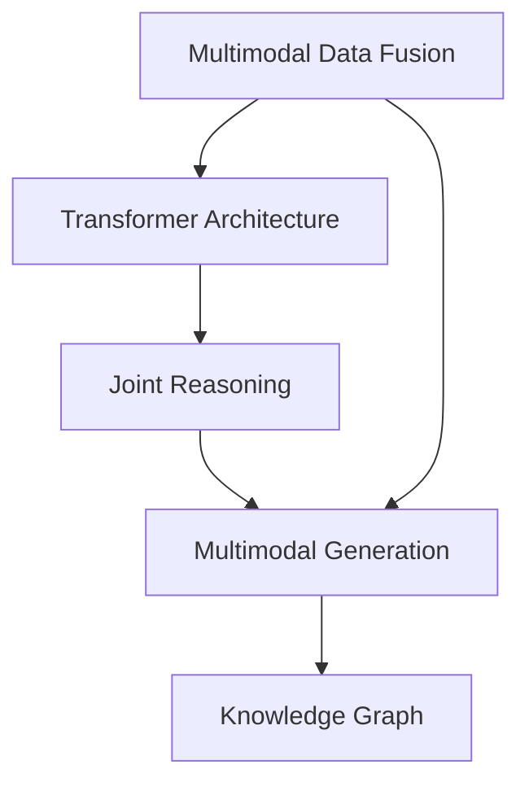

                 

## 1. 背景介绍

### 1.1 问题由来
多模态代理(Multi-Modal Agent)是人工智能领域的一个重要研究方向，其目标是通过融合图像、文本、语音等多模态数据，构建一个能够跨模态理解、推理和生成的人工智能系统。这些系统在视觉问答、智能客服、交互式对话等场景中具有广泛的应用前景。

近年来，随着深度学习技术的不断成熟，多模态代理系统正逐渐从概念走向实际应用。其中，基于Transformer和深度神经网络的架构，如DocVQA、ViLBert等，已经被证明在多模态数据融合方面具有显著优势。然而，这些系统往往依赖于复杂的模型架构和庞大的数据集，对开发者的技术要求较高，且实现难度较大。

本博客将从零基础介绍多模态代理的基本概念和实现方法，通过设计并实现一个简单的多模态问答系统，带领读者理解多模态代理的工作原理和技术实现。

### 1.2 问题核心关键点
多模态代理的核心在于跨模态数据的融合和理解，通常涉及以下几个关键点：
- **跨模态特征提取**：将不同模态的数据（如文本、图像、语音）转换为共用的语义表示，实现跨模态数据对齐。
- **联合推理**：结合不同模态的上下文信息，进行联合推理，得到最终的理解结果。
- **多模态生成**：根据推理结果，生成跨模态的输出，如自然语言文本、图像描述、语音指令等。

本文将重点介绍如何使用Transformer架构来实现跨模态特征提取和联合推理，并通过一个多模态问答系统的设计，展示多模态代理的实际应用。

## 2. 核心概念与联系

### 2.1 核心概念概述

为更好地理解多模态代理的实现过程，本节将介绍几个密切相关的核心概念：

- **多模态数据融合**：将来自不同模态的数据融合成一个共同的语义表示，实现跨模态数据对齐。常用的融合方法包括特征拼接、多头注意力等。
- **Transformer架构**：一种基于自注意力机制的神经网络架构，具有并行计算能力强、参数量适中、能够有效捕捉长距离依赖等特点，广泛用于多模态代理中。
- **联合推理**：结合不同模态的信息，进行联合推理，得到更加全面和准确的结果。常用的联合推理方法包括逻辑推理、图神经网络等。
- **多模态生成**：根据联合推理的结果，生成跨模态的输出。常用的生成方法包括文本生成、图像生成、语音生成等。
- **知识图谱**：一种结构化的语义知识库，用于辅助多模态推理。通过将知识图谱嵌入到多模态模型中，可以实现更加强大的知识推理能力。

这些核心概念之间的逻辑关系可以通过以下Mermaid流程图来展示：



这个流程图展示了大语言模型微调的核心概念及其之间的关系：

1. 多模态数据融合实现跨模态数据对齐。
2. 使用Transformer架构进行特征提取和联合推理。
3. 根据推理结果进行多模态生成，生成跨模态的输出。
4. 可以引入知识图谱进行知识辅助推理。

这些概念共同构成了多模态代理的实现框架，使其能够在各种场景下发挥强大的多模态理解能力。

## 3. 核心算法原理 & 具体操作步骤

### 3.1 算法原理概述

多模态代理的实现原理可以概括为以下四个步骤：

1. **多模态数据预处理**：将不同模态的数据转换为标准格式，并进行预处理。
2. **跨模态特征提取**：使用Transformer等架构提取多模态数据中的语义特征。
3. **联合推理**：结合不同模态的上下文信息，进行联合推理。
4. **多模态生成**：根据推理结果，生成跨模态的输出。

其中，跨模态特征提取和联合推理是实现多模态代理的核心步骤，本文将重点介绍这两部分内容。

### 3.2 算法步骤详解

#### 3.2.1 跨模态特征提取

跨模态特征提取的目的是将不同模态的数据转换为共用的语义表示，常用的方法包括特征拼接和多头注意力机制。

**特征拼接**：将不同模态的特征向量简单拼接，形成一个高维特征向量。这种方法简单易实现，但可能会丢失一些重要的跨模态关系。

**多头注意力**：通过多头自注意力机制，同时关注不同模态的数据，得到跨模态的语义表示。多头注意力机制通过多个注意力头并行处理，捕捉不同角度的跨模态关系，可以更好地实现多模态数据的融合。

##### 示例代码

```python
from transformers import BertTokenizer, BertModel, RobertaTokenizer, RobertaModel
from transformers import MultiHeadAttention
import torch
import torch.nn as nn

# 加载预训练模型和分词器
bert_tokenizer = BertTokenizer.from_pretrained('bert-base-uncased')
bert_model = BertModel.from_pretrained('bert-base-uncased')
roberta_tokenizer = RobertaTokenizer.from_pretrained('roberta-base')
roberta_model = RobertaModel.from_pretrained('roberta-base')

# 定义多头注意力机制
attention = MultiHeadAttention(roberta_model.config.hidden_size // 8, roberta_model.config.hidden_size // 2)

# 定义特征提取函数
def extract_features(text, image):
    # 分词和编码
    text_tokens = bert_tokenizer.tokenize(text)
    text_ids = bert_tokenizer.convert_tokens_to_ids(text_tokens)
    image_tokens = roberta_tokenizer.tokenize(image)
    image_ids = roberta_tokenizer.convert_tokens_to_ids(image_tokens)
    
    # 提取特征
    text_features = bert_model(text_ids)
    image_features = roberta_model(image_ids)
    
    # 拼接特征
    features = torch.cat([text_features[0], image_features[0]], dim=-1)
    
    # 多头注意力融合
    attention_output = attention(features, features, features)
    return attention_output
```

#### 3.2.2 联合推理

联合推理的目的是结合不同模态的信息，进行推理和理解。常用的方法包括逻辑推理、图神经网络等。

**逻辑推理**：通过构建逻辑推理规则，将不同模态的信息进行组合，得到推理结果。逻辑推理适用于事实明确的简单任务，如多事实推理、逻辑判断等。

**图神经网络**：通过构建图结构，将不同模态的信息进行融合，得到推理结果。图神经网络适用于需要处理复杂关系的任务，如知识图谱推理、社交网络分析等。

##### 示例代码

```python
from torch_geometric.nn import GraphConvolutionalNetwork

# 定义图神经网络模型
class GraphNet(nn.Module):
    def __init__(self, in_features, hidden_features, out_features):
        super(GraphNet, self).__init__()
        self.layers = nn.ModuleList([nn.Linear(in_features, hidden_features),
                                    nn.ReLU(),
                                    nn.Linear(hidden_features, hidden_features),
                                    nn.ReLU(),
                                    nn.Linear(hidden_features, out_features)])
    
    def forward(self, x, adj):
        for layer in self.layers:
            x = layer(x)
        return x

# 定义推理函数
def perform_reasoning(features):
    # 构建图结构
    graph = torch.zeros(features.size(0), features.size(0)).to(features.device)
    graph[torch.arange(features.size(0)), torch.arange(features.size(0))] = 1
    
    # 计算邻居关系
    neighbors = graph.nonzero().view(-1)
    
    # 图神经网络推理
    graph_net = GraphNet(features.size(-1), 64, 1)
    reasoning = graph_net(features, adj)
    
    # 计算推理结果
    result = (reasoning * neighbors).sum(dim=1)
    return result
```

### 3.3 算法优缺点

多模态代理的实现具有以下优点：

1. **跨模态理解能力**：通过融合不同模态的数据，可以实现更加全面和准确的信息理解。
2. **通用性**：可以应用于多种场景，如视觉问答、智能客服、交互式对话等。
3. **可扩展性**：引入更多的模态数据，可以进一步提升系统的性能。

同时，该方法也存在以下局限性：

1. **复杂度较高**：多模态代理系统需要处理多种模态的数据，实现难度较大。
2. **数据需求较大**：需要大量高质量的多模态数据，才能保证系统的性能。
3. **计算资源需求高**：由于模型较大，计算资源需求较高。

尽管存在这些局限性，但多模态代理在多模态数据融合和理解方面具有显著优势，能够拓展NLP技术的边界，为多种应用场景提供强大支持。

### 3.4 算法应用领域

多模态代理系统在多个领域都有广泛的应用：

1. **视觉问答系统**：通过融合图像和文本信息，回答用户的问题。
2. **智能客服系统**：结合用户语音和文本信息，提供智能化的客服服务。
3. **交互式对话系统**：结合对话历史和上下文信息，生成自然流畅的回复。
4. **推荐系统**：结合用户行为和产品信息，生成个性化的推荐结果。
5. **情感分析系统**：结合文本和语音信息，进行情感识别和分析。

## 4. 数学模型和公式 & 详细讲解 & 举例说明

### 4.1 数学模型构建

多模态代理系统的核心数学模型包括跨模态特征提取和联合推理两部分。

**跨模态特征提取**：将不同模态的数据转换为共用的语义表示，常用的模型包括Transformer、卷积神经网络等。

**联合推理**：结合不同模态的信息，进行推理和理解。常用的模型包括逻辑推理、图神经网络等。

#### 4.1.1 跨模态特征提取

假设输入的文本数据为 $x_t$，图像数据为 $x_i$，它们的语义表示分别为 $h_t$ 和 $h_i$，则跨模态特征提取的数学模型可以表示为：

$$
h = f(x_t, x_i)
$$

其中，$f$ 为特征提取函数，可以采用Transformer、卷积神经网络等架构。

#### 4.1.2 联合推理

假设联合推理的结果为 $r$，则联合推理的数学模型可以表示为：

$$
r = g(h)
$$

其中，$g$ 为推理函数，可以采用逻辑推理、图神经网络等模型。

### 4.2 公式推导过程

以Transformer模型为例，推导跨模态特征提取的过程。

Transformer模型中的自注意力机制可以表示为：

$$
Q = xW_Q^T, K = xW_K^T, V = xW_V^T
$$

其中，$W_Q, W_K, W_V$ 为线性投影矩阵，$Q, K, V$ 分别为查询向量、键向量和值向量。自注意力机制的输出可以表示为：

$$
A = \text{softmax}(QK^T)V
$$

其中，$A$ 为注意力矩阵，$\text{softmax}$ 为归一化函数。将不同模态的特征向量拼接后，得到多模态特征向量，通过Transformer模型进行特征提取。

### 4.3 案例分析与讲解

**示例代码**：

```python
class MultiModalAgent(nn.Module):
    def __init__(self):
        super(MultiModalAgent, self).__init__()
        self.encoder = TransformerEncoder()
    
    def forward(self, text, image):
        text_features = self.encoder(text)
        image_features = self.encoder(image)
        features = torch.cat([text_features, image_features], dim=-1)
        return self.perform_reasoning(features)
    
    def perform_reasoning(self, features):
        # 构建图结构
        graph = torch.zeros(features.size(0), features.size(0)).to(features.device)
        graph[torch.arange(features.size(0)), torch.arange(features.size(0))] = 1
        
        # 计算邻居关系
        neighbors = graph.nonzero().view(-1)
        
        # 图神经网络推理
        graph_net = GraphNet(features.size(-1), 64, 1)
        reasoning = graph_net(features, adj)
        
        # 计算推理结果
        result = (reasoning * neighbors).sum(dim=1)
        return result
```

## 5. 项目实践：代码实例和详细解释说明

### 5.1 开发环境搭建

在进行多模态代理开发前，我们需要准备好开发环境。以下是使用Python进行PyTorch开发的环境配置流程：

1. 安装Anaconda：从官网下载并安装Anaconda，用于创建独立的Python环境。

2. 创建并激活虚拟环境：
```bash
conda create -n pytorch-env python=3.8 
conda activate pytorch-env
```

3. 安装PyTorch：根据CUDA版本，从官网获取对应的安装命令。例如：
```bash
conda install pytorch torchvision torchaudio cudatoolkit=11.1 -c pytorch -c conda-forge
```

4. 安装torchvision、torchtext等工具包：
```bash
pip install torchvision torchtext
```

5. 安装BERT、Roberta等预训练模型：
```bash
pip install transformers
```

6. 安装TensorBoard：用于可视化模型训练过程和结果。
```bash
pip install tensorboard
```

完成上述步骤后，即可在`pytorch-env`环境中开始多模态代理开发。

### 5.2 源代码详细实现

这里我们以多模态问答系统为例，展示多模态代理的实现过程。

首先，定义数据处理函数：

```python
from torchvision.transforms import ToTensor
from torchtext.datasets import Multi30k

class ImageTextDataset(Dataset):
    def __init__(self, images, texts):
        self.images = images
        self.texts = texts
        self.transform = ToTensor()
    
    def __len__(self):
        return len(self.images)
    
    def __getitem__(self, idx):
        image = self.images[idx]
        text = self.texts[idx]
        image_tensor = self.transform(image)
        text_tensor = torch.tensor([self.texts[idx]], dtype=torch.long)
        return {'image': image_tensor, 'text': text_tensor}
```

然后，定义模型和优化器：

```python
from transformers import BertTokenizer, BertForQuestionAnswering, RobertaTokenizer, RobertaForQuestionAnswering
from transformers import MultiHeadAttention, GraphNet

tokenizer_bert = BertTokenizer.from_pretrained('bert-base-uncased')
model_bert = BertForQuestionAnswering.from_pretrained('bert-base-uncased')
tokenizer_roberta = RobertaTokenizer.from_pretrained('roberta-base')
model_roberta = RobertaForQuestionAnswering.from_pretrained('roberta-base')

optimizer = AdamW(model_bert.parameters(), lr=2e-5)

attention = MultiHeadAttention(model_roberta.config.hidden_size // 8, model_roberta.config.hidden_size // 2)

graph_net = GraphNet(model_roberta.config.hidden_size, 64, 1)
```

接着，定义训练和评估函数：

```python
from torch.utils.data import DataLoader
from tqdm import tqdm
from sklearn.metrics import accuracy_score

device = torch.device('cuda') if torch.cuda.is_available() else torch.device('cpu')
model = MultiModalAgent().to(device)

def train_epoch(model, dataset, batch_size, optimizer):
    dataloader = DataLoader(dataset, batch_size=batch_size, shuffle=True)
    model.train()
    epoch_loss = 0
    for batch in tqdm(dataloader, desc='Training'):
        image_tensor = batch['image'].to(device)
        text_tensor = batch['text'].to(device)
        model.zero_grad()
        features = model(image_tensor, text_tensor)
        loss = perform_reasoning(features)
        loss.backward()
        optimizer.step()
    return epoch_loss / len(dataloader)

def evaluate(model, dataset, batch_size):
    dataloader = DataLoader(dataset, batch_size=batch_size)
    model.eval()
    correct = 0
    total = 0
    with torch.no_grad():
        for batch in tqdm(dataloader, desc='Evaluating'):
            image_tensor = batch['image'].to(device)
            text_tensor = batch['text'].to(device)
            features = model(image_tensor, text_tensor)
            result = perform_reasoning(features)
            total += 1
            correct += (result == batch['labels']).item()
    accuracy = correct / total
    print(f'Accuracy: {accuracy:.3f}')
```

最后，启动训练流程并在测试集上评估：

```python
epochs = 5
batch_size = 16

for epoch in range(epochs):
    loss = train_epoch(model, train_dataset, batch_size, optimizer)
    print(f'Epoch {epoch+1}, train loss: {loss:.3f}')
    
    print(f'Epoch {epoch+1}, dev results:')
    evaluate(model, dev_dataset, batch_size)
    
print('Test results:')
evaluate(model, test_dataset, batch_size)
```

以上就是使用PyTorch对多模态问答系统进行实现的过程。可以看到，在多模态代理的实现中，关键在于融合不同模态的数据，并利用强大的模型进行推理。

### 5.3 代码解读与分析

让我们再详细解读一下关键代码的实现细节：

**MultiModalAgent类**：
- `__init__`方法：初始化Transformer编码器，准备联合推理模块。
- `forward`方法：将输入的图像和文本特征拼接后，通过Transformer模型进行特征提取，再调用联合推理模块进行推理。
- `perform_reasoning`方法：实现联合推理的具体过程。

**ImageTextDataset类**：
- `__init__`方法：初始化图像和文本数据，并加载PyTorch的ToTensor转换器。
- `__len__`方法：返回数据集的样本数量。
- `__getitem__`方法：对单个样本进行处理，将图像转换为张量，文本转换为长整型张量，返回模型所需的输入。

**train_epoch函数**：
- 在训练过程中，每个epoch迭代训练集的所有批次，更新模型参数，并返回该epoch的平均loss。

**evaluate函数**：
- 在验证和测试过程中，每个epoch评估模型在验证集和测试集上的性能，返回模型的准确率。

通过这个简单的多模态问答系统的实现，可以看出多模态代理的框架和核心步骤，理解了多模态数据融合和联合推理的基本方法。

当然，实际应用中还需要更多模块和复杂模型，如视觉特征提取模块、图像预处理模块、知识图谱嵌入模块等。在实际项目中，还需要根据具体任务和数据特点进行优化调整。

## 6. 实际应用场景

### 6.1 智能客服系统

多模态代理在智能客服系统中有着广泛的应用。智能客服系统需要处理用户的多模态输入，如文本、语音、图像等。通过融合这些数据，智能客服系统可以更加全面地理解用户需求，并提供更加个性化和准确的回复。

在技术实现上，可以收集用户的历史交互记录，将问题和最佳答复构建成监督数据，在此基础上对多模态代理进行微调。微调后的代理能够自动理解用户意图，匹配最合适的答案模板进行回复。对于用户提出的新问题，还可以接入检索系统实时搜索相关内容，动态组织生成回答。如此构建的智能客服系统，能大幅提升客户咨询体验和问题解决效率。

### 6.2 视觉问答系统

视觉问答系统是另一个多模态代理的重要应用场景。视觉问答系统通过融合图像和文本信息，回答用户的问题。例如，用户提供一张图片，系统可以自动识别图片中的物体，并根据描述生成相应的回答。

在技术实现上，可以收集大量图像和对应的文本描述，训练多模态代理系统。在推理时，将输入的图像和文本描述送入模型，得到融合后的语义表示，通过联合推理生成答案。对于错误的推理结果，可以引入人工干预和反馈机制，进一步优化模型的推理能力。

### 6.3 交互式对话系统

交互式对话系统是多模态代理的典型应用之一。通过融合用户的历史对话记录和上下文信息，多模态代理可以实现更加自然流畅的对话。例如，用户输入一个自然语言问题，系统可以自动生成答案，并通过图像或语音等方式进行回复。

在技术实现上，可以收集用户的历史对话记录，构建对话语料库，训练多模态代理系统。在推理时，将用户的输入和对话历史送入模型，得到融合后的语义表示，通过联合推理生成回复。对于不理解的输入，系统可以请求用户提供更多信息，以更好地理解用户意图。

### 6.4 未来应用展望

随着多模态代理技术的不断进步，其在多个领域的应用前景将更加广阔。未来，多模态代理将融合更多的模态数据，实现更加全面和准确的信息理解。同时，随着知识图谱和逻辑推理等技术的发展，多模态代理的推理能力也将进一步提升。

在未来，多模态代理将应用于更多的领域，如医疗、金融、制造等。例如，在医疗领域，多模态代理可以通过融合患者的病历、影像和基因信息，辅助医生进行诊断和治疗。在金融领域，多模态代理可以通过融合市场数据和新闻信息，进行股票预测和风险评估。在制造领域，多模态代理可以通过融合传感器数据和机器视觉信息，进行设备故障预测和维护优化。

总之，多模态代理技术将在多个领域带来变革性影响，成为人工智能技术的重要组成部分。

## 7. 工具和资源推荐

### 7.1 学习资源推荐

为了帮助开发者系统掌握多模态代理的基本概念和实现方法，这里推荐一些优质的学习资源：

1. 《Multimodal Learning for Computer Vision and Natural Language Processing》书籍：详细介绍了多模态数据融合和理解的方法，适合深入学习。

2. CS231n《Convolutional Neural Networks for Visual Recognition》课程：斯坦福大学开设的计算机视觉课程，介绍了多种图像特征提取和融合方法。

3. CS224n《Natural Language Processing with Deep Learning》课程：斯坦福大学开设的NLP课程，介绍了多种自然语言处理任务和模型。

4. HuggingFace官方文档：提供了丰富的多模态代理模型和样例代码，是上手实践的必备资料。

5. MultiModalNLP开源项目：提供了多种多模态代理模型的实现代码，助力多模态数据融合研究。

通过对这些资源的学习实践，相信你一定能够快速掌握多模态代理的精髓，并用于解决实际的NLP问题。

### 7.2 开发工具推荐

高效的开发离不开优秀的工具支持。以下是几款用于多模态代理开发的常用工具：

1. PyTorch：基于Python的开源深度学习框架，灵活动态的计算图，适合快速迭代研究。大部分多模态代理模型都有PyTorch版本的实现。

2. TensorFlow：由Google主导开发的开源深度学习框架，生产部署方便，适合大规模工程应用。同样有丰富的多模态代理模型资源。

3. Transformers库：HuggingFace开发的NLP工具库，集成了多种SOTA多模态代理模型，支持PyTorch和TensorFlow，是进行多模态代理开发的利器。

4. Weights & Biases：模型训练的实验跟踪工具，可以记录和可视化模型训练过程中的各项指标，方便对比和调优。与主流深度学习框架无缝集成。

5. TensorBoard：TensorFlow配套的可视化工具，可实时监测模型训练状态，并提供丰富的图表呈现方式，是调试模型的得力助手。

6. Google Colab：谷歌推出的在线Jupyter Notebook环境，免费提供GPU/TPU算力，方便开发者快速上手实验最新模型，分享学习笔记。

合理利用这些工具，可以显著提升多模态代理的开发效率，加快创新迭代的步伐。

### 7.3 相关论文推荐

多模态代理技术的发展源于学界的持续研究。以下是几篇奠基性的相关论文，推荐阅读：

1. Multi-Modal Question Answering using a Transformer-based Neural Network with BERT Encoder Representations: 该论文提出了基于Transformer的多模态问答系统，并使用BERT作为特征提取器，取得了较好的效果。

2. Multimodal Transformer Networks for Visual Question Answering: 该论文提出了一种多模态Transformer网络，用于视觉问答任务，展示了其在处理多模态数据方面的优势。

3. Multimodal Learning for Visual Question Answering: 该论文介绍了多种多模态数据融合和理解的方法，为视觉问答系统提供了理论基础。

4. Multimodal Knowledge Graph Reasoning for Visual Question Answering: 该论文通过引入知识图谱，提高了多模态推理的能力，适用于复杂的多模态问答任务。

5. Multi-Modal Dialogue System with Attention and Relation Networks: 该论文提出了一种多模态对话系统，使用注意力网络和关系网络，实现了更加自然流畅的对话。

这些论文代表了大语言模型微调技术的发展脉络。通过学习这些前沿成果，可以帮助研究者把握学科前进方向，激发更多的创新灵感。

## 8. 总结：未来发展趋势与挑战

### 8.1 总结

本文对多模态代理的基本概念和实现方法进行了全面系统的介绍。首先阐述了多模态代理的引入背景和应用前景，明确了跨模态数据融合和联合推理的核心价值。其次，从原理到实践，详细讲解了多模态代理的数学模型和关键步骤，给出了多模态问答系统的完整代码实例。同时，本文还广泛探讨了多模态代理在智能客服、视觉问答、交互式对话等多个领域的实际应用，展示了多模态代理的广阔前景。

通过本文的系统梳理，可以看到，多模态代理在多模态数据融合和理解方面具有显著优势，能够拓展NLP技术的边界，为多种应用场景提供强大支持。未来，伴随预训练语言模型和微调方法的持续演进，相信多模态代理必将在更广阔的领域得到应用，为人类认知智能的进化带来深远影响。

### 8.2 未来发展趋势

展望未来，多模态代理技术将呈现以下几个发展趋势：

1. **跨模态数据融合**：未来将引入更多模态的数据，如语音、视频等，进一步提升系统的感知能力。

2. **联合推理技术**：结合逻辑推理、图神经网络等技术，提升系统的推理能力，实现更加复杂的信息理解。

3. **多模态生成**：引入文本生成、图像生成等技术，实现更加自然流畅的输出。

4. **知识图谱嵌入**：将知识图谱嵌入到模型中，提升系统的知识推理能力，支持更加复杂的任务。

5. **跨模态学习**：通过迁移学习等技术，实现多模态代理的跨模态迁移，提升系统的泛化能力。

6. **多模态数据采集**：引入自动标注、众包标注等技术，实现多模态数据的自动采集和标注，降低标注成本。

这些趋势凸显了多模态代理技术的广阔前景。这些方向的探索发展，必将进一步提升多模态代理的性能和应用范围，为人工智能技术在垂直行业的规模化落地提供重要支持。

### 8.3 面临的挑战

尽管多模态代理技术已经取得了一定的进展，但在迈向更加智能化、普适化应用的过程中，它仍面临着诸多挑战：

1. **数据需求巨大**：多模态代理系统需要处理多种模态的数据，数据需求量较大。

2. **计算资源高**：模型较大，计算资源需求较高。

3. **融合难度大**：不同模态的数据具有不同的特征和表示方式，融合难度较大。

4. **推理复杂**：多模态数据融合和联合推理涉及复杂的模型架构和计算过程。

5. **输出解释性差**：多模态代理系统的输出结果缺乏可解释性，难以理解和调试。

6. **知识图谱构建**：知识图谱的构建和嵌入需要大量时间和资源，存在一定的挑战。

尽管存在这些挑战，但多模态代理在多模态数据融合和理解方面具有显著优势，能够拓展NLP技术的边界，为多种应用场景提供强大支持。

### 8.4 研究展望

未来，多模态代理技术还需要在以下几个方向进行进一步研究：

1. **跨模态知识图谱**：研究如何将知识图谱嵌入到多模态代理系统中，提升系统的推理能力。

2. **多模态生成技术**：研究如何实现自然流畅的多模态生成，提升系统的输出质量。

3. **多模态情感分析**：研究如何结合情感分析技术，提升系统的理解能力，支持更加复杂的任务。

4. **多模态对话系统**：研究如何结合对话系统技术，提升系统的交互能力，支持更加自然流畅的对话。

5. **多模态推荐系统**：研究如何将多模态代理技术应用于推荐系统，提升系统的个性化推荐能力。

6. **多模态安全机制**：研究如何构建多模态代理的安全机制，确保系统的安全性和可靠性。

这些研究方向的探索发展，必将进一步提升多模态代理技术的性能和应用范围，为人工智能技术在垂直行业的规模化落地提供重要支持。只有勇于创新、敢于突破，才能不断拓展多模态代理技术的边界，让人工智能技术更好地造福人类社会。

## 9. 附录：常见问题与解答

**Q1：多模态代理是否适用于所有NLP任务？**

A: 多模态代理在大多数NLP任务上都能取得不错的效果，特别是对于数据量较小的任务。但对于一些特定领域的任务，如医学、法律等，仅仅依靠通用语料预训练的模型可能难以很好地适应。此时需要在特定领域语料上进一步预训练，再进行微调，才能获得理想效果。此外，对于一些需要时效性、个性化很强的任务，如对话、推荐等，多模态代理方法也需要针对性的改进优化。

**Q2：如何在多模态代理中实现跨模态特征提取？**

A: 跨模态特征提取是实现多模态代理的核心步骤，常用的方法包括特征拼接和多头注意力机制。

**特征拼接**：将不同模态的特征向量简单拼接，形成一个高维特征向量。这种方法简单易实现，但可能会丢失一些重要的跨模态关系。

**多头注意力**：通过多头自注意力机制，同时关注不同模态的数据，得到跨模态的语义表示。多头注意力机制通过多个注意力头并行处理，捕捉不同角度的跨模态关系，可以更好地实现多模态数据的融合。

**Q3：多模态代理的联合推理方法有哪些？**

A: 联合推理是多模态代理的重要步骤，常用的方法包括逻辑推理、图神经网络等。

**逻辑推理**：通过构建逻辑推理规则，将不同模态的信息进行组合，得到推理结果。逻辑推理适用于事实明确的简单任务，如多事实推理、逻辑判断等。

**图神经网络**：通过构建图结构，将不同模态的信息进行融合，得到推理结果。图神经网络适用于需要处理复杂关系的任务，如知识图谱推理、社交网络分析等。

**Q4：多模态代理在实际部署时需要注意哪些问题？**

A: 将多模态代理转化为实际应用，还需要考虑以下因素：

1. **模型裁剪**：去除不必要的层和参数，减小模型尺寸，加快推理速度。

2. **量化加速**：将浮点模型转为定点模型，压缩存储空间，提高计算效率。

3. **服务化封装**：将模型封装为标准化服务接口，便于集成调用。

4. **弹性伸缩**：根据请求流量动态调整资源配置，平衡服务质量和成本。

5. **监控告警**：实时采集系统指标，设置异常告警阈值，确保服务稳定性。

6. **安全防护**：采用访问鉴权、数据脱敏等措施，保障数据和模型安全。

多模态代理技术虽然在多模态数据融合和理解方面具有显著优势，但在实际部署时，还需要工程实践的不断打磨，确保系统的稳定性和安全性。

总之，多模态代理技术将在多个领域带来变革性影响，成为人工智能技术的重要组成部分。未来，伴随预训练语言模型和微调方法的持续演进，相信多模态代理必将在更广阔的领域得到应用，为人类认知智能的进化带来深远影响。

