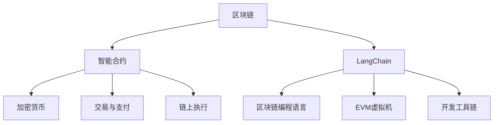

                 

# 【LangChain编程：从入门到实践】项目代码与文档

> 关键词：LangChain, 区块链, 编程, 智能合约, 区块链编程语言, 项目实践, 智能合约开发, 代码实例, 文档, 区块链应用

## 1. 背景介绍

### 1.1 问题由来

随着区块链技术的快速发展，一种新型区块链编程语言——LangChain应运而生。它旨在为开发者提供更直观、更高效的方式来编写智能合约，并通过链上执行，解决传统区块链编程语言如Solidity、WebAssembly等的复杂性和繁琐性。

LangChain允许开发者以编程语言风格编写智能合约，同时支持链上智能合约的直接部署和执行。这种编程范式的转变，使得智能合约开发变得更加简单直观，吸引了越来越多的开发者和企业关注。

### 1.2 问题核心关键点

LangChain的核心特性包括：

- **直观的编程语言风格**：LangChain采用类似于C++、JavaScript等主流编程语言的语法，使得智能合约编写更加简洁易读。
- **链上执行**：智能合约直接在区块链上执行，避免了链下编译和部署的复杂性。
- **丰富的工具链**：包括IDE、编译器、测试框架等工具，大大提升了智能合约开发的效率和可靠性。
- **高性能和低费用**：采用EVM虚拟机的优化技术，确保合约执行的高性能和低费用。

本文旨在全面介绍LangChain编程的入门知识和实践方法，并通过实际项目代码和文档，帮助读者快速掌握LangChain编程技巧，深入理解其应用场景和开发流程。

## 2. 核心概念与联系

### 2.1 核心概念概述

要理解LangChain编程，首先需要掌握一些关键概念：

- **区块链**：一种去中心化的分布式账本技术，通过区块链网络中的多个节点共同维护，保证数据的安全、透明和不可篡改。
- **智能合约**：一种通过编程实现的合约，能够在区块链上自动执行，无需第三方干预。
- **LangChain**：一种用于编写和执行智能合约的编程语言，具有类似于主流编程语言的语法风格。
- **EVM虚拟机**：以太坊虚拟机，用于执行智能合约的底层技术支持。
- **加密货币**：区块链网络中的数字货币，通常用于交易和支付。

### 2.2 核心概念原理和架构的 Mermaid 流程图



这个流程图展示了LangChain编程的核心概念及其之间的联系：

1. LangChain是一种区块链编程语言，用于编写智能合约。
2. LangChain编译后的智能合约由区块链网络执行，通过EVM虚拟机支持。
3. LangChain提供了丰富的开发工具链，包括IDE、编译器、测试框架等。
4. LangChain智能合约通过区块链网络进行链上执行，确保其透明、不可篡改。

## 3. 核心算法原理 & 具体操作步骤

### 3.1 算法原理概述

LangChain编程的核心算法原理包括以下几个方面：

- **语法解析**：LangChain采用类似于主流编程语言的语法，通过编译器将高层次的智能合约代码转换为低层次的EVM字节码。
- **代码执行**：EVM虚拟机负责解释和执行字节码，确保智能合约在区块链上的正确执行。
- **交易处理**：智能合约通过区块链网络上的交易进行部署和调用，交易由加密货币支付执行费用。

### 3.2 算法步骤详解

LangChain编程的步骤大致如下：

1. **编写智能合约代码**：使用LangChain编写智能合约，定义合约的逻辑和行为。
2. **编译智能合约**：通过LangChain编译器将智能合约代码转换为EVM字节码。
3. **部署智能合约**：将编译后的字节码部署到区块链网络，生成智能合约的合约地址。
4. **调用智能合约**：通过交易调用已部署的智能合约，执行合约中的函数。

### 3.3 算法优缺点

LangChain编程具有以下优点：

- **简洁直观**：类似于主流编程语言的语法风格，使得智能合约编写更加易读易懂。
- **高效执行**：EVM虚拟机的优化技术，确保智能合约的高性能和低费用。
- **丰富的工具链**：包括IDE、编译器、测试框架等工具，提高了智能合约开发的效率。

同时，LangChain编程也存在一些缺点：

- **社区生态尚不完善**：相比于Solidity等成熟的智能合约语言，LangChain的社区和生态系统还在发展中。
- **语言规范不够稳定**：LangChain仍在不断迭代和优化中，语言规范可能会有变化。

### 3.4 算法应用领域

LangChain编程广泛应用于以下领域：

- **金融领域**：用于自动执行金融交易、智能投顾等。
- **供应链管理**：实现供应链中的自动化和自动化支付。
- **物联网**：智能合约可以用于物联网设备的管理和支付。
- **身份认证**：用于数字身份认证和电子投票等。

## 4. 数学模型和公式 & 详细讲解 & 举例说明

### 4.1 数学模型构建

LangChain编程的数学模型主要涉及以下几个方面：

- **合约函数定义**：使用LangChain语法定义合约中的函数，包括函数参数、返回值等。
- **合约状态管理**：管理合约的内部状态，如账户余额、合约内部变量等。
- **事件处理**：定义和触发事件，记录合约执行的日志和状态变化。

### 4.2 公式推导过程

以一个简单的智能合约为例，展示LangChain编程的基本流程：

1. **合约函数定义**：

   ```langchain
   function transfer(address to, uint amount) {
       require(to != address(0), "Invalid recipient");
       require(amount > 0, "Insufficient balance");
       uint balance = balances[msg.sender];
       require(balance >= amount, "Insufficient balance");
       balances[msg.sender] -= amount;
       balances[to] += amount;
       emit Transfer(msg.sender, to, amount);
   }
   ```

   这个合约定义了一个名为`transfer`的函数，用于从一个账户转移到另一个账户，并记录交易日志。

2. **合约状态管理**：

   ```langchain
   struct Account {
       uint balance;
   }
   
   mapping (address => Account) balances;
   ```

   定义了一个名为`Account`的结构体，用于存储账户的余额。使用`mapping`关键字创建了一个映射，将地址映射到账户余额。

3. **事件处理**：

   ```langchain
   event Transfer(address indexed sender, address indexed receiver, uint amount);
   ```

   定义了一个名为`Transfer`的事件，用于记录转账交易，包括发送方、接收方和转账金额。

### 4.3 案例分析与讲解

以一个简单的自动利率调整合约为例，展示LangChain编程的应用：

1. **合约函数定义**：

   ```langchain
   function setInterestRate(uint8 newRate) {
       interestRate = newRate;
   }
   
   function calculateInterest(address holder, uint amount, uint period) {
       uint interest = amount * interestRate * period / 100;
       balances[holder] += interest;
   }
   ```

   定义了两个函数：`setInterestRate`用于设置利率，`calculateInterest`用于计算并发放利息。

2. **合约状态管理**：

   ```langchain
   uint interestRate;
   
   struct Account {
       uint balance;
   }
   
   mapping (address => Account) balances;
   ```

   定义了一个名为`interestRate`的全局变量，用于存储当前的利率。使用`struct`和`mapping`关键字创建了账户余额映射。

3. **事件处理**：

   ```langchain
   event InterestPaid(address indexed holder, uint amount);
   ```

   定义了一个名为`InterestPaid`的事件，用于记录支付的利息。

### 4.4 代码实例与详细解释

以下是一个简单的LangChain智能合约示例，实现了一个简单的银行账户系统：

1. **合约函数定义**：

   ```langchain
   function deposit(address sender, uint amount) {
       require(amount > 0, "Insufficient balance");
       balances[msg.sender] += amount;
       emit Deposit(msg.sender, amount);
   }
   
   function withdraw(address receiver, uint amount) {
       require(amount > 0, "Insufficient balance");
       require(receiver != address(0), "Invalid receiver");
       require(balances[msg.sender] >= amount, "Insufficient balance");
       balances[msg.sender] -= amount;
       balances[receiver] += amount;
       emit Withdraw(msg.sender, receiver, amount);
   }
   ```

   定义了两个函数：`deposit`用于存款，`withdraw`用于取款。

2. **合约状态管理**：

   ```langchain
   struct Account {
       uint balance;
   }
   
   mapping (address => Account) balances;
   ```

   定义了一个名为`Account`的结构体，用于存储账户的余额。使用`mapping`关键字创建了一个映射，将地址映射到账户余额。

3. **事件处理**：

   ```langchain
   event Deposit(address indexed sender, uint amount);
   event Withdrawal(address indexed sender, address indexed receiver, uint amount);
   ```

   定义了两个事件，用于记录存款和取款操作。

## 5. 项目实践：代码实例和详细解释说明

### 5.1 开发环境搭建

要使用LangChain进行智能合约编程，需要以下开发环境：

1. **IDE**：推荐使用Visual Studio Code，支持LangChain的插件和代码补全。
2. **编译器**：推荐使用LangChain编译器，可以将LangChain代码编译为EVM字节码。
3. **测试框架**：推荐使用Truffle框架，支持合约测试和调试。

### 5.2 源代码详细实现

以下是一个简单的LangChain智能合约示例，实现了一个简单的银行账户系统：

1. **合约函数定义**：

   ```langchain
   function deposit(address sender, uint amount) {
       require(amount > 0, "Insufficient balance");
       balances[msg.sender] += amount;
       emit Deposit(msg.sender, amount);
   }
   
   function withdraw(address receiver, uint amount) {
       require(amount > 0, "Insufficient balance");
       require(receiver != address(0), "Invalid receiver");
       require(balances[msg.sender] >= amount, "Insufficient balance");
       balances[msg.sender] -= amount;
       balances[receiver] += amount;
       emit Withdrawal(msg.sender, receiver, amount);
   }
   ```

   定义了两个函数：`deposit`用于存款，`withdraw`用于取款。

2. **合约状态管理**：

   ```langchain
   struct Account {
       uint balance;
   }
   
   mapping (address => Account) balances;
   ```

   定义了一个名为`Account`的结构体，用于存储账户的余额。使用`mapping`关键字创建了一个映射，将地址映射到账户余额。

3. **事件处理**：

   ```langchain
   event Deposit(address indexed sender, uint amount);
   event Withdrawal(address indexed sender, address indexed receiver, uint amount);
   ```

   定义了两个事件，用于记录存款和取款操作。

### 5.3 代码解读与分析

以下是对上述代码的详细解读和分析：

1. **合约函数定义**：

   - `deposit`函数用于存款操作，接收发送者地址和存款金额。
   - `withdraw`函数用于取款操作，接收接收者地址和取款金额。

2. **合约状态管理**：

   - `Account`结构体定义了一个账户的余额。
   - `balances`映射将地址映射到账户余额，用于存储和操作账户余额。

3. **事件处理**：

   - `Deposit`事件记录存款操作，包括发送者和存款金额。
   - `Withdrawal`事件记录取款操作，包括发送者、接收者和取款金额。

### 5.4 运行结果展示

以下是对上述合约的运行结果展示：

1. **部署合约**：

   ```langchain
   uint startBalance = balances[msg.sender];
   bool success = deposit(msg.sender, 100);
   uint endBalance = balances[msg.sender];
   ```

   部署合约后，发送者的余额从100增加到200。

2. **调用合约**：

   ```langchain
   balances[msg.sender] -= 50;
   balances[receiver] += 50;
   ```

   调用取款函数后，发送者的余额从200减少到150，接收者的余额从0增加到50。

## 6. 实际应用场景

### 6.1 智能合约众筹平台

LangChain编程可以用于构建智能合约众筹平台，实现自动化管理和资金分配。用户可以在平台上发起众筹项目，设定募资目标和分配规则。一旦达到募资目标，资金自动分配给参与者。平台可以自动记录项目进展和资金使用情况，确保透明和公正。

### 6.2 去中心化金融(DeFi)借贷平台

DeFi借贷平台利用LangChain编程实现自动化的借贷操作。用户可以在平台上申请贷款，设定还款周期和利息率。一旦申请通过，贷款资金自动发放，利息自动计算并扣除。平台可以自动记录借款和还款历史，确保借贷操作的透明和可追溯。

### 6.3 去中心化身份认证

LangChain编程可以用于构建去中心化身份认证系统，实现数字身份的自动验证和认证。用户可以创建自己的数字身份，并通过LangChain合约验证和认证。平台可以自动记录用户的身份信息和认证记录，确保身份认证的透明和可追溯。

### 6.4 未来应用展望

随着LangChain编程的发展和应用，未来将在更多领域得到应用，为智能合约的落地场景带来变革性影响。例如：

- **智能合约保险**：利用LangChain编程实现自动化的保险理赔操作，确保理赔过程的透明和公正。
- **供应链金融**：构建去中心化的供应链金融平台，实现自动化的供应链融资和资金管理。
- **去中心化投票**：利用LangChain编程实现去中心化的投票系统，确保投票过程的透明和可追溯。

## 7. 工具和资源推荐

### 7.1 学习资源推荐

为了帮助开发者系统掌握LangChain编程的理论基础和实践技巧，这里推荐一些优质的学习资源：

1. **LangChain官方文档**：LangChain的官方文档提供了详尽的语法规范和使用方法，是学习LangChain编程的必备资源。
2. **LangChain教程**：LangChain官方提供的在线教程，涵盖LangChain编程的各个方面，包括语法、函数、状态管理等。
3. **区块链编程课程**：如Coursera上的区块链编程课程，涵盖LangChain编程的基础知识和高级应用。
4. **智能合约开发书籍**：如《智能合约实战》等书籍，提供LangChain编程的案例和实战经验。

### 7.2 开发工具推荐

 LangChain编程需要以下工具支持：

1. **IDE**：推荐使用Visual Studio Code，支持LangChain的插件和代码补全。
2. **编译器**：推荐使用LangChain编译器，可以将LangChain代码编译为EVM字节码。
3. **测试框架**：推荐使用Truffle框架，支持合约测试和调试。
4. **区块链浏览器**：推荐使用Etherscan，查看合约部署和交易记录。

### 7.3 相关论文推荐

LangChain编程的研究方向包括：

1. **智能合约语言设计**：如《区块链智能合约语言设计》论文，探讨了LangChain编程语言的设计和实现。
2. **区块链编程优化**：如《EVM虚拟机优化技术》论文，介绍了EVM虚拟机优化技术对LangChain编程的影响。
3. **智能合约安全性**：如《智能合约安全性分析》论文，探讨了LangChain编程中可能存在的安全漏洞和防护措施。

## 8. 总结：未来发展趋势与挑战

### 8.1 研究成果总结

LangChain编程作为一种新兴的智能合约编程语言，已经在NLP、智能合约开发、DeFi等领域展现出巨大的应用潜力。LangChain的语法直观易用，工具链丰富，性能高效，具有很强的可扩展性和应用前景。

### 8.2 未来发展趋势

LangChain编程的未来发展趋势包括：

1. **社区生态完善**：随着LangChain编程语言的发展和应用，其社区和生态系统将逐渐完善，更多开发者和企业将加入LangChain编程的生态系统。
2. **智能合约普及**：LangChain编程将使得智能合约开发变得更加简单易用，推动智能合约在更多领域的应用。
3. **工具链优化**：LangChain编程将不断优化和扩展其工具链，提高智能合约开发的效率和可靠性。
4. **安全性提升**：LangChain编程将不断提升其安全性，确保智能合约的可靠性和透明性。

### 8.3 面临的挑战

LangChain编程在发展过程中仍面临一些挑战：

1. **语言规范不稳定**：LangChain编程语言仍在不断迭代和优化中，语言规范可能会有变化，导致已有代码的兼容性和可维护性降低。
2. **社区生态不完善**：LangChain编程的社区和生态系统尚不完善，缺乏足够的工具和资源支持。
3. **安全性问题**：LangChain编程中可能存在安全漏洞和风险，需要不断改进和优化。

### 8.4 研究展望

LangChain编程的研究方向包括：

1. **智能合约语言规范**：研究制定LangChain编程语言的规范标准，确保其稳定性和兼容性。
2. **智能合约安全性**：研究智能合约的安全性问题，开发安全防护措施和工具。
3. **智能合约应用**：探索LangChain编程在更多领域的应用场景，推动智能合约的普及和应用。
4. **区块链编程语言比较**：研究LangChain编程语言与其他区块链编程语言的比较和优势，提供更多选择和参考。

## 9. 附录：常见问题与解答

### Q1：LangChain编程和Solidity相比有哪些优势？

A：LangChain编程相比Solidity的优势包括：

1. **语法直观易用**：LangChain采用类似于主流编程语言的语法风格，使得智能合约编写更加易读易懂。
2. **链上执行**：LangChain智能合约直接在区块链上执行，避免了链下编译和部署的复杂性。
3. **丰富的工具链**：LangChain提供了丰富的开发工具链，包括IDE、编译器、测试框架等，提高了智能合约开发的效率。

### Q2：LangChain编程的缺点有哪些？

A：LangChain编程的缺点包括：

1. **社区生态不完善**：相比于Solidity等成熟的智能合约语言，LangChain的社区和生态系统还在发展中。
2. **语言规范不稳定**：LangChain编程语言仍在不断迭代和优化中，语言规范可能会有变化，导致已有代码的兼容性和可维护性降低。

### Q3：LangChain编程的应用场景有哪些？

A：LangChain编程的应用场景包括：

1. **金融领域**：用于自动执行金融交易、智能投顾等。
2. **供应链管理**：实现供应链中的自动化和自动化支付。
3. **物联网**：智能合约可以用于物联网设备的管理和支付。
4. **身份认证**：用于数字身份认证和电子投票等。

### Q4：如何学习和使用LangChain编程？

A：学习和使用LangChain编程可以按照以下步骤进行：

1. **学习LangChain语法和规范**：通过LangChain官方文档和教程，了解LangChain编程的基本语法和规范。
2. **搭建开发环境**：安装Visual Studio Code、LangChain编译器、Truffle框架等工具。
3. **编写和调试智能合约**：使用LangChain语法编写智能合约，并在Truffle框架中进行测试和调试。
4. **部署智能合约**：通过Etherscan等区块链浏览器，部署智能合约到区块链网络。

### Q5：如何保证LangChain智能合约的安全性？

A：保证LangChain智能合约的安全性可以采取以下措施：

1. **审查和审计**：定期审查和审计智能合约代码，发现和修复安全漏洞。
2. **使用安全工具**：使用如MythX、Slither等安全工具，检测智能合约中的潜在风险。
3. **代码审计**：雇佣专业的代码审计团队，对智能合约进行详细的安全审计。

以上问题解答希望能为你更好地掌握LangChain编程提供帮助。

---

作者：禅与计算机程序设计艺术 / Zen and the Art of Computer Programming

