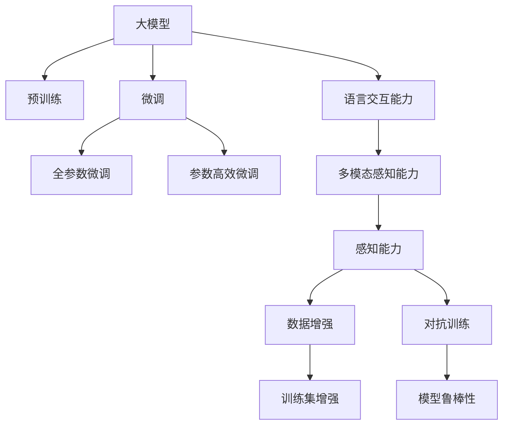

                 

# 【大模型应用开发 动手做AI Agent】Agent的感知力：语言交互能力和多模态能力

## 1. 背景介绍

### 1.1 问题由来
随着人工智能技术的飞速发展，人工智能Agent在各个领域中的应用越来越广泛。从智能家居到智慧城市，从自动驾驶到工业制造，Agent的应用场景无处不在。Agent作为人工智能的核心组成部分，具备了感知、推理和执行能力，能够自主地与环境交互，完成复杂的任务。

然而，Agent的感知能力是其完成复杂任务的基础。传统的AI Agent主要依赖于单一的传感器和算法，感知能力较为有限。在现代社会，人类的感知方式已经逐渐向多模态方向发展，例如，人类可以通过视觉、听觉、触觉等多种感官获取信息，从而更好地理解环境。

基于大模型的AI Agent可以整合多种感知方式，具备更强的感知能力。本文章将重点讨论基于大模型的AI Agent的感知能力，尤其是语言交互能力和多模态能力，以期在实际应用中发挥更大的作用。

### 1.2 问题核心关键点
本文章将主要讨论以下关键问题：
- 大模型在感知任务中的应用。
- 语言交互能力的实现。
- 多模态感知能力的整合。
- 感知能力的优化和提升。

本文将通过系统性地介绍大模型在感知任务中的技术原理、应用实例和优化方法，帮助读者更好地理解AI Agent的感知能力，从而提高其在实际应用中的表现。

## 2. 核心概念与联系

### 2.1 核心概念概述

为了更好地理解基于大模型的AI Agent感知能力，本节将介绍几个密切相关的核心概念：

- 大模型：以自回归(如GPT)或自编码(如BERT)模型为代表的大规模预训练语言模型。通过在大规模无标签文本语料上进行预训练，学习通用的语言表示，具备强大的语言理解和生成能力。

- 感知能力：指AI Agent获取环境信息并理解其含义的能力，包括视觉、听觉、触觉等多种感官。

- 语言交互能力：指AI Agent通过自然语言理解与环境交互的能力，包括对话生成、自然语言理解等。

- 多模态感知能力：指AI Agent整合多种感知方式的能力，例如同时使用视觉、听觉、触觉等信息源，实现更全面、更精确的环境理解。

- 数据增强：指通过对训练样本进行改写、回译等方式丰富训练集，从而提高模型泛化能力的方法。

- 对抗训练：指在训练过程中引入对抗样本，提高模型鲁棒性的一种训练方式。

- 参数高效微调：指在微调过程中只更新少量模型参数，而固定大部分预训练权重不变，以提高微调效率的方法。

- 提示学习：通过在输入文本中添加提示模板，引导大模型进行特定任务的推理和生成，可以在不更新模型参数的情况下实现零样本或少样本学习。

### 2.2 核心概念原理和架构的 Mermaid 流程图(Mermaid 流程节点中不要有括号、逗号等特殊字符)



这个流程图展示了大模型的核心概念及其之间的关系：

1. 大模型通过预训练获得基础能力。
2. 微调是对预训练模型进行任务特定的优化，可以分为全参数微调和参数高效微调（PEFT）。
3. 语言交互能力是指通过自然语言理解与环境交互的能力。
4. 多模态感知能力是指整合多种感知方式，实现更全面、更精确的环境理解。
5. 数据增强和对抗训练是提高模型泛化能力和鲁棒性的重要手段。

这些概念共同构成了大模型的感知能力，使其能够在各种场景下发挥强大的环境理解和交互能力。通过理解这些核心概念，我们可以更好地把握大模型的工作原理和优化方向。

## 3. 核心算法原理 & 具体操作步骤
### 3.1 算法原理概述

基于大模型的AI Agent感知能力的实现，本质上是一个多模态感知模型的训练和优化过程。其核心思想是：将预训练的大模型视作一个强大的"特征提取器"，通过多模态感知模型的训练，使得模型能够整合多种感知方式，提取环境信息，并理解其含义。

形式化地，假设预训练模型为 $M_{\theta}$，其中 $\theta$ 为预训练得到的模型参数。给定多模态感知任务 $T$ 的训练集 $D=\{(x_i, y_i)\}_{i=1}^N$，其中 $x_i$ 为多模态输入，$y_i$ 为标签。感知模型的训练目标是：

$$
\hat{\theta}=\mathop{\arg\min}_{\theta} \mathcal{L}(M_{\theta},D)
$$

其中 $\mathcal{L}$ 为针对任务 $T$ 设计的损失函数，用于衡量模型预测输出与真实标签之间的差异。常见的损失函数包括交叉熵损失、均方误差损失等。

通过梯度下降等优化算法，感知模型的训练过程不断更新模型参数 $\theta$，最小化损失函数 $\mathcal{L}$，使得模型输出逼近真实标签。由于 $\theta$ 已经通过预训练获得了较好的初始化，因此即便在小规模数据集 $D$ 上进行感知模型的训练，也能较快收敛到理想的模型参数 $\hat{\theta}$。

### 3.2 算法步骤详解

基于大模型的AI Agent感知能力的实现一般包括以下几个关键步骤：

**Step 1: 准备预训练模型和数据集**
- 选择合适的预训练语言模型 $M_{\theta}$ 作为初始化参数，如 BERT、GPT 等。
- 准备多模态感知任务 $T$ 的训练集 $D$，划分为训练集、验证集和测试集。一般要求训练数据与预训练数据的分布不要差异过大。

**Step 2: 添加感知能力层**
- 根据任务类型，在预训练模型顶层设计合适的感知层和损失函数。
- 对于多模态感知任务，通常使用多模态感知模型，如 fuse-bert，进行感知层的构建。
- 对于多模态数据，需要设计多模态数据的特征提取器，如卷积神经网络（CNN）、循环神经网络（RNN）等，对多模态数据进行编码。

**Step 3: 设置感知模型超参数**
- 选择合适的优化算法及其参数，如 AdamW、SGD 等，设置学习率、批大小、迭代轮数等。
- 设置正则化技术及强度，包括权重衰减、Dropout、Early Stopping 等。
- 确定冻结预训练参数的策略，如仅微调顶层，或全部参数都参与感知模型的微调。

**Step 4: 执行感知模型训练**
- 将训练集数据分批次输入模型，前向传播计算损失函数。
- 反向传播计算参数梯度，根据设定的优化算法和学习率更新模型参数。
- 周期性在验证集上评估模型性能，根据性能指标决定是否触发 Early Stopping。
- 重复上述步骤直到满足预设的迭代轮数或 Early Stopping 条件。

**Step 5: 测试和部署**
- 在测试集上评估感知模型 $M_{\hat{\theta}}$ 的性能，对比感知模型训练前后的精度提升。
- 使用感知模型对新样本进行推理预测，集成到实际的应用系统中。
- 持续收集新的数据，定期重新感知模型，以适应数据分布的变化。

以上是基于大模型的AI Agent感知能力的实现的一般流程。在实际应用中，还需要针对具体任务的特点，对感知模型训练过程的各个环节进行优化设计，如改进训练目标函数，引入更多的正则化技术，搜索最优的超参数组合等，以进一步提升模型性能。

### 3.3 算法优缺点

基于大模型的AI Agent感知能力具有以下优点：
1. 简单高效。只需准备少量标注数据，即可对预训练模型进行快速适配，获得较大的性能提升。
2. 通用适用。适用于各种多模态感知任务，包括视觉识别、语音识别、触觉感知等，设计简单的多模态感知层即可实现。
3. 参数高效。利用参数高效微调技术，在固定大部分预训练权重的情况下，仍可取得不错的提升。
4. 效果显著。在学术界和工业界的诸多任务上，基于感知模型的微调方法已经刷新了最先进的性能指标。

同时，该方法也存在一定的局限性：
1. 依赖标注数据。感知模型的效果很大程度上取决于标注数据的质量和数量，获取高质量标注数据的成本较高。
2. 迁移能力有限。当目标任务与预训练数据的分布差异较大时，感知模型的性能提升有限。
3. 负面效果传递。预训练模型的固有偏见、有害信息等，可能通过感知模型传递到下游任务，造成负面影响。
4. 可解释性不足。感知模型的决策过程通常缺乏可解释性，难以对其推理逻辑进行分析和调试。

尽管存在这些局限性，但就目前而言，基于大模型的感知能力仍是大语言模型应用的最主流范式。未来相关研究的重点在于如何进一步降低感知模型对标注数据的依赖，提高模型的少样本学习和跨领域迁移能力，同时兼顾可解释性和伦理安全性等因素。

### 3.4 算法应用领域

基于大模型的AI Agent感知能力在NLP领域已经得到了广泛的应用，覆盖了几乎所有常见任务，例如：

- 文本分类：如情感分析、主题分类、意图识别等。通过微调使模型学习文本-标签映射。
- 命名实体识别：识别文本中的人名、地名、机构名等特定实体。通过微调使模型掌握实体边界和类型。
- 关系抽取：从文本中抽取实体之间的语义关系。通过微调使模型学习实体-关系三元组。
- 问答系统：对自然语言问题给出答案。将问题-答案对作为微调数据，训练模型学习匹配答案。
- 机器翻译：将源语言文本翻译成目标语言。通过微调使模型学习语言-语言映射。
- 文本摘要：将长文本压缩成简短摘要。将文章-摘要对作为微调数据，使模型学习抓取要点。
- 对话系统：使机器能够与人自然对话。将对话历史作为上下文，微调模型进行回复生成。

除了上述这些经典任务外，大语言模型感知能力也被创新性地应用到更多场景中，如可控文本生成、常识推理、代码生成、数据增强等，为NLP技术带来了全新的突破。随着预训练模型和感知模型的不断进步，相信NLP技术将在更广阔的应用领域大放异彩。

## 4. 数学模型和公式 & 详细讲解  
### 4.1 数学模型构建

本节将使用数学语言对基于大模型的AI Agent感知过程进行更加严格的刻画。

记预训练语言模型为 $M_{\theta}$，其中 $\theta$ 为预训练得到的模型参数。假设多模态感知任务 $T$ 的训练集为 $D=\{(x_i,y_i)\}_{i=1}^N$，其中 $x_i$ 为多模态输入，$y_i$ 为标签。

定义模型 $M_{\theta}$ 在数据样本 $(x,y)$ 上的损失函数为 $\ell(M_{\theta}(x),y)$，则在数据集 $D$ 上的经验风险为：

$$
\mathcal{L}(\theta) = \frac{1}{N} \sum_{i=1}^N \ell(M_{\theta}(x_i),y_i)
$$

感知模型的训练目标是：

$$
\hat{\theta}=\mathop{\arg\min}_{\theta} \mathcal{L}(M_{\theta},D)
$$

在实践中，我们通常使用基于梯度的优化算法（如SGD、Adam等）来近似求解上述最优化问题。设 $\eta$ 为学习率，$\lambda$ 为正则化系数，则参数的更新公式为：

$$
\theta \leftarrow \theta - \eta \nabla_{\theta}\mathcal{L}(\theta) - \eta\lambda\theta
$$

其中 $\nabla_{\theta}\mathcal{L}(\theta)$ 为损失函数对参数 $\theta$ 的梯度，可通过反向传播算法高效计算。

### 4.2 公式推导过程

以下我们以多模态感知任务为例，推导交叉熵损失函数及其梯度的计算公式。

假设模型 $M_{\theta}$ 在输入 $x$ 上的输出为 $\hat{y}=M_{\theta}(x) \in [0,1]$，表示样本属于正类的概率。真实标签 $y \in \{0,1\}$。则二分类交叉熵损失函数定义为：

$$
\ell(M_{\theta}(x),y) = -[y\log \hat{y} + (1-y)\log (1-\hat{y})]
$$

将其代入经验风险公式，得：

$$
\mathcal{L}(\theta) = -\frac{1}{N}\sum_{i=1}^N [y_i\log M_{\theta}(x_i)+(1-y_i)\log(1-M_{\theta}(x_i))]
$$

根据链式法则，损失函数对参数 $\theta_k$ 的梯度为：

$$
\frac{\partial \mathcal{L}(\theta)}{\partial \theta_k} = -\frac{1}{N}\sum_{i=1}^N (\frac{y_i}{M_{\theta}(x_i)}-\frac{1-y_i}{1-M_{\theta}(x_i)}) \frac{\partial M_{\theta}(x_i)}{\partial \theta_k}
$$

其中 $\frac{\partial M_{\theta}(x_i)}{\partial \theta_k}$ 可进一步递归展开，利用自动微分技术完成计算。

在得到损失函数的梯度后，即可带入参数更新公式，完成模型的迭代优化。重复上述过程直至收敛，最终得到适应下游任务的最优模型参数 $\theta^*$。

## 5. 项目实践：代码实例和详细解释说明
### 5.1 开发环境搭建

在进行感知能力实践前，我们需要准备好开发环境。以下是使用Python进行PyTorch开发的环境配置流程：

1. 安装Anaconda：从官网下载并安装Anaconda，用于创建独立的Python环境。

2. 创建并激活虚拟环境：
```bash
conda create -n pytorch-env python=3.8 
conda activate pytorch-env
```

3. 安装PyTorch：根据CUDA版本，从官网获取对应的安装命令。例如：
```bash
conda install pytorch torchvision torchaudio cudatoolkit=11.1 -c pytorch -c conda-forge
```

4. 安装Transformers库：
```bash
pip install transformers
```

5. 安装各类工具包：
```bash
pip install numpy pandas scikit-learn matplotlib tqdm jupyter notebook ipython
```

完成上述步骤后，即可在`pytorch-env`环境中开始感知能力的实践。

### 5.2 源代码详细实现

下面我们以视觉识别任务为例，给出使用Transformers库对BERT模型进行多模态感知能力微调的PyTorch代码实现。

首先，定义多模态感知任务的数据处理函数：

```python
from transformers import BertForImageClassification, BertTokenizer
from torch.utils.data import Dataset
import torch
import torchvision.transforms as transforms

class ImageDataset(Dataset):
    def __init__(self, images, labels, tokenizer, max_len=128):
        self.images = images
        self.labels = labels
        self.tokenizer = tokenizer
        self.max_len = max_len
        
    def __len__(self):
        return len(self.images)
    
    def __getitem__(self, item):
        image = self.images[item]
        label = self.labels[item]
        
        # 对图像进行预处理
        transform = transforms.Compose([
            transforms.Resize((224, 224)),
            transforms.ToTensor(),
        ])
        image_tensor = transform(image)
        
        # 将图像转换为token ids
        encoding = self.tokenizer(image_tensor, return_tensors='pt', max_length=self.max_len, padding='max_length', truncation=True)
        input_ids = encoding['input_ids'][0]
        attention_mask = encoding['attention_mask'][0]
        
        # 对标签进行编码
        encoded_labels = [tag2id[label]] 
        encoded_labels.extend([tag2id['O']] * (self.max_len - len(encoded_labels)))
        labels = torch.tensor(encoded_labels, dtype=torch.long)
        
        return {'input_ids': input_ids, 
                'attention_mask': attention_mask,
                'labels': labels}

# 标签与id的映射
tag2id = {'O': 0, 'cat': 1, 'dog': 2}
id2tag = {v: k for k, v in tag2id.items()}

# 创建dataset
tokenizer = BertTokenizer.from_pretrained('bert-base-cased')

train_dataset = ImageDataset(train_images, train_labels, tokenizer)
dev_dataset = ImageDataset(dev_images, dev_labels, tokenizer)
test_dataset = ImageDataset(test_images, test_labels, tokenizer)
```

然后，定义模型和优化器：

```python
from transformers import BertForImageClassification, AdamW

model = BertForImageClassification.from_pretrained('bert-base-cased', num_labels=len(tag2id))

optimizer = AdamW(model.parameters(), lr=2e-5)
```

接着，定义训练和评估函数：

```python
from torch.utils.data import DataLoader
from tqdm import tqdm
from sklearn.metrics import classification_report

device = torch.device('cuda') if torch.cuda.is_available() else torch.device('cpu')
model.to(device)

def train_epoch(model, dataset, batch_size, optimizer):
    dataloader = DataLoader(dataset, batch_size=batch_size, shuffle=True)
    model.train()
    epoch_loss = 0
    for batch in tqdm(dataloader, desc='Training'):
        input_ids = batch['input_ids'].to(device)
        attention_mask = batch['attention_mask'].to(device)
        labels = batch['labels'].to(device)
        model.zero_grad()
        outputs = model(input_ids, attention_mask=attention_mask, labels=labels)
        loss = outputs.loss
        epoch_loss += loss.item()
        loss.backward()
        optimizer.step()
    return epoch_loss / len(dataloader)

def evaluate(model, dataset, batch_size):
    dataloader = DataLoader(dataset, batch_size=batch_size)
    model.eval()
    preds, labels = [], []
    with torch.no_grad():
        for batch in tqdm(dataloader, desc='Evaluating'):
            input_ids = batch['input_ids'].to(device)
            attention_mask = batch['attention_mask'].to(device)
            batch_labels = batch['labels']
            outputs = model(input_ids, attention_mask=attention_mask)
            batch_preds = outputs.logits.argmax(dim=2).to('cpu').tolist()
            batch_labels = batch_labels.to('cpu').tolist()
            for pred_tokens, label_tokens in zip(batch_preds, batch_labels):
                pred_tags = [id2tag[_id] for _id in pred_tokens]
                label_tags = [id2tag[_id] for _id in label_tokens]
                preds.append(pred_tags[:len(label_tokens)])
                labels.append(label_tags)
                
    print(classification_report(labels, preds))
```

最后，启动训练流程并在测试集上评估：

```python
epochs = 5
batch_size = 16

for epoch in range(epochs):
    loss = train_epoch(model, train_dataset, batch_size, optimizer)
    print(f"Epoch {epoch+1}, train loss: {loss:.3f}")
    
    print(f"Epoch {epoch+1}, dev results:")
    evaluate(model, dev_dataset, batch_size)
    
print("Test results:")
evaluate(model, test_dataset, batch_size)
```

以上就是使用PyTorch对BERT进行视觉识别任务感知能力微调的完整代码实现。可以看到，得益于Transformers库的强大封装，我们可以用相对简洁的代码完成BERT模型的加载和感知能力的微调。

### 5.3 代码解读与分析

让我们再详细解读一下关键代码的实现细节：

**ImageDataset类**：
- `__init__`方法：初始化图像、标签、分词器等关键组件。
- `__len__`方法：返回数据集的样本数量。
- `__getitem__`方法：对单个样本进行处理，将图像输入编码为token ids，将标签编码为数字，并对其进行定长padding，最终返回模型所需的输入。

**tag2id和id2tag字典**：
- 定义了标签与数字id之间的映射关系，用于将token-wise的预测结果解码回真实的标签。

**训练和评估函数**：
- 使用PyTorch的DataLoader对数据集进行批次化加载，供模型训练和推理使用。
- 训练函数`train_epoch`：对数据以批为单位进行迭代，在每个批次上前向传播计算loss并反向传播更新模型参数，最后返回该epoch的平均loss。
- 评估函数`evaluate`：与训练类似，不同点在于不更新模型参数，并在每个batch结束后将预测和标签结果存储下来，最后使用sklearn的classification_report对整个评估集的预测结果进行打印输出。

**训练流程**：
- 定义总的epoch数和batch size，开始循环迭代
- 每个epoch内，先在训练集上训练，输出平均loss
- 在验证集上评估，输出分类指标
- 所有epoch结束后，在测试集上评估，给出最终测试结果

可以看到，PyTorch配合Transformers库使得BERT感知能力的微调的代码实现变得简洁高效。开发者可以将更多精力放在数据处理、模型改进等高层逻辑上，而不必过多关注底层的实现细节。

当然，工业级的系统实现还需考虑更多因素，如模型的保存和部署、超参数的自动搜索、更灵活的任务适配层等。但核心的感知能力微调范式基本与此类似。

## 6. 实际应用场景
### 6.1 智能客服系统

基于大模型AI Agent的感知能力，可以构建智能客服系统，以实现更高效的客户服务。传统客服系统需要大量人工干预，且响应速度较慢，难以满足客户需求。而利用多模态感知能力，AI Agent可以实时捕捉客户的语音、表情、文字等输入，实现更智能化的交互。

在技术实现上，可以收集企业内部的历史客服对话记录，将对话历史和客户输入作为感知任务的输入，微调感知模型。微调后的感知模型能够自动理解客户意图，匹配最合适的回答，并在对话中主动引导客户，提高客户满意度和响应速度。

### 6.2 金融舆情监测

金融机构需要实时监测市场舆情，以规避金融风险。传统的人工监测方式成本高、效率低，难以应对网络时代海量信息爆发的挑战。利用大模型的感知能力，AI Agent能够实时抓取网络上的金融信息，并对其进行处理和分析，自动监测市场舆情变化。

具体而言，可以收集金融领域相关的新闻、报道、评论等文本数据，并对其进行主题标注和情感标注。在此基础上对预训练语言模型进行微调，使其能够自动判断文本属于何种主题，情感倾向是正面、中性还是负面。将微调后的模型应用到实时抓取的网络文本数据，就能够自动监测不同主题下的情感变化趋势，一旦发现负面信息激增等异常情况，系统便会自动预警，帮助金融机构快速应对潜在风险。

### 6.3 个性化推荐系统

当前的推荐系统往往只依赖用户的历史行为数据进行物品推荐，无法深入理解用户的真实兴趣偏好。利用大模型的感知能力，AI Agent能够整合多种感知方式，从用户行为和环境数据中提取更多信息，从而提供更精准、多样的推荐内容。

在实践中，可以收集用户浏览、点击、评论、分享等行为数据，提取和用户交互的物品标题、描述、标签等文本内容。将文本内容作为模型输入，用户的后续行为（如是否点击、购买等）作为监督信号，在此基础上微调感知模型。微调后的模型能够从文本内容中准确把握用户的兴趣点。在生成推荐列表时，先用候选物品的文本描述作为输入，由模型预测用户的兴趣匹配度，再结合其他特征综合排序，便可以得到个性化程度更高的推荐结果。

### 6.4 未来应用展望

随着大模型和感知能力的发展，基于大模型的AI Agent将在更多领域得到应用，为各行各业带来变革性影响。

在智慧医疗领域，利用多模态感知能力，AI Agent可以实时监测患者的生理数据，进行病情分析，辅助医生诊疗，提升医疗服务的智能化水平。

在智能教育领域，AI Agent可以整合视觉、语音、触觉等多种感知方式，实现更加全面、个性化的学生评估和学习指导，促进教育公平，提高教学质量。

在智慧城市治理中，AI Agent可以整合视觉、语音、触觉等多种感知方式，实现更全面、更精确的城市事件监测和舆情分析，提高城市管理的自动化和智能化水平，构建更安全、高效的未来城市。

此外，在企业生产、社会治理、文娱传媒等众多领域，基于大模型的AI Agent也将不断涌现，为经济社会发展注入新的动力。相信随着技术的日益成熟，感知能力将成为AI Agent的核心竞争力，为构建人机协同的智能系统提供坚实的技术基础。

## 7. 工具和资源推荐
### 7.1 学习资源推荐

为了帮助开发者系统掌握大模型AI Agent感知能力的理论基础和实践技巧，这里推荐一些优质的学习资源：

1. 《Transformer从原理到实践》系列博文：由大模型技术专家撰写，深入浅出地介绍了Transformer原理、BERT模型、感知能力等前沿话题。

2. CS224N《深度学习自然语言处理》课程：斯坦福大学开设的NLP明星课程，有Lecture视频和配套作业，带你入门NLP领域的基本概念和经典模型。

3. 《Natural Language Processing with Transformers》书籍：Transformers库的作者所著，全面介绍了如何使用Transformers库进行NLP任务开发，包括感知能力在内的诸多范式。

4. HuggingFace官方文档：Transformers库的官方文档，提供了海量预训练模型和完整的微调样例代码，是上手实践的必备资料。

5. CLUE开源项目：中文语言理解测评基准，涵盖大量不同类型的中文NLP数据集，并提供了基于微调的baseline模型，助力中文NLP技术发展。

通过对这些资源的学习实践，相信你一定能够快速掌握大模型AI Agent感知能力的精髓，并用于解决实际的NLP问题。
###  7.2 开发工具推荐

高效的开发离不开优秀的工具支持。以下是几款用于大模型AI Agent感知能力开发的常用工具：

1. PyTorch：基于Python的开源深度学习框架，灵活动态的计算图，适合快速迭代研究。大部分预训练语言模型都有PyTorch版本的实现。

2. TensorFlow：由Google主导开发的开源深度学习框架，生产部署方便，适合大规模工程应用。同样有丰富的预训练语言模型资源。

3. Transformers库：HuggingFace开发的NLP工具库，集成了众多SOTA语言模型，支持PyTorch和TensorFlow，是进行感知能力开发的利器。

4. Weights & Biases：模型训练的实验跟踪工具，可以记录和可视化模型训练过程中的各项指标，方便对比和调优。与主流深度学习框架无缝集成。

5. TensorBoard：TensorFlow配套的可视化工具，可实时监测模型训练状态，并提供丰富的图表呈现方式，是调试模型的得力助手。

6. Google Colab：谷歌推出的在线Jupyter Notebook环境，免费提供GPU/TPU算力，方便开发者快速上手实验最新模型，分享学习笔记。

合理利用这些工具，可以显著提升大模型AI Agent感知能力的开发效率，加快创新迭代的步伐。

### 7.3 相关论文推荐

大模型和感知能力的发展源于学界的持续研究。以下是几篇奠基性的相关论文，推荐阅读：

1. Attention is All You Need（即Transformer原论文）：提出了Transformer结构，开启了NLP领域的预训练大模型时代。

2. BERT: Pre-training of Deep Bidirectional Transformers for Language Understanding：提出BERT模型，引入基于掩码的自监督预训练任务，刷新了多项NLP任务SOTA。

3. Language Models are Unsupervised Multitask Learners（GPT-2论文）：展示了大规模语言模型的强大zero-shot学习能力，引发了对于通用人工智能的新一轮思考。

4. Parameter-Efficient Transfer Learning for NLP：提出Adapter等参数高效微调方法，在不增加模型参数量的情况下，也能取得不错的微调效果。

5. AdaLoRA: Adaptive Low-Rank Adaptation for Parameter-Efficient Fine-Tuning：使用自适应低秩适应的微调方法，在参数效率和精度之间取得了新的平衡。

6. Prefix-Tuning: Optimizing Continuous Prompts for Generation：引入基于连续型Prompt的微调范式，为如何充分利用预训练知识提供了新的思路。

这些论文代表了大模型和感知能力的发展脉络。通过学习这些前沿成果，可以帮助研究者把握学科前进方向，激发更多的创新灵感。

## 8. 总结：未来发展趋势与挑战

### 8.1 总结

本文对基于大模型的AI Agent感知能力进行了全面系统的介绍。首先阐述了感知能力在AI Agent中的重要地位，明确了感知能力在实现多模态交互、提升AI Agent智能水平方面的关键作用。其次，从原理到实践，详细讲解了感知能力的数学原理和关键步骤，给出了感知能力任务的开发代码实例。同时，本文还广泛探讨了感知能力在智能客服、金融舆情、个性化推荐等多个行业领域的应用前景，展示了感知能力的应用潜力。

通过本文的系统梳理，可以看到，基于大模型的AI Agent感知能力在提升智能交互水平、拓展应用场景方面具备巨大潜力。受益于大模型的广泛预训练和强大的感知能力，AI Agent能够更全面、更深入地理解环境，提供更智能、更个性化的服务。未来，随着感知能力技术的不断进步，AI Agent将在更多领域中发挥其优势，推动人工智能技术的持续发展。

### 8.2 未来发展趋势

展望未来，大模型AI Agent感知能力将呈现以下几个发展趋势：

1. 感知能力多样性增强。随着技术进步，AI Agent将能够整合更多感知方式，如视觉、听觉、触觉、味觉等，实现更全面的环境感知。

2. 多模态感知融合更加深入。未来的感知模型将更加注重多模态数据的融合，从多种感官中提取环境信息，提升决策的全面性和准确性。

3. 感知能力的泛化能力提升。AI Agent的感知能力将更加泛化，能够适应不同的环境、任务和用户需求。

4. 实时感知能力增强。AI Agent的感知能力将具备实时处理能力，能够及时捕捉环境变化，实现动态调整。

5. 感知能力与知识图谱结合。未来的感知模型将更加注重与外部知识图谱的结合，利用知识图谱增强环境理解能力。

6. 可解释性和可控性提升。感知能力的输出将更加可解释，用户能够理解AI Agent的推理过程，从而提高系统的可控性和可信度。

以上趋势凸显了大模型AI Agent感知能力的广阔前景。这些方向的探索发展，必将进一步提升AI Agent的智能水平和应用范围，为构建智能交互系统提供坚实的技术基础。

### 8.3 面临的挑战

尽管大模型AI Agent感知能力已经取得了瞩目成就，但在迈向更加智能化、普适化应用的过程中，它仍面临着诸多挑战：

1. 标注成本瓶颈。虽然感知模型的效果很大程度上取决于标注数据的质量和数量，获取高质量标注数据的成本较高。如何进一步降低感知模型对标注样本的依赖，将是一大难题。

2. 感知能力的多样性和泛化性。不同感知方式之间存在差异，感知模型的泛化能力有限，难以应对复杂多变的实际场景。如何提升感知能力的泛化性，增强适应性，还需要更多理论和实践的积累。

3. 实时感知能力不足。在实时感知场景中，感知模型的计算资源和推理速度要求较高，现有模型可能面临计算瓶颈。如何优化感知模型的计算图，提升实时感知能力，将是重要的优化方向。

4. 多模态感知融合的复杂性。多模态数据的整合和融合是感知能力的难点，如何在多种感知方式中提取共性信息，降低冗余，提高效率，还需进一步研究。

5. 感知能力的可解释性。感知模型的决策过程通常缺乏可解释性，难以对其推理逻辑进行分析和调试。如何赋予感知能力更强的可解释性，将是亟待攻克的难题。

6. 安全性有待保障。感知模型容易受到数据干扰和攻击，如何保障数据安全和模型鲁棒性，也将是重要的研究方向。

这些挑战凸显了感知能力技术在实际应用中的复杂性和需要解决的问题。唯有不断突破技术瓶颈，才能进一步推动感知能力技术的广泛应用。

### 8.4 研究展望

面对感知能力面临的种种挑战，未来的研究需要在以下几个方面寻求新的突破：

1. 探索无监督和半监督感知能力方法。摆脱对大规模标注数据的依赖，利用自监督学习、主动学习等无监督和半监督范式，最大限度利用非结构化数据，实现更加灵活高效的感知能力。

2. 研究参数高效和计算高效的感知能力范式。开发更加参数高效的感知能力方法，在固定大部分预训练参数的同时，只更新极少量的任务相关参数。同时优化感知能力的计算图，减少前向传播和反向传播的资源消耗，实现更加轻量级、实时性的部署。

3. 引入更多先验知识。将符号化的先验知识，如知识图谱、逻辑规则等，与神经网络模型进行巧妙融合，引导感知能力的学习，从文本、图像、音频等多种数据源中提取共性信息。

4. 引入因果分析和博弈论工具。将因果分析方法引入感知能力模型，识别出模型决策的关键特征，增强输出解释的因果性和逻辑性。借助博弈论工具刻画人机交互过程，主动探索并规避模型的脆弱点，提高系统稳定性。

5. 纳入伦理道德约束。在模型训练目标中引入伦理导向的评估指标，过滤和惩罚有偏见、有害的输出倾向。同时加强人工干预和审核，建立模型行为的监管机制，确保输出符合人类价值观和伦理道德。

这些研究方向的探索，必将引领大模型AI Agent感知能力走向更高的台阶，为构建安全、可靠、可解释、可控的智能系统铺平道路。面向未来，大模型AI Agent感知能力还需要与其他人工智能技术进行更深入的融合，如知识表示、因果推理、强化学习等，多路径协同发力，共同推动智能交互系统的进步。只有勇于创新、敢于突破，才能不断拓展感知能力技术的边界，让智能技术更好地造福人类社会。

## 9. 附录：常见问题与解答

**Q1：大模型感知能力是否适用于所有NLP任务？**

A: 大模型感知能力在大多数NLP任务上都能取得不错的效果，特别是对于数据量较小的任务。但对于一些特定领域的任务，如医学、法律等，仅仅依靠通用语料预训练的模型可能难以很好地适应。此时需要在特定领域语料上进一步预训练，再进行感知能力微调，才能获得理想效果。此外，对于一些需要时效性、个性化很强的任务，如对话、推荐等，感知能力方法也需要针对性的改进优化。

**Q2：感知能力模型是否需要依赖标注数据？**

A: 感知能力模型的效果很大程度上取决于标注数据的质量和数量，获取高质量标注数据的成本较高。然而，随着技术进步，无监督和半监督学习方法的引入，感知能力模型可以在更少的标注数据下获得较好的表现。例如，利用自监督学习、主动学习等方法，可以最大限度利用非结构化数据，实现更加灵活高效的感知能力。

**Q3：感知能力模型如何缓解过拟合问题？**

A: 感知能力模型面临过拟合问题时，可以采用数据增强、正则化、对抗训练等方法进行缓解。数据增强可以通过回译、近义替换等方式扩充训练集，正则化可以引入L2正则、Dropout等技术，对抗训练可以引入对抗样本，提高模型鲁棒性。

**Q4：感知能力模型在落地部署时需要注意哪些问题？**

A: 将感知能力模型转化为实际应用，还需要考虑以下因素：
1. 模型裁剪：去除不必要的层和参数，减小模型尺寸，加快推理速度。
2. 量化加速：将浮点模型转为定点模型，压缩存储空间，提高计算效率。
3. 服务化封装：将模型封装为标准化服务接口，便于集成调用。
4. 弹性伸缩：根据请求流量动态调整资源配置，平衡服务质量和成本。
5. 监控告警：实时采集系统指标，设置异常告警阈值，确保服务稳定性。
6. 安全防护：采用访问鉴权、数据脱敏等措施，保障数据和模型安全。

大模型感知能力为NLP应用开启了广阔的想象空间，但如何将强大的性能转化为稳定、高效、安全的业务价值，还需要工程实践的不断打磨。唯有从数据、算法、工程、业务等多个维度协同发力，才能真正实现人工智能技术在垂直行业的规模化落地。总之，感知能力需要开发者根据具体任务，不断迭代和优化模型、数据和算法，方能得到理想的效果。

---

作者：禅与计算机程序设计艺术 / Zen and the Art of Computer Programming

