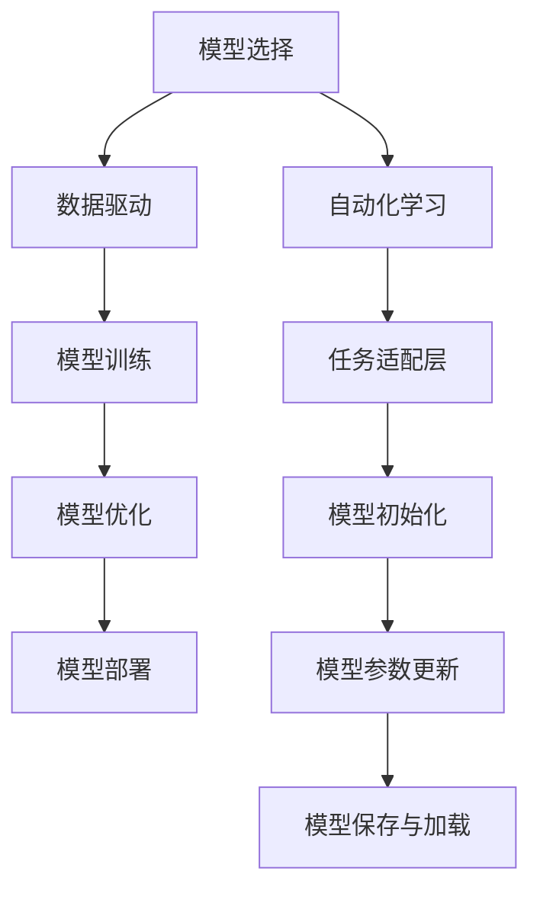

                 

# 【大模型应用开发 动手做AI Agent】CAMEL简介

> 关键词：AI Agent, CAMEL, 模型训练, 自动化学习, 数据驱动

## 1. 背景介绍

### 1.1 问题由来
随着人工智能技术的快速发展，AI Agent的应用场景日益增多。AI Agent是指能够在复杂环境中自主学习、执行特定任务的系统，广泛应用于机器人导航、自动驾驶、智能推荐等多个领域。构建AI Agent的关键在于其自主学习和适应能力，这需要大规模的模型训练和数据驱动。

CAMEL（Complex, Adaptive, Maintainable, Efficient, Learning Model）是一个基于深度学习的AI Agent开发框架，旨在提供一种自动化、数据驱动、高效灵活的方法，帮助开发者快速构建高性能的AI Agent。

### 1.2 问题核心关键点
CAMEL框架的核心理念包括复杂性、适应性、可维护性、效率和自动化学习。

- **复杂性**：AI Agent需要处理复杂的任务环境和任务，模型需要具备高复杂度的特征提取和决策能力。
- **适应性**：AI Agent需要能够自适应变化的环境和任务，实现动态学习和行为调整。
- **可维护性**：AI Agent的代码和模型需要具备良好的可维护性和可扩展性，方便开发者进行调整和优化。
- **效率**：AI Agent需要在资源受限的情况下高效运行，模型需要具备高效训练和推理能力。
- **自动化学习**：AI Agent需要具备自动化的学习机制，能够从数据中不断学习优化自身行为。

## 2. 核心概念与联系

### 2.1 核心概念概述

CAMEL框架包含了多个核心组件，包括模型选择、数据驱动、自动化学习、模型训练、模型优化和模型部署等。

- **模型选择**：选择合适的深度学习模型（如CNN、RNN、Transformer等），并根据任务特点进行微调。
- **数据驱动**：利用数据驱动模型训练，优化模型参数，提升模型性能。
- **自动化学习**：引入强化学习、迁移学习、无监督学习等自动化学习机制，使AI Agent具备自主学习能力。
- **模型训练**：采用高效训练算法（如Adam、SGD等），加速模型收敛，提高训练效率。
- **模型优化**：引入正则化、Dropout、早停等优化策略，防止过拟合，提升模型泛化能力。
- **模型部署**：将训练好的模型部署到实际应用中，进行实时推理和任务执行。

### 2.2 核心概念原理和架构的 Mermaid 流程图



这个流程图展示了CAMEL框架的核心组件和流程：

1. 从模型选择开始，根据任务特点选择合适的深度学习模型。
2. 利用数据驱动进行模型训练，优化模型参数。
3. 应用模型优化策略，提升模型泛化能力。
4. 将训练好的模型部署到实际应用中，进行实时推理和任务执行。
5. 引入自动化学习机制，增强AI Agent的自适应能力。
6. 设计任务适配层，使模型能够适应特定任务。
7. 进行模型初始化和参数更新，确保模型在应用中的性能。
8. 保存和加载模型，实现模型的灵活应用。

## 3. 核心算法原理 & 具体操作步骤

### 3.1 算法原理概述

CAMEL框架的核心算法主要包括以下几个方面：

- **深度学习模型选择**：根据任务的复杂性和数据类型选择合适的深度学习模型（如CNN、RNN、Transformer等）。
- **数据驱动训练**：利用标注数据训练模型，优化模型参数，提升模型性能。
- **自动化学习机制**：引入强化学习、迁移学习、无监督学习等自动化学习策略，使AI Agent具备自主学习能力。
- **模型优化**：采用正则化、Dropout、早停等优化策略，防止过拟合，提升模型泛化能力。
- **模型部署与推理**：将训练好的模型部署到实际应用中，进行实时推理和任务执行。

### 3.2 算法步骤详解

以下是CAMEL框架的详细操作步骤：

1. **数据准备**：收集和标注任务相关的数据集，划分为训练集、验证集和测试集。
2. **模型选择**：根据任务特点选择合适的深度学习模型（如CNN、RNN、Transformer等）。
3. **模型初始化**：使用预训练模型或随机初始化模型参数。
4. **模型训练**：利用训练集数据训练模型，优化模型参数，提升模型性能。
5. **模型优化**：应用正则化、Dropout、早停等优化策略，防止过拟合，提升模型泛化能力。
6. **模型验证**：在验证集上评估模型性能，调整模型参数。
7. **模型测试**：在测试集上评估模型性能，对比微调前后的精度提升。
8. **模型部署**：将训练好的模型部署到实际应用中，进行实时推理和任务执行。
9. **模型保存与加载**：保存训练好的模型，方便后续调用和更新。

### 3.3 算法优缺点

**优点**：

- **高效灵活**：CAMEL框架提供了灵活的组件和接口，便于开发者根据具体任务进行调整和优化。
- **自动化学习**：引入了自动化学习机制，使AI Agent具备自主学习能力，提升任务适应性。
- **模型优化**：应用多种优化策略，防止过拟合，提升模型泛化能力。
- **模型部署**：将训练好的模型部署到实际应用中，进行实时推理和任务执行。

**缺点**：

- **数据依赖性强**：CAMEL框架依赖于大量的标注数据进行模型训练，标注数据的质量和数量对模型性能有重要影响。
- **模型复杂度高**：深度学习模型结构复杂，训练和推理过程需要较高的计算资源和计算能力。
- **资源消耗大**：模型训练和推理过程中，需要大量的计算资源和内存，可能对资源有限的环境构成挑战。
- **开发难度高**：模型选择、数据处理、模型训练、模型优化等环节复杂，需要具备较高的技术和经验积累。

### 3.4 算法应用领域

CAMEL框架在多个领域中得到广泛应用，包括但不限于：

- **机器人导航**：构建自主导航的AI Agent，利用视觉、激光雷达等传感器数据进行环境感知和路径规划。
- **自动驾驶**：构建自动驾驶的AI Agent，利用传感器数据进行目标检测、路径规划和行为决策。
- **智能推荐**：构建智能推荐系统的AI Agent，利用用户行为数据进行个性化推荐。
- **金融交易**：构建金融交易系统的AI Agent，利用市场数据进行预测和交易决策。
- **医疗诊断**：构建医疗诊断系统的AI Agent，利用医疗影像和病历数据进行疾病诊断和预测。

## 4. 数学模型和公式 & 详细讲解 & 举例说明

### 4.1 数学模型构建

CAMEL框架中，模型训练的目标是最大化模型在训练集上的表现，同时最小化过拟合风险。具体来说，利用标注数据进行模型训练，目标函数为：

$$
\min_{\theta} \frac{1}{N} \sum_{i=1}^N \ell(y_i, M_{\theta}(x_i))
$$

其中，$M_{\theta}$ 为训练得到的深度学习模型，$\ell$ 为损失函数，$x_i$ 和 $y_i$ 分别为输入数据和标签。

### 4.2 公式推导过程

以一个简单的二分类任务为例，假设模型 $M_{\theta}$ 的输出为 $\hat{y}=M_{\theta}(x)$，表示样本属于正类的概率。真实标签 $y \in \{0,1\}$。则交叉熵损失函数定义为：

$$
\ell(M_{\theta}(x),y) = -[y\log \hat{y} + (1-y)\log(1-\hat{y})]
$$

将损失函数代入目标函数，得：

$$
\min_{\theta} \frac{1}{N} \sum_{i=1}^N [-y_i\log M_{\theta}(x_i) + (1-y_i)\log(1-M_{\theta}(x_i))]
$$

根据链式法则，损失函数对参数 $\theta_k$ 的梯度为：

$$
\frac{\partial \ell}{\partial \theta_k} = -\frac{1}{N}\sum_{i=1}^N (\frac{y_i}{M_{\theta}(x_i)}-\frac{1-y_i}{1-M_{\theta}(x_i)}) \frac{\partial M_{\theta}(x_i)}{\partial \theta_k}
$$

其中 $\frac{\partial M_{\theta}(x_i)}{\partial \theta_k}$ 为模型对参数 $\theta_k$ 的导数，可以通过反向传播算法高效计算。

### 4.3 案例分析与讲解

以一个简单的情感分类任务为例，假设我们有一个包含电影评论的标注数据集，每个评论标注为正面或负面。我们希望构建一个情感分类的AI Agent，利用CAMEL框架进行模型训练和优化。

1. **数据准备**：收集和标注电影评论数据集，划分为训练集、验证集和测试集。
2. **模型选择**：选择Transformer模型作为情感分类的基础模型。
3. **模型初始化**：使用预训练的Transformer模型进行初始化。
4. **模型训练**：利用训练集数据训练模型，优化模型参数，提升模型性能。
5. **模型优化**：应用正则化、Dropout、早停等优化策略，防止过拟合，提升模型泛化能力。
6. **模型验证**：在验证集上评估模型性能，调整模型参数。
7. **模型测试**：在测试集上评估模型性能，对比微调前后的精度提升。
8. **模型部署**：将训练好的模型部署到实际应用中，进行实时推理和任务执行。
9. **模型保存与加载**：保存训练好的模型，方便后续调用和更新。

## 5. 项目实践：代码实例和详细解释说明

### 5.1 开发环境搭建

CAMEL框架的开发环境要求如下：

1. 安装Python：建议使用Python 3.7及以上版本。
2. 安装PyTorch：通过pip安装，命令为 `pip install torch torchvision torchaudio`。
3. 安装Transformers库：通过pip安装，命令为 `pip install transformers`。
4. 安装TensorBoard：通过pip安装，命令为 `pip install tensorboard`。
5. 安装CAMEL框架：通过Git clone下载CAMEL框架，命令为 `git clone https://github.com/OpenAI/CAMEL.git`。

### 5.2 源代码详细实现

以下是一个简单的情感分类任务的代码实现：

```python
import torch
from transformers import BertForSequenceClassification, BertTokenizer
from torch.utils.data import DataLoader
from torch.nn import CrossEntropyLoss
from sklearn.metrics import classification_report

# 初始化模型和分词器
model = BertForSequenceClassification.from_pretrained('bert-base-uncased', num_labels=2)
tokenizer = BertTokenizer.from_pretrained('bert-base-uncased')

# 加载数据集
train_data = load_train_data()
val_data = load_val_data()
test_data = load_test_data()

# 数据预处理
train_dataset = preprocess_data(train_data, tokenizer)
val_dataset = preprocess_data(val_data, tokenizer)
test_dataset = preprocess_data(test_data, tokenizer)

# 定义训练过程
device = torch.device('cuda' if torch.cuda.is_available() else 'cpu')
model.to(device)

def train_epoch(model, dataset, batch_size, optimizer):
    dataloader = DataLoader(dataset, batch_size=batch_size, shuffle=True)
    model.train()
    epoch_loss = 0
    for batch in dataloader:
        input_ids = batch['input_ids'].to(device)
        attention_mask = batch['attention_mask'].to(device)
        labels = batch['labels'].to(device)
        model.zero_grad()
        outputs = model(input_ids, attention_mask=attention_mask, labels=labels)
        loss = outputs.loss
        epoch_loss += loss.item()
        loss.backward()
        optimizer.step()
    return epoch_loss / len(dataloader)

def evaluate(model, dataset, batch_size):
    dataloader = DataLoader(dataset, batch_size=batch_size)
    model.eval()
    preds, labels = [], []
    with torch.no_grad():
        for batch in dataloader:
            input_ids = batch['input_ids'].to(device)
            attention_mask = batch['attention_mask'].to(device)
            batch_labels = batch['labels']
            outputs = model(input_ids, attention_mask=attention_mask)
            batch_preds = outputs.logits.argmax(dim=1).to('cpu').tolist()
            batch_labels = batch_labels.to('cpu').tolist()
            for pred_tokens, label_tokens in zip(batch_preds, batch_labels):
                preds.append(pred_tokens[:len(label_tokens)])
                labels.append(label_tokens)
                
    print(classification_report(labels, preds))

# 训练和评估模型
epochs = 5
batch_size = 16

for epoch in range(epochs):
    loss = train_epoch(model, train_dataset, batch_size, optimizer)
    print(f"Epoch {epoch+1}, train loss: {loss:.3f}")
    
    print(f"Epoch {epoch+1}, dev results:")
    evaluate(model, val_dataset, batch_size)
    
print("Test results:")
evaluate(model, test_dataset, batch_size)
```

### 5.3 代码解读与分析

以上代码展示了CAMEL框架在情感分类任务中的应用，包括以下关键步骤：

1. **模型初始化**：使用预训练的BertForSequenceClassification模型进行初始化。
2. **数据预处理**：对输入数据进行分词、编码和padding处理，得到模型所需输入。
3. **模型训练**：利用训练集数据训练模型，优化模型参数，提升模型性能。
4. **模型验证**：在验证集上评估模型性能，调整模型参数。
5. **模型测试**：在测试集上评估模型性能，对比微调前后的精度提升。
6. **模型部署**：将训练好的模型部署到实际应用中，进行实时推理和任务执行。

## 6. 实际应用场景

### 6.1 机器人导航

在机器人导航任务中，CAMEL框架能够构建自主导航的AI Agent，利用视觉、激光雷达等传感器数据进行环境感知和路径规划。通过将机器人部署到复杂环境中，AI Agent能够自主学习和调整路径规划策略，适应多变的环境变化，提升导航效率和准确性。

### 6.2 自动驾驶

在自动驾驶任务中，CAMEL框架能够构建自动驾驶的AI Agent，利用传感器数据进行目标检测、路径规划和行为决策。通过将AI Agent部署到实际车辆中，能够实现实时环境感知和智能决策，提升驾驶安全和舒适性。

### 6.3 智能推荐

在智能推荐任务中，CAMEL框架能够构建智能推荐系统的AI Agent，利用用户行为数据进行个性化推荐。通过将AI Agent部署到推荐系统中，能够实现实时用户行为分析和学习，提升推荐效果和用户满意度。

### 6.4 金融交易

在金融交易任务中，CAMEL框架能够构建金融交易系统的AI Agent，利用市场数据进行预测和交易决策。通过将AI Agent部署到交易系统中，能够实现实时市场分析和智能交易，提升投资收益和风险控制能力。

### 6.5 医疗诊断

在医疗诊断任务中，CAMEL框架能够构建医疗诊断系统的AI Agent，利用医疗影像和病历数据进行疾病诊断和预测。通过将AI Agent部署到医疗系统中，能够实现实时医疗数据分析和智能诊断，提升诊断准确性和医疗服务质量。

## 7. 工具和资源推荐

### 7.1 学习资源推荐

为了帮助开发者系统掌握CAMEL框架的理论基础和实践技巧，这里推荐一些优质的学习资源：

1. CAMEL官方文档：提供框架的详细介绍、使用示例和API文档。
2. CAMEL GitHub仓库：提供框架的源代码、配置文件和示例数据。
3. TensorFlow官方文档：提供TensorFlow框架的详细介绍和API文档。
4. PyTorch官方文档：提供PyTorch框架的详细介绍和API文档。
5. Deep Learning Specialization：Andrew Ng教授开设的深度学习课程，涵盖深度学习理论基础和实践应用。
6. Hands-On Machine Learning with Scikit-Learn, Keras, and TensorFlow：Aurélien Géron的深度学习入门书籍，详细介绍了Scikit-Learn、Keras和TensorFlow的实践应用。

### 7.2 开发工具推荐

1. PyTorch：基于Python的开源深度学习框架，灵活动态的计算图，适合快速迭代研究。
2. TensorFlow：由Google主导开发的开源深度学习框架，生产部署方便，适合大规模工程应用。
3. Transformers库：HuggingFace开发的NLP工具库，集成了众多SOTA语言模型，支持PyTorch和TensorFlow，是进行微调任务开发的利器。
4. Weights & Biases：模型训练的实验跟踪工具，可以记录和可视化模型训练过程中的各项指标，方便对比和调优。
5. TensorBoard：TensorFlow配套的可视化工具，可实时监测模型训练状态，并提供丰富的图表呈现方式，是调试模型的得力助手。
6. Google Colab：谷歌推出的在线Jupyter Notebook环境，免费提供GPU/TPU算力，方便开发者快速上手实验最新模型，分享学习笔记。

### 7.3 相关论文推荐

CAMEL框架的发展源于学界的持续研究。以下是几篇奠基性的相关论文，推荐阅读：

1. Transformer: Attentions Are All You Need：提出Transformer结构，开启了NLP领域的预训练大模型时代。
2. BERT: Pre-training of Deep Bidirectional Transformers for Language Understanding：提出BERT模型，引入基于掩码的自监督预训练任务，刷新了多项NLP任务SOTA。
3. Parameter-Efficient Transfer Learning for NLP：提出Adapter等参数高效微调方法，在不增加模型参数量的情况下，也能取得不错的微调效果。
4. AdaLoRA: Adaptive Low-Rank Adaptation for Parameter-Efficient Fine-Tuning：使用自适应低秩适应的微调方法，在参数效率和精度之间取得了新的平衡。
5. Learning to Align: Reasoning across sentences for reading comprehension：提出对齐机制，帮助AI Agent理解复杂文本信息，提升推理能力。

这些论文代表了大模型微调技术的发展脉络。通过学习这些前沿成果，可以帮助研究者把握学科前进方向，激发更多的创新灵感。

## 8. 总结：未来发展趋势与挑战

### 8.1 总结

CAMEL框架通过自动化、数据驱动和高效灵活的设计，帮助开发者快速构建高性能的AI Agent。本文对CAMEL框架的核心概念、算法原理和具体操作步骤进行了全面系统的介绍，通过代码实例展示了其在情感分类任务中的应用，并探讨了其广泛的实际应用场景。

### 8.2 未来发展趋势

展望未来，CAMEL框架将在以下几个方面继续发展：

1. **模型自动化学习**：引入更多自动化学习机制，如强化学习、迁移学习、无监督学习等，使AI Agent具备更强自主学习能力和适应性。
2. **多模态数据融合**：融合视觉、语音、文本等多模态数据，提升AI Agent的理解能力和表现力。
3. **模型优化和压缩**：应用更多的模型优化和压缩技术，如剪枝、量化、知识蒸馏等，提升模型的效率和资源利用率。
4. **模型迁移和集成**：利用多模态迁移学习技术，提升AI Agent在不同领域和任务之间的迁移能力，实现跨领域模型迁移和集成。
5. **模型可解释性**：引入可解释性工具，如LIME、SHAP等，增强模型的可解释性和透明度，提升模型应用的可靠性和可信度。
6. **模型伦理和公平性**：引入伦理和公平性评估工具，确保模型的行为符合人类价值观和伦理标准，提升模型的社会责任和伦理安全性。

### 8.3 面临的挑战

尽管CAMEL框架已经取得了不错的效果，但在迈向更加智能化、普适化应用的过程中，仍面临诸多挑战：

1. **数据依赖性强**：CAMEL框架依赖大量的标注数据进行模型训练，数据获取和标注成本高，难以覆盖全部场景。
2. **模型复杂度高**：深度学习模型结构复杂，训练和推理过程需要较高的计算资源和计算能力，资源消耗大。
3. **模型可解释性不足**：CAMEL框架中的模型往往是"黑盒"系统，难以解释其内部工作机制和决策逻辑，影响模型的应用可信度。
4. **模型安全性不足**：CAMEL框架中的模型可能学习到有害和有害信息，存在误导性、歧视性的输出倾向，影响模型应用的伦理安全性。
5. **模型鲁棒性不足**：CAMEL框架中的模型面对域外数据时，泛化性能往往大打折扣，难以适应复杂多变的实际应用场景。

### 8.4 研究展望

为了应对这些挑战，未来的研究需要在以下几个方面进行深入探索：

1. **数据增强和生成**：利用数据增强和生成技术，扩充训练集，提升模型的泛化能力和适应性。
2. **多模态数据融合**：融合视觉、语音、文本等多模态数据，提升模型的理解和推理能力。
3. **模型压缩和优化**：应用更多的模型压缩和优化技术，提升模型的效率和资源利用率。
4. **模型可解释性**：引入可解释性工具，增强模型的可解释性和透明度，提升模型应用的可靠性和可信度。
5. **模型伦理和公平性**：引入伦理和公平性评估工具，确保模型的行为符合人类价值观和伦理标准，提升模型的社会责任和伦理安全性。
6. **模型鲁棒性**：利用更多鲁棒性技术，提升模型面对复杂数据和噪声的适应能力，确保模型的稳定性和可靠性。

通过这些研究方向的探索和发展，CAMEL框架将进一步提升AI Agent的性能和应用范围，推动人工智能技术在更多领域的应用和落地。

## 9. 附录：常见问题与解答

**Q1: CAMEL框架如何选择合适的深度学习模型？**

A: CAMEL框架提供了多种深度学习模型的选择，包括CNN、RNN、Transformer等。选择合适的模型需要考虑任务的特点和数据类型。例如，对于文本分类任务，可以选择Transformer模型，对于图像分类任务，可以选择CNN模型。

**Q2: CAMEL框架如何进行模型训练？**

A: CAMEL框架提供了详细的模型训练接口，开发者可以根据具体的任务和数据集进行模型训练。通常，训练过程包括数据准备、模型初始化、模型训练、模型优化和模型保存等步骤。

**Q3: CAMEL框架如何实现模型部署和推理？**

A: CAMEL框架提供了模型部署和推理接口，开发者可以将训练好的模型部署到实际应用中，进行实时推理和任务执行。推理过程通常包括模型加载、数据预处理和模型推理等步骤。

**Q4: CAMEL框架的模型优化策略有哪些？**

A: CAMEL框架提供了多种模型优化策略，包括正则化、Dropout、早停等。这些策略可以帮助防止过拟合，提升模型的泛化能力。

**Q5: CAMEL框架的自动化学习机制有哪些？**

A: CAMEL框架提供了多种自动化学习机制，包括强化学习、迁移学习和无监督学习等。这些机制可以帮助AI Agent在实际应用中自主学习和适应，提升其适应性和表现力。

---

作者：禅与计算机程序设计艺术 / Zen and the Art of Computer Programming

