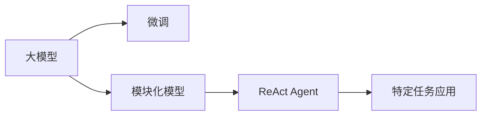

                 

# 【大模型应用开发 动手做AI Agent】LangChain中ReAct Agent 的实现

大模型技术正在迅速发展，并已广泛应用于自然语言处理、机器翻译、推荐系统等多个领域。LangChain是一个基于大模型的开源AI框架，旨在简化AI开发流程，让用户能够轻松地构建和部署AI应用。本文将详细介绍如何在LangChain中使用ReAct Agent实现大模型应用开发。

## 1. 背景介绍

### 1.1 问题由来
大模型技术近年来取得了显著进展，尤其是在自然语言处理领域。预训练大模型通过在海量无标签数据上进行训练，学习了丰富的语言知识，可以用于解决各种NLP任务。然而，大模型直接应用于特定任务时，通常需要大量的有标签数据进行微调，这往往耗时耗力且成本高昂。因此，如何高效利用大模型进行特定任务的应用开发，成为一个重要问题。

### 1.2 问题核心关键点
ReAct Agent是LangChain中用于特定任务应用的模块化模型。它将大模型的通用知识与任务相关的知识相结合，通过微调或改写大模型的中间层，实现任务的快速部署。ReAct Agent的使用步骤包括模型选择、配置、训练和部署，每个步骤都有详细的文档和示例。

## 2. 核心概念与联系

### 2.1 核心概念概述

为了更好地理解ReAct Agent的实现机制，本节将介绍几个关键概念：

- **大模型（Large Model）**：指通过大规模无标签数据预训练，并在特定任务上进行微调后的模型，如BERT、GPT等。
- **微调（Fine-Tuning）**：在大模型的基础上，使用少量有标签数据进行有监督学习，优化模型在特定任务上的性能。
- **模块化模型（Modular Model）**：指将大模型拆分为多个模块，每个模块负责不同的任务，通过组合和配置模块来适应新的任务。
- **ReAct Agent**：LangChain中的一个模块化模型，用于特定任务应用的快速部署。

这些概念之间的关系通过以下Mermaid流程图来展示：



这个流程图展示了从大模型到ReAct Agent的过程：首先通过预训练和微调获取大模型的通用知识，然后通过模块化模型将其拆分为多个模块，最后使用ReAct Agent将模块组合起来，快速部署到特定任务。

## 3. 核心算法原理 & 具体操作步骤

### 3.1 算法原理概述

ReAct Agent的实现原理基于大模型的模块化设计和微调技术。ReAct Agent通过将大模型拆分为多个模块，每个模块负责不同的任务，并通过微调优化这些模块，使其适应特定的任务。ReAct Agent的微调过程包括选择预训练模型、配置微调任务、选择微调数据集、设置微调参数等步骤。

### 3.2 算法步骤详解

以下是ReAct Agent微调的详细步骤：

1. **选择预训练模型**：选择合适的预训练模型作为ReAct Agent的初始化参数，如BERT、GPT等。
2. **配置微调任务**：根据任务类型，选择合适的微调任务和损失函数。例如，对于文本分类任务，可以选择交叉熵损失函数。
3. **选择微调数据集**：准备任务相关的有标签数据集，用于训练ReAct Agent。
4. **设置微调参数**：选择合适的优化算法、学习率、批大小、迭代轮数等参数。
5. **执行梯度训练**：将训练集数据分批次输入ReAct Agent，前向传播计算损失函数。
6. **反向传播更新参数**：计算参数梯度，根据优化算法和学习率更新ReAct Agent的参数。
7. **周期性验证**：在验证集上评估模型性能，根据性能指标决定是否停止训练。
8. **测试和部署**：在测试集上评估微调后ReAct Agent的性能，将其部署到实际应用系统中。

### 3.3 算法优缺点

ReAct Agent的优点包括：

- **快速部署**：通过微调预训练模型的中间层，可以快速适应新的任务，无需从头开始训练。
- **灵活性高**：模块化设计使得ReAct Agent可以适应多种任务，只需改变配置即可。
- **可扩展性**：通过添加或替换模块，可以逐步增加模型功能。

ReAct Agent的缺点包括：

- **依赖数据**：微调效果依赖于任务相关的有标签数据，数据获取成本较高。
- **过拟合风险**：如果微调数据集较小，模型可能出现过拟合现象。
- **计算资源需求高**：微调和优化过程中需要大量的计算资源。

### 3.4 算法应用领域

ReAct Agent可以应用于各种NLP任务，包括但不限于：

- **文本分类**：如情感分析、主题分类、垃圾邮件识别等。
- **命名实体识别**：识别文本中的人名、地名、组织名等实体。
- **关系抽取**：从文本中抽取实体之间的关系。
- **问答系统**：对自然语言问题给出答案。
- **机器翻译**：将源语言文本翻译成目标语言。
- **文本摘要**：将长文本压缩成简短摘要。

ReAct Agent还可以应用于多模态任务，如视觉文本结合、语音文本结合等，通过引入更多的模块和输入输出接口，实现更复杂的功能。

## 4. 数学模型和公式 & 详细讲解 & 举例说明

### 4.1 数学模型构建

ReAct Agent的微调过程可以通过以下数学模型来描述：

设预训练模型为 $M_{\theta}$，其中 $\theta$ 为预训练参数。对于微调任务 $T$，假设微调数据集为 $D=\{(x_i,y_i)\}_{i=1}^N$，其中 $x_i$ 为输入，$y_i$ 为标签。微调的目标是最小化损失函数 $\mathcal{L}$：

$$
\mathcal{L}(M_{\theta},D) = \frac{1}{N}\sum_{i=1}^N \ell(M_{\theta}(x_i),y_i)
$$

其中 $\ell$ 为任务相关的损失函数，如交叉熵损失。微调过程通过梯度下降等优化算法，最小化损失函数 $\mathcal{L}$，更新模型参数 $\theta$：

$$
\theta \leftarrow \theta - \eta \nabla_{\theta}\mathcal{L}(\theta)
$$

其中 $\eta$ 为学习率，$\nabla_{\theta}\mathcal{L}(\theta)$ 为损失函数对参数 $\theta$ 的梯度。

### 4.2 公式推导过程

以文本分类任务为例，假设预训练模型为BERT，微调任务为情感分类。BERT的输出层为softmax层，输出每个类别的概率。微调任务的目标是最小化交叉熵损失，即：

$$
\mathcal{L}(M_{\theta},D) = -\frac{1}{N}\sum_{i=1}^N \sum_{j=1}^C y_{ij}\log M_{\theta}(x_i)^j
$$

其中 $C$ 为类别数，$y_{ij}$ 为标签 $j$ 在样本 $i$ 上的指示变量。微调过程的优化目标为：

$$
\min_{\theta} \mathcal{L}(M_{\theta},D)
$$

使用梯度下降算法，更新模型参数：

$$
\theta \leftarrow \theta - \eta \nabla_{\theta}\mathcal{L}(\theta)
$$

其中 $\nabla_{\theta}\mathcal{L}(\theta)$ 可以通过反向传播算法计算得到。

### 4.3 案例分析与讲解

以情感分类任务为例，假设使用BERT模型，将预训练后的BERT嵌入层作为中间层，添加分类器作为输出层。分类器可以是一个全连接层，也可以是一个线性分类器。在微调过程中，只需要更新分类器的参数，保持BERT嵌入层的参数不变。

具体实现步骤如下：

1. **选择预训练模型**：选择BERT作为预训练模型。
2. **配置微调任务**：设置微调任务为情感分类，选择合适的损失函数和评估指标。
3. **选择微调数据集**：准备情感分类任务的有标签数据集。
4. **设置微调参数**：选择合适的优化算法、学习率、批大小等参数。
5. **执行梯度训练**：将训练集数据分批次输入模型，前向传播计算损失函数。
6. **反向传播更新参数**：计算参数梯度，根据优化算法和学习率更新分类器参数。
7. **周期性验证**：在验证集上评估模型性能，根据性能指标决定是否停止训练。
8. **测试和部署**：在测试集上评估微调后模型的性能，将其部署到实际应用系统中。

## 5. 项目实践：代码实例和详细解释说明

### 5.1 开发环境搭建

要进行ReAct Agent的微调，需要准备以下开发环境：

1. 安装Python：建议使用Python 3.7或以上版本。
2. 安装LangChain：使用pip安装LangChain，并确保版本与ReAct Agent兼容。
3. 安装所需的深度学习框架：建议使用TensorFlow或PyTorch，并确保版本与LangChain兼容。
4. 安装所需的数据集和预训练模型：可以从HuggingFace模型库或LangChain社区获取。

### 5.2 源代码详细实现

以下是一个使用ReAct Agent实现文本分类的示例代码：

```python
from langchain.agents import ReActAgent
from langchain.agents import TextClassificationReActAgent
from langchain.agents import CTCReActAgent

# 定义ReAct Agent
agent = TextClassificationReActAgent.from_pretrained('bert-base-uncased', 
                                                   category_labels=['negative', 'positive'])

# 加载微调数据集
train_dataset = ...
train_data = ...
train_labels = ...

# 训练ReAct Agent
model = agent.fit(train_data, train_labels, epochs=10)

# 评估ReAct Agent
eval_dataset = ...
eval_data = ...
eval_labels = ...
print(agent.evaluate(eval_data, eval_labels))
```

以上代码中，首先定义了一个使用BERT作为预训练模型的TextClassificationReActAgent，并设置了情感分类任务的两个类别标签。然后加载微调数据集，并使用fit方法训练ReAct Agent，最后使用evaluate方法评估模型性能。

### 5.3 代码解读与分析

ReAct Agent的实现涉及以下几个关键步骤：

1. **选择预训练模型**：使用HuggingFace提供的预训练模型，如BERT、GPT等。
2. **配置微调任务**：通过继承ReActAgent或其子类，设置微调任务和损失函数。
3. **选择微调数据集**：使用HuggingFace提供的预训练数据集或自定义数据集。
4. **设置微调参数**：设置优化算法、学习率、批大小等参数。
5. **执行梯度训练**：使用fit方法进行微调训练，自动计算梯度并更新参数。
6. **周期性验证**：在验证集上评估模型性能，根据性能指标决定是否停止训练。
7. **测试和部署**：使用evaluate方法在测试集上评估模型性能，并部署到实际应用系统中。

## 6. 实际应用场景

### 6.1 智能客服系统

ReAct Agent可以用于智能客服系统的构建，实现自然语言理解和智能回复。在智能客服系统中，ReAct Agent可以快速适应不同的对话场景，并提供个性化的回复。ReAct Agent可以通过微调获取特定行业的知识，如金融、医疗、教育等，从而更好地服务用户。

### 6.2 金融舆情监测

ReAct Agent可以用于金融舆情监测，通过微调获取金融领域的知识，实时监测市场动态，预测风险。ReAct Agent可以通过多模态数据融合，实现视觉、语音和文本数据的协同分析，提供更全面的舆情分析结果。

### 6.3 个性化推荐系统

ReAct Agent可以用于个性化推荐系统的构建，通过微调获取用户行为和偏好，提供个性化的推荐内容。ReAct Agent可以通过多任务学习，同时完成推荐任务和情感分类任务，提高推荐效果。

### 6.4 未来应用展望

未来，ReAct Agent将在更多领域得到应用，为各行各业带来变革性影响。ReAct Agent可以应用于智慧医疗、智能教育、智慧城市治理等领域，通过微调获取特定领域知识，提供更加智能化、个性化的服务。ReAct Agent还可以与其他AI技术结合，如知识图谱、自然语言推理等，提供更全面、智能化的解决方案。

## 7. 工具和资源推荐

### 7.1 学习资源推荐

为了帮助开发者系统掌握ReAct Agent的实现机制，这里推荐一些优质的学习资源：

1. LangChain官方文档：包含ReAct Agent的详细介绍和示例代码。
2. HuggingFace博客：包含大量使用ReAct Agent的实践案例和经验分享。
3. PyTorch官方文档：详细介绍了TensorFlow和PyTorch的使用方法，适用于微调和优化模型。
4. 自然语言处理相关课程：如斯坦福大学的CS224N课程，涵盖了NLP领域的基本概念和经典模型。

### 7.2 开发工具推荐

ReAct Agent的开发需要借助一些工具和框架，以下是一些常用的工具：

1. Jupyter Notebook：用于编写和调试代码，支持多种编程语言。
2. TensorBoard：用于可视化模型训练过程，帮助调试和优化模型。
3. weights & biases：用于模型训练的实验跟踪，可以记录和可视化模型训练过程中的各项指标。
4. PyTorch或TensorFlow：常用的深度学习框架，支持模型的训练和推理。

### 7.3 相关论文推荐

ReAct Agent的实现过程涉及大量NLP和机器学习的研究，以下是几篇奠基性的相关论文：

1. Attention is All You Need：提出Transformer结构，开启了NLP领域的预训练大模型时代。
2. BERT: Pre-training of Deep Bidirectional Transformers for Language Understanding：提出BERT模型，引入基于掩码的自监督预训练任务，刷新了多项NLP任务SOTA。
3. Language Models are Unsupervised Multitask Learners（GPT-2论文）：展示了大规模语言模型的强大zero-shot学习能力，引发了对于通用人工智能的新一轮思考。
4. Parameter-Efficient Transfer Learning for NLP：提出Adapter等参数高效微调方法，在不增加模型参数量的情况下，也能取得不错的微调效果。
5. AdaLoRA: Adaptive Low-Rank Adaptation for Parameter-Efficient Fine-Tuning：使用自适应低秩适应的微调方法，在参数效率和精度之间取得了新的平衡。

## 8. 总结：未来发展趋势与挑战

### 8.1 总结

本文对ReAct Agent的实现过程进行了详细讲解，包括ReAct Agent的原理、操作步骤、优缺点、应用领域等。通过本文的学习，开发者可以了解如何使用ReAct Agent快速构建和部署AI应用，同时掌握微调过程的关键步骤和注意事项。

### 8.2 未来发展趋势

ReAct Agent作为LangChain中的一个模块化模型，未来将在更多领域得到应用，为各行各业带来变革性影响。ReAct Agent的发展趋势包括：

1. 模型规模持续增大：随着算力成本的下降和数据规模的扩张，预训练语言模型的参数量还将持续增长。超大规模语言模型蕴含的丰富语言知识，有望支撑更加复杂多变的下游任务微调。
2. 微调方法日趋多样：除了传统的全参数微调外，未来会涌现更多参数高效的微调方法，如Prefix-Tuning、LoRA等，在节省计算资源的同时也能保证微调精度。
3. 持续学习成为常态：随着数据分布的不断变化，ReAct Agent也需要持续学习新知识以保持性能。如何在不遗忘原有知识的同时，高效吸收新样本信息，将成为重要的研究课题。
4. 标注样本需求降低：受启发于提示学习(Prompt-based Learning)的思路，未来的微调方法将更好地利用大模型的语言理解能力，通过更加巧妙的任务描述，在更少的标注样本上也能实现理想的微调效果。
5. 多模态微调崛起：当前的微调主要聚焦于纯文本数据，未来会进一步拓展到图像、视频、语音等多模态数据微调。多模态信息的融合，将显著提升ReAct Agent对现实世界的理解和建模能力。
6. 模型通用性增强：经过海量数据的预训练和多领域任务的微调，ReAct Agent将具备更强大的常识推理和跨领域迁移能力，逐步迈向通用人工智能(AGI)的目标。

以上趋势凸显了ReAct Agent的广阔前景。这些方向的探索发展，必将进一步提升ReAct Agent的性能和应用范围，为构建人机协同的智能时代中扮演越来越重要的角色。

### 8.3 面临的挑战

尽管ReAct Agent已经取得了瞩目成就，但在迈向更加智能化、普适化应用的过程中，它仍面临着诸多挑战：

1. 标注成本瓶颈：微调的效果很大程度上取决于标注数据的质量和数量，获取高质量标注数据的成本较高。如何进一步降低微调对标注样本的依赖，将是一大难题。
2. 模型鲁棒性不足：ReAct Agent面对域外数据时，泛化性能往往大打折扣。对于测试样本的微小扰动，ReAct Agent的预测也容易发生波动。如何提高ReAct Agent的鲁棒性，避免灾难性遗忘，还需要更多理论和实践的积累。
3. 推理效率有待提高：大规模语言模型虽然精度高，但在实际部署时往往面临推理速度慢、内存占用大等效率问题。如何在保证性能的同时，简化模型结构，提升推理速度，优化资源占用，将是重要的优化方向。
4. 可解释性亟需加强：ReAct Agent更像是"黑盒"系统，难以解释其内部工作机制和决策逻辑。对于医疗、金融等高风险应用，算法的可解释性和可审计性尤为重要。如何赋予ReAct Agent更强的可解释性，将是亟待攻克的难题。
5. 安全性有待保障：ReAct Agent可能学习到有偏见、有害的信息，通过微调传递到下游任务，产生误导性、歧视性的输出，给实际应用带来安全隐患。如何从数据和算法层面消除模型偏见，避免恶意用途，确保输出的安全性，也将是重要的研究课题。
6. 知识整合能力不足：ReAct Agent往往局限于任务内数据，难以灵活吸收和运用更广泛的先验知识。如何让ReAct Agent更好地与外部知识库、规则库等专家知识结合，形成更加全面、准确的信息整合能力，还有很大的想象空间。

### 8.4 研究展望

ReAct Agent的未来研究需要在以下几个方面寻求新的突破：

1. 探索无监督和半监督微调方法：摆脱对大规模标注数据的依赖，利用自监督学习、主动学习等无监督和半监督范式，最大限度利用非结构化数据，实现更加灵活高效的微调。
2. 研究参数高效和计算高效的微调范式：开发更加参数高效的微调方法，在固定大部分预训练参数的同时，只更新极少量的任务相关参数。同时优化微调模型的计算图，减少前向传播和反向传播的资源消耗，实现更加轻量级、实时性的部署。
3. 融合因果和对比学习范式：通过引入因果推断和对比学习思想，增强ReAct Agent建立稳定因果关系的能力，学习更加普适、鲁棒的语言表征，从而提升模型泛化性和抗干扰能力。
4. 引入更多先验知识：将符号化的先验知识，如知识图谱、逻辑规则等，与神经网络模型进行巧妙融合，引导ReAct Agent学习更准确、合理的语言模型。同时加强不同模态数据的整合，实现视觉、语音等多模态信息与文本信息的协同建模。
5. 结合因果分析和博弈论工具：将因果分析方法引入ReAct Agent，识别出模型决策的关键特征，增强输出解释的因果性和逻辑性。借助博弈论工具刻画人机交互过程，主动探索并规避模型的脆弱点，提高系统稳定性。
6. 纳入伦理道德约束：在模型训练目标中引入伦理导向的评估指标，过滤和惩罚有偏见、有害的输出倾向。同时加强人工干预和审核，建立模型行为的监管机制，确保输出符合人类价值观和伦理道德。

这些研究方向的探索，必将引领ReAct Agent技术迈向更高的台阶，为构建安全、可靠、可解释、可控的智能系统铺平道路。面向未来，ReAct Agent技术还需要与其他人工智能技术进行更深入的融合，如知识表示、因果推理、强化学习等，多路径协同发力，共同推动自然语言理解和智能交互系统的进步。只有勇于创新、敢于突破，才能不断拓展ReAct Agent的边界，让智能技术更好地造福人类社会。

## 9. 附录：常见问题与解答

**Q1: ReAct Agent有哪些优点和缺点？**

A: ReAct Agent的优点包括：

- 快速部署：通过微调预训练模型的中间层，可以快速适应新的任务，无需从头开始训练。
- 灵活性高：模块化设计使得ReAct Agent可以适应多种任务，只需改变配置即可。
- 可扩展性：通过添加或替换模块，可以逐步增加模型功能。

ReAct Agent的缺点包括：

- 依赖数据：微调效果依赖于任务相关的有标签数据，数据获取成本较高。
- 过拟合风险：如果微调数据集较小，模型可能出现过拟合现象。
- 计算资源需求高：微调和优化过程中需要大量的计算资源。

**Q2: 如何选择预训练模型？**

A: 选择预训练模型时，需要考虑以下几个方面：

1. 任务类型：根据任务的特征选择适合预训练模型，如BERT适合文本分类任务，GPT适合生成任务。
2. 数据规模：预训练模型参数量越大，表示能力越强，但也需要更多的计算资源。
3. 预训练效果：可以通过微调任务的测试集评估预训练模型的效果，选择表现较好的模型。

**Q3: 如何缓解微调过程中的过拟合问题？**

A: 缓解微调过程中的过拟合问题，可以采取以下措施：

1. 数据增强：通过回译、近义替换等方式扩充训练集。
2. 正则化：使用L2正则、Dropout、Early Stopping等防止过拟合。
3. 对抗训练：引入对抗样本，提高模型鲁棒性。
4. 参数高效微调：只调整少量参数，减小过拟合风险。
5. 多模型集成：训练多个微调模型，取平均输出，抑制过拟合。

**Q4: ReAct Agent在实际应用中需要注意哪些问题？**

A: 在实际应用中，ReAct Agent需要注意以下几个问题：

1. 模型裁剪：去除不必要的层和参数，减小模型尺寸，加快推理速度。
2. 量化加速：将浮点模型转为定点模型，压缩存储空间，提高计算效率。
3. 服务化封装：将模型封装为标准化服务接口，便于集成调用。
4. 弹性伸缩：根据请求流量动态调整资源配置，平衡服务质量和成本。
5. 监控告警：实时采集系统指标，设置异常告警阈值，确保服务稳定性。
6. 安全防护：采用访问鉴权、数据脱敏等措施，保障数据和模型安全。

**Q5: 如何提升ReAct Agent的鲁棒性？**

A: 提升ReAct Agent的鲁棒性，可以采取以下措施：

1. 数据增强：通过回译、近义替换等方式扩充训练集。
2. 正则化：使用L2正则、Dropout、Early Stopping等防止过拟合。
3. 对抗训练：引入对抗样本，提高模型鲁棒性。
4. 参数高效微调：只调整少量参数，减小过拟合风险。
5. 多模型集成：训练多个微调模型，取平均输出，抑制过拟合。

**Q6: ReAct Agent的实际应用场景有哪些？**

A: ReAct Agent可以应用于以下场景：

1. 智能客服系统：实现自然语言理解和智能回复。
2. 金融舆情监测：实时监测市场动态，预测风险。
3. 个性化推荐系统：通过微调获取用户行为和偏好，提供个性化的推荐内容。
4. 智慧医疗：通过微调获取医疗领域的知识，提供医疗建议。
5. 智能教育：通过微调获取教育领域的知识，提供学习建议。
6. 智慧城市治理：通过微调获取城市管理的知识，提供智能决策支持。

以上应用场景展示了ReAct Agent的广泛应用前景，未来还有更多场景等待开发者去探索。

作者：禅与计算机程序设计艺术 / Zen and the Art of Computer Programming

