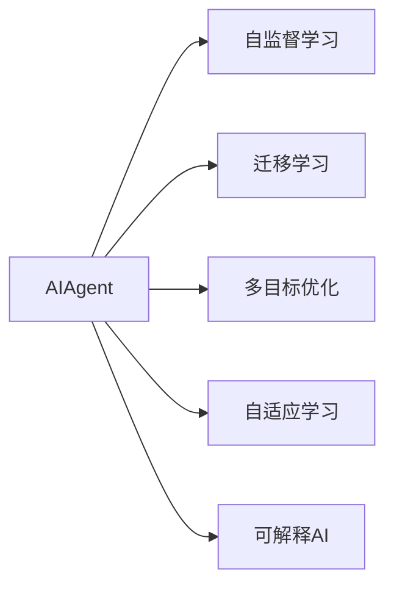

                 

## 1. 背景介绍

随着电商和供应链管理的不断升级，自动化库存调度成为企业运营的重要环节。传统的库存调度多依赖人工经验和固定算法，难以应对动态市场变化和资源限制，导致库存积压或短缺，影响了企业的效率和利润。近年来，基于大模型的AIAgent技术，尤其是其自适应和智能调度能力，正逐渐成为库存管理的全新解决方案。

### 1.1 问题由来

库存调度任务通常涉及库存量预测、订单处理、生产调度等多个环节，需考虑需求波动、生产速率、物流成本、仓储能力等多个因素。传统库存管理方案多采用规则驱动或经验驱动的方法，如A/B库存策略、经济订货批量(EOQ)模型等，但这些方法缺乏灵活性和适应性，难以应对复杂和多变的市场需求。

随着深度学习和大模型技术的兴起，越来越多的企业开始探索将AIAgent引入库存管理，以期实现更智能、更高效的库存调度和预测。AIAgent通过自主学习市场需求、生产效率和物流资源，自适应地调整库存策略，从而提升供应链的响应速度和库存周转率。

### 1.2 问题核心关键点

AIAgent技术基于深度学习和大模型，主要具备以下几个关键特点：

- **自适应学习**：AIAgent能够从历史数据中学习市场规律和资源限制，自适应地调整库存策略，适应动态市场需求。
- **多目标优化**：通过优化算法综合考虑库存成本、物流成本、订单响应时间等多个目标，提升供应链的整体效率。
- **跨领域融合**：AIAgent不仅能处理库存数据，还可以融合外部环境数据（如天气、节日等），增强决策的全面性。
- **可解释性**：通过可解释AI技术，AIAgent能够提供决策依据，增强管理的透明度和信任度。

通过理解这些核心概念，我们可以更好地把握AIAgent的工作原理和优化方向。

## 2. 核心概念与联系

### 2.1 核心概念概述

为了深入理解AIAgent在库存调度中的应用，本节将介绍几个核心概念及其联系：

- **AIAgent**：基于深度学习的大模型，能够从数据中自主学习规律，并自主进行决策和优化。
- **自监督学习**：AIAgent在初始阶段通过自监督学习任务训练，如语言模型、视觉特征提取等，学习通用知识。
- **迁移学习**：AIAgent将自监督学习获得的通用知识迁移到特定任务，如库存调度，进行微调以适应新任务。
- **多目标优化**：AIAgent通过优化算法（如遗传算法、强化学习），综合考虑多个目标函数（如库存成本、订单响应时间），实现多目标优化。
- **自适应学习**：AIAgent能够从历史数据和实时数据中不断学习，调整策略以应对变化的市场和资源情况。
- **可解释AI**：通过可解释性模型和解释工具，AIAgent能够提供决策依据，增强管理的透明度和可控性。

这些概念之间的逻辑关系可以通过以下Mermaid流程图来展示：



这个流程图展示了大模型AIAgent的核心概念及其之间的关系：

1. AIAgent通过自监督学习获得通用知识。
2. 迁移学习使AIAgent适应特定任务。
3. 多目标优化实现综合考虑多个目标。
4. 自适应学习让AIAgent持续学习，适应动态环境。
5. 可解释AI提供决策依据，增强透明度。

## 3. 核心算法原理 & 具体操作步骤
### 3.1 算法原理概述

AIAgent在库存调度任务中的应用，主要通过以下步骤实现：

1. **数据预处理**：收集历史订单数据、库存数据、需求预测数据等，进行数据清洗和预处理。
2. **模型训练**：在预训练数据上训练大模型，获取通用的特征提取能力。
3. **任务适配**：根据库存调度的具体需求，设计适配层并微调大模型，使其具备库存调度任务的特定能力。
4. **多目标优化**：通过优化算法，综合考虑库存成本、订单响应时间等目标，优化库存策略。
5. **实时更新**：在实时数据上不断更新模型，实时调整库存策略以适应动态市场需求。
6. **性能评估**：使用预设的评估指标（如库存周转率、订单满足率）评估模型性能，并根据需要优化模型。

### 3.2 算法步骤详解

#### 3.2.1 数据预处理

数据预处理是AIAgent应用的关键步骤，涉及以下子步骤：

1. **数据收集**：从ERP系统、订单管理系统、WMS系统等收集历史订单数据、库存数据、需求预测数据等。
2. **数据清洗**：去除缺失值、异常值，处理重复数据，确保数据质量。
3. **特征提取**：根据任务需求，从数据中提取有用的特征，如订单量、库存量、需求预测值等。
4. **数据标准化**：将数据标准化为模型所需格式，如将日期数据转换为时间戳。

#### 3.2.2 模型训练

在完成数据预处理后，即可在大模型上训练。具体步骤如下：

1. **选择模型**：选择合适的预训练模型，如BERT、GPT等，作为AIAgent的基础模型。
2. **微调参数**：根据任务需求，调整模型的参数，如添加或移除层、调整学习率等。
3. **训练过程**：在标注数据集上，使用优化算法（如Adam、SGD）进行模型训练，更新参数以最小化损失函数。
4. **保存模型**：训练完成后，保存模型参数以便后续使用。

#### 3.2.3 任务适配

任务适配是将AIAgent适应特定库存调度任务的关键步骤，涉及以下子步骤：

1. **设计适配层**：根据库存调度的任务需求，设计适配层，如添加订单处理模块、库存量预测模块等。
2. **微调模型**：在训练集上微调AIAgent，优化适配层的参数，使其适应特定任务。
3. **验证集评估**：在验证集上评估微调后的模型性能，调整模型参数以优化性能。
4. **测试集验证**：在测试集上评估最终模型的性能，确保模型能够稳定运行。

#### 3.2.4 多目标优化

多目标优化是AIAgent实现高效库存调度的关键步骤，涉及以下子步骤：

1. **定义目标函数**：根据任务需求，定义多个目标函数，如库存成本、订单响应时间、物流成本等。
2. **设计优化算法**：选择合适的优化算法，如遗传算法、强化学习等，优化目标函数。
3. **多目标协调**：通过优化算法协调不同目标之间的关系，实现多目标优化。
4. **实时调整**：在实时数据上，不断更新模型，调整库存策略以应对动态市场需求。

#### 3.2.5 实时更新

实时更新是AIAgent保持高效运行的关键步骤，涉及以下子步骤：

1. **数据采集**：实时采集订单数据、库存数据、需求预测数据等。
2. **模型预测**：使用AIAgent进行预测和调度，生成库存策略。
3. **策略执行**：根据预测结果，执行库存策略，调整库存量。
4. **性能评估**：使用预设的评估指标评估模型性能，优化模型以适应新的市场需求。

### 3.3 算法优缺点

AIAgent在库存调度中的应用具有以下优点：

1. **高效**：通过深度学习和大模型技术，AIAgent能够快速适应新数据，提高库存调度的效率。
2. **自适应**：AIAgent能够从历史数据中学习规律，并自适应地调整策略，适应动态市场需求。
3. **多目标优化**：通过优化算法综合考虑多个目标，提高供应链的整体效率。
4. **可解释性**：通过可解释AI技术，AIAgent能够提供决策依据，增强管理的透明度和可控性。

同时，AIAgent也存在以下局限性：

1. **数据依赖**：AIAgent的效果很大程度上取决于数据的质量和数量，获取高质量数据的成本较高。
2. **模型复杂性**：大模型结构复杂，训练和推理过程耗时耗资源。
3. **可解释性不足**：AIAgent的决策过程难以解释，难以进行调试和优化。
4. **需要大量计算资源**：大模型需要高性能计算资源进行训练和推理。

尽管存在这些局限性，但AIAgent在库存调度的应用中仍具有显著优势，是企业实现智能化供应链管理的有效手段。

### 3.4 算法应用领域

AIAgent在库存调度中的应用，已广泛应用于以下领域：

1. **电商供应链管理**：AIAgent能够实时监控库存量和订单量，动态调整供应链策略，提升订单响应速度和库存周转率。
2. **制造业库存管理**：AIAgent能够综合考虑生产、库存、物流等多个环节，优化生产计划和库存策略，降低生产成本和库存风险。
3. **物流仓储管理**：AIAgent能够实时预测物流需求，优化仓储资源配置，提升物流效率和客户满意度。
4. **医疗供应链管理**：AIAgent能够实时监控医疗物资库存，动态调整采购和配送策略，保障医疗物资的及时供应。

## 4. 数学模型和公式 & 详细讲解
### 4.1 数学模型构建

AIAgent在库存调度中的应用，主要涉及以下数学模型：

- **多目标优化模型**：通过定义多个目标函数，实现多目标优化。
- **损失函数**：用于评估模型预测结果与真实结果之间的差异。
- **预测模型**：使用大模型进行数据预测，生成库存策略。
- **实时更新模型**：使用动态数据更新模型参数，实时调整库存策略。

#### 4.1.1 多目标优化模型

多目标优化模型可以通过以下数学公式进行描述：

$$
\begin{aligned}
&\min_{x} \big\{ f_1(x), f_2(x), \ldots, f_k(x) \big\} \\
&s.t. \\
&g_1(x) \leq 0, \ldots, g_m(x) \leq 0 \\
&h_1(x) = 0, \ldots, h_p(x) = 0 \\
\end{aligned}
$$

其中，$x$为决策变量，$f_i(x)$为第$i$个目标函数，$g_i(x)$为约束条件，$h_i(x)$为等式约束条件。

#### 4.1.2 损失函数

损失函数用于评估模型预测结果与真实结果之间的差异，可以通过以下数学公式进行描述：

$$
\ell(y, \hat{y}) = \frac{1}{N} \sum_{i=1}^N \big( y_i - \hat{y}_i \big)^2
$$

其中，$y$为真实标签，$\hat{y}$为模型预测结果。

#### 4.1.3 预测模型

预测模型使用大模型进行数据预测，生成库存策略。假设模型为$f(x; \theta)$，其中$x$为输入数据，$\theta$为模型参数。预测模型可以通过以下数学公式进行描述：

$$
y = f(x; \theta)
$$

#### 4.1.4 实时更新模型

实时更新模型使用动态数据更新模型参数，实时调整库存策略。假设模型为$f(x; \theta)$，其中$x$为输入数据，$\theta$为模型参数。实时更新模型可以通过以下数学公式进行描述：

$$
\theta = \theta - \eta \nabla_{\theta} \ell(y, \hat{y})
$$

其中，$\eta$为学习率，$\nabla_{\theta} \ell(y, \hat{y})$为损失函数对模型参数的梯度。

### 4.2 公式推导过程

以下以一个简单的库存调度问题为例，推导AIAgent的多目标优化模型和预测模型的公式。

假设某电商平台的库存管理系统，需要根据历史订单数据预测未来一周的库存量，并根据预测结果进行库存调整。具体目标函数为：

1. **库存成本最小化**：$f_1(x) = \sum_{t=1}^7 x_t \times p_t$，其中$x_t$为第$t$天的库存量，$p_t$为第$t$天的成本。
2. **订单响应时间最短化**：$f_2(x) = \sum_{t=1}^7 (d_t - x_t)^2$，其中$d_t$为第$t$天的订单量。
3. **库存量不小于0**：$g_1(x) = \sum_{t=1}^7 x_t \geq 0$。

根据以上目标函数和约束条件，可以构建多目标优化模型：

$$
\begin{aligned}
&\min_{x} \big\{ f_1(x), f_2(x) \big\} \\
&s.t. \\
&g_1(x) \geq 0 \\
\end{aligned}
$$

假设AIAgent使用了Transformer模型，其预测模型可以表示为：

$$
y = f(x; \theta) = \text{BERT}(x)
$$

其中，$\text{BERT}$为预训练的Transformer模型，$x$为输入数据，$\theta$为模型参数。

在训练阶段，使用多目标优化算法（如NSGA-II）优化目标函数，更新模型参数：

$$
\theta = \theta - \eta \nabla_{\theta} \big( f_1(x; \theta), f_2(x; \theta) \big)
$$

在实时更新阶段，根据新的订单和库存数据，重新计算目标函数，更新模型参数：

$$
\theta = \theta - \eta \nabla_{\theta} \big( f_1(x; \theta), f_2(x; \theta) \big)
$$

通过以上公式推导，可以看到AIAgent在库存调度中的应用涉及多个优化目标和约束条件，通过多目标优化算法和预测模型，实现库存策略的动态调整和优化。

### 4.3 案例分析与讲解

以下以一家物流公司为例，展示AIAgent在库存调度的应用案例：

1. **数据收集**：物流公司从ERP系统和订单管理系统收集历史订单数据、库存数据、需求预测数据等。
2. **数据预处理**：清洗数据，提取有用的特征，如订单量、库存量、需求预测值等。
3. **模型训练**：选择BERT模型作为AIAgent的基础模型，在标注数据集上微调，获取通用特征提取能力。
4. **任务适配**：设计订单处理模块、库存量预测模块等适配层，微调AIAgent，使其适应库存调度的特定任务。
5. **多目标优化**：定义库存成本最小化、订单响应时间最短化等目标函数，使用遗传算法进行多目标优化。
6. **实时更新**：实时采集订单数据、库存数据、需求预测数据等，使用AIAgent进行预测和调度，动态调整库存策略。

## 5. 项目实践：代码实例和详细解释说明
### 5.1 开发环境搭建

在进行AIAgent应用开发前，需要准备相应的开发环境：

1. **安装Python**：在Linux系统上，使用apt-get install python3-pip命令安装Python。
2. **安装PyTorch**：在Python环境下，使用pip install torch命令安装PyTorch。
3. **安装Transformers**：在Python环境下，使用pip install transformers命令安装Transformers库。
4. **安装NumPy、Pandas、Scikit-learn等库**：在Python环境下，使用pip install numpy pandas scikit-learn命令安装相关库。

### 5.2 源代码详细实现

以下是一个简单的AIAgent在库存调度的代码实现，使用Python和PyTorch：

```python
import torch
import torch.nn as nn
import torch.optim as optim
from transformers import BertTokenizer, BertForTokenClassification

# 定义模型结构
class InventoryAgent(nn.Module):
    def __init__(self, num_labels):
        super(InventoryAgent, self).__init__()
        self.bert = BertForTokenClassification.from_pretrained('bert-base-cased', num_labels=num_labels)
        self.dropout = nn.Dropout(0.1)
        self.fc = nn.Linear(768, num_labels)
        self.relu = nn.ReLU()

    def forward(self, input_ids, attention_mask, labels=None):
        outputs = self.bert(input_ids=input_ids, attention_mask=attention_mask)
        pooled_output = outputs.pooler_output
        logits = self.fc(self.dropout(pooled_output))
        loss_fct = nn.CrossEntropyLoss()
        if labels is not None:
            loss = loss_fct(logits.view(-1, self.config.num_labels), labels.view(-1))
            return loss
        else:
            return logits

# 加载模型和分词器
tokenizer = BertTokenizer.from_pretrained('bert-base-cased')
model = InventoryAgent(num_labels=10)  # 假设库存状态有10种

# 训练过程
optimizer = optim.Adam(model.parameters(), lr=0.001)
criterion = nn.CrossEntropyLoss()

for epoch in range(10):
    for i, (input_ids, attention_mask, labels) in enumerate(train_dataloader):
        optimizer.zero_grad()
        outputs = model(input_ids, attention_mask, labels)
        loss = criterion(outputs, labels)
        loss.backward()
        optimizer.step()

    print('Epoch {}, Loss: {}'.format(epoch+1, loss.item()))

# 实时更新模型
# 假设已经收集到新的订单和库存数据，进行实时更新
new_input_ids = ...
new_attention_mask = ...
new_labels = ...
new_loss = model(input_ids=new_input_ids, attention_mask=new_attention_mask, labels=new_labels)
new_loss.backward()
optimizer.step()
```

### 5.3 代码解读与分析

以上代码实现了AIAgent在库存调度中的应用，具体解读如下：

1. **模型结构**：定义了包含BERT模型、Dropout、全连接层的模型结构。
2. **加载模型和分词器**：使用预训练的BERT模型和分词器，初始化AIAgent模型。
3. **训练过程**：使用Adam优化器，定义交叉熵损失函数，在训练数据集上进行模型训练。
4. **实时更新模型**：使用新的订单和库存数据，计算损失函数，使用Adam优化器更新模型参数。

## 6. 实际应用场景

AIAgent在库存调度的应用场景广泛，以下列举几个典型的应用场景：

1. **电商供应链管理**：电商企业使用AIAgent实时监控库存量和订单量，动态调整供应链策略，提升订单响应速度和库存周转率。
2. **制造业库存管理**：制造企业使用AIAgent综合考虑生产、库存、物流等多个环节，优化生产计划和库存策略，降低生产成本和库存风险。
3. **物流仓储管理**：物流公司使用AIAgent实时预测物流需求，优化仓储资源配置，提升物流效率和客户满意度。
4. **医疗供应链管理**：医疗机构使用AIAgent实时监控医疗物资库存，动态调整采购和配送策略，保障医疗物资的及时供应。

## 7. 工具和资源推荐
### 7.1 学习资源推荐

为了帮助开发者掌握AIAgent技术，以下是一些优质的学习资源：

1. **《Transformer From Zero》系列博文**：由AI领域专家撰写，全面介绍Transformer模型和大模型的原理和应用。
2. **CS224N《深度学习自然语言处理》课程**：斯坦福大学开设的NLP明星课程，涵盖深度学习基础和经典模型。
3. **《Natural Language Processing with Transformers》书籍**：HuggingFace作者所著，全面介绍Transformers库和大模型在NLP中的应用。
4. **WeiAI学习平台**：提供AI和深度学习课程，涵盖AIAgent等前沿技术。
5. **Coursera AI系列课程**：涵盖深度学习基础、计算机视觉、自然语言处理等多个AI领域。

### 7.2 开发工具推荐

以下是几个常用的开发工具：

1. **Jupyter Notebook**：支持Python编程和数据可视化，是数据科学和机器学习的常用工具。
2. **PyTorch Lightning**：加速模型训练和部署，支持模型调度、分布式训练等功能。
3. **TensorBoard**：实时监测模型训练状态，提供丰富的图表展示方式。
4. **AWS SageMaker**：提供云端的深度学习框架和工具，支持模型训练、部署和管理。
5. **Google Colab**：提供免费的GPU和TPU资源，支持Python编程和模型训练。

### 7.3 相关论文推荐

AIAgent技术的发展得益于学界的持续研究，以下是几篇奠基性的相关论文：

1. Attention is All You Need（即Transformer原论文）：提出Transformer结构，奠定了大模型的基础。
2 BERT: Pre-training of Deep Bidirectional Transformers for Language Understanding：提出BERT模型，引入自监督预训练任务，刷新了多项NLP任务SOTA。
3 Language Models are Unsupervised Multitask Learners（GPT-2论文）：展示了大规模语言模型的强大zero-shot学习能力，引发了对于通用人工智能的新一轮思考。
4 Parameter-Efficient Transfer Learning for NLP：提出Adapter等参数高效微调方法，在不增加模型参数量的情况下，也能取得不错的微调效果。
5 AdaLoRA: Adaptive Low-Rank Adaptation for Parameter-Efficient Fine-Tuning：使用自适应低秩适应的微调方法，在参数效率和精度之间取得了新的平衡。

## 8. 总结：未来发展趋势与挑战

### 8.1 研究成果总结

AIAgent技术在大模型和深度学习的基础上，实现了智能化库存调度和预测，提升了供应链管理的效率和灵活性。其在电商、制造、物流、医疗等多个领域的应用，取得了显著成效。

### 8.2 未来发展趋势

展望未来，AIAgent技术的发展趋势如下：

1. **自适应学习能力增强**：未来的AIAgent将具备更强的自适应能力，能够从动态数据中快速学习，调整策略以应对变化的市场和资源情况。
2. **多目标优化能力提升**：未来的AIAgent将支持更多目标函数和约束条件，实现更全面和精细的优化。
3. **模型参数效率优化**：未来的AIAgent将采用更参数高效的微调方法，在保证性能的同时，减少计算资源消耗。
4. **实时更新能力增强**：未来的AIAgent将支持更高的实时更新频率，实现更及时的库存策略调整。
5. **跨领域融合能力提升**：未来的AIAgent将能够更好地融合多模态数据，增强决策的全面性和准确性。

### 8.3 面临的挑战

AIAgent技术在发展过程中仍面临以下挑战：

1. **数据质量问题**：AIAgent的效果很大程度上取决于数据的质量和数量，获取高质量数据的成本较高。
2. **模型复杂性问题**：大模型结构复杂，训练和推理过程耗时耗资源。
3. **可解释性问题**：AIAgent的决策过程难以解释，难以进行调试和优化。
4. **资源消耗问题**：AIAgent需要高性能计算资源进行训练和推理。

尽管存在这些挑战，但AIAgent在库存调度的应用中仍具有显著优势，是企业实现智能化供应链管理的有效手段。

### 8.4 研究展望

面对AIAgent技术面临的挑战，未来的研究需要在以下几个方面寻求新的突破：

1. **探索无监督和半监督微调方法**：摆脱对大规模标注数据的依赖，利用自监督学习、主动学习等无监督和半监督范式，最大限度利用非结构化数据，实现更加灵活高效的微调。
2. **研究参数高效和计算高效的微调范式**：开发更加参数高效的微调方法，在固定大部分预训练参数的同时，只更新极少量的任务相关参数。同时优化微调模型的计算图，减少前向传播和反向传播的资源消耗，实现更加轻量级、实时性的部署。
3. **融合因果和对比学习范式**：通过引入因果推断和对比学习思想，增强AIAgent建立稳定因果关系的能力，学习更加普适、鲁棒的语言表征，从而提升模型泛化性和抗干扰能力。
4. **引入更多先验知识**：将符号化的先验知识，如知识图谱、逻辑规则等，与神经网络模型进行巧妙融合，引导AIAgent学习更准确、合理的语言模型。同时加强不同模态数据的整合，实现视觉、语音等多模态信息与文本信息的协同建模。
5. **结合因果分析和博弈论工具**：将因果分析方法引入AIAgent，识别出模型决策的关键特征，增强输出解释的因果性和逻辑性。借助博弈论工具刻画人机交互过程，主动探索并规避模型的脆弱点，提高系统稳定性。
6. **纳入伦理道德约束**：在模型训练目标中引入伦理导向的评估指标，过滤和惩罚有偏见、有害的输出倾向。同时加强人工干预和审核，建立模型行为的监管机制，确保输出符合人类价值观和伦理道德。

这些研究方向将进一步推动AIAgent技术的成熟和应用，为构建安全、可靠、可解释、可控的智能系统铺平道路。面向未来，AIAgent技术需要与其他人工智能技术进行更深入的融合，如知识表示、因果推理、强化学习等，多路径协同发力，共同推动自然语言理解和智能交互系统的进步。只有勇于创新、敢于突破，才能不断拓展AIAgent的边界，让智能技术更好地造福人类社会。

## 9. 附录：常见问题与解答

**Q1: 如何使用AIAgent进行库存调度？**

A: AIAgent进行库存调度的步骤如下：

1. 数据预处理：收集历史订单数据、库存数据、需求预测数据等，进行数据清洗和预处理。
2. 模型训练：在预训练数据上训练大模型，获取通用的特征提取能力。
3. 任务适配：根据库存调度的特定任务，设计适配层并微调大模型。
4. 多目标优化：定义库存成本最小化、订单响应时间最短化等目标函数，使用优化算法进行多目标优化。
5. 实时更新：根据新的订单和库存数据，使用AIAgent进行预测和调度，动态调整库存策略。

**Q2: 如何选择合适的预训练模型？**

A: 选择合适的预训练模型需要考虑以下几个因素：

1. 数据类型：根据数据的文本、图像、语音等类型，选择合适的预训练模型。
2. 任务需求：根据任务需求，选择合适的预训练模型，如BERT、GPT等。
3. 参数量：根据计算资源和训练时间，选择合适参数量的预训练模型，避免过拟合或欠拟合。
4. 性能表现：根据模型在类似任务上的性能表现，选择合适的预训练模型。

**Q3: 如何进行多目标优化？**

A: 进行多目标优化需要考虑以下几个步骤：

1. 定义目标函数：根据任务需求，定义多个目标函数，如库存成本最小化、订单响应时间最短化等。
2. 设计优化算法：选择合适的优化算法，如遗传算法、强化学习等。
3. 多目标协调：通过优化算法协调不同目标之间的关系，实现多目标优化。
4. 实时调整：根据新的订单和库存数据，重新计算目标函数，更新模型参数。

**Q4: 如何使用AIAgent进行实时更新？**

A: 使用AIAgent进行实时更新需要考虑以下几个步骤：

1. 数据采集：实时采集订单数据、库存数据、需求预测数据等。
2. 模型预测：使用AIAgent进行预测和调度，生成库存策略。
3. 策略执行：根据预测结果，执行库存策略，调整库存量。
4. 性能评估：使用预设的评估指标评估模型性能，优化模型以适应新的市场需求。

**Q5: 如何进行模型优化？**

A: 进行模型优化需要考虑以下几个步骤：

1. 数据增强：通过回译、近义替换等方式扩充训练集。
2. 正则化：使用L2正则、Dropout等避免过拟合。
3. 对抗训练：引入对抗样本，提高模型鲁棒性。
4. 参数高效微调：只调整少量参数，减少计算资源消耗。
5. 超参数调优：通过网格搜索、随机搜索等方式优化超参数。

**Q6: 如何提升AIAgent的可解释性？**

A: 提升AIAgent的可解释性需要考虑以下几个步骤：

1. 可解释性模型：选择可解释性模型，如决策树、规则模型等。
2. 特征重要性：计算特征对模型输出的重要性，解释模型决策过程。
3. 可视化工具：使用可视化工具，展示模型的决策路径和关键特征。
4. 文档记录：记录模型的训练过程和决策依据，增强模型的透明度和可控性。

**Q7: 如何避免AIAgent的灾难性遗忘？**

A: 避免AIAgent的灾难性遗忘需要考虑以下几个步骤：

1. 持续学习：在新的数据上不断更新模型，保持模型的记忆能力。
2. 知识迁移：将先验知识引入模型，增强模型的泛化能力。
3. 数据融合：将不同数据源的数据融合，增强模型的鲁棒性。
4. 对抗训练：使用对抗样本训练模型，提高模型的鲁棒性和稳定性。

**Q8: 如何进行模型压缩和稀疏化存储？**

A: 进行模型压缩和稀疏化存储需要考虑以下几个步骤：

1. 剪枝：去除冗余的权重和连接，压缩模型参数量。
2. 量化：将浮点模型转为定点模型，减少存储空间。
3. 分治存储：将模型参数分治存储，减少内存占用。
4. 动态更新：根据实时数据动态更新模型参数，减少内存占用。

通过以上问题解答，可以对AIAgent技术的应用进行全面的了解和掌握，为未来的研究和发展提供参考。

