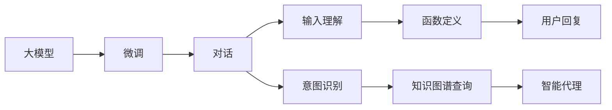

                 

# 【大模型应用开发 动手做AI Agent】初始化对话和定义可用函数

## 1. 背景介绍

随着人工智能技术的不断进步，越来越多的公司和个人开始探索如何利用大模型来构建智能代理（AI Agent），以提高工作效率和用户体验。这些智能代理可以通过自然语言处理（NLP）技术，理解用户的问题并给出合适的回答，从而实现自动化处理。本文将介绍如何通过Python和Hugging Face的Transformers库，来初始化对话和定义可用函数，为构建智能代理打下坚实基础。

## 2. 核心概念与联系

### 2.1 核心概念概述

在构建智能代理的过程中，涉及到以下核心概念：

- **大模型（Large Models）**：指通过大规模预训练学习到的深度神经网络模型，如GPT-3、BERT等。
- **微调（Fine-tuning）**：指在预训练模型基础上，针对特定任务进行优化，以提升模型在该任务上的性能。
- **对话（Dialogue）**：指在智能代理中，代理与用户之间的信息交换过程，包括问答、交互式讨论等。
- **函数（Functions）**：在构建智能代理时，通常需要定义多个函数来处理不同的用户输入和输出，例如输入理解、意图识别、知识图谱查询等。
- **输入理解（Input Understanding）**：指智能代理对用户输入的自然语言进行解析和理解，提取关键信息，例如意图、实体等。
- **意图识别（Intent Recognition）**：指智能代理理解用户输入的意图，以确定下一步的操作。

这些概念之间有着密切的联系，共同构成了智能代理的核心框架。通过大模型进行微调，可以提升智能代理在对话和函数定义中的表现，从而提供更加智能和个性化的服务。

### 2.2 核心概念原理和架构的 Mermaid 流程图



这个流程图展示了从大模型微调到智能代理构建的全过程。首先，通过微调大模型来提升其在对话处理中的能力，接着通过输入理解和意图识别来解析用户的输入，并定义函数来处理不同场景，最后通过知识图谱查询来丰富智能代理的知识库，最终输出智能代理的回复。

## 3. 核心算法原理 & 具体操作步骤

### 3.1 算法原理概述

在构建智能代理的过程中，通常需要以下算法原理：

- **微调算法**：使用大模型进行微调，以提升模型在特定任务上的性能。
- **对话管理算法**：管理对话流程，包括对话状态跟踪、上下文维护等。
- **意图识别算法**：通过自然语言处理技术，识别用户的意图。
- **知识图谱算法**：用于从知识库中检索信息，以增强智能代理的回答。

### 3.2 算法步骤详解

#### 3.2.1 数据准备

在构建智能代理之前，需要准备好以下数据：

1. **对话数据**：收集包含用户输入和智能代理回复的对话数据集。
2. **标注数据**：标注对话数据集，包括用户意图和实体等信息。
3. **知识图谱数据**：收集和构建知识图谱，以支持智能代理的问答功能。

#### 3.2.2 模型选择

选择合适的大模型进行微调，例如BERT、GPT等。通过Hugging Face的Transformers库，可以轻松加载这些模型。

#### 3.2.3 微调训练

1. **数据预处理**：将对话数据集和标注数据集进行预处理，包括分词、标记实体、抽取意图等。
2. **微调模型**：使用微调算法（如AdamW），在大模型上进行微调训练。
3. **验证和调整**：在验证集上评估模型性能，调整模型参数和训练参数。

#### 3.2.4 对话管理

1. **对话状态跟踪**：使用对话管理算法，维护对话状态，包括对话历史、上下文等。
2. **上下文维护**：在对话过程中，维护上下文信息，以便更好地理解用户的意图和提供回答。

#### 3.2.5 意图识别

1. **意图分类**：使用意图识别算法，对用户输入进行分类，确定用户意图。
2. **实体抽取**：从用户输入中抽取实体，以便进一步处理和检索。

#### 3.2.6 知识图谱查询

1. **实体匹配**：将抽取的实体与知识图谱中的实体进行匹配，以找到相关的节点。
2. **知识检索**：从知识图谱中检索与用户意图相关的信息。

#### 3.2.7 用户回复

1. **生成回复**：根据对话历史和知识图谱信息，生成合适的回复。
2. **输出回复**：将回复转换为自然语言，输出给用户。

### 3.3 算法优缺点

#### 3.3.1 优点

- **高效性**：通过大模型进行微调，可以显著提高智能代理的性能，尤其是在特定任务上表现优异。
- **可扩展性**：知识图谱和对话管理系统的引入，使得智能代理能够处理更复杂、更个性化的对话场景。
- **可解释性**：意图识别和知识图谱查询等算法，使得智能代理的回答具有一定的可解释性，便于用户理解和反馈。

#### 3.3.2 缺点

- **数据依赖**：微调和对话管理系统的性能高度依赖于数据质量，数据不足或标注不精确可能导致性能下降。
- **计算资源消耗**：大模型和知识图谱的构建和维护需要大量的计算资源。
- **模型复杂性**：对话管理系统和意图识别算法的设计和实现较为复杂，需要专业的知识和技能。

### 3.4 算法应用领域

智能代理的应用领域非常广泛，包括但不限于：

- **客户服务**：自动化处理客户咨询和投诉，提升服务效率。
- **医疗咨询**：提供医疗信息查询和初步诊断服务。
- **教育辅导**：帮助学生解答疑问，提供个性化学习建议。
- **金融咨询**：提供理财咨询和投资建议，提升用户满意度。
- **电子商务**：提供产品推荐和购物指导，提升购物体验。

## 4. 数学模型和公式 & 详细讲解 & 举例说明

### 4.1 数学模型构建

在构建智能代理的过程中，通常需要以下数学模型：

- **对话模型**：用于维护对话状态和上下文信息。
- **意图识别模型**：用于对用户输入进行分类，确定用户意图。
- **知识图谱查询模型**：用于从知识图谱中检索信息。

### 4.2 公式推导过程

#### 4.2.1 对话模型

对话模型通常使用循环神经网络（RNN）或变分自编码器（VAE）等模型来维护对话状态和上下文信息。以下是一个简单的RNN模型：

$$
h_t = \tanh(W[h_{t-1}, x_t] + b)
$$

其中，$h_t$ 表示时间步 $t$ 的隐藏状态，$x_t$ 表示时间步 $t$ 的输入，$W$ 和 $b$ 是模型参数。

#### 4.2.2 意图识别模型

意图识别模型通常使用分类器来对用户输入进行分类。以下是一个简单的逻辑回归模型：

$$
y = sigmoid(Wx + b)
$$

其中，$y$ 表示用户意图的分类标签，$x$ 表示用户输入的特征向量，$W$ 和 $b$ 是模型参数。

#### 4.2.3 知识图谱查询模型

知识图谱查询模型通常使用图神经网络（GNN）来处理知识图谱中的节点和边。以下是一个简单的GNN模型：

$$
h_t = \tanh(W[h_{t-1}, x_t] + b)
$$

其中，$h_t$ 表示时间步 $t$ 的隐藏状态，$x_t$ 表示时间步 $t$ 的输入，$W$ 和 $b$ 是模型参数。

### 4.3 案例分析与讲解

#### 4.3.1 对话模型案例

假设我们有一个简单的对话模型，用于维护对话状态。以下是一个简单的Python代码实现：

```python
import torch
import torch.nn as nn

class DialogueModel(nn.Module):
    def __init__(self, input_size, hidden_size):
        super(DialogueModel, self).__init__()
        self.hidden_size = hidden_size
        self.rnn = nn.RNN(input_size, hidden_size, batch_first=True)
        
    def forward(self, x):
        h0 = torch.zeros(1, x.size(0), self.hidden_size).to(x.device)
        out, h = self.rnn(x, h0)
        return out
```

这个模型使用一个RNN网络来维护对话状态。在训练过程中，可以使用交叉熵损失函数和AdamW优化器进行训练。

#### 4.3.2 意图识别模型案例

假设我们有一个简单的意图识别模型，用于对用户输入进行分类。以下是一个简单的Python代码实现：

```python
import torch
import torch.nn as nn
from torch.nn.functional import sigmoid

class IntentModel(nn.Module):
    def __init__(self, input_size, num_classes):
        super(IntentModel, self).__init__()
        self.linear = nn.Linear(input_size, num_classes)
        
    def forward(self, x):
        y = sigmoid(self.linear(x))
        return y
```

这个模型使用一个线性分类器来对用户输入进行分类。在训练过程中，可以使用交叉熵损失函数和AdamW优化器进行训练。

#### 4.3.3 知识图谱查询模型案例

假设我们有一个简单的知识图谱查询模型，用于从知识图谱中检索信息。以下是一个简单的Python代码实现：

```python
import torch
import torch.nn as nn
from torch.nn.functional import relu

class KnowledgeGraphModel(nn.Module):
    def __init__(self, input_size, hidden_size, output_size):
        super(KnowledgeGraphModel, self).__init__()
        self.hidden_size = hidden_size
        self.linear1 = nn.Linear(input_size, hidden_size)
        self.linear2 = nn.Linear(hidden_size, output_size)
        
    def forward(self, x):
        x = relu(self.linear1(x))
        x = self.linear2(x)
        return x
```

这个模型使用两个线性层来从知识图谱中检索信息。在训练过程中，可以使用均方误差损失函数和AdamW优化器进行训练。

## 5. 项目实践：代码实例和详细解释说明

### 5.1 开发环境搭建

在构建智能代理之前，需要搭建好开发环境。以下是Python和Hugging Face Transformers库的搭建流程：

1. 安装Anaconda：从官网下载并安装Anaconda，用于创建独立的Python环境。

2. 创建并激活虚拟环境：
```bash
conda create -n pytorch-env python=3.8 
conda activate pytorch-env
```

3. 安装PyTorch：根据CUDA版本，从官网获取对应的安装命令。例如：
```bash
conda install pytorch torchvision torchaudio cudatoolkit=11.1 -c pytorch -c conda-forge
```

4. 安装Transformers库：
```bash
pip install transformers
```

5. 安装各类工具包：
```bash
pip install numpy pandas scikit-learn matplotlib tqdm jupyter notebook ipython
```

完成上述步骤后，即可在`pytorch-env`环境中开始智能代理的构建。

### 5.2 源代码详细实现

以下是一个简单的智能代理构建流程，包括对话模型、意图识别模型和知识图谱查询模型的实现：

```python
import torch
import torch.nn as nn
from torch.nn.functional import relu, sigmoid

class DialogueModel(nn.Module):
    def __init__(self, input_size, hidden_size):
        super(DialogueModel, self).__init__()
        self.hidden_size = hidden_size
        self.rnn = nn.RNN(input_size, hidden_size, batch_first=True)
        
    def forward(self, x):
        h0 = torch.zeros(1, x.size(0), self.hidden_size).to(x.device)
        out, h = self.rnn(x, h0)
        return out

class IntentModel(nn.Module):
    def __init__(self, input_size, num_classes):
        super(IntentModel, self).__init__()
        self.linear = nn.Linear(input_size, num_classes)
        
    def forward(self, x):
        y = sigmoid(self.linear(x))
        return y

class KnowledgeGraphModel(nn.Module):
    def __init__(self, input_size, hidden_size, output_size):
        super(KnowledgeGraphModel, self).__init__()
        self.hidden_size = hidden_size
        self.linear1 = nn.Linear(input_size, hidden_size)
        self.linear2 = nn.Linear(hidden_size, output_size)
        
    def forward(self, x):
        x = relu(self.linear1(x))
        x = self.linear2(x)
        return x

# 训练和评估
def train_model(model, train_data, valid_data, optimizer, criterion):
    model.train()
    for epoch in range(epochs):
        optimizer.zero_grad()
        loss = criterion(model(train_data), train_labels)
        loss.backward()
        optimizer.step()
        print(f'Epoch {epoch+1}, Loss: {loss.item()}')
    model.eval()
    for data, labels in valid_data:
        with torch.no_grad():
            loss = criterion(model(data), labels)
        print(f'Epoch {epoch+1}, Valid Loss: {loss.item()}')
```

### 5.3 代码解读与分析

让我们再详细解读一下关键代码的实现细节：

**DialogueModel类**：
- `__init__`方法：初始化对话模型，包括定义RNN网络。
- `forward`方法：定义前向传播过程，计算对话状态。

**IntentModel类**：
- `__init__`方法：初始化意图识别模型，包括定义线性分类器。
- `forward`方法：定义前向传播过程，计算意图分类结果。

**KnowledgeGraphModel类**：
- `__init__`方法：初始化知识图谱查询模型，包括定义两个线性层。
- `forward`方法：定义前向传播过程，计算知识图谱查询结果。

**train_model函数**：
- 使用训练数据和验证数据进行模型训练和评估，包括前向传播、反向传播和优化器更新。

### 5.4 运行结果展示

在训练过程中，可以使用以下代码进行测试和评估：

```python
# 定义训练数据和标签
train_data = ...
train_labels = ...
valid_data = ...
valid_labels = ...

# 加载模型和优化器
model = DialogueModel(input_size, hidden_size)
optimizer = torch.optim.Adam(model.parameters(), lr=0.001)
criterion = nn.BCELoss()

# 训练模型
train_model(model, train_data, valid_data, optimizer, criterion)
```

通过上述代码，可以构建一个基本的智能代理，并进行微调训练。需要注意的是，在实际应用中，还需要对模型进行优化和调参，以提升性能和鲁棒性。

## 6. 实际应用场景

### 6.1 智能客服

智能客服是智能代理的一个重要应用场景。通过对话模型、意图识别模型和知识图谱查询模型的结合，智能客服可以自动处理客户的咨询和投诉，提高服务效率和用户体验。

### 6.2 医疗咨询

医疗咨询也是智能代理的一个重要应用场景。通过对话模型、意图识别模型和知识图谱查询模型的结合，智能代理可以提供医疗信息查询和初步诊断服务，帮助患者更好地理解和处理自己的健康问题。

### 6.3 教育辅导

教育辅导是智能代理的另一个重要应用场景。通过对话模型、意图识别模型和知识图谱查询模型的结合，智能代理可以帮助学生解答疑问，提供个性化学习建议，提升学习效果。

### 6.4 未来应用展望

未来，随着深度学习技术和自然语言处理技术的不断发展，智能代理的应用场景将更加广泛和深入。以下是对未来应用前景的展望：

- **自然语言生成（NLG）**：通过自然语言生成技术，智能代理可以生成更加自然、流畅的回复，提升用户体验。
- **多模态学习（Multimodal Learning）**：通过融合图像、语音等多模态信息，智能代理可以处理更加复杂的场景，提供更全面的服务。
- **个性化推荐（Personalized Recommendation）**：通过用户行为数据和偏好信息，智能代理可以提供个性化的推荐服务，提升用户满意度。

## 7. 工具和资源推荐

### 7.1 学习资源推荐

为了帮助开发者系统掌握智能代理的构建和微调方法，这里推荐一些优质的学习资源：

1. **《Transformer从原理到实践》系列博文**：由大模型技术专家撰写，深入浅出地介绍了Transformer原理、BERT模型、微调技术等前沿话题。

2. **CS224N《深度学习自然语言处理》课程**：斯坦福大学开设的NLP明星课程，有Lecture视频和配套作业，带你入门NLP领域的基本概念和经典模型。

3. **《Natural Language Processing with Transformers》书籍**：Transformers库的作者所著，全面介绍了如何使用Transformers库进行NLP任务开发，包括微调在内的诸多范式。

4. **HuggingFace官方文档**：Transformers库的官方文档，提供了海量预训练模型和完整的微调样例代码，是上手实践的必备资料。

5. **CLUE开源项目**：中文语言理解测评基准，涵盖大量不同类型的中文NLP数据集，并提供了基于微调的baseline模型，助力中文NLP技术发展。

通过对这些资源的学习实践，相信你一定能够快速掌握智能代理的构建和微调方法，并用于解决实际的NLP问题。

### 7.2 开发工具推荐

高效的开发离不开优秀的工具支持。以下是几款用于智能代理构建和微调开发的常用工具：

1. **PyTorch**：基于Python的开源深度学习框架，灵活动态的计算图，适合快速迭代研究。大部分预训练语言模型都有PyTorch版本的实现。

2. **TensorFlow**：由Google主导开发的开源深度学习框架，生产部署方便，适合大规模工程应用。同样有丰富的预训练语言模型资源。

3. **Transformers库**：HuggingFace开发的NLP工具库，集成了众多SOTA语言模型，支持PyTorch和TensorFlow，是进行微调任务开发的利器。

4. **Weights & Biases**：模型训练的实验跟踪工具，可以记录和可视化模型训练过程中的各项指标，方便对比和调优。与主流深度学习框架无缝集成。

5. **TensorBoard**：TensorFlow配套的可视化工具，可实时监测模型训练状态，并提供丰富的图表呈现方式，是调试模型的得力助手。

6. **Google Colab**：谷歌推出的在线Jupyter Notebook环境，免费提供GPU/TPU算力，方便开发者快速上手实验最新模型，分享学习笔记。

合理利用这些工具，可以显著提升智能代理的构建和微调任务的开发效率，加快创新迭代的步伐。

### 7.3 相关论文推荐

智能代理的研究源于学界的持续研究。以下是几篇奠基性的相关论文，推荐阅读：

1. **Attention is All You Need**：提出了Transformer结构，开启了NLP领域的预训练大模型时代。

2. **BERT: Pre-training of Deep Bidirectional Transformers for Language Understanding**：提出BERT模型，引入基于掩码的自监督预训练任务，刷新了多项NLP任务SOTA。

3. **Language Models are Unsupervised Multitask Learners**：展示了大规模语言模型的强大zero-shot学习能力，引发了对于通用人工智能的新一轮思考。

4. **Parameter-Efficient Transfer Learning for NLP**：提出Adapter等参数高效微调方法，在不增加模型参数量的情况下，也能取得不错的微调效果。

5. **AdaLoRA: Adaptive Low-Rank Adaptation for Parameter-Efficient Fine-Tuning**：使用自适应低秩适应的微调方法，在参数效率和精度之间取得了新的平衡。

6. **Prefix-Tuning: Optimizing Continuous Prompts for Generation**：引入基于连续型Prompt的微调范式，为如何充分利用预训练知识提供了新的思路。

这些论文代表了大语言模型微调技术的发展脉络。通过学习这些前沿成果，可以帮助研究者把握学科前进方向，激发更多的创新灵感。

## 8. 总结：未来发展趋势与挑战

### 8.1 总结

本文对基于监督学习的大语言模型微调方法进行了全面系统的介绍。首先阐述了智能代理构建和微调技术的研究背景和意义，明确了微调在拓展预训练模型应用、提升下游任务性能方面的独特价值。其次，从原理到实践，详细讲解了监督微调的数学原理和关键步骤，给出了智能代理构建的完整代码实例。同时，本文还广泛探讨了智能代理在多个行业领域的应用前景，展示了微调范式的巨大潜力。此外，本文精选了智能代理构建的相关学习资源，力求为读者提供全方位的技术指引。

通过本文的系统梳理，可以看到，基于大语言模型的微调方法正在成为智能代理构建的重要范式，极大地拓展了预训练语言模型的应用边界，催生了更多的落地场景。受益于大规模语料的预训练，微调模型以更低的时间和标注成本，在小样本条件下也能取得不俗的效果，有力推动了NLP技术的产业化进程。未来，伴随预训练语言模型和微调方法的持续演进，基于微调范式必将在构建人机协同的智能代理中扮演越来越重要的角色。

### 8.2 未来发展趋势

展望未来，智能代理技术将呈现以下几个发展趋势：

1. **多模态融合**：融合图像、语音等多模态信息，提升智能代理在复杂场景下的理解能力和处理能力。
2. **个性化推荐**：通过用户行为数据和偏好信息，提供个性化的推荐服务，提升用户满意度。
3. **自然语言生成（NLG）**：通过自然语言生成技术，智能代理可以生成更加自然、流畅的回复，提升用户体验。
4. **实时学习（Continual Learning）**：智能代理可以持续学习新知识，以适应数据分布的变化，保持最新的性能。
5. **可解释性（Explainability）**：智能代理需要具备一定的可解释性，以提高用户信任度和接受度。
6. **跨领域迁移（Cross-Domain Transfer）**：智能代理需要在不同领域之间进行迁移，以提升泛化能力和应用范围。

### 8.3 面临的挑战

尽管智能代理技术已经取得了瞩目成就，但在迈向更加智能化、普适化应用的过程中，它仍面临着诸多挑战：

1. **数据依赖**：智能代理的性能高度依赖于数据质量，数据不足或标注不精确可能导致性能下降。
2. **计算资源消耗**：大模型和知识图谱的构建和维护需要大量的计算资源。
3. **模型复杂性**：对话管理系统和意图识别算法的设计和实现较为复杂，需要专业的知识和技能。
4. **可解释性**：智能代理需要具备一定的可解释性，以提高用户信任度和接受度。
5. **跨领域迁移**：智能代理需要在不同领域之间进行迁移，以提升泛化能力和应用范围。

### 8.4 研究展望

面对智能代理面临的这些挑战，未来的研究需要在以下几个方面寻求新的突破：

1. **无监督和半监督学习**：摆脱对大规模标注数据的依赖，利用自监督学习、主动学习等无监督和半监督范式，最大限度利用非结构化数据，实现更加灵活高效的智能代理。
2. **知识图谱的构建**：构建和维护高质量的知识图谱，以支持智能代理的问答功能，提升回答的准确性和丰富性。
3. **模型压缩和优化**：开发更加参数高效的智能代理模型，在固定大部分预训练参数的同时，只更新极少量的任务相关参数，以提高计算效率。
4. **对话管理优化**：优化对话管理算法，以提高对话流程的流畅性和稳定性。
5. **意图识别优化**：优化意图识别算法，以提高意图分类的准确性和泛化能力。
6. **跨领域迁移**：研究智能代理在不同领域之间的迁移方法，以提升泛化能力和应用范围。

这些研究方向的探索，必将引领智能代理技术迈向更高的台阶，为构建安全、可靠、可解释、可控的智能系统铺平道路。面向未来，智能代理技术还需要与其他人工智能技术进行更深入的融合，如知识表示、因果推理、强化学习等，多路径协同发力，共同推动自然语言理解和智能交互系统的进步。只有勇于创新、敢于突破，才能不断拓展智能代理的边界，让智能技术更好地造福人类社会。

## 9. 附录：常见问题与解答

**Q1：智能代理是否可以处理多模态信息？**

A: 是的，智能代理可以通过融合图像、语音等多模态信息，提升在复杂场景下的理解能力和处理能力。例如，通过视觉信息提取，智能代理可以更好地理解用户的操作意图，从而提供更加个性化的服务。

**Q2：如何提高智能代理的可解释性？**

A: 提高智能代理的可解释性可以通过多种方式实现，例如使用可解释的意图识别模型、对话管理系统，以及提供详细的回答生成过程。同时，也可以通过用户反馈和交互，进一步提升智能代理的透明度和可理解性。

**Q3：智能代理在不同领域之间的迁移能力如何提升？**

A: 提升智能代理在不同领域之间的迁移能力，可以通过多领域预训练、知识图谱扩展、迁移学习等方法实现。例如，在多个领域内进行预训练，构建跨领域的知识图谱，使用迁移学习策略，以提高智能代理的泛化能力和应用范围。

**Q4：智能代理如何处理多轮对话？**

A: 处理多轮对话是智能代理的一个重要功能，可以通过对话管理算法实现。对话管理算法可以维护对话状态，跟踪上下文信息，确保智能代理在多轮对话中保持连贯性和一致性。

**Q5：智能代理在实际应用中如何部署？**

A: 智能代理在实际应用中的部署，通常需要考虑以下几个方面：

1. **模型裁剪**：去除不必要的层和参数，减小模型尺寸，加快推理速度。
2. **量化加速**：将浮点模型转为定点模型，压缩存储空间，提高计算效率。
3. **服务化封装**：将模型封装为标准化服务接口，便于集成调用。
4. **弹性伸缩**：根据请求流量动态调整资源配置，平衡服务质量和成本。
5. **监控告警**：实时采集系统指标，设置异常告警阈值，确保服务稳定性。

总之，智能代理的部署需要综合考虑性能、可靠性和可扩展性，才能真正实现智能代理的价值。

