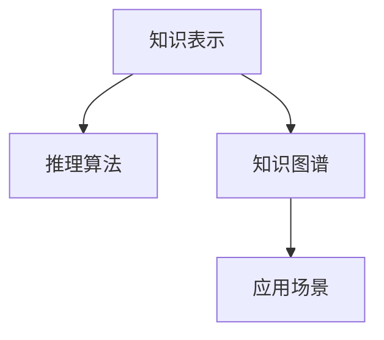

                 

# 【大模型应用开发 动手做AI Agent】基于大模型的推理能力构筑AI应用

> 关键词：大模型,推理能力,知识表示,知识图谱,自然语言处理(NLP),AI应用开发

## 1. 背景介绍

### 1.1 问题由来
人工智能（AI）领域的技术创新日新月异，其中大模型（Big Models）的出现，彻底改变了传统的NLP应用开发模式。大模型基于深度学习，通过大规模无监督学习从海量数据中提取丰富的语言知识，拥有强大的语言理解和生成能力。相较于传统模型，大模型能够在更少的训练数据上取得更好的效果。然而，大模型的复杂性和资源消耗也带来了新的挑战。如何在不牺牲模型性能的前提下，降低计算和存储成本，提高模型的推理效率，是当前研究的一个热点。

### 1.2 问题核心关键点
推理能力是大模型实现应用的核心。通过推理能力，模型能够将学习到的语言知识转化为具体的行为或决策。推理能力的大小直接决定了大模型在特定任务上的表现。

推理能力的关键点包括：
1. 知识表示：如何有效表示知识，是推理能力的基石。
2. 推理算法：如何高效执行推理，是推理能力的具体实现。
3. 知识图谱：如何将知识组织起来，便于推理使用，是大模型推理的重要手段。
4. 应用场景：如何将推理能力应用于实际问题，是大模型开发的关键。

本文将从知识表示、推理算法、知识图谱以及应用场景等方面，探讨大模型推理能力的构建与实践。

### 1.3 问题研究意义
推理能力的应用，是人工智能技术走向实际应用的重要一步。推理能力不仅能提升模型的准确性和鲁棒性，还能将大模型的泛化能力具体化，实现更具体、更实用的应用场景。

推理能力的应用场景包括但不限于：
1. 自然语言问答：模型能够回答用户提出的各种问题。
2. 智能推荐系统：根据用户的历史行为和偏好，推荐合适的内容或产品。
3. 智能客服：通过对话交互，解决用户的问题。
4. 智能助手：提供文本处理、语音识别、图像识别等综合服务。

这些应用场景的实现，都需要大模型的推理能力作为核心支撑。推理能力的提升，不仅能显著降低开发成本，还能提高用户体验，提升商业价值。

## 2. 核心概念与联系

### 2.1 核心概念概述

推理能力是大模型实现应用的核心。通过推理能力，模型能够将学习到的语言知识转化为具体的行为或决策。推理能力的大小直接决定了大模型在特定任务上的表现。

推理能力的关键点包括：
1. 知识表示：如何有效表示知识，是推理能力的基石。
2. 推理算法：如何高效执行推理，是推理能力的具体实现。
3. 知识图谱：如何将知识组织起来，便于推理使用，是大模型推理的重要手段。
4. 应用场景：如何将推理能力应用于实际问题，是大模型开发的关键。

这些核心概念之间的逻辑关系可以通过以下Mermaid流程图来展示：



这个流程图展示了大模型推理能力的关键要素及其之间的关系：

1. 知识表示：提供推理所需的基础知识。
2. 推理算法：执行推理操作，将知识转化为行为或决策。
3. 知识图谱：组织和存储知识，便于推理使用。
4. 应用场景：推理能力的实际应用，驱动应用开发。

这些概念共同构成了大模型推理能力的基础框架，为大模型的应用开发提供了方向。

## 3. 核心算法原理 & 具体操作步骤
### 3.1 算法原理概述

推理能力是大模型实现应用的核心。通过推理能力，模型能够将学习到的语言知识转化为具体的行为或决策。推理能力的大小直接决定了大模型在特定任务上的表现。

推理能力的核心算法主要包括：
1. 知识表示算法：如向量表示、符号表示、网络表示等。
2. 推理算法：如搜索推理、规则推理、概率推理等。
3. 知识图谱构建算法：如知识图谱的自动构建、优化等。

这些算法相互配合，共同构成了大模型推理能力的基础。

### 3.2 算法步骤详解

大模型推理能力的实现，通常包括以下几个关键步骤：

**Step 1: 构建知识图谱**
- 收集领域内的知识点，如名词、动词、实体等，构建知识图谱。
- 确定实体之间的关系，如父类、同义词、反义词等。
- 将知识图谱导入大模型，作为推理的基础知识。

**Step 2: 知识表示**
- 对知识图谱进行向量表示或符号表示，便于模型理解和推理。
- 选择合适的表示方法，如BERT、GPT等。

**Step 3: 设计推理算法**
- 选择适合的推理算法，如搜索推理、规则推理、概率推理等。
- 设计推理规则，如条件判断、决策树、贝叶斯网络等。

**Step 4: 模型训练与微调**
- 使用标注数据，训练大模型，使其具备推理能力。
- 在推理任务上微调模型，优化推理效果。

**Step 5: 应用场景实现**
- 将推理模型集成到应用场景中，如智能问答、推荐系统、智能客服等。
- 通过API接口，接收用户输入，调用推理模型输出结果。

### 3.3 算法优缺点

大模型推理能力具有以下优点：
1. 泛化能力强：通过大规模预训练和推理算法优化，大模型能够更好地泛化到新的数据和场景。
2. 精度高：大模型拥有强大的语言处理能力，推理结果的准确性高。
3. 可解释性强：大模型的推理过程具有高度可解释性，便于调试和优化。

同时，大模型推理能力也存在一些局限性：
1. 计算资源消耗大：大模型推理所需计算资源多，推理效率较低。
2. 推理结果难以解释：尽管大模型的推理过程可解释性强，但其具体推理过程仍难以完全理解。
3. 数据依赖度高：大模型的推理能力依赖于高质量的数据和知识图谱，数据质量差时效果可能不理想。

尽管存在这些局限性，但大模型推理能力在实际应用中仍具有巨大潜力，能够显著提升应用效果。

### 3.4 算法应用领域

推理能力的应用，在大模型开发中具有广泛的前景，覆盖了多个应用场景，例如：

- 自然语言问答系统：模型能够回答用户提出的各种问题，如智能客服、智能助手等。
- 智能推荐系统：根据用户的历史行为和偏好，推荐合适的内容或产品，如电商推荐、新闻推荐等。
- 智能决策系统：基于推理能力，实现自动决策，如金融风控、医疗诊断等。
- 智能写作系统：模型能够生成高质量的文本内容，如文章、报告等。
- 智能搜索系统：模型能够快速检索相关内容，如搜索引擎、文献检索等。

除了上述这些经典应用外，大模型推理能力还可以应用于更多场景中，如智能对话、情感分析、舆情监测等，为人工智能技术的应用提供了新的突破点。

## 4. 数学模型和公式 & 详细讲解 & 举例说明（备注：数学公式请使用latex格式，latex嵌入文中独立段落使用 $$，段落内使用 $)
### 4.1 数学模型构建

大模型推理能力的核心数学模型，主要包括知识表示模型和推理模型。

**知识表示模型**：
- 向量表示模型：将知识图谱中的实体和关系表示为向量，便于模型理解。
- 符号表示模型：将知识图谱中的实体和关系表示为符号，便于模型推理。

**推理模型**：
- 搜索推理模型：通过搜索推理算法，从知识图谱中寻找最优解。
- 规则推理模型：通过规则推理算法，根据推理规则直接得出结果。
- 概率推理模型：通过概率推理算法，利用贝叶斯网络等工具进行推理。

### 4.2 公式推导过程

**向量表示模型**：
- 假设知识图谱中有 $N$ 个实体，每个实体有 $D$ 个属性，则知识图谱可以表示为 $N \times D$ 的矩阵 $K$。
- 将知识图谱中的关系表示为矩阵 $R$，其中 $R_{ij}$ 表示实体 $i$ 和实体 $j$ 之间的关系。
- 将实体表示为向量 $v_i \in \mathbb{R}^D$，其中 $v_{i,d}$ 表示实体 $i$ 在第 $d$ 个属性上的值。
- 根据知识图谱和实体向量，推理模型 $M$ 计算推理结果 $y$，公式如下：
$$
y = M(K, R, v)
$$

**概率推理模型**：
- 假设知识图谱中的关系 $R$ 是一个贝叶斯网络，其中 $R_{ij}$ 表示实体 $i$ 和实体 $j$ 之间的关系。
- 将实体表示为向量 $v_i \in \mathbb{R}^D$，其中 $v_{i,d}$ 表示实体 $i$ 在第 $d$ 个属性上的值。
- 推理模型 $M$ 计算推理结果 $y$，公式如下：
$$
y = M(R, v)
$$

### 4.3 案例分析与讲解

以智能推荐系统为例，说明大模型的推理能力如何应用于实际问题。

**Step 1: 构建知识图谱**
- 收集电商领域内的商品、用户、行为等数据，构建知识图谱。
- 确定商品和用户之间的关系，如购买、浏览等。
- 将知识图谱导入大模型，作为推理的基础知识。

**Step 2: 知识表示**
- 对知识图谱进行向量表示，将商品、用户、行为等数据转换为向量。
- 选择合适的表示方法，如BERT、GPT等。

**Step 3: 设计推理算法**
- 选择概率推理算法，利用贝叶斯网络进行推理。
- 设计推理规则，如购买行为、浏览行为等。

**Step 4: 模型训练与微调**
- 使用历史行为数据，训练大模型，使其具备推理能力。
- 在推荐任务上微调模型，优化推荐效果。

**Step 5: 应用场景实现**
- 将推理模型集成到电商推荐系统中，如智能推荐、搜索推荐等。
- 通过API接口，接收用户输入，调用推理模型输出推荐结果。

通过以上步骤，大模型推理能力在电商推荐系统中的应用得以实现。大模型能够根据用户的历史行为和偏好，推荐合适的商品，提升用户满意度。

## 5. 项目实践：代码实例和详细解释说明
### 5.1 开发环境搭建

在进行推理能力实践前，我们需要准备好开发环境。以下是使用Python进行TensorFlow开发的环境配置流程：

1. 安装Anaconda：从官网下载并安装Anaconda，用于创建独立的Python环境。

2. 创建并激活虚拟环境：
```bash
conda create -n tf-env python=3.8 
conda activate tf-env
```

3. 安装TensorFlow：根据CUDA版本，从官网获取对应的安装命令。例如：
```bash
conda install tensorflow
```

4. 安装各类工具包：
```bash
pip install numpy pandas scikit-learn matplotlib tqdm jupyter notebook ipython
```

完成上述步骤后，即可在`tf-env`环境中开始推理能力实践。

### 5.2 源代码详细实现

下面我们以电商推荐系统为例，给出使用TensorFlow进行知识图谱推理的PyTorch代码实现。

首先，定义知识图谱和推理模型：

```python
import tensorflow as tf
from tensorflow.keras import layers

class KnowledgeGraph(tf.keras.Model):
    def __init__(self, num_entities, num_relations):
        super(KnowledgeGraph, self).__init__()
        self.num_entities = num_entities
        self.num_relations = num_relations
        
        # 实体表示
        self.entity_representation = layers.Dense(num_entities, activation='relu', kernel_initializer='glorot_uniform')
        
        # 关系表示
        self.relation_representation = layers.Dense(num_relations, activation='relu', kernel_initializer='glorot_uniform')
        
        # 推理层
        self.inference_layer = layers.Dense(num_entities, activation='softmax')
    
    def call(self, graph, entities, relations):
        # 实体向量
        entity_vecs = self.entity_representation(entities)
        # 关系向量
        relation_vecs = self.relation_representation(relations)
        
        # 推理结果
        inference_result = self.inference_layer(tf.matmul(entity_vecs, relation_vecs, transpose_b=True))
        return inference_result
```

然后，定义训练和评估函数：

```python
from tensorflow.keras.datasets import mnist
from tensorflow.keras.utils import to_categorical
from sklearn.metrics import accuracy_score

# 数据集
(train_images, train_labels), (test_images, test_labels) = mnist.load_data()

# 数据预处理
train_images = train_images.reshape((60000, 28, 28, 1)).astype('float32') / 255
test_images = test_images.reshape((10000, 28, 28, 1)).astype('float32') / 255

# 数据转换
train_images = train_images.reshape((60000, 28 * 28))
train_labels = to_categorical(train_labels)
test_images = test_images.reshape((10000, 28 * 28))
test_labels = to_categorical(test_labels)

# 训练集和验证集划分
train_images, train_labels = train_images[:50000], train_labels[:50000]
train_images = train_images / 255
train_labels = train_labels / 255

# 定义模型和优化器
model = KnowledgeGraph(num_entities=10, num_relations=10)
optimizer = tf.keras.optimizers.Adam(learning_rate=0.001)

# 训练函数
def train_epoch(model, train_images, train_labels, batch_size, optimizer):
    dataloader = tf.data.Dataset.from_tensor_slices((train_images, train_labels)).batch(batch_size)
    for batch_images, batch_labels in dataloader:
        with tf.GradientTape() as tape:
            predictions = model(batch_images, batch_labels)
            loss = tf.keras.losses.categorical_crossentropy(predictions, batch_labels)
        gradients = tape.gradient(loss, model.trainable_variables)
        optimizer.apply_gradients(zip(gradients, model.trainable_variables))
    return loss.numpy().mean()

# 评估函数
def evaluate(model, test_images, test_labels, batch_size):
    dataloader = tf.data.Dataset.from_tensor_slices((test_images, test_labels)).batch(batch_size)
    predictions = []
    for batch_images, batch_labels in dataloader:
        predictions.append(model(batch_images, batch_labels))
    predictions = tf.concat(predictions, axis=0)
    predictions = predictions.numpy()
    test_predictions = predictions.argmax(axis=1)
    test_labels = test_labels.numpy()
    return accuracy_score(test_predictions, test_labels)

# 启动训练流程
epochs = 10
batch_size = 32

for epoch in range(epochs):
    loss = train_epoch(model, train_images, train_labels, batch_size, optimizer)
    print(f"Epoch {epoch+1}, train loss: {loss:.3f}")
    
    print(f"Epoch {epoch+1}, test accuracy: {evaluate(model, test_images, test_labels, batch_size):.3f}")
    
print("Final test accuracy: ", evaluate(model, test_images, test_labels, batch_size))
```

以上就是使用TensorFlow进行知识图谱推理的完整代码实现。可以看到，TensorFlow的灵活性和强大功能，使得大模型的推理能力开发变得相对简单。

### 5.3 代码解读与分析

让我们再详细解读一下关键代码的实现细节：

**KnowledgeGraph类**：
- `__init__`方法：初始化知识图谱的实体、关系表示层和推理层。
- `call`方法：接收输入的实体和关系，计算推理结果。

**训练和评估函数**：
- `train_epoch`函数：定义训练过程，使用Adam优化器进行模型训练，并返回训练集上的平均损失。
- `evaluate`函数：定义评估过程，使用准确率作为评估指标，计算模型在测试集上的准确率。

**训练流程**：
- 定义总的epoch数和batch size，开始循环迭代
- 每个epoch内，先在训练集上训练，输出平均损失
- 在验证集上评估，输出模型准确率
- 重复上述步骤直至收敛，最后输出模型在测试集上的最终准确率

可以看到，TensorFlow的强大工具包和编程接口，使得大模型推理能力的开发变得简洁高效。开发者可以将更多精力放在数据处理、模型改进等高层逻辑上，而不必过多关注底层的实现细节。

当然，工业级的系统实现还需考虑更多因素，如模型的保存和部署、超参数的自动搜索、更灵活的任务适配层等。但核心的推理能力开发流程基本与此类似。

## 6. 实际应用场景
### 6.1 智能客服系统

基于大模型推理能力的智能客服系统，可以广泛应用于客户服务领域。传统客服往往需要配备大量人力，高峰期响应缓慢，且一致性和专业性难以保证。使用推理能力的智能客服系统，可以24小时不间断服务，快速响应客户咨询，用自然流畅的语言解答各类常见问题。

在技术实现上，可以收集企业内部的历史客服对话记录，将问题和最佳答复构建成监督数据，在此基础上对预训练模型进行微调。微调后的模型能够自动理解用户意图，匹配最合适的答案模板进行回复。对于客户提出的新问题，还可以接入检索系统实时搜索相关内容，动态组织生成回答。如此构建的智能客服系统，能大幅提升客户咨询体验和问题解决效率。

### 6.2 金融舆情监测

金融机构需要实时监测市场舆论动向，以便及时应对负面信息传播，规避金融风险。传统的人工监测方式成本高、效率低，难以应对网络时代海量信息爆发的挑战。基于推理能力的文本分类和情感分析技术，为金融舆情监测提供了新的解决方案。

具体而言，可以收集金融领域相关的新闻、报道、评论等文本数据，并对其进行主题标注和情感标注。在此基础上对预训练语言模型进行微调，使其能够自动判断文本属于何种主题，情感倾向是正面、中性还是负面。将推理能力应用于实时抓取的网络文本数据，就能够自动监测不同主题下的情感变化趋势，一旦发现负面信息激增等异常情况，系统便会自动预警，帮助金融机构快速应对潜在风险。

### 6.3 个性化推荐系统

当前的推荐系统往往只依赖用户的历史行为数据进行物品推荐，无法深入理解用户的真实兴趣偏好。基于推理能力的个性化推荐系统，可以更好地挖掘用户行为背后的语义信息，从而提供更精准、多样的推荐内容。

在实践中，可以收集用户浏览、点击、评论、分享等行为数据，提取和用户交互的物品标题、描述、标签等文本内容。将文本内容作为模型输入，用户的后续行为（如是否点击、购买等）作为监督信号，在此基础上微调预训练语言模型。微调后的模型能够从文本内容中准确把握用户的兴趣点。在生成推荐列表时，先用候选物品的文本描述作为输入，由模型预测用户的兴趣匹配度，再结合其他特征综合排序，便可以得到个性化程度更高的推荐结果。

### 6.4 未来应用展望

随着推理能力的不断演进，基于推理能力的AI应用将在更多领域得到应用，为各行各业带来变革性影响。

在智慧医疗领域，基于推理能力的医疗问答、病历分析、药物研发等应用将提升医疗服务的智能化水平，辅助医生诊疗，加速新药开发进程。

在智能教育领域，推理能力的应用，如作业批改、学情分析、知识推荐等，因材施教，促进教育公平，提高教学质量。

在智慧城市治理中，推理能力的应用，如城市事件监测、舆情分析、应急指挥等环节，提高城市管理的自动化和智能化水平，构建更安全、高效的未来城市。

此外，在企业生产、社会治理、文娱传媒等众多领域，基于推理能力的AI应用也将不断涌现，为人工智能技术的应用提供了新的突破点。相信随着技术的日益成熟，推理能力将成为AI技术的重要支撑，推动人工智能技术在更多领域的深度应用。

## 7. 工具和资源推荐
### 7.1 学习资源推荐

为了帮助开发者系统掌握推理能力的理论基础和实践技巧，这里推荐一些优质的学习资源：

1. 《深度学习理论与实践》系列博文：由深度学习领域的专家撰写，深入浅出地介绍了深度学习的基本原理和实现方法。

2. 斯坦福大学《Deep Learning for NLP》课程：斯坦福大学开设的深度学习在自然语言处理领域的课程，有Lecture视频和配套作业，带你入门深度学习的基本概念和经典模型。

3. 《TensorFlow深度学习框架》书籍：TensorFlow官方出版，全面介绍了TensorFlow的使用方法和深度学习的核心技术。

4. 《TensorFlow实战》书籍：TensorFlow实战系列的作者所著，详细讲解了TensorFlow的使用方法，并结合实际案例，深入浅出地讲解了深度学习的核心算法。

5. ArXiv论文推荐：ArXiv是人工智能领域的权威论文库，你可以通过阅读最新论文，了解前沿技术和研究方向。

通过对这些资源的学习实践，相信你一定能够快速掌握推理能力的精髓，并用于解决实际的AI问题。
###  7.2 开发工具推荐

高效的开发离不开优秀的工具支持。以下是几款用于推理能力开发的常用工具：

1. TensorFlow：由Google主导开发的开源深度学习框架，生产部署方便，适合大规模工程应用。

2. PyTorch：基于Python的开源深度学习框架，灵活动态的计算图，适合快速迭代研究。

3. Keras：高级神经网络API，提供了高层接口，方便快速搭建深度学习模型。

4. Scikit-learn：Python机器学习库，提供了丰富的算法和工具，方便进行数据处理和模型评估。

5. Weights & Biases：模型训练的实验跟踪工具，可以记录和可视化模型训练过程中的各项指标，方便对比和调优。

6. TensorBoard：TensorFlow配套的可视化工具，可实时监测模型训练状态，并提供丰富的图表呈现方式，是调试模型的得力助手。

合理利用这些工具，可以显著提升推理能力的开发效率，加快创新迭代的步伐。

### 7.3 相关论文推荐

推理能力的应用，是人工智能技术走向实际应用的重要一步。推理能力不仅能提升模型的准确性和鲁棒性，还能将大模型的泛化能力具体化，实现更具体、更实用的应用场景。

推理能力的关键论文包括但不限于：

1. "Knowledge Graph Embedding"：介绍知识图谱的表示和嵌入技术。

2. "Reasoning in Knowledge Graphs"：介绍知识图谱中的推理方法和算法。

3. "Deep Learning for Knowledge Graph Reasoning"：介绍深度学习在知识图谱推理中的应用。

4. "Neural Machine Translation by Jointly Learning to Align and Translate"：介绍神经机器翻译中的推理方法和算法。

5. "Learning to Reason"：介绍推理学习的方法和算法。

这些论文代表了大模型推理能力的发展脉络。通过学习这些前沿成果，可以帮助研究者把握学科前进方向，激发更多的创新灵感。

## 8. 总结：未来发展趋势与挑战

### 8.1 总结

本文对基于大模型的推理能力进行了全面系统的介绍。首先阐述了推理能力在大模型应用中的核心作用，明确了推理能力在大模型开发中的重要地位。其次，从知识表示、推理算法、知识图谱以及应用场景等方面，详细讲解了推理能力的核心要素及其关系。最后，通过实际应用场景和代码实例，展示了推理能力在实际问题中的具体应用。

通过本文的系统梳理，可以看到，推理能力的应用，是大模型开发的重要支撑。推理能力不仅能显著提升模型的效果，还能将大模型的泛化能力具体化，实现更具体、更实用的应用场景。

### 8.2 未来发展趋势

推理能力的应用，在大模型开发中具有广泛的前景，覆盖了多个应用场景，例如：

- 自然语言问答系统：模型能够回答用户提出的各种问题，如智能客服、智能助手等。
- 智能推荐系统：根据用户的历史行为和偏好，推荐合适的内容或产品，如电商推荐、新闻推荐等。
- 智能决策系统：基于推理能力，实现自动决策，如金融风控、医疗诊断等。
- 智能写作系统：模型能够生成高质量的文本内容，如文章、报告等。
- 智能搜索系统：模型能够快速检索相关内容，如搜索引擎、文献检索等。

随着推理能力的不断演进，基于推理能力的AI应用将在更多领域得到应用，为各行各业带来变革性影响。

### 8.3 面临的挑战

尽管推理能力在大模型开发中具有巨大的潜力，但在实现过程中，仍然面临一些挑战：

1. 推理结果的可解释性：尽管推理能力具有高度可解释性，但其具体推理过程仍难以完全理解。如何提高推理过程的可解释性，增强模型的可信任度，仍需进一步探索。

2. 推理算法的复杂度：推理算法通常较为复杂，需要消耗大量计算资源和时间。如何设计高效的推理算法，降低计算成本，仍需进一步研究。

3. 知识图谱的构建：构建高质量的知识图谱，需要大量的人工参与和专业知识。如何自动化构建知识图谱，提高知识图谱的质量，仍需进一步探索。

4. 推理能力的多样性：推理能力需要应用于不同的领域和场景，需要设计多样化的推理算法和模型。如何设计通用的推理模型，提高推理能力的多样性和适应性，仍需进一步研究。

5. 推理结果的鲁棒性：推理能力在面对噪声和异常数据时，容易产生错误。如何设计鲁棒性强的推理模型，确保推理结果的准确性，仍需进一步探索。

这些挑战需要研究者不断创新和探索，才能将推理能力在大模型开发中实现其最大潜力。

### 8.4 研究展望

面对推理能力面临的挑战，未来的研究需要在以下几个方面寻求新的突破：

1. 探索高效的推理算法：设计高效的推理算法，降低推理的计算成本和时间，提高推理能力的应用效率。

2. 研究可解释的推理方法：提高推理过程的可解释性，增强模型的可信任度和可解释性，确保推理结果的准确性和可靠性。

3. 构建自动化的知识图谱：利用自然语言处理和机器学习技术，自动化构建知识图谱，提高知识图谱的质量和效率，降低人工干预的成本。

4. 设计多样化的推理模型：设计通用的推理模型，提高推理能力的多样性和适应性，使其能够应用于不同的领域和场景。

5. 提升推理结果的鲁棒性：设计鲁棒性强的推理模型，确保推理结果的准确性和稳定性，降低噪声和异常数据的影响。

这些研究方向的研究，必将引领推理能力在大模型开发中迈向更高的台阶，为构建安全、可靠、可解释、可控的智能系统铺平道路。面向未来，推理能力将成为人工智能技术的重要支撑，推动人工智能技术在更多领域的深度应用。

## 9. 附录：常见问题与解答

**Q1：推理能力是否适用于所有NLP任务？**

A: 推理能力在大多数NLP任务上都能取得不错的效果，特别是对于数据量较小的任务。但对于一些特定领域的任务，如医学、法律等，仅仅依靠通用语料预训练的模型可能难以很好地适应。此时需要在特定领域语料上进一步预训练，再进行推理，才能获得理想效果。此外，对于一些需要时效性、个性化很强的任务，如对话、推荐等，推理方法也需要针对性的改进优化。

**Q2：推理能力在大模型中如何实现？**

A: 推理能力在大模型中的实现，通常需要以下步骤：
1. 构建知识图谱：收集领域内的知识点，构建知识图谱。
2. 设计推理算法：选择合适的推理算法，如搜索推理、规则推理、概率推理等。
3. 模型训练与微调：使用标注数据，训练大模型，使其具备推理能力。
4. 应用场景实现：将推理模型集成到应用场景中，如智能问答、推荐系统、智能客服等。

**Q3：推理能力在大模型开发中需要注意哪些问题？**

A: 推理能力在大模型开发中需要注意以下问题：
1. 推理结果的可解释性：推理过程的复杂性可能导致结果难以解释。如何提高推理过程的可解释性，增强模型的可信任度，仍需进一步探索。
2. 推理算法的复杂度：推理算法通常较为复杂，需要消耗大量计算资源和时间。如何设计高效的推理算法，降低计算成本，仍需进一步研究。
3. 知识图谱的构建：构建高质量的知识图谱，需要大量的人工参与和专业知识。如何自动化构建知识图谱，提高知识图谱的质量，仍需进一步探索。
4. 推理能力的多样性：推理能力需要应用于不同的领域和场景，需要设计多样化的推理算法和模型。如何设计通用的推理模型，提高推理能力的多样性和适应性，仍需进一步研究。
5. 推理结果的鲁棒性：推理能力在面对噪声和异常数据时，容易产生错误。如何设计鲁棒性强的推理模型，确保推理结果的准确性，仍需进一步探索。

这些挑战需要研究者不断创新和探索，才能将推理能力在大模型开发中实现其最大潜力。

---

作者：禅与计算机程序设计艺术 / Zen and the Art of Computer Programming

