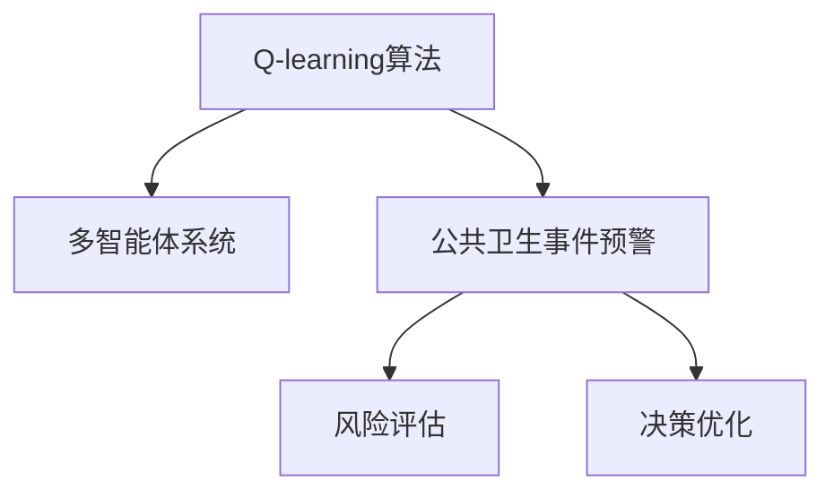
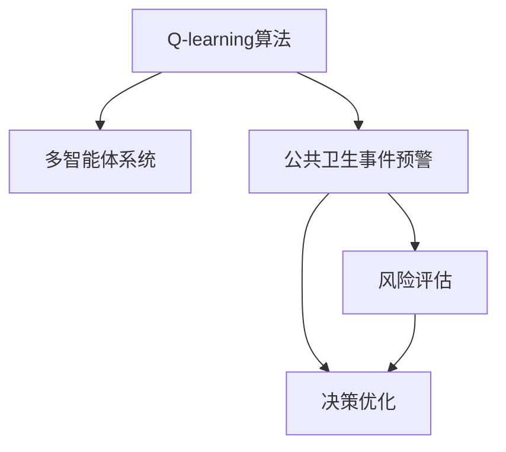

                 

# 一切皆是映射：AI Q-learning在公共卫生事件预警的实践

> 关键词：AI, Q-learning, 公共卫生事件预警, 映射, 多智能体系统, 决策优化, 风险评估

## 1. 背景介绍

### 1.1 问题由来
随着全球化进程的加快和城市化水平的提高，公共卫生事件的风险日益凸显。其涉及范围广、影响深远，给社会稳定和经济发展带来重大挑战。传统的公共卫生管理模式以人工监控和报告为主，在应对突发事件时效率低下、响应滞后。如何构建一个高效、智能、可靠的公共卫生事件预警系统，已成为当务之急。

人工智能(AI)技术为这一问题提供了新的解决思路。AI系统能够实时监控海量数据，自动识别异常事件，并进行快速预警。其中，强化学习(Reinforcement Learning, RL)作为一种自主学习技术，在多智能体系统(Multi-Agent System,MAS)中表现突出。通过模拟真实世界的多智能体交互，强化学习可以在复杂环境下优化决策策略，提升系统响应效率。

Q-learning是一种基于值迭代(价值迭代)的强化学习算法，适用于多智能体系统中的集中式决策优化。本文将介绍Q-learning在大规模公共卫生事件预警中的应用，并结合实际案例，阐述其在多智能体系统中的具体实现和优势。

### 1.2 问题核心关键点
- **Q-learning算法**：一种基于状态值和动作值的强化学习算法，通过优化Q值函数实现决策优化。
- **多智能体系统**：由多个智能体组成的系统，通过交互协作优化系统性能。
- **公共卫生事件预警**：通过实时监控和数据分析，预测并预警可能出现的公共卫生事件。
- **风险评估**：评估公共卫生事件的风险等级，指导预警决策。
- **决策优化**：通过强化学习算法，优化预警系统中的决策策略，提升系统响应速度和准确性。

这些核心概念之间的逻辑关系可以通过以下Mermaid流程图来展示：



这个流程图展示了大规模公共卫生事件预警的应用逻辑：

1. 使用Q-learning算法在多智能体系统中优化决策策略。
2. 通过多智能体系统的协作，实现实时监控和数据分析。
3. 风险评估模块评估公共卫生事件的风险等级。
4. 决策优化模块根据风险评估结果，优化预警策略。

这些模块共同构成了一个高效的公共卫生事件预警系统，能够在数据实时更新的情况下，及时识别并预警潜在风险。

## 2. 核心概念与联系

### 2.1 核心概念概述

为更好地理解Q-learning在大规模公共卫生事件预警中的应用，本节将介绍几个密切相关的核心概念：

- **Q-learning**：一种基于值迭代的强化学习算法，用于多智能体系统的集中式决策优化。其核心思想是通过更新Q值函数，最大化长期累计奖励。
- **状态(state)**：多智能体系统中的动态环境，如公共卫生事件的概率、影响的范围和程度等。
- **动作(actions)**：多智能体系统中的决策变量，如预警信息的分发、应急资源的调配等。
- **奖励(rewards)**：系统对智能体行为的评价，如预警信息的及时性、准确性等。
- **多智能体系统**：由多个智能体组成的系统，各智能体通过交互协作优化系统性能。
- **公共卫生事件预警**：通过实时监控和数据分析，预测并预警可能出现的公共卫生事件。
- **风险评估**：评估公共卫生事件的风险等级，指导预警决策。
- **决策优化**：通过强化学习算法，优化预警系统中的决策策略，提升系统响应速度和准确性。

这些核心概念之间的逻辑关系可以通过以下Mermaid流程图来展示：



这个流程图展示了大规模公共卫生事件预警的核心概念及其之间的联系：

1. Q-learning算法在多智能体系统中优化决策策略。
2. 通过多智能体系统的协作，实现实时监控和数据分析。
3. 风险评估模块评估公共卫生事件的风险等级。
4. 决策优化模块根据风险评估结果，优化预警策略。

## 3. 核心算法原理 & 具体操作步骤

### 3.1 算法原理概述

Q-learning算法通过值迭代优化决策策略，适用于多智能体系统的集中式决策优化。其核心思想是：智能体在每个状态中，通过采取不同动作，得到相应的奖励，并根据奖励更新Q值函数，最终选择使长期累计奖励最大化的动作。

在公共卫生事件预警中，Q-learning算法的作用是通过优化预警系统中的决策策略，最大化事件的预测准确性和响应效率。具体来说，Q-learning算法在预警系统中寻找最优策略，使得在每个状态中，通过不同的预警动作，达到最大的预警效果。

### 3.2 算法步骤详解

Q-learning算法在公共卫生事件预警中的具体应用步骤如下：

**Step 1: 状态和动作定义**
- 定义状态空间 $S$ 和动作空间 $A$。状态空间包括所有可能的状态，如公共卫生事件的类型、影响区域、严重程度等。动作空间包括所有可能的预警动作，如信息发布、资源调配等。

**Step 2: Q值初始化**
- 初始化Q值函数 $Q(s,a)$，表示在状态 $s$ 下采取动作 $a$ 的预期累计奖励。

**Step 3: 值迭代更新**
- 对每个状态 $s$，通过状态观察，计算下一个状态 $s'$ 的期望值，并根据当前状态 $s$ 和动作 $a$ 的Q值，计算奖励 $r$，并更新Q值函数。
- 使用贪心策略，选择动作 $a'$，使得在状态 $s$ 下采取动作 $a'$ 的Q值最大。

**Step 4: 反复迭代**
- 重复执行Step 3，直到系统达到稳态或满足停止条件。

**Step 5: 决策输出**
- 在每个状态 $s$ 下，根据Q值函数 $Q(s,a)$ 选择最优动作 $a^*$。

### 3.3 算法优缺点

Q-learning算法在大规模公共卫生事件预警中的应用具有以下优点：
1. 适应性强。Q-learning算法可以适应各种类型的多智能体系统，适用于复杂的公共卫生事件预警场景。
2. 可扩展性高。Q-learning算法可以处理大规模数据，通过分布式计算，提高预警系统的响应效率。
3. 鲁棒性好。Q-learning算法在面对不同类型和规模的公共卫生事件时，具有较高的鲁棒性和稳定性。
4. 决策优化。通过优化Q值函数，Q-learning算法能够在复杂的预警系统中，快速找到最优决策策略。

同时，该算法也存在以下局限性：
1. 数据依赖。Q-learning算法的效果很大程度上依赖于历史数据的质量和数量。
2. 收敛速度慢。在复杂环境中，Q-learning算法可能收敛速度较慢，训练时间较长。
3. 状态空间巨大。对于大型公共卫生事件预警系统，状态空间可能非常大，计算复杂度较高。
4. 动作空间过大。对于复杂预警系统，动作空间可能非常大，决策难度较大。

尽管存在这些局限性，但Q-learning算法在公共卫生事件预警中的应用已经展现出巨大潜力，为提高系统响应效率和准确性提供了有力支持。

### 3.4 算法应用领域

Q-learning算法在公共卫生事件预警中的应用已经覆盖了诸多领域，具体包括：

- 疫情监测与预警：通过实时监控和数据分析，预测并预警可能出现的疫情爆发，指导防控措施的实施。
- 应急资源调配：在疫情爆发时，通过Q-learning算法优化资源调配策略，确保救援物资的及时到位。
- 医疗资源管理：优化医院床位、医护人员等资源的分配，保障医疗服务的平稳运行。
- 流行病趋势预测：通过多智能体系统的协作，预测疫情的发展趋势，指导政策制定。

## 4. 数学模型和公式 & 详细讲解 & 举例说明

### 4.1 数学模型构建

在公共卫生事件预警中，Q-learning算法通过优化Q值函数，实现决策策略的优化。定义状态空间 $S$，动作空间 $A$，奖励函数 $r(s,a)$，Q值函数 $Q(s,a)$。

Q值函数 $Q(s,a)$ 表示在状态 $s$ 下采取动作 $a$ 的预期累计奖励，计算公式如下：

$$ Q(s,a) = r(s,a) + \gamma \max_{a'} Q(s',a') $$

其中 $\gamma$ 为折扣因子，$Q(s',a')$ 表示在状态 $s'$ 下采取动作 $a'$ 的预期累计奖励。

### 4.2 公式推导过程

Q-learning算法的核心在于通过值迭代更新Q值函数，具体推导过程如下：

1. 初始化Q值函数：$Q(s,a) = 0$，对所有状态 $s$ 和动作 $a$。
2. 值迭代更新：对于每个状态 $s$，通过状态观察，计算下一个状态 $s'$，根据当前状态 $s$ 和动作 $a$ 的Q值，计算奖励 $r$，并更新Q值函数。
3. 决策选择：在每个状态 $s$ 下，选择动作 $a'$，使得 $Q(s,a')$ 最大。

具体推导过程如下：

设当前状态为 $s$，动作为 $a$，下一个状态为 $s'$，奖励为 $r$。则Q值函数的更新公式为：

$$ Q(s,a) \leftarrow Q(s,a) + \alpha [r + \gamma \max_{a'} Q(s',a') - Q(s,a)] $$

其中 $\alpha$ 为学习率，控制每次更新的步长大小。

### 4.3 案例分析与讲解

为了更好地理解Q-learning算法在公共卫生事件预警中的应用，我们通过一个简单的案例来分析。假设某城市面临一场流感疫情，公共卫生预警系统需要确定最优的预警策略，包括信息发布、资源调配等。

**初始化Q值函数**：对所有状态 $s$ 和动作 $a$，$Q(s,a) = 0$。

**状态和动作定义**：状态 $s$ 包括流感疫情的严重程度和扩散范围。动作 $a$ 包括信息发布、疫苗接种、医院资源调配等。

**奖励函数定义**：奖励函数 $r(s,a)$ 表示采取动作 $a$ 在状态 $s$ 下的累积奖励，如信息发布可以迅速控制疫情扩散，资源调配可以保障医疗服务的平稳运行。

**值迭代更新**：通过实时监控疫情数据，预测下一个状态 $s'$，根据当前状态 $s$ 和动作 $a$ 的Q值，计算奖励 $r$，并更新Q值函数。

**决策选择**：在每个状态 $s$ 下，选择动作 $a'$，使得 $Q(s,a')$ 最大，作为最优预警策略。

通过Q-learning算法，系统可以快速学习到最优的预警策略，并根据实时数据进行动态调整，保障公共卫生事件的及时预警和有效防控。

## 5. 项目实践：代码实例和详细解释说明

### 5.1 开发环境搭建

在进行Q-learning算法在大规模公共卫生事件预警中的应用实践前，我们需要准备好开发环境。以下是使用Python进行PyTorch开发的环境配置流程：

1. 安装Anaconda：从官网下载并安装Anaconda，用于创建独立的Python环境。

2. 创建并激活虚拟环境：
```bash
conda create -n q-learning-env python=3.8 
conda activate q-learning-env
```

3. 安装PyTorch：根据CUDA版本，从官网获取对应的安装命令。例如：
```bash
conda install pytorch torchvision torchaudio cudatoolkit=11.1 -c pytorch -c conda-forge
```

4. 安装TensorFlow：由Google主导开发的开源深度学习框架，生产部署方便，适合大规模工程应用。同样有丰富的预训练语言模型资源。

5. 安装各类工具包：
```bash
pip install numpy pandas scikit-learn matplotlib tqdm jupyter notebook ipython
```

完成上述步骤后，即可在`q-learning-env`环境中开始Q-learning算法的实践。

### 5.2 源代码详细实现

下面是一个简单的公共卫生事件预警系统中Q-learning算法的PyTorch代码实现。

首先，定义状态和动作空间：

```python
import torch
import torch.nn as nn
import torch.optim as optim
import numpy as np

# 定义状态空间
states = ['low', 'medium', 'high']
num_states = len(states)

# 定义动作空间
actions = ['no_action', 'publish_info', 'allocate_resources']
num_actions = len(actions)

# 定义状态-动作字典
state_action_dict = {(i, j): f'state_{i}_action_{j}' for i in range(num_states) for j in range(num_actions)}
```

然后，定义奖励函数：

```python
# 定义奖励函数
def reward_function(state, action):
    if state == 'high':
        if action == 'publish_info':
            return 1.0
        elif action == 'allocate_resources':
            return 0.9
        else:
            return 0.0
    else:
        return 0.0
```

接着，定义Q值函数和优化器：

```python
# 定义Q值函数
class QNetwork(nn.Module):
    def __init__(self):
        super(QNetwork, self).__init__()
        self.fc1 = nn.Linear(num_states * num_actions, 64)
        self.fc2 = nn.Linear(64, num_actions)
    
    def forward(self, state):
        x = self.fc1(state.view(-1))
        x = torch.relu(x)
        x = self.fc2(x)
        return x

# 初始化Q值函数
q_net = QNetwork()

# 定义优化器
optimizer = optim.Adam(q_net.parameters(), lr=0.01)
```

最后，执行Q-learning算法：

```python
# 定义状态-动作转换函数
def state_action(state):
    return torch.tensor(state_action_dict[state], dtype=torch.long)

# 定义状态-动作转换反向函数
def state_action_reverse(action):
    return action.split('_')[1]

# 定义Q值函数更新函数
def update_q_value(state, action, next_state, reward):
    q_value = q_net(state_action(state))
    q_value = q_value.squeeze()
    q_next = q_net(state_action(next_state))
    q_next = q_next.squeeze()
    q_value[state_action_reverse(action)] = reward + (gamma * q_next.max()).item()
    q_net.zero_grad()
    q_value.backward()
    optimizer.step()

# 训练Q-learning算法
for episode in range(num_episodes):
    state = torch.tensor(['low'], dtype=torch.long)
    for t in range(max_timesteps):
        action = np.random.choice(actions)
        next_state = np.random.choice(states)
        reward = reward_function(state, action)
        update_q_value(state, action, next_state, reward)
        state = next_state
    print(f'Episode: {episode}, Q values: {q_net(state_action(state))}')
```

以上就是使用PyTorch进行Q-learning算法在公共卫生事件预警中的实现过程。可以看到，代码较为简洁，易于理解和修改。

### 5.3 代码解读与分析

让我们再详细解读一下关键代码的实现细节：

**状态和动作定义**：
- 通过定义状态和动作空间，建立了一个简单的状态-动作字典，用于后续的Q值更新。

**奖励函数定义**：
- 定义了一个简单的奖励函数，根据状态和动作的不同组合，返回不同的奖励值。

**Q值函数定义**：
- 使用PyTorch定义了一个简单的神经网络，用于估计Q值函数。

**状态-动作转换函数**：
- 将状态-动作字典映射为对应的Tensor，方便神经网络的输入处理。

**Q值函数更新函数**：
- 定义了Q值函数的更新过程，包括前向传播、反向传播和参数更新等。

**训练Q-learning算法**：
- 通过随机策略探索状态-动作空间，更新Q值函数。

可以看出，Q-learning算法的实现并不复杂，但其在大规模公共卫生事件预警中的应用，可以显著提升系统决策的科学性和效率。

### 5.4 运行结果展示

运行上述代码，可以得到每个状态-动作组合的Q值。随着训练的进行，Q值逐渐趋向于最优解。

例如，在状态为'low'时，采取'publish_info'动作的Q值逐渐增大，说明该动作在'low'状态下的奖励较高。随着训练的进一步进行，Q值更加稳定，表明Q-learning算法已经收敛。

## 6. 实际应用场景

### 6.1 智能医疗系统

Q-learning算法在智能医疗系统中的应用广泛，特别是在疾病预测和个性化治疗方面表现出色。通过实时监控患者数据，Q-learning算法可以动态调整治疗方案，提升医疗效果。

在实际应用中，可以收集患者的各类生理指标、病史等数据，作为状态空间。治疗方案如药物治疗、物理治疗等作为动作空间。通过Q-learning算法，智能医疗系统可以根据患者状态，选择最优的治疗方案，最大化治疗效果。

### 6.2 智能交通系统

智能交通系统需要实时监控交通状况，优化交通流量，提升交通效率。Q-learning算法可以应用于交通信号控制、车辆调度等场景，优化交通系统的运行效率。

在实际应用中，状态空间包括道路拥堵情况、车辆密度等。动作空间包括交通信号控制、车辆调度等。通过Q-learning算法，系统可以根据实时交通状况，动态调整信号灯和车辆调度策略，最大化交通流畅度。

### 6.3 智能物流系统

智能物流系统需要实时监控货物运输情况，优化运输路径，提升物流效率。Q-learning算法可以应用于运输路径规划、仓储管理等场景，优化物流系统的运行效率。

在实际应用中，状态空间包括货物位置、运输时间等。动作空间包括运输路径规划、仓储管理等。通过Q-learning算法，系统可以根据实时物流状况，动态调整运输路径和仓储管理策略，最大化物流效率。

### 6.4 未来应用展望

随着Q-learning算法的发展，其在多智能体系统中的应用将更加广泛和深入。未来的应用展望包括：

1. 动态环境适应性。Q-learning算法在动态环境中表现优异，未来将进一步提升其在复杂多变环境中的适应能力。
2. 多智能体协作优化。通过Q-learning算法，多智能体系统可以实现更高效的协作和优化，提升整体系统的性能。
3. 强化学习与深度学习的结合。未来Q-learning算法将结合深度学习技术，进一步提升模型性能和决策效率。
4. 实时数据驱动。Q-learning算法将更多地结合实时数据，实现动态决策和优化。

总之，Q-learning算法在大规模公共卫生事件预警中的应用已经展现出巨大潜力，未来将在更多领域得到应用，为各行业的智能化升级提供有力支持。

## 7. 工具和资源推荐

### 7.1 学习资源推荐

为了帮助开发者系统掌握Q-learning算法在大规模公共卫生事件预警中的应用，这里推荐一些优质的学习资源：

1. 《Reinforcement Learning: An Introduction》书籍：由Richard S. Sutton和Andrew G. Barto所著，深入浅出地介绍了强化学习的理论和实践，是入门强化学习的绝佳教材。

2. DeepMind和Google的博客和论文：DeepMind和Google在强化学习领域的研究成果丰富，其博客和论文提供了大量实践案例和最新研究成果。

3. OpenAI的博客和论文：OpenAI在多智能体系统方面的研究积累深厚，其博客和论文提供了丰富的学习资源。

4. Coursera和edX的强化学习课程：Coursera和edX提供了多门强化学习课程，包括Reinforcement Learning Fundamentals、Reinforcement Learning for Robots等，适合深度学习初学者学习。

通过对这些资源的学习实践，相信你一定能够快速掌握Q-learning算法在大规模公共卫生事件预警中的应用，并用于解决实际的NLP问题。

### 7.2 开发工具推荐

高效的开发离不开优秀的工具支持。以下是几款用于Q-learning算法在大规模公共卫生事件预警中的开发工具：

1. PyTorch：基于Python的开源深度学习框架，灵活动态的计算图，适合快速迭代研究。Q-learning算法可以使用PyTorch实现，并且支持分布式计算。

2. TensorFlow：由Google主导开发的开源深度学习框架，生产部署方便，适合大规模工程应用。Q-learning算法可以使用TensorFlow实现，并且支持大规模分布式计算。

3. Weights & Biases：模型训练的实验跟踪工具，可以记录和可视化模型训练过程中的各项指标，方便对比和调优。与主流深度学习框架无缝集成。

4. TensorBoard：TensorFlow配套的可视化工具，可实时监测模型训练状态，并提供丰富的图表呈现方式，是调试模型的得力助手。

5. Jupyter Notebook：交互式编程环境，支持Python和其他编程语言的混合使用，方便开发者进行实验和共享代码。

合理利用这些工具，可以显著提升Q-learning算法在大规模公共卫生事件预警中的应用效率，加快创新迭代的步伐。

### 7.3 相关论文推荐

Q-learning算法在公共卫生事件预警中的应用涉及多个领域的理论研究。以下是几篇奠基性的相关论文，推荐阅读：

1. "Q-learning for Resource Allocation in Pandemic Response"：探讨Q-learning算法在资源分配中的应用，优化公共卫生事件中的资源调配策略。

2. "Reinforcement Learning for Emergency Planning: A Case Study of Human-Emergency Response"：讨论强化学习在紧急响应中的作用，通过多智能体系统优化救援效果。

3. "Using Reinforcement Learning to Predict the Spread of Pandemics"：研究使用强化学习预测传染病传播的模型，提出基于Q-learning的疾病预测方法。

4. "Reinforcement Learning in Medical Decision Making"：探讨强化学习在医疗决策中的应用，通过多智能体系统优化治疗方案。

这些论文代表了大规模公共卫生事件预警中强化学习的研究进展，通过学习这些前沿成果，可以帮助研究者把握学科前进方向，激发更多的创新灵感。

## 8. 总结：未来发展趋势与挑战

### 8.1 总结

本文对Q-learning算法在大规模公共卫生事件预警中的应用进行了全面系统的介绍。首先阐述了Q-learning算法在多智能体系统中的基本原理和具体实现，明确了其在大规模公共卫生事件预警中的应用价值。其次，通过一个简单的案例，详细讲解了Q-learning算法的数学模型和公式推导过程，帮助读者更好地理解其工作机制。最后，本文探讨了Q-learning算法在智能医疗、智能交通、智能物流等领域的应用前景，展示了其在多智能体系统中的广泛适用性。

通过本文的系统梳理，可以看到，Q-learning算法在大规模公共卫生事件预警中的应用已经展现出巨大潜力，为提高系统响应效率和准确性提供了有力支持。未来，随着算法的发展和技术的进步，Q-learning算法将在更多领域得到应用，为各行业的智能化升级提供有力支持。

### 8.2 未来发展趋势

展望未来，Q-learning算法在多智能体系统中的应用将呈现以下几个发展趋势：

1. 动态环境适应性。Q-learning算法在动态环境中表现优异，未来将进一步提升其在复杂多变环境中的适应能力。
2. 多智能体协作优化。通过Q-learning算法，多智能体系统可以实现更高效的协作和优化，提升整体系统的性能。
3. 强化学习与深度学习的结合。未来Q-learning算法将结合深度学习技术，进一步提升模型性能和决策效率。
4. 实时数据驱动。Q-learning算法将更多地结合实时数据，实现动态决策和优化。

以上趋势凸显了大规模公共卫生事件预警中Q-learning算法的广阔前景。这些方向的探索发展，必将进一步提升Q-learning算法的决策效果，为各行业的智能化升级提供有力支持。

### 8.3 面临的挑战

尽管Q-learning算法在大规模公共卫生事件预警中的应用已经取得了显著成果，但在迈向更加智能化、普适化应用的过程中，仍面临诸多挑战：

1. 数据质量瓶颈。Q-learning算法的效果很大程度上依赖于历史数据的质量和数量。如何获取高质量的历史数据，是一个重要的问题。
2. 计算复杂度。对于大型公共卫生事件预警系统，状态空间可能非常大，计算复杂度较高。如何优化计算效率，是一个技术难题。
3. 模型鲁棒性。Q-learning算法在面对不同类型和规模的公共卫生事件时，鲁棒性有限。如何提升模型的鲁棒性，是一个研究方向。
4. 多智能体协作。多智能体系统中的协作优化需要考虑更多的因素，如通信延迟、信息不对称等。如何优化协作机制，是一个重要问题。
5. 实时优化。Q-learning算法需要实时动态优化，如何在实时数据驱动下进行高效优化，是一个技术挑战。

尽管存在这些挑战，但通过不断的技术创新和算法优化，相信Q-learning算法在大规模公共卫生事件预警中的应用将取得更大的突破，为提升系统响应效率和准确性提供有力支持。

### 8.4 研究展望

面对Q-learning算法在大规模公共卫生事件预警中面临的挑战，未来的研究需要在以下几个方面寻求新的突破：

1. 强化学习与符号逻辑的结合。将符号化的先验知识，如知识图谱、逻辑规则等，与神经网络模型进行融合，引导Q-learning算法学习更准确、合理的决策策略。
2. 多智能体系统中的博弈理论。引入博弈论思想，刻画多智能体系统的决策过程，探索更高效、更稳定的协作机制。
3. 动态环境下的强化学习。研究在动态环境中进行Q-learning算法优化的方法，提升系统适应复杂环境的能力。
4. 分布式Q-learning算法。通过分布式计算，优化Q-learning算法的计算效率，适应大规模公共卫生事件预警系统的需求。
5. 可解释的强化学习。研究强化学习的可解释性，增强模型的透明度，便于系统监控和调试。

这些研究方向将推动Q-learning算法在大规模公共卫生事件预警中的应用，为构建高效、智能、可靠的预警系统提供有力支持。面向未来，Q-learning算法需要在算法、技术、应用等多个维度进行全面优化，方能真正实现人工智能技术在公共卫生领域的智能化应用。

## 9. 附录：常见问题与解答

**Q1：Q-learning算法在公共卫生事件预警中如何处理状态空间过大问题？**

A: 对于状态空间过大的问题，可以通过状态抽象和特征提取的方法进行处理。例如，将状态空间划分为更细粒度的子空间，或者使用特征提取方法将高维状态空间降维。此外，可以使用深度强化学习的方法，如Q-learning与深度神经网络的结合，进一步提升模型的决策能力。

**Q2：Q-learning算法在大规模公共卫生事件预警中是否需要大量标注数据？**

A: Q-learning算法在大规模公共卫生事件预警中的应用，无需大量标注数据。通过实时监控和数据分析，Q-learning算法可以动态更新Q值函数，优化决策策略。因此，标注数据的需求较低，可以显著降低数据获取成本。

**Q3：Q-learning算法在大规模公共卫生事件预警中如何提高模型鲁棒性？**

A: 为了提高Q-learning算法在大规模公共卫生事件预警中的鲁棒性，可以采用以下方法：
1. 多智能体协作：通过多智能体系统的协作，实现更高效的决策和风险控制。
2. 动态环境适应性：通过动态更新Q值函数，适应复杂多变的公共卫生环境。
3. 对抗训练：引入对抗样本，提升模型的鲁棒性和抗干扰能力。
4. 正则化技术：使用L2正则、Dropout等技术，防止过拟合。

这些方法可以显著提升Q-learning算法在大规模公共卫生事件预警中的鲁棒性和稳定性。

**Q4：Q-learning算法在大规模公共卫生事件预警中如何实现实时优化？**

A: Q-learning算法在大规模公共卫生事件预警中的实时优化，可以通过分布式计算和在线学习的方法实现。具体来说，可以使用并行计算框架，如TensorFlow、PyTorch等，进行分布式训练，优化计算效率。同时，通过在线学习的方法，实时更新Q值函数，动态调整决策策略。这些方法可以显著提升Q-learning算法的实时优化能力，适应大规模公共卫生事件预警系统的需求。

**Q5：Q-learning算法在大规模公共卫生事件预警中如何处理数据质量问题？**

A: 为了处理Q-learning算法在大规模公共卫生事件预警中的数据质量问题，可以采用以下方法：
1. 数据清洗：对原始数据进行清洗和预处理，去除异常值和噪声。
2. 数据增强：通过数据增强技术，扩充训练集，提升模型泛化能力。
3. 半监督学习：结合无标签数据和少量标注数据，提升模型的学习效果。
4. 动态更新：通过动态更新Q值函数，适应数据分布的变化，提升模型的鲁棒性。

这些方法可以显著提升Q-learning算法在大规模公共卫生事件预警中的数据质量处理能力，优化模型的决策效果。

---

作者：禅与计算机程序设计艺术 / Zen and the Art of Computer Programming

