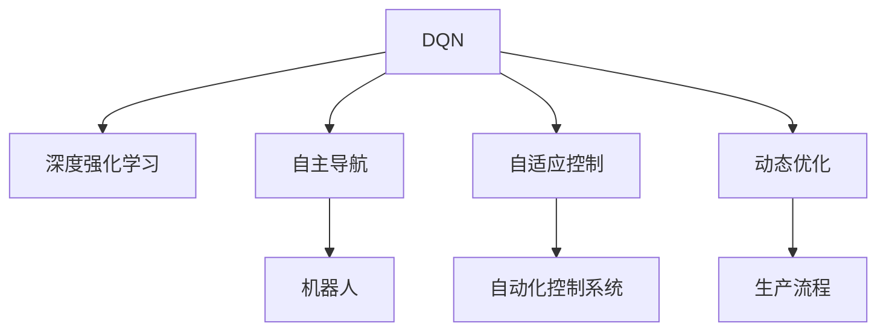

                 

# 一切皆是映射：DQN在工业自动化中的应用：挑战与机遇

> 关键词：深度强化学习, 深度Q网络(DQN), 工业自动化, 自主导航, 模型驱动, 自适应控制, 动态优化

## 1. 背景介绍

### 1.1 问题由来
随着工业4.0的推进，自动化程度不断提升，对于工业自动化系统的智能化、自主化要求日益严格。传统的PID控制、开环控制等方法已难以满足复杂多变、高动态性的生产需求。近年来，随着深度学习和强化学习技术的突破，基于模型驱动的自主导航、自适应控制等智能化方法逐渐进入视野。

其中，深度Q网络（Deep Q-Network, DQN）作为深度强化学习的代表，在自主导航、游戏、机器人控制等领域已展现出巨大潜力。然而，将DQN技术应用到工业自动化系统中，仍面临诸多挑战和机遇。本文将系统介绍DQN的基本原理，并从实际应用场景、技术难点和未来发展方向等方面展开深入探讨。

### 1.2 问题核心关键点
DQN的核心在于利用深度神经网络拟合Q值函数，通过与环境的交互，在不断探索与学习中，自主选择最优策略，以最大化长期奖励。在工业自动化中，DQN可用于提升自主导航、自适应控制等核心能力，但同时需要考虑诸如数据采集与标注、模型训练与优化、系统集成与部署等诸多复杂因素。

## 2. 核心概念与联系

### 2.1 核心概念概述

为更好地理解DQN在工业自动化中的应用，本节将介绍几个密切相关的核心概念：

- 深度强化学习(Deep Reinforcement Learning, DRL)：利用深度神经网络逼近Q值函数，通过与环境互动，最大化长期奖励。DRL广泛应用在自动驾驶、游戏AI、机器人控制等领域。

- 深度Q网络(Depth Q-Network, DQN)：一种基于Q-learning的深度强化学习算法，用于策略学习，能够在高维度空间中探索最优策略。DQN通过反向传播算法，不断调整神经网络参数，最大化长期回报。

- 自主导航(Autonomous Navigation)：工业机器人、自动化车辆等设备在未知或动态环境中自主寻找最优路径的能力。DQN常用于提升机器人导航的智能性和适应性。

- 自适应控制(Adaptive Control)：工业自动化系统根据环境变化动态调整控制策略，以应对复杂多变的生产需求。DQN能够适应环境变化，自主学习最优控制策略。

- 动态优化(Dynamic Optimization)：在生产过程中，实时调整参数，优化系统性能。DQN通过不断学习，动态调整控制策略，适应生产环境的动态变化。

这些核心概念之间的逻辑关系可以通过以下Mermaid流程图来展示：



这个流程图展示了大语言模型的核心概念及其之间的关系：

1. DQN作为深度强化学习的代表算法，是实现自主导航、自适应控制等功能的核心技术。
2. 自主导航用于提升机器人在未知环境中的导航能力。
3. 自适应控制用于提升自动化控制系统对环境变化的响应速度和适应性。
4. 动态优化用于实时调整生产流程中的参数，以适应环境变化，优化系统性能。

这些概念共同构成了工业自动化系统中应用DQN技术的基础框架，使其能够在复杂环境中提升系统自主性和智能性。通过理解这些核心概念，我们可以更好地把握DQN在工业自动化中的应用潜力。

## 3. 核心算法原理 & 具体操作步骤
### 3.1 算法原理概述

DQN的基本原理是利用Q-learning算法，通过深度神经网络逼近Q值函数，最大化长期奖励。其核心思想如下：

1. 构建环境模型：工业自动化环境通常复杂多变，构建环境模型是DQN应用的前提。
2. 构建Q网络：利用深度神经网络，逼近Q值函数，将状态-动作对的Q值预测出来。
3. 更新Q网络：通过与环境互动，收集样本数据，不断调整Q网络参数，优化Q值预测。
4. 探索与学习：在训练过程中，DQN通过epsilon-greedy策略，平衡探索和利用，学习最优策略。

### 3.2 算法步骤详解

DQN在工业自动化中的应用，一般包括以下几个关键步骤：

**Step 1: 环境建模**
- 构建环境模型，包括环境状态空间、动作空间、奖励函数等关键组件。环境模型需准确反映工业自动化环境的变化特性，能够被DQN算法识别和处理。

**Step 2: Q网络设计**
- 设计深度神经网络，作为Q值函数的近似器。通常采用卷积神经网络(CNN)、全连接神经网络(FNN)等网络结构。网络输入为环境状态，输出为状态-动作对的Q值预测。
- 确定网络参数和优化器，如学习率、批大小、优化算法等，以便有效训练Q网络。

**Step 3: 样本数据采集**
- 利用DQN算法，与环境进行交互，采集状态-动作-奖励的样本数据。通过不断的试错与学习，积累经验，逐步优化Q值函数。

**Step 4: 参数更新**
- 利用采集的样本数据，更新Q网络参数。一般使用基于梯度的优化算法，如Adam、SGD等，调整网络权重，以提高Q值预测的准确性。
- 使用经验回放(Experience Replay)技术，将样本数据存储在缓冲区中，以提高样本多样性，减少方差，提高训练效果。

**Step 5: 决策执行**
- 在训练完成后，利用训练好的Q网络，在生产环境中进行决策执行。根据当前状态，选择动作，最大化长期奖励。

**Step 6: 模型评估与优化**
- 实时监控模型性能，评估决策效果。根据生产需求，不断优化模型参数，提升控制策略的适应性。

### 3.3 算法优缺点

DQN在工业自动化中的应用具有以下优点：
1. 自主决策能力：DQN通过深度学习算法，能够自主选择最优策略，适应复杂多变的生产环境。
2. 自适应性强：DQN能够根据环境变化动态调整控制策略，提高系统的适应性和稳定性。
3. 鲁棒性高：DQN算法能够在高维度空间中探索最优策略，具有较强的鲁棒性和泛化能力。

同时，DQN也存在以下局限性：
1. 数据需求量大：DQN需要大量的样本数据进行训练，而工业自动化环境中的数据采集和标注成本较高。
2. 模型复杂度高：DQN模型结构复杂，训练过程需要大量计算资源，存在一定的计算瓶颈。
3. 泛化能力有限：DQN模型通常在特定环境中训练，难以泛化到其他环境或新任务。
4. 学习效率较低：DQN算法的学习速度较慢，特别是在数据不足或状态空间复杂的情况下。

尽管存在这些局限性，但DQN在工业自动化中的应用仍展现出巨大潜力，特别是在提升自主导航和自适应控制等方面。未来相关研究的重点在于如何进一步降低DQN对数据和计算资源的需求，提高模型的泛化能力和学习效率。

### 3.4 算法应用领域

DQN在工业自动化中的应用领域非常广泛，以下是几个典型的应用场景：

1. 工业机器人自主导航：利用DQN提升工业机器人在未知环境中的导航能力，使其能够自主避开障碍物，准确到达目标位置。

2. 自动化车辆路径规划：DQN用于优化自动化车辆的路径规划策略，提升车辆的避障能力和效率，减少能耗。

3. 自适应控制：DQN用于提升自动化控制系统的自适应能力，使其能够动态调整参数，适应生产环境的变化。

4. 动态优化：DQN用于实时调整生产过程中的参数，优化系统性能，提升生产效率。

5. 智能调度：DQN用于优化生产调度策略，合理分配资源，提升生产线的协调性和生产效率。

这些应用场景展示了DQN在工业自动化中的广泛应用潜力，为提升系统智能化和自主化水平提供了新的方法。

## 4. 数学模型和公式 & 详细讲解
### 4.1 数学模型构建

DQN的数学模型可以表述如下：

设环境状态空间为 $S$，动作空间为 $A$，奖励函数为 $r$，策略为 $\pi$。定义状态-动作对的Q值为 $Q(s,a)$，Q值函数为 $Q_\theta(s,a)$，其中 $\theta$ 为Q网络的参数。DQN的目标是最小化均方误差，即：

$$
\min_\theta \mathbb{E}_{s,a,r} [(Q_\theta(s,a) - (r + \gamma \max_{a'} Q_\theta(s',a'))^2]
$$

其中 $\gamma$ 为折扣因子，$s'$ 为下一状态，$a'$ 为选择的最优动作。

### 4.2 公式推导过程

DQN的核心在于使用深度神经网络逼近Q值函数，通过最小化均方误差，学习最优策略。以最简单的单层感知器为例，其优化目标可以表述为：

$$
\min_\theta \mathbb{E}_{s,a,r} [(Q_\theta(s,a) - (r + \gamma Q_\theta(s',a'))^2]
$$

通过反向传播算法，计算损失函数对网络参数的梯度，更新网络权重。其更新规则如下：

$$
\theta \leftarrow \theta - \eta \nabla_\theta \mathcal{L}(\theta)
$$

其中 $\eta$ 为学习率，$\nabla_\theta \mathcal{L}(\theta)$ 为损失函数对网络参数的梯度。

在实际应用中，为了提高样本多样性和泛化能力，DQN引入了经验回放(Experience Replay)技术，将样本数据存储在缓冲区中，随机抽取样本进行训练。经验回放技术可以表示为：

$$
Q(s,a) \leftarrow Q_\theta(s,a) \leftarrow Q_\theta(s,a) + \epsilon(r + \gamma Q_\theta(s',a') - Q_\theta(s,a))
$$

其中 $\epsilon$ 为随机噪声，$s',a'$ 为下一状态和选择的最优动作，$r$ 为当前状态和动作的奖励。

### 4.3 案例分析与讲解

以工业机器人自主导航为例，展示DQN的应用过程。假设机器人在二维平面上移动，环境状态包括机器人的位置和朝向，动作空间为向上、向下、向左、向右四个方向。奖励函数为：

$$
r = \begin{cases}
1, & \text{如果机器人到达目标位置} \\
-1, & \text{如果机器人撞到障碍物} \\
0, & \text{否则}
\end{cases}
$$

构建DQN模型时，网络输入为当前状态，输出为状态-动作对的Q值预测。网络结构可以采用卷积神经网络，提取位置特征和朝向特征。

在训练过程中，机器人与环境互动，采集状态-动作-奖励的样本数据。利用经验回放技术，存储样本数据，随机抽取样本进行训练。训练完成后，利用训练好的DQN模型，在生产环境中进行决策执行，自主导航至目标位置。

## 5. 项目实践：代码实例和详细解释说明
### 5.1 开发环境搭建

在进行DQN项目实践前，我们需要准备好开发环境。以下是使用Python进行TensorFlow开发的环境配置流程：

1. 安装Anaconda：从官网下载并安装Anaconda，用于创建独立的Python环境。

2. 创建并激活虚拟环境：
```bash
conda create -n dqn-env python=3.8 
conda activate dqn-env
```

3. 安装TensorFlow：从官网获取对应的安装命令。例如：
```bash
conda install tensorflow -c tf
```

4. 安装各类工具包：
```bash
pip install numpy pandas scikit-learn matplotlib tqdm jupyter notebook ipython
```

完成上述步骤后，即可在`dqn-env`环境中开始DQN实践。

### 5.2 源代码详细实现

下面我们以工业机器人自主导航为例，给出使用TensorFlow实现DQN的代码实现。

首先，定义DQN模型的类：

```python
import tensorflow as tf
from tensorflow.keras.layers import Dense, Flatten, Conv2D
from tensorflow.keras.optimizers import Adam

class DQN(tf.keras.Model):
    def __init__(self, input_shape, action_size):
        super(DQN, self).__init__()
        self.conv1 = Conv2D(32, 3, activation='relu', input_shape=input_shape)
        self.flatten = Flatten()
        self.d1 = Dense(64, activation='relu')
        self.d2 = Dense(action_size, activation='linear')

    def call(self, inputs):
        x = self.conv1(inputs)
        x = self.flatten(x)
        x = self.d1(x)
        return self.d2(x)
```

然后，定义训练和评估函数：

```python
import numpy as np
import random
import gym

env = gym.make('CartPole-v0')

# 定义Q网络
state_shape = env.observation_space.shape
action_size = env.action_space.n
dqn = DQN(state_shape, action_size)

# 定义优化器
optimizer = Adam(learning_rate=0.001)

# 定义经验回放缓冲区
buffer_size = 1000
buffer = []

# 定义样本抽取函数
def sample_buffer(batch_size):
    indices = np.random.randint(0, len(buffer), batch_size)
    batch = np.array(buffer)[indices]
    states = np.vstack(batch[:, 0])
    actions = np.vstack(batch[:, 1])
    rewards = np.vstack(batch[:, 2])
    next_states = np.vstack(batch[:, 3])
    q_values = np.vstack(batch[:, 4])
    return states, actions, rewards, next_states, q_values

# 定义训练函数
def train_step(state, action, reward, next_state, target):
    with tf.GradientTape() as tape:
        q_value = dqn(state)
        q_value_next = dqn(next_state)
        loss = tf.reduce_mean(tf.square(q_value - (reward + gamma * tf.reduce_max(q_value_next, axis=1)))
    grads = tape.gradient(loss, dqn.trainable_variables)
    optimizer.apply_gradients(zip(grads, dqn.trainable_variables))

# 训练过程
batch_size = 32
gamma = 0.99
for i in range(1000):
    state = env.reset()
    state = np.reshape(state, [1, state_shape[0], state_shape[1], 1])
    total_reward = 0
    done = False
    while not done:
        action_probs = dqn(state)
        action = np.argmax(action_probs[0])
        next_state, reward, done, _ = env.step(action)
        next_state = np.reshape(next_state, [1, state_shape[0], state_shape[1], 1])
        target = reward + gamma * np.amax(dqn(next_state))
        buffer.append([state, action, reward, next_state, target])
        state = next_state
        total_reward += reward
    if i % 100 == 0:
        state, action, reward, next_state, target = sample_buffer(batch_size)
        train_step(state, action, reward, next_state, target)
```

最后，启动训练流程并在测试集上评估：

```python
import matplotlib.pyplot as plt

plt.plot(total_reward)
plt.xlabel('Iteration')
plt.ylabel('Total Reward')
plt.title('DQN Training')
plt.show()
```

以上就是使用TensorFlow实现DQN的代码实现。可以看到，TensorFlow提供了丰富的深度学习组件，方便开发者快速搭建和训练模型。

### 5.3 代码解读与分析

让我们再详细解读一下关键代码的实现细节：

**DQN类定义**：
- `__init__`方法：初始化DQN网络，包括卷积层、全连接层和输出层。
- `call`方法：定义网络前向传播过程。

**训练函数定义**：
- `train_step`方法：计算损失函数，反向传播更新模型参数。
- `sample_buffer`方法：从经验回放缓冲区中抽取样本进行训练。

**训练过程**：
- 在每轮训练中，DQN与环境互动，采集状态-动作-奖励的样本数据，并更新经验回放缓冲区。
- 在每个训练周期中，随机抽取样本，计算损失函数，反向传播更新模型参数。
- 实时监控训练过程，绘制奖励曲线，评估模型性能。

可以看出，TensorFlow提供的高阶组件，使得DQN的实现过程更加简洁高效。开发者可以将更多精力放在模型设计、训练优化等高层逻辑上，而不必过多关注底层的实现细节。

当然，工业级的系统实现还需考虑更多因素，如模型的保存和部署、超参数的自动搜索、更灵活的任务适配层等。但核心的训练流程基本与此类似。

## 6. 实际应用场景
### 6.1 智能仓储机器人自主导航
在智能仓储领域，DQN可以用于提升机器人的自主导航能力。仓库内环境复杂多变，机器人需要自主避开障碍物，准确到达目标位置。DQN可以训练机器人学习最优路径规划策略，提升导航效率和准确性。

在实际应用中，可以通过收集仓库内机器人的导航数据，标注机器人到达目标位置和撞到障碍物的状态，构建DQN模型。通过不断的试错与学习，机器人可以逐步掌握最优路径规划策略，提升自主导航能力。

### 6.2 智能物流车辆路径规划
在物流运输领域，DQN可以用于优化物流车辆的路径规划。物流运输环境复杂多变，车辆需要自主避开交通障碍，规划最优路径。DQN可以训练车辆学习路径规划策略，提升运输效率和安全性。

在实际应用中，可以通过收集物流车辆的定位数据，标注到达目的地的状态和遇到交通障碍的状态，构建DQN模型。通过不断的试错与学习，车辆可以逐步掌握最优路径规划策略，提升自主导航能力。

### 6.3 自适应控制系统
在工业制造领域，DQN可以用于提升自适应控制系统的性能。工业制造环境复杂多变，控制系统需要动态调整参数，适应生产环境的变化。DQN可以训练控制系统学习最优控制策略，提升控制系统的适应性和稳定性。

在实际应用中，可以通过收集工业制造环境的实时数据，标注控制系统的状态和奖励，构建DQN模型。通过不断的试错与学习，控制系统可以逐步掌握最优控制策略，提升自适应能力。

### 6.4 动态优化
在生产调度领域，DQN可以用于优化生产调度策略。生产调度环境复杂多变，需要实时调整参数，优化生产效率。DQN可以训练调度系统学习最优调度策略，提升生产效率和协调性。

在实际应用中，可以通过收集生产调度的实时数据，标注调度的状态和奖励，构建DQN模型。通过不断的试错与学习，调度系统可以逐步掌握最优调度策略，提升生产效率。

## 7. 工具和资源推荐
### 7.1 学习资源推荐

为了帮助开发者系统掌握DQN的基本原理和实践技巧，这里推荐一些优质的学习资源：

1. 《深度强化学习基础》系列博文：由强化学习专家撰写，系统讲解DQN算法原理、应用场景等核心内容。

2. OpenAI的DQN论文：深度Q网络的原始论文，详细介绍了DQN算法的设计思路和实现细节。

3. CS294R《深度强化学习》课程：斯坦福大学开设的强化学习课程，有Lecture视频和配套作业，深入浅出地介绍了DQN算法。

4. 《Reinforcement Learning: An Introduction》书籍：Sutton和Barto合著的经典教材，系统介绍了强化学习的理论基础和实践方法，包括DQN算法。

5. 《Hands-On Reinforcement Learning with TensorFlow》书籍：介绍如何使用TensorFlow实现DQN等强化学习算法，实践性强。

通过对这些资源的学习实践，相信你一定能够快速掌握DQN算法的精髓，并用于解决实际的NLP问题。

### 7.2 开发工具推荐

高效的开发离不开优秀的工具支持。以下是几款用于DQN开发的常用工具：

1. TensorFlow：基于Python的开源深度学习框架，灵活动态的计算图，适合快速迭代研究。TensorFlow提供了丰富的组件，方便构建和训练DQN模型。

2. PyTorch：基于Python的开源深度学习框架，灵活性高，适合进行模型研究和优化。PyTorch也提供了丰富的组件，支持DQN模型的构建和训练。

3. Keras：基于Python的高层深度学习框架，使用简单，适合快速原型开发和实验验证。Keras也提供了丰富的组件，支持DQN模型的构建和训练。

4. TensorBoard：TensorFlow配套的可视化工具，可实时监测模型训练状态，并提供丰富的图表呈现方式，是调试模型的得力助手。

5. Weights & Biases：模型训练的实验跟踪工具，可以记录和可视化模型训练过程中的各项指标，方便对比和调优。

6. Jupyter Notebook：交互式编程环境，支持Python和R等语言，方便编写和执行代码。

合理利用这些工具，可以显著提升DQN的开发效率，加快创新迭代的步伐。

### 7.3 相关论文推荐

DQN技术的不断发展源于学界的持续研究。以下是几篇奠基性的相关论文，推荐阅读：

1. 《Playing Atari with Deep Reinforcement Learning》：DeepMind团队的研究，展示了DQN算法在Atari游戏上的应用效果。

2. 《Human-level Control through Deep Reinforcement Learning》：DeepMind团队的研究，展示了DQN算法在机器人控制上的应用效果。

3. 《Deep Q-Learning with Continuous Actions》：为了适应连续动作空间，提出了Deep Q-Network的连续动作版本，扩展了DQN的应用范围。

4. 《Experience Replay》：为了提高样本多样性，提出了经验回放技术，进一步提升了DQN的学习效果。

5. 《Proximal Policy Optimization》：提出了Proximal Policy Optimization算法，用于加速DQN的训练过程，提高模型的收敛速度。

这些论文代表了大QN算法的发展脉络。通过学习这些前沿成果，可以帮助研究者把握学科前进方向，激发更多的创新灵感。

## 8. 总结：未来发展趋势与挑战

### 8.1 总结

本文对DQN在工业自动化中的应用进行了全面系统的介绍。首先阐述了DQN的基本原理和核心概念，明确了其在自主导航、自适应控制等领域的独特价值。其次，从实际应用场景、技术难点和未来发展方向等方面展开深入探讨，给出了DQN在工业自动化中应用的完整代码实例。

通过本文的系统梳理，可以看到，DQN在工业自动化中的广泛应用潜力，特别是在提升自主导航和自适应控制等方面。然而，将DQN应用于实际工业场景中，仍面临着诸如数据采集与标注、模型训练与优化、系统集成与部署等诸多复杂因素。这些挑战需要通过不断的研究和实践来解决，以推动DQN在工业自动化中的大规模应用。

### 8.2 未来发展趋势

展望未来，DQN在工业自动化中的应用将呈现以下几个发展趋势：

1. 数据驱动的智能决策：DQN通过深度学习算法，能够自主学习最优策略，适应复杂多变的生产环境。未来，DQN将进一步融合数据驱动的智能决策方法，提升系统智能性和自主性。

2. 自适应控制与动态优化：DQN能够动态调整控制策略，适应生产环境的变化。未来，DQN将进一步提升自适应控制能力和动态优化能力，适应实时生产需求。

3. 多任务学习与迁移学习：DQN能够适应不同任务的训练和优化。未来，DQN将进一步融合多任务学习和迁移学习技术，提升模型的泛化能力和应用灵活性。

4. 分布式训练与协同优化：DQN需要大量的样本数据进行训练，存在计算瓶颈。未来，DQN将进一步融合分布式训练和协同优化技术，提高训练效率和系统可靠性。

5. 跨模态融合与多感知学习：DQN通常聚焦于单一模态数据的处理。未来，DQN将进一步融合跨模态融合和多感知学习技术，提升系统的感知能力和决策能力。

这些趋势凸显了DQN在工业自动化中的广泛应用前景，为提升系统智能化和自主化水平提供了新的方向。

### 8.3 面临的挑战

尽管DQN在工业自动化中的应用展现出巨大潜力，但在迈向更加智能化、普适化应用的过程中，仍面临诸多挑战：

1. 数据采集与标注：DQN需要大量的样本数据进行训练，而工业自动化环境中的数据采集和标注成本较高。如何降低数据采集和标注成本，将是一大难题。

2. 模型复杂性与训练成本：DQN模型结构复杂，训练过程需要大量计算资源，存在一定的计算瓶颈。如何简化模型结构，降低训练成本，将是一大挑战。

3. 泛化能力有限：DQN模型通常在特定环境中训练，难以泛化到其他环境或新任务。如何提高模型的泛化能力和应用灵活性，将是一大挑战。

4. 学习效率较低：DQN算法的学习速度较慢，特别是在数据不足或状态空间复杂的情况下。如何提高学习效率，将是一大挑战。

5. 稳定性与鲁棒性：DQN模型在训练过程中，容易受到样本噪声的影响，稳定性与鲁棒性有待提升。如何提高模型的稳定性与鲁棒性，将是一大挑战。

6. 模型解释性与可控性：DQN模型通常作为黑盒系统，难以解释其内部工作机制和决策逻辑。如何提高模型的解释性与可控性，将是一大挑战。

这些挑战需要从数据、算法、工程、业务等多个维度进行协同解决，以推动DQN在工业自动化中的应用。

### 8.4 研究展望

面对DQN在工业自动化中所面临的诸多挑战，未来的研究需要在以下几个方面寻求新的突破：

1. 探索更高效的数据采集与标注方法：如利用主动学习、自动标注等技术，降低数据采集和标注成本。

2. 研究更高效的模型结构和训练算法：如利用卷积神经网络、自适应算法等，简化模型结构，降低训练成本。

3. 融合多任务学习和迁移学习技术：通过多任务学习和迁移学习，提升模型的泛化能力和应用灵活性。

4. 引入分布式训练和协同优化技术：利用分布式训练和协同优化技术，提高训练效率和系统可靠性。

5. 融合跨模态融合和多感知学习技术：利用跨模态融合和多感知学习技术，提升系统的感知能力和决策能力。

6. 引入因果分析和博弈论工具：通过引入因果分析和博弈论工具，增强模型的解释性和可控性。

这些研究方向的探索，必将引领DQN在工业自动化中的应用迈向更高的台阶，为构建智能化、自主化、高可靠性的工业自动化系统铺平道路。

## 9. 附录：常见问题与解答

**Q1：DQN是否适用于所有工业自动化场景？**

A: DQN在复杂多变、高动态性的工业自动化场景中具有广泛应用潜力，特别是在自主导航、自适应控制等领域。但对于一些特定领域，如医疗、金融等，DQN的应用需要结合领域特定的模型和数据进行优化。

**Q2：DQN如何应用于工业自动化系统的设计？**

A: 在工业自动化系统的设计中，DQN可以应用于以下几个关键环节：

1. 状态空间定义：定义环境状态空间，包括机器人的位置、速度、姿态等关键变量。

2. 动作空间定义：定义机器人的动作空间，包括加速度、方向等关键变量。

3. 奖励函数定义：定义机器人的奖励函数，如到达目标、避开障碍、完成任务等关键奖励。

4. 网络结构设计：设计DQN的网络结构，包括卷积层、全连接层等关键组件。

5. 训练参数设定：设定学习率、批大小、折扣因子等关键参数。

6. 训练过程监控：实时监控训练过程，绘制奖励曲线，评估模型性能。

7. 测试与部署：在测试集上评估模型性能，部署到实际生产环境中进行测试和优化。

**Q3：DQN在工业自动化中面临的主要挑战是什么？**

A: DQN在工业自动化中面临的主要挑战包括：

1. 数据采集与标注：DQN需要大量的样本数据进行训练，而工业自动化环境中的数据采集和标注成本较高。

2. 模型复杂性与训练成本：DQN模型结构复杂，训练过程需要大量计算资源，存在一定的计算瓶颈。

3. 泛化能力有限：DQN模型通常在特定环境中训练，难以泛化到其他环境或新任务。

4. 学习效率较低：DQN算法的学习速度较慢，特别是在数据不足或状态空间复杂的情况下。

5. 稳定性与鲁棒性：DQN模型在训练过程中，容易受到样本噪声的影响，稳定性与鲁棒性有待提升。

6. 模型解释性与可控性：DQN模型通常作为黑盒系统，难以解释其内部工作机制和决策逻辑。

这些挑战需要通过不断的研究和实践来解决，以推动DQN在工业自动化中的大规模应用。

**Q4：如何在工业自动化中实现DQN的高效训练？**

A: 在工业自动化中实现DQN的高效训练，可以考虑以下几个方面：

1. 利用分布式训练技术：通过多机分布式训练，加速训练过程，提高训练效率。

2. 引入经验回放技术：通过经验回放技术，提高样本多样性，减少方差，提高训练效果。

3. 优化网络结构：通过优化网络结构，降低模型复杂度，提高训练效率。

4. 引入自适应学习率技术：通过自适应学习率技术，动态调整学习率，提高学习效率。

5. 引入模型压缩技术：通过模型压缩技术，降低模型大小，提高训练效率。

6. 引入数据增强技术：通过数据增强技术，扩充训练集，提高模型泛化能力。

这些技术手段可以在实际工业自动化应用中，进一步优化DQN的训练过程，提升系统的智能化和自主化水平。

**Q5：DQN在工业自动化中的应用前景如何？**

A: DQN在工业自动化中的应用前景非常广阔，特别是在提升自主导航、自适应控制等方面。未来，随着技术的不断进步，DQN有望在更多工业自动化场景中得到应用，为生产智能化、自主化、高可靠性提供新的解决方案。

---

作者：禅与计算机程序设计艺术 / Zen and the Art of Computer Programming

