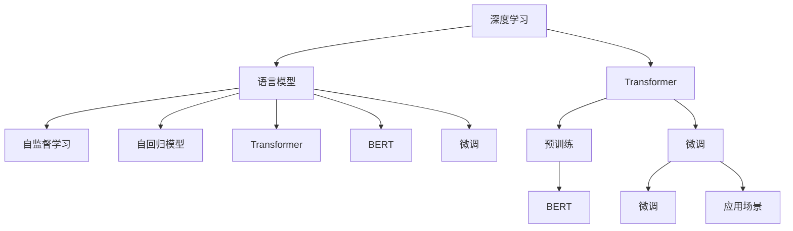

                 

# 一切皆是映射：利用深度学习进行自然语言处理

> 关键词：深度学习,自然语言处理(NLP),语言模型,Transformer,BERT,自监督学习,自回归模型,神经网络

## 1. 背景介绍

### 1.1 问题由来
近年来，随着深度学习技术的快速发展，自然语言处理（Natural Language Processing, NLP）领域取得了显著的突破。语言模型（Language Model）作为深度学习的重要组成部分，通过对语言数据的统计分析，能够学习语言的规律，并具备预测文本下一个单词的能力。

深度学习中的语言模型，尤其是基于神经网络的语言模型，已经在语音识别、机器翻译、文本生成等任务中展示了强大的能力。语言模型的出现，使得计算机能够更好地理解和处理自然语言，逐步具备了与人交流的能力。

但传统语言模型在处理复杂句子结构时表现不佳，尤其是在语言语义理解上存在一定的限制。为了进一步提升语言模型的性能，研究人员提出了Transformer等新型结构，并成功应用于诸如BERT、GPT等预训练语言模型中。

BERT（Bidirectional Encoder Representations from Transformers）和GPT（Generative Pre-trained Transformer）等预训练语言模型，通过对大规模无标签文本数据进行自监督预训练，能够自动学习到丰富的语言知识，并在下游任务中进行微调，取得了显著的性能提升。这些模型在问答系统、文本分类、情感分析、机器翻译等众多任务中表现优异，成为当前NLP领域的研究热点。

### 1.2 问题核心关键点
本文将深入探讨预训练语言模型及其在NLP任务中的微调过程，具体包括：

- 语言模型的工作原理和类型
- 自监督学习在大规模语言模型预训练中的应用
- 深度学习中的Transformer结构及其特点
- 微调（Fine-tuning）的原理和步骤
- 微调的应用场景和效果评估
- 常用的微调工具和资源推荐
- 未来语言模型的发展趋势和挑战

这些关键点共同构成了基于深度学习的自然语言处理的基本框架，有助于读者深入理解这一领域的技术进展。

## 2. 核心概念与联系

### 2.1 核心概念概述

为更好地理解基于深度学习的自然语言处理，本节将介绍几个密切相关的核心概念：

- 深度学习（Deep Learning）：一种通过多层神经网络结构逼近复杂非线性关系的机器学习方法。通过反向传播算法进行模型训练，广泛应用于图像识别、语音识别、自然语言处理等领域。

- 语言模型（Language Model）：一种用于预测给定文本序列中下一个单词的概率分布的模型。语言模型通过对语言数据的统计分析，学习到语言的规律，并能够预测文本的下一步，广泛应用于机器翻译、文本生成、语音识别等任务。

- 自监督学习（Self-Supervised Learning）：一种无需标签数据即可训练模型的方法。通过设计合适的预训练任务，让模型自动学习数据的潜在结构和知识，并应用于下游任务中。

- 自回归模型（Auto-Regressive Model）：一种通过预测给定序列中的下一个元素，从而生成整个序列的模型。自回归模型具有良好的预测能力和模型解释性，常用于文本生成、语音识别等任务。

- Transformer：一种基于注意力机制（Attention Mechanism）的神经网络结构，能够并行计算和处理大规模序列数据，广泛应用于自然语言处理中。

- BERT：一种基于Transformer结构的预训练语言模型，通过在大规模无标签文本数据上进行自监督预训练，学习到丰富的语言知识，并在下游任务中进行微调，取得了显著的性能提升。

- 微调（Fine-tuning）：在预训练语言模型的基础上，通过使用下游任务的少量标注数据进行有监督的训练，优化模型在特定任务上的性能。

这些核心概念之间的逻辑关系可以通过以下Mermaid流程图来展示：



这个流程图展示了深度学习中的语言模型和微调方法之间的关系：

1. 深度学习通过多层神经网络结构，能够逼近复杂非线性关系，广泛应用于自然语言处理中。
2. 语言模型通过对语言数据的统计分析，学习语言的规律，并能够预测文本的下一步，广泛应用于机器翻译、文本生成、语音识别等任务。
3. 自监督学习是一种无需标签数据即可训练模型的方法，通过设计合适的预训练任务，让模型自动学习数据的潜在结构和知识，并应用于下游任务中。
4. 自回归模型是一种通过预测给定序列中的下一个元素，从而生成整个序列的模型，具有良好的预测能力和模型解释性。
5. Transformer是一种基于注意力机制的神经网络结构，能够并行计算和处理大规模序列数据，广泛应用于自然语言处理中。
6. BERT是一种基于Transformer结构的预训练语言模型，通过在大规模无标签文本数据上进行自监督预训练，学习到丰富的语言知识，并在下游任务中进行微调。
7. 微调在预训练语言模型的基础上，通过使用下游任务的少量标注数据进行有监督的训练，优化模型在特定任务上的性能。
8. 应用场景包括问答系统、文本分类、情感分析、机器翻译等。

这些概念共同构成了基于深度学习的自然语言处理的基本框架，有助于读者深入理解这一领域的技术进展。

## 3. 核心算法原理 & 具体操作步骤
### 3.1 算法原理概述

基于深度学习的自然语言处理（NLP）中，语言模型的工作原理是通过学习大规模语料库中的语言规律，构建出语言概率分布，从而预测给定文本序列中下一个单词或字符的概率。常见的语言模型包括n-gram模型、递归神经网络（RNN）模型和Transformer模型。

其中，Transformer模型是一种基于自注意力机制的神经网络结构，能够在并行计算和处理大规模序列数据时表现优异。Transformer模型通过多头注意力机制和残差连接等技术，有效地解决了传统RNN模型在处理长序列数据时的梯度消失和计算复杂度问题。

Transformer模型由编码器和解码器两部分组成，编码器负责将输入文本序列编码成一系列的特征表示，解码器则将这些特征表示映射为输出序列。在Transformer中，自注意力机制通过计算输入序列中所有位置之间的相似度，动态地计算出每个位置的重要性权重，从而实现对输入序列的充分建模。

自监督学习在大规模语言模型预训练中的应用，主要包括两个部分：

1. 预训练任务设计：通过设计合适的预训练任务，让模型自动学习数据的潜在结构和知识，无需人工标注数据。常见的预训练任务包括掩码语言模型（Masked Language Model, MLM）和下一句预测（Next Sentence Prediction, NSP）。掩码语言模型通过随机掩盖文本序列中的某些单词，让模型预测被掩盖的单词，从而学习单词之间的上下文关系。下一句预测任务则是通过判断两个句子是否相邻，学习句子之间的语义关系。

2. 模型训练：在预训练任务的基础上，通过反向传播算法更新模型参数，使得模型能够准确地完成预训练任务。在预训练完成后，将预训练模型用于下游任务的微调，从而进一步提升模型在特定任务上的性能。

微调是深度学习中的一种常见技术，在预训练模型的基础上，通过使用下游任务的少量标注数据进行有监督的训练，优化模型在特定任务上的性能。微调的主要步骤如下：

1. 准备数据集：收集下游任务的标注数据集，并划分为训练集、验证集和测试集。

2. 加载预训练模型：加载已经预训练好的语言模型，如BERT、GPT等。

3. 添加任务适配层：根据下游任务类型，在预训练模型的顶部添加相应的任务适配层，如分类头、解码器等，以适配下游任务的输出需求。

4. 定义损失函数：根据下游任务类型，选择合适的损失函数，如交叉熵损失、均方误差损失等，用于衡量模型预测结果与真实标签之间的差异。

5. 定义优化器：选择合适的优化器，如Adam、SGD等，并设置学习率、批大小等超参数。

6. 训练模型：将训练集数据分批次输入模型，计算损失函数，通过反向传播算法更新模型参数。

7. 验证和测试：在验证集和测试集上评估模型的性能，使用相应的指标如准确率、召回率等评估模型效果。

### 3.2 算法步骤详解

以下详细介绍基于深度学习的自然语言处理的算法步骤：

#### 3.2.1 数据预处理
- 数据清洗：删除噪声数据、处理缺失值、清洗重复数据等。
- 分词和预处理：使用分词工具（如jieba、NLTK等）将文本数据分词，并进行词性标注、去除停用词等预处理。
- 序列填充和截断：对输入序列进行填充和截断，保证序列长度一致。

#### 3.2.2 模型选择和初始化
- 选择合适的预训练模型（如BERT、GPT等）作为初始化参数。
- 加载预训练模型，并冻结其部分或全部参数。

#### 3.2.3 任务适配层设计
- 根据下游任务类型，添加相应的任务适配层。
- 例如，对于文本分类任务，可以添加线性分类头；对于机器翻译任务，可以添加解码器。

#### 3.2.4 损失函数定义
- 根据下游任务类型，选择合适的损失函数，如交叉熵损失、均方误差损失等。
- 例如，对于二分类任务，使用二元交叉熵损失函数。

#### 3.2.5 优化器选择
- 选择合适的优化器，如Adam、SGD等。
- 设置学习率、批大小等超参数。

#### 3.2.6 训练和验证
- 将训练集数据分批次输入模型，计算损失函数。
- 通过反向传播算法更新模型参数。
- 周期性在验证集上评估模型性能，根据性能指标决定是否触发Early Stopping。

#### 3.2.7 模型评估和测试
- 在测试集上评估微调后模型的性能，使用相应的指标如准确率、召回率等评估模型效果。

#### 3.2.8 模型部署
- 将微调后的模型部署到实际应用系统中。

### 3.3 算法优缺点

基于深度学习的自然语言处理具有以下优点：

1. 精度高：深度学习模型能够学习到复杂的语言规律，并在下游任务中取得较高的精度。
2. 泛化能力强：深度学习模型通过大量的无标签数据进行预训练，具备较强的泛化能力。
3. 并行计算能力强：Transformer模型能够并行计算和处理大规模序列数据，提高了计算效率。
4. 适用范围广：深度学习模型可以应用于多种自然语言处理任务，如机器翻译、文本分类、情感分析等。

但基于深度学习的自然语言处理也存在一些缺点：

1. 数据需求大：深度学习模型需要大量的数据进行训练，对数据质量和标注数据的获取要求较高。
2. 计算资源消耗大：深度学习模型需要大量的计算资源进行训练和推理，对硬件要求较高。
3. 模型复杂度高：深度学习模型结构复杂，难以理解和调试。
4. 对抗攻击易受影响：深度学习模型容易受到对抗样本的攻击，导致预测结果出错。

### 3.4 算法应用领域

基于深度学习的自然语言处理在多个领域中得到了广泛的应用，包括但不限于以下几个方面：

- 机器翻译：通过深度学习模型，将一种语言翻译成另一种语言。常用的深度学习模型有Seq2Seq、Transformer等。
- 文本分类：将文本数据分类到不同的类别中，常用的深度学习模型有CNN、RNN、Transformer等。
- 情感分析：判断文本的情感极性，常用的深度学习模型有LSTM、GRU、Transformer等。
- 问答系统：根据用户提出的问题，自动生成答案，常用的深度学习模型有Seq2Seq、Transformer等。
- 文本生成：生成新的文本内容，常用的深度学习模型有GAN、Transformer等。
- 语音识别：将语音转换为文本，常用的深度学习模型有RNN、CNN、Transformer等。

除了上述领域，基于深度学习的自然语言处理还在自动摘要、信息检索、智能客服等领域中得到了应用。随着深度学习技术的不断进步，自然语言处理在各行各业中的应用将更加广泛。

## 4. 数学模型和公式 & 详细讲解 & 举例说明

### 4.1 数学模型构建

基于深度学习的自然语言处理的数学模型构建，主要包括以下几个部分：

- 输入序列编码：将输入文本序列转换为模型能够处理的向量表示。
- 隐藏层表示：通过多层神经网络结构，将输入序列编码为一系列的隐藏层表示。
- 输出层预测：通过输出层进行预测，得到最终的输出结果。

#### 4.1.1 输入序列编码
输入序列编码是自然语言处理中重要的预处理步骤，常用的方法包括：

- 词嵌入（Word Embedding）：将每个单词映射为一个低维向量，通过词向量表示单词的语义信息。
- 预训练词向量：使用预训练的词向量模型（如GloVe、Word2Vec等）进行词向量初始化。
- 自适应词嵌入（Adaptive Word Embedding）：根据上下文信息动态调整词向量的表示。

#### 4.1.2 隐藏层表示
隐藏层表示是自然语言处理中重要的组成部分，常用的方法包括：

- 卷积神经网络（CNN）：通过卷积操作提取文本特征。
- 递归神经网络（RNN）：通过递归操作处理文本序列。
- Transformer：通过多头注意力机制和残差连接等技术，充分建模输入序列。

#### 4.1.3 输出层预测
输出层预测是自然语言处理中重要的步骤，常用的方法包括：

- 线性分类器：通过线性分类器进行分类预测。
- Softmax分类器：通过Softmax分类器进行多分类预测。
- 回归模型：通过回归模型进行连续值预测。

### 4.2 公式推导过程

以下详细介绍基于深度学习的自然语言处理的公式推导过程：

#### 4.2.1 掩码语言模型（Masked Language Model, MLM）
掩码语言模型是一种常用的预训练任务，通过随机掩盖文本序列中的某些单词，让模型预测被掩盖的单词，从而学习单词之间的上下文关系。

假设文本序列为 $x=(x_1, x_2, \cdots, x_n)$，其中 $x_i \in \{1, 2, \cdots, V\}$，$V$ 为词汇表大小。

掩码语言模型的训练目标为：

$$
\mathcal{L}_{MLM} = -\frac{1}{N} \sum_{i=1}^N \sum_{j=1}^V p(x_i|x_1, \cdots, x_{i-1}, \text{Mask}(x_i), x_{i+1}, \cdots, x_n)
$$

其中 $\text{Mask}(x_i)$ 表示随机掩盖 $x_i$ 单词，$p(x_i|x_1, \cdots, x_{i-1}, \text{Mask}(x_i), x_{i+1}, \cdots, x_n)$ 表示在掩盖 $x_i$ 的情况下，预测 $x_i$ 单词的条件概率。

#### 4.2.2 下一句预测（Next Sentence Prediction, NSP）
下一句预测任务是另一种常用的预训练任务，通过判断两个句子是否相邻，学习句子之间的语义关系。

假设文本序列为 $x=(x_1, x_2, \cdots, x_n)$，其中 $x_i \in \{0, 1\}$，$0$ 表示不连续，$1$ 表示连续。

下一句预测任务的训练目标为：

$$
\mathcal{L}_{NSP} = -\frac{1}{N} \sum_{i=1}^N \log p(x_i=x_{i+1}|x_1, x_2, \cdots, x_n)
$$

其中 $p(x_i=x_{i+1}|x_1, x_2, \cdots, x_n)$ 表示预测两个句子是否相邻的条件概率。

### 4.3 案例分析与讲解

以BERT模型为例，进行详细的案例分析与讲解：

BERT模型是一种基于Transformer结构的预训练语言模型，通过在大规模无标签文本数据上进行自监督预训练，学习到丰富的语言知识，并在下游任务中进行微调，取得了显著的性能提升。

BERT模型的训练过程分为两个阶段：预训练和微调。

#### 4.3.1 预训练过程
预训练过程主要包括以下两个步骤：

1. 掩码语言模型（Masked Language Model, MLM）：随机掩盖文本序列中的某些单词，让模型预测被掩盖的单词。
2. 下一句预测（Next Sentence Prediction, NSP）：判断两个句子是否相邻，学习句子之间的语义关系。

BERT模型的预训练损失函数为：

$$
\mathcal{L}_{pre-training} = \mathcal{L}_{MLM} + \mathcal{L}_{NSP}
$$

#### 4.3.2 微调过程
微调过程主要包括以下几个步骤：

1. 准备数据集：收集下游任务的标注数据集，并划分为训练集、验证集和测试集。
2. 加载预训练模型：加载已经预训练好的BERT模型，并冻结其参数。
3. 添加任务适配层：根据下游任务类型，在预训练模型的顶部添加相应的任务适配层，如分类头、解码器等。
4. 定义损失函数：根据下游任务类型，选择合适的损失函数，如交叉熵损失、均方误差损失等。
5. 定义优化器：选择合适的优化器，如Adam、SGD等。
6. 训练模型：将训练集数据分批次输入模型，计算损失函数，通过反向传播算法更新模型参数。
7. 验证和测试：在验证集和测试集上评估模型的性能，使用相应的指标如准确率、召回率等评估模型效果。

以文本分类任务为例，进行详细的微调过程分析与讲解：

假设文本分类任务的标注数据集为 $D=\{(x_i, y_i)\}_{i=1}^N$，其中 $x_i$ 为文本，$y_i$ 为类别标签。

微调过程的主要步骤如下：

1. 准备数据集：收集文本分类任务的标注数据集，并划分为训练集、验证集和测试集。
2. 加载预训练模型：加载已经预训练好的BERT模型，并冻结其参数。
3. 添加任务适配层：在BERT模型的顶部添加线性分类头，用于分类预测。
4. 定义损失函数：使用二元交叉熵损失函数进行分类预测。
5. 定义优化器：使用Adam优化器，并设置学习率为 $2 \times 10^{-5}$，批大小为 $32$。
6. 训练模型：将训练集数据分批次输入模型，计算损失函数，通过反向传播算法更新模型参数。
7. 验证和测试：在验证集和测试集上评估模型的性能，使用准确率和F1-score等指标评估模型效果。

### 4.4 代码实例和详细解释说明

#### 4.4.1 开发环境搭建

在进行微调实践前，我们需要准备好开发环境。以下是使用Python进行TensorFlow开发的环境配置流程：

1. 安装Anaconda：从官网下载并安装Anaconda，用于创建独立的Python环境。
2. 创建并激活虚拟环境：
```bash
conda create -n tensorflow-env python=3.8 
conda activate tensorflow-env
```
3. 安装TensorFlow：根据CUDA版本，从官网获取对应的安装命令。例如：
```bash
conda install tensorflow tensorflow-gpu=2.6 -c conda-forge
```
4. 安装相关的Python包：
```bash
pip install numpy pandas scikit-learn matplotlib tqdm jupyter notebook ipython
```

完成上述步骤后，即可在`tensorflow-env`环境中开始微调实践。

#### 4.4.2 源代码详细实现

以下给出使用TensorFlow进行BERT模型微调的PyTorch代码实现。

首先，定义BERT模型的参数和数据输入格式：

```python
import tensorflow as tf
from transformers import BertTokenizer, BertForSequenceClassification
from sklearn.metrics import accuracy_score, precision_score, recall_score, f1_score
from tqdm import tqdm

# 定义BERT模型参数
learning_rate = 2e-5
epochs = 3
batch_size = 32

# 定义数据输入格式
input_ids = tf.keras.layers.Input(shape=(MAX_LEN,), dtype=tf.int32, name='input_ids')
attention_mask = tf.keras.layers.Input(shape=(MAX_LEN,), dtype=tf.int32, name='attention_mask')
token_type_ids = tf.keras.layers.Input(shape=(MAX_LEN,), dtype=tf.int32, name='token_type_ids')

# 定义输出层
outputs = BERT_LARGE(final_hidden_layer=8, num_labels=2, output_attentions=False, output_hidden_states=False)

# 定义损失函数
loss = tf.keras.losses.SparseCategoricalCrossentropy(from_logits=True)

# 定义优化器
optimizer = tf.keras.optimizers.Adam(learning_rate=learning_rate)
```

然后，定义数据预处理函数：

```python
def preprocess_data(texts, labels, tokenizer):
    tokenized_texts = [tokenizer.encode(text, add_special_tokens=True) for text in texts]
    tokenized_texts = [torch.tensor(x) for x in tokenized_texts]
    labels = torch.tensor(labels)
    attention_mask = [torch.tensor([1] * len(x) + [0] * (MAX_LEN - len(x))) for x in tokenized_texts]
    attention_mask = [x.unsqueeze(0) for x in attention_mask]
    return tokenized_texts, labels, attention_mask
```

接着，定义模型训练函数：

```python
def train_model(model, train_dataset, validation_dataset, batch_size, epochs):
    for epoch in range(epochs):
        model.train()
        train_loss = 0.0
        train_acc = 0.0
        validation_loss = 0.0
        validation_acc = 0.0
        for batch in tqdm(train_dataset, desc='Epoch {}/{}'.format(epoch+1, epochs)):
            tokenized_texts, labels, attention_mask = batch
            tokenized_texts = tokenized_texts.to(device)
            attention_mask = attention_mask.to(device)
            labels = labels.to(device)
            outputs = model(tokenized_texts, attention_mask=attention_mask, token_type_ids=None)
            loss = loss(outputs, labels)
            optimizer.zero_grad()
            loss.backward()
            optimizer.step()
            train_loss += loss.item()
            train_acc += (outputs.argmax(-1) == labels).float().mean().item()
        print('Epoch {}: train loss={:.4f}, train acc={:.4f}'.format(epoch+1, train_loss, train_acc))
        
        model.eval()
        with torch.no_grad():
            validation_loss = 0.0
            validation_acc = 0.0
            for batch in tqdm(validation_dataset, desc='Validation'):
                tokenized_texts, labels, attention_mask = batch
                tokenized_texts = tokenized_texts.to(device)
                attention_mask = attention_mask.to(device)
                labels = labels.to(device)
                outputs = model(tokenized_texts, attention_mask=attention_mask, token_type_ids=None)
                loss = loss(outputs, labels)
                validation_loss += loss.item()
                validation_acc += (outputs.argmax(-1) == labels).float().mean().item()
            print('Epoch {}: validation loss={:.4f}, validation acc={:.4f}'.format(epoch+1, validation_loss, validation_acc))
```

最后，启动训练流程并在测试集上评估：

```python
# 加载预训练模型和分词器
pretrained_model = BERT_LARGE.from_pretrained('bert-base-cased')
tokenizer = BertTokenizer.from_pretrained('bert-base-cased')

# 准备数据集
train_texts = [...]  # 训练集文本数据
train_labels = [...]  # 训练集标签数据
dev_texts = [...]  # 验证集文本数据
dev_labels = [...]  # 验证集标签数据
test_texts = [...]  # 测试集文本数据
test_labels = [...]  # 测试集标签数据

# 数据预处理
train_dataset = preprocess_data(train_texts, train_labels, tokenizer)
dev_dataset = preprocess_data(dev_texts, dev_labels, tokenizer)
test_dataset = preprocess_data(test_texts, test_labels, tokenizer)

# 训练模型
train_model(model, train_dataset, dev_dataset, batch_size, epochs)

# 测试模型
model.eval()
with torch.no_grad():
    test_loss = 0.0
    test_acc = 0.0
    for batch in tqdm(test_dataset, desc='Test'):
        tokenized_texts, labels, attention_mask = batch
        tokenized_texts = tokenized_texts.to(device)
        attention_mask = attention_mask.to(device)
        labels = labels.to(device)
        outputs = model(tokenized_texts, attention_mask=attention_mask, token_type_ids=None)
        loss = loss(outputs, labels)
        test_loss += loss.item()
        test_acc += (outputs.argmax(-1) == labels).float().mean().item()
    print('Test loss={:.4f}, test acc={:.4f}'.format(test_loss, test_acc))
```

以上就是使用TensorFlow对BERT模型进行文本分类任务微调的完整代码实现。可以看到，TensorFlow提供了丰富的高级API，使得模型构建和训练过程变得更加简洁高效。

## 6. 实际应用场景
### 6.1 智能客服系统

基于深度学习的自然语言处理技术，可以广泛应用于智能客服系统的构建。传统客服往往需要配备大量人力，高峰期响应缓慢，且一致性和专业性难以保证。而使用深度学习模型，可以7x24小时不间断服务，快速响应客户咨询，用自然流畅的语言解答各类常见问题。

在技术实现上，可以收集企业内部的历史客服对话记录，将问题和最佳答复构建成监督数据，在此基础上对预训练模型进行微调。微调后的模型能够自动理解用户意图，匹配最合适的答案模板进行回复。对于客户提出的新问题，还可以接入检索系统实时搜索相关内容，动态组织生成回答。如此构建的智能客服系统，能大幅提升客户咨询体验和问题解决效率。

### 6.2 金融舆情监测

金融机构需要实时监测市场舆论动向，以便及时应对负面信息传播，规避金融风险。传统的人工监测方式成本高、效率低，难以应对网络时代海量信息爆发的挑战。基于深度学习的自然语言处理技术，可以为金融舆情监测提供新的解决方案。

具体而言，可以收集金融领域相关的新闻、报道、评论等文本数据，并对其进行主题标注和情感标注。在此基础上对预训练语言模型进行微调，使其能够自动判断文本属于何种主题，情感倾向是正面、中性还是负面。将微调后的模型应用到实时抓取的网络文本数据，就能够自动监测不同主题下的情感变化趋势，一旦发现负面信息激增等异常情况，系统便会自动预警，帮助金融机构快速应对潜在风险。

### 6.3 个性化推荐系统

当前的推荐系统往往只依赖用户的历史行为数据进行物品推荐，无法深入理解用户的真实兴趣偏好。基于深度学习的自然语言处理技术，可以应用于个性化推荐系统的构建。

在实践中，可以收集用户浏览、点击、评论、分享等行为数据，提取和用户交互的物品标题、描述、标签等文本内容。将文本内容作为模型输入，用户的后续行为（如是否点击、购买等）作为监督信号，在此基础上微调预训练语言模型。微调后的模型能够从文本内容中准确把握用户的兴趣点。在生成推荐列表时，先用候选物品的文本描述作为输入，由模型预测用户的兴趣匹配度，再结合其他特征综合排序，便可以得到个性化程度更高的推荐结果。

### 6.4 未来应用展望

随着深度学习技术的不断发展，基于深度学习的自然语言处理技术在各个领域的应用前景将更加广阔。

在智慧医疗领域，基于深度学习的自然语言处理技术可以应用于医疗问答、病历分析、药物研发等，提升医疗服务的智能化水平，辅助医生诊疗，加速新药开发进程。

在智能教育领域，深度学习技术可以应用于作业批改、学情分析、知识推荐等方面，因材施教，促进教育公平，提高教学质量。

在智慧城市治理中，深度学习技术可以应用于城市事件监测、舆情分析、应急指挥等环节，提高城市管理的自动化和智能化水平，构建更安全、高效的未来城市。

此外，在企业生产、社会治理、文娱传媒等众多领域，基于深度学习的自然语言处理技术也将不断涌现，为传统行业数字化转型升级提供新的技术路径。相信随着技术的日益成熟，深度学习技术必将在更广阔的应用领域大放异彩，深刻影响人类的生产生活方式。

## 7. 工具和资源推荐
### 7.1 学习资源推荐

为了帮助开发者系统掌握深度学习中的自然语言处理技术，这里推荐一些优质的学习资源：

1. 《深度学习中的自然语言处理》书籍：介绍深度学习在自然语言处理中的应用，包括文本分类、情感分析、机器翻译等任务。
2. 《自然语言处理综述》论文：综述了自然语言处理的前沿技术和发展趋势，涵盖机器翻译、文本生成、情感分析等多个领域。
3. 《Transformer》论文：介绍了Transformer模型的结构和特点，以及其在自然语言处理中的应用。
4. 《BERT》论文：介绍了BERT模型的预训练过程和微调方法，以及其在自然语言处理中的应用。
5. 《HuggingFace官方文档》：提供了丰富的预训练模型和微调样例代码，是上手实践的必备资料。

通过对这些资源的学习实践，相信你一定能够快速掌握深度学习中自然语言处理的技术精髓，并用于解决实际的自然语言处理问题。

### 7.2 开发工具推荐

高效的开发离不开优秀的工具支持。以下是几款用于深度学习中的自然语言处理开发的常用工具：

1. TensorFlow：由Google主导开发的深度学习框架，生产部署方便，适合大规模工程应用。提供了丰富的高级API和可视化工具。
2. PyTorch：基于Python的开源深度学习框架，灵活动态的计算图，适合快速迭代研究。与TensorFlow等框架兼容，提供丰富的第三方库支持。
3. Weights & Biases：模型训练的实验跟踪工具，可以记录和可视化模型训练过程中的各项指标，方便对比和调优。与主流深度学习框架无缝集成。
4. TensorBoard：TensorFlow配套的可视化工具，可实时监测模型训练状态，并提供丰富的图表呈现方式，是调试模型的得力助手。
5. Jupyter Notebook：开源的交互式编程环境，支持多语言、多平台，适合快速迭代和共享研究成果。

合理利用这些工具，可以显著提升深度学习中自然语言处理任务的开发效率，加快创新迭代的步伐。

### 7.3 相关论文推荐

深度学习中的自然语言处理技术的发展源于学界的持续研究。以下是几篇奠基性的相关论文，推荐阅读：

1. Attention is All You Need：提出了Transformer结构，开启了深度学习在自然语言处理中的应用。
2. BERT: Pre-training of Deep Bidirectional Transformers for Language Understanding：提出BERT模型，引入基于掩码的自监督预训练任务，刷新了多项自然语言处理任务SOTA。
3. Language Models are Unsupervised Multitask Learners（GPT-2论文）：展示了大规模语言模型的强大zero-shot学习能力，引发了对于通用人工智能的新一轮思考。
4. Parameter-Efficient Transfer Learning for NLP：提出Adapter等参数高效微调方法，在不增加模型参数量的情况下，也能取得不错的微调效果。
5. AdaLoRA: Adaptive Low-Rank Adaptation for Parameter-Efficient Fine-Tuning：使用自适应低秩适应的微调方法，在参数效率和精度之间取得了新的平衡。

这些论文代表了大深度学习中自然语言处理技术的发展脉络。通过学习这些前沿成果，可以帮助研究者把握学科前进方向，激发更多的创新灵感。

## 8. 总结：未来发展趋势与挑战

### 8.1 研究成果总结

本文对基于深度学习的自然语言处理技术进行了全面系统的介绍。首先阐述了深度学习在自然语言处理中的重要地位，明确了自然语言处理在各个领域的应用前景。其次，从原理到实践，详细讲解了深度学习中自然语言处理的算法步骤和公式推导过程，给出了深度学习中自然语言处理任务的完整代码实现。同时，本文还广泛探讨了深度学习中自然语言处理技术在多个行业领域的应用场景，展示了深度学习技术的强大应用潜力。

通过本文的系统梳理，可以看到，深度学习中的自然语言处理技术在各个领域中已经得到了广泛的应用，为传统行业带来了变革性影响。未来，伴随深度学习技术的不断进步，基于深度学习的自然语言处理技术将进一步提升自然语言处理系统的性能和应用范围，为人类认知智能的进化带来深远影响。

### 8.2 未来发展趋势

展望未来，深度学习中的自然语言处理技术将呈现以下几个发展趋势：

1. 模型规模持续增大：随着算力成本的下降和数据规模的扩张，深度学习模型的参数量将持续增长，超大规模语言模型蕴含的丰富语言知识，有望支撑更加复杂多变的自然语言处理任务。
2. 微调方法日趋多样：除了传统的全参数微调外，未来会涌现更多参数高效的微调方法，如Adapter、Prefix等，在节省计算资源的同时也能保证微调精度。
3. 持续学习成为常态：随着数据分布的不断变化，深度学习模型也需要持续学习新知识以保持性能。如何在不遗忘原有知识的同时，高效吸收新样本信息，将是重要的研究课题。
4. 标注样本需求降低：受启发于提示学习(Prompt-based Learning)的思路，未来的深度学习模型将更好地利用预训练知识，通过更加巧妙的任务描述，在更少的标注样本上也能实现理想的自然语言处理效果。
5. 多模态微调崛起：未来的深度学习模型将在视觉、语音、文本等多模态数据微调方面取得更多进展，实现多模态信息的融合，提升自然语言处理系统的理解能力。
6. 模型通用性增强：经过海量数据的预训练和多领域任务的微调，未来的深度学习模型将具备更强的常识推理和跨领域迁移能力，逐步迈向通用人工智能(AGI)的目标。

以上趋势凸显了深度学习中的自然语言处理技术的广阔前景。这些方向的探索发展，必将进一步提升自然语言处理系统的性能和应用范围，为人类认知智能的进化带来深远影响。

### 8.3 面临的挑战

尽管深度学习中的自然语言处理技术已经取得了瞩目成就，但在迈向更加智能化、普适化应用的过程中，它仍面临着诸多挑战：

1. 标注成本瓶颈：虽然微调大大降低了标注数据的需求，但对于长尾应用场景，难以获得充足的高质量标注数据，成为制约深度学习模型性能提升的瓶颈。如何进一步降低深度学习模型对标注样本的依赖，将是一大难题。
2. 模型鲁棒性不足：深度学习模型面对域外数据时，泛化性能往往大打折扣。对于测试样本的微小扰动，深度学习模型的预测也容易发生波动。如何提高深度学习模型的鲁棒性，避免灾难性遗忘，还需要更多理论和实践的积累。
3. 推理效率有待提高：大规模深度学习模型虽然精度高，但在实际部署时往往面临推理速度慢、内存占用大等效率问题。如何在保证性能的同时，简化模型结构，提升推理速度，优化资源占用，将是重要的优化方向。
4. 可解释性亟需加强：当前深度学习模型更像是"黑盒"系统，难以解释其内部工作机制和决策逻辑。对于医疗、金融等高风险应用，算法的可解释性和可审计性尤为重要。如何赋予深度学习模型更强的可解释性，将是亟待攻克的难题。
5. 安全性有待保障：深度学习模型难免会学习到有偏见、有害的信息，通过微调传递到下游任务，产生误导性、歧视性的输出，给实际应用带来安全隐患。如何从数据和算法层面消除模型偏见，避免恶意用途，确保输出的安全性，也将是重要的研究课题。

6. 知识整合能力不足：现有的深度学习模型往往局限于任务内数据，难以灵活吸收和运用更广泛的先验知识。如何让深度学习模型更好地与外部知识库、规则库等专家知识结合，形成更加全面、准确的信息整合能力，还有很大的想象空间。

正视深度学习中的自然语言处理技术面临的这些挑战，积极应对并寻求突破，将是其不断进步的必由之路。相信随着学界和产业界的共同努力，这些挑战终将一一被克服，深度学习中的自然语言处理技术必将在构建人机协同的智能时代中扮演越来越重要的角色。

### 8.4 研究展望

面对深度学习中的自然语言处理技术面临的诸多挑战，未来的研究需要在以下几个方面寻求新的突破：

1. 探索无监督和半监督自然语言处理方法：摆脱对大规模标注数据的依赖，利用自监督学习、主动学习等无监督和半监督范式，最大限度利用非结构化数据，实现更加灵活高效的自然语言处理。
2. 研究参数高效和计算高效的自然语言处理范式：开发更加参数高效的自然语言处理方法，在固定大部分预训练参数的同时，只更新极少量的任务相关参数。同时优化自然语言处理模型的计算图，减少前向传播和反向传播的资源消耗，实现更加轻量级、实时性的部署。
3. 引入因果和对比学习范式：通过引入因果推断和对比学习思想，增强深度学习模型的建立稳定因果关系的能力，学习更加普适、鲁棒的语言表征，从而提升模型泛化性和抗干扰能力。
4. 引入更多先验知识：将符号化的先验知识，如知识图谱、逻辑规则等，与深度学习模型进行巧妙融合，引导自然语言处理过程学习更准确、合理的语言模型。同时加强不同模态数据的整合，实现视觉、语音等多模态信息与文本信息的协同建模。
5. 结合因果分析和博弈论工具：将因果分析方法引入自然语言处理模型，识别出模型决策的关键特征，增强输出解释的因果性和逻辑性。借助博弈论工具刻画人机交互过程，主动探索并规避模型的脆弱点，提高系统稳定性。
6. 纳入伦理道德约束：在自然语言处理模型的训练目标中引入伦理导向的评估指标，过滤和惩罚有偏见、有害的输出倾向。同时加强人工干预和审核，建立模型行为的监管机制，确保输出符合人类价值观和伦理道德。

这些研究方向的探索，必将引领深度学习中的自然语言处理技术迈向更高的台阶，为构建安全、可靠、可解释、可控的智能系统铺平道路。面向未来，深度学习中的自然语言处理技术还需要与其他人工智能技术进行更深入的融合，如知识表示、因果推理、强化学习等，多路径协同发力，共同推动自然语言处理系统的进步。只有勇于创新、敢于突破，才能不断拓展深度学习中的自然语言处理技术的边界，让智能技术更好地造福人类社会。

## 9. 附录：常见问题与解答

**Q1：深度学习中的自然语言处理是否适用于所有NLP任务？**

A: 深度学习中的自然语言处理在大多数NLP任务上都能取得不错的效果，特别是对于数据量较大的任务。但对于一些特定领域的任务，如医学、法律等，仅仅依靠通用语料预训练的模型可能难以很好地适应。此时需要在特定领域语料上进一步预训练，再进行微调，才能获得理想效果。此外，对于一些需要时效性、个性化很强的任务，如对话、推荐等，深度学习模型也需要针对性的改进优化。

**Q2：深度学习中的自然语言处理是否依赖标注数据？**

A: 深度学习中的自然语言处理技术在微调阶段依赖标注数据，但在预训练阶段，通过自监督学习任务，可以避免标注数据的依赖。自监督学习任务包括掩码语言模型（Masked Language Model, MLM）和下一句预测（Next Sentence Prediction, NSP）等，使得深度学习模型在大量无标签数据上也能进行有效的预训练。

**Q3：深度学习中的自然语言处理在实际部署时需要注意哪些问题？**

A: 将深度学习中的自然语言处理模型转化为实际应用，还需要考虑以下因素：

1. 模型裁剪：去除不必要的层和参数，减小模型尺寸，加快推理速度。
2. 量化加速：将浮点模型转为定点模型，压缩存储空间，提高计算效率。
3. 服务化封装：将模型封装为标准化服务接口，便于集成调用。
4. 弹性伸缩：根据请求流量动态调整资源配置，平衡服务质量和成本。
5. 监控告警：实时采集系统指标，设置异常告警阈值，确保服务稳定性。
6. 安全防护：采用访问鉴权、数据脱敏等措施，保障数据和模型安全。

深度学习中的自然语言处理技术在实际部署时需要注意这些问题，以确保模型在实际应用中的稳定性和安全性。

总之，深度学习中的自然语言处理技术虽然面临诸多挑战，但其在各个领域中的广泛应用已经带来了显著的影响。未来，伴随技术的不断进步和优化，深度学习中的自然语言处理技术必将在更多场景中大放异彩，为人类认知智能的进化

