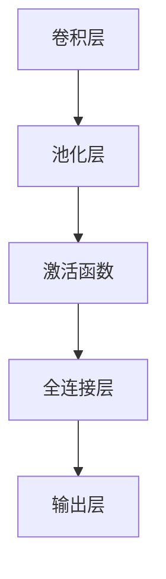

                 

# 一切皆是映射：卷积神经网络(CNN)解密

> 关键词：卷积神经网络,卷积层,池化层,激活函数,卷积运算,特征映射,神经网络,计算机视觉,信号处理,深度学习

## 1. 背景介绍

卷积神经网络（Convolutional Neural Networks，CNNs），作为深度学习的重要分支，在计算机视觉、自然语言处理、信号处理等多个领域展现出了卓越的性能。本节将介绍卷积神经网络的基本概念、发展历程以及其在实际应用中的广泛应用。

### 1.1 问题由来

在深度学习的早期，由于数据集大小和计算能力的限制，模型只能使用较少的参数来处理小规模数据集，导致神经网络在处理复杂图像和语音等高维信号时表现不佳。为了突破这一瓶颈，研究者们设计出了卷积神经网络，利用局部连接和参数共享等特性，实现了模型在数据集上的高效泛化。

### 1.2 问题核心关键点

卷积神经网络的核心思想是通过卷积运算，在保持参数共享的前提下，对输入数据进行特征提取和映射，从而实现高效的特征学习。其核心组件包括卷积层、池化层、激活函数等。卷积层通过卷积运算提取局部特征，池化层则对特征进行下采样，激活函数赋予特征映射非线性变化，进一步增强模型的表示能力。

卷积神经网络的成功不仅在于其高效的特征提取能力，更在于其可解释性。通过卷积操作，CNN能将复杂的高维信号映射到低维特征空间，实现对输入数据的非线性映射，从而获得对复杂特征的高级理解。

## 2. 核心概念与联系

### 2.1 核心概念概述

卷积神经网络由卷积层、池化层、激活函数等核心组件组成，各组件之间相互协作，实现对输入数据的非线性映射。

- **卷积层(Convolutional Layer)**：卷积层通过卷积运算提取局部特征，是卷积神经网络中最关键的组件。卷积核通过滑动窗口的方式对输入数据进行卷积运算，生成一系列特征映射。
- **池化层(Pooling Layer)**：池化层对卷积层生成的特征映射进行下采样，减少特征数量，增强特征的鲁棒性。常用的池化方式包括最大池化和平均池化。
- **激活函数(Activation Function)**：激活函数赋予特征映射非线性变化，增强模型的表示能力。常用的激活函数包括ReLU、Sigmoid、Tanh等。
- **全连接层(Fully Connected Layer)**：全连接层将卷积层和池化层提取的特征进行全局映射，输出最终分类结果。
- **Dropout**：Dropout是一种正则化技术，通过在训练过程中随机失活神经元，减少过拟合现象。

### 2.2 核心概念原理和架构的 Mermaid 流程图



这个流程图展示了卷积神经网络的基本结构：卷积层提取特征，池化层下采样，激活函数引入非线性，全连接层进行分类输出。

## 3. 核心算法原理 & 具体操作步骤

### 3.1 算法原理概述

卷积神经网络的核心原理在于通过卷积运算和激活函数，对输入数据进行非线性映射。其关键步骤如下：

1. **卷积操作**：卷积层通过滑动卷积核对输入数据进行局部特征提取。
2. **池化操作**：对卷积层输出的特征映射进行下采样，减少特征数量。
3. **激活操作**：通过激活函数对特征映射进行非线性变换。
4. **全连接操作**：全连接层将卷积层和池化层提取的特征进行全局映射，输出分类结果。
5. **正则化操作**：通过Dropout等正则化技术防止过拟合。

### 3.2 算法步骤详解

卷积神经网络的训练和推理过程如下：

#### 3.2.1 卷积操作

卷积层通过滑动卷积核对输入数据进行卷积运算，生成一系列特征映射。卷积核大小通常为3x3或5x5，步长为1。

- **输入数据**：$x_{i,j} \in \mathbb{R}^{H \times W \times C}$，其中$H$和$W$为输入数据的高度和宽度，$C$为通道数。
- **卷积核**：$k_{f,g} \in \mathbb{R}^{K \times K \times C}$，其中$K$为卷积核的大小。
- **卷积运算**：$y_{i,j} = \sum_{f=1}^{F} \sum_{g=1}^{G}x_{f,g} \cdot k_{f,g}$，其中$F$和$G$为卷积核的深度。

#### 3.2.2 池化操作

池化层对卷积层生成的特征映射进行下采样，减少特征数量，增强特征的鲁棒性。

- **最大池化**：$y_{i,j} = \max_{f,g} x_{f,g}$。
- **平均池化**：$y_{i,j} = \frac{1}{K^2} \sum_{f,g} x_{f,g}$。

#### 3.2.3 激活操作

激活函数赋予特征映射非线性变化，增强模型的表示能力。

- **ReLU**：$f(x) = \max(0, x)$。
- **Sigmoid**：$f(x) = \frac{1}{1+e^{-x}}$。
- **Tanh**：$f(x) = \frac{e^x - e^{-x}}{e^x + e^{-x}}$。

#### 3.2.4 全连接操作

全连接层将卷积层和池化层提取的特征进行全局映射，输出分类结果。

- **全连接层**：$y = Wx + b$，其中$W$为权重矩阵，$b$为偏置项。

#### 3.2.5 正则化操作

通过Dropout等正则化技术防止过拟合。

- **Dropout**：$p = 0.5$，随机失活$p$比例的神经元。

### 3.3 算法优缺点

卷积神经网络的优点包括：

1. **局部连接和参数共享**：减少了模型参数量，提高了训练效率。
2. **特征提取能力强**：卷积操作提取局部特征，具有强大的空间不变性。
3. **可解释性强**：卷积核能够解释局部特征的提取方式，具有较好的可视化性。

卷积神经网络的缺点包括：

1. **计算量大**：卷积运算和池化操作需要大量计算资源。
2. **空间复杂度高**：需要存储大量的特征映射。
3. **容易过拟合**：模型复杂度高，训练数据量有限时容易过拟合。

### 3.4 算法应用领域

卷积神经网络在计算机视觉、自然语言处理、信号处理等多个领域展现出卓越的性能，以下是其主要应用领域：

- **计算机视觉**：图像分类、目标检测、图像分割等任务。
- **自然语言处理**：文本分类、情感分析、机器翻译等任务。
- **信号处理**：语音识别、语音合成、信号降噪等任务。

## 4. 数学模型和公式 & 详细讲解 & 举例说明

### 4.1 数学模型构建

卷积神经网络可以表示为多层感知机(Multilayer Perceptron, MLP)的扩展，其核心数学模型为：

$$
y = \sigma(\mathcal{C}(\mathcal{P}(\mathcal{A}(\mathcal{C}(...(\mathcal{C}(x))...))))
$$

其中，$\mathcal{C}$表示卷积层，$\mathcal{P}$表示池化层，$\mathcal{A}$表示激活函数，$\sigma$表示激活函数，$x$表示输入数据。

### 4.2 公式推导过程

以图像分类任务为例，展示卷积神经网络的数学推导过程：

#### 4.2.1 卷积运算

输入数据$x_{i,j} \in \mathbb{R}^{H \times W \times C}$，卷积核$k_{f,g} \in \mathbb{R}^{K \times K \times C}$，卷积操作为：

$$
y_{i,j} = \sum_{f=1}^{F} \sum_{g=1}^{G}x_{f,g} \cdot k_{f,g}
$$

#### 4.2.2 池化操作

最大池化操作为：

$$
y_{i,j} = \max_{f,g} x_{f,g}
$$

#### 4.2.3 激活操作

ReLU激活函数为：

$$
f(x) = \max(0, x)
$$

#### 4.2.4 全连接操作

全连接层的操作为：

$$
y = Wx + b
$$

### 4.3 案例分析与讲解

以图像分类为例，展示卷积神经网络的实现过程：

#### 4.3.1 数据准备

- **输入数据**：$x_{i,j} \in \mathbb{R}^{H \times W \times C}$。
- **卷积核**：$k_{f,g} \in \mathbb{R}^{K \times K \times C}$。
- **池化窗口**：$w_{p} = K$。

#### 4.3.2 卷积操作

卷积层生成特征映射的过程如下：

- **输入数据**：$x_{i,j} \in \mathbb{R}^{H \times W \times C}$。
- **卷积核**：$k_{f,g} \in \mathbb{R}^{K \times K \times C}$。
- **卷积操作**：$y_{i,j} = \sum_{f=1}^{F} \sum_{g=1}^{G}x_{f,g} \cdot k_{f,g}$。

#### 4.3.3 池化操作

最大池化操作过程如下：

- **特征映射**：$y_{i,j} \in \mathbb{R}^{H' \times W' \times F}$。
- **池化窗口**：$w_{p} = K$。
- **池化操作**：$y_{i,j} = \max_{f,g} x_{f,g}$。

#### 4.3.4 激活操作

ReLU激活函数过程如下：

- **特征映射**：$y_{i,j} \in \mathbb{R}^{H' \times W' \times F}$。
- **激活函数**：$f(x) = \max(0, x)$。

#### 4.3.5 全连接操作

全连接层的操作过程如下：

- **特征映射**：$y_{i,j} \in \mathbb{R}^{H' \times W' \times F}$。
- **权重矩阵**：$W \in \mathbb{R}^{C \times H' \times W' \times F}$。
- **偏置项**：$b \in \mathbb{R}^{C}$。
- **全连接操作**：$y = Wx + b$。

## 5. 项目实践：代码实例和详细解释说明

### 5.1 开发环境搭建

以下是使用Python和Keras框架搭建卷积神经网络模型的环境配置流程：

1. 安装Anaconda：从官网下载并安装Anaconda，用于创建独立的Python环境。
2. 创建并激活虚拟环境：
```bash
conda create -n cnn-env python=3.8 
conda activate cnn-env
```
3. 安装Keras：
```bash
pip install keras tensorflow
```
4. 安装TensorBoard：
```bash
pip install tensorboard
```
5. 安装其他依赖：
```bash
pip install numpy pandas matplotlib scikit-learn
```
完成上述步骤后，即可在`cnn-env`环境中开始卷积神经网络模型的开发。

### 5.2 源代码详细实现

以下展示一个简单的卷积神经网络模型，用于图像分类任务：

```python
from keras.models import Sequential
from keras.layers import Conv2D, MaxPooling2D, Flatten, Dense

model = Sequential()
model.add(Conv2D(32, (3, 3), activation='relu', input_shape=(28, 28, 1)))
model.add(MaxPooling2D(pool_size=(2, 2)))
model.add(Conv2D(64, (3, 3), activation='relu'))
model.add(MaxPooling2D(pool_size=(2, 2)))
model.add(Flatten())
model.add(Dense(10, activation='softmax'))

model.compile(optimizer='adam', loss='categorical_crossentropy', metrics=['accuracy'])
model.summary()
```

该模型包括两个卷积层、两个池化层和两个全连接层。通过在训练集上训练，并在测试集上评估，可以得到卷积神经网络模型在图像分类任务上的性能表现。

### 5.3 代码解读与分析

让我们再详细解读一下关键代码的实现细节：

**Sequential类**：
- 构建模型，按顺序添加各层。

**Conv2D层**：
- 卷积层，通过滑动卷积核对输入数据进行卷积运算，生成特征映射。

**MaxPooling2D层**：
- 最大池化层，对卷积层生成的特征映射进行下采样，减少特征数量。

**Flatten层**：
- 将卷积层和池化层提取的特征进行展平，为全连接层做准备。

**Dense层**：
- 全连接层，对展平后的特征进行分类输出。

**compile方法**：
- 编译模型，设置优化器、损失函数和评估指标。

**summary方法**：
- 打印模型结构信息，包括各层参数和网络大小。

## 6. 实际应用场景

卷积神经网络在实际应用中展现出广泛的应用前景，以下是几个典型应用场景：

### 6.1 图像分类

卷积神经网络在图像分类任务上表现优异，广泛应用于医学影像分析、自动驾驶、智能监控等领域。通过训练卷积神经网络模型，可以高效地对图像进行分类和识别，提高系统的智能化水平。

### 6.2 目标检测

目标检测任务要求模型能够准确地定位和分类图像中的目标物体。卷积神经网络通过使用卷积操作提取局部特征，再通过非极大值抑制（NMS）等技术进行目标检测，获得较高的检测精度和鲁棒性。

### 6.3 图像分割

图像分割任务要求模型能够对图像进行像素级别的分类。卷积神经网络通过使用卷积和池化操作提取图像特征，再通过全连接层进行像素级别的分类，实现了对图像的高精度分割。

### 6.4 未来应用展望

随着卷积神经网络技术的不断发展，未来的应用前景将更加广阔。例如：

- **医疗影像分析**：通过训练卷积神经网络模型，可以实现对医学影像的自动分析和诊断，提高医疗诊断的准确性和效率。
- **自动驾驶**：通过训练卷积神经网络模型，可以实现对道路交通场景的实时理解和分析，提高自动驾驶的安全性和可靠性。
- **智能监控**：通过训练卷积神经网络模型，可以实现对监控视频的实时分析和处理，提高智能监控系统的智能化水平。

## 7. 工具和资源推荐

### 7.1 学习资源推荐

为了帮助开发者系统掌握卷积神经网络的基本概念和实践技巧，这里推荐一些优质的学习资源：

1. 《深度学习》（Goodfellow等）：深度学习领域的经典教材，涵盖卷积神经网络的基本理论和实现细节。
2. 《计算机视觉：算法与应用》（Russell等）：介绍计算机视觉领域的经典算法和应用，包括卷积神经网络。
3. 《TensorFlow实战》（Ahmad等）：介绍TensorFlow框架的卷积神经网络实现和应用，适合实际开发。
4. Coursera的《Convolutional Neural Networks》课程：由斯坦福大学的计算机视觉专家Andrew Ng主讲，涵盖卷积神经网络的基本理论和实现细节。
5. Udacity的《Deep Learning Nanodegree》：涵盖深度学习、卷积神经网络、自然语言处理等多个领域，适合全面学习。

通过对这些资源的学习实践，相信你一定能够快速掌握卷积神经网络的基本概念和实现细节，并用于解决实际的计算机视觉问题。

### 7.2 开发工具推荐

高效的开发离不开优秀的工具支持。以下是几款用于卷积神经网络开发的常用工具：

1. TensorFlow：由Google主导开发的深度学习框架，支持多种模型结构，适合大规模工程应用。
2. Keras：基于TensorFlow的高级深度学习框架，易于使用，适合快速原型开发。
3. PyTorch：由Facebook主导开发的深度学习框架，灵活易用，适合研究和快速开发。
4. OpenCV：开源计算机视觉库，提供丰富的图像处理和分析工具，适合图像处理任务。
5. Scikit-learn：Python数据科学库，提供机器学习算法和工具，适合数据分析和模型训练。
6. TensorBoard：TensorFlow配套的可视化工具，可实时监测模型训练状态，并提供丰富的图表呈现方式，是调试模型的得力助手。

合理利用这些工具，可以显著提升卷积神经网络开发的效率，加快创新迭代的步伐。

### 7.3 相关论文推荐

卷积神经网络的研究源于学界的持续研究。以下是几篇奠基性的相关论文，推荐阅读：

1. Convolutional Neural Networks for Images, Video, and Multimedia（1998）：提出卷积神经网络的经典结构，为后续研究奠定了基础。
2. ImageNet Classification with Deep Convolutional Neural Networks（2012）：提出AlexNet模型，展示了卷积神经网络在图像分类任务上的强大能力。
3. Deep Residual Learning for Image Recognition（2015）：提出ResNet模型，解决了深度卷积神经网络退化问题，提升了模型的训练效率。
4. Inception Architecture for Computer Vision（2014）：提出Inception模型，利用多分支结构提升模型的表示能力。
5. DenseNet: Dense Convolutional Networks（2016）：提出DenseNet模型，通过密集连接提升模型的特征重用能力和表示能力。

这些论文代表了大规模卷积神经网络的发展脉络。通过学习这些前沿成果，可以帮助研究者把握学科前进方向，激发更多的创新灵感。

## 8. 总结：未来发展趋势与挑战

### 8.1 总结

本文对卷积神经网络的基本概念、原理和实际应用进行了全面系统的介绍。首先阐述了卷积神经网络的基本原理和组成，明确了其在计算机视觉、自然语言处理、信号处理等多个领域的应用前景。其次，从原理到实践，详细讲解了卷积神经网络的数学模型和核心算法，给出了卷积神经网络模型开发的完整代码实例。最后，本文还广泛探讨了卷积神经网络在实际应用中的广泛应用，展示了其强大的应用潜力。

通过本文的系统梳理，可以看到，卷积神经网络作为深度学习的重要分支，在多个领域展现出卓越的性能和应用前景。得益于其高效的特征提取能力和局部连接、参数共享等特性，卷积神经网络已经成为计算机视觉、自然语言处理等领域的重要技术范式。未来，伴随算力资源的不断提升和数据量的持续增加，卷积神经网络必将迎来更广泛的应用，推动人工智能技术的不断进步。

### 8.2 未来发展趋势

展望未来，卷积神经网络技术将呈现以下几个发展趋势：

1. **多模态融合**：卷积神经网络将与其他模态的数据融合，提升模型的泛化能力和鲁棒性。
2. **自监督学习**：通过自监督学习任务对卷积神经网络进行预训练，提升模型的表示能力和泛化能力。
3. **模型压缩**：通过模型压缩技术，减小卷积神经网络的参数量，提升推理速度和计算效率。
4. **迁移学习**：将卷积神经网络在特定任务上的知识迁移到其他任务上，提升模型的迁移能力和泛化能力。
5. **可解释性**：通过可解释性技术，提高卷积神经网络的解释能力，增强模型的可信度。

以上趋势凸显了卷积神经网络技术的广阔前景。这些方向的探索发展，必将进一步提升卷积神经网络的性能和应用范围，为计算机视觉、自然语言处理等领域带来新的突破。

### 8.3 面临的挑战

尽管卷积神经网络技术已经取得了显著成就，但在迈向更加智能化、普适化应用的过程中，它仍面临着诸多挑战：

1. **计算资源需求高**：卷积神经网络模型参数量大，训练和推理需要大量计算资源，对硬件设备要求较高。
2. **数据标注成本高**：卷积神经网络需要大量的标注数据进行训练，数据标注成本高昂，对大规模应用构成挑战。
3. **模型复杂度高**：卷积神经网络模型结构复杂，容易过拟合，需要高效的优化算法和正则化技术进行控制。
4. **可解释性不足**：卷积神经网络模型内部机制复杂，难以解释其决策过程，对高风险应用构成挑战。
5. **迁移能力有限**：卷积神经网络模型在特定任务上的迁移能力有限，难以应对复杂多变的任务需求。

### 8.4 研究展望

未来的研究需要在以下几个方面寻求新的突破：

1. **模型压缩与优化**：通过模型压缩技术和优化算法，减小卷积神经网络模型的参数量，提升推理速度和计算效率。
2. **自监督学习与迁移学习**：通过自监督学习任务和迁移学习，提升卷积神经网络模型的表示能力和泛化能力。
3. **可解释性技术**：通过可解释性技术，提高卷积神经网络模型的解释能力，增强模型的可信度。
4. **多模态融合**：将卷积神经网络与其他模态的数据融合，提升模型的泛化能力和鲁棒性。
5. **模型自动化设计**：通过自动化设计技术，提高模型设计效率，减少手动调参的复杂度。

这些研究方向的探索，必将引领卷积神经网络技术迈向更高的台阶，为计算机视觉、自然语言处理等领域带来新的突破。

## 9. 附录：常见问题与解答

**Q1：卷积神经网络能否处理非图像数据？**

A: 卷积神经网络主要处理图像数据，但对于非图像数据（如文本、音频等），可以通过将数据转换为图像形式或利用卷积核的多维形式进行处理。例如，文本数据可以通过卷积核的多维形式进行处理，而音频数据可以通过卷积核的时序形式进行处理。

**Q2：卷积神经网络是否可以应用于自然语言处理任务？**

A: 卷积神经网络可以应用于自然语言处理任务，如文本分类、情感分析等。通过对文本数据进行卷积操作，可以提取出局部特征，并通过全连接层进行分类。但需要注意的是，文本数据的卷积操作需要选择合适的卷积核大小和步长，以及padding方式，以保证模型效果。

**Q3：卷积神经网络的计算资源需求高，如何提高计算效率？**

A: 提高计算效率的方法包括：
1. 使用GPU加速计算，减少计算时间。
2. 采用模型压缩技术，如参数剪枝、量化等，减小模型规模，减少计算量。
3. 采用分布式训练，利用多台机器并行计算，提升训练效率。

**Q4：卷积神经网络如何防止过拟合？**

A: 防止过拟合的方法包括：
1. 使用Dropout技术，随机失活部分神经元，减少过拟合风险。
2. 使用正则化技术，如L2正则、Dropout等，避免模型过拟合。
3. 使用数据增强技术，增加训练样本数量，减少过拟合风险。

**Q5：卷积神经网络是否可以用于生成模型？**

A: 卷积神经网络可以用于生成模型，如图像生成、文本生成等。通过生成对抗网络（GAN）等技术，卷积神经网络可以实现对高维数据的生成。

**Q6：卷积神经网络是否适用于高维数据？**

A: 卷积神经网络适用于高维数据的处理，如视频、音频等。通过将高维数据转换为低维特征，卷积神经网络可以有效地处理这些数据，提取其中的关键信息。但需要注意的是，高维数据的转换和处理需要合适的卷积核大小和步长，以及padding方式，以保证模型效果。

通过本文的系统梳理，可以看到，卷积神经网络作为深度学习的重要分支，在多个领域展现出卓越的性能和应用前景。得益于其高效的特征提取能力和局部连接、参数共享等特性，卷积神经网络已经成为计算机视觉、自然语言处理等领域的重要技术范式。未来，伴随算力资源的不断提升和数据量的持续增加，卷积神经网络必将迎来更广泛的应用，推动人工智能技术的不断进步。

