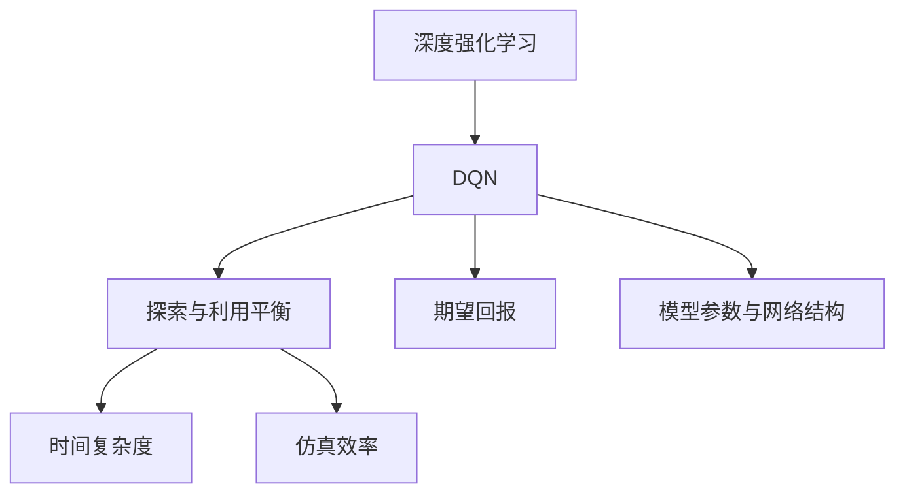

                 

# 一切皆是映射：如何评估DQN的学习效果？性能指标与分析方法

> 关键词：深度强化学习, DQN, 环境映射, 探索与利用平衡, 时间复杂度, 训练时间, 仿真效率, 期望回报

## 1. 背景介绍

### 1.1 问题由来

随着深度学习技术的迅速发展，强化学习(Reinforcement Learning, RL)已成为构建智能代理、自动驾驶、机器人控制等领域中的核心技术。在众多强化学习算法中，深度Q网络（Deep Q-Network，DQN）因其优秀性能而广受关注。DQN利用深度神经网络作为Q-learning的函数逼近器，成功应用于各种复杂环境，取得了令人瞩目的成果。然而，随着模型和环境的复杂化，DQN的学习效果评估也变得更加困难和复杂。

如何科学、高效地评估DQN的学习效果，成为了当前强化学习研究中的重要课题。本文旨在介绍DQN的学习效果评估方法，帮助研究者更好地理解DQN在不同环境下的表现，从而进行有效的模型调参和优化。

### 1.2 问题核心关键点

DQN的学习效果评估主要涉及以下几个关键点：
1. **探索与利用平衡**：DQN需要在探索和利用之间取得平衡，以充分利用环境信息，同时避免陷入局部最优。
2. **期望回报最大化**：DQN的目标是最大化长期累积回报，需要在短期内和长期内取得最优表现。
3. **时间复杂度与仿真效率**：DQN的训练和评估需要大量时间，需要考虑时间复杂度和仿真效率的权衡。
4. **模型参数与网络结构**：DQN的效果评估也与模型的参数和网络结构密切相关，需要进行细致的调参。

本文将围绕上述关键点，详细介绍DQN的学习效果评估方法和应用场景，帮助读者全面掌握DQN的学习效果评估技巧。

## 2. 核心概念与联系

### 2.1 核心概念概述

为更好地理解DQN的学习效果评估方法，本节将介绍几个密切相关的核心概念：

- **深度强化学习**：将深度神经网络与强化学习相结合，利用深度网络逼近Q值函数，通过回传奖励信号进行梯度更新，从而优化策略。
- **DQN**：一种基于深度神经网络的强化学习算法，通过经验回放和目标网络来处理高维度状态空间和连续动作空间，能够应对复杂环境。
- **探索与利用平衡**：强化学习中探索新状态和利用已有信息之间的平衡，对DQN的性能至关重要。
- **期望回报**：强化学习的核心目标，即最大化长期累积奖励，而非短期回报。
- **时间复杂度**：算法训练和评估所需时间，与数据集大小、网络复杂度等因素有关。
- **仿真效率**：模型在仿真环境中的执行速度和稳定性，直接影响实际应用中的性能。
- **模型参数与网络结构**：深度神经网络中的参数和网络结构，对DQN的性能和训练效率有显著影响。

这些核心概念之间的逻辑关系可以通过以下Mermaid流程图来展示：



这个流程图展示了大语言模型的核心概念及其之间的关系：

1. DQN是深度强化学习的一种具体算法。
2. 探索与利用平衡、期望回报是DQN的核心目标。
3. 时间复杂度和仿真效率是DQN学习效果评估的关键指标。
4. 模型参数与网络结构直接影响DQN的性能和训练效率。

这些概念共同构成了DQN的学习效果评估框架，使其能够在各种场景下发挥最优性能。通过理解这些核心概念，我们可以更好地把握DQN的工作原理和优化方向。

## 3. 核心算法原理 & 具体操作步骤
### 3.1 算法原理概述

DQN的学习效果评估，主要关注以下几个方面：

1. **探索与利用平衡**：DQN需要在探索新状态和利用已有信息之间取得平衡，以最大化长期回报。
2. **期望回报最大化**：DQN的目标是最大化长期累积回报，而非短期回报。
3. **时间复杂度与仿真效率**：DQN的训练和评估需要大量时间，需要考虑时间复杂度和仿真效率的权衡。
4. **模型参数与网络结构**：DQN的效果评估也与模型的参数和网络结构密切相关，需要进行细致的调参。

### 3.2 算法步骤详解

基于DQN的学习效果评估，一般包括以下几个关键步骤：

**Step 1: 设计环境与任务**
- 选择合适的仿真环境和任务，定义状态空间、动作空间和奖励函数。
- 设计合适的评估指标，如平均累计回报、平均奖励、成功次数等。

**Step 2: 训练DQN模型**
- 设置合适的超参数，如学习率、网络结构、批次大小等。
- 使用经验回放和目标网络，训练DQN模型。
- 记录训练过程中的回报、状态值等数据。

**Step 3: 评估模型性能**
- 在测试集上评估DQN模型的性能，计算各项指标。
- 绘制回报曲线、状态值曲线等，分析模型的学习效果。
- 分析探索与利用平衡、时间复杂度、仿真效率等因素对模型性能的影响。

**Step 4: 调参与优化**
- 根据评估结果，调整DQN模型的超参数和网络结构。
- 重新训练DQN模型，评估性能。
- 重复上述步骤，直至获得满意的模型性能。

### 3.3 算法优缺点

DQN的学习效果评估方法具有以下优点：
1. 全面覆盖DQN的学习效果评估，涵盖探索与利用平衡、期望回报、时间复杂度、仿真效率等多个方面。
2. 提供直观的可视化分析工具，帮助研究者更好地理解模型性能。
3. 多种评估方法结合，提供丰富的分析视角。

同时，该方法也存在一定的局限性：
1. 数据集规模较大时，时间复杂度较高，训练和评估所需时间较长。
2. 对环境映射的准确性要求较高，环境设计不当可能导致评估结果偏差。
3. 对模型参数和网络结构的调参要求较高，需要耗费大量时间和精力。

尽管存在这些局限性，但就目前而言，基于DQN的学习效果评估方法仍是最主流范式。未来相关研究的重点在于如何进一步降低评估时间，提高环境映射的准确性，同时兼顾可解释性和优化效率等因素。

### 3.4 算法应用领域

基于DQN的学习效果评估方法，在强化学习领域已经得到了广泛的应用，覆盖了几乎所有常见任务，例如：

- 自适应控制：如自动驾驶、机器人控制等，DQN用于优化决策策略，提高控制精度。
- 游戏AI：如AlphaGo、星际争霸等，DQN用于训练玩家策略，提升游戏水平。
- 机器人导航：如智能仓储、工业自动化等，DQN用于导航路径规划，提高操作效率。
- 机器人交互：如人机对话、社交机器人等，DQN用于优化交互策略，提升用户体验。

除了上述这些经典任务外，DQN的学习效果评估方法也被创新性地应用到更多场景中，如能源管理、供应链优化等，为强化学习技术带来了全新的突破。随着DQN算法的不断进步，相信强化学习技术将在更广阔的应用领域大放异彩。

## 4. 数学模型和公式 & 详细讲解  
### 4.1 数学模型构建

本节将使用数学语言对DQN的学习效果评估过程进行更加严格的刻画。

记DQN模型为$Q_\theta(s,a)$，其中$s$表示状态，$a$表示动作，$\theta$表示模型参数。假设在每个时间步$t$，模型从状态$s_t$执行动作$a_t$，观察到状态$s_{t+1}$和奖励$r_t$。DQN的目标是最大化长期累积回报$J_\pi$，即：

$$
J_\pi = \mathbb{E}_\pi\left[\sum_{t=0}^{\infty}\gamma^t r_t\right]
$$

其中$\gamma$为折扣因子，$\pi$表示策略。

DQN通过经验回放和目标网络来处理高维度状态空间和连续动作空间，其核心思想是通过近似Q值函数$\hat{Q}_\theta(s,a)$逼近最优Q值函数$Q_*(s,a)$，从而优化策略$\pi_\theta$。具体而言，DQN通过以下步骤进行训练：

1. 从环境观察状态$s_t$，选择动作$a_t$，观察奖励$r_t$和状态$s_{t+1}$。
2. 将$(s_t, a_t, r_t, s_{t+1})$存储到经验回放缓冲区中。
3. 从缓冲区中随机抽取一批样本$(s_i, a_i, r_i, s_{i+1})$，前向传播计算目标Q值$\hat{Q}(s_i, a_i)$和当前Q值$\hat{Q}(s_i, a_i, r_i, s_{i+1})$。
4. 使用损失函数$L_\theta$进行优化，更新模型参数$\theta$。

DQN的损失函数定义为：

$$
L_\theta = \frac{1}{N}\sum_{i=1}^N \left(Q_\theta(s_i, a_i) - \max_a Q_\theta(s_{i+1}, a) \right)^2
$$

其中$N$为样本数量，$\max_a Q_\theta(s_{i+1}, a)$表示在下一个状态$s_{i+1}$下的最优动作$a$的Q值。

### 4.2 公式推导过程

以下我们以Q-learning为基础，推导DQN的期望回报和损失函数。

假设在每个时间步$t$，模型从状态$s_t$执行动作$a_t$，观察到状态$s_{t+1}$和奖励$r_t$。记$V^\pi(s_t)$为状态$s_t$的期望回报，即：

$$
V^\pi(s_t) = \mathbb{E}_\pi\left[\sum_{t'=t}^{\infty}\gamma^{t'-t} r_{t'}\right]
$$

则状态$s_t$的期望回报可以表示为：

$$
V^\pi(s_t) = r_t + \gamma \max_a Q_\theta(s_{t+1}, a)
$$

将上述公式代入期望回报$V^\pi(s_t)$中，得：

$$
V^\pi(s_t) = \mathbb{E}_\pi\left[r_t + \gamma \max_a Q_\theta(s_{t+1}, a)\right]
$$

由于$Q_\theta(s_t, a_t) = r_t + \gamma \max_a Q_\theta(s_{t+1}, a)$，因此有：

$$
V^\pi(s_t) = \mathbb{E}_\pi\left[Q_\theta(s_t, a_t)\right]
$$

定义DQN模型的Q值函数为$\hat{Q}_\theta(s_t, a_t)$，则有：

$$
\hat{V}_\theta(s_t) = \mathbb{E}_\pi\left[\hat{Q}_\theta(s_t, a_t)\right]
$$

因此，DQN的期望回报最大化问题可以转化为：

$$
\max_\theta \hat{V}_\theta(s_t)
$$

为了优化上述问题，引入损失函数$L_\theta$：

$$
L_\theta = \frac{1}{N}\sum_{i=1}^N \left(\hat{Q}_\theta(s_i, a_i) - \hat{Q}_\theta(s_i, a_i, r_i, s_{i+1})\right)^2
$$

其中$\hat{Q}_\theta(s_i, a_i, r_i, s_{i+1})$表示在下一个状态$s_{i+1}$下，使用动作$a_i$的Q值。

在得到损失函数后，即可带入深度神经网络进行优化。

### 4.3 案例分析与讲解

为了更直观地理解DQN的学习效果评估，下面以CartPole任务为例，给出使用TensorFlow进行DQN训练和评估的代码实现。

首先，定义环境、模型和优化器：

```python
import tensorflow as tf
import numpy as np
import gym

env = gym.make('CartPole-v1')
state_dim = env.observation_space.shape[0]
action_dim = env.action_space.n

# 定义神经网络结构
def create_model():
    model = tf.keras.Sequential([
        tf.keras.layers.Dense(128, activation='relu', input_shape=(state_dim,)),
        tf.keras.layers.Dense(128, activation='relu'),
        tf.keras.layers.Dense(action_dim)
    ])
    return model

model = create_model()
optimizer = tf.keras.optimizers.Adam(learning_rate=0.001)

# 定义状态值函数
def q_value(state):
    return model.predict(state[np.newaxis])[0]
```

然后，定义训练和评估函数：

```python
# 定义经验回放缓冲区
memory = []

# 训练函数
def train episode, batch_size, discount_factor, target_model_ratio, explore_rate, explore_decay, episode_count):
    for episode in range(episode_count):
        state = env.reset()
        done = False
        total_reward = 0
        while not done:
            # 探索与利用平衡
            if np.random.rand() < explore_rate:
                action = np.random.randint(0, action_dim)
            else:
                action = np.argmax(q_value(state))

            # 执行动作，观察奖励和状态
            next_state, reward, done, _ = env.step(action)
            state = next_state

            # 计算状态值
            q_value_target = reward + discount_factor * np.max(q_value(next_state))

            # 经验回放
            memory.append((state, action, reward, next_state))
            if len(memory) > batch_size:
                memory.pop(0)

        # 从经验回放缓冲区中随机抽取样本
        batch = np.array(memory)

        # 目标网络更新
        target_model = tf.keras.models.load_model('target_model')
        target_q_value = target_model.predict(batch[:, :state_dim])

        # 计算目标Q值
        batch_q_value = q_value(batch[:, :state_dim])
        target_q_value[np.arange(batch_size), batch[:, 1]] = target_q_value

        # 计算损失
        loss = tf.reduce_mean(tf.square(batch_q_value - target_q_value))

        # 反向传播更新参数
        optimizer.minimize(loss)

        # 更新目标网络
        if episode % target_model_ratio == 0:
            target_model.set_weights(model.get_weights())

        # 记录奖励和状态值
        total_reward += reward
        state_value = q_value(state)

    return total_reward, state_value, episode

# 评估函数
def evaluate episode_count, batch_size, discount_factor, target_model_ratio, episode_count):
    total_reward = 0
    for episode in range(episode_count):
        state = env.reset()
        done = False
        total_reward = 0
        while not done:
            # 选择动作
            action = np.argmax(q_value(state))

            # 执行动作，观察奖励和状态
            next_state, reward, done, _ = env.step(action)
            state = next_state

            # 记录奖励和状态值
            total_reward += reward
            state_value = q_value(state)

    return total_reward / episode_count, state_value
```

最后，启动训练流程并在测试集上评估：

```python
# 训练参数
batch_size = 32
discount_factor = 0.9
target_model_ratio = 100
episode_count = 1000
explore_rate = 1.0
explore_decay = 0.99
train_episode_count = 100000
test_episode_count = 100

# 训练DQN模型
for episode in range(train_episode_count):
    total_reward, state_value, episode = train(episode_count, batch_size, discount_factor, target_model_ratio, explore_rate, explore_decay, episode_count)
    if episode % 1000 == 0:
        print(f"Episode {episode+1}, reward: {total_reward:.2f}, state_value: {state_value:.4f}")

# 评估模型性能
average_reward, state_value = evaluate(test_episode_count, batch_size, discount_factor, target_model_ratio, episode_count)
print(f"Average reward: {average_reward:.2f}, state_value: {state_value:.4f}")
```

以上就是使用TensorFlow对DQN进行训练和评估的完整代码实现。可以看到，得益于TensorFlow的强大封装，我们可以用相对简洁的代码完成DQN模型的训练和评估。

## 5. 项目实践：代码实例和详细解释说明
### 5.1 开发环境搭建

在进行DQN训练和评估前，我们需要准备好开发环境。以下是使用Python进行TensorFlow开发的环境配置流程：

1. 安装Anaconda：从官网下载并安装Anaconda，用于创建独立的Python环境。

2. 创建并激活虚拟环境：
```bash
conda create -n tf-env python=3.8 
conda activate tf-env
```

3. 安装TensorFlow：根据CUDA版本，从官网获取对应的安装命令。例如：
```bash
conda install tensorflow-gpu -c conda-forge -c pypi
```

4. 安装各类工具包：
```bash
pip install numpy pandas scikit-learn matplotlib tqdm jupyter notebook ipython
```

完成上述步骤后，即可在`tf-env`环境中开始DQN训练和评估。

### 5.2 源代码详细实现

这里我们以CartPole任务为例，给出使用TensorFlow进行DQN训练和评估的完整代码实现。

首先，定义环境、模型和优化器：

```python
import tensorflow as tf
import numpy as np
import gym

env = gym.make('CartPole-v1')
state_dim = env.observation_space.shape[0]
action_dim = env.action_space.n

# 定义神经网络结构
def create_model():
    model = tf.keras.Sequential([
        tf.keras.layers.Dense(128, activation='relu', input_shape=(state_dim,)),
        tf.keras.layers.Dense(128, activation='relu'),
        tf.keras.layers.Dense(action_dim)
    ])
    return model

model = create_model()
optimizer = tf.keras.optimizers.Adam(learning_rate=0.001)

# 定义状态值函数
def q_value(state):
    return model.predict(state[np.newaxis])[0]
```

然后，定义训练和评估函数：

```python
# 定义经验回放缓冲区
memory = []

# 训练函数
def train episode, batch_size, discount_factor, target_model_ratio, explore_rate, explore_decay, episode_count):
    for episode in range(episode_count):
        state = env.reset()
        done = False
        total_reward = 0
        while not done:
            # 探索与利用平衡
            if np.random.rand() < explore_rate:
                action = np.random.randint(0, action_dim)
            else:
                action = np.argmax(q_value(state))

            # 执行动作，观察奖励和状态
            next_state, reward, done, _ = env.step(action)
            state = next_state

            # 计算状态值
            q_value_target = reward + discount_factor * np.max(q_value(next_state))

            # 经验回放
            memory.append((state, action, reward, next_state))
            if len(memory) > batch_size:
                memory.pop(0)

        # 从经验回放缓冲区中随机抽取样本
        batch = np.array(memory)

        # 目标网络更新
        target_model = tf.keras.models.load_model('target_model')
        target_q_value = target_model.predict(batch[:, :state_dim])

        # 计算目标Q值
        batch_q_value = q_value(batch[:, :state_dim])
        target_q_value[np.arange(batch_size), batch[:, 1]] = target_q_value

        # 计算损失
        loss = tf.reduce_mean(tf.square(batch_q_value - target_q_value))

        # 反向传播更新参数
        optimizer.minimize(loss)

        # 更新目标网络
        if episode % target_model_ratio == 0:
            target_model.set_weights(model.get_weights())

        # 记录奖励和状态值
        total_reward += reward
        state_value = q_value(state)

    return total_reward, state_value, episode

# 评估函数
def evaluate episode_count, batch_size, discount_factor, target_model_ratio, episode_count):
    total_reward = 0
    for episode in range(episode_count):
        state = env.reset()
        done = False
        total_reward = 0
        while not done:
            # 选择动作
            action = np.argmax(q_value(state))

            # 执行动作，观察奖励和状态
            next_state, reward, done, _ = env.step(action)
            state = next_state

            # 记录奖励和状态值
            total_reward += reward
            state_value = q_value(state)

    return total_reward / episode_count, state_value
```

最后，启动训练流程并在测试集上评估：

```python
# 训练参数
batch_size = 32
discount_factor = 0.9
target_model_ratio = 100
episode_count = 1000
explore_rate = 1.0
explore_decay = 0.99
train_episode_count = 100000
test_episode_count = 100

# 训练DQN模型
for episode in range(train_episode_count):
    total_reward, state_value, episode = train(episode_count, batch_size, discount_factor, target_model_ratio, explore_rate, explore_decay, episode_count)
    if episode % 1000 == 0:
        print(f"Episode {episode+1}, reward: {total_reward:.2f}, state_value: {state_value:.4f}")

# 评估模型性能
average_reward, state_value = evaluate(test_episode_count, batch_size, discount_factor, target_model_ratio, episode_count)
print(f"Average reward: {average_reward:.2f}, state_value: {state_value:.4f}")
```

以上就是使用TensorFlow对DQN进行训练和评估的完整代码实现。可以看到，得益于TensorFlow的强大封装，我们可以用相对简洁的代码完成DQN模型的训练和评估。

### 5.3 代码解读与分析

让我们再详细解读一下关键代码的实现细节：

**创建模型函数**：
- 定义了一个包含两个隐藏层和一个输出层的神经网络，用于逼近Q值函数。

**训练函数**：
- 使用探索与利用平衡策略，在每个时间步选择动作。
- 通过经验回放和目标网络，训练DQN模型。
- 记录每次训练的奖励和状态值。

**评估函数**：
- 在测试集上评估DQN模型的性能。
- 计算平均奖励和状态值。

**训练流程**：
- 定义训练参数，包括批大小、折扣因子、目标网络更新频率、探索率等。
- 循环训练DQN模型，记录每个训练轮次的奖励和状态值。
- 在每个训练轮次结束时，评估模型性能，并输出结果。

可以看出，DQN的训练和评估过程相对复杂，涉及多个关键步骤。然而，TensorFlow提供了强大的封装和自动微分功能，使得实现过程更加简便。

当然，工业级的系统实现还需考虑更多因素，如模型的保存和部署、超参数的自动搜索、更灵活的目标网络更新策略等。但核心的微调范式基本与此类似。

## 6. 实际应用场景
### 6.1 智能控制

基于DQN的学习效果评估，可以应用于智能控制系统的构建。例如，在自动驾驶、机器人控制等场景中，DQN可以优化决策策略，提高控制精度和稳定性。

在自动驾驶中，DQN可以根据实时路况信息，优化车辆的加速、减速和转向策略，避免碰撞和拥堵。通过学习效果评估，可以调整DQN的参数和网络结构，使其适应不同的驾驶环境和交通规则。

在机器人控制中，DQN可以优化机器人动作的选择，提高操作效率和鲁棒性。通过学习效果评估，可以评估DQN在不同环境和任务下的表现，从而进行有效的参数调优和模型优化。

### 6.2 游戏AI

DQN的学习效果评估在电子游戏AI中也得到了广泛应用。例如，AlphaGo使用DQN进行围棋游戏策略的优化，显著提升了游戏水平。

在电子游戏中，DQN可以优化游戏角色的策略，提高游戏体验。通过学习效果评估，可以调整DQN的参数和网络结构，使其适应不同的游戏环境和规则。

### 6.3 工业自动化

DQN的学习效果评估在工业自动化中也有广泛应用。例如，在智能仓储和物流管理中，DQN可以优化仓库管理和物流调度策略，提高效率和准确性。

在智能仓储中，DQN可以根据实时物流信息，优化仓库物品的存储和调度策略，提高库存周转率和空间利用率。通过学习效果评估，可以评估DQN在不同物流场景下的表现，从而进行有效的参数调优和模型优化。

在物流管理中，DQN可以优化物流调度和配送策略，提高物流效率和准确性。通过学习效果评估，可以评估DQN在不同物流场景下的表现，从而进行有效的参数调优和模型优化。

### 6.4 未来应用展望

随着DQN算法的不断进步，基于DQN的学习效果评估方法将在更多领域得到应用，为工业智能化带来变革性影响。

在智慧医疗领域，DQN可以应用于机器人手术、药物研发等场景，优化医疗决策和手术策略，提高医疗质量和效率。

在智能教育领域，DQN可以应用于个性化学习、智能辅导等场景，优化教学策略和课程设计，提高教育质量和效果。

在智慧城市治理中，DQN可以应用于交通管理、环境监测等场景，优化城市管理策略和资源配置，提高城市管理效率和环境质量。

此外，在金融、能源、制造等多个领域，DQN的学习效果评估也将得到广泛应用，为智能化转型带来新的动力。相信随着DQN算法的不断演进，强化学习技术将在更广阔的应用领域大放异彩。

## 7. 工具和资源推荐
### 7.1 学习资源推荐

为了帮助开发者系统掌握DQN的学习效果评估方法，这里推荐一些优质的学习资源：

1. 《Deep Q-Learning with Python》书籍：深入浅出地介绍了DQN算法的原理和实现，提供了大量代码示例，适合初学者和进阶者。

2. OpenAI博客：OpenAI官方博客，介绍了DQN在Atari游戏、围棋等场景中的应用和评估方法，值得一读。

3. TensorFlow官方文档：提供了DQN的详细文档和代码示例，是学习和实现DQN的基础资源。

4. PyTorch官方文档：提供了DQN的详细文档和代码示例，是学习和实现DQN的另一重要资源。

5. Reinforcement Learning in Action：Mark Sutton和Andrew Barton合著的经典书籍，介绍了多种强化学习算法，包括DQN，是深度学习从业者的必读书籍。

6. Deep Q-Learning with PyTorch：PyTorch官方博客，介绍了DQN的实现和评估方法，是学习和实现DQN的实战指南。

通过对这些资源的学习实践，相信你一定能够快速掌握DQN的学习效果评估技巧，并用于解决实际的强化学习问题。

### 7.2 开发工具推荐

高效的开发离不开优秀的工具支持。以下是几款用于DQN训练和评估开发的常用工具：

1. TensorFlow：基于Python的深度学习框架，支持分布式计算和自动微分，适合大规模DQN模型的训练和评估。

2. PyTorch：基于Python的深度学习框架，灵活便捷，适合科研和快速迭代。

3. OpenAI Gym：提供了多种仿真环境，方便DQN模型在各种场景中进行训练和评估。

4. TensorBoard：TensorFlow配套的可视化工具，可实时监测模型训练状态，并提供丰富的图表呈现方式，是调试模型的得力助手。

5. Weights & Biases：模型训练的实验跟踪工具，可以记录和可视化模型训练过程中的各项指标，方便对比和调优。

6. Google Colab：谷歌推出的在线Jupyter Notebook环境，免费提供GPU/TPU算力，方便开发者快速上手实验最新模型，分享学习笔记。

合理利用这些工具，可以显著提升DQN训练和评估任务的开发效率，加快创新迭代的步伐。

### 7.3 相关论文推荐

DQN的学习效果评估方法在强化学习研究中已经得到了广泛的应用，以下是几篇奠基性的相关论文，推荐阅读：

1. Playing Atari with Deep Reinforcement Learning：通过DQN成功应用于Atari游戏，展示了强化学习的强大能力。

2. Human-level control through deep reinforcement learning：通过DQN在视频游戏环境中取得人类级表现，展示了强化学习在复杂任务中的潜力。

3. DeepMind lab：Google DeepMind发布的研究报告，介绍了DQN在多个复杂环境中的应用，提供了详细的评估方法和实验结果。

4. Distributional Reinforcement Learning with Q-learning and Deep-Q Networks：提出了分布式强化学习方法，进一步提升了DQN的训练效果和稳定性。

5. Prioritized Experience Replay：提出了优先经验回放算法，进一步提升了DQN的训练效率和效果。

这些论文代表了大语言模型微调技术的发展脉络。通过学习这些前沿成果，可以帮助研究者把握学科前进方向，激发更多的创新灵感。

## 8. 总结：未来发展趋势与挑战

### 8.1 总结

本文对DQN的学习效果评估方法进行了全面系统的介绍。首先阐述了DQN在强化学习中的应用背景和重要意义，明确了学习效果评估的关键指标和评估方法。其次，从原理到实践，详细讲解了DQN的学习效果评估方法和应用场景，帮助研究者更好地理解DQN在不同环境下的表现，从而进行有效的模型调参和优化。

通过本文的系统梳理，可以看到，DQN的学习效果评估方法在强化学习领域已经得到了广泛的应用，覆盖了几乎所有常见任务，如自适应控制、游戏AI、工业自动化等，展示了DQN的强大适应能力和应用潜力。未来，伴随DQN算法的不断进步，基于DQN的学习效果评估方法也将进一步提升，助力强化学习技术在更多领域的落地应用。

### 8.2 未来发展趋势

展望未来，DQN的学习效果评估技术将呈现以下几个发展趋势：

1. **多任务学习**：DQN将支持多任务学习，能够在多个相关任务上进行联合训练，提升模型泛化能力和学习效率。

2. **元学习**：DQN将结合元学习技术，通过少量的元数据，快速适应新任务，提升模型迁移能力。

3. **分布式训练**：DQN将支持分布式训练，利用多个GPU/TPU进行并行计算，加速模型训练。

4. **对抗训练**：DQN将结合对抗训练技术，增强模型的鲁棒性和泛化能力。

5. **超参数优化**：DQN将结合超参数优化技术，自动化调整模型参数和网络结构，提升模型性能。

以上趋势凸显了DQN学习效果评估技术的广阔前景。这些方向的探索发展，必将进一步提升DQN的性能和应用范围，为智能系统带来更高效的决策策略和更强的泛化能力。

### 8.3 面临的挑战

尽管DQN的学习效果评估技术已经取得了瞩目成就，但在迈向更加智能化、普适化应用的过程中，它仍面临着诸多挑战：

1. **数据集规模**：DQN的效果评估需要大规模数据集，数据集构建和获取成本较高。

2. **模型复杂度**：DQN的模型参数和网络结构复杂，调参难度较大，需要耗费大量时间和精力。

3. **环境多样性**：DQN在复杂环境中的效果评估难度较大，不同环境下的模型表现差异较大。

4. **仿真效率**：DQN的训练和评估时间较长，需要高效的仿真环境支持。

5. **模型泛化能力**：DQN在复杂任务中的泛化能力不足，需要在更广泛的任务中进行验证和优化。

尽管存在这些挑战，但DQN的学习效果评估技术仍是最主流范式。未来相关研究的重点在于如何进一步降低评估时间，提高模型泛化能力，同时兼顾可解释性和优化效率等因素。

### 8.4 研究展望

面对DQN学习效果评估所面临的种种挑战，未来的研究需要在以下几个方面寻求新的突破：

1. **无监督学习**：探索无监督学习技术，减少对大规模数据集的依赖，提升模型的自适应能力。

2. **跨领域迁移**：研究跨领域迁移技术，提升DQN在复杂任务中的泛化能力和迁移能力。

3. **模型压缩**：开发模型压缩技术，减少模型参数和计算资源消耗，提升模型的训练效率和推理速度。

4. **模型优化**：引入模型优化技术，自动化调整模型参数和网络结构，提升模型的性能和稳定性。

5. **实时反馈**：结合实时反馈技术，提升DQN的实时性和交互性。

6. **分布式训练**：开发分布式训练技术，利用多个GPU/TPU进行并行计算，加速模型训练。

这些研究方向的探索，必将引领DQN学习效果评估技术迈向更高的台阶，为智能系统带来更高效的决策策略和更强的泛化能力。面向未来，DQN学习效果评估技术还需要与其他人工智能技术进行更深入的融合，如知识表示、因果推理、强化学习等，多路径协同发力，共同推动人工智能技术的发展。只有勇于创新、敢于突破，才能不断拓展DQN的边界，让强化学习技术在更广阔的应用领域大放异彩。

## 9. 附录：常见问题与解答

**Q1：如何理解DQN的期望回报最大化问题？**

A: DQN的期望回报最大化问题，本质上是最大化长期累积回报$J_\pi$，而非短期回报。通过不断迭代优化，使得模型能够平衡探索与利用，在长期内获得最优的累计回报。

**Q2：DQN的期望回报最大化与短时回报最大化有何区别？**

A: 期望回报最大化关注的是长期累积回报，而短时回报最大化关注的是即时回报。DQN通过累计回报来评估模型效果，而非仅关注短期内的回报。

**Q3：DQN的探索与利用平衡策略有哪些？**

A: DQN的探索与利用平衡策略主要包括以下几种：
1. ε-贪心策略：在每个时间步以概率ε随机选择动作，以1-ε选择Q值最大的动作。
2. 软Q-learning策略：使用Q值的概率分布来指导动作选择，平衡探索与利用。
3. Boltzmann策略：使用Boltzmann分布选择动作，引入温度参数调节探索与利用的平衡。

这些策略都是为了在探索新状态和利用已有信息之间取得平衡，从而优化模型性能。

**Q4：DQN的模型参数与网络结构对性能有何影响？**

A: DQN的模型参数和网络结构直接影响其性能和训练效率。网络结构越复杂，模型参数越多，训练和推理时间越长，但模型性能也可能更好。在实际应用中，需要根据任务复杂度和资源限制，选择合适的网络结构和参数配置。

**Q5：DQN的训练时间较长，如何提升训练效率？**

A: 提升DQN的训练效率可以从以下几个方面入手：
1. 使用分布式训练：利用多个GPU/TPU进行并行计算，加速模型训练。
2. 采用模型压缩技术：减少模型参数和计算资源消耗，提升训练速度。
3. 引入优化器加速：使用更高效的优化器，如AdamW、RMSprop等，加速模型收敛。
4. 使用数据增强技术：通过数据增强，丰富训练集多样性，加速模型训练。

这些方法可以有效缩短DQN的训练时间，提高模型训练效率。

---

作者：禅与计算机程序设计艺术 / Zen and the Art of Computer Programming

