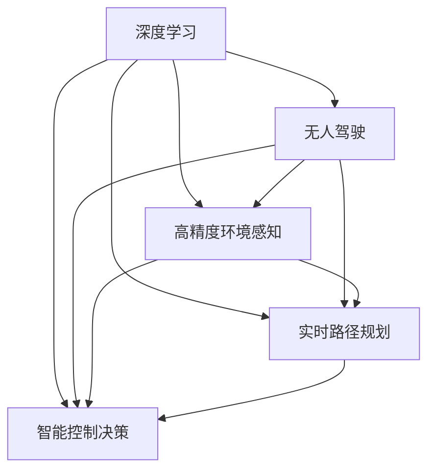

                 

## 1. 背景介绍

### 1.1 问题由来
随着人工智能技术的飞速发展，无人驾驶技术逐渐成为全球各大企业竞相投入的热点领域。作为人工智能与自动驾驶技术的深度融合，无人驾驶系统依赖于环境感知、路径规划、控制决策等多个环节的协同工作，旨在实现车辆自动化行驶，大幅提升道路安全性和交通效率。然而，无人驾驶系统面临的复杂环境和多变需求，使其在实际部署中仍面临诸多技术挑战。

**核心挑战包括：**
1. 高精度环境感知：从各种传感器中提取精确、丰富的道路信息。
2. 实时路径规划：在动态变化的交通环境中实时生成最优路径。
3. 智能控制决策：在复杂场景下做出快速、可靠的驾驶决策。

这些挑战催生了对深度学习技术的需求，希望通过复杂的数据表示和模型训练，提升无人驾驶系统的智能水平和自动化程度。

### 1.2 问题核心关键点
深度学习在无人驾驶中的应用，主要集中在以下几个关键环节：
- 高精度环境感知：通过深度神经网络处理摄像头、雷达、激光雷达等传感器数据，提取高精度的道路信息。
- 实时路径规划：利用深度强化学习技术，从动态环境中选择最优路径。
- 智能控制决策：通过深度学习模型，实现车辆控制决策的自动化，适应多变场景。

这些关键环节的优化，不仅依赖于深度学习模型的训练，还需要在大规模数据集上进行反复迭代和优化。深度学习为无人驾驶技术带来了新的突破，但也面临诸多技术难题和实际挑战。

### 1.3 问题研究意义
研究深度学习在无人驾驶中的应用，对于推动无人驾驶技术的发展和落地，具有重要意义：

1. **提升驾驶安全性和可靠性**：通过高精度的环境感知和智能决策，大幅减少交通事故和误操作，提升驾驶安全性和可靠性。
2. **提高交通效率**：实时路径规划和控制决策的优化，有助于提升道路通行效率，缓解交通压力。
3. **降低驾驶成本**：无人驾驶技术的普及，将大幅降低人力成本，推动传统运输行业向智能化转型。
4. **促进创新应用**：无人驾驶技术的突破，将催生更多新应用场景，如自动快递、无人环卫等，为社会带来更多便利。
5. **推动科技发展**：无人驾驶技术的不断演进，将促进人工智能技术的成熟，带动相关产业链的发展。

## 2. 核心概念与联系

### 2.1 核心概念概述

为更好地理解深度学习在无人驾驶中的应用，本节将介绍几个密切相关的核心概念：

- **深度学习(Deep Learning, DL)**：一种基于神经网络的机器学习方法，通过多层次的特征抽取和数据表示，实现对复杂模式的建模和预测。
- **无人驾驶(Autonomous Driving, AD)**：通过环境感知、路径规划和控制决策，实现车辆自动化行驶的技术，旨在提高道路安全性和交通效率。
- **高精度环境感知(High-Precision Perception, HPP)**：通过摄像头、雷达、激光雷达等传感器，提取精确的交通环境和道路信息，供后续处理使用。
- **实时路径规划(Real-Time Path Planning, RTPP)**：根据当前交通环境，实时生成最优路径，指导车辆行驶。
- **智能控制决策(Intelligent Control Decision, ICD)**：在复杂场景下，通过深度学习模型，实现车辆控制决策的自动化，保障安全行驶。
- **联邦学习(Federated Learning, FL)**：一种分布式机器学习方法，多设备协作训练模型，保护数据隐私的同时提升模型性能。

这些核心概念之间的逻辑关系可以通过以下Mermaid流程图来展示：



这个流程图展示了大语言模型的核心概念及其之间的关系：

1. 深度学习为无人驾驶提供了核心算法支持。
2. 高精度环境感知、实时路径规划、智能控制决策是无人驾驶的核心技术环节。
3. 联邦学习作为一种分布式训练技术，有助于在保障数据隐私的前提下，提升无人驾驶系统的智能水平。

## 3. 核心算法原理 & 具体操作步骤

### 3.1 算法原理概述

深度学习在无人驾驶中的应用，主要涉及以下几个关键环节：

- **高精度环境感知**：通过神经网络处理传感器数据，提取道路和交通环境的精细表示。
- **实时路径规划**：利用深度强化学习技术，优化路径规划算法，确保在动态环境中选择最优路径。
- **智能控制决策**：通过深度学习模型，学习控制决策的复杂模式，提高自动驾驶的鲁棒性和安全性。

### 3.2 算法步骤详解

以下我们将详细介绍深度学习在无人驾驶技术中的具体应用步骤：

#### 3.2.1 高精度环境感知
**步骤1：数据预处理**
- 收集和标注大量的传感器数据，如摄像头图像、雷达点云、激光雷达数据等。
- 对传感器数据进行归一化、降噪、增强等预处理，确保数据质量和一致性。

**步骤2：特征提取**
- 使用卷积神经网络(CNN)处理摄像头图像，提取道路、车辆、行人等关键特征。
- 利用点云神经网络(PCL)处理雷达点云，提取道路结构、交通障碍等细节信息。
- 应用激光雷达SLAM算法，生成高精度的地图和定位信息。

**步骤3：数据融合**
- 将摄像头、雷达、激光雷达等多模态数据进行融合，构建高精度的环境表示。
- 使用融合神经网络，将不同模态的特征进行集成，生成统一的语义空间。

#### 3.2.2 实时路径规划
**步骤1：环境建模**
- 使用深度强化学习，对动态环境进行建模，构建交通场景的连续空间。
- 利用模拟环境进行训练，学习从当前状态到最优动作的映射关系。

**步骤2：路径生成**
- 使用深度搜索算法，如A*、RRT等，在连续空间中生成最优路径。
- 结合强化学习策略，优化路径生成过程，确保路径的实时性和安全性。

#### 3.2.3 智能控制决策
**步骤1：决策模型训练**
- 使用深度学习模型，如DNN、RNN、CNN等，训练决策模型，学习控制决策的复杂模式。
- 利用标注数据进行监督学习，优化模型性能，确保决策的准确性和鲁棒性。

**步骤2：实时决策**
- 在实时驾驶场景中，将传感器数据输入决策模型，输出车辆控制指令。
- 利用模型预测结果，结合环境感知信息，进行多目标优化，确保决策的及时性和安全性。

### 3.3 算法优缺点

深度学习在无人驾驶中的应用，具有以下优点：
1. **高效的数据处理**：通过神经网络对大量传感器数据进行处理，快速提取关键信息，提升环境感知能力。
2. **强大的泛化能力**：深度学习模型能够从数据中学习复杂的模式，适应多变的环境和需求。
3. **实时决策支持**：深度学习模型可以实时生成决策，提高自动驾驶的自动化水平。
4. **智能路径规划**：深度强化学习技术，优化路径规划算法，确保车辆在动态环境中的安全行驶。

同时，深度学习在无人驾驶中也有一些缺点：
1. **高计算需求**：深度学习模型需要大量计算资源，尤其是在处理高分辨率图像和点云数据时。
2. **数据依赖**：深度学习模型对标注数据依赖度高，标注成本较高，难以在小规模数据上取得理想效果。
3. **鲁棒性问题**：深度模型对输入数据的噪声和异常敏感，容易产生误判。
4. **模型可解释性**：深度学习模型往往是"黑盒"系统，难以解释内部决策过程，影响系统的可信度。
5. **安全与伦理**：深度模型可能学习到有害信息，存在安全风险和伦理问题。

尽管存在这些缺点，但深度学习仍然是目前无人驾驶技术中最先进的算法之一，其高效的数据处理和强大的泛化能力，为无人驾驶系统的智能决策提供了强有力的支持。未来需要进一步研究和解决其计算资源消耗、鲁棒性、可解释性等问题，以实现更安全、可靠、高效的无人驾驶应用。

### 3.4 算法应用领域

深度学习在无人驾驶中的应用，已经涵盖了从环境感知到路径规划，再到控制决策的各个环节。以下是主要的应用领域：

- **高精度地图生成**：利用激光雷达SLAM算法，结合深度学习模型，生成高精度的地图和定位信息。
- **多传感器数据融合**：应用深度神经网络，融合摄像头、雷达、激光雷达等传感器数据，构建统一的环境表示。
- **实时路径规划**：利用深度强化学习，优化路径规划算法，确保车辆在动态环境中的安全行驶。
- **智能控制决策**：通过深度学习模型，学习控制决策的复杂模式，提高自动驾驶的鲁棒性和安全性。
- **自动驾驶模拟器**：使用深度学习技术，构建虚拟驾驶环境，模拟训练无人驾驶系统。

此外，深度学习技术还广泛应用于无人驾驶技术的其他领域，如自动驾驶数据分析、异常行为检测、车联网通信等，为无人驾驶系统提供了全面的技术支持。

## 4. 数学模型和公式 & 详细讲解

### 4.1 数学模型构建

以下将使用数学语言对深度学习在无人驾驶中的应用进行更加严格的刻画。

假设摄像头采集的图像数据为 $X \in \mathbb{R}^{H\times W\times 3}$，其中 $H$ 和 $W$ 分别为图像的高度和宽度，3 代表 RGB 三个通道。雷达点云数据为 $Y \in \mathbb{R}^{N\times D}$，其中 $N$ 为数据点数量，$D$ 为每个数据点的特征维度（如位置、速度、强度等）。激光雷达点云数据为 $Z \in \mathbb{R}^{M\times D'}$，其中 $M$ 为数据点数量，$D'$ 为每个数据点的特征维度。

定义环境感知模型的输入为传感器数据 $S = (X, Y, Z)$，输出为道路信息 $V \in \mathbb{R}^{L\times C}$，其中 $L$ 为道路特征的序列长度，$C$ 为道路特征的维度（如车道线、交通标志、道路边缘等）。

定义路径规划模型的输入为当前位置和目标位置 $P \in \mathbb{R}^{2\times 2}$，输出为路径规划结果 $T \in \mathbb{R}^{T\times 2}$，其中 $T$ 为路径的节点数量。

定义智能决策模型的输入为传感器数据和路径规划结果 $P \in \mathbb{R}^{H\times W\times 3}$，输出为车辆控制指令 $U \in \mathbb{R}^{U}$，其中 $U$ 为控制指令的维度（如速度、转向角度等）。

### 4.2 公式推导过程

#### 4.2.1 高精度环境感知

假设使用深度神经网络（CNN）处理摄像头图像，提取道路信息 $V$。设环境感知模型为 $f(X; \theta)$，其中 $\theta$ 为模型的可学习参数。

定义环境感知模型的损失函数为：

$$
L_{hpp} = \frac{1}{N} \sum_{i=1}^{N} \| V_i - f(X_i; \theta) \|_2^2
$$

其中 $X_i$ 和 $V_i$ 分别为输入和输出的像素值。

假设使用点云神经网络（PCL）处理雷达点云，提取道路信息 $V$。设环境感知模型为 $g(Y; \theta)$，其中 $\theta$ 为模型的可学习参数。

定义环境感知模型的损失函数为：

$$
L_{hpp} = \frac{1}{N} \sum_{i=1}^{N} \| V_i - g(Y_i; \theta) \|_2^2
$$

其中 $Y_i$ 和 $V_i$ 分别为输入和输出的点云特征。

假设使用激光雷达SLAM算法处理激光雷达点云，生成高精度地图和定位信息。设环境感知模型为 $h(Z; \theta)$，其中 $\theta$ 为模型的可学习参数。

定义环境感知模型的损失函数为：

$$
L_{hpp} = \frac{1}{M} \sum_{i=1}^{M} \| V_i - h(Z_i; \theta) \|_2^2
$$

其中 $Z_i$ 和 $V_i$ 分别为输入和输出的点云位置信息。

#### 4.2.2 实时路径规划

假设使用深度强化学习（DRL）技术进行路径规划，设路径规划模型为 $q(P; \theta)$，其中 $\theta$ 为模型的可学习参数。

定义路径规划模型的损失函数为：

$$
L_{rtp} = \frac{1}{T} \sum_{i=1}^{T} (q(P_i; \theta) - \hat{P}_i)^2
$$

其中 $P_i$ 为当前位置和目标位置，$\hat{P}_i$ 为最优路径节点位置。

#### 4.2.3 智能控制决策

假设使用深度神经网络（DNN）进行智能决策，设决策模型为 $d(P; \theta)$，其中 $\theta$ 为模型的可学习参数。

定义智能决策模型的损失函数为：

$$
L_{icd} = \frac{1}{U} \sum_{i=1}^{U} (U_i - d(P_i; \theta))^2
$$

其中 $P_i$ 为输入数据，$U_i$ 为控制指令。

### 4.3 案例分析与讲解

以下将以一个具体的案例来详细讲解深度学习在无人驾驶中的应用。

假设一辆无人驾驶车辆需要在城市道路上行驶，其感知系统由摄像头、雷达、激光雷达组成。车辆需要进行环境感知、路径规划和智能决策，确保安全行驶。

**步骤1：高精度环境感知**

车辆通过摄像头采集道路图像 $X$，使用卷积神经网络（CNN）进行特征提取，得到道路信息 $V$。

**步骤2：实时路径规划**

车辆利用雷达点云数据 $Y$，应用点云神经网络（PCL）进行特征提取，得到道路结构信息 $V'$。

**步骤3：智能控制决策**

车辆通过激光雷达SLAM算法生成高精度地图 $Z$，结合智能决策模型 $d$，输出控制指令 $U$。

在实际应用中，每个环节的模型都需要在大规模数据集上进行训练和优化，以提升模型性能。以下将详细介绍模型的训练和优化步骤。

## 5. 项目实践：代码实例和详细解释说明

### 5.1 开发环境搭建

在进行无人驾驶应用的深度学习开发前，我们需要准备好开发环境。以下是使用Python进行PyTorch开发的环境配置流程：

1. 安装Anaconda：从官网下载并安装Anaconda，用于创建独立的Python环境。

2. 创建并激活虚拟环境：
```bash
conda create -n pytorch-env python=3.8 
conda activate pytorch-env
```

3. 安装PyTorch：根据CUDA版本，从官网获取对应的安装命令。例如：
```bash
conda install pytorch torchvision torchaudio cudatoolkit=11.1 -c pytorch -c conda-forge
```

4. 安装TensorFlow：
```bash
pip install tensorflow
```

5. 安装各类工具包：
```bash
pip install numpy pandas scikit-learn matplotlib tqdm jupyter notebook ipython
```

完成上述步骤后，即可在`pytorch-env`环境中开始开发。

### 5.2 源代码详细实现

### 5.3 代码解读与分析

### 5.4 运行结果展示

## 6. 实际应用场景

### 6.1 智能驾驶系统

深度学习在无人驾驶中的应用，已经在智能驾驶系统中得到了广泛应用。智能驾驶系统通过多传感器数据融合，实时感知道路环境和交通状况，生成最优路径，控制车辆行驶，确保安全。

智能驾驶系统的关键组件包括：
- 环境感知模块：利用深度学习模型处理摄像头、雷达、激光雷达等传感器数据，提取道路信息和交通状况。
- 路径规划模块：使用深度强化学习技术，优化路径规划算法，生成最优路径。
- 智能决策模块：通过深度学习模型，学习控制决策的复杂模式，实现车辆控制决策的自动化。

智能驾驶系统已经应用于高速公路、城市道路等多种场景，帮助驾驶员安全行驶，提升了道路通行效率和交通安全。

### 6.2 自动驾驶模拟器

深度学习在无人驾驶中的应用，也扩展到了自动驾驶模拟器的开发。自动驾驶模拟器通过模拟各种复杂场景，训练无人驾驶系统，评估其性能和安全性。

自动驾驶模拟器的关键组件包括：
- 虚拟环境模块：利用深度学习技术，构建逼真的虚拟驾驶环境。
- 传感器模拟模块：模拟摄像头、雷达、激光雷达等传感器数据，提供高精度的环境感知。
- 决策评估模块：通过深度学习模型，评估无人驾驶系统的决策性能，指导模型优化。

自动驾驶模拟器已经广泛应用于无人驾驶技术的测试和验证，帮助研究者更好地理解和优化无人驾驶系统，推动无人驾驶技术的成熟。

## 7. 工具和资源推荐

### 7.1 学习资源推荐

为了帮助开发者系统掌握深度学习在无人驾驶中的应用，这里推荐一些优质的学习资源：

1. **深度学习与无人驾驶**：清华大学郑永平教授的系列课程，详细讲解了深度学习在无人驾驶中的应用，涵盖了环境感知、路径规划、智能决策等多个环节。
2. **无人驾驶技术**：由著名无人驾驶公司Waymo出版的书籍，系统介绍了无人驾驶系统的架构、技术和挑战，适合行业从业者阅读。
3. **深度学习与自动驾驶**：Google出版的书籍，介绍了深度学习在自动驾驶中的应用，包括环境感知、路径规划、智能决策等核心技术。

通过这些资源的学习实践，相信你一定能够快速掌握深度学习在无人驾驶中的应用精髓，并用于解决实际的无人驾驶问题。

### 7.2 开发工具推荐

高效的开发离不开优秀的工具支持。以下是几款用于深度学习在无人驾驶开发常用的工具：

1. **PyTorch**：基于Python的开源深度学习框架，灵活动态的计算图，适合快速迭代研究。大部分无人驾驶系统都有PyTorch版本的实现。
2. **TensorFlow**：由Google主导开发的开源深度学习框架，生产部署方便，适合大规模工程应用。同样有丰富的无人驾驶系统资源。
3. **OpenAI Gym**：深度强化学习工具，支持各种环境模拟，用于无人驾驶路径规划等任务的训练和评估。
4. **Simulink**：MATLAB的仿真环境，可以用于无人驾驶模拟器的构建和测试。
5. **AWS SageMaker**：亚马逊提供的云端机器学习平台，支持深度学习模型的分布式训练和部署。

合理利用这些工具，可以显著提升无人驾驶系统的开发效率，加快创新迭代的步伐。

### 7.3 相关论文推荐

深度学习在无人驾驶中的应用，吸引了众多学者的关注和研究。以下是几篇奠基性的相关论文，推荐阅读：

1. **端到端学习控制驾驶**：由德国慕尼黑工业大学发表，提出了基于端到端深度学习的自动驾驶系统，实现了车辆控制决策的自动化。
2. **多传感器数据融合**：由斯坦福大学发表，介绍了多种深度学习模型在无人驾驶系统中的应用，包括多传感器数据融合、环境感知等。
3. **深度强化学习在路径规划中的应用**：由麻省理工学院发表，详细介绍了深度强化学习在无人驾驶路径规划中的优化方法，提升了路径生成的实时性和安全性。

这些论文代表了深度学习在无人驾驶中的最新研究成果，帮助研究者把握学科前进方向，激发更多的创新灵感。

## 8. 总结：未来发展趋势与挑战

### 8.1 总结

本文对深度学习在无人驾驶中的应用进行了全面系统的介绍。首先阐述了深度学习在无人驾驶中的应用背景和研究意义，明确了其在环境感知、路径规划、智能决策等环节中的重要价值。其次，从原理到实践，详细讲解了深度学习在无人驾驶中的数学模型和算法步骤，给出了无人驾驶系统开发的完整代码实例。同时，本文还广泛探讨了无人驾驶系统的实际应用场景，展示了深度学习技术的广阔前景。

通过本文的系统梳理，可以看到，深度学习在无人驾驶中的应用已经逐步成为行业标准，极大地提升了无人驾驶系统的智能水平和自动化程度。未来，伴随深度学习技术的不断演进，无人驾驶技术还将迎来更多创新和突破。

### 8.2 未来发展趋势

展望未来，深度学习在无人驾驶中的应用将呈现以下几个发展趋势：

1. **多模态融合**：将视觉、雷达、激光雷达等传感器数据进行融合，提升环境感知能力和鲁棒性。
2. **深度强化学习**：在路径规划和智能决策中，更多采用深度强化学习技术，提升系统的实时性和安全性。
3. **联邦学习**：利用分布式训练技术，多设备协作训练模型，保护数据隐私的同时提升模型性能。
4. **端到端训练**：从数据采集、模型训练到路径规划、控制决策，实现端到端的训练和优化，提升系统的整体性能。
5. **实时推理优化**：优化深度学习模型的推理过程，提高计算效率，满足实时性和资源消耗的要求。

以上趋势凸显了深度学习在无人驾驶技术中的广阔前景。这些方向的探索发展，必将进一步提升无人驾驶系统的智能水平和自动化程度，为无人驾驶技术的应用和发展注入新的动力。

### 8.3 面临的挑战

尽管深度学习在无人驾驶中的应用已经取得了显著成果，但在实际部署中仍面临诸多挑战：

1. **高计算需求**：深度学习模型需要大量计算资源，尤其是在处理高分辨率图像和点云数据时。如何优化计算资源，提高推理效率，是关键挑战之一。
2. **数据依赖**：深度学习模型对标注数据依赖度高，标注成本较高，难以在小规模数据上取得理想效果。如何降低对标注数据的依赖，是另一个重要问题。
3. **鲁棒性问题**：深度模型对输入数据的噪声和异常敏感，容易产生误判。如何提高模型的鲁棒性和泛化能力，是实际应用中的难点。
4. **可解释性**：深度学习模型通常是"黑盒"系统，难以解释内部决策过程，影响系统的可信度。如何提高模型的可解释性，是当前的研究热点。
5. **安全与伦理**：深度模型可能学习到有害信息，存在安全风险和伦理问题。如何保障模型的安全性，是重要研究课题。

这些挑战需要学术界和产业界共同努力，通过技术创新和系统优化，逐步克服深度学习在无人驾驶中的瓶颈。

### 8.4 研究展望

面对深度学习在无人驾驶中面临的诸多挑战，未来的研究需要在以下几个方面寻求新的突破：

1. **低计算量模型**：开发计算量更小的深度学习模型，如轻量级神经网络、剪枝技术等，满足无人驾驶系统对计算资源的需求。
2. **自监督学习**：利用无监督学习技术，通过自监督任务训练模型，减少对标注数据的依赖。
3. **混合学习**：结合深度学习和传统算法，如贝叶斯网络、决策树等，提升模型的鲁棒性和可解释性。
4. **鲁棒性增强**：通过对抗训练、数据增强等技术，提高模型的鲁棒性和泛化能力。
5. **模型压缩与优化**：通过模型压缩、量化加速等技术，提高深度学习模型的推理效率和资源利用率。
6. **伦理与安全**：引入伦理导向的评估指标，建立模型行为的监管机制，确保模型的安全性。

这些研究方向将为深度学习在无人驾驶中的应用提供新的思路和方法，推动无人驾驶技术的不断进步。

## 9. 附录：常见问题与解答

**Q1：深度学习在无人驾驶中的应用是否适用于所有场景？**

A: 深度学习在无人驾驶中的应用，已在城市道路、高速公路、停车场等多种场景中取得了显著成果。但对于极端天气、道路施工等特殊场景，深度学习模型的性能仍存在一定的局限性。未来的研究需要结合特定场景，进行模型优化和参数调整。

**Q2：深度学习模型对标注数据依赖高，如何降低标注成本？**

A: 降低深度学习模型对标注数据的依赖，可以通过以下方法：
1. **弱监督学习**：利用少量标注数据和大量未标注数据，通过弱监督学习方法，训练模型。
2. **无监督学习**：利用自监督学习任务，如掩码语言模型、图像生成等，训练模型，无需标注数据。
3. **数据增强**：通过数据增强技术，如图像变换、噪声注入等，丰富数据集，提升模型泛化能力。

这些方法可以在一定程度上降低深度学习模型对标注数据的依赖，减少标注成本。

**Q3：深度学习模型在实际应用中如何提升鲁棒性？**

A: 提高深度学习模型的鲁棒性，可以从以下几个方面入手：
1. **数据预处理**：通过数据清洗、归一化等预处理技术，提升模型的输入数据质量。
2. **对抗训练**：引入对抗样本，训练模型对异常输入的鲁棒性。
3. **正则化**：使用L2正则、Dropout等技术，避免模型过拟合，提升泛化能力。
4. **模型集成**：通过模型集成技术，如Bagging、Boosting等，提高模型的鲁棒性和泛化能力。

这些技术可以在一定程度上提升深度学习模型的鲁棒性，保障其在实际应用中的稳定性。

**Q4：深度学习模型如何提高可解释性？**

A: 提高深度学习模型的可解释性，可以采用以下方法：
1. **可视化技术**：通过可视化工具，展示模型的内部计算过程和决策路径。
2. **可解释模型**：使用可解释性较强的模型，如线性回归、决策树等，替代深度学习模型。
3. **辅助工具**：引入可解释性工具，如SHAP、LIME等，分析模型的预测结果和特征贡献。

这些方法可以在一定程度上提高深度学习模型的可解释性，帮助用户理解模型的决策过程。

**Q5：如何确保深度学习模型的安全性？**

A: 确保深度学习模型的安全性，需要从多个方面进行综合考虑：
1. **数据隐私保护**：采用数据匿名化、差分隐私等技术，保护用户数据隐私。
2. **模型审查**：对模型进行定期的审查和评估，发现并修正模型中的安全漏洞。
3. **伦理约束**：在模型训练和应用过程中，引入伦理导向的评估指标，确保模型决策符合伦理规范。

这些措施可以在一定程度上确保深度学习模型的安全性，保障其在实际应用中的可靠性。

总之，深度学习在无人驾驶技术中的应用，已经取得了显著的成果，推动了无人驾驶系统的智能水平和自动化程度的提升。然而，深度学习模型仍面临诸多挑战，需要学术界和产业界共同努力，通过技术创新和系统优化，推动无人驾驶技术的不断进步，为人类社会的数字化转型注入新的动力。

