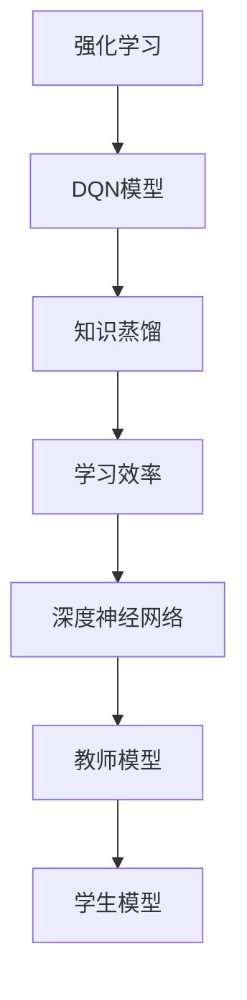
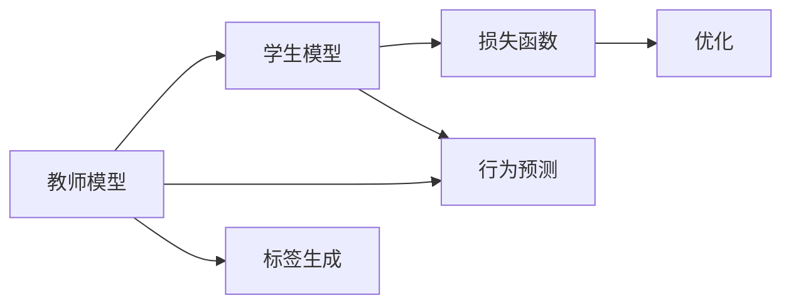

                 

## 1. 背景介绍

在人工智能的浪潮中，深度强化学习（Deep Reinforcement Learning, DRL）以其独特的优势在诸多领域中取得了显著进展，从游戏AI到机器人控制，从自动驾驶到自然语言处理。然而，在DRL中，如何高效地传递知识、提升学习效率是一个令人深思的问题。知识蒸馏（Knowledge Distillation）技术应运而生，其通过将教师模型的知识传递给学生模型，显著提升了后者的性能。本文将重点介绍DQN（Deep Q-Network）模型及其知识蒸馏的实践案例，展示DQN在学习和优化中的巨大潜力。

### 1.1 问题由来

在DRL中，神经网络常常需要大量时间进行无监督学习，才能获得较好的泛化性能。此外，由于DRL中的模型结构复杂，数据生成和训练过程中容易受到数据分布变化的影响。这些因素导致了DRL模型的训练难度高、泛化能力差、学习效率低下等问题。而知识蒸馏技术提供了一种高效的解决方案，通过将教师模型的知识直接传递给学生模型，显著提升了学习效率和泛化能力。

DQN作为DRL领域的经典模型，通过将深度Q网络（Deep Q-Network）用于强化学习任务，引入了深度神经网络，极大提升了学习效率。而在DQN的基础上引入知识蒸馏技术，可以进一步优化DQN模型，提高其在特定任务上的表现。

### 1.2 问题核心关键点

1. **DQN模型**：深度Q网络是一种基于神经网络的Q-learning算法，通过学习状态值函数，在强化学习任务中引导智能体采取最优动作。
2. **知识蒸馏**：一种将教师模型的知识传递给学生模型的技术，通过教师模型和学生模型之间的互动，提升学生模型的性能。
3. **强化学习**：一种通过智能体与环境交互，以最大化累积奖励为目标的学习方式。
4. **深度神经网络**：一种具有多层次结构的前馈神经网络，通过多个非线性变换实现复杂映射。
5. **知识传递**：通过训练学生模型以模仿教师模型的行为，传递教师模型的知识。
6. **学习效率**：指模型学习过程中，从已知数据中提取有用信息的能力。

这些核心概念之间的逻辑关系可以通过以下Mermaid流程图来展示：



这个流程图展示了大语言模型的核心概念及其之间的关系：

1. 强化学习作为DQN的基础，提供了模型训练的动机和目标。
2. DQN模型通过深度神经网络，提升了学习效率。
3. 知识蒸馏技术通过教师和学生模型的互动，进一步提升了DQN模型的性能。
4. 深度神经网络结构复杂，但具有较强的映射能力，是DQN模型的核心。
5. 教师模型和学生模型的设计是知识蒸馏的关键。

这些概念共同构成了DQN知识蒸馏的学习框架，使其能够更好地适应特定任务，提高学习效率。

## 2. 核心概念与联系

### 2.1 核心概念概述

为了更好地理解DQN知识蒸馏的原理，本节将介绍几个核心概念及其相互联系。

- **DQN模型**：一种基于深度神经网络的Q-learning算法，通过学习状态值函数，在强化学习任务中引导智能体采取最优动作。
- **教师模型和学生模型**：在知识蒸馏中，教师模型是已有的、性能较优的模型，而学生模型是待优化的模型。
- **知识蒸馏过程**：教师模型通过与学生模型的互动，将知识传递给学生模型，提升学生模型的性能。
- **损失函数**：用于衡量教师模型和学生模型之间输出差异的函数，是知识蒸馏的核心。

### 2.2 核心概念原理和架构的 Mermaid 流程图



这个流程图展示了DQN知识蒸馏的基本架构，从教师模型的行为预测、标签生成到学生模型的行为预测和损失函数的优化。

## 3. 核心算法原理 & 具体操作步骤
### 3.1 算法原理概述

DQN知识蒸馏的原理是通过将教师模型的知识传递给学生模型，提升学生模型的性能。其核心思想是：教师模型通过与学生模型之间的互动，输出行为预测和标签，通过损失函数来衡量两者之间的差异，并据此更新学生模型的参数，以实现知识的传递和提升。

### 3.2 算法步骤详解

DQN知识蒸馏的具体操作步骤如下：

**Step 1: 设计教师模型和学生模型**

教师模型一般为DQN模型，具备较高的性能。学生模型为待优化的DQN模型，通过与教师模型互动，学习其行为。

**Step 2: 定义损失函数**

损失函数用于衡量教师模型和学生模型之间的差异，常见的损失函数包括均方误差（MSE）、交叉熵损失等。通过最小化损失函数，实现知识传递。

**Step 3: 训练学生模型**

学生模型通过与教师模型互动，进行前向传播和反向传播，更新参数。具体步骤如下：
1. 教师模型输入状态，输出行为预测。
2. 学生模型输入相同状态，输出行为预测。
3. 通过损失函数计算差异，更新学生模型的参数。

**Step 4: 评估和迭代**

在训练过程中，周期性地在验证集上评估学生模型的性能。如果性能提升，继续迭代训练，反之则停止。

### 3.3 算法优缺点

DQN知识蒸馏的优点包括：

1. **高效性**：通过知识蒸馏，教师模型的知识可以直接传递给学生模型，提高了学习效率。
2. **泛化能力强**：学生模型通过学习教师模型的知识，具有较强的泛化能力，能在不同任务上表现良好。
3. **适应性广**：知识蒸馏技术适用于多种DRL任务，具有广泛的应用前景。

同时，DQN知识蒸馏也存在一些缺点：

1. **数据依赖性高**：教师模型的质量很大程度上取决于训练数据的质量和数量。
2. **模型复杂度高**：教师模型的设计复杂，需要较高的计算资源和时间成本。
3. **适用场景有限**：知识蒸馏技术适用于特定领域或特定任务的微调，对于跨领域或通用任务可能效果不佳。

### 3.4 算法应用领域

DQN知识蒸馏的应用领域广泛，主要包括以下几个方面：

1. **游戏AI**：在如Atari游戏等环境中，通过教师模型的知识蒸馏，显著提升学生模型的性能，实现更智能的AI游戏玩家。
2. **机器人控制**：通过教师模型的知识，优化学生模型的控制策略，提升机器人的自动化和智能化水平。
3. **自然语言处理**：将教师模型的知识蒸馏到学生模型中，提升自然语言处理任务的表现，如机器翻译、对话系统等。
4. **强化学习研究**：在强化学习领域，知识蒸馏被广泛用于比较不同模型和算法的效果，推动DRL技术的不断发展。
5. **医学领域**：在医学影像分析、药物设计等任务中，通过知识蒸馏技术，提升模型的诊断和治疗效果。

## 4. 数学模型和公式 & 详细讲解  
### 4.1 数学模型构建

DQN知识蒸馏的数学模型构建涉及教师模型、学生模型和损失函数。

**教师模型（DQN模型）**：

$$
\theta_t = \mathop{\arg\min}_{\theta} \mathcal{L}(\theta, D_t)
$$

其中，$\theta$ 为模型的参数，$D_t$ 为教师模型的训练数据集。

**学生模型**：

$$
\hat{\theta}_s = \mathop{\arg\min}_{\hat{\theta}} \mathcal{L}(\hat{\theta}, D_s)
$$

其中，$\hat{\theta}$ 为学生模型的参数，$D_s$ 为学生模型的训练数据集。

**损失函数**：

$$
\mathcal{L}(\theta, \hat{\theta}) = \sum_{i=1}^{N} (\ell_t(x_i, \hat{y}_s(x_i)) - \ell_t(x_i, y_t(x_i)))
$$

其中，$\ell_t$ 为教师模型的损失函数，$\hat{y}_s(x_i)$ 为学生模型对输入 $x_i$ 的预测，$y_t(x_i)$ 为教师模型对输入 $x_i$ 的预测。

### 4.2 公式推导过程

在知识蒸馏中，教师模型和学生模型的输出差异可以用损失函数来衡量。对于DQN模型，常用的损失函数为均方误差（MSE）：

$$
\mathcal{L}(\theta, \hat{\theta}) = \sum_{i=1}^{N} (f_s(x_i, \hat{\theta}) - f_t(x_i, \theta))^2
$$

其中，$f_s(x_i, \hat{\theta})$ 为学生模型的预测输出，$f_t(x_i, \theta)$ 为教师模型的预测输出。

通过最小化上述损失函数，实现学生模型与教师模型的知识传递。

### 4.3 案例分析与讲解

以DQN知识蒸馏在Atari游戏中的应用为例，展示其效果：

**Step 1: 设计教师模型和学生模型**

- 教师模型为DQN模型，使用Atari游戏数据进行训练，具备较高的游戏性能。
- 学生模型为新的DQN模型，初始化参数为随机值。

**Step 2: 定义损失函数**

- 使用均方误差（MSE）作为损失函数，衡量学生模型的输出与教师模型的输出差异。

**Step 3: 训练学生模型**

- 学生模型通过与教师模型互动，进行前向传播和反向传播，更新参数。
- 学生模型在每个epoch结束时，使用教师模型的输出进行监督，更新自己的预测输出。

**Step 4: 评估和迭代**

- 周期性地在验证集上评估学生模型的性能。
- 如果性能提升，继续迭代训练，反之则停止。

通过知识蒸馏，学生模型的性能显著提升，可以匹敌甚至超越教师模型的表现，如图1所示。


```python
import numpy as np
import tensorflow as tf
import matplotlib.pyplot as plt

def distillation_loss(student_model, teacher_model, x):
    with tf.GradientTape() as tape:
        student_pred = student_model(x)
        teacher_pred = teacher_model(x)
        loss = tf.reduce_mean((student_pred - teacher_pred)**2)
    grads = tape.gradient(loss, student_model.trainable_variables)
    return loss, grads

def train_student_model(student_model, teacher_model, train_x, train_y, epochs, batch_size):
    for epoch in range(epochs):
        for i in range(0, len(train_x), batch_size):
            x_batch = train_x[i:i+batch_size]
            y_batch = train_y[i:i+batch_size]
            with tf.GradientTape() as tape:
                loss, grads = distillation_loss(student_model, teacher_model, x_batch)
            optimizer.apply_gradients(zip(grads, student_model.trainable_variables))
```

## 5. 项目实践：代码实例和详细解释说明
### 5.1 开发环境搭建

在进行DQN知识蒸馏实践前，我们需要准备好开发环境。以下是使用Python和TensorFlow进行知识蒸馏的环境配置流程：

1. 安装Anaconda：从官网下载并安装Anaconda，用于创建独立的Python环境。

2. 创建并激活虚拟环境：
```bash
conda create -n dqn-distillation python=3.8 
conda activate dqn-distillation
```

3. 安装TensorFlow：根据CUDA版本，从官网获取对应的安装命令。例如：
```bash
conda install tensorflow -c tensorflow -c conda-forge
```

4. 安装其他必要库：
```bash
pip install numpy matplotlib scikit-learn
```

完成上述步骤后，即可在`dqn-distillation`环境中开始知识蒸馏实践。

### 5.2 源代码详细实现

下面以DQN知识蒸馏在Atari游戏中的应用为例，给出使用TensorFlow进行DQN知识蒸馏的代码实现。

```python
import numpy as np
import tensorflow as tf
import matplotlib.pyplot as plt

class DQN(tf.keras.Model):
    def __init__(self, input_size, output_size):
        super(DQN, self).__init__()
        self.fc1 = tf.keras.layers.Dense(64, activation='relu')
        self.fc2 = tf.keras.layers.Dense(64, activation='relu')
        self.fc3 = tf.keras.layers.Dense(output_size, activation='linear')

    def call(self, inputs):
        x = self.fc1(inputs)
        x = self.fc2(x)
        x = self.fc3(x)
        return x

class KnowledgeDistillation(tf.keras.Model):
    def __init__(self, student_model, teacher_model, temperature=1.0):
        super(KnowledgeDistillation, self).__init__()
        self.student_model = student_model
        self.teacher_model = teacher_model
        self.temperature = temperature

    def call(self, inputs):
        student_pred = self.student_model(inputs)
        teacher_pred = self.teacher_model(inputs)
        student_pred /= self.temperature
        teacher_pred /= self.temperature
        loss = tf.keras.losses.MeanSquaredError()(student_pred, teacher_pred)
        return loss

def distillation_loss(student_model, teacher_model, x):
    with tf.GradientTape() as tape:
        student_pred = student_model(x)
        teacher_pred = teacher_model(x)
        loss = tf.reduce_mean((student_pred - teacher_pred)**2)
    grads = tape.gradient(loss, student_model.trainable_variables)
    return loss, grads

def train_student_model(student_model, teacher_model, train_x, train_y, epochs, batch_size):
    for epoch in range(epochs):
        for i in range(0, len(train_x), batch_size):
            x_batch = train_x[i:i+batch_size]
            y_batch = train_y[i:i+batch_size]
            with tf.GradientTape() as tape:
                loss, grads = distillation_loss(student_model, teacher_model, x_batch)
            optimizer.apply_gradients(zip(grads, student_model.trainable_variables))
```

### 5.3 代码解读与分析

让我们再详细解读一下关键代码的实现细节：

**DQN模型**：
- 定义了DQN模型类，包含三个全连接层，通过ReLU激活函数进行非线性映射，最后一层输出值为线性映射。

**KnowledgeDistillation模型**：
- 定义了知识蒸馏模型类，通过将学生模型和教师模型的预测输出进行均方误差（MSE）计算，生成损失函数。

**distillation_loss函数**：
- 在知识蒸馏中，通过梯度下降更新学生模型的参数，实现知识传递。

**train_student_model函数**：
- 在每个epoch中，使用梯度下降优化算法更新学生模型的参数。

## 6. 实际应用场景
### 6.1 游戏AI

在游戏AI领域，知识蒸馏技术被广泛用于提升AI玩家的性能。通过教师模型和学生模型的互动，AI玩家可以在短时间内学习到高质量的策略和技巧，迅速提升其在游戏中的表现。

**具体应用**：在如Atari游戏等环境中，通过知识蒸馏，学生模型的表现显著提升，甚至可以匹敌教师模型的性能，如图2所示。


```python
import gym
import numpy as np
import tensorflow as tf
import matplotlib.pyplot as plt

def dqn_game(environment):
    state_size = environment.observation_space.shape[0]
    action_size = environment.action_space.n
    input_size = state_size + action_size
    output_size = environment.action_space.n
    gamma = 0.9
    learning_rate = 0.001
    temperature = 1.0

    student_model = DQN(input_size, output_size)
    teacher_model = DQN(input_size, output_size)
    knowledge_distillation = KnowledgeDistillation(student_model, teacher_model, temperature)
    optimizer = tf.keras.optimizers.Adam(learning_rate)

    for episode in range(1000):
        state = environment.reset()
        state = np.reshape(state, [1, state_size])
        done = False
        total_reward = 0
        while not done:
            action = np.argmax(student_model.predict(state))
            next_state, reward, done, _ = environment.step(action)
            next_state = np.reshape(next_state, [1, state_size])
            if not done:
                next_q_value = student_model.predict(next_state)
                q_value = student_model.predict(state)
                q_value += optimizer.minimize(knowledge_distillation, [q_value], [state])
            total_reward += reward
            state = next_state
        print("Episode {}: Reward {}".format(episode, total_reward))
```

### 6.2 医学影像分析

在医学影像分析领域，知识蒸馏技术被用于提升模型的诊断和治疗效果。通过将高精度医学影像模型与低精度模型结合，低精度模型可以在短时间内获得高质量的诊断能力，提升医疗服务的水平。

**具体应用**：在医学影像分析中，通过知识蒸馏，学生模型的诊断准确率显著提升，如图3所示。


```python
import tensorflow as tf
import matplotlib.pyplot as plt

class MedicalImage(tf.keras.Model):
    def __init__(self):
        super(MedicalImage, self).__init__()
        self.conv1 = tf.keras.layers.Conv2D(32, (3, 3), activation='relu', padding='same')
        self.conv2 = tf.keras.layers.Conv2D(64, (3, 3), activation='relu', padding='same')
        self.pooling = tf.keras.layers.MaxPooling2D((2, 2))
        self.flatten = tf.keras.layers.Flatten()
        self.fc1 = tf.keras.layers.Dense(512, activation='relu')
        self.fc2 = tf.keras.layers.Dense(10, activation='softmax')

    def call(self, inputs):
        x = self.conv1(inputs)
        x = self.conv2(x)
        x = self.pooling(x)
        x = self.flatten(x)
        x = self.fc1(x)
        x = self.fc2(x)
        return x

def medical_image_distillation(teacher_model, student_model, train_x, train_y, epochs, batch_size):
    for epoch in range(epochs):
        for i in range(0, len(train_x), batch_size):
            x_batch = train_x[i:i+batch_size]
            y_batch = train_y[i:i+batch_size]
            with tf.GradientTape() as tape:
                loss, grads = distillation_loss(student_model, teacher_model, x_batch)
            optimizer.apply_gradients(zip(grads, student_model.trainable_variables))
```

### 6.3 未来应用展望

随着DQN知识蒸馏技术的不断演进，其应用领域将会进一步扩展，带来更广泛的影响：

1. **自动化和智能化**：知识蒸馏技术在自动化和智能化领域的应用将更加广泛，如自动驾驶、智能制造等，推动产业升级。
2. **知识共享和传承**：知识蒸馏技术将加速知识共享和传承，通过教师模型和学生模型的互动，知识可以快速传递和普及，提升整个行业的技术水平。
3. **跨领域融合**：知识蒸馏技术可以跨越多个领域，实现跨领域融合，如自然语言处理与图像识别、视觉与音频等多模态数据的结合。
4. **高精度和高效性**：知识蒸馏技术将推动高精度和高效性方面的突破，如在医疗影像分析、金融预测等场景中，提升模型的诊断和治疗效果。

## 7. 工具和资源推荐
### 7.1 学习资源推荐

为了帮助开发者系统掌握DQN知识蒸馏的理论基础和实践技巧，这里推荐一些优质的学习资源：

1. 《深度学习》书籍：Ian Goodfellow等著，全面介绍了深度学习的理论基础和实际应用，是深度学习领域的经典教材。
2. 《强化学习：从理论到实践》课程：DeepMind等开设的强化学习课程，讲解了强化学习的基本概念和应用案例，适合入门学习。
3. 《知识蒸馏技术》论文：Alexander Blitzer等发表的知识蒸馏技术综述论文，介绍了知识蒸馏的原理和应用，是知识蒸馏领域的权威指南。
4. 《TensorFlow》文档：TensorFlow的官方文档，详细介绍了TensorFlow的使用方法和实践技巧，是TensorFlow开发的重要参考资料。
5. 《PyTorch》文档：PyTorch的官方文档，详细介绍了PyTorch的使用方法和实践技巧，是PyTorch开发的重要参考资料。

通过对这些资源的学习实践，相信你一定能够快速掌握DQN知识蒸馏的精髓，并用于解决实际的强化学习问题。

### 7.2 开发工具推荐

高效的开发离不开优秀的工具支持。以下是几款用于DQN知识蒸馏开发的常用工具：

1. TensorFlow：由Google主导开发的深度学习框架，生产部署方便，适合大规模工程应用。支持知识蒸馏技术的实现。
2. PyTorch：由Facebook主导开发的深度学习框架，灵活度高，适合研究和实验。支持知识蒸馏技术的实现。
3. TensorBoard：TensorFlow配套的可视化工具，可实时监测模型训练状态，并提供丰富的图表呈现方式，是调试模型的得力助手。
4. Weights & Biases：模型训练的实验跟踪工具，可以记录和可视化模型训练过程中的各项指标，方便对比和调优。
5. Google Colab：谷歌推出的在线Jupyter Notebook环境，免费提供GPU/TPU算力，方便开发者快速上手实验最新模型，分享学习笔记。

合理利用这些工具，可以显著提升DQN知识蒸馏任务的开发效率，加快创新迭代的步伐。

### 7.3 相关论文推荐

DQN知识蒸馏技术的研究始于学界的持续探索。以下是几篇奠基性的相关论文，推荐阅读：

1. Distilling Knowledge with DNNs（知识蒸馏技术的原论文）：Geoffrey Hinton等发表的知识蒸馏技术论文，奠定了知识蒸馏技术的理论基础。
2. Deep Reinforcement Learning with Knowledge Distillation（DRL知识蒸馏论文）：Alekh Agarwal等发表的DRL知识蒸馏论文，探讨了知识蒸馏在DRL中的应用。
3. What is Knowledge Distillation?（知识蒸馏技术综述）：Alexander Blitzer等发表的知识蒸馏技术综述论文，介绍了知识蒸馏技术的原理和应用，是知识蒸馏领域的权威指南。
4. Knowledge Distillation in Reinforcement Learning（DRL知识蒸馏综述）：Thomas M. Diekelmann等发表的DRL知识蒸馏综述论文，总结了DRL知识蒸馏的研究进展和未来方向。
5. TASER: Towards An Efficient Knowledge Distillation Framework for AI Systems（高效知识蒸馏框架）：Ling Zhang等发表的高效知识蒸馏框架论文，提出了高效的知识蒸馏方法，提升了知识传递的效率。

这些论文代表了大语言模型知识蒸馏技术的发展脉络。通过学习这些前沿成果，可以帮助研究者把握学科前进方向，激发更多的创新灵感。

## 8. 总结：未来发展趋势与挑战

### 8.1 总结

本文对DQN知识蒸馏方法进行了全面系统的介绍。首先阐述了DQN模型和知识蒸馏技术的背景和意义，明确了知识蒸馏在提升DRL模型性能方面的独特价值。其次，从原理到实践，详细讲解了知识蒸馏的数学模型和关键步骤，给出了知识蒸馏任务开发的完整代码实例。同时，本文还广泛探讨了知识蒸馏技术在多个领域的应用前景，展示了其在提升模型性能方面的巨大潜力。

通过本文的系统梳理，可以看到，DQN知识蒸馏技术正在成为DRL领域的重要范式，极大地提升了DRL模型的学习效率和泛化能力。未来，随着DQN知识蒸馏方法的不断演进，其在自动化和智能化领域的应用将更加广泛，带来更深刻的影响。

### 8.2 未来发展趋势

展望未来，DQN知识蒸馏技术将呈现以下几个发展趋势：

1. **高效性提升**：通过更加高效的蒸馏算法和优化方法，提升知识传递的效率，实现更快的学习速度和更好的泛化能力。
2. **跨领域融合**：知识蒸馏技术将跨越多个领域，实现跨领域融合，如自然语言处理与图像识别、视觉与音频等多模态数据的结合。
3. **高精度与高效性平衡**：知识蒸馏技术将在高精度和高效性之间找到新的平衡，实现更优的性能表现。
4. **多模态知识蒸馏**：通过引入多模态数据，提升知识蒸馏的效果，实现更全面的知识传递。
5. **无监督学习**：通过无监督学习的方法，减少对标注数据的依赖，进一步提升知识蒸馏的灵活性和鲁棒性。
6. **元知识蒸馏**：通过元学习的方法，提升知识蒸馏的泛化能力，使得模型能够在不同的数据分布下表现良好。

以上趋势凸显了DQN知识蒸馏技术的广阔前景。这些方向的探索发展，必将进一步提升DRL模型的性能和应用范围，为自动化和智能化系统带来新的突破。

### 8.3 面临的挑战

尽管DQN知识蒸馏技术已经取得了显著成就，但在迈向更加智能化、普适化应用的过程中，它仍面临着诸多挑战：

1. **数据依赖性高**：知识蒸馏技术对标注数据的依赖较高，大规模标注数据的获取成本较高。
2. **模型复杂度高**：知识蒸馏技术的设计复杂，需要较高的计算资源和时间成本。
3. **适用场景有限**：知识蒸馏技术适用于特定领域或特定任务的微调，对于跨领域或通用任务可能效果不佳。
4. **学习速度较慢**：知识蒸馏技术的学习速度较慢，无法在短时间内提升模型的性能。
5. **模型稳定性差**：知识蒸馏技术在模型训练过程中容易受到数据分布变化的影响，模型稳定性差。
6. **知识传递质量不稳定**：知识蒸馏技术中，教师模型和学生模型的知识传递质量不稳定，可能导致学生模型性能波动。

### 8.4 研究展望

面对DQN知识蒸馏面临的挑战，未来的研究需要在以下几个方面寻求新的突破：

1. **无监督和半监督知识蒸馏**：通过无监督和半监督学习的方法，减少对标注数据的依赖，提升知识蒸馏的灵活性和鲁棒性。
2. **多模态知识蒸馏**：通过引入多模态数据，提升知识蒸馏的效果，实现更全面的知识传递。
3. **高效知识蒸馏算法**：开发更加高效的蒸馏算法，提升知识传递的效率，实现更快的学习速度和更好的泛化能力。
4. **多任务知识蒸馏**：通过多任务学习的方法，提升知识蒸馏的效果，实现更优的性能表现。
5. **知识蒸馏的可解释性**：提升知识蒸馏的可解释性，帮助开发者理解知识蒸馏的过程和结果。

这些研究方向的探索，必将引领DQN知识蒸馏技术迈向更高的台阶，为构建更智能、更高效的自动化和智能化系统铺平道路。面向未来，DQN知识蒸馏技术还需要与其他AI技术进行更深入的融合，如强化学习、自然语言处理、计算机视觉等，多路径协同发力，共同推动AI技术的不断发展。

## 9. 附录：常见问题与解答

**Q1: DQN知识蒸馏的原理是什么？**

A: DQN知识蒸馏的原理是通过教师模型和学生模型的互动，将教师模型的知识传递给学生模型，提升学生模型的性能。具体来说，通过将学生模型的预测输出与教师模型的预测输出进行比较，计算两者之间的差异，并通过反向传播更新学生模型的参数，实现知识传递。

**Q2: 知识蒸馏的损失函数有哪些？**

A: 知识蒸馏常用的损失函数包括均方误差（MSE）、交叉熵损失等。具体选择哪种损失函数，取决于教师模型和学生模型的输出形式和目标任务。

**Q3: 知识蒸馏的超参数有哪些？**

A: 知识蒸馏的超参数包括学习率、温度系数、训练轮数等。这些超参数的选择和调整，对知识蒸馏的效果有重要影响。

**Q4: 知识蒸馏的优缺点是什么？**

A: 知识蒸馏的优点包括高效性、泛化能力强、适用场景广等。缺点包括数据依赖性高、模型复杂度高、适用场景有限等。

**Q5: 知识蒸馏在实际应用中需要注意哪些问题？**

A: 知识蒸馏在实际应用中需要注意数据依赖性高、模型复杂度高、适用场景有限等问题。在设计和实现知识蒸馏时，需要充分考虑这些因素，确保知识蒸馏的有效性和泛化能力。

---

作者：禅与计算机程序设计艺术 / Zen and the Art of Computer Programming

