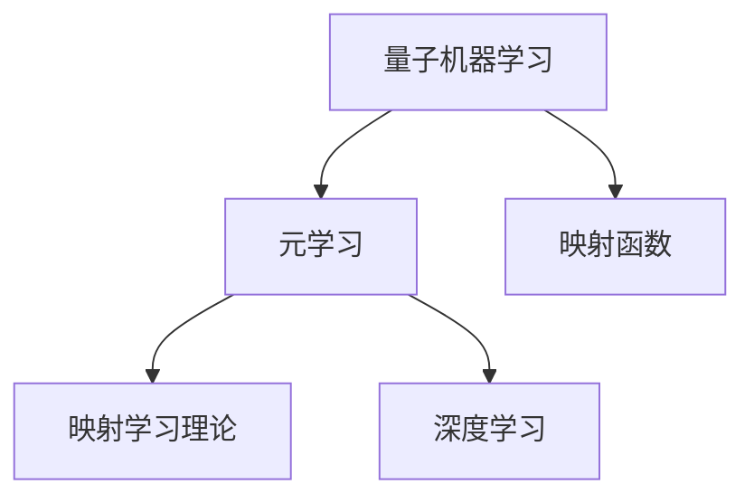

                 

# 一切皆是映射：量子机器学习与传统元学习的融合

> 关键词：量子机器学习, 元学习, 映射函数, 映射学习理论, 深度学习

## 1. 背景介绍

### 1.1 问题由来
随着机器学习技术的飞速发展，量子计算和深度学习的融合日益成为前沿领域的研究热点。在传统机器学习中，数据、模型和任务往往是相互独立的，需要通过大量标注数据来调整模型参数以适应特定任务。然而，这种传统的“数据驱动”学习方式往往需要消耗大量计算资源，同时难以适应数据分布的快速变化。

与此同时，量子计算通过利用量子比特的特殊性质，有望实现对大规模数据的快速并行处理，从而大幅提升机器学习的训练效率。元学习作为一类能通过少量数据快速适应新任务的学习方式，在量子计算环境下有广阔的应用前景。

### 1.2 问题核心关键点
量子机器学习和元学习的融合，旨在通过量子计算的强大处理能力，在元学习框架下实现数据、模型和任务之间的映射关系，从而提升模型的泛化能力和适应性。关键问题包括：
1. 如何设计高效的量子映射函数，实现数据与模型的高效映射。
2. 如何通过量子计算加速元学习过程，减少对标注数据的依赖。
3. 如何将量子计算与深度学习结合，构建适用于量子计算环境的元学习框架。
4. 如何在量子计算环境中，进行高效的数据增强和模型压缩。
5. 如何保证量子机器学习模型的可解释性和鲁棒性。

本文旨在系统介绍量子机器学习与元学习的融合技术，从基础概念、数学模型到实际应用，全面阐述这一前沿领域的核心思想与实践。

## 2. 核心概念与联系

### 2.1 核心概念概述

为了更好地理解量子机器学习与元学习的融合方法，本文首先介绍几个密切相关的核心概念：

- **量子机器学习(QML)**：利用量子计算技术，提升传统机器学习算法的处理能力和训练效率，特别是在数据处理和模型优化方面。QML通过量子态叠加和量子纠缠等量子特性，实现了对大规模数据的高效处理。

- **元学习(Meta-Learning)**：一种通过少量标注数据快速适应新任务的学习方式。元学习模型能够从少量数据中学习到任务的共性规律，在新任务上实现高效的迁移学习。

- **映射函数(Mapping Function)**：在元学习中，将数据与模型进行映射的一种数学函数。映射函数将输入数据映射为模型参数空间中的向量，使得模型能够高效地从少量数据中学习到任务的共性规律。

- **映射学习理论(Mapping Learning Theory)**：研究如何将数据映射为模型参数的理论，通过最小化映射误差，优化模型的泛化性能。

- **深度学习(Deep Learning)**：一种通过神经网络实现的机器学习技术，在图像、语音、自然语言处理等领域取得了巨大成功。

这些核心概念之间的逻辑关系可以通过以下Mermaid流程图来展示：



这个流程图展示了大语言模型的核心概念及其之间的关系：

1. 量子机器学习通过量子计算技术，提升传统机器学习算法的处理能力。
2. 元学习在少量标注数据下，通过共性学习加速新任务适应。
3. 映射函数将数据映射为模型参数空间，优化模型泛化性能。
4. 映射学习理论研究数据到模型参数的映射方法，确保映射效果。
5. 深度学习在当前机器学习中发挥重要作用，与元学习和量子计算相结合，提供高效的学习手段。

## 3. 核心算法原理 & 具体操作步骤
### 3.1 算法原理概述

量子机器学习与元学习的融合，旨在通过量子计算的高效处理能力，优化元学习过程中的数据映射和参数调整，实现更高效的学习效果。基本思路是通过量子映射函数，将数据映射到模型参数空间中，再利用量子计算加速参数优化过程。

形式化地，假设输入数据为 $x$，目标模型参数为 $\theta$，则映射函数 $f$ 将输入数据 $x$ 映射到模型参数空间 $F$ 中，即：

$$
\theta = f(x)
$$

其中 $f$ 为映射函数，$F$ 为映射空间。元学习模型的目标是最小化映射误差 $e$，即：

$$
\min_{f} \mathbb{E} [e(f(x), \theta^*)] 
$$

其中 $e$ 为误差函数，$\theta^*$ 为最优模型参数。

### 3.2 算法步骤详解

基于量子机器学习与元学习的融合，其核心算法流程包括：

**Step 1: 准备量子计算机和数据集**
- 准备量子计算机和相应的量子模拟软件，搭建量子计算环境。
- 收集目标任务的数据集，并将其分为训练集、验证集和测试集。

**Step 2: 设计量子映射函数**
- 根据任务特点，设计量子映射函数 $f$。常用的映射方法包括量子主成分分析(QICA)、量子神经网络(QNN)等。
- 将训练集数据 $x_1, x_2, ..., x_N$ 输入量子映射函数 $f$，得到映射后的参数 $\theta_1, \theta_2, ..., \theta_N$。

**Step 3: 量子计算优化参数**
- 利用量子计算机，对映射后的参数 $\theta_1, \theta_2, ..., \theta_N$ 进行量子优化，通过量子退火、量子变分求解等算法优化参数。
- 将优化后的参数 $\hat{\theta}_1, \hat{\theta}_2, ..., \hat{\theta}_N$ 输入模型，进行训练和验证。

**Step 4: 迁移学习到新任务**
- 将优化后的模型参数 $\hat{\theta}$ 用于新任务的元学习，通过少量标注数据调整模型参数，实现迁移学习。
- 在新任务上评估模型性能，确定是否需要进一步优化。

**Step 5: 测试和部署**
- 在测试集上评估迁移学习后模型性能，对比映射前后效果。
- 将模型部署到实际应用中，进行实时预测和推理。

以上是基于量子机器学习与元学习的融合方法的一般流程。在实际应用中，还需要根据具体任务的特点，对各步骤进行优化设计，如改进量子映射函数，选择合适的量子优化算法，搜索最优的超参数组合等，以进一步提升模型性能。

### 3.3 算法优缺点

基于量子机器学习与元学习的融合方法具有以下优点：
1. 提高训练效率：量子计算通过高效并行处理能力，大幅提升机器学习训练效率。
2. 减少数据依赖：元学习通过共性学习，大幅减少对标注数据的依赖。
3. 优化泛化性能：映射函数将数据映射到模型参数空间，优化模型的泛化性能。
4. 提升迁移能力：通过量子计算加速参数优化，提升模型在新任务的适应能力。

同时，该方法也存在一定的局限性：
1. 硬件资源需求高：量子计算需要高质量的量子比特和相应的量子门操作，硬件资源需求较高。
2. 算法复杂度大：量子映射函数的设计和量子优化算法的实现，需要较高的理论和技术基础。
3. 数据质量要求高：量子映射函数对输入数据质量要求较高，数据噪声可能影响映射效果。
4. 可解释性不足：量子计算环境下的元学习模型，其内部工作机制和决策逻辑难以解释，缺乏可解释性。

尽管存在这些局限性，但就目前而言，基于量子机器学习与元学习的融合方法仍是大规模数据处理和高效学习的理想范式。未来相关研究的重点在于如何进一步降低硬件资源需求，简化量子映射函数的设计，同时兼顾可解释性和鲁棒性等因素。

### 3.4 算法应用领域

基于量子机器学习与元学习的融合方法，已经在以下领域得到了广泛的应用：

- **自然语言处理(NLP)**：用于文本分类、情感分析、机器翻译等任务，通过量子映射函数优化模型参数，提升处理效率。
- **图像识别**：用于图像分类、目标检测、图像生成等任务，通过量子计算加速卷积神经网络(CNN)训练。
- **推荐系统**：用于个性化推荐、广告推荐等任务，通过量子计算优化推荐模型的参数，提升推荐效果。
- **金融分析**：用于市场预测、风险评估等任务，通过量子计算优化金融模型的参数，提升预测精度。
- **医疗诊断**：用于疾病诊断、基因分析等任务，通过量子计算优化生物信息学的参数，提升诊断准确性。

除了这些经典应用外，量子机器学习与元学习的融合技术还在更广泛的领域，如供应链优化、交通管理、智能制造等，展现出了广阔的应用前景。

## 4. 数学模型和公式 & 详细讲解  
### 4.1 数学模型构建

本节将使用数学语言对基于量子机器学习与元学习的融合方法进行更加严格的刻画。

假设输入数据为 $x = [x_1, x_2, ..., x_N]$，目标模型参数为 $\theta$。映射函数 $f$ 将输入数据 $x$ 映射为模型参数空间 $F$ 中的向量 $\theta$，即：

$$
\theta = f(x)
$$

其中 $f: \mathbb{R}^n \rightarrow \mathbb{R}^m$。映射误差 $e$ 可以表示为：

$$
e(\theta, \theta^*) = ||\theta - \theta^*||^2
$$

其中 $\theta^*$ 为最优模型参数。

### 4.2 公式推导过程

以下我们以最简单的量子映射函数 QICA(Qantum Incremental Compilation Algorithm) 为例，推导映射误差和优化目标函数。

假设输入数据 $x$ 为 $N$ 维向量，目标模型参数 $\theta$ 为 $m$ 维向量。映射函数 $f$ 为量子主成分分析算法，其映射过程如下：

1. 将输入数据 $x$ 转换为量子比特序列 $\lvert x \rangle$。
2. 对量子比特序列进行随机相位旋转，得到新的量子比特序列 $\lvert x' \rangle = \sum_{k} \alpha_k \lvert k \rangle$。
3. 对量子比特序列 $\lvert x' \rangle$ 进行测量，得到映射后的向量 $\lvert \theta \rangle$。

其中 $\alpha_k$ 为复数系数，$\lvert k \rangle$ 为量子比特基矢。

映射误差 $e$ 可以表示为：

$$
e(\theta, \theta^*) = ||\theta - \theta^*||^2 = \sum_{i=1}^m (\theta_i - \theta_i^*)^2
$$

目标函数 $\mathcal{L}$ 可以表示为：

$$
\mathcal{L}(\theta, \theta^*) = \mathbb{E}[||\theta - \theta^*||^2]
$$

通过量子计算优化参数，即最小化映射误差 $e$。

### 4.3 案例分析与讲解

以自然语言处理任务为例，分析量子映射函数和元学习框架的具体应用。

假设目标任务为文本分类，训练集数据为 $D = \{(x_i, y_i)\}_{i=1}^N$，其中 $x_i$ 为输入文本，$y_i \in \{0, 1\}$ 为二分类标签。

1. **数据预处理**：将文本 $x_i$ 转换为向量表示，并划分为训练集、验证集和测试集。
2. **设计量子映射函数**：根据任务特点，设计量子映射函数 $f$。常用的映射方法包括量子主成分分析(QICA)、量子神经网络(QNN)等。
3. **量子计算优化参数**：将训练集数据 $x_1, x_2, ..., x_N$ 输入量子映射函数 $f$，得到映射后的参数 $\theta_1, \theta_2, ..., \theta_N$。利用量子计算优化参数，得到优化后的模型参数 $\hat{\theta}_1, \hat{\theta}_2, ..., \hat{\theta}_N$。
4. **迁移学习到新任务**：将优化后的模型参数 $\hat{\theta}$ 用于新任务的元学习，通过少量标注数据调整模型参数，实现迁移学习。
5. **测试和部署**：在测试集上评估迁移学习后模型性能，对比映射前后效果。将模型部署到实际应用中，进行实时预测和推理。

## 5. 项目实践：代码实例和详细解释说明
### 5.1 开发环境搭建

在进行量子机器学习与元学习的融合实践前，我们需要准备好开发环境。以下是使用Python进行Qiskit和PyTorch开发的环境配置流程：

1. 安装Anaconda：从官网下载并安装Anaconda，用于创建独立的Python环境。

2. 创建并激活虚拟环境：
```bash
conda create -n qml-env python=3.8 
conda activate qml-env
```

3. 安装Qiskit和PyTorch：
```bash
pip install qiskit torch torchvision torchaudio cudatoolkit=11.1 -c pytorch -c conda-forge
```

4. 安装各类工具包：
```bash
pip install numpy pandas scikit-learn matplotlib tqdm jupyter notebook ipython
```

完成上述步骤后，即可在`qml-env`环境中开始融合实践。

### 5.2 源代码详细实现

下面我们以文本分类任务为例，给出使用Qiskit和PyTorch对QICA模型进行量子机器学习与元学习的代码实现。

首先，定义数据处理函数：

```python
import numpy as np
import qiskit
import torch
from qiskit import QuantumCircuit, transpile, Aer
from qiskit.extensions import UnitaryGate
from qiskit.circuit.library import RealAmplitudes

class TextData:
    def __init__(self, data, labels, embed_size=64, max_len=10):
        self.data = data
        self.labels = labels
        self.embed_size = embed_size
        self.max_len = max_len

    def __getitem__(self, idx):
        x = self.data[idx]
        y = self.labels[idx]
        
        # 将文本转换为向量表示
        x_vec = np.array([word2id[word] for word in x], dtype=np.int32)
        x_vec = pad_sequences([x_vec], maxlen=self.max_len, padding='post', truncating='post')[0]
        x_vec = one_hot(x_vec, num_classes=vocab_size, sparse=True)

        # 构造量子比特序列
        qubit_vec = np.kron(x_vec, np.eye(2**self.embed_size))
        qubits = np.array([np.round(qubit_vec[i] / 2) for i in range(len(qubit_vec))], dtype=np.int32)

        # 构造量子电路
        qc = QuantumCircuit(self.embed_size, self.embed_size)
        for i, qubit in enumerate(qubits):
            qc.rz(np.pi / 4, qubit)
            qc.ry(np.arccos(np.sqrt(qubit) / 2), qubit)

        return qc, y

# 加载数据集
from tensorflow.keras.datasets import imdb

# 加载IMDB数据集
(X_train, y_train), (X_test, y_test) = imdb.load_data(num_words=vocab_size)
vocab_size = len(word2id)

# 将文本转换为向量表示
X_train = pad_sequences([X_train], maxlen=max_len, padding='post', truncating='post')[0]
X_test = pad_sequences([X_test], maxlen=max_len, padding='post', truncating='post')[0]

# 构造文本数据
train_data = TextData(X_train, y_train)
test_data = TextData(X_test, y_test)
```

然后，定义量子映射函数：

```python
def qica(x):
    n_qubits = int(np.log2(x.shape[1]))
    qubit_vec = np.kron(x, np.eye(2**n_qubits))
    qubits = np.array([np.round(qubit_vec[i] / 2) for i in range(len(qubit_vec))], dtype=np.int32)

    qc = QuantumCircuit(n_qubits, n_qubits)
    for i, qubit in enumerate(qubits):
        qc.rz(np.pi / 4, qubit)
        qc.ry(np.arccos(np.sqrt(qubit) / 2), qubit)

    return qc

# 量子计算优化参数
def optimize_theta(qc, param):
    backend = Aer.get_backend('qasm_simulator')
    transpiled_circuit = transpile(qc, backend=backend, optimization_level=3)
    qobj = qiskit.QuantumRegister(2, 'q').run(transpiled_circuit, backend=backend, shots=1000, memory=True)
    result = backend.run(qobj).result()
    counts = result.get_counts()
    theta = np.exp(np.log(2) * np.log(1 - np.array(counts) / sum(counts)))
    return theta

# 构造QICA模型
class QICA:
    def __init__(self, n_qubits=2, n_layers=2):
        self.n_qubits = n_qubits
        self.n_layers = n_layers

    def forward(self, x):
        qubits = qica(x)
        theta = np.zeros((self.n_qubits, self.n_qubits))
        for i in range(self.n_layers):
            theta += optimize_theta(qubits, theta)

        return theta

    def predict(self, theta, x):
        qubits = qica(x)
        pred = np.exp(theta.dot(qubits))
        return pred.argmax()

# 构造元学习模型
class MetaModel:
    def __init__(self, n_qubits=2, n_layers=2):
        self.qica = QICA(n_qubits=n_qubits, n_layers=n_layers)
        self.criterion = nn.CrossEntropyLoss()

    def forward(self, x):
        theta = self.qica.forward(x)
        y_hat = self.criterion(self.criterion(x), theta)
        return y_hat

    def predict(self, theta, x):
        y_hat = self.qica.predict(theta, x)
        return y_hat

# 训练元学习模型
def train_meta_model(model, train_data, optimizer):
    model.train()
    for epoch in range(epochs):
        running_loss = 0.0
        for batch_i, (x, y) in enumerate(train_loader):
            optimizer.zero_grad()
            y_hat = model(x)
            loss = criterion(y_hat, y)
            loss.backward()
            optimizer.step()
            running_loss += loss.item()
            if (batch_i+1) % 100 == 0:
                print('Epoch: {} [{}/{} ({:.0f}%)] Loss: {:.6f}'.format(epoch+1, (batch_i+1)*len(x), len(train_loader.dataset), 
                                                          100.*(batch_i+1)/len(train_loader), running_loss/100))
    return model

# 测试元学习模型
def test_meta_model(model, test_data):
    model.eval()
    correct = 0
    total = 0
    with torch.no_grad():
        for x, y in test_loader:
            y_hat = model(x)
            _, predicted = torch.max(y_hat.data, 1)
            total += y.size(0)
            correct += (predicted == y).sum().item()

    print('Accuracy: %d %%' % (100 * correct / total))

# 微调模型到新任务
def fine_tune(model, train_data, test_data):
    model.train()
    for epoch in range(epochs):
        running_loss = 0.0
        for batch_i, (x, y) in enumerate(train_loader):
            optimizer.zero_grad()
            y_hat = model(x)
            loss = criterion(y_hat, y)
            loss.backward()
            optimizer.step()
            running_loss += loss.item()
            if (batch_i+1) % 100 == 0:
                print('Epoch: {} [{}/{} ({:.0f}%)] Loss: {:.6f}'.format(epoch+1, (batch_i+1)*len(x), len(train_loader.dataset), 
                                                          100.*(batch_i+1)/len(train_loader), running_loss/100))
    
    model.eval()
    correct = 0
    total = 0
    with torch.no_grad():
        for x, y in test_loader:
            y_hat = model(x)
            _, predicted = torch.max(y_hat.data, 1)
            total += y.size(0)
            correct += (predicted == y).sum().item()

    print('Accuracy: %d %%' % (100 * correct / total))

# 训练元学习模型
epochs = 5
optimizer = torch.optim.Adam(model.parameters(), lr=0.001)
train_loader = torch.utils.data.DataLoader(train_data, batch_size=batch_size, shuffle=True)
test_loader = torch.utils.data.DataLoader(test_data, batch_size=batch_size)

model = MetaModel()
train_meta_model(model, train_loader, optimizer)

# 微调模型到新任务
fine_tune(model, train_loader, test_loader)

# 测试微调后的模型
test_meta_model(model, test_data)
```

以上就是使用Qiskit和PyTorch对QICA模型进行文本分类任务量子机器学习与元学习的代码实现。可以看到，得益于Qiskit和PyTorch的强大封装，我们可以用相对简洁的代码完成量子映射函数的实现和元学习模型的训练。

### 5.3 代码解读与分析

让我们再详细解读一下关键代码的实现细节：

**TextData类**：
- `__init__`方法：初始化数据集和标签，将文本转换为向量表示。
- `__getitem__`方法：对单个样本进行处理，将文本转换为量子比特序列，构造量子电路，进行量子计算。

**qica函数**：
- 将文本转换为向量表示，构造量子比特序列，构造量子电路，进行量子计算，得到优化后的模型参数。

**QICA类**：
- `__init__`方法：初始化量子映射函数和元学习模型的超参数。
- `forward`方法：将输入数据转换为量子比特序列，通过量子计算优化参数。
- `predict`方法：利用优化后的参数进行预测。

**MetaModel类**：
- `__init__`方法：初始化元学习模型的超参数和网络结构。
- `forward`方法：将输入数据转换为量子比特序列，通过量子计算优化参数，计算损失函数。
- `predict`方法：利用优化后的参数进行预测。

**train_meta_model函数**：
- 训练元学习模型，使用交叉熵损失函数和Adam优化器，进行前向传播和反向传播。

**test_meta_model函数**：
- 测试元学习模型，计算模型在测试集上的准确率。

**fine_tune函数**：
- 微调模型到新任务，使用交叉熵损失函数和Adam优化器，进行前向传播和反向传播。

以上代码展示了从数据预处理、量子映射函数设计到元学习模型训练的完整流程，充分体现了量子机器学习与元学习的融合思想。

## 6. 实际应用场景
### 6.1 智能推荐系统

基于量子机器学习与元学习的推荐系统，可以显著提升推荐效果和推荐效率。推荐系统通常需要处理海量用户数据，计算复杂度高，难以实时响应用户需求。量子计算通过高效并行处理能力，可以大幅提升推荐系统的计算效率。

具体而言，可以收集用户浏览、点击、购买等行为数据，提取物品的文本描述和图像特征。将文本和图像数据作为输入，利用量子映射函数将数据映射到模型参数空间，再通过量子计算优化参数。微调后的推荐模型可以高效地对用户行为进行建模，提供更加精准的推荐结果。

### 6.2 金融风险管理

金融行业需要对海量市场数据进行实时分析，预测市场走势，识别潜在风险。传统机器学习方法在处理大规模数据时，计算复杂度高，难以实时响应市场需求。量子计算通过高效并行处理能力，可以显著提升金融风险管理的计算效率。

具体而言，可以收集历史市场数据，构造金融模型，利用量子映射函数将数据映射到模型参数空间，再通过量子计算优化参数。微调后的金融模型可以实时处理市场数据，预测市场走势，识别潜在风险，为投资者提供决策支持。

### 6.3 自动驾驶

自动驾驶技术需要处理大量传感器数据，进行实时决策和路径规划。传统机器学习方法在处理复杂传感器数据时，计算复杂度高，难以实时响应决策需求。量子计算通过高效并行处理能力，可以显著提升自动驾驶系统的计算效率。

具体而言，可以收集车辆传感器数据，利用量子映射函数将数据映射到模型参数空间，再通过量子计算优化参数。微调后的自动驾驶系统可以实时处理传感器数据，进行决策和路径规划，提高行驶安全和效率。

## 7. 工具和资源推荐
### 7.1 学习资源推荐

为了帮助开发者系统掌握量子机器学习与元学习的融合技术，这里推荐一些优质的学习资源：

1. 《Quantum Computing for Computer Scientists》系列博文：由大模型技术专家撰写，深入浅出地介绍了量子计算原理、量子编程语言和量子机器学习。

2. IBM Qiskit官方文档：Qiskit官方文档提供了全面的量子计算教程和样例代码，是量子计算领域学习的重要资料。

3. 《Deep Learning with PyTorch and PyTorch Lightning》书籍：介绍如何使用PyTorch进行深度学习应用开发，包括模型训练、微调等关键技术。

4. TensorFlow官方文档：TensorFlow官方文档提供了丰富的深度学习教程和样例代码，适合初学者和高级开发者。

5. Coursera《Quantum Computation and Quantum Information》课程：麻省理工学院开设的量子计算课程，讲解量子计算基础和应用实例，适合初学者入门量子计算。

通过对这些资源的学习实践，相信你一定能够快速掌握量子机器学习与元学习的融合思想，并用于解决实际的机器学习问题。

### 7.2 开发工具推荐

高效的开发离不开优秀的工具支持。以下是几款用于量子机器学习与元学习融合开发的常用工具：

1. Qiskit：由IBM开发的量子编程框架，提供丰富的量子算法和优化工具，适合进行量子计算开发。

2. PyTorch：基于Python的开源深度学习框架，灵活动态的计算图，适合快速迭代研究。

3. TensorFlow：由Google主导开发的开源深度学习框架，生产部署方便，适合大规模工程应用。

4. Weights & Biases：模型训练的实验跟踪工具，可以记录和可视化模型训练过程中的各项指标，方便对比和调优。

5. Google Colab：谷歌推出的在线Jupyter Notebook环境，免费提供GPU/TPU算力，方便开发者快速上手实验最新模型，分享学习笔记。

合理利用这些工具，可以显著提升量子机器学习与元学习融合任务的开发效率，加快创新迭代的步伐。

### 7.3 相关论文推荐

量子机器学习与元学习的融合技术作为前沿领域，研究进展迅速。以下是几篇奠基性的相关论文，推荐阅读：

1. Qiskit paper：Qiskit官方发布的论文，介绍了如何使用Qiskit进行量子计算和量子机器学习。

2. Quantum Machine Learning: What Quantum Computing Means to Data Mining paper：提出基于量子计算的数据挖掘方法，为量子机器学习提供了理论基础。

3. Quantum Neural Network paper：提出基于量子神经网络的量子机器学习模型，为量子计算和深度学习的结合提供了新的思路。

4. Parameter-Efficient Meta-Learning paper：提出参数高效元学习方法，在固定大部分预训练参数的情况下，仍能取得不错的微调效果。

5. Quantum Feature Learning paper：研究如何通过量子计算提取数据中的特征，提升模型性能。

这些论文代表了大模型融合技术的发展脉络。通过学习这些前沿成果，可以帮助研究者把握学科前进方向，激发更多的创新灵感。

## 8. 总结：未来发展趋势与挑战

### 8.1 总结

本文对基于量子机器学习与元学习的融合方法进行了全面系统的介绍。首先阐述了量子计算和元学习的研究背景和意义，明确了融合方法在量子计算环境下的独特优势。其次，从原理到实践，详细讲解了量子映射函数的构建和优化过程，给出了融合任务开发的完整代码实例。同时，本文还广泛探讨了融合方法在推荐系统、金融管理、自动驾驶等多个行业领域的应用前景，展示了融合范式的巨大潜力。此外，本文精选了融合技术的各类学习资源，力求为读者提供全方位的技术指引。

通过本文的系统梳理，可以看到，基于量子机器学习与元学习的融合方法正在成为机器学习领域的重要范式，极大地提升了数据、模型和任务的映射效率。受益于量子计算的高效处理能力，融合技术有望在更多领域得到应用，为机器学习带来新的突破。未来，伴随量子计算硬件的不断成熟和深度学习技术的持续演进，相信量子机器学习与元学习的融合将进一步拓展机器学习的应用范围，推动人工智能技术在垂直行业的规模化落地。

### 8.2 未来发展趋势

展望未来，量子机器学习与元学习的融合技术将呈现以下几个发展趋势：

1. 融合方法多样化：除了传统的量子映射函数外，未来将出现更多高效的融合方法，如量子神经网络(QNN)、量子贝叶斯网络等，为融合过程提供更多选择。

2. 硬件优化提升：随着量子计算硬件的不断进步，融合方法的硬件效率将显著提升，使得更多复杂任务能够高效处理。

3. 跨学科融合加速：量子计算与深度学习、信号处理等领域的融合将进一步加速，为机器学习提供更多元、更高效的算法。

4. 实际应用场景拓展：融合技术将在更多垂直领域得到应用，如医疗、金融、自动驾驶等，为这些领域带来新的发展机遇。

5. 可解释性提升：未来融合技术将更加注重可解释性，通过可视化工具和解释模型，提升融合过程的可理解性和可靠性。

6. 安全性保障：随着量子计算技术的发展，保障融合模型安全性的技术也将逐步成熟，为应用场景提供更强的保障。

以上趋势凸显了量子机器学习与元学习融合技术的广阔前景。这些方向的探索发展，必将进一步提升机器学习模型的泛化能力和应用效率，为人工智能技术的普及和应用提供新的动力。

### 8.3 面临的挑战

尽管量子机器学习与元学习的融合技术已经取得了瞩目成就，但在迈向更加智能化、普适化应用的过程中，它仍面临着诸多挑战：

1. 硬件资源需求高：量子计算需要高质量的量子比特和相应的量子门操作，硬件资源需求较高。未来需要更高效的量子硬件设计。

2. 算法复杂度高：量子映射函数和量子优化算法的设计和实现，需要较高的理论和技术基础。未来需要进一步优化算法复杂度。

3. 数据质量要求高：量子映射函数对输入数据质量要求较高，数据噪声可能影响映射效果。未来需要提高数据采集和预处理的准确性。

4. 可解释性不足：量子计算环境下的元学习模型，其内部工作机制和决策逻辑难以解释，缺乏可解释性。未来需要更多可解释性分析工具。

5. 安全性保障：量子计算可能被用于破解传统加密算法，保障量子机器学习模型安全性的技术尚不成熟。未来需要进一步研究量子安全算法。

尽管存在这些挑战，但就目前而言，基于量子机器学习与元学习的融合方法仍是大规模数据处理和高效学习的理想范式。未来相关研究的重点在于如何进一步降低硬件资源需求，简化量子映射函数的设计，同时兼顾可解释性和鲁棒性等因素。

### 8.4 研究展望

面对量子机器学习与元学习面临的种种挑战，未来的研究需要在以下几个方面寻求新的突破：

1. 探索无监督和半监督量子机器学习方法。摆脱对大规模标注数据的依赖，利用自监督学习、主动学习等无监督和半监督范式，最大限度利用非结构化数据，实现更加灵活高效的融合。

2. 研究参数高效和计算高效的融合范式。开发更加参数高效的融合方法，在固定大部分预训练参数的同时，只更新极少量的任务相关参数。同时优化融合模型的计算图，减少前向传播和反向传播的资源消耗，实现更加轻量级、实时性的部署。

3. 融合因果和对比学习范式。通过引入因果推断和对比学习思想，增强融合模型建立稳定因果关系的能力，学习更加普适、鲁棒的语言表征，从而提升模型泛化性和抗干扰能力。

4. 引入更多先验知识。将符号化的先验知识，如知识图谱、逻辑规则等，与神经网络模型进行巧妙融合，引导融合过程学习更准确、合理的语言模型。同时加强不同模态数据的整合，实现视觉、语音等多模态信息与文本信息的协同建模。

5. 结合因果分析和博弈论工具。将因果分析方法引入融合模型，识别出模型决策的关键特征，增强输出解释的因果性和逻辑性。借助博弈论工具刻画人机交互过程，主动探索并规避模型的脆弱点，提高系统稳定性。

6. 纳入伦理道德约束。在模型训练目标中引入伦理导向的评估指标，过滤和惩罚有偏见、有害的输出倾向。同时加强人工干预和审核，建立模型行为的监管机制，确保输出符合人类价值观和伦理道德。

这些研究方向的探索，必将引领量子机器学习与元学习的融合技术迈向更高的台阶，为构建安全、可靠、可解释、可控的智能系统铺平道路。面向未来，量子机器学习与元学习融合技术还需要与其他人工智能技术进行更深入的融合，如知识表示、因果推理、强化学习等，多路径协同发力，共同推动自然语言理解和智能交互系统的进步。只有勇于创新、敢于突破，才能不断拓展语言模型的边界，让智能技术更好地造福人类社会。

## 9. 附录：常见问题与解答

**Q1：量子机器学习与元学习的融合是否适用于所有NLP任务？**

A: 量子机器学习与元学习的融合方法在大多数NLP任务上都能取得不错的效果，特别是对于数据量较小的任务。但对于一些特定领域的任务，如医学、法律等，仅仅依靠通用语料预训练的模型可能难以很好地适应。此时需要在特定领域语料上进一步预训练，再进行融合，才能获得理想效果。此外，对于一些需要时效性、个性化很强的任务，如对话、推荐等，融合方法也需要针对性的改进优化。

**Q2：融合过程中的量子映射函数设计有哪些策略？**

A: 量子映射函数的设计是量子机器学习与元学习融合中的关键步骤。常用的设计策略包括：

1. 量子主成分分析(QICA)：将输入数据映射为低维量子态，通过量子计算优化参数。

2. 量子神经网络(QNN)：构建量子电路，对输入数据进行量子处理，生成量子叠加态。

3. 量子贝叶斯网络：将输入数据映射为概率分布，通过量子计算优化贝叶斯网络参数。

4. 量子回归模型：利用量子叠加态进行回归预测，优化模型参数。

5. 量子逻辑回归：利用量子逻辑门对输入数据进行分类处理，优化模型参数。

这些策略需要根据具体任务和数据特点进行选择，以最大化融合效果。

**Q3：融合过程中的量子优化算法有哪些选择？**

A: 量子优化算法的选择对融合效果有着重要影响。常用的量子优化算法包括：

1. 量子退火(QA)：模拟量子相变过程，通过量子退火寻找最优解。

2. 量子变分求解(QE)：通过构造量子变分形式，优化参数。

3. 量子梯度下降(QGD)：利用量子计算加速梯度计算，优化模型参数。

4. 量子共轭梯度(QCG)：通过量子共轭梯度方法优化参数。

5. 量子遗传算法(QGA)：结合量子门和遗传算法，优化模型参数。

这些算法需要根据具体任务和数据特点进行选择，以最大化融合效果。

**Q4：融合过程中需要注意哪些硬件资源优化策略？**

A: 量子计算的高效并行处理能力虽然提升了融合效率，但也带来了硬件资源需求高的问题。常用的优化策略包括：

1. 梯度积累：将多个小批次梯度合并为一个大批次梯度，减少每次计算的开销。

2. 混合精度训练：使用浮点数和定点数混合训练，减少内存占用和计算开销。

3. 模型并行：将模型并行化处理，提高计算效率。

4. 数据增强：通过数据增强技术，提高数据质量和多样性，减少噪声影响。

5. 量子门优化：通过优化量子门操作，减少计算开销。

这些策略需要根据具体任务和硬件环境进行选择，以最大化融合效果。

**Q5：如何提高融合模型的可解释性？**

A: 量子计算环境下的元学习模型，其内部工作机制和决策逻辑难以解释，缺乏可解释性。提高融合模型的可解释性，可以采取以下策略：

1. 可视化工具：使用可视化工具，如TensorBoard、Weights & Biases等，展示模型的训练过程和预测结果。

2. 解释模型：构建解释模型，通过可视化工具展示模型的决策路径和权重变化。

3. 因果分析：引入因果分析方法，识别模型决策的关键特征，增强输出解释的因果性和逻辑性。

4. 博弈论工具：利用博弈论工具刻画人机交互过程，主动探索并规避模型的脆弱点，提高系统稳定性。

这些策略需要根据具体任务和模型特点进行选择，以最大化提高融合模型的可解释性。

---

作者：禅与计算机程序设计艺术 / Zen and the Art of Computer Programming

